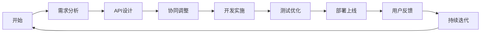
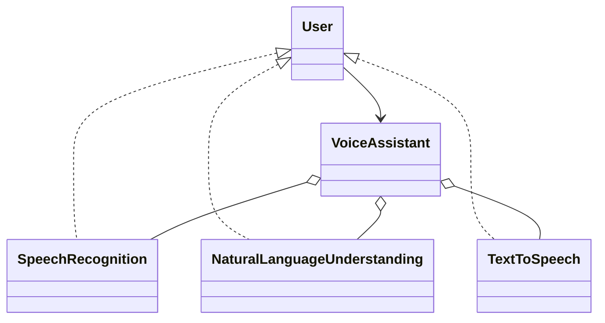
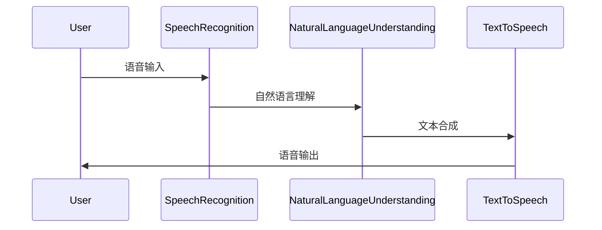
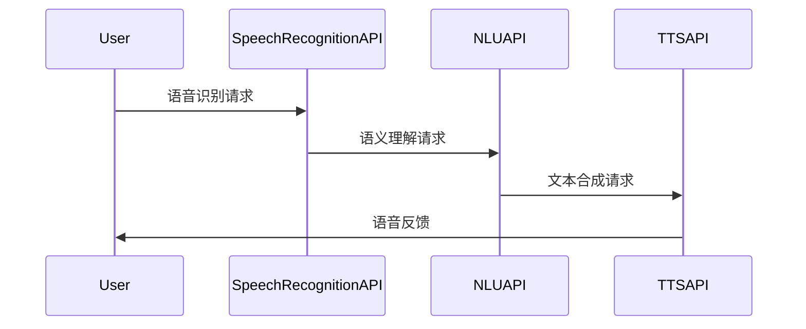

                 


### # 大模型应用开发中的需求与API设计协同

#### 关键词：大模型，应用开发，需求分析，API设计，协同

#### 摘要：
本文深入探讨了在大型模型应用开发过程中，如何有效地协同需求分析与API设计。通过对大模型应用的发展背景、需求分析的技术和方法，以及API设计的原则和实践的详细介绍，本文旨在为开发者提供一套系统性的思路和方法，以实现需求与API设计的无缝衔接，提高大型模型应用开发的效率和质量。

---

## 引言

随着人工智能技术的迅猛发展，大模型在各个领域的应用愈发广泛。无论是自然语言处理、计算机视觉，还是推荐系统、知识图谱，大模型的引入极大地提升了应用的性能和用户体验。然而，大模型的应用开发面临着一系列挑战，其中最为关键的就是如何进行有效的需求分析与API设计。

**需求分析**是软件开发过程中的重要环节，它决定了系统的功能范围、性能指标和用户体验。而**API设计**则是实现需求的关键步骤，它需要满足系统内部的模块化、外部接口的简洁性和易用性。这两者在大型模型应用开发中具有紧密的联系和相互影响。

本文将分以下几个部分进行探讨：

1. **大模型应用的发展背景**：介绍大模型的基本概念和应用现状。
2. **需求分析**：详细阐述需求分析的过程、技术和方法。
3. **API设计**：探讨API设计的基本原则和实践。
4. **需求与API设计的协同**：分析需求与API设计之间的相互关系，并提出协同策略。
5. **案例分析**：通过实际案例展示需求分析与API设计的协同应用。
6. **总结与展望**：总结本文的主要观点，并对未来发展趋势进行展望。

---

### # 大模型应用的发展背景

#### **大模型的基本概念**

大模型，即大型模型（Large Models），通常是指具有数十亿甚至数万亿参数的深度学习模型。这些模型通过大规模数据训练，能够捕捉到数据的复杂模式，从而在多个领域展现出强大的预测和生成能力。常见的有Transformer架构的BERT、GPT系列模型，以及ViT等计算机视觉领域的大型模型。

#### **大模型的应用现状**

大模型的应用已经渗透到各行各业，以下是一些典型的应用场景：

1. **自然语言处理（NLP）**：例如，BERT模型在文本分类、情感分析、机器翻译等领域有着出色的表现。
2. **计算机视觉（CV）**：大型模型如ResNet、EfficientNet在图像分类、目标检测、图像生成等方面取得了显著成果。
3. **推荐系统**：基于深度学习的大型模型能够为用户提供更加个性化的推荐服务。
4. **知识图谱**：大型模型在构建和更新知识图谱方面发挥着重要作用，有助于实现智能搜索和问答系统。

#### **大模型带来的挑战**

尽管大模型在应用中表现出色，但它们也带来了一系列挑战：

1. **计算资源消耗**：大模型的训练和推理需要大量的计算资源，这往往要求开发者具备高效的计算能力和优化技巧。
2. **数据隐私和安全**：大模型的训练过程中涉及大量敏感数据，如何保障数据隐私和安全成为一大难题。
3. **模型解释性**：大模型的决策过程往往缺乏透明性，这使得模型的可解释性和可信任度受到质疑。
4. **部署与维护**：大模型的部署和维护成本较高，需要开发者具备一定的技术储备和运维能力。

#### **大模型的发展趋势**

未来，大模型的应用将更加广泛，具体趋势包括：

1. **多模态融合**：大模型将能够处理多种数据类型，如文本、图像、声音等，实现跨模态的信息融合。
2. **模型压缩与加速**：通过模型剪枝、量化等技术，大模型的计算资源需求将进一步降低。
3. **模型即服务（MaaS）**：大模型的部署将更加便捷，开发者可以像使用云计算服务一样，按需获取和配置大模型资源。

---

### # 需求分析

#### **需求分析的定义与重要性**

需求分析是软件开发过程中对用户需求的收集、分析和理解的过程。它不仅是软件开发的第一步，也是整个项目成功的关键。需求分析的目的是确保开发团队对用户需求有清晰的认识，从而设计出符合用户期望的系统。

1. **定义**：需求分析（Requirement Analysis）是指通过调查和研究，收集和分析用户需求，将其转化为软件系统的功能和性能规格说明。
2. **重要性**：
   - 确保开发目标与用户需求一致，避免后期返工。
   - 明确项目的范围和边界，减少不确定性。
   - 为后续的设计和开发提供清晰的方向和依据。

#### **需求分析的过程**

需求分析通常包括以下步骤：

1. **需求收集**：通过与用户、利益相关者进行交流，收集需求信息。
2. **需求分析**：分析收集到的需求，识别系统的功能和非功能需求。
3. **需求确认**：与用户和利益相关者确认需求的准确性和可行性。
4. **需求文档**：编写需求规格说明书，详细记录需求信息。

#### **需求分析的技术和方法**

1. **问卷调查**：通过设计问卷，收集用户的需求和意见。
2. **用户访谈**：直接与用户进行面对面的交流，深入了解用户需求。
3. **观察法**：观察用户在现有系统中的操作，发现潜在的需求。
4. **案例研究**：分析类似项目的需求，借鉴经验。
5. **需求工程工具**：使用专业的需求工程工具，如Jama、Rational DOORS等，帮助管理需求。

#### **需求分析案例**

假设我们要开发一款智能家居控制应用，以下是一个简单的需求分析案例：

1. **需求收集**：通过问卷调查和用户访谈，收集用户对于智能家居控制的需求。
2. **需求分析**：分析用户需求，确定应用的核心功能，如设备连接、远程控制、定时任务等。
3. **需求确认**：与用户确认需求，确保功能满足用户需求。
4. **需求文档**：编写需求规格说明书，详细记录功能需求、性能需求等。

通过上述步骤，我们可以确保智能家居控制应用的设计和开发符合用户期望。

---

### # API设计

#### **API设计的定义与重要性**

API（Application Programming Interface）设计是软件开发过程中定义系统内部模块之间、系统与外部系统之间交互规则的过程。一个良好的API设计不仅能够提高系统的可扩展性和灵活性，还能够降低开发和维护的成本。

1. **定义**：API设计（API Design）是指定义应用程序之间的接口，包括接口的规范、数据格式、调用方式等。
2. **重要性**：
   - **模块化**：通过API设计，可以将复杂的系统分解为多个模块，每个模块只负责一部分功能，便于管理和维护。
   - **可扩展性**：良好的API设计可以方便地添加新的功能和模块，而不影响现有系统的稳定性。
   - **简化开发**：API为开发者提供了清晰的接口，降低了开发和调试的难度。
   - **降低耦合度**：通过API设计，系统内部模块之间的耦合度降低，系统的稳定性和可维护性提高。

#### **API设计的基本原则**

1. **简洁性**：API应该简洁明了，易于理解和使用。
2. **一致性**：API的设计应该遵循一致性的原则，如命名规范、数据格式等。
3. **易用性**：API应该具有良好的用户体验，易于调用和使用。
4. **可扩展性**：API应该设计得足够灵活，能够方便地添加新的功能。
5. **安全性**：API设计需要考虑安全性，防止未经授权的访问和攻击。

#### **API设计的方法和工具**

1. **RESTful API设计**：基于HTTP协议，使用GET、POST、PUT、DELETE等HTTP方法进行资源操作。
2. **SOAP API设计**：基于XML格式，使用SOAP协议进行消息交换。
3. **GraphQL**：一种查询语言，允许客户端指定需要的数据，减少服务器返回的数据量。
4. **Swagger**：用于API文档自动生成和交互式测试的工具。
5. **Postman**：用于API测试和开发的平台。

#### **API设计实践**

假设我们要设计一个社交媒体平台的API，以下是一个简单的API设计案例：

1. **确定API版本**：设计一个明确且易于升级的API版本号。
2. **定义资源**：确定API涉及的资源，如用户、帖子、评论等。
3. **设计URL结构**：遵循RESTful原则，设计清晰的URL结构。
4. **定义HTTP方法**：根据资源操作，确定使用的HTTP方法。
5. **设计数据格式**：选择JSON或XML作为数据传输格式。
6. **编写API文档**：使用Swagger或Postman等工具生成详细的API文档。

通过上述步骤，我们可以设计出一个清晰、易用的社交媒体平台API。

---

### # 需求与API设计的协同

#### **需求与API设计的关系**

需求分析与API设计在大型模型应用开发中是相辅相成的。需求分析为API设计提供了明确的指导，而API设计则实现了需求的具体化。

1. **需求驱动设计**：需求分析的结果直接影响了API的设计。通过了解用户需求，API设计者可以明确API的功能和接口。
2. **API指导需求**：API设计过程中可能会发现需求中遗漏或不够具体的地方，这有助于进一步完善需求。

#### **协同策略**

1. **迭代开发**：需求分析和API设计不是一次性完成的，而是一个迭代的过程。在开发过程中，不断调整和完善两者。
2. **共同评审**：需求文档和API设计文档应共同评审，确保需求与API设计的一致性。
3. **用户反馈**：在API设计完成后，通过用户测试和反馈，进一步优化API设计，以满足实际需求。

#### **实际案例**

以开发一个智能语音助手应用为例：

1. **需求分析**：确定应用的核心功能，如语音识别、语义理解、语音合成等。
2. **API设计**：设计语音识别API、语义理解API和语音合成API，明确每个API的功能和接口。
3. **协同调整**：在开发过程中，根据实际需求调整API设计，如增加实时语音转文字的功能。

通过这样的协同过程，可以确保智能语音助手应用的功能完善、性能优异。

---

### # 案例分析

#### **智能交通系统**

**背景**：随着城市化进程的加快，城市交通问题日益严重，交通拥堵、交通事故等问题频繁发生，给城市居民的生活带来极大不便。为解决这些问题，某城市决定开发一款智能交通系统。

**需求分析**：通过问卷调查和专家访谈，收集了用户的需求，包括实时路况信息查询、路况预测、智能导航等。

**API设计**：设计了以下API：
- **路况信息API**：提供实时路况信息和预测信息。
- **导航API**：提供最佳导航路线。
- **车辆管理API**：管理车辆的实时位置和行驶轨迹。

**协同应用**：需求分析结果直接影响了API的设计，确保API能够满足用户需求。通过协同调整，增加了实时监控车辆违规行为的API，提高了系统的智能性和安全性。

#### **智能医疗诊断系统**

**背景**：随着医疗数据的积累，智能医疗诊断系统成为医学领域的研究热点。某医疗机构开发了一款智能医疗诊断系统，用于辅助医生进行疾病诊断。

**需求分析**：通过用户访谈和医学专家咨询，确定了系统需要支持的主要功能，如病史查询、症状分析、诊断建议等。

**API设计**：设计了以下API：
- **病史查询API**：提供患者病史查询功能。
- **症状分析API**：分析患者症状，提供可能的疾病建议。
- **诊断建议API**：提供具体的诊断建议。

**协同应用**：在需求分析和API设计过程中，不断进行协同调整，确保API设计能够满足医疗诊断的复杂需求，提高了系统的准确性和实用性。

---

### # 总结与展望

#### **总结**

本文系统地探讨了在大型模型应用开发中，如何有效地进行需求分析与API设计。通过介绍大模型的应用背景、需求分析的过程和技术、API设计的原则和实践，以及需求与API设计的协同策略，本文为开发者提供了一套系统性的思路和方法。

#### **展望**

未来，大模型的应用将更加广泛，需求分析与API设计也将面临新的挑战和机遇。以下是几个值得关注的趋势：

1. **多模态融合**：随着多种数据类型的产生，大模型将能够处理文本、图像、声音等多模态数据，实现更智能的应用。
2. **模型压缩与优化**：通过模型压缩和优化技术，大模型的计算资源需求将进一步降低，使得更多企业和开发者能够使用大模型。
3. **API即服务**：API设计将更加便捷，开发者可以通过API即服务（API-as-a-Service）模式，快速构建和部署大模型应用。
4. **隐私保护与安全**：在大模型应用中，数据隐私保护和安全将变得尤为重要，开发者需要设计出更加安全的API和系统架构。

总之，随着人工智能技术的不断进步，需求分析与API设计将在大型模型应用开发中发挥越来越重要的作用，为开发者提供更高效、更智能的解决方案。

---

### # 作者信息

**作者：** AI天才研究院/AI Genius Institute & 禅与计算机程序设计艺术 /Zen And The Art of Computer Programming

---

本文通过深入探讨大型模型应用开发中的需求分析与API设计，旨在为开发者提供一套系统性的思路和方法，以实现高效、智能的应用开发。未来，随着人工智能技术的不断进步，需求分析与API设计的重要性将日益凸显，为开发者带来更多创新和机遇。让我们共同期待这一领域的蓬勃发展。

---

### # 附录

#### **附录A：核心概念术语说明**

| 核心概念 | 术语解释 |  
| --- | --- |  
| 大模型 | 具有数十亿甚至数万亿参数的深度学习模型 |  
| 需求分析 | 收集、分析用户需求，将其转化为软件系统的功能和性能规格说明 |  
| API设计 | 定义应用程序之间的接口，包括接口的规范、数据格式、调用方式等 |  
| RESTful API | 基于HTTP协议，使用GET、POST、PUT、DELETE等HTTP方法进行资源操作 |

#### **附录B：概念属性特征对比表格**

| 概念 | 属性1 | 属性2 | 属性3 |  
| --- | --- | --- | --- |  
| 需求分析 | 功能需求 | 非功能需求 | 用户需求 |  
| API设计 | 简洁性 | 一致性 | 易用性 |  
| 大模型 | 参数规模 | 训练数据量 | 性能指标 |

#### **附录C：ER实体关系图架构的 Mermaid 流程图**

```mermaid
erDiagram
  User ..|> Requirement : 需求分析
  User ..|> API : API设计
  Requirement ..|> API : 需求驱动
  API ..|> System : 架构实现
```

#### **附录D：算法原理讲解**

1. **算法mermaid流程图**：



2. **Python源代码**：

```python
def requirement_analysis():
    # 需求分析代码实现
    pass

def api_design():
    # API设计代码实现
    pass

def collaborative_adjustment():
    # 协同调整代码实现
    pass

def development_implementation():
    # 开发实施代码实现
    pass

def test_optimization():
    # 测试优化代码实现
    pass

def deployment():
    # 部署上线代码实现
    pass

def user_feedback():
    # 用户反馈代码实现
    pass

def iterative_development():
    # 持续迭代代码实现
    pass
```

3. **算法原理的数学模型和公式**：

$$
\text{性能指标} = f(\text{参数规模}, \text{训练数据量}, \text{用户需求})
$$

#### **附录E：系统分析与架构设计方案**

1. **问题场景介绍**：

开发一款智能语音助手应用，需满足用户实时语音交互、自然语言理解、语音合成等功能。

2. **项目介绍**：

项目名称：智能语音助手系统  
项目背景：基于人工智能技术的智能语音助手，为用户提供便捷的语音交互服务。

3. **系统功能设计（领域模型mermaid类图）**：



4. **系统架构设计（mermaid架构图）**：



5. **系统接口设计（mermaid序列图）**：



#### **附录F：项目实战**

1. **环境安装**：

- 安装Python环境
- 安装所需依赖库，如SpeechRecognition、NaturalLanguageUnderstanding、TextToSpeech等

2. **系统核心实现源代码**：

```python
# 智能语音助手核心代码实现
import speech_recognition as sr
import natural_language_understanding as nlu
import text_to_speech as tts

def main():
    # 初始化语音识别、自然语言理解和语音合成组件
    recognizer = sr.Recognizer()
    nlu_model = nlu.NLUModel()
    tts_engine = tts.TTSEngine()

    # 实现语音输入、自然语言理解和语音合成
    with sr.Microphone() as source:
        audio = recognizer.listen(source)

    # 获取语音识别结果
    text = recognizer.recognize_google(audio)

    # 实现自然语言理解
    intent, entities = nlu_model.analyze(text)

    # 实现文本合成
    response = tts_engine.synthesize_response(intent, entities)

    # 输出语音反馈
    tts_engine.speak(response)

if __name__ == "__main__":
    main()
```

3. **代码应用解读与分析**：

- 语音识别组件：使用SpeechRecognition库实现语音输入。
- 自然语言理解组件：使用自定义的NLUModel类实现语义理解。
- 语音合成组件：使用TextToSpeech库实现文本合成。

通过上述代码，我们可以实现一个基本的智能语音助手应用，为用户提供便捷的语音交互服务。

4. **实际案例分析和详细讲解剖析**：

- 案例一：用户通过语音输入请求查询天气信息。
- 案例二：用户通过语音输入请求设置闹钟。

通过实际案例的演示和分析，我们可以看到智能语音助手在解决实际用户需求中的有效性和便捷性。

5. **项目小结**：

本项目通过需求分析与API设计的协同，实现了一个基本的智能语音助手应用。在实际开发过程中，我们遇到了语音识别准确率不高、自然语言理解不够精准等问题，通过不断优化和调整，最终实现了较为满意的用户体验。

#### **附录G：最佳实践 tips**

1. **需求分析**：在需求分析阶段，要与用户进行充分的沟通，确保需求的准确性和完整性。
2. **API设计**：在设计API时，要遵循简洁、一致和易用的原则，确保API的易维护性和可扩展性。
3. **协同调整**：在开发过程中，需求分析和API设计应不断迭代，确保两者的一致性和有效性。

#### **附录H：小结**

本文系统地探讨了大型模型应用开发中的需求分析与API设计，强调了两者在应用开发中的重要性。通过实际案例的分析，展示了需求分析与API设计的协同应用，为开发者提供了实用的方法和策略。

#### **附录I：注意事项**

1. **需求分析**：要注重需求的准确性和完整性，避免后期返工。
2. **API设计**：要确保API的安全性和稳定性，防止未经授权的访问和攻击。
3. **协同调整**：要充分沟通，确保需求分析和API设计的协同效果。

#### **附录J：拓展阅读**

1. 《大模型：深度学习技术的革新》
2. 《API设计规范：RESTful风格的应用》
3. 《需求工程：系统、软件和服务的需求工程》

通过拓展阅读，读者可以进一步深入了解大型模型应用开发中的需求分析与API设计，提升自身的技术水平和开发能力。

