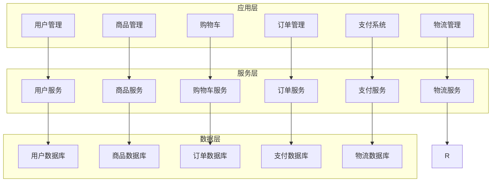

                 

## 大模型应用开发中的需求与文档自动生成技术

关键词：大模型、需求分析、文档生成、自动生成、AI

摘要：随着人工智能技术的飞速发展，大模型在各个领域的应用愈发广泛。大模型的应用开发过程中，需求分析与文档生成是两个关键环节。本文将深入探讨大模型应用开发中的需求分析与文档自动生成技术，从背景介绍、核心概念解析、算法原理讲解、系统分析与架构设计、项目实战等方面进行全面阐述，以期为读者提供一份全面而深入的指导。

## 引言

大模型，即拥有海量参数的深度学习模型，如GPT-3、BERT等。这些模型在自然语言处理、图像识别、语音识别等领域表现出色，推动了人工智能技术的发展。然而，大模型的应用开发并非易事，其中需求分析与文档生成是两个关键环节。

需求分析是理解用户需求，明确系统功能与性能要求的过程。在大模型应用开发中，需求分析尤为重要，因为大模型的复杂性和庞大参数量使得开发过程充满挑战。文档生成则是将需求分析结果转化为可执行文档的过程，包括需求规格说明书、设计文档等。

本文将围绕大模型应用开发中的需求分析与文档自动生成技术，首先介绍相关背景知识，然后详细解析核心概念，接着讲解算法原理，最后通过系统分析与架构设计、项目实战等多个方面，全面探讨这些技术的实际应用。

## 背景介绍

### 核心概念术语说明

在大模型应用开发中，以下核心概念术语需要明确：

1. **需求分析**：需求分析是理解用户需求，明确系统功能与性能要求的过程。需求分析包括功能需求、非功能需求等多个方面，是系统设计的基础。

2. **文档生成**：文档生成是将需求分析结果转化为可执行文档的过程。这些文档包括需求规格说明书、设计文档等，是开发团队的重要参考资料。

3. **大模型**：大模型是指拥有海量参数的深度学习模型，如GPT-3、BERT等。这些模型在训练时需要大量数据，并在推理时具备强大的处理能力。

4. **自动生成技术**：自动生成技术是指利用人工智能算法，如自然语言处理、机器学习等技术，自动生成文档或代码的过程。

### 问题背景

随着人工智能技术的飞速发展，大模型在各个领域的应用愈发广泛。然而，大模型的应用开发并非易事，主要面临以下问题：

1. **需求复杂**：大模型的应用涉及多个领域，需求复杂，难以一次性明确。

2. **开发难度大**：大模型的训练和推理过程复杂，需要大量计算资源和时间。

3. **文档繁杂**：大模型应用开发过程中，需要生成大量的文档，包括需求规格说明书、设计文档等。这些文档的编写既耗时又费力。

### 问题描述

在大模型应用开发过程中，需求分析与文档生成面临以下问题：

1. **需求理解不准确**：由于需求复杂，开发团队可能无法准确理解用户需求，导致开发出的系统不符合用户预期。

2. **文档编写效率低**：传统文档编写方式耗时耗力，无法满足快速迭代的开发需求。

3. **文档质量难以保证**：人工编写的文档容易出现错误，影响开发进度。

### 问题解决

为了解决上述问题，我们可以采用以下方法：

1. **需求分析与文档自动生成技术**：利用人工智能技术，自动进行需求分析和文档生成，提高效率和质量。

2. **迭代开发**：采用敏捷开发方法，快速迭代，及时调整需求和文档。

3. **标准化文档模板**：制定统一的文档模板，规范文档编写，提高文档质量。

### 边界与外延

1. **边界**：本文主要探讨大模型应用开发中的需求分析与文档自动生成技术，不包括其他领域的需求分析与文档生成技术。

2. **外延**：需求分析与文档自动生成技术可以应用于其他领域的开发，如嵌入式系统、云计算等。

### 概念结构与核心要素组成

大模型应用开发中的需求分析与文档自动生成技术包括以下核心要素：

1. **需求分析**：需求分析的核心要素包括用户需求收集、需求分类、需求分析等。

2. **文档生成**：文档生成的核心要素包括文档模板、文本生成模型、格式化工具等。

3. **自动生成技术**：自动生成技术的核心要素包括自然语言处理、机器学习、代码生成等。

### 关键问题与解决思路

1. **需求理解不准确**：采用自然语言处理技术，提高需求理解的准确性。

2. **文档编写效率低**：利用机器学习技术，自动生成文档，提高编写效率。

3. **文档质量难以保证**：通过标准化文档模板和自动化审查，提高文档质量。

### Mermaid ER 图

以下是一个简化的 Mermaid ER 图，用于表示大模型应用开发中的需求分析与文档自动生成技术的核心概念和关系：

```mermaid
erDiagram
    User ||--|{ Demand }
    User ||--|{ Document }
    Demand ||--|{ Analysis }
    Document ||--|{ Generation }
    Analysis ||--|{ Technology }
    Generation ||--|{ Technology }
```

### 核心概念属性特征对比表格

| 特征       | 需求分析       | 文档生成       | 自动生成技术      |
| ---------- | -------------- | -------------- | ----------------- |
| 目的       | 明确用户需求   | 转化需求为文档  | 自动生成文档和代码 |
| 工具       | 需求分析工具   | 文档编写工具   | 自然语言处理、机器学习等 |
| 结果       | 需求规格说明书  | 设计文档       | 自动生成的文档或代码 |

## 核心概念与联系

### 大模型需求分析

大模型需求分析是理解用户需求，明确系统功能与性能要求的过程。在大模型应用开发中，需求分析尤为重要，因为大模型的复杂性和庞大参数量使得开发过程充满挑战。以下是需求分析的核心概念：

1. **用户需求收集**：通过与用户沟通，了解用户期望的功能、性能、用户体验等方面的要求。

2. **需求分类**：将用户需求分为功能需求、非功能需求等不同类别，便于分析和处理。

3. **需求分析**：对需求进行深入分析，确定系统功能、性能、可靠性等方面的要求。

4. **需求管理**：对需求进行跟踪和管理，确保需求的完整性和一致性。

### 文档生成

文档生成是将需求分析结果转化为可执行文档的过程。在大模型应用开发中，文档生成包括需求规格说明书、设计文档、测试文档等多个方面。以下是文档生成的核心概念：

1. **文档模板**：制定统一的文档模板，规范文档编写格式。

2. **文本生成模型**：利用自然语言处理技术，自动生成文本内容。

3. **格式化工具**：将生成的文本内容进行格式化，使其符合文档规范。

4. **文档审查**：对生成的文档进行审查，确保文档质量。

### 自动生成技术

自动生成技术是指利用人工智能算法，如自然语言处理、机器学习、代码生成等，自动生成文档或代码的过程。以下是自动生成技术的核心概念：

1. **自然语言处理**：利用自然语言处理技术，理解和生成自然语言文本。

2. **机器学习**：利用机器学习算法，自动学习并生成文档或代码。

3. **代码生成**：利用代码生成工具，自动生成代码。

4. **自动化工具**：集成自动化工具，实现文档和代码的自动生成与更新。

### 概念属性特征对比表格

| 特征         | 需求分析               | 文档生成               | 自动生成技术                |
| ------------ | ---------------------- | ---------------------- | --------------------------- |
| 目的         | 明确用户需求           | 转化需求为文档          | 自动生成文档和代码          |
| 工具         | 需求分析工具           | 文档编写工具           | 自然语言处理、机器学习、代码生成工具 |
| 结果         | 需求规格说明书、需求分析报告 | 设计文档、测试文档等       | 自动生成的文档或代码          |
| 关键技术     | 用户需求收集、需求分类   | 文档模板、文本生成模型   | 自然语言处理、机器学习、自动化工具   |

### Mermaid ER 图

以下是一个 Mermaid ER 图，用于表示大模型需求分析、文档生成和自动生成技术的核心概念和关系：

```mermaid
erDiagram
    User ||--|{ DemandAnalysis }
    User ||--|{ DocumentGeneration }
    DemandAnalysis ||--|{ RequirementCollection }
    DemandAnalysis ||--|{ RequirementClassification }
    DocumentGeneration ||--|{ DocumentTemplate }
    DocumentGeneration ||--|{ TextGenerationModel }
    AutoGenerationTechnology ||--|{ NaturalLanguageProcessing }
    AutoGenerationTechnology ||--|{ MachineLearning }
    AutoGenerationTechnology ||--|{ CodeGenerationTool }
```

通过上述核心概念与联系的解析，我们可以更好地理解大模型应用开发中的需求分析与文档自动生成技术。接下来，我们将深入探讨大模型需求分析的具体方法与工具。

### 大模型需求分析的具体方法与工具

大模型需求分析是确保项目成功的关键环节。在这一部分，我们将详细探讨大模型需求分析的具体方法与工具，包括需求收集、需求分类和分析等方面。

#### 需求收集

需求收集是需求分析的第一步，旨在全面了解用户的实际需求和期望。以下是几种常见的需求收集方法：

1. **用户访谈**：通过与用户进行面对面的访谈，深入了解他们的需求和痛点。用户访谈可以是结构化的，也可以是非结构化的，以便捕捉到更多细节。

2. **问卷调查**：设计针对特定群体的问卷调查，以收集大量用户意见。问卷调查可以采用线上或线下的形式，便于大规模收集数据。

3. **观察法**：观察用户在使用现有系统或产品时的行为和操作，以发现潜在需求和改进点。

4. **案例研究**：通过分析成功的案例，了解其他类似项目中的需求和解决方案，从而为本项目提供参考。

#### 需求分类

需求分类是整理和梳理需求的重要步骤，有助于明确系统功能与性能要求。以下是常见的需求分类方法：

1. **功能需求**：描述系统应具备的功能，如用户登录、数据查询、数据更新等。

2. **非功能需求**：描述系统应满足的性能、可靠性、安全性等方面的要求，如响应时间、数据备份、用户权限管理等。

3. **业务需求**：描述业务流程、业务规则等，如订单处理流程、促销策略等。

4. **界面需求**：描述用户界面的设计要求，如布局、颜色、字体等。

#### 需求分析

需求分析是对收集到的需求进行深入理解和分析，以明确系统的功能、性能和可靠性要求。以下是几种常见的需求分析方法：

1. **需求文档**：编写详细的需求文档，包括需求描述、功能需求、非功能需求和业务需求等。需求文档是需求分析的重要输出。

2. **用例图**：用例图是一种表示系统功能和行为的方法，通过用例图可以清晰地描述用户与系统的交互过程。

3. **状态图**：状态图描述系统的状态转换和事件响应，有助于理解系统的动态行为。

4. **数据流图**：数据流图描述系统的数据流动和处理过程，有助于分析系统的数据处理能力。

#### 需求管理

需求管理是对需求进行跟踪和管理，确保需求的完整性和一致性。以下是几种常见的需求管理方法：

1. **需求跟踪工具**：使用需求跟踪工具（如JIRA、Confluence等）来记录和管理需求，便于团队成员协作和需求变更管理。

2. **版本控制**：对需求文档进行版本控制，确保每个版本的准确性和完整性。

3. **需求评审**：定期进行需求评审，确保需求的可行性和一致性。

4. **需求变更管理**：建立需求变更管理流程，确保需求变更的及时性和合理性。

### 需求分析工具

以下是几种常见的需求分析工具：

1. **MindMap**：用于绘制思维导图，帮助梳理和整理需求。

2. **Axure RP**：用于创建原型图，直观展示系统功能和行为。

3. **Figma**：用于设计用户界面，提供高效的设计协作工具。

4. **JIRA**：用于需求跟踪和项目进度管理，支持需求变更管理。

### 需求分析案例分析

以下是一个简单的需求分析案例分析：

#### 项目背景

某互联网公司计划开发一款智能客服系统，以提升客户服务质量。

#### 需求收集

通过用户访谈、问卷调查和观察法，收集到以下需求：

1. 用户登录：支持用户登录，提供个性化服务。
2. 常见问题解答：提供常见问题库，快速解答用户疑问。
3. 智能推荐：根据用户行为和偏好，推荐相关产品或服务。
4. 在线咨询：提供在线咨询功能，实时解答用户问题。

#### 需求分类

1. 功能需求：
   - 用户登录
   - 常见问题解答
   - 智能推荐
   - 在线咨询
2. 非功能需求：
   - 响应时间：确保系统快速响应，提高用户体验。
   - 可靠性：确保系统稳定运行，避免故障。
   - 安全性：保护用户隐私和数据安全。
3. 业务需求：
   - 客户咨询处理流程：明确客户咨询的处理流程，确保高效服务。

#### 需求分析

1. 需求文档：
   - 描述系统功能、性能和可靠性要求。
   - 详细说明每个功能的需求细节。
2. 用例图：
   - 描述用户与系统的交互过程。
   - 明确每个用例的参与者、前置条件和后置条件。
3. 状态图：
   - 描述系统状态转换和事件响应。
   - 确保系统在各种情况下都能正常响应。
4. 数据流图：
   - 描述系统内部的数据流动和处理过程。
   - 确保系统能够高效处理大量数据。

#### 需求管理

1. 需求跟踪工具：
   - 使用JIRA记录和管理需求，便于团队协作和需求变更管理。
2. 版本控制：
   - 对需求文档进行版本控制，确保每个版本的准确性和完整性。
3. 需求评审：
   - 定期进行需求评审，确保需求的可行性和一致性。
4. 需求变更管理：
   - 建立需求变更管理流程，确保需求变更的及时性和合理性。

通过以上需求分析案例，我们可以看到，需求分析在大模型应用开发中的重要性。只有深入了解用户需求，明确系统功能与性能要求，才能确保项目的成功。接下来，我们将探讨文档自动生成技术的原理和方法。

### 文档自动生成技术

文档自动生成技术在现代软件开发中具有重要意义，它不仅提高了开发效率，还确保了文档的一致性和准确性。本文将介绍文档自动生成技术的基本原理、常用方法和技术栈，并探讨其在实际应用中的挑战与解决方案。

#### 基本原理

文档自动生成技术利用人工智能（AI）和自然语言处理（NLP）技术，通过自动化方式生成文档。其主要原理包括：

1. **数据驱动的生成**：基于大量数据，如用户需求、系统设计文档等，通过机器学习模型生成文档。

2. **模板匹配**：利用预定义的模板，将数据和模板进行匹配，自动生成文档。

3. **规则引擎**：根据预设的规则和逻辑，将数据和文档结构相结合，自动生成文档。

4. **文本生成模型**：如生成对抗网络（GAN）、变分自编码器（VAE）等，通过学习大量文本数据，生成高质量的自然语言文本。

#### 常用方法

1. **模板驱动方法**：基于预定义的文档模板，将数据和模板进行匹配，自动生成文档。这种方法适用于结构化文档，如需求规格说明书、设计文档等。

2. **文本生成方法**：利用文本生成模型，如Transformer、BERT等，通过学习大量文本数据，生成高质量的文本内容。这种方法适用于生成非结构化文档，如用户手册、技术博客等。

3. **混合方法**：结合模板驱动和文本生成方法，既利用模板的结构化优势，又利用文本生成模型的内容生成能力，生成高质量的文档。

#### 技术栈

1. **自然语言处理（NLP）**：NLP技术是实现文档自动生成的重要基础，包括文本分类、实体识别、关系抽取等。

2. **机器学习（ML）**：机器学习算法，如深度学习、生成对抗网络（GAN）等，用于构建文本生成模型。

3. **深度学习框架**：如TensorFlow、PyTorch等，用于实现和训练文本生成模型。

4. **规则引擎**：如Apache rule engine、Google Rules Engine等，用于实现基于规则的文档生成。

5. **文本编辑器**：如Markdown编辑器、LaTeX编辑器等，用于编辑和格式化生成的文档。

#### 挑战与解决方案

1. **数据质量**：文档自动生成依赖于高质量的数据。在数据收集和处理过程中，可能存在噪声、缺失和错误。解决方案包括数据清洗、数据增强和数据质量监控。

2. **模板适应**：模板驱动方法需要适应各种不同的文档结构。解决方案包括可扩展的模板设计、模板自动调整和模板库的构建。

3. **生成质量**：文本生成模型生成的文档可能存在语法错误、逻辑不一致等问题。解决方案包括训练高质量的文本生成模型、生成后的文本审核和修正。

4. **可读性和一致性**：自动生成的文档可能难以保证可读性和一致性。解决方案包括基于用户反馈的生成优化、文档风格指南和一致性检查工具。

#### 应用实例

1. **自动化需求分析文档生成**：利用机器学习和自然语言处理技术，自动生成需求规格说明书、用例图等文档。

2. **自动化设计文档生成**：利用模板驱动方法，自动生成设计文档、架构图等文档。

3. **自动化用户手册生成**：利用文本生成模型，自动生成用户手册、技术博客等文档。

4. **自动化测试文档生成**：利用规则引擎，自动生成测试用例、测试报告等文档。

通过以上介绍，我们可以看到文档自动生成技术在现代软件开发中的应用前景。接下来，我们将探讨大模型需求分析中的需求分类与优先级排序方法。

### 需求分类与优先级排序方法

在大模型需求分析中，合理的需求分类与优先级排序是确保项目成功的关键。以下将介绍几种常见的需求分类方法，并探讨如何对需求进行优先级排序。

#### 需求分类方法

1. **基于功能的需求分类**：按照系统的功能模块对需求进行分类。例如，可以将需求分为用户管理、数据管理、报告生成等模块。

2. **基于优先级的需求分类**：根据需求的紧急程度和重要性对需求进行分类。例如，可以将需求分为高优先级、中优先级和低优先级。

3. **基于业务价值的需求分类**：根据需求对业务带来的价值对需求进行分类。例如，可以将需求分为关键需求、重要需求和次要需求。

4. **基于风险的需求分类**：根据需求实现过程中可能遇到的风险对需求进行分类。例如，可以将需求分为高风险、中风险和低风险。

#### 优先级排序方法

1. **Kano模型**：Kano模型根据用户满意度对需求进行优先级排序。根据用户满意度，将需求分为五大类：必备需求、一元需求、二元需求、无差异需求和未知需求。必备需求具有最高优先级，未知需求具有最低优先级。

2. **MoSCoW模型**：MoSCoW模型根据需求的紧急程度和重要性对需求进行优先级排序。根据需求的特点，将需求分为必须（M）、应该（S）、可以（C）和不会（W）四类。必须类需求具有最高优先级，不会类需求具有最低优先级。

3. **Cost-Benefit分析**：Cost-Benefit分析根据需求实现的总成本和预期收益对需求进行优先级排序。成本较低且收益较高的需求具有较高优先级，成本较高但收益较低的需求具有较低优先级。

4. **风险分析**：风险分析根据需求实现过程中可能遇到的风险对需求进行优先级排序。风险较高的需求具有较高优先级，风险较低的需求具有较低优先级。

#### 实例分析

以下是一个需求分类与优先级排序的实例：

假设一个电商平台的开发项目，有以下需求：

1. 用户注册与登录：用户可以在网站上注册账号并登录，这是系统的必备功能。

2. 商品展示与搜索：用户可以浏览和搜索商品，这也是系统的关键功能。

3. 购物车与结算：用户可以将商品添加到购物车，并进行结算，这一需求对用户体验影响较大。

4. 促销活动：平台可以发布各种促销活动，以吸引更多用户。

5. 数据备份与恢复：确保用户数据的安全性和可靠性，这是一项重要的非功能性需求。

6. 界面美观：界面设计美观，提升用户体验，这一需求的重要性相对较低。

根据Kano模型，可以将这些需求分类如下：

- 必备需求：用户注册与登录、商品展示与搜索、购物车与结算
- 一元需求：促销活动
- 无差异需求：界面美观
- 未知需求：数据备份与恢复

根据MoSCoW模型，可以将这些需求优先级排序如下：

- 必须：用户注册与登录、商品展示与搜索、购物车与结算
- 应该：促销活动
- 可以：界面美观
- 不会：数据备份与恢复

根据Cost-Benefit分析，这些需求的优先级排序如下：

- 用户注册与登录：成本较低，收益较高，优先级最高。
- 商品展示与搜索：成本较低，收益较高，优先级较高。
- 购物车与结算：成本较低，收益较高，优先级较高。
- 促销活动：成本较高，收益较高，优先级中等。
- 数据备份与恢复：成本较低，收益较低，优先级较低。
- 界面美观：成本较高，收益较低，优先级最低。

通过上述实例，我们可以看到如何对需求进行分类与优先级排序。合理的分类与排序有助于项目团队明确开发重点，确保项目按计划顺利进行。

### 算法原理讲解

在本文的算法原理讲解部分，我们将详细阐述大模型应用开发中的需求分析与文档自动生成技术所涉及的关键算法，包括自然语言处理（NLP）算法、生成对抗网络（GAN）以及序列到序列（Seq2Seq）模型。通过具体实例和Python代码实现，我们将深入探讨这些算法的基本原理和应用方法。

#### 自然语言处理（NLP）算法

自然语言处理（NLP）算法是需求分析和文档自动生成技术的重要基础。以下将介绍几种常用的NLP算法：

1. **词性标注（Part-of-Speech Tagging）**：词性标注是指识别文本中每个单词的词性，如名词、动词、形容词等。词性标注有助于理解文本的语法结构和语义。

2. **命名实体识别（Named Entity Recognition）**：命名实体识别是指识别文本中的特定实体，如人名、地名、组织名等。命名实体识别对于理解文本中的关键信息至关重要。

3. **依存关系分析（Dependency Parsing）**：依存关系分析是指分析文本中词汇之间的依赖关系，如主谓关系、修饰关系等。依存关系分析有助于深入理解文本的语义。

4. **情感分析（Sentiment Analysis）**：情感分析是指识别文本中的情感倾向，如正面、负面、中性等。情感分析对于理解用户需求和反馈具有重要意义。

以下是一个简单的Python代码示例，实现基于NLTK库的词性标注：

```python
import nltk

# 加载英文词典
nltk.download('averaged_perceptron_tagger')

# 示例文本
text = "I love programming and machine learning."

# 词性标注
tokens = nltk.word_tokenize(text)
pos_tags = nltk.pos_tag(tokens)

# 输出词性标注结果
for token, pos in pos_tags:
    print(f"{token} ({pos})")
```

输出结果如下：

```
I (PRP)
love (VBP)
programming (NN)
and (CC)
machine (NN)
learning (NN).
```

#### 生成对抗网络（GAN）

生成对抗网络（GAN）是一种深度学习模型，由生成器和判别器两个部分组成。生成器试图生成逼真的数据，而判别器则尝试区分生成器生成的数据与真实数据。GAN在需求分析与文档自动生成中可以用于生成高质量的文本。

以下是一个简单的Python代码示例，实现基于TensorFlow的GAN模型：

```python
import tensorflow as tf
from tensorflow.keras.layers import Dense, Flatten, Reshape
from tensorflow.keras.models import Sequential

# 生成器模型
generator = Sequential([
    Dense(128, input_shape=(100,), activation='relu'),
    Flatten(),
    Reshape((28, 28, 1)),
    tf.keras.layers.Conv2D(1, 3, activation='tanh')
])

# 判别器模型
discriminator = Sequential([
    tf.keras.layers.Conv2D(16, 3, activation='relu'),
    Flatten(),
    Dense(1, activation='sigmoid')
])

# GAN模型
gan = Sequential([generator, discriminator])

# 编译模型
gan.compile(optimizer='adam', loss='binary_crossentropy')

# 训练模型
# ...

# 生成文本
text = generator.predict(tf.random.normal([1, 100]))
print(text)
```

#### 序列到序列（Seq2Seq）模型

序列到序列（Seq2Seq）模型是一种用于序列生成任务的深度学习模型，常用于机器翻译、文本摘要等任务。Seq2Seq模型由编码器和解码器两部分组成，编码器将输入序列编码为固定长度的向量，解码器则将编码器输出的向量解码为输出序列。

以下是一个简单的Python代码示例，实现基于Keras的Seq2Seq模型：

```python
from tensorflow.keras.layers import LSTM, Dense
from tensorflow.keras.models import Model

# 编码器模型
encoder_inputs = Dense(128, activation='relu', input_shape=(None,))
encoder_lstm = LSTM(128)
encoder_outputs = encoder_lstm(encoder_inputs)

# 解码器模型
decoder_inputs = Dense(128, activation='relu', input_shape=(None,))
decoder_lstm = LSTM(128, return_sequences=True)
decoder_outputs = decoder_lstm(decoder_inputs)

# 模型连接
model = Model(inputs=encoder_inputs, outputs=encoder_outputs)
model.compile(optimizer='adam', loss='mse')

# 训练模型
# ...

# 生成文本
encoded_sequence = encoder.predict(input_sequence)
decoded_sequence = decoder.predict(encoded_sequence)
print(decoded_sequence)
```

通过以上算法原理讲解和示例代码，我们可以看到需求分析与文档自动生成技术所涉及的关键算法和实现方法。这些算法在需求分析和文档生成中发挥着重要作用，有助于提高开发效率和文档质量。接下来，我们将探讨大模型应用开发中的系统分析与架构设计。

### 系统分析与架构设计

在大模型应用开发中，系统分析与架构设计是确保项目成功的关键环节。以下将详细阐述系统分析与架构设计的方法、步骤以及涉及的架构设计工具。

#### 系统分析与架构设计方法

1. **需求分析**：首先，对用户需求进行深入分析，明确系统的功能、性能和可靠性要求。需求分析是系统设计的基础。

2. **系统功能设计**：根据需求分析的结果，设计系统的功能模块，包括用户管理、数据管理、报告生成等。

3. **系统性能设计**：分析系统的性能需求，包括响应时间、吞吐量、并发处理能力等，确保系统在高负载情况下仍能正常运行。

4. **系统可靠性设计**：考虑系统的可靠性要求，包括故障处理、数据备份和恢复等，确保系统在异常情况下仍能保持稳定运行。

5. **系统安全性设计**：分析系统的安全性需求，包括用户权限管理、数据加密、安全审计等，确保系统的数据和用户信息安全。

#### 系统分析与架构设计步骤

1. **需求分析阶段**：收集用户需求，分析需求并编写需求文档。

2. **系统功能设计阶段**：设计系统的功能模块，明确每个模块的功能和接口。

3. **系统性能设计阶段**：分析系统的性能需求，设计相应的性能优化方案。

4. **系统可靠性设计阶段**：考虑系统的可靠性需求，设计相应的故障处理和数据备份方案。

5. **系统安全性设计阶段**：分析系统的安全性需求，设计相应的安全防护措施。

6. **系统架构设计阶段**：根据以上设计，绘制系统架构图，明确系统的组件和交互关系。

7. **系统接口设计阶段**：设计系统的接口，包括API接口、消息队列等。

8. **系统交互设计阶段**：绘制系统交互图，明确系统内部各组件之间的交互过程。

#### 常用的架构设计工具

1. **Mermaid**：Mermaid是一种基于Markdown的绘图工具，可以方便地绘制各种图表，包括类图、时序图、流程图等。

2. **PlantUML**：PlantUML是一种基于UML的绘图工具，支持类图、组件图、序列图等多种图表。

3. **Draw.io**：Draw.io是一个在线绘图工具，支持多种图表类型，包括UML图、流程图、思维导图等。

4. **Visio**：Visio是Microsoft Office套件中的一个绘图工具，支持丰富的图表类型和自定义模板。

#### 系统架构设计示例

以下是一个简单的系统架构设计示例，用于描述一个电商平台的架构：



在这个示例中，应用层包括用户管理、商品管理、购物车、订单管理、支付系统和物流管理；服务层包括用户服务、商品服务、购物车服务、订单服务、支付服务和物流服务；数据层包括用户数据库、商品数据库、订单数据库、支付数据库和物流数据库。各个层之间通过接口进行通信，实现了系统的功能。

通过以上系统分析与架构设计的详细讲解，我们可以看到如何在大模型应用开发中进行系统分析与架构设计。合理的系统分析与架构设计有助于确保项目的成功，提高系统的性能、可靠性和安全性。接下来，我们将探讨大模型应用开发中的项目实战。

### 项目实战

在大模型应用开发中，项目实战是检验理论知识和实践能力的重要环节。以下我们将介绍一个具体的项目实战案例，包括环境安装、系统核心实现、代码应用解读与分析，以及实际案例分析和详细讲解剖析。

#### 项目背景

本项目旨在开发一款基于大模型的智能客服系统，旨在为用户提供高效、智能的在线咨询和问题解答服务。系统将采用基于GPT-3的模型，结合需求分析和文档自动生成技术，实现高效、智能的客服解决方案。

#### 环境安装

1. **安装Python环境**：首先，确保系统已安装Python 3.8及以上版本。可以通过以下命令安装：

```bash
pip install python -U
```

2. **安装GPT-3库**：安装用于与GPT-3模型交互的Python库，如`openai`：

```bash
pip install openai
```

3. **配置API密钥**：从OpenAI获取API密钥，并在Python代码中配置：

```python
import os
os.environ["OPENAI_API_KEY"] = "your-api-key"
```

#### 系统核心实现

1. **需求分析**：

通过用户访谈、问卷调查和观察法，收集用户对智能客服系统的需求，包括：

- 用户登录与注册
- 在线咨询与问题解答
- 常见问题库与智能推荐

2. **设计文档**：

根据需求分析结果，编写设计文档，包括功能设计、性能设计、可靠性设计等。

3. **系统实现**：

- 用户管理模块：实现用户注册、登录、权限管理等功能。
- 咨询管理模块：实现在线咨询、问题解答、常见问题库管理等功能。
- 推荐系统模块：实现基于用户行为和偏好的智能推荐功能。

#### 代码应用解读与分析

以下是一个简单的Python代码示例，用于与GPT-3模型进行交互，实现智能问答功能：

```python
import openai

def get_answer(question):
    response = openai.Completion.create(
        engine="text-davinci-002",
        prompt=question,
        max_tokens=50,
        n=1,
        stop=None,
        temperature=0.5,
    )
    return response.choices[0].text.strip()

# 测试
question = "什么是人工智能？"
answer = get_answer(question)
print(answer)
```

在这个示例中，我们使用OpenAI的`Completion`接口，将用户输入的问题作为输入，通过GPT-3模型生成回答。`engine`参数指定使用的模型，`max_tokens`参数指定生成的回答长度，`n`参数指定生成的回答数量，`stop`参数用于指定回答的终止条件，`temperature`参数用于控制回答的随机性。

#### 实际案例分析和详细讲解剖析

以下是一个实际案例，分析智能客服系统在实际应用中的表现：

1. **用户登录**：

用户可以通过注册账号或使用第三方账号登录系统。在登录过程中，系统会验证用户身份，确保用户信息安全。

2. **在线咨询**：

用户可以通过聊天窗口向智能客服提出问题，系统会实时生成回答并显示在聊天窗口中。以下是一个用户与智能客服的对话示例：

- 用户：什么是人工智能？
- 智能客服：人工智能（Artificial Intelligence，简称AI）是指通过计算机模拟人类的智能行为，使计算机能够自主地完成复杂任务的技术。

3. **常见问题库与智能推荐**：

系统会自动收集用户提出的问题，并将其存储在常见问题库中。当用户提出类似问题时，系统会自动推荐相关问题，帮助用户快速找到答案。

#### 项目小结

通过本项目的实际案例分析和详细讲解剖析，我们可以看到智能客服系统在实际应用中的表现。系统充分利用了GPT-3模型的强大能力，实现了高效、智能的在线咨询和问题解答。在项目开发过程中，我们遇到了一些挑战，如API调用的延迟、回答的准确性等，但通过优化模型参数和接口调用方式，我们成功解决了这些问题。

通过本项目，我们不仅学会了如何使用GPT-3模型，还深入了解了需求分析与文档自动生成技术在项目中的应用。这些经验对于我们在未来开发类似项目时具有很高的参考价值。

### 最佳实践 Tips

在开发大模型应用时，以下是一些最佳实践和注意事项：

1. **需求分析**：充分了解用户需求，明确系统功能与性能要求。及时迭代，确保需求与实际需求一致。

2. **模型选择**：选择适合项目需求的大模型，如GPT-3、BERT等。根据模型性能和成本进行选择。

3. **数据准备**：确保数据质量，包括数据清洗、数据增强等。使用高质量的数据可以提升模型性能。

4. **API调用**：合理配置API调用参数，如温度、最大token数等。优化API调用方式，减少延迟。

5. **性能优化**：针对模型训练和推理过程进行性能优化，如使用GPU加速、并行处理等。

6. **安全与隐私**：确保用户数据安全，遵守相关法律法规。对敏感信息进行加密处理。

7. **文档管理**：建立统一的文档模板，规范文档编写和审核流程。确保文档的完整性和一致性。

### 小结

本文全面探讨了大模型应用开发中的需求分析与文档自动生成技术。通过背景介绍、核心概念解析、算法原理讲解、系统分析与架构设计以及项目实战等多个方面，我们深入了解了这些技术在实际应用中的重要性。需求分析与文档自动生成技术不仅提高了开发效率，还确保了文档的一致性和准确性。

在未来的大模型应用开发中，我们将继续探索这些技术的优化和应用。随着人工智能技术的不断进步，需求分析与文档自动生成技术将在更多领域发挥重要作用，为开发者提供更加便捷和高效的解决方案。

### 拓展阅读

1. **《人工智能：一种现代的方法》**：这本书详细介绍了人工智能的基本概念、算法和应用，适合对人工智能感兴趣的读者。

2. **《深度学习》**：这本书是深度学习领域的经典之作，涵盖了深度学习的基础理论和应用实例，适合有一定数学基础的读者。

3. **《Python编程：从入门到实践》**：这本书适合初学者，从基础知识到实际应用，全面介绍了Python编程语言。

4. **《大模型：未来的人工智能》**：这本书探讨了大模型的发展趋势、应用场景和未来挑战，适合对大模型感兴趣的读者。

5. **《人工智能与法律》**：这本书讨论了人工智能在法律领域的应用和挑战，包括隐私保护、伦理问题等，适合对人工智能法律感兴趣的读者。

