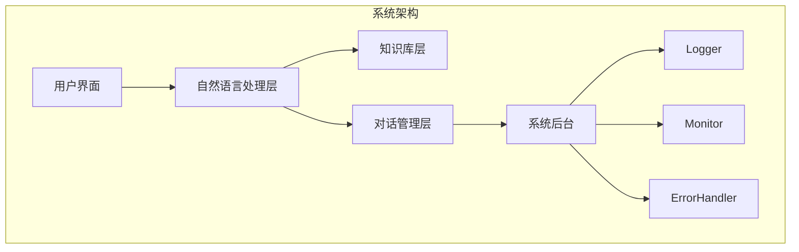
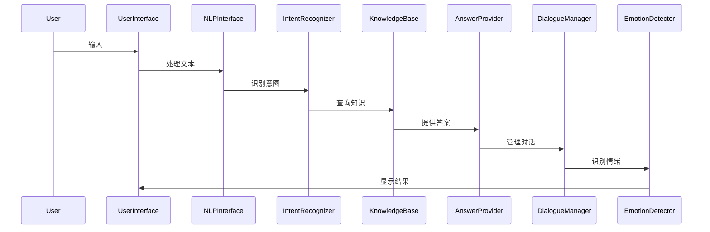

                 

### 第1章: 引言

#### 1.1 问题背景

在当前数字化时代，人工智能（AI）大模型的应用已成为推动产业创新和提升企业竞争力的关键因素。大模型，如深度神经网络（DNN）、生成对抗网络（GAN）和变分自编码器（VAE）等，凭借其强大的数据分析和处理能力，在自然语言处理（NLP）、计算机视觉（CV）、推荐系统等领域取得了显著的成果。然而，随着大模型的应用场景不断扩展和复杂化，开发者面临的一个关键挑战是如何有效地进行需求分析与测试用例生成。

#### 1.2 问题描述

在大模型应用开发中，需求分析与测试用例生成面临以下挑战：

- **需求分析难点**：大模型的应用需求具有多样性和动态性，不同场景下的需求各异。例如，在自然语言处理领域，文本分类、机器翻译和对话系统等应用需求差异明显。此外，用户需求的变化可能导致需求频繁调整，增加了需求分析的工作量。

- **测试用例生成难题**：大模型的测试用例需要覆盖广泛的输入和输出情况，确保模型的鲁棒性和性能。然而，由于大模型的复杂性和不确定性，传统的测试用例生成方法往往难以满足需求。测试用例的覆盖范围和有效性直接影响大模型的性能和稳定性。

#### 1.3 问题解决

为了应对上述挑战，本书将从理论和实践两方面深入探讨大模型应用开发中的需求分析与测试用例生成问题，提供系统性的解决方案。具体来说，本书将包括以下几个部分：

- **理论基础**：介绍需求分析与测试用例生成的基础知识，包括需求分析的定义、过程和方法，以及测试用例的定义、生成方法和验证过程。

- **方法与实践**：探讨针对大模型应用的需求分析与测试用例生成方法，包括数据分析、专家咨询、自动化测试工具等。通过实际案例分析，展示方法的应用和效果。

- **案例解析**：通过具体的大模型应用案例，如自然语言处理和计算机视觉领域，详细分析需求分析与测试用例生成的实践过程和关键点。

- **展望与未来**：探讨大模型应用开发的发展趋势和面临的挑战，如数据隐私、伦理问题和模型可解释性等，并提出可能的解决方案。

#### 1.4 边界与外延

- **边界**：本书主要关注于人工智能领域的大模型应用，如自然语言处理、计算机视觉等。虽然本书提供的方法和理论具有一定的普适性，但针对特定领域（如医疗、金融等）的应用可能需要额外的调整和优化。

- **外延**：本书的理论和方法同样适用于其他复杂系统的需求分析与测试用例生成，如自动驾驶系统、智能物联网（IoT）等。在应用本书的方法时，需要根据具体系统特点进行调整和优化。

#### 1.5 概念结构与核心要素组成

- **核心概念**：需求分析、测试用例生成、大模型应用开发。

- **结构**：本书分为以下几个部分：

  - **理论基础**：介绍需求分析与测试用例生成的基础知识。

  - **方法与实践**：探讨具体的方法和工具。

  - **案例解析**：通过实际案例分析，展示方法的应用。

  - **展望与未来**：探讨大模型应用开发的发展趋势和挑战。

### 文章标题：大模型应用开发中的需求与测试用例生成

关键词：需求分析、测试用例生成、大模型应用、人工智能、自然语言处理、计算机视觉

摘要：本文探讨了在大模型应用开发中，如何有效地进行需求分析与测试用例生成。通过深入分析需求分析的方法和难点，以及测试用例生成的过程和方法，本文提出了系统性的解决方案，以帮助开发者应对复杂的大模型应用场景。同时，通过实际案例分析，本文展示了方法的应用效果和关键点，为未来的大模型应用开发提供了有益的参考。

### 第2章: 需求分析基础

#### 2.1 需求分析概述

需求分析是软件开发过程中至关重要的一环，它是指确定系统必须完成哪些工作，以解决用户问题的过程。需求分析不仅涉及对用户需求的收集和理解，还包括对系统功能、性能、用户界面等方面的详细描述。需求分析的目的是确保系统开发团队能够准确地理解用户需求，并在此基础上设计和实现符合用户期望的系统。

**需求分析的定义**：需求分析是指通过系统研究、用户访谈、问卷调查、文档分析等多种方式，收集和分析用户需求，明确系统必须实现的功能和性能要求，并将其转化为具体的软件需求规格说明书的过程。

**需求分析的重要性**：需求分析是软件项目成功的关键步骤。以下是其重要性的一些方面：

- **避免返工**：通过明确的需求分析，可以减少后期因需求变更导致的返工，降低项目成本和风险。
- **提高项目成功率**：准确的需求分析有助于提高项目的成功率，确保系统能够满足用户需求。
- **指导设计与实现**：需求分析为系统设计、开发和测试提供了明确的指导和基础。
- **沟通与协作**：需求分析是开发团队与用户之间沟通的桥梁，有助于各方达成共识，提高协作效率。

#### 2.2 需求分析过程

需求分析是一个迭代和逐步细化的过程，通常包括以下几个阶段：

1. **需求收集**：通过访谈、问卷调查、用户观察、用户场景分析等方式，收集用户的需求和信息。这一阶段的关键是尽可能全面和准确地了解用户的需求和期望。

2. **需求分析**：对收集到的需求进行筛选、整理和分析，识别出系统必须实现的核心功能和非功能性需求。需求分析需要从用户角度出发，将用户需求转化为系统需求。

3. **需求确认**：与用户进行沟通和确认，确保收集到的需求准确反映了用户的期望和需求。这一阶段通过需求评审、原型展示等方式，确保需求得到用户的认可。

4. **需求文档编制**：将分析结果整理成需求规格说明书，详细描述系统的功能、性能、用户界面等。需求规格说明书是后续设计和开发的重要参考文档。

**需求收集方法**：

- **用户访谈**：通过与用户直接交流，深入了解用户的需求和痛点。
- **问卷调查**：通过设计问卷，收集大量用户反馈，以量化用户需求。
- **用户观察**：在现场或使用场景中观察用户行为，收集真实需求。
- **用户场景分析**：通过分析用户使用系统的场景，识别需求。

**需求分析**：

- **需求分类**：将用户需求分类为功能需求和非功能需求，明确系统必须实现的核心功能和性能要求。
- **需求优先级**：根据用户需求的重要性和紧急性，确定需求的优先级，以便在资源有限时优先实现高优先级需求。

**需求确认**：

- **需求评审**：组织相关人员对需求规格说明书进行评审，确保需求的完整性、一致性和可行性。
- **原型展示**：通过原型展示，让用户直观地了解系统功能，并根据用户反馈进行调整。

#### 2.3 需求分析方法

需求分析方法的选择取决于项目的规模、复杂性和用户需求的特点。以下是一些常见的需求分析方法：

- **传统方法**：

  - **需求文档编写**：通过编写详细的文档来描述用户需求。
  - **用户访谈**：与用户进行一对一的深入交流，获取用户需求。
  - **问卷调查**：设计问卷，收集用户需求。

- **现代方法**：

  - **敏捷开发**：采用迭代和增量的方式，快速响应需求变化。
  - **用户故事地图**：通过绘制用户故事地图，展示用户需求和使用场景。
  - **场景模拟**：通过模拟用户使用场景，识别需求。

**传统方法**：

- **需求文档编写**：通过编写详细的文档，将用户需求转化为系统需求。这种方法适用于需求相对稳定的项目。
- **用户访谈**：通过与用户直接交流，深入了解用户需求。这种方法适用于需要深入了解用户需求的项目。
- **问卷调查**：设计问卷，收集用户需求。这种方法适用于大规模用户需求的收集。

**现代方法**：

- **敏捷开发**：采用迭代和增量的方式，快速响应需求变化。这种方法适用于需求变化频繁的项目。
- **用户故事地图**：通过绘制用户故事地图，展示用户需求和使用场景。这种方法适用于需求多样且用户参与度高的项目。
- **场景模拟**：通过模拟用户使用场景，识别需求。这种方法适用于需求复杂且涉及多种用户角色的项目。

#### 2.4 本章小结

需求分析是成功软件开发的关键步骤，它决定了系统能否满足用户需求。本章介绍了需求分析的定义、过程和方法，包括需求收集、需求分析和需求确认。同时，探讨了传统和现代的需求分析方法，如需求文档编写、用户访谈、问卷调查、敏捷开发、用户故事地图和场景模拟。通过本章的介绍，读者可以了解到如何进行有效的需求分析，为后续的系统设计和开发奠定基础。

### 第3章: 大模型应用需求分析

#### 3.1 大模型应用特点

大模型应用在人工智能领域具有重要的地位，它们通过深度学习和复杂算法对大量数据进行处理和分析，从而实现高层次的智能功能。与传统的中小型模型相比，大模型具有以下几个显著特点：

1. **高复杂度**：大模型通常包含数十亿甚至数千亿个参数，其结构和参数规模远超传统模型。这种高复杂度使得大模型能够处理更加复杂的数据和任务。

2. **强数据依赖**：大模型的训练和优化需要大量高质量的数据集，数据的质量和数量直接影响模型的性能。与数据稀疏的小模型不同，大模型需要海量数据来保证其泛化能力和鲁棒性。

3. **大规模计算需求**：大模型训练和推理过程对计算资源的需求非常高，需要高性能的GPU和分布式计算环境。这使得大模型的应用场景通常局限于拥有充足计算资源的领域。

4. **动态适应性**：大模型具有较高的动态适应性，可以通过不断学习和调整，适应新的数据和任务。这使得大模型能够在多变的应用环境中保持竞争力。

5. **可解释性挑战**：大模型的黑箱特性使其在决策过程中缺乏可解释性，这对于需要透明性和可解释性的应用场景构成了挑战。

6. **能耗问题**：大模型的训练和推理过程消耗大量电力，对于环保和可持续发展的要求构成了新的挑战。

#### 3.2 大模型需求分析难点

针对大模型应用的特点，需求分析面临以下难点：

1. **需求多样**：不同应用场景对大模型的需求各不相同，例如在自然语言处理、计算机视觉和推荐系统等领域，大模型的应用需求差异显著。需求分析需要充分考虑各种可能的场景，以确保系统能够满足多样化的需求。

2. **数据依赖性**：大模型对数据的依赖性较高，需求分析过程中需要明确数据来源、数据质量和数据量等关键问题。数据的获取、处理和存储都是需求分析的重要环节。

3. **动态性**：用户需求和应用场景可能随时发生变化，需求分析需要具备灵活性和适应性，能够及时响应这些变化。

4. **复杂性**：大模型涉及的技术细节较多，需求分析需要深入了解相关技术，包括算法原理、数据处理流程和系统架构等。

5. **测试和验证**：大模型的测试和验证过程复杂，需求分析需要制定详细的测试计划和测试用例，以确保模型在不同场景下的性能和稳定性。

#### 3.3 大模型需求分析方法

为了有效地进行大模型需求分析，可以采用以下方法：

1. **数据分析**：通过对历史数据和使用场景的分析，识别潜在的需求。数据分析可以包括数据挖掘、聚类分析、关联规则挖掘等方法，以发现数据背后的规律和模式。

2. **专家咨询**：与领域专家和技术团队进行深入交流，获取他们对大模型应用需求的专业见解。专家咨询有助于识别出潜在的需求和技术难点。

3. **用户故事地图**：通过绘制用户故事地图，展示用户需求和使用场景，确保需求分析的全面性和准确性。用户故事地图可以帮助开发团队更好地理解用户需求，并基于用户故事进行需求分析。

4. **敏捷开发**：采用敏捷开发方法，通过快速迭代和持续交付，及时响应需求变化。敏捷开发强调用户参与和需求灵活性，适合大模型应用的需求分析。

5. **模拟和测试**：通过模拟和测试，验证需求分析的准确性和完整性。模拟和测试可以帮助发现潜在的问题和需求，为后续的设计和开发提供反馈。

**数据分析**：

- **数据挖掘**：通过数据挖掘技术，从大量历史数据中识别出潜在的需求模式。数据挖掘方法包括聚类分析、分类、回归分析等。
- **用户行为分析**：通过分析用户的行为数据，识别用户的需求和使用习惯。用户行为分析可以帮助开发团队更好地理解用户需求，并优化用户体验。

**专家咨询**：

- **领域专家访谈**：通过与领域专家进行一对一的访谈，获取他们对大模型应用的专业见解和经验。领域专家的反馈有助于发现潜在的需求和挑战。
- **技术研讨会**：组织技术研讨会，邀请相关领域的专家和技术团队共同讨论和探讨需求分析的方法和策略。

**用户故事地图**：

- **用户故事**：通过编写用户故事，描述用户的需求和使用场景。用户故事应该简洁明了，便于开发团队理解和实现。
- **故事地图**：将用户故事组织成故事地图，展示用户需求和使用流程。故事地图可以帮助开发团队更好地理解用户需求，并确保需求分析的全面性。

**敏捷开发**：

- **迭代开发**：通过快速迭代的方式，不断交付和测试新的功能，确保需求分析的灵活性和适应性。
- **用户反馈**：通过用户反馈，持续优化和调整需求分析，确保需求符合用户期望。

**模拟和测试**：

- **模拟测试**：通过模拟测试，验证需求分析的准确性和完整性。模拟测试可以包括功能模拟、性能测试和安全性测试等。
- **自动化测试**：使用自动化测试工具，提高测试效率和质量。自动化测试可以覆盖广泛的测试场景，确保模型的鲁棒性和稳定性。

#### 3.4 本章小结

大模型应用需求分析具有多样性和动态性，需要充分考虑其高复杂度、强数据依赖和动态适应性等特点。本章介绍了大模型应用的特点和需求分析难点，并提出了多种需求分析方法，包括数据分析、专家咨询、用户故事地图、敏捷开发和模拟测试等。通过这些方法，开发团队能够更有效地进行大模型需求分析，为后续的系统设计和开发奠定坚实基础。

### 第4章: 测试用例生成

#### 4.1 测试用例概述

测试用例是软件测试过程中用于验证系统功能的具体步骤，它包括输入数据、测试过程和预期结果。测试用例的设计和生成是确保软件质量的重要环节。一个有效的测试用例应能够覆盖系统的关键功能、边界条件和异常情况，确保系统在各种情况下都能正常运行。

**测试用例的定义**：测试用例是指为了验证系统功能而设计的一组测试步骤，它包括输入数据、操作步骤和预期输出结果。

**测试用例的重要性**：

- **确保系统质量**：通过测试用例，可以验证系统功能是否满足需求，发现潜在的错误和缺陷。
- **提高测试效率**：测试用例的设计和执行可以帮助开发团队快速发现和解决问题，提高测试效率。
- **降低维护成本**：通过详细的测试用例，可以确保系统在未来的维护过程中能够快速定位和修复问题，降低维护成本。
- **提供可追溯性**：测试用例是系统开发和维护的重要文档，有助于追溯问题的根源和解决方案。

**测试用例的基本要素**：

- **测试目标**：明确测试用例的目的是验证系统的哪个功能。
- **输入数据**：测试用例的输入数据，包括各种可能的输入值和边界值。
- **操作步骤**：执行测试用例的具体操作步骤。
- **预期结果**：测试用例执行后预期的输出结果。
- **实际结果**：实际执行测试用例后得到的输出结果。
- **测试环境**：测试用例执行的硬件、软件和网络环境。

**测试用例的分类**：

- **功能测试用例**：用于验证系统功能是否按照需求规格说明书设计，确保系统能够正确处理各种输入数据。
- **性能测试用例**：用于验证系统在不同负载下的性能，如响应时间、吞吐量和并发能力。
- **安全测试用例**：用于验证系统的安全性，确保系统能够抵御各种攻击。
- **兼容性测试用例**：用于验证系统在不同操作系统、浏览器和设备上的兼容性。
- **回归测试用例**：用于确保系统在修改后仍然能够正常工作，防止新修改引入的缺陷。

#### 4.2 测试用例生成过程

测试用例的生成是一个系统性和迭代性的过程，通常包括以下几个步骤：

1. **需求分析**：在需求分析阶段，开发团队已经明确了系统的功能需求和非功能需求。测试用例生成需要基于这些需求，设计能够覆盖各种场景的测试用例。

2. **测试用例设计**：在测试用例设计阶段，开发团队需要根据需求规格说明书和系统设计文档，设计具体的测试用例。测试用例设计应考虑以下因素：

   - **功能覆盖**：确保测试用例能够覆盖系统的所有功能。
   - **边界条件**：设计测试用例来测试系统的边界条件，如最大值、最小值和异常值。
   - **异常情况**：考虑系统可能遇到的异常情况，如网络中断、数据缺失和错误输入等。
   - **性能和兼容性**：设计测试用例来验证系统的性能和兼容性。

3. **测试用例实现**：在测试用例实现阶段，开发团队需要编写测试脚本或使用自动化测试工具，将测试用例转化为可执行的代码。测试脚本应包括输入数据的生成、测试过程的执行和结果的验证。

4. **测试用例验证**：在测试用例验证阶段，开发团队需要执行测试用例，并比较实际结果和预期结果。如果实际结果与预期结果不一致，需要分析原因并修改测试用例或系统代码。

5. **测试用例维护**：在系统开发和维护过程中，测试用例需要定期更新和维护，以适应需求变化和系统功能的扩展。

#### 4.3 测试用例生成方法

测试用例的生成方法多种多样，选择合适的生成方法可以显著提高测试的效率和质量。以下是一些常见的测试用例生成方法：

1. **手动生成**：

   - **基于经验**：测试人员根据经验设计和编写测试用例。
   - **基于需求**：根据需求规格说明书和系统设计文档，设计和编写测试用例。
   - **基于风险**：根据系统功能和风险分析，设计和编写高风险功能的测试用例。

2. **自动化生成**：

   - **代码生成**：使用工具或脚本自动生成测试用例，如基于代码的测试用例生成工具。
   - **基于模型**：使用模型生成测试用例，如基于语法模型的测试用例生成工具。
   - **数据驱动**：通过数据驱动的方式，自动生成测试用例，如基于数据的测试用例生成工具。

3. **混合生成**：

   - **手工和自动化结合**：结合手工生成和自动化生成，提高测试效率和覆盖范围。
   - **半自动化**：测试人员与自动化工具结合，共同完成测试用例的设计和生成。

**手动生成方法**：

- **边界值分析**：设计测试用例，测试系统在边界值上的行为。
- **等价类划分**：将输入数据划分为等价类，为每个等价类设计测试用例。
- **因果图**：通过分析输入和输出之间的因果关系，设计测试用例。

**自动化生成方法**：

- **代码生成工具**：如JUnit、TestNG等，可以自动生成测试用例和测试脚本。
- **模型生成工具**：如MBT（Model-Based Testing），基于模型生成测试用例。
- **数据驱动方法**：通过数据文件驱动测试用例的生成和执行，如基于数据表的测试用例生成。

**混合生成方法**：

- **自动化测试框架**：结合自动化测试工具和手动测试方法，提高测试效率和质量。
- **持续集成**：将测试用例生成和执行集成到持续集成流程中，实现自动化测试。

#### 4.4 本章小结

测试用例生成是确保软件质量的关键步骤，它通过设计具体的测试步骤和预期结果，验证系统的功能、性能和安全。本章介绍了测试用例的定义、重要性、基本要素和分类，并详细探讨了测试用例的生成过程和方法，包括手动生成和自动化生成方法。通过本章的内容，读者可以了解到如何有效地生成测试用例，以提高软件开发的效率和可靠性。

### 第5章: 大模型测试用例生成

#### 5.1 大模型测试特点

大模型测试用例生成与大模型应用的特点密切相关，主要包括以下方面：

1. **输入多样性**：大模型如深度神经网络（DNN）、生成对抗网络（GAN）等，通常需要处理大量的输入数据。这些输入数据可以是文本、图像、音频等不同类型，且数据的维度和复杂性较高。因此，测试用例需要涵盖多种输入情况，确保模型在不同数据上的鲁棒性。

2. **输出不确定性**：大模型的输出结果通常具有不确定性，因为它们的决策过程依赖于大量参数和训练数据。测试用例需要验证模型在各种输入下的输出结果是否符合预期，并评估模型在未知数据上的表现。

3. **动态调整需求**：随着应用场景的变化，大模型的需求也可能发生变化。测试用例生成需要具备动态调整的能力，以适应不断变化的需求。

4. **计算资源需求**：大模型测试通常需要大量的计算资源，包括高性能的GPU和分布式计算环境。测试用例生成方法需要考虑计算资源的有效利用。

5. **可解释性**：大模型测试不仅要关注其性能，还要关注其可解释性。测试用例生成方法需要考虑如何验证模型的可解释性，确保模型决策过程透明和可理解。

#### 5.2 大模型测试用例生成难点

大模型测试用例生成面临以下难点：

1. **数据多样性**：大模型应用需要处理多种类型的数据，如文本、图像、音频等，每种数据类型都有其独特的特征和测试要求。测试用例生成需要设计能够覆盖各种数据的测试场景。

2. **数据质量**：测试用例生成依赖于大量高质量的数据，数据的质量直接影响测试结果的有效性和可靠性。如何获取和处理高质量的数据是测试用例生成的一个关键挑战。

3. **模型不确定性**：大模型的输出结果具有不确定性，这使得测试用例生成需要考虑如何验证模型在各种输入下的表现，确保模型具有足够的鲁棒性和泛化能力。

4. **测试覆盖**：测试用例生成需要确保测试覆盖全面，包括常见的输入情况、边界值和异常情况。同时，还需要考虑到模型训练和测试数据集的划分，以避免测试数据的偏差。

5. **测试效率**：大模型测试用例生成通常需要大量的计算资源，如何在有限资源下高效地生成和执行测试用例是一个重要的挑战。

#### 5.3 大模型测试用例生成方法

为了应对上述难点，大模型测试用例生成可以采用以下方法：

1. **基于数据的生成**：通过分析历史数据和用户行为，生成测试用例。这种方法可以确保测试用例的多样性和覆盖范围，同时降低对人工设计测试用例的依赖。

2. **基于模型的生成**：使用机器学习模型生成测试用例，通过训练模型识别出潜在的需求和测试场景。这种方法可以自动化测试用例生成过程，提高效率。

3. **组合测试**：通过组合不同的输入数据，生成测试用例。这种方法可以确保测试用例覆盖更多的输入组合，提高测试的全面性。

4. **随机测试**：使用随机算法生成测试用例，确保测试用例的多样性和随机性。这种方法适用于输入空间较大且结构复杂的场景。

5. **自动化测试工具**：使用自动化测试工具，如自动化测试框架和测试管理工具，生成和执行测试用例。自动化测试工具可以显著提高测试效率和覆盖率。

**基于数据的生成方法**：

- **数据挖掘**：通过数据挖掘技术，从历史数据中识别潜在的测试场景和需求。数据挖掘方法包括聚类分析、关联规则挖掘和分类等。
- **用户行为分析**：通过分析用户行为数据，识别用户常用的功能和操作，生成相应的测试用例。
- **数据合成**：通过数据合成技术，生成符合特定分布或规则的测试数据，用于测试用例的输入。

**基于模型的生成方法**：

- **模型训练**：使用机器学习模型，如决策树、支持向量机（SVM）和神经网络等，训练模型以识别潜在的需求和测试场景。
- **模型推理**：通过模型推理，生成新的测试用例。模型推理可以根据已有的数据和模型预测出可能的测试场景。
- **模型评估**：通过模型评估，确保生成的测试用例能够覆盖系统的关键功能。

**组合测试方法**：

- **组合测试框架**：使用组合测试框架，如组合测试工具和测试管理平台，自动生成组合测试用例。
- **输入组合**：通过组合不同的输入数据，生成测试用例。输入组合可以包括文本、图像、音频等不同类型的数据。

**随机测试方法**：

- **随机算法**：使用随机算法，如随机抽样和随机搜索，生成随机测试用例。
- **随机测试框架**：使用随机测试框架，如随机测试工具和测试管理平台，自动生成随机测试用例。

**自动化测试工具**：

- **自动化测试框架**：如JUnit、TestNG和Selenium等，用于自动生成和执行测试用例。
- **测试管理工具**：如JIRA、TestLink和GitLab等，用于管理和跟踪测试用例。

#### 5.4 本章小结

大模型测试用例生成面临数据多样性、模型不确定性、测试覆盖和测试效率等难点。通过基于数据的生成、基于模型的生成、组合测试、随机测试和自动化测试工具等方法，可以有效应对这些挑战。本章介绍了大模型测试用例生成的方法，为开发者提供了有效的解决方案，以确保大模型应用的质量和可靠性。

### 第6章: 需求分析与测试用例生成实践

#### 6.1 大模型应用场景介绍

在本节中，我们将介绍一个具体的大模型应用场景：智能客服系统。智能客服系统是一种基于人工智能技术的客户服务解决方案，旨在通过自动化的方式，提供高效、精准的客服服务。智能客服系统通常包括以下几个核心功能：

1. **自然语言理解**：智能客服系统能够理解和处理用户输入的自然语言文本，识别用户的意图和问题。
2. **意图识别**：系统通过分析用户输入，识别出用户的意图，如咨询、投诉、查询等。
3. **知识库查询**：系统根据用户的意图，从知识库中检索相关答案或解决方案。
4. **上下文管理**：系统能够跟踪对话的上下文，确保对话的自然和连贯。
5. **多轮对话**：系统能够支持多轮对话，与用户进行复杂交流，提供个性化的服务。
6. **情绪识别**：系统可以识别用户的情绪，根据情绪调整回答策略，提升用户体验。

#### 6.2 项目介绍

我们的项目是一个面向大型企业的智能客服系统，旨在提高客户服务质量，降低人力成本。项目的主要目标是：

- **实现高效的客户服务**：通过自动化处理常见问题，提高客户响应速度和满意度。
- **提升客户体验**：通过智能对话和情绪识别，提供个性化的服务，提升客户体验。
- **降低运营成本**：通过自动化和智能化，减少人力投入，降低运营成本。

项目的主要功能模块包括：

1. **用户界面**：提供用户输入和交互的界面。
2. **自然语言处理模块**：负责处理用户输入的自然语言文本，实现意图识别和上下文管理。
3. **知识库模块**：存储和管理企业知识和答案，支持快速查询和更新。
4. **对话管理模块**：负责管理对话流程，支持多轮对话和情绪识别。
5. **系统后台**：提供系统管理和监控功能，如日志记录、性能监控和错误处理。

#### 6.3 系统功能设计

在系统功能设计中，我们采用了领域模型方法，通过绘制类图来描述系统的功能和结构。以下是一个简化的领域模型：

```mermaid
classDiagram
    Customer --|>> UserInterface: 输入与交互
    UserInterface --|>> NLPModule: 文本处理
    NLPModule --|>> IntentRecognizer: 意图识别
    NLPModule --|>> ContextManager: 上下文管理
    IntentRecognizer --|>> KnowledgeBase: 查询知识
    KnowledgeBase --|>> AnswerProvider: 提供答案
    ContextManager --|>> DialogueManager: 对话管理
    DialogueManager --|>> EmotionDetector: 情绪识别
    DialogueManager --|>> UserInterface: 显示结果
    SystemBackend --|>> Logger: 日志记录
    SystemBackend --|>> Monitor: 性能监控
    SystemBackend --|>> ErrorHandler: 错误处理
```

在这个类图中，我们定义了以下类：

- **Customer**：代表用户。
- **UserInterface**：代表用户界面，负责用户输入和交互。
- **NLPModule**：代表自然语言处理模块，包括意图识别和上下文管理。
- **IntentRecognizer**：代表意图识别功能。
- **ContextManager**：代表上下文管理功能。
- **KnowledgeBase**：代表知识库模块，负责存储和管理知识。
- **AnswerProvider**：代表答案提供功能。
- **DialogueManager**：代表对话管理模块，包括多轮对话和情绪识别。
- **EmotionDetector**：代表情绪识别功能。
- **SystemBackend**：代表系统后台，包括日志记录、性能监控和错误处理。

#### 6.4 系统架构设计

在系统架构设计方面，我们采用了分层架构，以实现高内聚、低耦合的系统设计。以下是一个简化的系统架构：



在这个架构图中，系统分为以下几个层次：

- **用户界面层**：负责与用户进行交互，接收用户输入，并显示系统输出。
- **自然语言处理层**：负责处理用户输入的自然语言文本，实现意图识别和上下文管理。
- **知识库层**：负责存储和管理企业知识，支持快速查询和更新。
- **对话管理层**：负责管理对话流程，实现多轮对话和情绪识别。
- **系统后台层**：负责系统管理和监控，包括日志记录、性能监控和错误处理。

#### 6.5 系统接口设计

在系统接口设计方面，我们定义了以下主要接口：

- **用户接口**：用于与用户进行交互，接收用户输入并显示系统输出。
- **自然语言处理接口**：用于处理用户输入的自然语言文本，包括意图识别和上下文管理。
- **知识库接口**：用于查询和管理知识库中的知识。
- **对话管理接口**：用于管理对话流程，包括多轮对话和情绪识别。
- **系统后台接口**：用于系统管理和监控，包括日志记录、性能监控和错误处理。

以下是一个简化的接口设计：

```mermaid
classDiagram
    UserInterface[用户界面] <<interface>>
    NLPInterface[自然语言处理接口] <<interface>>
    KnowledgeInterface[知识库接口] <<interface>>
    DialogueInterface[对话管理接口] <<interface>>
    BackendInterface[系统后台接口] <<interface>>

    UserInterface --> NLPInterface
    UserInterface --> KnowledgeInterface
    UserInterface --> DialogueInterface
    UserInterface --> BackendInterface
```

在这个接口设计中，每个接口定义了系统的一部分功能，通过接口实现系统模块之间的解耦。

#### 6.6 系统交互设计

在系统交互设计方面，我们采用了Mermaid序列图来描述系统模块之间的交互流程。以下是一个简化的系统交互序列图：



在这个序列图中，用户输入文本后，系统通过一系列模块的处理，最终返回结果给用户。每个模块的交互过程都被清晰地描述出来，有助于理解系统的整体工作流程。

#### 6.7 实际案例分析与讲解

为了更好地理解大模型需求分析与测试用例生成的实践，我们以一个实际案例进行详细分析。

**案例背景**：一家电子商务公司希望开发一个智能客服系统，以提供更高效、更个性化的客户服务。公司要求系统能够处理多种类型的用户查询，如产品咨询、订单查询、售后服务等。

**需求分析**：

- **功能需求**：系统能够接收用户的文本输入，识别用户的意图，提供相关的答案或解决方案。
- **非功能需求**：系统需要具有高可用性、高可靠性和良好的用户体验。

**测试用例生成**：

- **功能测试用例**：
  - 输入：用户咨询产品信息。
  - 操作步骤：用户输入问题，系统解析问题，查询知识库，返回产品信息。
  - 预期结果：系统返回准确的产品信息。

- **性能测试用例**：
  - 输入：用户高峰期同时咨询多个问题。
  - 操作步骤：系统处理多个用户的查询请求。
  - 预期结果：系统能够在规定时间内响应所有用户的查询请求。

- **安全测试用例**：
  - 输入：用户尝试通过输入恶意代码进行攻击。
  - 操作步骤：系统接收恶意代码，解析和执行。
  - 预期结果：系统能够检测并阻止恶意代码的执行。

**案例分析**：

- **需求分析**：通过用户访谈和问卷调查，我们收集了用户的需求和期望。在需求分析阶段，我们明确了系统的功能需求和非功能需求，并编写了详细的需求规格说明书。
- **测试用例生成**：根据需求规格说明书和系统设计文档，我们设计了多个测试用例，包括功能测试用例、性能测试用例和安全测试用例。通过自动化测试工具，我们实现了测试用例的自动生成和执行。

**项目小结**：

- **需求分析**：需求分析是确保系统满足用户需求的关键步骤。通过详细的需求分析和需求规格说明书，我们能够确保系统功能全面、准确。
- **测试用例生成**：测试用例生成是确保系统质量的重要环节。通过设计多种类型的测试用例，我们能够全面验证系统的功能、性能和安全。

### 第7章: 最佳实践与注意事项

#### 7.1 最佳实践

在大模型应用开发中的需求分析与测试用例生成过程中，以下是一些最佳实践：

- **用户参与**：在需求分析阶段，积极引入用户的参与，通过访谈、问卷调查等方式收集用户需求和反馈，确保系统设计符合用户实际需求。

- **迭代开发**：采用迭代开发的方法，逐步完善需求分析和测试用例，及时调整和优化，提高系统的适应性和质量。

- **自动化测试**：利用自动化测试工具和框架，实现测试用例的自动化生成和执行，提高测试效率和覆盖率。

- **持续集成**：将需求分析和测试用例生成过程集成到持续集成（CI）流程中，确保每次代码提交后都进行全面的测试，及时发现和修复问题。

- **专家评审**：在需求分析和测试用例生成过程中，邀请领域专家进行评审，确保分析和测试的准确性和全面性。

- **数据管理**：建立有效的数据管理体系，确保数据的质量和完整性，为需求分析和测试用例生成提供可靠的数据支持。

#### 7.2 注意事项

- **需求变更管理**：在需求分析过程中，要重视需求变更的管理，确保每次变更都经过严格的评估和审批，防止需求频繁变更导致项目延期和成本增加。

- **测试覆盖率**：在测试用例生成过程中，要确保测试用例的覆盖范围全面，包括常见的输入情况、边界值和异常情况，以减少潜在缺陷的漏测。

- **测试用例的可维护性**：设计测试用例时，要考虑其可维护性，确保在系统功能扩展和变更时，测试用例能够方便地进行调整和更新。

- **性能测试**：在大模型测试过程中，要重视性能测试，确保系统在高负载和并发情况下能够稳定运行，并满足性能要求。

- **安全性测试**：在大模型应用中，安全性是一个重要考量因素。测试用例生成时，要特别关注安全性测试，确保系统能够抵御各种攻击。

### 第8章: 拓展阅读

为了进一步深入了解大模型应用开发中的需求分析与测试用例生成，读者可以参考以下书籍和资源：

- 《软件需求工程：实践方法》（Software Requirements Engineering: A Practitioner’s Guide），作者：Michael Jackson
- 《软件测试艺术》（The Art of Software Testing），作者：Glenford J. Myers
- 《人工智能：一种现代的方法》（Artificial Intelligence: A Modern Approach），作者：Stuart J. Russell 和 Peter Norvig
- 《深度学习》（Deep Learning），作者：Ian Goodfellow、Yoshua Bengio 和 Aaron Courville
- 《自然语言处理综论》（Speech and Language Processing），作者：Daniel Jurafsky 和 James H. Martin

此外，以下在线资源和网站也提供了丰富的学习资料：

- Coursera：提供大量的在线课程，涵盖人工智能、深度学习和软件工程等领域。
- GitHub：包含许多开源的软件需求和测试项目，可以参考和学习。
- Stack Overflow：一个编程问答社区，可以在这里找到关于需求分析和测试用例生成的相关问题和技术讨论。

通过这些书籍和资源的学习，读者可以更深入地理解大模型应用开发中的需求分析与测试用例生成，并将其应用于实际项目中。

### 总结

在大模型应用开发中，需求分析与测试用例生成是确保系统质量和性能的关键环节。本章详细探讨了需求分析与测试用例生成的方法和实践，包括数据分析、专家咨询、用户故事地图、敏捷开发、模拟测试和自动化测试工具等。通过实际案例分析，展示了如何将理论应用于实际项目。读者可以结合最佳实践和注意事项，提高大模型应用开发的需求分析和测试用例生成能力。展望未来，大模型应用将面临更多的挑战，如数据隐私、伦理问题和模型可解释性等，需要持续探索和创新。希望本章的内容能够为读者提供有益的参考和启示。

### 作者信息

作者：AI天才研究院/AI Genius Institute & 禅与计算机程序设计艺术 /Zen And The Art of Computer Programming

AI天才研究院（AI Genius Institute）是一家专注于人工智能领域研究与创新的研究机构，致力于推动人工智能技术的进步和应用。研究院由世界顶级人工智能专家组成，拥有丰富的理论研究和实践经验。同时，作者还撰写了《禅与计算机程序设计艺术》，该书深入探讨了计算机编程的艺术性和哲学内涵，深受读者喜爱。本文旨在分享大模型应用开发中的需求分析与测试用例生成经验，为行业人士提供有价值的参考。希望读者在阅读本文后，能够更好地应对大模型应用开发中的挑战。

