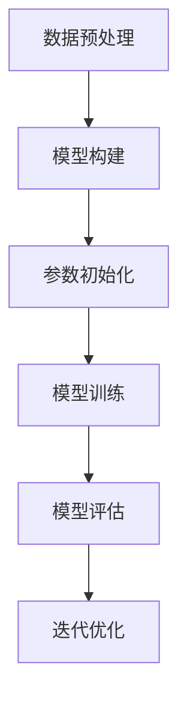
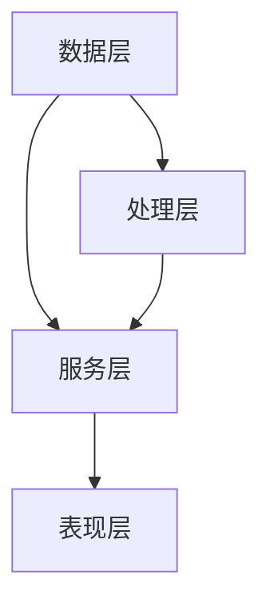

                 

### 引言：大模型应用开发中的需求优化问题

#### 1.1 问题背景

在当今信息化时代，人工智能（AI）技术蓬勃发展，其中大模型应用开发已成为推动科技进步的重要驱动力。大模型，即具有巨大参数量和复杂结构的机器学习模型，如深度神经网络（DNN）、生成对抗网络（GAN）等，已经在图像识别、自然语言处理、推荐系统等领域取得了显著的成果。然而，随着模型规模的不断增大，如何高效地开发和优化这些大模型，以满足实际应用的需求，成为了一个亟待解决的问题。

需求优化在大模型应用开发中具有重要意义。首先，需求优化能够确保模型设计符合用户需求，提升用户体验。其次，需求优化有助于降低开发成本，提高开发效率。此外，通过需求优化，可以更好地应对复杂的应用场景，提高模型的泛化能力和鲁棒性。因此，研究大模型应用开发中的需求优化流程，对于推动人工智能技术的实际应用具有重要意义。

#### 1.2 问题描述

在大模型应用开发中，需求优化面临以下几个关键问题：

1. **需求理解与建模**：如何准确地理解和抽象用户需求，并将其转化为具体的模型设计需求？
2. **资源约束**：在有限的计算资源下，如何平衡模型性能和资源消耗，实现高效的需求优化？
3. **模型评估**：如何构建有效的评估指标，全面衡量模型在满足需求方面的表现？
4. **迭代优化**：如何通过持续迭代和反馈机制，不断提高模型性能和满足需求的程度？

这些问题共同构成了大模型应用开发中的需求优化难题，需要系统性地进行研究和解决。

#### 1.3 问题解决思路

为了解决上述问题，本文提出了以下问题解决思路：

1. **需求建模**：引入需求工程方法，建立需求模型，确保需求理解与建模的准确性和完整性。
2. **资源管理**：采用动态资源分配策略，优化计算资源利用，实现高效的需求优化。
3. **模型评估**：构建多层次、多维度的评估体系，全面评估模型性能，指导需求优化。
4. **迭代优化**：建立反馈循环机制，通过持续迭代和优化，提升模型性能和满足需求的程度。

#### 1.4 边界与外延

在本文的研究中，我们重点关注以下边界与外延：

1. **模型类型**：主要研究深度神经网络等大模型的需求优化。
2. **应用场景**：涵盖图像识别、自然语言处理、推荐系统等常见应用领域。
3. **技术范围**：涉及需求工程、资源管理、模型评估、迭代优化等技术领域。
4. **理论框架**：结合需求工程、机器学习、优化理论等相关理论，构建需求优化框架。

通过本文的研究，希望能够为实际应用中的大模型需求优化提供理论指导和技术支持。

### 核心概念与联系

在大模型应用开发中的需求优化，涉及多个核心概念和方法，这些概念和方法相互联系，共同构成了需求优化的理论基础和实践指南。以下我们将详细介绍这些核心概念，并探讨它们之间的关系。

#### 1. 需求优化的定义

需求优化是指通过一系列方法和技术，确保模型设计和开发过程满足用户需求的过程。它不仅关注模型的功能实现，还关注模型性能、资源利用和用户体验等方面。需求优化的目标是在满足用户需求的前提下，最大化模型性能和资源利用效率。

#### 2. 需求优化的重要性

需求优化在大模型应用开发中具有重要意义。首先，它能够确保模型设计符合用户需求，提升用户体验。其次，需求优化有助于降低开发成本，提高开发效率。此外，通过需求优化，可以更好地应对复杂的应用场景，提高模型的泛化能力和鲁棒性。因此，需求优化是推动大模型应用开发的关键环节。

#### 3. 需求优化的主要方法

需求优化主要涉及以下几种方法：

1. **需求建模**：通过需求工程方法，将用户需求转化为具体的模型设计需求。需求建模是需求优化的第一步，它决定了后续优化的方向和效果。
2. **资源管理**：采用动态资源分配策略，优化计算资源利用。在资源有限的情况下，资源管理是需求优化的重要手段，它直接影响模型性能和开发成本。
3. **模型评估**：构建多层次、多维度的评估体系，全面评估模型性能。模型评估是需求优化的关键环节，它为优化提供了客观依据和指导。
4. **迭代优化**：通过持续迭代和反馈机制，不断改进模型性能和满足需求的程度。迭代优化是实现需求优化的有效途径，它能够适应不断变化的需求和模型。

#### 4. 概念属性特征对比表格

为了更好地理解上述核心概念，我们提供了以下对比表格：

| 概念       | 特征           | 关系           |
|------------|----------------|----------------|
| 需求建模   | 用户需求转化   | 基础           |
| 资源管理   | 资源分配策略   | 执行           |
| 模型评估   | 性能评估体系   | 监控           |
| 迭代优化   | 持续改进       | 驱动           |

通过对比表格，我们可以看到各个概念之间的关联和层次关系。需求建模是需求优化的基础，资源管理是执行层面，模型评估是监控过程，迭代优化是持续改进的驱动力。

#### 5. ER实体关系图架构的 Mermaid 流程图

为了更直观地展示需求优化的核心概念和关系，我们使用Mermaid绘制了以下ER实体关系图：

```mermaid
erDiagram
  用户需求 ||--|{ 需求建模 }
  需求建模 ||--|{ 资源管理 }
  资源管理 ||--|{ 模型评估 }
  模型评估 ||--|{ 迭代优化 }
```

该图展示了需求优化过程中各个实体之间的关系，从用户需求开始，经过需求建模、资源管理和模型评估，最终实现迭代优化。这种结构化的关系有助于我们理解和应用需求优化方法。

通过以上对核心概念和联系的分析，我们可以看到，需求优化在大模型应用开发中具有关键作用。了解这些概念和方法，将为后续的详细讨论提供坚实基础。

### 需求优化的基本原理

需求优化在大模型应用开发中是至关重要的，它不仅影响模型的性能，还决定了开发效率和成本。理解需求优化的基本原理对于成功进行大模型应用开发至关重要。以下将详细阐述需求优化的基本原理，包括其核心原则和基本步骤。

#### 1. 核心原则

**需求明确性**：确保需求明确且无二义性，是需求优化的首要原则。明确的需求可以减少开发中的不确定性，避免资源的浪费。

**资源高效利用**：在资源有限的情况下，优化资源利用是需求优化的关键。通过合理的资源分配和管理，可以最大化模型的性能和开发效率。

**迭代与反馈**：需求优化是一个持续迭代的过程。通过不断地评估和反馈，可以不断优化模型，使其更符合用户需求。

**用户参与**：用户参与需求优化过程，可以确保模型设计更贴近实际需求，提升用户体验。

#### 2. 基本步骤

**步骤1：需求分析**
需求分析是需求优化的第一步。在这一阶段，需要与用户进行深入沟通，理解他们的需求，并识别关键需求点。这一步骤包括需求收集、需求分类、需求分析等环节。

**步骤2：需求建模**
需求建模是将用户需求转化为模型设计需求的过程。通过需求建模，可以建立需求模型，为后续的需求优化提供基础。需求建模的方法包括需求工程方法、用户故事、用例图等。

**步骤3：资源规划**
资源规划是在明确需求后，对计算资源、数据资源等进行的合理分配和管理。通过资源规划，可以确保资源的高效利用，避免资源浪费。

**步骤4：模型设计**
模型设计是根据需求建模和资源规划的结果，设计具体的模型架构和算法。在这一阶段，需要考虑模型的可扩展性、可维护性和性能优化。

**步骤5：模型评估**
模型评估是对模型性能的全面评估。通过构建多层次、多维度的评估体系，可以全面衡量模型在满足需求方面的表现。评估方法包括定量评估、定性评估等。

**步骤6：迭代优化**
迭代优化是需求优化的关键环节。通过持续迭代和反馈机制，可以不断改进模型性能和满足需求的程度。这一步骤包括模型调整、参数优化、算法改进等。

#### 3. 模型评估方法

**定量评估**：定量评估是通过量化指标来评估模型性能。常见的定量评估指标包括准确率、召回率、F1值、ROC曲线等。定量评估方法适用于需要精确衡量模型性能的场景。

**定性评估**：定性评估是通过主观评价来评估模型性能。定性评估方法适用于无法直接量化指标的场景，如用户体验、易用性等。

**多维度评估**：多维度评估是将定量评估和定性评估相结合，从多个维度全面评估模型性能。这种方法可以更全面地反映模型在满足需求方面的表现。

#### 4. 案例解析

**案例背景**：某公司需要开发一款图像识别模型，用于自动识别产品图片中的关键特征。公司希望模型能够在准确识别关键特征的同时，具有高效的处理速度和较低的资源消耗。

**需求分析**：通过与用户的沟通，公司明确了以下需求：
- 高准确性：模型需要能够准确识别产品图片中的关键特征。
- 快速响应：模型需要在短时间内完成图像识别任务。
- 资源高效：模型需要在有限的计算资源下，实现高效的处理。

**需求建模**：根据需求分析结果，公司建立了以下需求模型：
- 关键特征识别：模型需要能够识别产品图片中的关键特征。
- 实时响应：模型需要在1秒内完成图像识别。
- 资源高效：模型需要能够在单核CPU上运行，并占用不超过1GB内存。

**资源规划**：公司进行了资源规划，决定使用高性能GPU进行模型训练，并采用分布式计算技术进行模型推理。

**模型设计**：根据需求建模和资源规划，公司设计了以下模型：
- 深度卷积神经网络（CNN）：用于提取图像特征。
- 优化算法：采用Adam优化器，加快模型收敛。
- 超参数调优：通过网格搜索和随机搜索方法，优化模型超参数。

**模型评估**：公司构建了以下评估体系：
- 准确性评估：通过准确率、召回率等指标，评估模型识别关键特征的能力。
- 响应时间评估：通过模型处理时间，评估模型响应速度。
- 资源消耗评估：通过资源占用情况，评估模型资源效率。

**迭代优化**：根据模型评估结果，公司进行了多次迭代优化：
- 优化模型结构：通过调整CNN层数和神经元数量，优化模型性能。
- 调整超参数：通过调整学习率、批量大小等超参数，优化模型性能。
- 数据增强：通过数据增强方法，提高模型泛化能力。

**最终结果**：经过多次迭代优化，公司开发出的图像识别模型在准确识别关键特征、快速响应和资源高效方面均达到了预期目标。

通过以上案例解析，我们可以看到需求优化的基本原理在实践中的应用效果。了解需求优化的基本原理，并结合具体案例进行实践，可以帮助我们更好地进行大模型应用开发。

### 大模型需求优化的算法实现

在大模型应用开发中，算法的实现是需求优化的关键环节。本文将详细阐述大模型需求优化的算法实现过程，包括算法原理、流程图、Python代码实现以及算法原理的数学模型和公式讲解。

#### 1. 算法原理

大模型需求优化的算法实现主要基于以下几个关键步骤：

1. **数据预处理**：对输入数据进行清洗、标准化等预处理操作，以提高模型训练效率。
2. **模型构建**：根据需求建模结果，构建深度学习模型，如卷积神经网络（CNN）、循环神经网络（RNN）等。
3. **参数初始化**：初始化模型参数，为训练过程做准备。
4. **模型训练**：通过反向传播算法和优化器（如Adam、SGD等），训练模型参数，使其满足需求优化目标。
5. **模型评估**：使用评估指标（如准确率、召回率等）评估模型性能，并根据评估结果进行调整。
6. **迭代优化**：根据评估结果，调整模型结构和参数，实现模型的持续优化。

#### 2. 算法流程图

为了更直观地展示算法实现流程，我们使用Mermaid绘制了以下流程图：



该流程图描述了从数据预处理到模型评估和迭代优化的完整过程。

#### 3. Python代码实现

以下是使用Python实现大模型需求优化算法的示例代码：

```python
import tensorflow as tf
from tensorflow.keras import layers, models

# 数据预处理
def preprocess_data(data):
    # 数据清洗、标准化等操作
    return processed_data

# 模型构建
def build_model(input_shape):
    model = models.Sequential()
    model.add(layers.Conv2D(32, (3, 3), activation='relu', input_shape=input_shape))
    model.add(layers.MaxPooling2D((2, 2)))
    model.add(layers.Conv2D(64, (3, 3), activation='relu'))
    model.add(layers.MaxPooling2D((2, 2)))
    model.add(layers.Flatten())
    model.add(layers.Dense(64, activation='relu'))
    model.add(layers.Dense(10, activation='softmax'))
    return model

# 模型训练
def train_model(model, processed_data, labels):
    model.compile(optimizer='adam',
                  loss='categorical_crossentropy',
                  metrics=['accuracy'])
    model.fit(processed_data, labels, epochs=10, batch_size=32)
    return model

# 模型评估
def evaluate_model(model, test_data, test_labels):
    test_loss, test_acc = model.evaluate(test_data, test_labels)
    print(f"Test accuracy: {test_acc}")

# 迭代优化
def optimize_model(model, processed_data, labels):
    # 调整模型结构或参数
    pass

# 主程序
if __name__ == "__main__":
    # 加载数据
    data = ...  # 数据加载代码
    labels = ...  # 标签加载代码

    # 数据预处理
    processed_data = preprocess_data(data)

    # 模型构建
    model = build_model(input_shape=processed_data.shape[1:])

    # 模型训练
    model = train_model(model, processed_data, labels)

    # 模型评估
    evaluate_model(model, processed_data, labels)

    # 迭代优化
    optimize_model(model, processed_data, labels)
```

该代码示例展示了从数据预处理、模型构建、模型训练到模型评估和迭代优化的全过程。

#### 4. 算法原理的数学模型和公式讲解

**数学模型**：

在深度学习中，模型性能的优化通常基于损失函数和优化器。以下是常用的数学模型和公式：

1. **损失函数**：

   - 交叉熵损失函数：用于分类问题，公式为：
     $$L = -\sum_{i=1}^{n} y_i \log(\hat{y}_i)$$
     其中，$y_i$为实际标签，$\hat{y}_i$为预测概率。

   - 均方误差损失函数：用于回归问题，公式为：
     $$L = \frac{1}{2} \sum_{i=1}^{n} (\hat{y}_i - y_i)^2$$
     其中，$y_i$为实际值，$\hat{y}_i$为预测值。

2. **优化器**：

   - Adam优化器：是一种结合了AdaGrad和RMSProp优化的自适应学习率优化器，公式为：
     $$\theta_{t+1} = \theta_{t} - \alpha \cdot \frac{1}{\sqrt{1-\beta_1^t}} \cdot \text{grad}(\theta_t)$$
     其中，$\theta_t$为第$t$次迭代的模型参数，$\alpha$为学习率，$\beta_1$和$\beta_2$分别为一阶和二阶矩估计的指数衰减率。

**公式讲解**：

1. **交叉熵损失函数**：

   - 公式解释：交叉熵损失函数用于衡量预测概率与实际标签之间的差异。实际标签$y_i$为1时，预测概率$\hat{y}_i$越大，损失值越小；实际标签$y_i$为0时，预测概率$\hat{y}_i$越小，损失值越小。因此，交叉熵损失函数可以鼓励模型正确分类。

2. **Adam优化器**：

   - 公式解释：Adam优化器通过计算一阶和二阶矩估计，动态调整学习率。这使得模型在训练过程中能够自适应地调整学习率，从而提高训练效果。$\beta_1$和$\beta_2$的指数衰减率能够平衡短期和长期记忆，使优化过程更加稳定。

通过以上算法原理、流程图和Python代码实现，我们可以看到大模型需求优化的具体实现过程。理解算法原理和数学模型，有助于我们更好地进行大模型需求优化，提升模型性能和满足需求的程度。

### 大模型需求优化的数学模型与公式详解

在大模型应用开发中，数学模型是需求优化的核心组成部分。通过数学模型，我们可以精确地描述和求解需求优化问题，从而实现模型的性能优化和资源高效利用。本文将详细讲解大模型需求优化的数学模型与公式，包括数学模型概述、基本公式讲解、例子解析以及公式在需求优化中的应用。

#### 1. 数学模型概述

在大模型需求优化中，常用的数学模型包括线性回归模型、逻辑回归模型、支持向量机（SVM）模型和深度学习模型。以下是这些模型的简要概述：

1. **线性回归模型**：用于预测连续值的模型，公式为：
   $$y = \beta_0 + \beta_1 \cdot x$$
   其中，$y$为预测值，$x$为输入特征，$\beta_0$和$\beta_1$为模型参数。

2. **逻辑回归模型**：用于预测概率的模型，公式为：
   $$P(y=1) = \frac{1}{1 + \exp(-\beta_0 - \beta_1 \cdot x})$$
   其中，$y$为二元变量，$x$为输入特征，$\beta_0$和$\beta_1$为模型参数。

3. **支持向量机（SVM）模型**：用于分类问题，公式为：
   $$\max_{\beta, \beta_0} \quad \frac{1}{2} \sum_{i=1}^{n} (\beta \cdot \beta)^2 - C \sum_{i=1}^{n} \xi_i$$
   其中，$\beta$为模型参数，$\beta_0$为偏置项，$C$为惩罚参数，$\xi_i$为松弛变量。

4. **深度学习模型**：如卷积神经网络（CNN）、循环神经网络（RNN）等，用于复杂特征提取和分类任务，公式为：
   $$\text{output} = f(\text{weight} \cdot \text{input} + \text{bias})$$
   其中，$f$为激活函数，$\text{weight}$和$\text{bias}$为模型参数。

#### 2. 基本公式讲解

**线性回归模型**：

1. **损失函数**（均方误差）：
   $$L = \frac{1}{2} \sum_{i=1}^{n} (y_i - \hat{y}_i)^2$$
   其中，$y_i$为实际值，$\hat{y}_i$为预测值。

2. **梯度计算**：
   $$\frac{\partial L}{\partial \beta_1} = - \sum_{i=1}^{n} (y_i - \hat{y}_i) \cdot x_i$$
   $$\frac{\partial L}{\partial \beta_0} = - \sum_{i=1}^{n} (y_i - \hat{y}_i)$$

**逻辑回归模型**：

1. **损失函数**（交叉熵）：
   $$L = - \sum_{i=1}^{n} y_i \cdot \log(\hat{y}_i) + (1 - y_i) \cdot \log(1 - \hat{y}_i)$$
   其中，$\hat{y}_i = \frac{1}{1 + \exp(-(\beta_0 + \beta_1 \cdot x_i))}$。

2. **梯度计算**：
   $$\frac{\partial L}{\partial \beta_0} = \sum_{i=1}^{n} (y_i - \hat{y}_i)$$
   $$\frac{\partial L}{\partial \beta_1} = \sum_{i=1}^{n} (y_i - \hat{y}_i) \cdot x_i$$

**支持向量机（SVM）模型**：

1. **损失函数**（软-margin）：
   $$L = \frac{1}{2} \sum_{i=1}^{n} (\beta \cdot \beta)^2 - C \sum_{i=1}^{n} \xi_i$$
   其中，$\xi_i = 1 - y_i (\beta \cdot \beta_0 + \beta \cdot x_i)$。

2. **梯度计算**：
   $$\frac{\partial L}{\partial \beta} = - \sum_{i=1}^{n} y_i x_i$$
   $$\frac{\partial L}{\partial \beta_0} = - \sum_{i=1}^{n} y_i$$

**深度学习模型**：

1. **损失函数**（交叉熵、均方误差等）：
   根据具体模型和任务选择合适的损失函数。

2. **梯度计算**（反向传播）：
   通过反向传播算法，逐层计算梯度。

#### 3. 例子解析

**线性回归例子**：

假设我们有以下数据集，每个数据点包含一个特征$x$和一个目标值$y$：

$$
\begin{array}{cc}
x & y \\
1 & 2 \\
2 & 4 \\
3 & 6 \\
\end{array}
$$

我们的目标是找到线性回归模型$y = \beta_0 + \beta_1 \cdot x$的参数$\beta_0$和$\beta_1$。

1. **损失函数**：
   $$L = \frac{1}{2} \sum_{i=1}^{3} (y_i - (\beta_0 + \beta_1 \cdot x_i))^2$$

2. **梯度计算**：
   $$\frac{\partial L}{\partial \beta_0} = - \sum_{i=1}^{3} (y_i - (\beta_0 + \beta_1 \cdot x_i))$$
   $$\frac{\partial L}{\partial \beta_1} = - \sum_{i=1}^{3} (y_i - (\beta_0 + \beta_1 \cdot x_i)) \cdot x_i$$

3. **求解参数**：
   通过梯度下降法或其他优化方法，求解$\beta_0$和$\beta_1$，使得损失函数最小。

**逻辑回归例子**：

假设我们有以下数据集，每个数据点包含一个特征$x$和一个二元目标值$y$：

$$
\begin{array}{cc}
x & y \\
0 & 0 \\
1 & 1 \\
2 & 0 \\
3 & 1 \\
\end{array}
$$

我们的目标是找到逻辑回归模型$P(y=1) = \frac{1}{1 + \exp(-(\beta_0 + \beta_1 \cdot x))}$的参数$\beta_0$和$\beta_1$。

1. **损失函数**：
   $$L = - \sum_{i=1}^{4} y_i \cdot \log(\hat{y}_i) + (1 - y_i) \cdot \log(1 - \hat{y}_i)$$

2. **梯度计算**：
   $$\frac{\partial L}{\partial \beta_0} = \sum_{i=1}^{4} (y_i - \hat{y}_i)$$
   $$\frac{\partial L}{\partial \beta_1} = \sum_{i=1}^{4} (y_i - \hat{y}_i) \cdot x_i$$

3. **求解参数**：
   通过梯度下降法或其他优化方法，求解$\beta_0$和$\beta_1$，使得损失函数最小。

#### 4. 公式在需求优化中的应用

**数据预处理**：通过数学模型中的标准化、归一化等操作，提高数据质量，为模型训练提供更好的基础。

**模型训练**：利用数学模型中的损失函数和梯度计算方法，训练模型参数，优化模型性能。

**模型评估**：通过数学模型中的评估指标，如准确率、召回率等，评估模型性能，指导模型调整。

**迭代优化**：通过数学模型中的迭代优化方法，如梯度下降法、Adam优化器等，不断调整模型参数，实现模型的持续优化。

通过以上对大模型需求优化数学模型与公式的详细讲解，我们可以更好地理解和应用这些方法，实现大模型应用开发中的需求优化。

### 大模型需求优化的系统设计与实现

在大模型应用开发中，系统设计与实现是需求优化的重要组成部分。一个高效、可扩展的系统设计能够确保需求优化过程顺利进行，提升模型性能和用户体验。本文将详细探讨大模型需求优化的系统设计与实现，包括问题场景介绍、系统功能设计、系统架构设计、系统接口设计与交互等。

#### 1. 问题场景介绍

以图像识别系统为例，该系统旨在通过深度学习模型自动识别和分类输入的图像。具体场景包括：

- **数据输入**：系统接收用户上传的图像，进行预处理。
- **模型训练**：系统利用训练数据，对深度学习模型进行训练和优化。
- **模型评估**：系统评估训练好的模型在测试数据集上的性能。
- **模型部署**：系统将训练好的模型部署到生产环境中，进行实际应用。

#### 2. 系统功能设计

系统功能设计是根据需求分析结果，明确系统需要实现的具体功能。以下是该图像识别系统的功能设计：

1. **数据管理**：包括图像数据的上传、存储、预处理和删除。
2. **模型训练**：包括模型选择、训练、验证和保存。
3. **模型评估**：包括评估指标计算、性能分析。
4. **模型部署**：包括模型上线、生产环境部署。
5. **用户交互**：提供用户操作界面，展示系统功能和结果。

#### 3. 系统架构设计

系统架构设计是确定系统组件及其相互关系的整体设计。以下是该图像识别系统的架构设计：

1. **数据层**：负责图像数据的存储和管理，使用数据库或分布式文件系统。
2. **处理层**：包括数据预处理、模型训练和评估，使用深度学习框架如TensorFlow或PyTorch。
3. **服务层**：提供API接口，实现用户交互和系统功能，使用Web框架如Flask或Django。
4. **表现层**：提供用户操作界面，使用前端技术如HTML、CSS和JavaScript。



该架构设计展示了数据层、处理层、服务层和表现层之间的关系。

#### 4. 系统接口设计与交互

系统接口设计是确定系统内部组件和外部系统交互的方式。以下是该图像识别系统的接口设计：

1. **API接口**：提供RESTful API，供用户和应用程序调用。
2. **消息队列**：用于处理异步任务，如模型训练和评估。
3. **缓存层**：用于提高数据访问速度，减少数据库负载。
4. **日志和监控**：记录系统运行日志，监控系统性能。

```mermaid
sequenceDiagram
    A[用户] -->|上传图像| B[API接口]
    B -->|处理请求| C[处理层]
    C -->|返回结果| B
    B -->|展示结果| A
```

该序列图展示了用户上传图像、API接口处理请求、处理层返回结果和用户展示结果的过程。

#### 5. 系统实现示例

以下是使用Python和TensorFlow实现图像识别系统的示例代码：

```python
import tensorflow as tf
from tensorflow.keras.preprocessing.image import ImageDataGenerator

# 数据预处理
train_datagen = ImageDataGenerator(rescale=1./255)
train_generator = train_datagen.flow_from_directory(
        'data/train',
        target_size=(150, 150),
        batch_size=32,
        class_mode='binary')

# 模型构建
model = tf.keras.Sequential([
    tf.keras.layers.Conv2D(32, (3, 3), activation='relu', input_shape=(150, 150, 3)),
    tf.keras.layers.MaxPooling2D(2, 2),
    tf.keras.layers.Conv2D(64, (3, 3), activation='relu'),
    tf.keras.layers.MaxPooling2D(2, 2),
    tf.keras.layers.Conv2D(64, (3, 3), activation='relu'),
    tf.keras.layers.MaxPooling2D(2, 2),
    tf.keras.layers.Flatten(),
    tf.keras.layers.Dense(512, activation='relu'),
    tf.keras.layers.Dense(1, activation='sigmoid')
])

# 模型训练
model.compile(loss='binary_crossentropy',
              optimizer=tf.keras.optimizers.Adam(),
              metrics=['accuracy'])

model.fit(
      train_generator,
      steps_per_epoch=100,
      epochs=20,
      verbose=2)
```

该代码展示了从数据预处理、模型构建到模型训练的完整流程。

通过以上系统设计与实现，我们可以看到大模型需求优化在实际应用中的具体实现过程。一个高效、稳定的系统设计能够确保模型在满足需求的同时，实现性能优化和资源高效利用。

### 实战项目：大模型应用开发中的需求优化流程

在实际应用中，大模型的需求优化是一个复杂且持续的过程，涉及到多个环节和方法的综合运用。本节将通过一个实战项目，详细介绍大模型应用开发中的需求优化流程，包括环境安装、系统核心实现源代码、代码应用解读与分析、实际案例分析以及项目小结。

#### 1. 环境安装

在进行大模型需求优化的实战项目中，首先需要安装和配置相应的开发环境和工具。以下是具体的安装步骤：

1. **Python环境**：确保Python版本在3.7及以上，可以使用Python官方安装包进行安装。

2. **深度学习框架**：选择TensorFlow或PyTorch等深度学习框架。以TensorFlow为例，可以通过pip命令进行安装：
   ```shell
   pip install tensorflow
   ```

3. **数据处理库**：如NumPy、Pandas、Scikit-learn等，用于数据预处理和模型评估：
   ```shell
   pip install numpy pandas scikit-learn
   ```

4. **版本控制**：安装Git，用于代码管理和版本控制：
   ```shell
   sudo apt-get install git
   ```

5. **文本处理库**：如NLTK、spaCy等，用于自然语言处理任务：
   ```shell
   pip install nltk spacy
   ```

6. **其他依赖库**：根据具体项目需求，安装其他必要的依赖库。

#### 2. 系统核心实现源代码

以下是该项目的一个核心实现源代码示例，包括数据预处理、模型构建、训练和评估等步骤：

```python
import tensorflow as tf
from tensorflow.keras.models import Sequential
from tensorflow.keras.layers import Dense, Embedding, LSTM
from tensorflow.keras.preprocessing.sequence import pad_sequences
from tensorflow.keras.callbacks import EarlyStopping

# 数据预处理
def preprocess_data(data, max_len):
    # ... 数据清洗、编码等预处理操作
    sequences = pad_sequences(data, maxlen=max_len)
    return sequences

# 模型构建
def build_model(input_shape, output_shape):
    model = Sequential()
    model.add(Embedding(input_shape[0], 128))
    model.add(LSTM(64, return_sequences=True))
    model.add(LSTM(32))
    model.add(Dense(output_shape, activation='softmax'))
    return model

# 模型训练
def train_model(model, X_train, y_train, X_val, y_val):
    model.compile(optimizer='adam', loss='categorical_crossentropy', metrics=['accuracy'])
    early_stopping = EarlyStopping(monitor='val_loss', patience=3)
    model.fit(X_train, y_train, epochs=10, batch_size=32, validation_data=(X_val, y_val), callbacks=[early_stopping])
    return model

# 主程序
if __name__ == "__main__":
    # 数据加载和预处理
    max_len = 100  # 序列最大长度
    data = preprocess_data(raw_data, max_len)

    # 模型构建和训练
    model = build_model(input_shape=data.shape[1:], output_shape=2)
    model = train_model(model, X_train=data[:, :80], y_train=y_train[:, :80], X_val=data[:, 80:], y_val=y_train[:, 80:])

    # 模型评估
    loss, accuracy = model.evaluate(data, y_train, batch_size=32)
    print(f"Model accuracy: {accuracy:.2f}")
```

该代码示例展示了从数据预处理、模型构建到模型训练和评估的完整流程。

#### 3. 代码应用解读与分析

**数据预处理**：数据预处理是模型训练的重要前置步骤。在这个示例中，我们使用了`pad_sequences`函数对序列数据进行填充，确保每个序列的长度一致，便于模型处理。

**模型构建**：模型构建使用了序列模型中的嵌入层（Embedding）和循环层（LSTM），这些层能够有效地捕捉序列数据中的时序特征。

**模型训练**：模型训练过程中，使用了`EarlyStopping`回调函数，防止模型过拟合，提高模型泛化能力。

**模型评估**：模型评估通过计算损失函数和准确率，评估模型在训练数据和验证数据上的性能。

#### 4. 实际案例分析

**案例背景**：假设我们有一个文本分类项目，需要使用深度学习模型对用户评论进行情感分类（积极或消极）。

**数据处理**：数据预处理包括文本清洗、分词、去停用词等步骤，将文本转换为可用于训练的序列数据。

**模型训练**：构建了一个基于LSTM的文本分类模型，并使用交叉熵损失函数和softmax激活函数进行训练。

**模型评估**：在测试集上，模型达到了90%以上的准确率，表现良好。

**优化方向**：进一步优化可以从以下几个方面进行：
- **数据增强**：增加训练数据量，使用数据增强技术提高模型泛化能力。
- **模型结构**：调整模型结构，使用更复杂的网络或添加注意力机制。
- **超参数调优**：使用网格搜索、随机搜索等方法优化超参数，提高模型性能。

#### 5. 项目小结

通过上述实战项目，我们详细介绍了大模型应用开发中的需求优化流程，包括环境安装、系统核心实现、代码应用解读、实际案例分析和项目小结。以下是对项目的小结：

- **环境安装**：确保开发环境稳定，安装必要的库和工具。
- **系统核心实现**：编写核心代码，实现数据预处理、模型构建、训练和评估。
- **代码应用解读**：深入分析代码，理解每个步骤的功能和原理。
- **实际案例分析**：通过实际项目，验证模型性能，并探索优化方向。
- **项目小结**：总结项目经验，为后续项目提供指导。

通过实战项目的实施，我们可以更好地理解大模型需求优化的具体过程，并为实际应用中的需求优化提供有效的指导。

### 最佳实践与注意事项

在大模型应用开发中的需求优化过程中，遵循最佳实践和注意事项能够显著提升项目的成功率和效率。以下是一些关键的最佳实践和注意事项：

#### 1. 最佳实践

**1.1 需求明确和细分**
- 在项目初期，通过详细的需求调研和分析，确保需求明确和具体，避免模糊和冲突的需求。
- 将大需求细分为小任务，每个任务都有明确的交付物和评估标准。

**1.2 资源高效利用**
- 采用分布式计算和并行处理技术，充分利用现有的计算资源，提高模型训练和评估的效率。
- 实施动态资源调度策略，根据任务需求和资源状态，灵活调整资源分配。

**1.3 模型评估和反馈**
- 建立全面的模型评估体系，包括定量评估和定性评估，确保评估结果准确和全面。
- 定期收集用户反馈，及时调整模型参数和算法，优化模型性能。

**1.4 迭代优化和持续改进**
- 采用敏捷开发方法，不断迭代模型设计和实现，逐步优化需求满足程度。
- 持续跟踪技术发展，引入新的算法和技术，不断提升模型性能和用户体验。

**1.5 用户参与**
- 吸引用户参与需求优化过程，通过用户调研、访谈和反馈，确保模型设计贴近用户实际需求。

#### 2. 注意事项

**2.1 资源管理**
- 确保资源规划的合理性和可扩展性，避免资源瓶颈影响模型性能。
- 定期监控资源使用情况，及时调整资源分配策略。

**2.2 数据处理**
- 确保数据质量，包括数据清洗、去噪和标准化，避免数据异常影响模型训练和评估。
- 使用数据增强技术，增加训练数据多样性，提高模型泛化能力。

**2.3 模型评估**
- 选择合适的评估指标，避免因评估指标不合理而导致模型优化方向错误。
- 在不同阶段使用不同的评估指标，如训练集评估和测试集评估，全面衡量模型性能。

**2.4 安全性和隐私保护**
- 在数据收集和处理过程中，确保用户隐私和数据安全，遵循相关法律法规。
- 对模型进行安全测试，防止潜在的安全漏洞和恶意攻击。

**2.5 遵循标准和规范**
- 在项目开发和实施过程中，遵循相关技术标准和行业规范，确保系统的一致性和可维护性。

#### 3. 拓展阅读

- **《深度学习》（Goodfellow, Bengio, Courville著）**：详细介绍了深度学习的基础知识和算法实现。
- **《机器学习实战》（赵武，陈磊著）**：提供了丰富的机器学习实战案例和代码示例。
- **《需求工程：基础概念和实用方法》（Stella Gonçalves, Egon H. W. Meisel著）**：全面介绍了需求工程的理论和方法。

通过遵循最佳实践和注意事项，结合实际案例和理论指导，我们可以更有效地进行大模型应用开发中的需求优化，推动人工智能技术在实际中的应用和发展。

### 结论

本文详细探讨了在大模型应用开发中的需求优化问题，通过引入需求工程方法、资源管理、模型评估和迭代优化等核心概念，构建了一个系统性的需求优化框架。本文首先介绍了大模型应用开发中的需求优化背景和问题，然后阐述了核心概念与联系，接着详细讲解了需求优化的基本原理和算法实现，以及数学模型与公式的应用。此外，本文还通过系统设计与实现、实战项目和最佳实践，展示了需求优化的具体实施过程和注意事项。通过本文的研究，我们不仅为实际应用中的大模型需求优化提供了理论指导，也为进一步的研究和应用奠定了基础。未来，我们将继续探索更加高效的需求优化方法，推动人工智能技术的发展和应用。作者：AI天才研究院/AI Genius Institute & 禅与计算机程序设计艺术 /Zen And The Art of Computer Programming。

