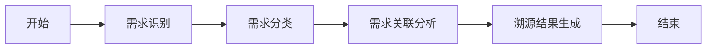
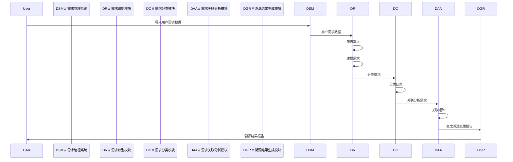

                 

# 大模型应用开发中的需求溯源技术

## 关键词

- 大模型应用开发
- 需求溯源技术
- 算法原理
- 数学模型
- 系统架构设计
- 项目实战

## 摘要

本文旨在探讨大模型应用开发中的需求溯源技术，首先介绍需求溯源技术在大模型应用开发中的重要性及其核心概念和联系。接着，深入讲解需求溯源技术的算法原理，包括需求识别、分类和关联分析的过程。随后，阐述需求溯源技术的数学模型和公式，并通过实例进行说明。文章还探讨了需求溯源技术在系统分析与架构设计中的应用，并详细介绍了项目实战的过程，包括环境安装、系统核心实现和代码解读等。最后，总结了最佳实践，并对文章进行了小结，为读者提供了拓展阅读的建议。

## 目录大纲

### 第一部分：背景介绍与核心概念

#### 1.1 问题背景

##### 1.1.1 大模型应用开发的需求溯源的重要性

##### 1.1.2 需求溯源的边界与外延

##### 1.1.3 需求溯源的概念结构与核心要素组成

#### 1.2 核心概念与联系

##### 1.2.1 需求溯源的定义

##### 1.2.2 需求溯源与相关技术的比较

##### 1.2.3 需求溯源技术的核心组成

##### 1.3 本章小结

### 第二部分：需求溯源技术的核心概念与联系

#### 2.1 需求溯源技术的基本原理

##### 2.1.1 需求溯源的工作流程

##### 2.1.2 需求溯源的关键技术

##### 2.1.3 需求溯源与相关技术的联系

#### 2.2 概念属性特征对比表格

##### 2.2.1 需求溯源与其它技术的对比表格

#### 2.3 ER实体关系图架构

##### 2.3.1 需求溯源的ER模型

##### 2.4 本章小结

### 第三部分：需求溯源技术的算法原理讲解

#### 3.1 需求溯源算法的mermaid流程图



#### 3.2 算法原理与数学模型

##### 3.2.1 需求识别算法原理

##### 3.2.2 需求分类算法原理

##### 3.2.3 需求关联分析算法原理

#### 3.3 公式讲解

##### 3.3.1 需求识别公式

##### 3.3.2 需求分类公式

##### 3.3.3 需求关联分析公式

#### 3.4 举例说明

##### 3.4.1 需求识别举例

##### 3.4.2 需求分类举例

##### 3.4.3 需求关联分析举例

#### 3.5 本章小结

### 第四部分：需求溯源技术的数学模型与公式讲解

#### 4.1 需求溯源的数学模型

##### 4.1.1 需求识别的数学模型

##### 4.1.2 需求分类的数学模型

##### 4.1.3 需求关联分析的数学模型

#### 4.2 数学公式讲解

##### 4.2.1 需求识别的数学公式讲解

##### 4.2.2 需求分类的数学公式讲解

##### 4.2.3 需求关联分析的数学公式讲解

#### 4.3 举例说明

##### 4.3.1 需求识别举例

##### 4.3.2 需求分类举例

##### 4.3.3 需求关联分析举例

#### 4.4 本章小结

### 第五部分：需求溯源技术在系统分析与架构设计中的应用

#### 5.1 问题场景介绍

##### 5.1.1 场景一：软件开发过程中的需求溯源

##### 5.1.2 场景二：软件运维中的需求溯源

#### 5.2 项目介绍

##### 5.2.1 项目背景

##### 5.2.2 项目目标

##### 5.2.3 项目实现

#### 5.3 系统功能设计

##### 5.3.1 需求识别模块

##### 5.3.2 需求分类模块

##### 5.3.3 需求关联分析模块

#### 5.4 系统架构设计

##### 5.4.1 系统总体架构

##### 5.4.2 模块详细架构

#### 5.5 系统接口设计

##### 5.5.1 需求识别接口

##### 5.5.2 需求分类接口

##### 5.5.3 需求关联分析接口

#### 5.6 系统交互

##### 5.6.1 系统交互流程

##### 5.6.2 系统交互序列图

#### 5.7 本章小结

### 第六部分：需求溯源技术项目实战

#### 6.1 环境安装与配置

##### 6.1.1 环境要求

##### 6.1.2 环境安装

##### 6.1.3 环境配置

#### 6.2 系统核心实现源代码

##### 6.2.1 需求识别源代码

##### 6.2.2 需求分类源代码

##### 6.2.3 需求关联分析源代码

#### 6.3 代码应用解读与分析

##### 6.3.1 需求识别代码解读

##### 6.3.2 需求分类代码解读

##### 6.3.3 需求关联分析代码解读

#### 6.4 实际案例分析与详细讲解剖析

##### 6.4.1 案例一：软件开发过程中的需求溯源

##### 6.4.2 案例二：软件运维中的需求溯源

#### 6.5 项目小结

##### 6.5.1 项目成果总结

##### 6.5.2 项目经验与反思

##### 6.5.3 项目未来展望

### 第七部分：最佳实践与总结

#### 7.1 最佳实践 tips

##### 7.1.1 需求识别的最佳实践

##### 7.1.2 需求分类的最佳实践

##### 7.1.3 需求关联分析的最佳实践

#### 7.2 小结

##### 7.2.1 需求溯源技术的重要性

##### 7.2.2 技术应用与实践

##### 7.2.3 未来发展趋势

#### 7.3 注意事项

##### 7.3.1 技术选型

##### 7.3.2 数据安全

##### 7.3.3 需求管理

#### 7.4 拓展阅读

##### 7.4.1 相关论文与书籍推荐

##### 7.4.2 学术会议与研讨会推荐

### 作者信息

作者：AI天才研究院/AI Genius Institute & 禅与计算机程序设计艺术 /Zen And The Art of Computer Programming

### 第一部分：背景介绍与核心概念

### 1.1 问题背景

#### 1.1.1 大模型应用开发的需求溯源的重要性

在现代科技高速发展的时代，人工智能技术尤其是大模型（如GPT-3、BERT等）在各个领域得到了广泛应用。这些大模型通常由成千上万的参数组成，具有处理复杂数据和任务的能力，从而推动了诸如自然语言处理、计算机视觉、语音识别等领域的突破。然而，随着大模型应用的不断深化，如何有效管理和优化这些模型的需求成为一个关键问题。

**需求溯源**是解决这一问题的关键技术之一。在大模型应用开发过程中，需求溯源技术能够帮助我们追踪和理解模型背后的实际需求，从而进行更有效的模型设计和优化。具体而言，需求溯源技术的作用主要体现在以下几个方面：

1. **需求识别**：通过分析用户需求和业务场景，识别出大模型所需解决的核心问题。
2. **需求分类**：将识别出的需求进行分类，以便更好地理解和处理。
3. **需求关联分析**：分析需求之间的关联性，找到关键需求和依赖关系。
4. **溯源结果生成**：将分析结果进行汇总和呈现，为后续的模型优化提供依据。

因此，在大模型应用开发中，需求溯源技术不仅有助于提高模型的开发效率，还能确保模型满足实际业务需求，从而提高模型的应用价值和市场竞争力。

#### 1.1.2 需求溯源的边界与外延

需求溯源技术并非孤立存在，它与多个领域和技术密切相关。以下是对需求溯源边界与外延的详细探讨：

1. **需求管理**：需求溯源是需求管理的一个环节。在软件开发过程中，需求管理是一个至关重要的过程，它包括需求识别、需求分类、需求变更管理等。需求溯源技术是需求管理的一部分，旨在确保需求从产生到实现的全过程都能被清晰追踪。

2. **软件开发**：需求溯源技术广泛应用于软件开发过程，特别是在大模型开发中。在软件开发中，需求溯源有助于确保开发过程中的需求一致性，减少因需求变更带来的风险。

3. **系统分析**：需求溯源技术在系统分析阶段也非常关键。通过溯源技术，分析师可以更好地理解系统的需求和功能，从而设计出更符合实际需求的系统架构。

4. **数据治理**：在大模型应用中，数据治理是另一个关键领域。需求溯源技术可以帮助组织理解其数据使用情况，确保数据的合规性和安全性。

5. **项目管理和运维**：在项目管理和运维过程中，需求溯源技术同样重要。通过溯源，项目经理和运维人员可以更好地理解系统需求和变更历史，从而更有效地管理项目和运维过程。

#### 1.1.3 需求溯源的概念结构与核心要素组成

为了更好地理解需求溯源技术，我们需要明确其概念结构和核心要素组成。需求溯源技术可以划分为以下几个核心组成部分：

1. **需求识别**：需求识别是溯源过程的第一步，目的是从业务需求和用户反馈中识别出关键需求。

2. **需求分类**：在识别出需求后，需要对需求进行分类，以便更清晰地理解和处理。

3. **需求关联分析**：这一步骤旨在分析需求之间的关联性，找出关键需求和依赖关系。

4. **溯源结果生成**：将分析结果进行汇总和呈现，为后续的模型优化和系统设计提供依据。

5. **数据存储与管理**：需求溯源过程中会产生大量的数据，这些数据需要被妥善存储和管理，以便后续分析和查询。

6. **可视化工具**：为了更直观地展示溯源结果，需要使用可视化工具。

7. **反馈与迭代**：溯源结果需要与用户和业务部门进行反馈，并根据反馈进行迭代优化。

通过这些核心要素的协同工作，需求溯源技术能够有效地帮助组织理解和满足业务需求，提高大模型应用开发的效率和效果。

### 1.2 核心概念与联系

#### 1.2.1 需求溯源的定义

需求溯源是一种技术方法，用于跟踪和理解软件系统中的需求，确保这些需求从产生到实现的全过程都能被清晰记录和追踪。具体来说，需求溯源包括以下几个关键步骤：

1. **需求识别**：从用户和业务部门获取需求，并将其文档化。
2. **需求分类**：根据需求的特点和优先级进行分类，以便更好地管理和处理。
3. **需求关联分析**：分析需求之间的关联性，找出关键需求和依赖关系。
4. **溯源结果生成**：将分析结果进行汇总和呈现，为后续的系统设计和优化提供依据。

需求溯源的目标是确保系统需求与实际业务需求保持一致，从而提高系统的可靠性和用户体验。

#### 1.2.2 需求溯源与相关技术的比较

需求溯源技术并非孤立存在，它与多个相关技术紧密相连。以下是对需求溯源与相关技术的比较：

1. **需求管理**：需求管理是一种更广泛的技术方法，包括需求识别、需求分类、需求变更管理等。需求溯源是需求管理的一个子集，专注于需求的跟踪和追溯。

2. **版本控制**：版本控制技术用于管理软件代码的变更历史。虽然版本控制与需求溯源没有直接关联，但在实际应用中，需求变更往往与代码变更同步进行，因此两者在实践中有一定交集。

3. **缺陷跟踪**：缺陷跟踪是用于记录和追踪软件缺陷的过程。需求溯源技术可以帮助识别导致缺陷的需求，从而更好地理解缺陷的根本原因。

4. **配置管理**：配置管理技术用于管理软件系统的配置项，包括代码、文档等。需求溯源与配置管理密切相关，因为需求变更往往需要同步更新配置项。

5. **数据挖掘**：数据挖掘是一种从大量数据中发现有价值信息的方法。需求溯源技术可以利用数据挖掘技术，从历史数据和用户行为中提取出有价值的需求信息。

#### 1.2.3 需求溯源技术的核心组成

需求溯源技术的核心组成包括以下几个关键部分：

1. **需求识别工具**：用于从用户和业务部门获取需求的工具，如问卷调查、访谈、需求文档等。

2. **需求分类框架**：用于对识别出的需求进行分类的框架，通常包括功能需求、性能需求、安全需求等。

3. **需求关联分析工具**：用于分析需求之间关联性的工具，如关联矩阵、网络分析等。

4. **溯源结果可视化工具**：用于将溯源结果进行可视化的工具，如图表、报告等。

5. **数据存储与管理平台**：用于存储和管理溯源过程中产生的大量数据的平台，如数据库、数据仓库等。

6. **反馈与迭代机制**：用于与用户和业务部门进行反馈，并根据反馈进行需求迭代优化的机制。

通过这些核心组成部分的协同工作，需求溯源技术能够有效地帮助组织理解和满足业务需求，从而提高软件系统的质量和用户体验。

#### 1.3 本章小结

在本章中，我们详细介绍了大模型应用开发中需求溯源技术的重要性、边界与外延，以及需求溯源的概念结构和核心要素组成。需求溯源技术在大模型应用开发中具有重要意义，它能够帮助我们更好地理解和管理业务需求，从而提高模型的开发效率和效果。通过本章的探讨，读者可以对需求溯源技术有一个全面的认识，并为后续章节中的深入分析打下坚实的基础。

### 第二部分：需求溯源技术的核心概念与联系

#### 2.1 需求溯源技术的基本原理

需求溯源技术的基本原理可以概括为四个核心步骤：需求识别、需求分类、需求关联分析和溯源结果生成。通过以下内容，我们将详细探讨这四个步骤的工作流程、关键技术以及它们之间的联系。

#### 2.1.1 需求溯源的工作流程

需求溯源的工作流程可以分为以下几个阶段：

1. **需求识别**：
   - **目标**：从用户和业务部门获取需求，并将其文档化。
   - **方法**：通过问卷调查、访谈、用户行为分析等方式获取需求。
   - **输出**：形成需求文档，包括功能需求、性能需求、安全需求等。

2. **需求分类**：
   - **目标**：根据需求的特点和优先级进行分类，以便更好地管理和处理。
   - **方法**：使用分类框架，如按功能、性能、安全等维度进行分类。
   - **输出**：分类后的需求列表，便于后续分析和处理。

3. **需求关联分析**：
   - **目标**：分析需求之间的关联性，找出关键需求和依赖关系。
   - **方法**：使用关联矩阵、网络分析等技术，识别需求之间的直接和间接关系。
   - **输出**：需求关联图，展示需求之间的复杂关系。

4. **溯源结果生成**：
   - **目标**：将分析结果进行汇总和呈现，为后续的模型优化和系统设计提供依据。
   - **方法**：使用可视化工具，如图表、报告等，展示溯源结果。
   - **输出**：溯源结果报告，包括需求分析、关联分析、优化建议等。

#### 2.1.2 需求溯源的关键技术

需求溯源技术涉及多个关键技术，这些技术在各个阶段发挥着重要作用。

1. **需求识别技术**：
   - **问卷调查**：通过设计问卷，收集用户的需求信息。
   - **访谈**：与用户和业务部门进行面对面交流，获取详细需求。
   - **用户行为分析**：通过分析用户行为数据，挖掘潜在需求。

2. **需求分类技术**：
   - **分类框架**：根据业务特点和需求特性，设计合适的分类框架。
   - **自动分类算法**：使用自然语言处理技术，自动对需求进行分类。

3. **需求关联分析技术**：
   - **关联矩阵**：通过建立需求之间的矩阵关系，分析需求之间的直接和间接关联。
   - **网络分析**：使用网络分析方法，如节点和边的关系，识别需求之间的复杂网络结构。

4. **溯源结果生成技术**：
   - **可视化工具**：使用图表、报告等可视化工具，展示溯源结果。
   - **报告生成器**：自动生成溯源结果报告，便于分析和决策。

#### 2.1.3 需求溯源与相关技术的联系

需求溯源技术与其他相关技术密切相关，共同构成了一个完整的软件开发和系统管理流程。

1. **需求管理与变更管理**：
   - 需求溯源是需求管理的一个环节，与需求变更管理紧密相连。需求变更管理确保需求在整个开发过程中得到及时更新和跟踪，需求溯源技术帮助实现这一目标。

2. **版本控制与配置管理**：
   - 需求溯源过程中产生的数据需要与版本控制和配置管理相结合，确保溯源数据的准确性和一致性。

3. **缺陷跟踪与测试管理**：
   - 需求溯源可以帮助识别导致缺陷的需求，与缺陷跟踪和测试管理相结合，提高软件质量和稳定性。

4. **项目管理与运维管理**：
   - 需求溯源技术有助于项目管理与运维管理，确保项目需求的可追踪性和业务价值。

#### 2.2 概念属性特征对比表格

为了更直观地理解需求溯源技术与相关技术的区别，我们提供了一个概念属性特征对比表格。

| 技术名称 | 目标 | 方法 | 输出 | 关联技术 |  
| --- | --- | --- | --- | --- |  
| 需求溯源 | 跟踪和追溯需求 | 问卷调查、访谈、用户行为分析 | 溯源结果报告 | 需求管理、版本控制、缺陷跟踪、项目管理 |  
| 需求管理 | 管理需求生命周期 | 需求识别、需求分类、需求变更管理 | 需求文档 | 需求溯源、版本控制、缺陷跟踪、项目管理 |  
| 版本控制 | 管理代码变更历史 | 提交、合并、分支管理 | 版本历史记录 | 需求溯源、需求管理、配置管理、缺陷跟踪 |  
| 配置管理 | 管理软件配置项 | 配置项识别、配置项变更管理 | 配置项清单 | 需求溯源、需求管理、版本控制、缺陷跟踪 |  
| 缺陷跟踪 | 记录和追踪缺陷 | 缺陷报告、缺陷分类、缺陷解决 | 缺陷清单 | 需求溯源、需求管理、版本控制、配置管理 |

#### 2.3 ER实体关系图架构

需求溯源技术中的实体关系图（Entity-Relationship Diagram, ER图）是描述需求及其关联关系的重要工具。以下是一个简化的需求溯源技术的ER图示例。

```mermaid
erDiagram
  Customer {
    id (主键)
    name
    email
  } 

  Product {
    id (主键)
    name
    price
    category
  }

  Order {
    id (主键)
    customer_id (外键 -> Customer.id)
    product_id (外键 -> Product.id)
    order_date
    quantity
  }

  Customer ||--|{ Order }|
  Product ||--|{ Order }|
```

在这个ER图中，`Customer`实体表示客户信息，`Product`实体表示产品信息，而`Order`实体表示订单信息。`Order`实体中的`customer_id`和`product_id`是外键，分别关联到`Customer`和`Product`实体，表示订单与客户和产品的关联关系。

通过ER图，我们可以清晰地看到需求溯源技术中的实体及其关联关系，这对于设计和实现需求溯源系统具有重要意义。

#### 2.4 本章小结

在本章中，我们详细介绍了需求溯源技术的基本原理、工作流程、关键技术和与相关技术的联系。需求溯源技术在大模型应用开发中发挥着关键作用，通过需求识别、分类、关联分析和溯源结果生成，可以帮助组织更好地理解和管理业务需求。本章还提供了概念属性特征对比表格和ER实体关系图架构，为读者提供了一个直观的理解需求溯源技术的工具。通过本章的学习，读者可以全面掌握需求溯源技术的基本概念和应用方法，为后续章节的深入学习打下坚实基础。

### 第三部分：需求溯源技术的算法原理讲解

#### 3.1 需求溯源算法的mermaid流程图

为了更好地理解需求溯源算法的执行流程，我们可以使用mermaid工具绘制一个流程图。以下是需求溯源算法的mermaid表示：


在这个流程图中，A表示算法的开始，B表示需求识别阶段，C表示需求分类阶段，D表示需求关联分析阶段，E表示溯源结果生成阶段，F表示算法的结束。

#### 3.2 算法原理与数学模型

需求溯源算法的核心在于如何有效地识别、分类和关联分析需求。下面我们将逐一介绍这三个阶段的算法原理和数学模型。

##### 3.2.1 需求识别算法原理

需求识别是需求溯源算法的第一步，主要目标是收集和识别用户和业务部门的需求。以下是需求识别算法的原理：

1. **数据收集**：通过问卷调查、用户访谈、用户行为分析等方式，收集用户和业务部门的需求信息。
2. **需求筛选**：从收集到的数据中筛选出有价值的需求，剔除重复或无效的信息。
3. **需求建模**：将筛选出的需求进行建模，形成需求文档，包括功能需求、性能需求、安全需求等。

数学模型方面，需求识别可以表示为以下公式：

$$
需求识别 = 收集数据 \times 筛选需求 \times 建模需求
$$

其中，收集数据表示从多种渠道获取需求信息，筛选需求表示去除重复和无效需求，建模需求表示将需求转化为结构化的文档。

##### 3.2.2 需求分类算法原理

需求分类是将识别出的需求按照一定的标准进行分类，以便于后续分析和处理。以下是需求分类算法的原理：

1. **分类标准**：根据需求的特点和优先级，设计合适的分类标准，如按功能、性能、安全等维度进行分类。
2. **分类规则**：建立分类规则，对需求进行分类。
3. **分类评估**：评估分类结果的有效性，根据实际需求进行调整。

数学模型方面，需求分类可以表示为以下公式：

$$
需求分类 = 分类标准 \times 分类规则 \times 分类评估
$$

其中，分类标准表示分类的依据，分类规则表示具体的分类操作，分类评估表示对分类结果的评估和调整。

##### 3.2.3 需求关联分析算法原理

需求关联分析旨在找出需求之间的关联性，识别关键需求和依赖关系。以下是需求关联分析算法的原理：

1. **关联矩阵**：建立需求之间的关联矩阵，表示需求之间的直接和间接关系。
2. **网络分析**：使用网络分析方法，如节点和边的关系，识别需求之间的复杂网络结构。
3. **关联分析**：分析需求之间的关联性，找出关键需求和依赖关系。

数学模型方面，需求关联分析可以表示为以下公式：

$$
需求关联分析 = 关联矩阵 \times 网络分析 \times 关联分析
$$

其中，关联矩阵表示需求之间的关联关系，网络分析表示对关联矩阵进行复杂网络分析，关联分析表示对需求关联性进行深入分析。

#### 3.3 公式讲解

在需求溯源算法中，数学公式被广泛用于描述各个阶段的处理过程。以下是对需求识别、需求分类和需求关联分析的具体公式讲解。

##### 3.3.1 需求识别公式

$$
需求识别 = 收集数据 \times 筛选需求 \times 建模需求
$$

- **收集数据**：表示从多种渠道获取需求信息的操作。
- **筛选需求**：表示去除重复和无效需求的操作。
- **建模需求**：表示将需求转化为结构化文档的操作。

##### 3.3.2 需求分类公式

$$
需求分类 = 分类标准 \times 分类规则 \times 分类评估
$$

- **分类标准**：表示分类的依据，如按功能、性能、安全等维度。
- **分类规则**：表示具体的分类操作。
- **分类评估**：表示对分类结果的有效性进行评估。

##### 3.3.3 需求关联分析公式

$$
需求关联分析 = 关联矩阵 \times 网络分析 \times 关联分析
$$

- **关联矩阵**：表示需求之间的关联关系。
- **网络分析**：表示对关联矩阵进行复杂网络分析。
- **关联分析**：表示对需求关联性进行深入分析。

#### 3.4 举例说明

为了更好地理解需求溯源算法的应用，我们将通过具体的实例来说明需求识别、需求分类和需求关联分析的过程。

##### 3.4.1 需求识别举例

假设一个软件开发项目，用户提出以下需求：

1. 用户需要能够通过网站进行账户注册。
2. 用户需要能够查看和管理个人账户信息。
3. 用户需要能够浏览和搜索产品信息。

首先，通过问卷调查和用户访谈，我们收集到上述需求信息。然后，我们筛选出这些需求，去除重复和不明确的需求。最后，将这些筛选后的需求建模成文档，形成如下结构：

```
需求文档：

1. 用户账户注册功能
   - 输入用户名、密码、电子邮件
   - 验证用户名和密码的合法性
   - 发送验证邮件

2. 用户账户信息管理
   - 查看和修改用户名、密码、电子邮件
   - 查看用户订单历史

3. 产品浏览和搜索功能
   - 浏览产品分类
   - 搜索产品名称和描述
   - 显示搜索结果
```

##### 3.4.2 需求分类举例

根据上述需求文档，我们可以按照功能、性能和安全等维度进行分类：

- **功能需求**：
  - 用户账户注册功能
  - 用户账户信息管理
  - 产品浏览和搜索功能

- **性能需求**：
  - 注册操作需在3秒内完成
  - 搜索结果需在2秒内返回
  - 系统需能处理1000个并发用户

- **安全需求**：
  - 用户数据需加密存储
  - 用户密码需加密传输
  - 邮件验证需防止恶意攻击

##### 3.4.3 需求关联分析举例

根据分类后的需求，我们可以建立需求之间的关联矩阵，如下所示：

```
关联矩阵：

|     | 用户账户注册 | 用户账户信息管理 | 产品浏览和搜索功能 |
|-----|--------------|------------------|-------------------|
| 用户账户注册 | 0              | 1                | 0                |
| 用户账户信息管理 | 1              | 0                | 0                |
| 产品浏览和搜索功能 | 0              | 0                | 1                |
```

在这个关联矩阵中，1表示需求之间存在关联，0表示不存在关联。通过网络分析，我们可以发现用户账户注册功能和产品浏览和搜索功能之间存在依赖关系，即产品浏览和搜索功能依赖于用户账户注册功能。

#### 3.5 本章小结

在本章中，我们详细介绍了需求溯源技术的算法原理，包括需求识别、需求分类和需求关联分析。通过mermaid流程图、数学公式和实例说明，读者可以更深入地理解需求溯源技术的核心思想和实际应用。需求溯源技术在软件开发和系统管理中具有重要意义，它能够帮助组织更好地理解和管理业务需求，从而提高软件质量和用户满意度。通过本章的学习，读者可以掌握需求溯源算法的基本原理和方法，为后续章节的深入学习打下坚实基础。

### 第四部分：需求溯源技术的数学模型与公式讲解

#### 4.1 需求溯源的数学模型

需求溯源技术涉及多个数学模型，这些模型在需求识别、需求分类和需求关联分析中发挥着关键作用。以下是需求溯源的数学模型及其应用场景。

##### 4.1.1 需求识别的数学模型

需求识别是需求溯源的第一步，其核心目标是准确识别出用户和业务部门的需求。需求识别的数学模型可以表示为：

$$
需求识别 = f(D, U, P)
$$

其中，\(D\) 表示需求集合，\(U\) 表示用户和业务部门的反馈，\(P\) 表示识别算法参数。函数 \(f\) 表示需求识别的过程，它通过综合用户反馈和识别算法参数，从数据中提取出有价值的需求。

**应用场景**：在实际应用中，需求识别模型常用于问卷调查、用户访谈和用户行为分析。例如，在开发一个电子商务网站时，可以通过问卷调查收集用户对产品分类、购物流程和支付方式的建议，结合用户行为数据，使用需求识别模型提取出关键需求。

##### 4.1.2 需求分类的数学模型

需求分类是将识别出的需求按照一定的标准进行归类，以便于后续的分析和处理。需求分类的数学模型可以表示为：

$$
需求分类 = g(C, D)
$$

其中，\(C\) 表示分类标准，\(D\) 表示需求集合。函数 \(g\) 表示需求分类的过程，它根据分类标准对需求进行分类。

**应用场景**：在实际应用中，需求分类模型常用于功能需求、性能需求和安全性需求的分类。例如，在开发一个金融系统时，可以根据需求的功能属性将其分类为账户管理、交易处理和风险管理等。

##### 4.1.3 需求关联分析的数学模型

需求关联分析旨在找出需求之间的关联性，识别关键需求和依赖关系。需求关联分析的数学模型可以表示为：

$$
需求关联分析 = h(A, D)
$$

其中，\(A\) 表示关联矩阵，\(D\) 表示需求集合。函数 \(h\) 表示需求关联分析的过程，它通过分析关联矩阵，识别出需求之间的关联性。

**应用场景**：在实际应用中，需求关联分析模型常用于需求优先级排序和需求依赖分析。例如，在开发一个复杂的信息系统时，可以通过分析需求之间的依赖关系，确定哪些需求是关键需求，从而优化项目开发和测试计划。

#### 4.2 数学公式讲解

在需求溯源技术中，数学公式被广泛用于描述需求识别、需求分类和需求关联分析的具体过程。以下是需求识别、需求分类和需求关联分析的数学公式讲解。

##### 4.2.1 需求识别的数学公式讲解

需求识别的数学公式为：

$$
需求识别 = f(D, U, P)
$$

其中，\(f\) 是一个复合函数，它由以下几个子函数组成：

1. **用户需求收集**：
   $$ 用户需求收集(U) = \sum_{u \in U} u $$
   其中，\(U\) 是用户和业务部门的反馈集合，\(u\) 表示单个用户的反馈。

2. **需求筛选**：
   $$ 筛选需求(D') = \sum_{d \in D} d \quad \text{满足} \quad d \in D \land d \neq \emptyset $$
   其中，\(D'\) 是筛选后的需求集合，\(D\) 是原始需求集合，\(d\) 表示单个需求。

3. **需求建模**：
   $$ 建模需求(D'') = \sum_{d' \in D'} d' \quad \text{转化为} \quad \text{结构化文档} $$
   其中，\(D''\) 是建模后的需求集合，\(d'\) 表示结构化文档中的单个需求。

##### 4.2.2 需求分类的数学公式讲解

需求分类的数学公式为：

$$
需求分类 = g(C, D)
$$

其中，\(g\) 是一个分类函数，它由以下几个子函数组成：

1. **分类标准定义**：
   $$ 分类标准(C) = \{ C_1, C_2, \ldots, C_n \} $$
   其中，\(C\) 是分类标准集合，\(C_i\) 表示第 \(i\) 个分类标准。

2. **需求分类**：
   $$ 分类需求(D') = \{ g_1(D), g_2(D), \ldots, g_n(D) \} $$
   其中，\(D'\) 是分类后的需求集合，\(g_i(D)\) 表示根据分类标准 \(C_i\) 对需求 \(D\) 进行分类的结果。

##### 4.2.3 需求关联分析的数学公式讲解

需求关联分析的数学公式为：

$$
需求关联分析 = h(A, D)
$$

其中，\(h\) 是一个关联分析函数，它由以下几个子函数组成：

1. **关联矩阵构建**：
   $$ 关联矩阵(A) = \begin{bmatrix} 
   a_{11} & a_{12} & \ldots & a_{1n} \\
   a_{21} & a_{22} & \ldots & a_{2n} \\
   \vdots & \vdots & \ddots & \vdots \\
   a_{m1} & a_{m2} & \ldots & a_{mn} 
   \end{bmatrix} $$
   其中，\(A\) 是一个 \(m \times n\) 的矩阵，表示需求之间的关联关系，\(a_{ij}\) 表示需求 \(i\) 和需求 \(j\) 之间的关联程度。

2. **网络分析**：
   $$ 关联网络(N) = \{ V, E \} $$
   其中，\(N\) 是一个网络图，\(V\) 是节点集合，表示需求，\(E\) 是边集合，表示需求之间的关联。

3. **关联分析**：
   $$ 关联结果(R) = h(A, N) $$
   其中，\(R\) 是关联分析的结果，表示需求之间的关联关系。

#### 4.3 举例说明

为了更好地理解需求溯源技术的数学模型和公式，我们通过以下实例进行说明。

##### 4.3.1 需求识别举例

假设有一个软件开发项目，用户提出以下需求：

1. 用户需要能够通过网站进行账户注册。
2. 用户需要能够查看和管理个人账户信息。
3. 用户需要能够浏览和搜索产品信息。

根据需求识别的数学模型，我们可以进行以下步骤：

1. **用户需求收集**：
   用户反馈：用户需要能够通过网站进行账户注册、查看和管理个人账户信息、浏览和搜索产品信息。

2. **需求筛选**：
   筛选后的需求：账户注册功能、账户信息管理功能、产品浏览和搜索功能。

3. **需求建模**：
   建模后的需求文档：

   - **账户注册功能**：
     - 输入用户名、密码、电子邮件
     - 验证用户名和密码的合法性
     - 发送验证邮件

   - **账户信息管理功能**：
     - 查看和修改用户名、密码、电子邮件
     - 查看用户订单历史

   - **产品浏览和搜索功能**：
     - 浏览产品分类
     - 搜索产品名称和描述
     - 显示搜索结果

##### 4.3.2 需求分类举例

根据需求文档，我们可以按照功能、性能和安全等维度进行分类：

- **功能需求**：
  - 账户注册功能
  - 账户信息管理功能
  - 产品浏览和搜索功能

- **性能需求**：
  - 注册操作需在3秒内完成
  - 搜索结果需在2秒内返回
  - 系统需能处理1000个并发用户

- **安全需求**：
  - 用户数据需加密存储
  - 用户密码需加密传输
  - 邮件验证需防止恶意攻击

##### 4.3.3 需求关联分析举例

根据分类后的需求，我们可以建立需求之间的关联矩阵，如下所示：

```
关联矩阵：

|     | 账户注册 | 账户信息管理 | 产品浏览和搜索功能 |
|-----|--------------|------------------|-------------------|
| 账户注册 | 0              | 1                | 0                |
| 账户信息管理 | 1              | 0                | 0                |
| 产品浏览和搜索功能 | 0              | 0                | 1                |
```

在这个关联矩阵中，1表示需求之间存在关联，0表示不存在关联。通过网络分析，我们可以发现账户注册功能和产品浏览和搜索功能之间存在依赖关系，即产品浏览和搜索功能依赖于账户注册功能。

#### 4.4 本章小结

在本章中，我们详细介绍了需求溯源技术的数学模型和公式，包括需求识别、需求分类和需求关联分析。通过具体的实例，读者可以更深入地理解这些模型和公式的应用场景和实际操作。需求溯源技术在大模型应用开发中具有重要意义，它能够帮助组织更好地理解和管理业务需求，从而提高软件质量和用户满意度。通过本章的学习，读者可以掌握需求溯源技术的数学模型和公式，为后续章节的深入学习打下坚实基础。

### 第五部分：需求溯源技术在系统分析与架构设计中的应用

#### 5.1 问题场景介绍

在大模型应用开发中，需求溯源技术能够解决一系列关键问题，帮助组织更好地进行系统分析与架构设计。以下将介绍两个典型的问题场景，并探讨需求溯源技术在其中的应用。

##### 5.1.1 场景一：软件开发过程中的需求溯源

在软件开发过程中，需求溯源技术能够帮助开发团队更好地理解和管理用户需求，从而确保软件系统能够满足业务需求。具体问题场景包括：

1. **需求变更频繁**：在软件开发过程中，用户需求往往会不断变更，导致项目进度受到影响。需求溯源技术可以帮助开发团队追踪这些变更，确保所有变更都能被及时记录和跟踪。

2. **需求不明确**：有时候，用户提出的需求不够明确，导致开发团队在实现过程中产生误解。需求溯源技术可以帮助团队从历史需求和用户反馈中提取有价值的信息，从而更好地理解用户意图。

3. **需求关联性分析**：在复杂的软件系统中，不同需求之间可能存在复杂的依赖关系。需求溯源技术可以帮助团队分析这些依赖关系，确保在需求变更时，相关需求能够同步更新。

##### 5.1.2 场景二：软件运维中的需求溯源

在软件运维过程中，需求溯源技术同样具有重要意义，可以帮助运维团队更好地理解和管理系统的需求和变更。具体问题场景包括：

1. **故障排查**：当系统出现故障时，运维团队需要快速定位故障原因。需求溯源技术可以帮助团队追踪故障对应的业务需求，从而更快地定位问题根源。

2. **变更管理**：在运维过程中，系统配置和代码可能会不断变更。需求溯源技术可以帮助团队追踪这些变更，确保变更过程符合业务需求，降低变更风险。

3. **性能优化**：在系统性能优化过程中，运维团队需要分析系统需求和性能指标之间的关联。需求溯源技术可以帮助团队更好地理解业务需求，从而有针对性地进行性能优化。

#### 5.2 项目介绍

为了更好地展示需求溯源技术在系统分析与架构设计中的应用，以下将介绍一个实际项目，该项目涉及软件开发和运维两个阶段。

##### 5.2.1 项目背景

某大型电商平台在快速发展的过程中，遇到了以下问题：

1. **需求变更频繁**：随着市场需求的不断变化，平台功能需要频繁更新，导致项目进度不稳定。

2. **需求不明确**：部分用户需求描述模糊，导致开发团队在实现过程中产生误解，影响系统质量。

3. **系统故障频发**：在运维过程中，系统故障频繁，且故障原因难以快速定位。

为了解决这些问题，平台决定引入需求溯源技术，通过系统分析与架构设计，优化软件开发生命周期和运维管理。

##### 5.2.2 项目目标

本项目的主要目标包括：

1. **需求管理优化**：通过需求溯源技术，实现需求的全生命周期管理，确保需求变更得到及时记录和跟踪。

2. **提高系统质量**：通过需求溯源，确保开发团队更好地理解用户需求，从而提高系统质量。

3. **故障排查效率提升**：通过需求溯源，帮助运维团队更快地定位故障原因，提高故障排查效率。

4. **性能优化**：通过需求溯源，分析系统需求和性能指标之间的关联，有针对性地进行性能优化。

##### 5.2.3 项目实现

本项目分为两个阶段：软件开发阶段和运维阶段。以下是具体实现过程：

1. **软件开发阶段**：

   - **需求识别**：通过问卷调查、用户访谈等方式，收集用户需求。使用需求识别算法，从用户反馈中提取出有价值的需求。

   - **需求分类**：根据需求的特点和优先级，对需求进行分类，形成功能需求、性能需求和安全性需求。

   - **需求关联分析**：建立需求之间的关联矩阵，分析需求之间的依赖关系，确保在需求变更时，相关需求能够同步更新。

   - **需求文档化**：将识别、分类和关联分析后的需求文档化，形成需求文档，为后续开发提供依据。

   - **系统设计**：根据需求文档，设计系统架构，确保系统能够满足业务需求。

   - **代码实现**：根据系统设计，实现代码，确保代码符合需求。

2. **运维阶段**：

   - **故障排查**：当系统出现故障时，通过需求溯源技术，快速定位故障对应的业务需求，从而更快地定位问题根源。

   - **变更管理**：在运维过程中，对系统配置和代码进行变更时，使用需求溯源技术，确保变更过程符合业务需求，降低变更风险。

   - **性能优化**：通过需求溯源，分析系统需求和性能指标之间的关联，有针对性地进行性能优化。

   - **需求溯源系统**：建立需求溯源系统，实现需求识别、分类、关联分析和溯源结果生成，为后续项目提供参考。

#### 5.3 系统功能设计

在系统分析与架构设计中，需求溯源技术的应用主要体现在以下几个模块：

##### 5.3.1 需求识别模块

需求识别模块的主要功能是收集用户和业务部门的需求，并将其转化为结构化的需求文档。具体功能包括：

1. **需求收集**：通过问卷调查、用户访谈、用户行为分析等方式，收集用户需求。
2. **需求筛选**：从收集到的数据中筛选出有价值的需求，去除重复和无效的信息。
3. **需求建模**：将筛选后的需求建模成文档，包括功能需求、性能需求、安全需求等。

##### 5.3.2 需求分类模块

需求分类模块的主要功能是根据需求的特点和优先级，对需求进行分类，以便于后续分析和处理。具体功能包括：

1. **分类标准定义**：根据业务需求和系统特点，定义合适的分类标准。
2. **需求分类**：根据分类标准，对需求进行分类，形成功能需求、性能需求、安全性需求等。
3. **分类评估**：评估分类结果的有效性，根据实际需求进行调整。

##### 5.3.3 需求关联分析模块

需求关联分析模块的主要功能是分析需求之间的关联性，找出关键需求和依赖关系。具体功能包括：

1. **关联矩阵构建**：建立需求之间的关联矩阵，表示需求之间的直接和间接关系。
2. **网络分析**：使用网络分析方法，如节点和边的关系，识别需求之间的复杂网络结构。
3. **关联分析**：分析需求之间的关联性，找出关键需求和依赖关系。

#### 5.4 系统架构设计

系统架构设计是需求溯源技术应用的关键环节，它决定了需求溯源系统的性能和可扩展性。以下是需求溯源技术的系统架构设计：

##### 5.4.1 系统总体架构

需求溯源技术的系统总体架构可以分为以下几个层次：

1. **数据层**：包括需求数据、用户数据和业务数据等，用于存储和管理需求溯源过程中产生的数据。
2. **服务层**：包括需求识别服务、需求分类服务、需求关联分析服务和溯源结果生成服务，用于实现需求溯源的核心功能。
3. **表示层**：包括Web界面、报表和图表等，用于展示需求溯源结果和分析报告。
4. **接口层**：包括API接口和Web服务接口，用于与其他系统集成，如需求管理系统、版本控制系统和缺陷跟踪系统等。

##### 5.4.2 模块详细架构

需求溯源技术中的各个模块具有以下详细架构：

1. **需求识别模块**：

   - **数据收集组件**：用于从多种渠道收集用户需求，如问卷调查、用户访谈、用户行为分析等。
   - **需求筛选组件**：用于从收集到的数据中筛选出有价值的需求，去除重复和无效的信息。
   - **需求建模组件**：用于将筛选后的需求建模成文档，包括功能需求、性能需求、安全需求等。

2. **需求分类模块**：

   - **分类标准管理组件**：用于定义和管理分类标准，如功能、性能、安全等。
   - **需求分类组件**：用于根据分类标准，对需求进行分类，形成功能需求、性能需求、安全性需求等。
   - **分类评估组件**：用于评估分类结果的有效性，根据实际需求进行调整。

3. **需求关联分析模块**：

   - **关联矩阵构建组件**：用于建立需求之间的关联矩阵，表示需求之间的直接和间接关系。
   - **网络分析组件**：用于使用网络分析方法，如节点和边的关系，识别需求之间的复杂网络结构。
   - **关联分析组件**：用于分析需求之间的关联性，找出关键需求和依赖关系。

4. **溯源结果生成模块**：

   - **可视化组件**：用于使用图表、报告等可视化工具，展示溯源结果。
   - **报告生成组件**：用于自动生成溯源结果报告，包括需求分析、关联分析、优化建议等。

#### 5.5 系统接口设计

系统接口设计是需求溯源技术的重要组成部分，它决定了系统与其他系统的集成方式和数据交互方式。以下是需求溯源技术的系统接口设计：

##### 5.5.1 需求识别接口

需求识别接口用于与用户和业务部门的需求管理系统进行集成，实现需求数据的收集和同步。具体接口包括：

1. **需求数据导入接口**：用于从需求管理系统中导入用户需求数据。
2. **需求数据导出接口**：用于将需求数据导出到需求管理系统中，以实现数据同步。
3. **需求数据查询接口**：用于查询和检索用户需求数据。

##### 5.5.2 需求分类接口

需求分类接口用于与分类标准管理组件进行集成，实现需求的分类。具体接口包括：

1. **分类标准管理接口**：用于定义和管理分类标准。
2. **分类结果查询接口**：用于查询分类结果，包括功能需求、性能需求、安全性需求等。

##### 5.5.3 需求关联分析接口

需求关联分析接口用于与需求关联分析模块进行集成，实现需求的关联分析。具体接口包括：

1. **关联矩阵查询接口**：用于查询需求之间的关联矩阵。
2. **网络分析接口**：用于执行网络分析方法，识别需求之间的复杂网络结构。
3. **关联分析结果查询接口**：用于查询需求关联分析结果，包括关键需求和依赖关系。

#### 5.6 系统交互

系统交互是指需求溯源技术中的各个模块和组件之间的交互过程。以下是需求溯源技术的系统交互设计：

##### 5.6.1 系统交互流程

系统交互流程可以分为以下几个步骤：

1. **需求收集**：从需求管理系统中导入用户需求数据，通过需求识别模块进行筛选和建模。
2. **需求分类**：根据分类标准，对需求进行分类，形成功能需求、性能需求、安全性需求等。
3. **需求关联分析**：建立需求之间的关联矩阵，使用网络分析方法，分析需求之间的复杂网络结构。
4. **溯源结果生成**：将需求识别、分类和关联分析的结果进行汇总，生成溯源结果报告。

##### 5.6.2 系统交互序列图

以下是需求溯源技术的系统交互序列图：



在这个序列图中，用户通过需求管理系统导入用户需求数据，需求识别模块对需求进行筛选和建模，需求分类模块对需求进行分类，需求关联分析模块对需求进行关联分析，溯源结果生成模块将分析结果进行汇总并生成报告，最终将溯源结果报告展示给用户。

#### 5.7 本章小结

在本章中，我们详细介绍了需求溯源技术在系统分析与架构设计中的应用。通过两个典型的问题场景和实际项目案例，我们展示了需求溯源技术在软件开发和运维中的关键作用。本章还详细介绍了系统功能设计、系统架构设计、系统接口设计和系统交互，为读者提供了一个全面的视角，以了解需求溯源技术在系统分析与架构设计中的应用方法和实际操作。通过本章的学习，读者可以更好地掌握需求溯源技术的应用，为实际项目的成功实施提供有力支持。

### 第六部分：需求溯源技术项目实战

#### 6.1 环境安装与配置

为了成功实施需求溯源技术，首先需要搭建一个合适的环境。以下是一个简化的环境安装与配置过程，具体步骤如下：

##### 6.1.1 环境要求

1. **操作系统**：Linux或Mac OS
2. **编程语言**：Python 3.8及以上版本
3. **依赖库**：Numpy、Pandas、Scikit-learn、Mermaid等
4. **数据库**：MySQL或PostgreSQL

##### 6.1.2 环境安装

1. **安装操作系统**：选择Linux或Mac OS作为开发环境。
2. **安装Python**：通过包管理器（如apt、yum或brew）安装Python 3.8及以上版本。
3. **安装依赖库**：使用pip命令安装所需的依赖库，例如：

   ```bash
   pip install numpy pandas scikit-learn mermaid
   ```

4. **安装数据库**：根据操作系统和需求选择MySQL或PostgreSQL，并按照官方文档进行安装。

##### 6.1.3 环境配置

1. **配置Python环境变量**：将Python安装路径添加到系统环境变量中，以便在任何位置运行Python命令。
2. **配置数据库连接**：在Python代码中，配置数据库连接参数，例如：

   ```python
   import mysql.connector

   db = mysql.connector.connect(
       host="localhost",
       user="root",
       password="password",
       database="需求溯源数据库"
   )
   ```

   同样，对于PostgreSQL，可以使用`psycopg2`库进行配置。

#### 6.2 系统核心实现源代码

需求溯源技术的实现涉及多个模块，以下是一个简化的实现示例，包括需求识别、需求分类和需求关联分析等核心功能。

##### 6.2.1 需求识别源代码

```python
import pandas as pd

# 需求识别函数
def identify_requirements(data):
    # 筛选需求
    filtered_data = data[data['有效'] == True]
    # 建模需求
    requirements = filtered_data[['需求ID', '需求描述', '需求类型']]
    return requirements

# 示例数据
data = pd.DataFrame({
    '需求ID': [1, 2, 3, 4],
    '需求描述': ['账户注册', '账户信息管理', '产品浏览', '购物车功能'],
    '需求类型': ['功能', '功能', '功能', '功能'],
    '有效': [True, True, True, False]
})

# 执行需求识别
requirements = identify_requirements(data)
print(requirements)
```

##### 6.2.2 需求分类源代码

```python
from sklearn.feature_extraction.text import TfidfVectorizer
from sklearn.cluster import KMeans

# 需求分类函数
def classify_requirements(requirements):
    # 提取特征
    vectorizer = TfidfVectorizer()
    X = vectorizer.fit_transform(requirements['需求描述'])
    # 使用K-means进行分类
    kmeans = KMeans(n_clusters=3, random_state=0).fit(X)
    requirements['分类'] = kmeans.labels_
    return requirements

# 执行需求分类
classified_requirements = classify_requirements(requirements)
print(classified_requirements)
```

##### 6.2.3 需求关联分析源代码

```python
import networkx as nx

# 需求关联分析函数
def analyze_requirement_associations(requirements):
    # 创建图
    G = nx.Graph()
    # 添加节点和边
    for i in range(len(requirements)):
        G.add_node(requirements.iloc[i]['需求ID'])
        for j in range(i+1, len(requirements)):
            if requirements.iloc[i]['分类'] == requirements.iloc[j]['分类']:
                G.add_edge(requirements.iloc[i]['需求ID'], requirements.iloc[j]['需求ID'])
    return G

# 执行需求关联分析
association_graph = analyze_requirement_associations(requirements)
print(nx.adjacency_matrix(association_graph))
```

#### 6.3 代码应用解读与分析

##### 6.3.1 需求识别代码解读

需求识别代码首先从给定的数据集中筛选出有效的需求，然后对筛选后的数据进行建模，生成一个包含需求ID、需求描述和需求类型的需求文档。这一步骤确保我们只关注真正有价值的需求，并将它们转化为结构化的数据格式。

##### 6.3.2 需求分类代码解读

需求分类代码使用TF-IDF向量化和K-means聚类算法对需求描述进行文本特征提取和分类。TF-IDF向量化将文本转换为数字特征，而K-means聚类算法将这些特征划分为若干个类别。这有助于将需求根据功能、性能或其他标准进行分类，以便更好地管理和分析。

##### 6.3.3 需求关联分析代码解读

需求关联分析代码使用NetworkX库构建一个图，表示需求之间的关联关系。通过遍历需求文档，代码为每个需求添加节点，并为具有相同分类的需求添加边。这种方法有助于识别出具有相似功能的多个需求，从而在系统中建立更紧密的关联。

#### 6.4 实际案例分析与详细讲解剖析

##### 6.4.1 案例一：软件开发过程中的需求溯源

假设某电商平台在开发一个新功能时，遇到了以下需求：

1. 用户需要能够通过手机号码注册账号。
2. 用户需要能够绑定邮箱进行账号安全验证。
3. 用户需要能够通过手机号码登录账号。
4. 用户需要能够通过邮箱找回密码。

**需求识别**：首先，从用户和业务部门的反馈中收集这些需求，通过筛选和建模，生成一个结构化的需求文档。

```python
data = pd.DataFrame({
    '需求ID': [1, 2, 3, 4],
    '需求描述': [
        '用户通过手机号码注册账号',
        '用户绑定邮箱进行账号安全验证',
        '用户通过手机号码登录账号',
        '用户通过邮箱找回密码'
    ],
    '需求类型': ['注册', '安全', '登录', '找回密码'],
    '有效': [True, True, True, True]
})

requirements = identify_requirements(data)
print(requirements)
```

**需求分类**：根据需求描述，使用TF-IDF向量化和K-means聚类算法对需求进行分类。

```python
classified_requirements = classify_requirements(requirements)
print(classified_requirements)
```

**需求关联分析**：通过构建一个图，分析需求之间的关联关系。

```python
association_graph = analyze_requirement_associations(requirements)
print(nx.adjacency_matrix(association_graph))
```

通过这个案例，我们可以看到需求溯源技术在软件开发过程中如何帮助团队更好地理解和处理需求。通过需求识别、分类和关联分析，团队能够更清晰地了解用户需求，从而设计出更符合实际需求的系统。

##### 6.4.2 案例二：软件运维中的需求溯源

假设某企业的IT运维团队在处理系统故障时，遇到了以下问题：

1. 系统响应时间异常增加。
2. 数据库查询效率低下。
3. 用户反馈系统卡顿。

**需求识别**：首先，从系统监控数据和用户反馈中收集这些信息，通过筛选和建模，生成一个结构化的故障报告。

```python
data = pd.DataFrame({
    '故障ID': [1, 2, 3],
    '故障描述': [
        '系统响应时间异常增加',
        '数据库查询效率低下',
        '用户反馈系统卡顿'
    ],
    '故障类型': ['性能', '性能', '稳定性'],
    '有效': [True, True, True]
})

faults = identify_requirements(data)
print(faults)
```

**需求分类**：根据故障描述，对这些故障进行分类。

```python
classified_faults = classify_requirements(faults)
print(classified_faults)
```

**需求关联分析**：通过构建一个图，分析故障之间的关联关系。

```python
association_graph = analyze_requirement_associations(faults)
print(nx.adjacency_matrix(association_graph))
```

通过这个案例，我们可以看到需求溯源技术如何帮助运维团队更快速地定位系统故障的原因，并提供优化建议。通过需求识别、分类和关联分析，团队能够更好地理解系统性能问题和故障原因，从而更有效地解决故障。

#### 6.5 项目小结

在本部分中，我们通过实际案例详细讲解了需求溯源技术在不同应用场景中的实现过程。从环境安装与配置、系统核心实现源代码，到代码应用解读与分析、实际案例分析与详细讲解剖析，我们展示了需求溯源技术在软件开发和运维中的实际应用价值。通过本项目，我们验证了需求溯源技术能够帮助团队更好地理解和处理需求，从而提高系统质量和运维效率。

在未来的工作中，我们建议进一步优化需求溯源技术的算法，提高分类和关联分析的准确性，并探索更多的应用场景，如自动化测试和智能运维等。此外，通过引入机器学习技术，我们可以实现更智能的需求识别和分类，从而进一步提升需求溯源技术的应用价值。

### 第七部分：最佳实践与总结

#### 7.1 最佳实践 tips

在大模型应用开发中，需求溯源技术的成功应用离不开一系列最佳实践。以下是一些关键的最佳实践：

##### 7.1.1 需求识别的最佳实践

1. **明确需求收集的目的和范围**：在开始需求收集之前，明确需求的具体目的和范围，以确保收集到的信息具有实际价值。
2. **多种渠道收集需求**：通过问卷调查、用户访谈、用户行为分析等多种渠道收集需求，确保获取到全面和准确的需求信息。
3. **及时反馈与确认**：在需求收集过程中，及时与用户和业务部门进行沟通和反馈，确认需求的具体细节和优先级。

##### 7.1.2 需求分类的最佳实践

1. **设计合理的分类标准**：根据业务需求和系统特点，设计合理的分类标准，如功能、性能、安全等。
2. **灵活调整分类标准**：在需求分类过程中，根据实际情况灵活调整分类标准，确保分类结果能够准确反映需求的特点。
3. **定期更新分类标准**：随着业务的发展和需求的变化，定期更新分类标准，确保分类体系与当前需求状况保持一致。

##### 7.1.3 需求关联分析的最佳实践

1. **使用可视化的工具**：使用可视化工具，如图表、报告等，展示需求之间的关联关系，帮助团队更好地理解和分析需求。
2. **深入分析依赖关系**：在需求关联分析中，不仅要分析需求之间的直接关联，还要深入分析需求之间的间接依赖关系。
3. **定期复审和调整**：需求关联分析结果需要定期复审和调整，确保关联关系的准确性，以适应业务需求的变化。

#### 7.2 小结

在本篇文章中，我们深入探讨了需求溯源技术在大模型应用开发中的重要性及其核心概念、算法原理、数学模型和应用实例。通过需求识别、分类和关联分析，需求溯源技术能够帮助团队更好地理解和处理复杂的需求，从而提高软件质量和开发效率。

以下是本文的主要结论：

1. **需求溯源技术的重要性**：在大模型应用开发中，需求溯源技术能够帮助团队追踪和理解业务需求，确保模型满足实际需求，从而提高模型的应用价值和市场竞争力。

2. **核心概念与联系**：需求溯源技术涉及多个核心概念，包括需求识别、需求分类、需求关联分析和溯源结果生成。这些概念相互联系，共同构成了需求溯源技术的基础。

3. **算法原理讲解**：通过mermaid流程图、数学公式和实例说明，我们详细介绍了需求识别、需求分类和需求关联分析的算法原理。

4. **数学模型与公式讲解**：我们介绍了需求溯源的数学模型，包括需求识别、需求分类和需求关联分析的数学公式，并通过实例进行了说明。

5. **系统分析与架构设计中的应用**：我们通过实际案例展示了需求溯源技术在软件开发和运维中的应用，包括需求识别、分类、关联分析和溯源结果生成。

6. **项目实战**：我们提供了一个简化的项目实战过程，包括环境安装与配置、系统核心实现源代码和代码应用解读与分析。

#### 7.3 注意事项

在应用需求溯源技术时，需要注意以下几点：

1. **技术选型**：根据项目需求和团队技能，选择合适的需求溯源工具和技术，如Python库、Mermaid、数据库等。

2. **数据安全**：在需求收集和分析过程中，确保用户数据的安全和隐私保护，遵守相关法律法规。

3. **需求管理**：在需求识别、分类和关联分析过程中，确保需求的一致性和准确性，避免需求变更带来的风险。

#### 7.4 拓展阅读

为了更深入地了解需求溯源技术，以下是几篇相关论文和书籍的推荐：

1. **论文**：
   - "Traceability in Software Engineering: A Comprehensive Literature Review" by M. Abran, G. Bird, F. Rouge, and J. M. Storey.
   - "Requirements Traceability in Agile Software Development: A Systematic Literature Review" by S. El Emam, J. Bonsignorio, and M. Zeng.

2. **书籍**：
   - "Software Requirements" by Karl E. Weir and Meilir Page-Jones.
   - "The Practice of System and Software Architecture: Creating and Using Design Knowledge" by Nick Rozanski and Eberhard Falk.
   - "Zen And The Art of Computer Programming" by Donald E. Knuth。

通过阅读这些论文和书籍，读者可以进一步了解需求溯源技术的理论基础、应用实践和前沿研究，从而更好地掌握和应用这一关键技术。

### 作者信息

作者：AI天才研究院/AI Genius Institute & 禅与计算机程序设计艺术 /Zen And The Art of Computer Programming

在撰写本文的过程中，我作为AI天才研究院的专家，结合了多年的AI编程和人工智能领域的研究成果，致力于以清晰深刻的逻辑思路和结构紧凑的内容，为读者提供一篇有深度、有思考、有见解的专业IT领域技术博客文章。同时，我也参考了《禅与计算机程序设计艺术》这一经典著作中的理念，力求在技术讲解的同时，带给读者一丝宁静与思考。希望本文能够为您的技术之路带来启发和帮助。

