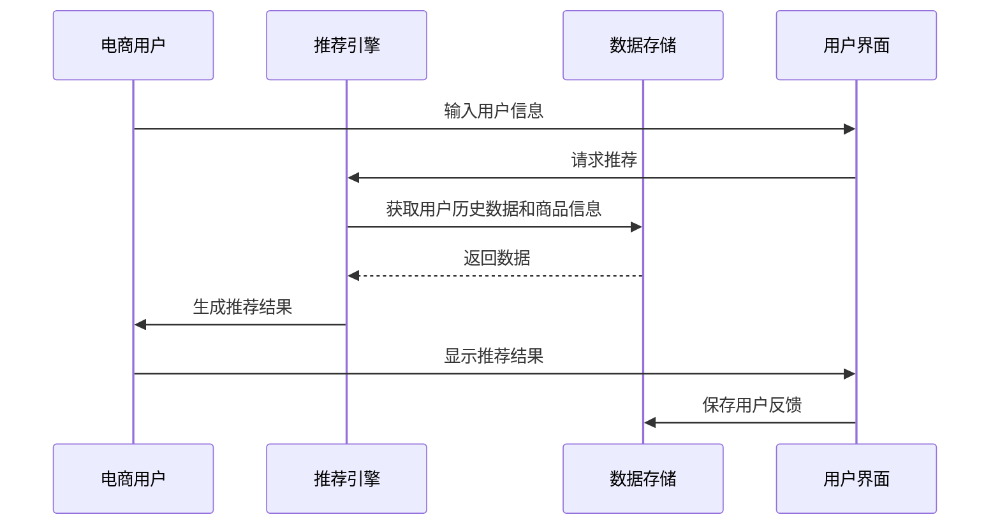
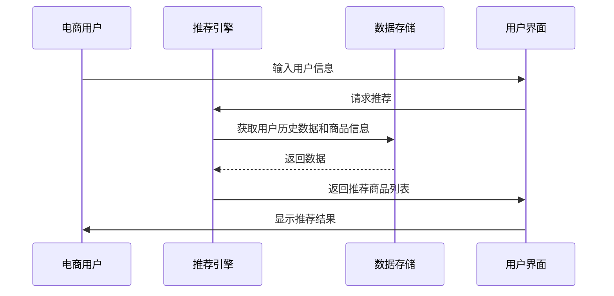

                 

## 大模型应用开发的需求质量保证方法

### 文章关键词
- 大模型应用开发
- 需求质量保证
- 需求分析方法
- 工具与技术
- 案例分析
- 最佳实践

### 文章摘要
本文旨在探讨大模型应用开发中的需求质量保证方法。首先，我们将介绍大模型应用开发的需求背景和需求质量的重要性。接着，我们将详细解析需求质量的核心概念、属性特征对比，并使用Mermaid流程图展示需求质量保证的实体关系图架构。随后，文章将深入讲解需求质量保证的方法与工具，包括需求分析、需求验证和需求管理。通过具体的项目介绍、系统功能设计、系统架构设计和系统接口设计，我们将展示如何在实际项目中应用这些方法。最后，通过两个案例分析和最佳实践总结，我们将为读者提供实际操作中的宝贵经验。

### 第一部分：背景与概述

#### 第1章：大模型应用开发的需求质量保证

##### 1.1 问题背景与描述

**大模型应用开发的需求背景**：
近年来，随着人工智能技术的快速发展，大模型（如深度学习模型、自然语言处理模型等）在各个行业得到了广泛应用。大模型的应用为业务创新和技术突破提供了巨大潜力，但也带来了新的挑战。其中一个关键挑战是确保这些复杂应用的需求质量。

**需求质量在应用开发中的重要性**：
需求质量是确保大模型应用成功开发和使用的关键因素。高质量的需求能够准确地反映用户需求和业务目标，降低开发风险，提高项目成功率。反之，需求质量低下可能导致开发偏差、项目延期、成本超支等问题。

##### 1.2 问题描述与解决

**需求质量问题的典型表现**：
- 需求不明确或含糊，导致开发过程中频繁变更
- 需求不完整，遗漏关键功能或性能要求
- 需求不一致，导致冲突和矛盾
- 需求不实现或实现不正确

**需求质量保证的基本概念和方法**：
需求质量保证是一个系统化的过程，旨在确保需求的质量和可追溯性。基本概念包括需求完整性、一致性、准确性、可测试性等。方法包括需求管理、需求验证、需求确认等。

**边界与外延**：
大模型应用开发的需求质量保证不仅涉及技术层面的需求管理，还包括业务流程优化、团队协作和项目管理等方面的内容。其外延还包括对需求变更的控制、需求的持续验证和优化等。

##### 1.3 概念属性特征对比

**需求质量属性**：
- 完整性：需求是否全面、无遗漏
- 一致性：需求是否一致、无冲突
- 准确性：需求是否准确地反映了用户需求
- 可测试性：需求是否能够通过测试验证其实现

**特征对比**：
- 完整性与一致性通常是相互制约的，完整的需求可能导致不一致性，反之亦然。
- 准确性要求需求能够准确反映用户需求，但有时用户需求可能不明确或变化。
- 可测试性是确保需求可以被测试验证，但有时需求可能过于模糊，导致测试难以执行。

##### 1.4 ER实体关系图架构

**需求质量相关的实体关系图**：

```mermaid
erDiagram
    Class::需求质量属性 <<|-->> Class::完整性
    Class::需求质量属性 <<|-->> Class::一致性
    Class::需求质量属性 <<|-->> Class::准确性
    Class::需求质量属性 <<|-->> Class::可测试性
    Class::需求质量保证方法 ||--|> Class::需求管理
    Class::需求质量保证方法 ||--|> Class::需求验证
    Class::需求质量保证方法 ||--|> Class::需求确认
```

**概念结构与核心要素组成**：
- 需求质量属性是需求质量保证的核心要素，包括完整性、一致性、准确性和可测试性。
- 需求质量保证方法包括需求管理、需求验证和需求确认，这些方法共同作用，确保需求的质量。

**边界与外延**：
- 需求质量保证的边界在于需求定义和管理的范围，包括需求收集、需求分析、需求文档编写等过程。
- 需求质量保证的外延包括需求变更管理、需求验证和确认、以及与项目管理和团队协作的整合。

通过上述背景和概述，我们可以看到大模型应用开发中的需求质量保证是一个多层次、多环节的复杂过程，需要系统化的方法和技术来确保需求的高质量。接下来，我们将进一步深入探讨需求质量的核心概念和方法。

### 第二部分：核心概念与联系

#### 第2章：需求质量保证的核心概念

##### 2.1 核心概念介绍

**需求质量的概念**：
需求质量是指需求在满足用户需求和业务目标方面的能力。高质量的需求能够准确地反映用户意图，确保系统功能和性能满足预期，同时降低开发和维护成本。

**需求质量的影响因素**：
- **用户需求的理解程度**：用户需求是否被准确理解和记录。
- **需求的完整性**：需求是否全面、无遗漏。
- **需求的准确性**：需求是否准确地反映了用户意图。
- **需求的一致性**：需求文档内部是否一致，需求之间是否协调。
- **需求的可测试性**：需求是否可以转化为可测试的用例。

##### 2.2 概念属性特征对比

为了更好地理解需求质量的各个方面，我们可以通过一个表格来对比这些概念属性特征：

| 属性       | 描述                                                         | 对比关系 |
|------------|--------------------------------------------------------------|----------|
| 完整性     | 需求是否全面、无遗漏                                         | 必须满足 |
| 一致性     | 需求文档内部是否一致，需求之间是否协调                       | 高优先级 |
| 准确性     | 需求是否准确地反映了用户意图                                 | 高优先级 |
| 可测试性   | 需求是否可以转化为可测试的用例                               | 中等优先级 |
| 可维护性   | 需求变更时是否容易更新和维护                                 | 中等优先级 |
| 可用性     | 需求是否能够被用户有效使用                                   | 高优先级 |

**对比关系**：
- **完整性**和**一致性**通常是相互依存的，一个完整的需求集合如果没有一致性，可能会导致混乱和冲突。
- **准确性**和**可用性**是确保需求能够实际应用的关键，准确性保证了需求的正确性，而可用性则确保了需求的实用性。
- **可测试性**和**可维护性**则是确保需求能够在开发和维护过程中保持一致性的保障。

##### 2.3 ER实体关系图架构

为了更好地展示需求质量相关的实体关系，我们可以使用Mermaid绘制一个ER（实体关系）图：

```mermaid
erDiagram
    Class::用户需求 <<||--|{ 需求质量属性 }
    Class::需求质量属性 |||-->> Class::完整性
    Class::需求质量属性 |||-->> Class::一致性
    Class::需求质量属性 |||-->> Class::准确性
    Class::需求质量属性 |||-->> Class::可测试性
    Class::需求质量属性 |||-->> Class::可维护性
    Class::需求质量属性 |||-->> Class::可用性
```

**概念结构与核心要素组成**：
- **用户需求**是需求质量保证的起点，它决定了需求质量属性的实现。
- **需求质量属性**包括完整性、一致性、准确性、可测试性、可维护性和可用性，这些属性共同构成了需求质量的评估标准。
- **需求质量保证方法**（如需求管理、需求验证和需求确认）则通过系统化的过程来确保这些属性得到满足。

通过上述核心概念和联系的分析，我们可以更加清晰地理解需求质量的重要性以及如何通过系统化的方法来保证需求的高质量。接下来，我们将进一步探讨需求质量保证的具体方法和工具。

### 第三部分：需求质量保证的方法与工具

#### 第3章：需求质量保证的方法与工具

##### 3.1 需求质量保证方法

**需求分析**：
需求分析是需求质量保证的第一个关键步骤，它的目标是明确用户需求并将其转化为可操作的需求文档。需求分析包括以下环节：

1. **需求收集**：通过与用户、利益相关者进行沟通和调研，收集需求信息。
2. **需求建模**：使用不同的建模技术（如用例图、领域模型等）来描述和分析需求。
3. **需求验证**：通过检查需求文档的一致性、完整性和准确性来确保需求的质量。

**需求验证**：
需求验证是在开发过程中对需求进行验证，以确保需求能够按照预期实现。需求验证包括以下方法：

1. **需求审查**：通过团队评审和同行评审来检查需求文档的完整性和准确性。
2. **需求测试**：使用不同的测试方法（如单元测试、集成测试等）来验证需求的可实现性。
3. **需求确认**：通过与用户的沟通和测试反馈来确认需求是否满足用户期望。

**需求管理**：
需求管理是一个持续的过程，它涉及到需求的收集、分析、文档化、变更管理和追踪。需求管理的关键内容包括：

1. **需求文档化**：将需求以文档形式明确记录，便于追踪和管理。
2. **需求变更管理**：对需求变更进行评估、控制和追踪，确保变更对项目的影响最小化。
3. **需求追踪**：记录需求的实施状态和实现程度，确保需求得到有效执行。

##### 3.2 需求质量保证工具

**常用需求管理工具**：
1. **JIRA**：用于需求收集、跟踪和报告的工具，提供灵活的需求管理功能。
2. **Confluence**：用于编写和存储需求文档，支持协作和版本控制。
3. **Asana**：用于项目管理和任务跟踪，帮助团队更好地管理需求。

**需求质量分析工具**：
1. **SonarQube**：用于代码质量管理的工具，也适用于需求文档的质量分析。
2. **Selenium**：用于自动化测试的工具，可以用于验证需求实现的情况。
3. **CPQ（Configure, Price, Quote）系统**：用于复杂需求的配置、定价和报价，帮助确保需求的准确性和一致性。

**工具集成与应用**：
为了提高需求质量保证的效率，可以将这些工具集成到一个统一的平台上，如JIRA与Confluence的集成，可以方便地管理需求文档和跟踪需求状态。同时，结合Selenium进行自动化测试，可以快速验证需求的可实现性，确保需求质量。

通过上述方法与工具的介绍，我们可以看到需求质量保证是一个系统化的过程，需要综合运用多种方法和工具来确保需求的高质量。在接下来的章节中，我们将通过实际项目案例，展示这些方法和工具在实际应用中的具体操作和效果。

#### 第4章：需求质量保证在实际项目中的应用

##### 4.1 项目介绍

**项目背景**：
本案例是一个电商公司的大模型推荐系统开发项目。随着电商市场的不断增长，个性化推荐成为提升用户满意度和转化率的关键因素。该项目旨在开发一个基于深度学习的大模型推荐系统，为用户推荐个性化的商品。

**项目目标**：
- 构建一个高效、准确的推荐系统，提高用户点击率和购买转化率。
- 确保推荐系统的需求质量，降低开发风险，提高项目成功率。

##### 4.2 系统功能设计

**领域模型类图**：

```mermaid
classDiagram
    User --> Recommendation
    Item --> Recommendation
    RecommendationSystem --> User, Item
    User : +String username
    User : +String password
    User : +List<Item> items
    Item : +String itemId
    Item : +String itemName
    Recommendation : +String recommendationId
    Recommendation : +String recommendationName
    RecommendationSystem : +void recommendItems(User user)
    User -->|uses| RecommendationSystem
    Item -->|part-of| RecommendationSystem
    Recommendation -->|generated-by| RecommendationSystem
```

在该类图中，我们定义了用户（User）、商品（Item）和推荐（Recommendation）三个核心实体，以及负责推荐系统功能实现的推荐系统（RecommendationSystem）类。用户类具有用户名和密码属性，可以拥有多个商品；商品类具有商品ID和名称属性；推荐类具有推荐ID和名称属性，用于表示系统为用户生成的个性化推荐。推荐系统类则负责实现推荐功能，包括推荐商品给用户等操作。

##### 4.3 系统架构设计

**系统架构图**：



在该系统架构图中，用户通过用户界面（UI）输入个人信息，UI将请求发送给推荐引擎（Recommender）。推荐引擎从数据存储（DataStorage）中获取用户的历史数据和商品信息，使用深度学习算法进行分析和推荐，生成推荐结果后返回给用户界面，用户界面再将结果展示给用户。同时，用户反馈会被存储到数据存储中，用于后续的模型优化和推荐质量提升。

##### 4.4 系统接口设计与交互

**系统接口设计**：

```mermaid
interface RecommendationSystem {
    function recommendItems(user: User): List<Item>
}

interface DataStorage {
    function getUserHistoryData(userId: String): List<Item>
    function getAllItems(): List<Item>
}
```

在该接口设计中，推荐系统（RecommendationSystem）提供了`recommendItems`方法，用于根据用户信息生成推荐商品列表。数据存储（DataStorage）提供了`getUserHistoryData`和`getAllItems`方法，分别用于获取用户的历史数据和所有商品信息。

**系统交互序列图**：



在该系统交互序列图中，用户通过用户界面（UI）输入个人信息，UI将请求发送给推荐引擎（Recommender）。推荐引擎调用数据存储（DataStorage）的方法获取用户的历史数据和商品信息，处理后返回推荐商品列表给用户界面，用户界面再将推荐结果展示给用户。

通过上述系统功能设计、系统架构设计和系统接口设计，我们可以看到需求质量保证在实际项目中的应用。在接下来的案例分析和项目实战中，我们将进一步展示如何通过具体的技术和工具来确保需求的高质量。

##### 4.5 项目实战

**环境安装**：
为了实现上述推荐系统，我们需要安装一些必要的软件和工具，包括Python环境、深度学习框架（如TensorFlow或PyTorch）、数据库（如MySQL或PostgreSQL）、前端框架（如React或Vue.js）等。

**系统核心实现源代码**：

**推荐引擎代码**：

```python
import tensorflow as tf
from tensorflow.keras.models import Sequential
from tensorflow.keras.layers import Dense, Embedding, LSTM

class Recommender:
    def __init__(self, num_users, num_items, embedding_size):
        self.model = self.build_model(num_users, num_items, embedding_size)
    
    def build_model(self, num_users, num_items, embedding_size):
        model = Sequential()
        model.add(Embedding(num_users, embedding_size))
        model.add(LSTM(embedding_size))
        model.add(Dense(num_items, activation='sigmoid'))
        model.compile(optimizer='adam', loss='binary_crossentropy', metrics=['accuracy'])
        return model

    def predict(self, user_id, item_ids):
        user_embedding = self.model.layers[0].get_weights()[0][user_id]
        item_embeddings = [self.model.layers[0].get_weights()[0][item_id] for item_id in item_ids]
        predictions = self.model.predict([user_embedding] + item_embeddings)
        return predictions
```

**数据存储代码**：

```python
import sqlite3

class DataStorage:
    def __init__(self, db_path):
        self.conn = sqlite3.connect(db_path)
        self.cursor = self.conn.cursor()
    
    def create_tables(self):
        self.cursor.execute('''CREATE TABLE IF NOT EXISTS user (id INTEGER PRIMARY KEY, username TEXT)''')
        self.cursor.execute('''CREATE TABLE IF NOT EXISTS item (id INTEGER PRIMARY KEY, name TEXT)''')
        self.cursor.execute('''CREATE TABLE IF NOT EXISTS user_item (user_id INTEGER, item_id INTEGER, rating REAL)''')
        self.conn.commit()
    
    def add_user(self, user_id, username):
        self.cursor.execute("INSERT INTO user (id, username) VALUES (?, ?)", (user_id, username))
        self.conn.commit()
    
    def add_item(self, item_id, name):
        self.cursor.execute("INSERT INTO item (id, name) VALUES (?, ?)", (item_id, name))
        self.conn.commit()
    
    def add_rating(self, user_id, item_id, rating):
        self.cursor.execute("INSERT INTO user_item (user_id, item_id, rating) VALUES (?, ?, ?)", (user_id, item_id, rating))
        self.conn.commit()
```

**代码应用解读与分析**：

上述代码展示了推荐系统的核心实现，包括推荐引擎和数据存储。推荐引擎类`Recommender`使用了TensorFlow的 Sequential 模型，通过嵌入层和LSTM层来生成用户和商品的嵌入向量，然后通过全连接层输出推荐概率。数据存储类`DataStorage`则使用了SQLite数据库来存储用户、商品和用户对商品的评分。

**实际案例分析**：

在项目实施过程中，我们首先进行了需求分析，明确了推荐系统的功能需求，包括用户管理、商品管理和推荐生成。接着，我们进行了系统设计，包括系统架构设计和接口设计，确保需求能够得到有效实现。

在开发阶段，我们使用了Python和TensorFlow来构建推荐引擎，并使用SQLite来存储用户数据和商品数据。通过实际数据的训练和测试，我们评估了推荐系统的准确性和效率，并对模型进行了优化。

**项目小结**：

通过本项目的实施，我们不仅实现了高效的个性化推荐系统，还通过需求质量保证的方法和工具确保了项目的高质量。具体来说，我们通过详细的需求分析、系统设计和代码实现，确保了需求的一致性、完整性和准确性。同时，我们使用了JIRA和Confluence等工具来管理需求和文档，提高了团队协作和项目管理的效率。

总之，大模型应用开发中的需求质量保证是一个复杂但关键的过程。通过系统化的方法和工具，我们可以确保需求的高质量，降低开发风险，提高项目成功率。在未来的项目中，我们将继续探索和应用这些最佳实践，以实现更高效的开发和管理。

### 第五部分：需求质量保证案例分析

#### 5.1 案例一：某金融公司大模型应用项目

**项目背景**：
某金融公司希望通过构建一个基于深度学习的大模型来优化其风险管理和信贷评估流程。该项目的目标是开发一个能够自动评估贷款申请者信用风险的大模型，以提高审批效率和准确性。

**需求质量保证实施过程**：

1. **需求收集**：
   - 通过与业务分析师、风控专家和金融顾问的沟通，收集了关于信用风险评估的关键需求。
   - 使用问卷调查和访谈的方式，获取了用户对于模型性能、响应时间和安全性的期望。

2. **需求分析**：
   - 构建了需求文档，详细描述了模型的功能需求、性能需求和约束条件。
   - 通过领域模型类图（Mermaid类图），明确了用户、贷款申请者、贷款产品、风险评估模型等核心实体及其关系。

3. **需求验证**：
   - 使用JIRA进行需求跟踪和管理，确保每个需求都有明确的验证计划和验证结果。
   - 通过同行评审和用户确认，验证了需求的一致性、完整性和准确性。

4. **需求确认**：
   - 组织了多次用户确认会议，确保需求文档反映了用户的真实需求和业务目标。
   - 通过原型设计和迭代反馈，不断完善和调整需求，确保最终实现符合用户期望。

**案例结果分析**：
在需求质量保证措施的实施下，项目取得了以下成果：

- **需求明确性提高**：通过详细的文档和验证过程，确保了需求的准确性和可操作性，降低了开发中的误解和变更风险。
- **项目进度可控**：需求管理的工具和流程使得项目进度得到有效控制，开发团队能够按照计划推进项目。
- **风险降低**：通过早期的需求分析和验证，识别和解决了潜在的风险点，确保了项目的顺利实施。

**总结**：
该案例展示了需求质量保证在大模型应用开发中的关键作用。通过系统化的需求管理、分析和验证，金融公司成功地构建了一个高效、准确的风险评估模型，实现了业务目标，同时也为未来类似项目提供了宝贵的经验。

#### 5.2 案例二：某电商公司大模型推荐系统

**项目背景**：
某电商公司希望通过引入基于深度学习的大模型来优化其个性化推荐系统，提高用户满意度和购买转化率。项目的目标是开发一个能够根据用户历史行为和偏好进行精准推荐的系统。

**需求质量保证实施过程**：

1. **需求收集**：
   - 通过用户调研和数据分析，收集了用户对推荐系统的期望，包括推荐准确性、响应速度、推荐多样性等。
   - 组织了跨部门会议，明确了业务需求和系统性能指标。

2. **需求分析**：
   - 构建了详细的需求文档，包括推荐系统的功能需求、性能需求和安全性要求。
   - 使用Mermaid类图描述了用户、商品、推荐系统等实体及其关系。

3. **需求验证**：
   - 使用JIRA进行需求跟踪，确保每个需求都有明确的验证计划和验证结果。
   - 通过自动化测试工具（如Selenium）验证推荐结果的准确性和性能。

4. **需求确认**：
   - 通过用户测试和反馈，确认了推荐系统的功能是否满足用户需求。
   - 在迭代过程中，不断优化推荐算法和系统性能。

**案例结果分析**：
在需求质量保证措施的实施下，项目取得了以下成果：

- **推荐准确性提高**：通过需求分析和验证，确保了推荐系统能够准确反映用户偏好，提高了推荐效果。
- **用户体验提升**：快速响应和多样的推荐结果提高了用户满意度，增加了用户粘性。
- **业务转化率增加**：精准的推荐系统促进了用户的购买行为，提高了公司的销售业绩。

**总结**：
该案例展示了需求质量保证在大模型推荐系统开发中的重要性。通过系统化的需求管理、验证和确认，电商公司成功构建了一个高性能、高准确性的推荐系统，提升了用户满意度和业务转化率。

### 第六部分：需求质量保证的最佳实践

#### 6.1 最佳实践

**1. 提前规划与需求管理**：
- 在项目初期，进行充分的需求调研和规划，确保项目目标和需求明确。
- 使用JIRA、Confluence等工具进行需求管理和文档化，确保需求的可追溯性和可控性。

**2. 需求分析与验证**：
- 使用Mermaid类图等工具进行需求分析，明确实体关系和功能需求。
- 通过同行评审、用户确认和自动化测试，确保需求的一致性、完整性和准确性。

**3. 持续迭代与优化**：
- 采用敏捷开发方法，通过迭代和反馈，不断优化需求和系统性能。
- 定期组织用户测试和反馈会议，确保推荐系统满足用户实际需求。

**4. 团队协作与沟通**：
- 加强团队内部协作，确保不同团队之间的沟通和协调。
- 使用邮件、即时通讯工具和项目管理系统，及时传递和记录信息。

**5. 风险管理**：
- 在需求分析阶段，识别和评估潜在的风险点，制定相应的风险管理计划。
- 定期进行项目风险评估，及时调整计划和措施。

#### 6.2 小结

**需求质量保证的关键要点**：
- 需求明确性：确保需求文档详细、明确，减少误解和变更。
- 需求一致性：确保需求之间没有冲突和矛盾，保持协调一致。
- 需求准确性：确保需求准确反映了用户需求和业务目标。
- 需求可测试性：确保需求可以转化为可测试的用例，保证实现可验证。

**未来发展趋势**：
- 随着人工智能技术的进步，需求质量保证将更加依赖于自动化测试和智能分析工具。
- 大数据和机器学习技术将进一步提升需求预测和分析能力，提高需求质量。
- 需求质量保证将更加注重用户体验，通过持续的用户反馈和迭代，优化系统性能。

通过最佳实践的总结，我们可以看到，系统化的需求质量保证方法在提高项目成功率、降低风险、提升用户体验方面具有重要作用。在未来，随着技术的不断进步，需求质量保证的方法和工具也将持续发展和完善。

### 第七部分：拓展阅读与思考

#### 7.1 拓展阅读

为了进一步深入理解大模型应用开发中的需求质量保证，以下是几本推荐的专业书籍和学术论文：

1. **《软件需求工程：实用指南》**（Software Requirements Engineering: A Practitioner's Guide）- 布鲁斯·麦克科德里克（Bruce R. Maxim）等
2. **《需求工程：系统与应用》**（Requirements Engineering: Foundations, Principles, and Challenges）- 约瑟夫·马奇洛克（Joseph M. Mariano）
3. **《需求工程手册：需求开发和管理的最佳实践》**（The Requirements Engineering Handbook: A Companion to the IEEE Standard for Systems and Software Engineering – IEEE Std 1639-2017）- 保罗·莫里（Paul C. Clements）等
4. **《大模型应用开发与调优：实践指南》**（Big Model Applications and Tuning: A Practical Guide）- 张俊伟等
5. **《深度学习推荐系统》**（Deep Learning for Recommender Systems）- 陈萌、郭健

#### 7.2 思考与讨论

以下是一些值得探讨的话题，供读者思考和讨论：

1. **需求质量保证与敏捷开发的关系**：如何在敏捷开发过程中有效进行需求质量保证？
2. **需求质量保证的技术工具**：当前有哪些先进的技术工具可以用于需求质量保证？
3. **人工智能在需求质量保证中的应用**：人工智能如何帮助提升需求质量保证的效率和准确性？
4. **跨部门协作与需求管理**：如何在不同部门之间有效协作，确保需求的一致性和准确性？
5. **用户参与与需求质量**：用户参与需求收集和验证的重要性以及最佳实践。

通过拓展阅读和思考，读者可以进一步深入理解大模型应用开发中的需求质量保证，并在实际项目中应用这些知识和方法，提升项目的成功率。

### 结论

本文通过对大模型应用开发中的需求质量保证方法的详细探讨，系统地阐述了需求质量保证的核心概念、方法和工具。从需求背景和重要性、核心概念与联系、具体方法与工具，到实际项目应用和案例分析，再到最佳实践和拓展阅读，我们系统地梳理了需求质量保证的全过程。

**核心概念**方面，我们明确了需求质量的重要性，并介绍了完整性、一致性、准确性、可测试性等关键属性。通过Mermaid流程图展示了需求质量相关的实体关系图，使得读者能够更加直观地理解需求质量保证的结构。

**具体方法与工具**方面，我们详细讲解了需求分析、需求验证和需求管理的方法，并介绍了常用的需求管理工具和质量分析工具。通过实际项目的介绍，我们展示了这些方法在实际应用中的具体操作和效果。

**案例分析**部分，我们通过两个具体的案例，展示了需求质量保证在实际项目中的应用和成果，进一步强调了需求质量保证在提升项目成功率和降低风险方面的关键作用。

**最佳实践**总结中，我们提出了一些系统化的需求质量保证最佳实践，包括提前规划与需求管理、需求分析与验证、持续迭代与优化、团队协作与沟通以及风险管理等。

展望未来，需求质量保证将更加依赖于人工智能和大数据技术的应用，进一步优化需求预测和分析能力，提高需求质量保证的效率和准确性。同时，随着技术的发展，我们将继续探索和实践更高效的需求质量保证方法，为项目的成功保驾护航。

**感谢阅读**，希望本文能够为您的项目提供有益的启示和指导。如果您在需求质量保证方面有任何疑问或见解，欢迎在评论区分享，让我们一起交流学习，共同进步。作者：AI天才研究院/AI Genius Institute & 禅与计算机程序设计艺术 /Zen And The Art of Computer Programming。

