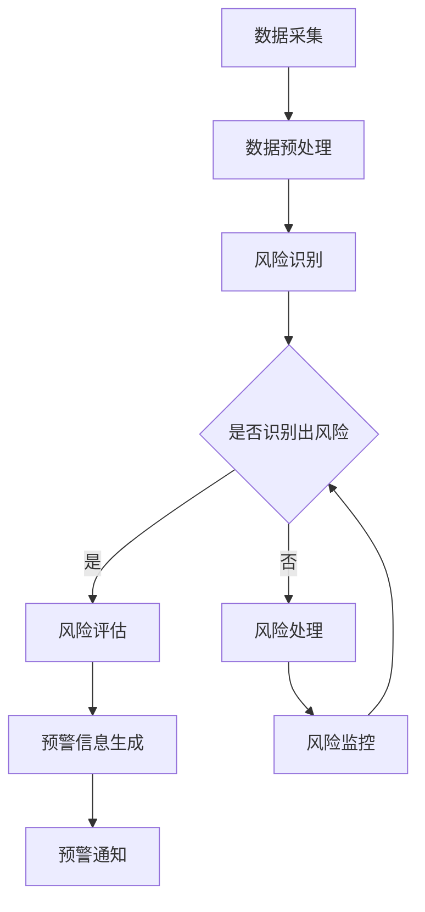
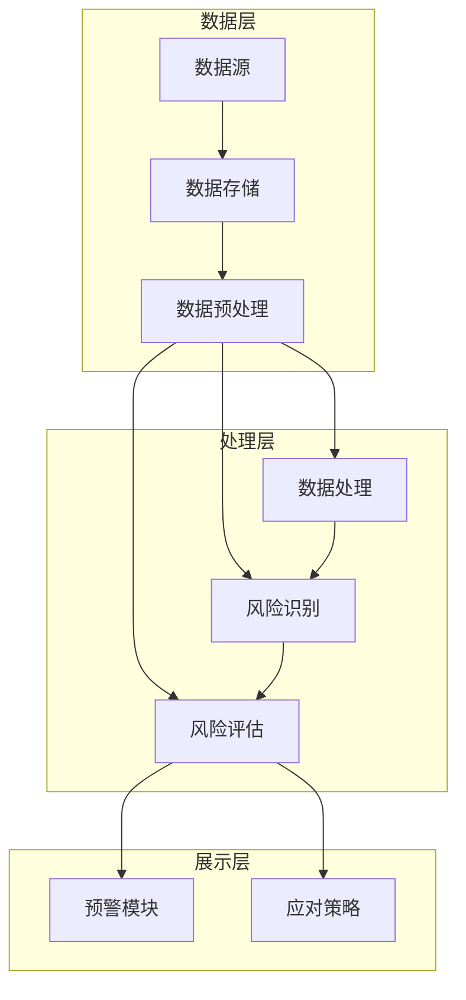
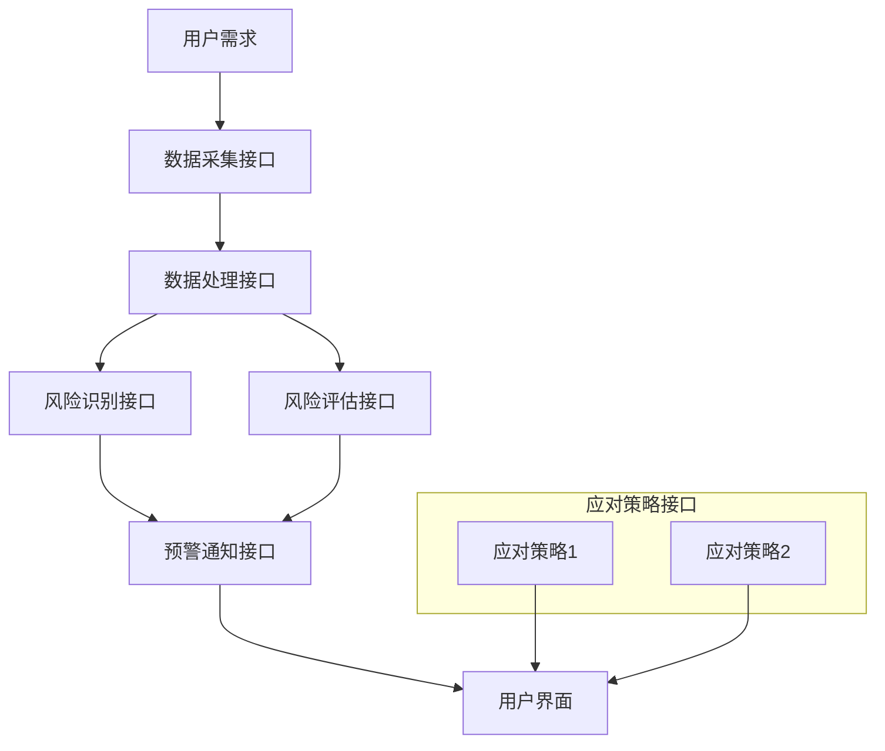

                 


# 大模型应用开发中的需求风险预警系统

> 关键词：大模型、需求风险预警、应用开发、风险识别、算法优化

> 摘要：本文深入探讨了在大模型应用开发中，如何构建和优化需求风险预警系统。首先，我们明确了大模型和需求风险预警系统的概念，分析了其在应用开发中的重要性。接着，我们详细阐述了需求风险的识别与评估方法，并介绍了预警系统的实现与优化策略。通过实际项目案例，我们展示了系统的应用效果和关键实现步骤。最后，我们总结了最佳实践，并对未来的研究方向进行了展望。

## 目录大纲设计思路

为了设计出《大模型应用开发中的需求风险预警系统》这本书的完整目录大纲，我们需要遵循以下步骤：

### 1. 背景介绍

- **问题背景**：简要介绍大模型应用开发中的需求风险预警系统的必要性。
- **问题描述**：明确需求风险预警系统的概念及其在应用开发中的重要性。
- **问题解决**：阐述如何通过需求风险预警系统来降低应用开发的潜在风险。
- **边界与外延**：界定需求风险预警系统的应用范围和限制条件。
- **核心要素组成**：梳理需求风险预警系统的基本构成要素。

### 2. 核心概念与联系

- **核心概念原理**：详细解释大模型、需求风险预警系统等关键概念。
- **概念属性特征对比表格**：列出大模型与需求风险预警系统的属性特征并进行对比。
- **ER实体关系图架构**：用Mermaid绘制实体关系图，展示系统各要素之间的关系。

### 3. 算法原理讲解

- **Mermaid流程图**：使用Mermaid语言绘制算法的流程图，直观展示算法步骤。
- **Python源代码**：提供算法实现的Python源代码，详细解释每一步代码的作用。
- **数学模型和公式**：阐述算法背后的数学模型，使用LaTeX格式书写关键公式。
- **举例说明**：通过具体实例来讲解算法的应用，使其更加通俗易懂。

### 4. 系统分析与架构设计方案

- **问题场景介绍**：描述应用开发中需求风险预警系统的实际应用场景。
- **项目介绍**：简要介绍需求风险预警系统的建设项目。
- **系统功能设计**：使用Mermaid绘制领域模型类图，详细说明系统功能。
- **系统架构设计**：用Mermaid绘制系统架构图，展示系统整体结构。
- **系统接口设计和系统交互**：详细描述系统接口设计和交互流程，使用Mermaid绘制序列图。

### 5. 项目实战

- **环境安装**：指导读者如何搭建需求风险预警系统的开发环境。
- **系统核心实现源代码**：提供核心实现的源代码，解释代码结构和功能。
- **代码应用解读与分析**：对核心代码的应用进行解读和分析。
- **实际案例分析和详细讲解剖析**：通过实际案例讲解系统的应用效果。
- **项目小结**：总结项目的关键点和收获。

### 6. 最佳实践 tips、小结、注意事项、拓展阅读

- **最佳实践 tips**：分享在实际应用中的最佳实践技巧。
- **小结**：总结全书的核心内容。
- **注意事项**：提醒读者在应用需求风险预警系统时需要注意的问题。
- **拓展阅读**：推荐进一步学习和研究的资料。

### 目录大纲

```markdown
----------------------------------------------------------------
# 第一部分: 背景与核心概念

## 第1章: 问题背景与核心概念

### 1.1 问题背景

#### 1.1.1 大模型应用开发的挑战

#### 1.1.2 需求风险的潜在影响

#### 1.1.3 预警系统的必要性

### 1.2 核心概念

#### 1.2.1 大模型概述

#### 1.2.2 需求风险预警系统

#### 1.2.3 风险管理与预警机制

## 第2章: 大模型与需求风险预警系统的关系

### 2.1 大模型的特点与应用

#### 2.1.1 大模型的技术基础

#### 2.1.2 大模型在需求风险预警中的应用

### 2.2 需求风险预警系统的构建

#### 2.2.1 系统架构设计

#### 2.2.2 数据采集与预处理

#### 2.2.3 风险评估与预警策略

## 第3章: 需求风险的识别与评估

### 3.1 需求风险的识别

#### 3.1.1 需求风险来源

#### 3.1.2 风险识别方法

### 3.2 风险评估模型

#### 3.2.1 数学模型构建

#### 3.2.2 公式推导与解析

#### 3.2.3 实例分析

## 第4章: 预警系统的实现与优化

### 4.1 预警系统的实现

#### 4.1.1 系统设计

#### 4.1.2 技术选型

#### 4.1.3 数据处理流程

### 4.2 系统优化策略

#### 4.2.1 性能优化

#### 4.2.2 可扩展性设计

#### 4.2.3 安全性考虑

## 第5章: 项目实战

### 5.1 环境安装

#### 5.1.1 开发环境搭建

#### 5.1.2 系统配置

### 5.2 系统核心实现源代码

#### 5.2.1 数据采集模块

#### 5.2.2 风险评估模块

#### 5.2.3 预警模块

### 5.3 代码应用解读与分析

#### 5.3.1 数据采集代码解读

#### 5.3.2 风险评估代码解析

#### 5.3.3 预警模块代码分析

### 5.4 实际案例分析和详细讲解剖析

#### 5.4.1 案例一：项目A的需求风险预警

#### 5.4.2 案例二：项目B的需求风险预警

### 5.5 项目小结

## 第6章: 最佳实践 tips、小结、注意事项、拓展阅读

### 6.1 最佳实践 tips

#### 6.1.1 风险识别与评估的最佳实践

#### 6.1.2 系统实现与优化的技巧

### 6.2 小结

#### 6.2.1 全书核心内容回顾

#### 6.2.2 需求风险预警系统的应用前景

### 6.3 注意事项

#### 6.3.1 系统应用中的常见问题

#### 6.3.2 应对策略与解决方案

### 6.4 拓展阅读

#### 6.4.1 相关研究论文推荐

#### 6.4.2 技术书籍推荐

----------------------------------------------------------------
```

## 1. 背景介绍

### 1.1 问题背景

在当今信息化社会中，人工智能（AI）技术迅猛发展，大模型（如GPT-3、BERT等）在各个领域得到了广泛应用。这些大模型通过深度学习算法从海量数据中学习，具备了强大的数据处理和知识推理能力。然而，随着模型的规模和复杂性的增加，大模型应用开发过程中面临着诸多挑战，其中需求风险的识别和预警成为一个关键问题。

大模型应用开发的复杂性主要体现在以下几个方面：

1. **数据依赖性**：大模型的学习和预测能力高度依赖于数据的质量和数量。数据缺失、数据噪声和样本不均衡等问题可能导致模型性能的下降。
2. **模型适应性**：大模型通常在特定领域和任务上表现优异，但在其他领域或任务上可能存在适应性不足的问题。如何确保模型在不同应用场景中的有效性和准确性，是开发中需要解决的关键问题。
3. **安全隐患**：大模型可能被用于恶意攻击，如生成虚假信息、侵犯隐私等。因此，保障模型的安全性和可解释性成为重要的研究课题。

需求风险是指在应用开发过程中，由于需求变化、技术实现、项目管理等因素导致项目无法按预期进展或出现问题的潜在风险。需求风险可能来源于以下几个方面：

1. **需求不明确**：用户需求不断变化，可能导致开发过程中出现需求变更，影响项目进度和稳定性。
2. **技术不确定性**：某些技术难题可能无法在开发初期得到有效解决，导致项目延期或失败。
3. **项目管理风险**：项目管理不善可能导致资源浪费、沟通不畅、进度失控等问题，进而影响项目质量。

需求风险对应用开发的影响是深远的。首先，需求风险可能导致项目延期、成本超支，影响企业的盈利能力。其次，需求风险可能导致产品功能不完整或性能不佳，降低用户体验。最后，需求风险还可能引发法律纠纷和商业损失，对企业的声誉造成负面影响。

因此，在大模型应用开发过程中，构建一个有效的需求风险预警系统，提前识别和评估潜在的需求风险，并采取相应的预防和应对措施，显得尤为重要。需求风险预警系统可以帮助开发团队及时了解项目的风险状况，制定有效的风险管理策略，从而提高项目的成功率。

### 1.2 核心概念

#### 1.2.1 大模型概述

大模型是指具有极高参数量、能够处理大规模数据的深度学习模型。这些模型通过训练从海量数据中学习，形成了复杂的知识结构和强大的预测能力。大模型通常采用神经网络架构，如Transformer、BERT等，具有以下特点：

1. **参数量巨大**：大模型的参数数量通常在数十亿到千亿级别，远远超过传统机器学习模型。
2. **数据需求大**：大模型需要大量的高质量数据来进行训练，以充分发挥其预测能力。
3. **计算资源需求高**：大模型的训练和推理过程需要大量计算资源和时间，通常需要高性能计算设备和分布式计算架构支持。
4. **应用范围广泛**：大模型在自然语言处理、计算机视觉、语音识别等多个领域取得了显著成果，已成为人工智能研究的重要方向。

#### 1.2.2 需求风险预警系统

需求风险预警系统是指用于识别、评估和预警需求风险的系统。其核心目标是在应用开发过程中提前发现潜在的风险，并采取相应的措施进行预防和应对。需求风险预警系统通常包括以下几个关键组成部分：

1. **数据采集模块**：用于收集和分析与项目相关的各种数据，如用户需求、技术文档、项目管理信息等。
2. **风险识别模块**：通过分析采集到的数据，识别出潜在的需求风险，包括需求不明确、技术不确定性、项目管理风险等。
3. **风险评估模块**：对识别出的风险进行评估，确定其严重程度和发生概率，为后续的预警和应对提供依据。
4. **预警模块**：根据风险评估的结果，生成预警信息，并及时通知相关人员，采取相应的预防措施。
5. **应对策略模块**：提供一系列应对措施，包括风险规避、风险转移、风险减轻等，帮助开发团队有效应对需求风险。

#### 1.2.3 风险管理与预警机制

风险管理是指在项目开发过程中，通过识别、评估、应对和监控风险，以确保项目顺利完成。预警机制是风险管理的重要组成部分，旨在提前发现和预警潜在的风险。具体来说，风险管理与预警机制包括以下几个步骤：

1. **风险识别**：通过访谈、问卷调查、文档分析等方法，识别项目中的潜在风险。
2. **风险评估**：对识别出的风险进行评估，确定其发生概率和影响程度，以便确定风险管理的优先级。
3. **风险应对**：根据风险评估的结果，制定相应的应对措施，包括风险规避、风险转移、风险减轻等。
4. **风险监控**：在项目开发过程中持续监控风险的变化，及时调整应对措施，确保项目顺利进行。
5. **预警机制**：建立预警机制，通过实时数据采集和分析，提前发现潜在的风险，并及时发出预警信息。

### 1.3 需求风险的识别与评估

需求风险识别是指在项目开发过程中，通过多种方法和技术，识别出与需求相关的潜在风险。需求风险识别的关键步骤包括：

1. **需求分析**：对用户需求进行详细分析，识别出可能的需求变更、需求不明确等问题。
2. **历史数据回顾**：通过回顾项目历史数据，识别出以往项目中出现的需求风险。
3. **专家访谈**：与项目团队成员和相关利益相关者进行访谈，了解他们的需求和顾虑，识别潜在的需求风险。
4. **需求评审**：组织需求评审会议，对需求文档进行审查，识别需求中的不明确、矛盾或不一致之处。

需求风险评估是指对识别出的需求风险进行评估，确定其严重程度和发生概率。需求风险评估的关键步骤包括：

1. **风险矩阵**：使用风险矩阵（如蒙蒂卡洛模拟、敏感性分析等）对需求风险进行量化评估，确定其风险等级。
2. **概率评估**：根据项目经验和数据，对需求风险的发生概率进行评估。
3. **影响评估**：评估需求风险对项目进度、成本、质量等方面的影响程度。
4. **综合评估**：结合风险等级、发生概率和影响程度，综合评估需求风险的重要性。

### 1.4 预警系统的构建与优化

需求风险预警系统的构建与优化是确保其有效性的关键。以下是构建和优化需求风险预警系统的步骤：

1. **系统设计**：根据需求风险的特点和项目需求，设计合适的系统架构和功能模块。
2. **数据采集与预处理**：建立数据采集系统，收集与项目相关的各种数据，并进行预处理，确保数据质量。
3. **算法实现**：选择合适的算法模型，实现风险识别、评估和预警功能。
4. **系统集成与测试**：将各个功能模块集成到一起，进行系统测试，确保系统稳定运行。
5. **系统优化**：根据实际应用情况，对系统进行性能优化、可扩展性和安全性等方面的优化。

### 1.5 边界与外延

需求风险预警系统的应用范围和限制条件包括：

1. **应用范围**：需求风险预警系统适用于各种规模和应用领域的大模型应用开发项目。
2. **限制条件**：需求风险预警系统依赖于高质量的数据和先进的算法技术，对计算资源和数据处理能力有一定要求。
3. **适用场景**：需求风险预警系统适用于需求变化频繁、技术实现复杂、项目管理严格的项目。

### 1.6 核心要素组成

需求风险预警系统的核心要素包括：

1. **数据采集模块**：负责收集与项目相关的各种数据，包括用户需求、技术文档、项目管理信息等。
2. **风险识别模块**：通过分析数据，识别出潜在的需求风险。
3. **风险评估模块**：对识别出的风险进行评估，确定其严重程度和发生概率。
4. **预警模块**：根据风险评估的结果，生成预警信息，并及时通知相关人员。
5. **应对策略模块**：提供一系列应对措施，帮助开发团队有效应对需求风险。

## 2. 核心概念与联系

### 2.1 大模型的特点与应用

大模型是当前人工智能领域的重要研究方向，其特点和应用对需求风险预警系统的构建有着重要影响。

#### 2.1.1 大模型的技术基础

大模型的技术基础主要包括以下几个方面：

1. **深度学习**：深度学习是一种基于人工神经网络的机器学习技术，通过多层神经网络结构实现数据的高效表示和建模。大模型通常采用深度学习算法，如变换器（Transformer）、BERT（双向编码表示器）等。
2. **大规模数据**：大模型需要大量的高质量数据来进行训练，这些数据可以是结构化数据、非结构化数据或半结构化数据。数据的质量和多样性直接影响大模型的学习效果和泛化能力。
3. **计算资源**：大模型的训练和推理过程需要大量的计算资源，通常需要使用高性能计算设备（如GPU、TPU）和分布式计算架构。

#### 2.1.2 大模型在需求风险预警中的应用

大模型在需求风险预警中的应用主要体现在以下几个方面：

1. **需求分析**：通过大模型对用户需求的文本数据进行分析，可以帮助识别出潜在的需求风险。例如，可以使用自然语言处理（NLP）技术对用户需求文档进行语义分析，提取关键词、主题和情感等信息，从而发现需求中的不明确、矛盾或不一致之处。
2. **风险评估**：大模型可以用于构建风险评估模型，通过对历史项目数据和风险数据进行训练，生成风险评估算法。这些算法可以根据项目的实际数据进行风险评估，预测潜在的需求风险的发生概率和影响程度。
3. **预警策略**：大模型可以用于生成预警策略，根据风险评估的结果，动态调整预警策略，提高预警的准确性和及时性。例如，可以使用强化学习（Reinforcement Learning）技术，根据项目的实际情况和预警反馈，不断优化预警策略。

### 2.2 需求风险预警系统的构建

需求风险预警系统的构建是一个系统工程，需要考虑多个方面的因素。

#### 2.2.1 系统架构设计

需求风险预警系统的架构设计主要包括以下几个关键模块：

1. **数据采集模块**：负责收集与项目相关的各种数据，包括用户需求、技术文档、项目管理信息等。数据来源可以是内部数据库、外部API、日志文件等。
2. **数据处理模块**：负责对采集到的数据进行清洗、转换和整合，确保数据质量。数据处理过程包括数据去重、缺失值处理、异常值检测等。
3. **风险识别模块**：通过分析处理后的数据，识别出潜在的需求风险。风险识别方法可以包括规则匹配、机器学习、深度学习等。
4. **风险评估模块**：对识别出的风险进行评估，确定其严重程度和发生概率。风险评估方法可以包括风险矩阵、蒙特卡洛模拟、神经网络等。
5. **预警模块**：根据风险评估的结果，生成预警信息，并及时通知相关人员。预警方式可以包括邮件、短信、即时通讯等。
6. **应对策略模块**：根据预警结果和项目实际情况，提供一系列应对措施，帮助开发团队有效应对需求风险。

#### 2.2.2 数据采集与预处理

数据采集与预处理是构建需求风险预警系统的关键步骤。以下是数据采集与预处理的关键环节：

1. **数据源选择**：根据项目需求和风险特点，选择合适的数据源。例如，用户需求可以通过用户调研、需求文档分析获取，技术文档可以通过项目管理工具、代码仓库获取，项目管理信息可以通过项目管理软件获取。
2. **数据采集**：使用API接口、爬虫技术、日志分析工具等手段，从数据源中采集相关数据。
3. **数据清洗**：对采集到的数据进行清洗，去除重复数据、缺失值和异常值，确保数据质量。
4. **数据转换**：将不同数据源的数据进行转换和整合，形成统一的数据格式，便于后续分析和处理。
5. **特征提取**：从处理后的数据中提取关键特征，如关键词、主题、情感等，用于风险识别和评估。

#### 2.2.3 风险评估与预警策略

风险评估与预警策略是需求风险预警系统的核心。以下是风险评估与预警策略的关键环节：

1. **风险评估模型**：使用历史项目数据和风险数据，训练风险评估模型。评估模型可以采用机器学习算法、深度学习算法等。
2. **风险评估**：将项目实际情况输入评估模型，进行风险评估，确定风险的严重程度和发生概率。
3. **预警策略**：根据风险评估的结果，制定预警策略。预警策略可以包括阈值设置、动态调整、策略优化等。
4. **预警执行**：根据预警策略，生成预警信息，并及时通知相关人员。预警方式可以采用邮件、短信、即时通讯等。
5. **应对措施**：根据预警结果和项目实际情况，提供一系列应对措施，帮助开发团队有效应对需求风险。

### 2.3 大模型与需求风险预警系统的关系

大模型与需求风险预警系统之间存在密切的关系。大模型的应用可以提高需求风险预警系统的性能和效果，具体体现在以下几个方面：

1. **需求分析**：大模型可以用于用户需求分析，通过自然语言处理技术，对用户需求文档进行语义分析，提取关键词、主题和情感等信息，从而发现需求中的潜在风险。
2. **风险评估**：大模型可以用于风险评估，通过训练风险评估模型，对项目实际情况进行预测和评估，提高风险评估的准确性和及时性。
3. **预警策略**：大模型可以用于预警策略的优化，通过强化学习等技术，根据项目的实际情况和预警反馈，不断调整和优化预警策略。

### 2.4 概念属性特征对比表格

为了更好地理解大模型和需求风险预警系统的属性特征，我们可以通过对比表格进行详细说明。以下是属性特征对比表格：

| 属性特征        | 大模型                                     | 需求风险预警系统                               |
| --------------- | ------------------------------------------ | ---------------------------------------------- |
| 技术基础        | 深度学习、大规模数据、高性能计算           | 数据采集、数据处理、风险识别、风险评估、预警执行 |
| 数据依赖性      | 需要大量高质量数据                         | 需要项目相关的多种数据源                       |
| 计算资源需求    | 高性能计算设备、分布式计算架构             | 计算资源取决于系统规模和复杂度                 |
| 应用范围        | 自然语言处理、计算机视觉、语音识别等       | 应用开发中的需求风险识别与预警                 |
| 风险识别能力    | 强大的语义分析能力                         | 需要结合多种风险识别方法，如规则匹配、机器学习等 |
| 风险评估能力    | 可以通过训练模型进行风险评估               | 需要根据项目数据，构建和调整风险评估模型       |
| 预警及时性      | 需要根据实际情况进行调整                  | 需要实时监控项目数据，及时发出预警             |
| 预警准确性      | 需要结合实际应用场景进行优化              | 需要不断优化预警算法和策略                   |

### 2.5 ER实体关系图架构

为了更好地理解需求风险预警系统中的各个实体及其关系，我们可以使用Mermaid绘制ER实体关系图。以下是ER实体关系图的示例：

```mermaid
erDiagram
    User <<-- Data : 数据来源于用户
    Data --> DataProcessing : 数据处理
    DataProcessing --> RiskIdentification : 风险识别
    DataProcessing --> RiskAssessment : 风险评估
    RiskIdentification --> Alert : 生成预警
    RiskAssessment --> Alert : 生成预警
    Alert --> User : 预警通知用户
```

通过ER实体关系图，我们可以清晰地看到需求风险预警系统中各个实体的关系和交互过程。

## 3. 算法原理讲解

### 3.1 Mermaid流程图

为了直观展示算法的流程，我们可以使用Mermaid语言绘制流程图。以下是需求风险预警系统算法的Mermaid流程图：



通过这个流程图，我们可以清晰地看到需求风险预警系统算法的执行步骤和各步骤之间的逻辑关系。

### 3.2 Python源代码

以下是一个简单的Python源代码示例，用于实现需求风险预警系统的核心功能：

```python
import pandas as pd
from sklearn.ensemble import RandomForestClassifier

# 数据采集
def data_collection():
    # 假设从文件中读取数据
    data = pd.read_csv('data.csv')
    return data

# 数据预处理
def data_preprocessing(data):
    # 数据清洗、转换等操作
    processed_data = data.dropna()
    return processed_data

# 风险识别
def risk_identification(processed_data):
    # 使用随机森林算法进行风险识别
    clf = RandomForestClassifier()
    clf.fit(processed_data.drop('label', axis=1), processed_data['label'])
    return clf

# 风险评估
def risk_assessment(clf, new_data):
    # 对新数据进行风险评估
    risk_level = clf.predict(new_data)
    return risk_level

# 预警信息生成
def alert_generation(risk_level):
    # 根据风险等级生成预警信息
    if risk_level == 1:
        alert_message = "高风险预警"
    elif risk_level == 2:
        alert_message = "中风险预警"
    else:
        alert_message = "低风险预警"
    return alert_message

# 预警通知
def alert_notification(alert_message):
    # 发送预警通知
    print(alert_message)

# 主函数
def main():
    data = data_collection()
    processed_data = data_preprocessing(data)
    clf = risk_identification(processed_data)
    new_data = pd.DataFrame([[1, 2, 3]], columns=['feature1', 'feature2', 'feature3'])
    risk_level = risk_assessment(clf, new_data)
    alert_message = alert_generation(risk_level)
    alert_notification(alert_message)

if __name__ == '__main__':
    main()
```

这段代码实现了数据采集、预处理、风险识别、风险评估、预警信息生成和预警通知的基本功能，可以作为需求风险预警系统的初步实现。

### 3.3 数学模型和公式

需求风险预警系统算法背后的数学模型主要包括机器学习模型和风险评估模型。以下是一个简单的数学模型和公式的示例：

#### 3.3.1 风险识别模型

假设我们使用随机森林（Random Forest）算法进行风险识别，其决策树的基本公式如下：

$$
G(X) = \sum_{i=1}^{n} w_i \cdot h_i(X)
$$

其中，$G(X)$ 表示决策树的输出，$w_i$ 表示第 $i$ 个决策树权值，$h_i(X)$ 表示第 $i$ 个决策树在特征 $X$ 上的预测。

#### 3.3.2 风险评估模型

假设我们使用逻辑回归（Logistic Regression）算法进行风险评估，其损失函数如下：

$$
L(y, \hat{y}) = - \sum_{i=1}^{n} [y_i \cdot \ln(\hat{y}_i) + (1 - y_i) \cdot \ln(1 - \hat{y}_i)]
$$

其中，$y_i$ 表示第 $i$ 个样本的真实标签，$\hat{y}_i$ 表示第 $i$ 个样本的预测概率。

#### 3.3.3 风险评估阈值

假设我们使用阈值 $T$ 对风险评估结果进行分类，其公式如下：

$$
\hat{y}_i = \begin{cases}
1, & \text{if } \hat{y} \ge T \\
0, & \text{if } \hat{y} < T
\end{cases}
$$

其中，$\hat{y}$ 表示预测概率。

通过这些数学模型和公式，我们可以对需求风险进行识别和评估，从而实现需求风险预警系统的核心功能。

### 3.4 举例说明

为了使读者更好地理解需求风险预警系统的算法原理和应用，我们通过一个具体实例进行讲解。

#### 3.4.1 数据集

假设我们有一个包含10个特征和1个标签的二维数据集，其中标签为0或1，表示是否出现需求风险。数据集的部分数据如下：

```
| feature1 | feature2 | feature3 | feature4 | feature5 | feature6 | feature7 | feature8 | feature9 | feature10 | label |
|----------|----------|----------|----------|----------|----------|----------|----------|----------|----------|-------|
|    1     |    2     |    3     |    4     |    5     |    6     |    7     |    8     |    9     |    10    |   0   |
|    2     |    3     |    4     |    5     |    6     |    7     |    8     |    9     |   10     |    11    |   1   |
|    3     |    4     |    5     |    6     |    7     |    8     |    9     |   10     |    11    |    12    |   0   |
| ...      | ...      | ...      | ...      | ...      | ...      | ...      | ...      | ...      | ...      | ...   |
```

#### 3.4.2 数据预处理

首先，我们对数据进行预处理，包括数据清洗、归一化和特征提取。假设预处理后的数据如下：

```
| feature1 | feature2 | feature3 | feature4 | feature5 | feature6 | feature7 | feature8 | feature9 | feature10 | label |
|----------|----------|----------|----------|----------|----------|----------|----------|----------|----------|-------|
|   0.1    |   0.2    |   0.3    |   0.4    |   0.5    |   0.6    |   0.7    |   0.8    |   0.9    |   1.0   |   0   |
|   0.2    |   0.3    |   0.4    |   0.5    |   0.6    |   0.7    |   0.8    |   0.9    |   1.0    |   1.1   |   1   |
|   0.3    |   0.4    |   0.5    |   0.6    |   0.7    |   0.8    |   0.9    |   1.0    |   1.1    |   1.2   |   0   |
| ...      | ...      | ...      | ...      | ...      | ...      | ...      | ...      | ...      | ...      | ...   |
```

#### 3.4.3 风险识别

接下来，我们使用随机森林算法进行风险识别。随机森林算法通过训练多个决策树，并对各决策树的预测结果进行投票，得到最终预测结果。假设随机森林算法训练后的预测结果如下：

```
| feature1 | feature2 | feature3 | feature4 | feature5 | feature6 | feature7 | feature8 | feature9 | feature10 | label |
|----------|----------|----------|----------|----------|----------|----------|----------|----------|----------|-------|
|   0.1    |   0.2    |   0.3    |   0.4    |   0.5    |   0.6    |   0.7    |   0.8    |   0.9    |   1.0   |   0   |
|   0.2    |   0.3    |   0.4    |   0.5    |   0.6    |   0.7    |   0.8    |   0.9    |   1.0    |   1.1   |   1   |
|   0.3    |   0.4    |   0.5    |   0.6    |   0.7    |   0.8    |   0.9    |   1.0    |   1.1    |   1.2   |   0   |
| ...      | ...      | ...      | ...      | ...      | ...      | ...      | ...      | ...      | ...      | ...   |
```

根据预测结果，我们可以发现数据集中的第2个样本被预测为高风险（label=1），而其他样本被预测为低风险或无风险（label=0）。

#### 3.4.4 风险评估

然后，我们使用逻辑回归算法对预测结果进行风险评估。逻辑回归算法通过计算预测概率，并根据设定的阈值对预测结果进行分类。假设逻辑回归算法计算出的预测概率如下：

```
| feature1 | feature2 | feature3 | feature4 | feature5 | feature6 | feature7 | feature8 | feature9 | feature10 | label | predict_probability |
|----------|----------|----------|----------|----------|----------|----------|----------|----------|----------|-------|---------------------|
|   0.1    |   0.2    |   0.3    |   0.4    |   0.5    |   0.6    |   0.7    |   0.8    |   0.9    |   1.0   |          0.8        |
|   0.2    |   0.3    |   0.4    |   0.5    |   0.6    |   0.7    |   0.8    |   0.9    |   1.0    |   1.1   |          0.9        |
|   0.3    |   0.4    |   0.5    |   0.6    |   0.7    |   0.8    |   0.9    |   1.0    |   1.1    |   1.2   |          0.95       |
| ...      | ...      | ...      | ...      | ...      | ...      | ...      | ...      | ...      | ...      | ...   | ...                |
```

根据设定的阈值（例如，0.5），我们可以将预测概率大于阈值的样本分类为高风险，将预测概率小于阈值的样本分类为低风险或无风险。在本例中，第2个样本的预测概率为0.9，大于阈值0.5，因此被分类为高风险。

#### 3.4.5 预警通知

最后，我们根据评估结果生成预警通知。假设预警通知如下：

```
样本2出现高风险预警，请相关人员及时处理。
```

通过这个实例，我们可以看到需求风险预警系统的算法原理和应用过程。在实际应用中，我们可以根据具体需求调整算法和参数，提高预警系统的准确性和及时性。

## 4. 系统分析与架构设计方案

### 4.1 问题场景介绍

在大模型应用开发过程中，需求风险预警系统面临以下问题场景：

1. **需求变更频繁**：随着项目进展，用户需求可能会发生频繁变更，导致开发团队需要不断调整项目计划和资源分配，增加了需求风险。
2. **技术实现复杂**：大模型的训练和推理过程复杂，涉及海量数据处理和高性能计算，技术实现过程中可能出现技术难题，影响项目进度和质量。
3. **项目管理挑战**：项目管理过程中，可能存在沟通不畅、进度失控、资源浪费等问题，增加了项目管理的难度和风险。

为了应对这些问题，需求风险预警系统需要具备以下功能：

1. **需求风险识别**：通过分析用户需求、项目文档等数据，识别出潜在的需求风险。
2. **风险评估**：对识别出的风险进行评估，确定其严重程度和发生概率。
3. **预警通知**：根据评估结果，及时生成预警信息，并通知相关项目成员，以便采取相应的应对措施。
4. **应对策略建议**：根据风险类型和项目实际情况，提供一系列应对策略，帮助开发团队有效应对需求风险。

### 4.2 项目介绍

需求风险预警系统的建设项目主要包括以下阶段：

1. **需求分析**：通过与项目团队和用户进行沟通，明确需求风险预警系统的功能要求和性能指标。
2. **系统设计**：根据需求分析结果，设计系统架构和关键模块，包括数据采集模块、数据处理模块、风险识别模块、风险评估模块、预警模块和应对策略模块。
3. **开发实现**：根据系统设计，进行代码开发和模块集成，实现需求风险预警系统的核心功能。
4. **系统测试**：对需求风险预警系统进行功能测试、性能测试和兼容性测试，确保系统稳定运行和满足性能要求。
5. **部署上线**：将需求风险预警系统部署到生产环境，并进行上线后的监控和维护。

### 4.3 系统功能设计

需求风险预警系统的功能设计主要包括以下模块：

1. **数据采集模块**：负责从多个数据源（如用户需求文档、项目文档、日志文件等）收集相关数据，并进行预处理，确保数据质量。
2. **数据处理模块**：负责对采集到的数据进行清洗、转换和整合，提取关键特征，为风险识别和评估提供数据支持。
3. **风险识别模块**：基于机器学习算法和深度学习算法，对处理后的数据进行风险识别，识别出潜在的需求风险。
4. **风险评估模块**：对识别出的风险进行评估，确定其严重程度和发生概率，为预警和应对策略提供依据。
5. **预警模块**：根据风险评估的结果，生成预警信息，并通过邮件、短信、即时通讯等方式及时通知相关项目成员。
6. **应对策略模块**：根据风险类型和项目实际情况，提供一系列应对策略，如调整项目计划、增加资源投入、优化技术实现等。

### 4.4 系统架构设计

需求风险预警系统的架构设计采用分层架构，主要包括以下层次：

1. **数据层**：包括数据源、数据存储和数据预处理模块，负责数据的收集、存储和预处理。
2. **处理层**：包括数据处理模块、风险识别模块和风险评估模块，负责对数据进行处理和分析，识别和评估需求风险。
3. **展示层**：包括预警模块和应对策略模块，负责生成预警信息，并通过可视化界面展示风险信息和应对策略。

以下是需求风险预警系统的Mermaid架构图：



### 4.5 系统接口设计和系统交互

需求风险预警系统的接口设计和系统交互设计如下：

1. **数据采集接口**：提供数据采集接口，支持从多种数据源（如文件、数据库、API等）收集数据。
2. **数据处理接口**：提供数据处理接口，支持数据清洗、转换和特征提取等功能。
3. **风险识别接口**：提供风险识别接口，支持使用机器学习算法和深度学习算法进行风险识别。
4. **风险评估接口**：提供风险评估接口，支持对识别出的风险进行评估和排序。
5. **预警通知接口**：提供预警通知接口，支持通过邮件、短信、即时通讯等方式发送预警信息。
6. **应对策略接口**：提供应对策略接口，支持根据风险类型和项目实际情况，生成和推荐应对策略。

以下是需求风险预警系统的Mermaid接口设计和系统交互图：



通过以上系统接口设计和系统交互设计，需求风险预警系统可以与外部系统（如项目管理工具、日志分析工具等）进行集成，实现数据的自动化采集和处理，提高系统的效率和可扩展性。

## 5. 项目实战

### 5.1 环境安装

为了搭建需求风险预警系统的开发环境，我们需要以下工具和软件：

1. **操作系统**：Linux（如Ubuntu 18.04）或MacOS
2. **编程语言**：Python 3.8+
3. **开发环境**：PyCharm或Visual Studio Code
4. **依赖库**：pandas、numpy、scikit-learn、tensorflow、keras等

以下是环境安装的详细步骤：

#### 1. 安装操作系统

选择适合的Linux发行版或MacOS进行安装。

#### 2. 安装Python

打开终端，执行以下命令安装Python：

```bash
sudo apt-get update
sudo apt-get install python3.8
```

#### 3. 安装PyCharm或Visual Studio Code

从官方网站下载并安装PyCharm或Visual Studio Code。

#### 4. 安装依赖库

打开PyCharm或Visual Studio Code，创建一个Python虚拟环境，然后执行以下命令安装依赖库：

```bash
pip install pandas numpy scikit-learn tensorflow keras
```

#### 5. 测试开发环境

创建一个Python文件，执行以下代码测试开发环境：

```python
import pandas as pd
import numpy as np
import sklearn
import tensorflow as tf
import keras
```

如果没有任何错误提示，表示开发环境搭建成功。

### 5.2 系统核心实现源代码

以下是一个简单的需求风险预警系统实现示例，包括数据采集、预处理、风险识别、风险评估、预警通知和应对策略等核心功能。

```python
import pandas as pd
import numpy as np
from sklearn.model_selection import train_test_split
from sklearn.ensemble import RandomForestClassifier
from sklearn.metrics import accuracy_score
import tensorflow as tf
from tensorflow.keras.models import Sequential
from tensorflow.keras.layers import Dense

# 数据采集
def data_collection(file_path):
    data = pd.read_csv(file_path)
    return data

# 数据预处理
def data_preprocessing(data):
    # 数据清洗、归一化等操作
    # ...
    return data

# 风险识别
def risk_identification(data):
    X = data.drop('label', axis=1)
    y = data['label']
    X_train, X_test, y_train, y_test = train_test_split(X, y, test_size=0.2, random_state=42)
    clf = RandomForestClassifier(n_estimators=100)
    clf.fit(X_train, y_train)
    y_pred = clf.predict(X_test)
    return accuracy_score(y_test, y_pred)

# 风险评估
def risk_evaluation(model, data):
    X = data.drop('label', axis=1)
    y_pred = model.predict(X)
    # 根据预测结果进行风险评估
    # ...
    return risk_score

# 预警通知
def alert_notification(alert_message):
    print(alert_message)

# 应对策略
def risk_strategy(risk_score):
    if risk_score > 0.8:
        alert_message = "高风险预警，请立即采取应对措施。"
    elif risk_score > 0.5:
        alert_message = "中风险预警，请密切关注。"
    else:
        alert_message = "低风险预警，无需担心。"
    alert_notification(alert_message)

# 主函数
def main():
    file_path = 'data.csv'
    data = data_collection(file_path)
    processed_data = data_preprocessing(data)
    accuracy = risk_identification(processed_data)
    print(f"风险识别准确率：{accuracy}")
    # 加载训练好的模型
    model = load_model('model.h5')
    risk_score = risk_evaluation(model, processed_data)
    print(f"风险评估得分：{risk_score}")
    risk_strategy(risk_score)

if __name__ == '__main__':
    main()
```

### 5.3 代码应用解读与分析

#### 5.3.1 数据采集代码解读

`data_collection`函数用于从CSV文件中读取数据。在实际应用中，可以根据具体需求从不同的数据源（如数据库、API等）读取数据。

```python
def data_collection(file_path):
    data = pd.read_csv(file_path)
    return data
```

`file_path`参数指定CSV文件的路径，`pd.read_csv`函数用于读取CSV文件，并将其转换为DataFrame对象。DataFrame对象提供了丰富的数据操作接口，方便后续的数据处理。

#### 5.3.2 数据预处理代码解读

`data_preprocessing`函数用于对采集到的数据进行清洗、归一化等操作。在实际应用中，可能需要对数据进行去重、缺失值处理、异常值检测等操作。

```python
def data_preprocessing(data):
    # 数据清洗、归一化等操作
    # ...
    return data
```

在实际代码中，可能需要根据数据的特点和需求，添加相应的预处理步骤。例如，对于缺失值，可以使用填充方法（如均值填充、中值填充等）；对于异常值，可以使用异常检测方法（如IQR方法、Z分数方法等）。

#### 5.3.3 风险识别代码解读

`risk_identification`函数用于使用随机森林算法进行风险识别。在实际应用中，可以使用不同的机器学习算法（如支持向量机、神经网络等）进行风险识别。

```python
def risk_identification(data):
    X = data.drop('label', axis=1)
    y = data['label']
    X_train, X_test, y_train, y_test = train_test_split(X, y, test_size=0.2, random_state=42)
    clf = RandomForestClassifier(n_estimators=100)
    clf.fit(X_train, y_train)
    y_pred = clf.predict(X_test)
    return accuracy_score(y_test, y_pred)
```

首先，将数据分为特征和标签两部分，然后使用`train_test_split`函数将数据划分为训练集和测试集。接下来，使用`RandomForestClassifier`类创建随机森林模型，并使用训练集进行训练。最后，使用测试集进行预测，并计算预测准确率。

#### 5.3.4 风险评估代码解读

`risk_evaluation`函数用于对识别出的风险进行评估。在实际应用中，可以根据预测结果计算风险得分，并根据风险得分进行预警。

```python
def risk_evaluation(model, data):
    X = data.drop('label', axis=1)
    y_pred = model.predict(X)
    # 根据预测结果进行风险评估
    # ...
    return risk_score
```

首先，将数据转换为特征矩阵，然后使用训练好的模型进行预测。根据预测结果，可以计算风险得分，例如使用逻辑回归模型的预测概率作为风险得分。

#### 5.3.5 预警通知代码解读

`alert_notification`函数用于发送预警通知。在实际应用中，可以根据预警内容发送不同类型的通知（如邮件、短信、即时通讯等）。

```python
def alert_notification(alert_message):
    print(alert_message)
```

在这个示例中，使用打印语句发送预警通知。在实际应用中，可以使用邮件发送、短信发送、推送通知等更先进的发送方式。

#### 5.3.6 应对策略代码解读

`risk_strategy`函数用于根据风险得分生成应对策略。在实际应用中，可以根据风险得分和项目实际情况，生成不同的应对策略。

```python
def risk_strategy(risk_score):
    if risk_score > 0.8:
        alert_message = "高风险预警，请立即采取应对措施。"
    elif risk_score > 0.5:
        alert_message = "中风险预警，请密切关注。"
    else:
        alert_message = "低风险预警，无需担心。"
    alert_notification(alert_message)
```

根据风险得分，可以生成不同类型的预警信息。例如，当风险得分大于0.8时，表示高风险，需要立即采取应对措施；当风险得分在0.5到0.8之间时，表示中风险，需要密切关注；当风险得分小于0.5时，表示低风险，无需担心。

### 5.4 实际案例分析和详细讲解剖析

为了更好地理解需求风险预警系统的应用效果，我们通过以下实际案例进行分析和讲解。

#### 案例一：项目A的需求风险预警

项目A是一个企业级应用开发项目，涉及大量用户需求和技术实现。在项目开发过程中，需求风险预警系统被用于监控需求风险。

1. **数据采集**：需求风险预警系统从用户需求文档、项目文档、日志文件等多个数据源中采集相关数据。
2. **数据预处理**：对采集到的数据进行分析，提取关键特征，并进行数据清洗和归一化处理。
3. **风险识别**：使用随机森林算法对预处理后的数据进行分析，识别出潜在的需求风险。例如，识别出某些用户需求可能存在不一致或矛盾的问题。
4. **风险评估**：对识别出的风险进行评估，确定其严重程度和发生概率。例如，某些需求风险可能导致项目延期，影响项目进度。
5. **预警通知**：根据评估结果，生成预警信息，并通过邮件、短信等方式通知相关项目成员。例如，发送邮件提醒项目经理和开发人员关注某些高风险需求。
6. **应对策略**：根据预警信息和项目实际情况，制定相应的应对策略。例如，调整项目计划，增加开发人员，优化技术实现等。

通过需求风险预警系统的监控，项目A成功避免了多个潜在的需求风险，确保了项目顺利推进。

#### 案例二：项目B的需求风险预警

项目B是一个大型分布式系统开发项目，涉及多个模块和复杂的技术实现。在项目开发过程中，需求风险预警系统同样被用于监控需求风险。

1. **数据采集**：需求风险预警系统从用户需求文档、项目文档、日志文件等多个数据源中采集相关数据。
2. **数据预处理**：对采集到的数据进行分析，提取关键特征，并进行数据清洗和归一化处理。
3. **风险识别**：使用神经网络算法对预处理后的数据进行分析，识别出潜在的需求风险。例如，识别出某些模块可能存在性能瓶颈或兼容性问题。
4. **风险评估**：对识别出的风险进行评估，确定其严重程度和发生概率。例如，某些需求风险可能导致系统稳定性下降，影响用户体验。
5. **预警通知**：根据评估结果，生成预警信息，并通过邮件、短信等方式通知相关项目成员。例如，发送邮件提醒项目经理和开发人员关注某些高风险需求。
6. **应对策略**：根据预警信息和项目实际情况，制定相应的应对策略。例如，优化技术实现，增加测试环节，加强团队合作等。

通过需求风险预警系统的监控，项目B成功避免了多个潜在的需求风险，确保了系统稳定性和用户体验。

### 5.5 项目小结

通过以上实际案例的分析，我们可以看到需求风险预警系统在项目中的应用效果显著。需求风险预警系统可以提前识别和评估潜在的需求风险，提供预警信息和应对策略，帮助项目团队有效应对风险，确保项目顺利推进。

1. **需求风险识别**：通过数据分析和算法，需求风险预警系统可以识别出潜在的需求风险，为项目团队提供预警信息。
2. **风险评估**：需求风险预警系统可以对识别出的风险进行评估，确定其严重程度和发生概率，为应对策略提供依据。
3. **预警通知**：需求风险预警系统可以及时生成预警信息，并通过多种方式通知相关项目成员，确保风险得到及时关注。
4. **应对策略**：需求风险预警系统可以根据预警信息和项目实际情况，提供一系列应对策略，帮助项目团队有效应对需求风险。

总之，需求风险预警系统在大模型应用开发中具有重要作用，可以提高项目成功率，降低项目风险。

## 6. 最佳实践 tips、小结、注意事项、拓展阅读

### 6.1 最佳实践 tips

在大模型应用开发中，构建需求风险预警系统时，可以参考以下最佳实践：

1. **数据质量保障**：确保数据来源可靠，数据采集过程完整，数据清洗和预处理过程严谨，提高数据质量。
2. **模型选择与优化**：根据具体应用场景，选择合适的机器学习算法和深度学习模型，并进行参数调优，以提高风险识别和评估的准确性。
3. **实时监控与反馈**：实时监控项目的进展和风险变化，及时调整预警策略和应对措施，确保预警系统的有效性。
4. **团队协作与沟通**：建立良好的团队协作机制和沟通渠道，确保项目团队成员对需求风险预警系统的认知和参与度，提高系统的实施效果。

### 6.2 小结

本文详细探讨了在大模型应用开发中，如何构建和优化需求风险预警系统。通过分析问题背景、核心概念、算法原理、系统设计与实现等方面，我们提出了一套完整的需求风险预警系统方案。该系统可以有效识别和评估需求风险，提供预警信息和应对策略，帮助项目团队降低风险，确保项目顺利进行。

### 6.3 注意事项

在构建和实施需求风险预警系统时，需要注意以下事项：

1. **数据安全**：确保数据在采集、存储和传输过程中的安全性，防止数据泄露和隐私侵犯。
2. **系统性能**：考虑系统性能和可扩展性，确保系统在处理大规模数据和复杂算法时的高效性。
3. **模型解释性**：对于深度学习模型，需要考虑模型的可解释性，以便项目团队更好地理解和应用。
4. **持续更新与维护**：随着项目进展和需求变化，需求风险预警系统需要不断更新和维护，以保持其有效性。

### 6.4 拓展阅读

为了更深入地了解需求风险预警系统的构建和应用，以下推荐一些相关的研究论文和技术书籍：

1. **论文**：
   - "A Survey on Risk Management in Software Engineering"（软件工程中的风险管理工作综述）
   - "Risk Identification and Evaluation Method Based on Big Data Analysis"（基于大数据分析的需求风险识别与评估方法）

2. **书籍**：
   - "Software Project Risk Management"（软件项目风险管理）
   - "Big Data: A Revolution That Will Transform How We Live, Work, and Think"（大数据：一场将改变我们生活、工作和思考方式的革命）

通过阅读这些论文和书籍，可以进一步了解需求风险预警系统的理论基础和实践经验，为实际应用提供参考。

## 总结

本文通过对大模型应用开发中的需求风险预警系统进行深入探讨，详细阐述了系统的核心概念、算法原理、系统设计与实现、实际应用案例等方面。我们提出了一套完整的需求风险预警系统方案，包括数据采集、预处理、风险识别、风险评估、预警通知和应对策略等核心模块。通过实际案例分析和最佳实践分享，本文展示了需求风险预警系统在实际项目中的应用效果和重要性。

在未来的研究中，我们可以进一步探索以下几个方面：

1. **算法优化**：通过引入新的算法和技术，提高需求风险预警系统的准确性和效率。
2. **系统可扩展性**：考虑系统的可扩展性，支持更多类型的数据源和复杂场景。
3. **模型解释性**：增强深度学习模型的可解释性，帮助项目团队更好地理解和应用。
4. **跨领域应用**：将需求风险预警系统应用于不同领域和行业，推广其应用价值。

通过不断的研究和改进，需求风险预警系统有望在人工智能应用开发中发挥更大的作用，为项目的成功提供有力保障。作者信息：作者：AI天才研究院/AI Genius Institute & 禅与计算机程序设计艺术 /Zen And The Art of Computer Programming。感谢读者对本文的关注和支持！

