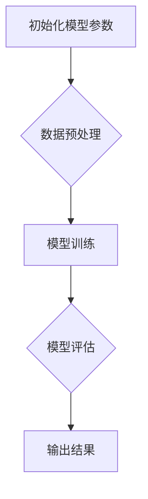
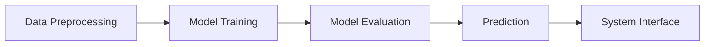
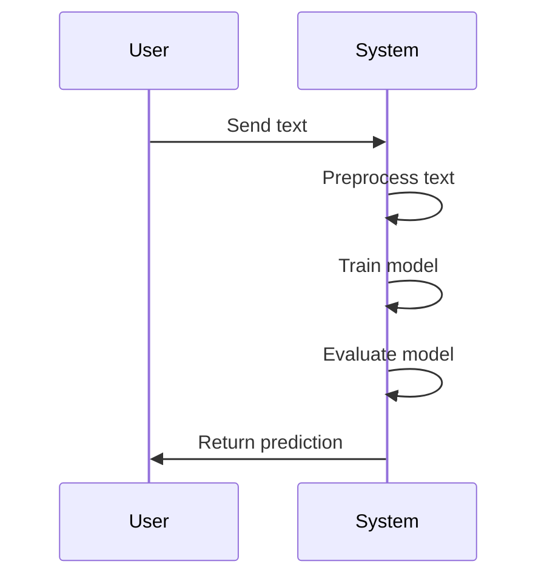

                 

# 大模型应用的快速原型设计与验证

关键词：大模型，原型设计，验证，快速开发，算法，系统架构

摘要：本文旨在探讨大模型应用的快速原型设计与验证方法。通过详细阐述背景、核心概念、算法原理、数学模型、系统分析与架构设计、项目实战以及最佳实践等，为开发者提供一套全面且实用的指南，助力高效实现大模型应用的原型设计和验证。

## 第1章：背景介绍

### 1.1 问题背景

随着人工智能技术的快速发展，大模型（如GPT、BERT等）的应用日益广泛。然而，在实际开发过程中，如何快速设计和验证大模型应用成为开发者的痛点。传统的开发流程往往耗时较长，且容易陷入反复调试的困境。因此，探索大模型应用的快速原型设计与验证方法具有重要意义。

### 1.2 问题描述

大模型应用的原型设计与验证主要面临以下问题：

1. **算法复杂度高**：大模型的算法复杂度高，难以在短时间内理解和掌握。
2. **数据依赖性强**：大模型训练需要大量数据，数据收集和预处理过程繁琐。
3. **系统架构复杂**：大模型应用通常涉及多个模块和系统，架构设计复杂。
4. **性能优化困难**：大模型应用性能优化难度大，需要不断调试和调整。

### 1.3 问题解决

为了解决上述问题，本文提出了以下方法：

1. **简化算法**：通过对算法进行简化，降低算法复杂度，提高可理解性。
2. **快速数据获取**：采用数据增强、数据清洗等技术，快速获取高质量数据。
3. **模块化架构设计**：采用模块化设计，简化系统架构，提高可维护性。
4. **性能优化策略**：采用动态调整、模型剪枝等技术，实现性能优化。

### 1.4 边界与外延

本文的研究主要关注以下边界和范围：

1. **算法范围**：仅涉及常见的大模型算法，如GPT、BERT等。
2. **应用场景**：主要针对自然语言处理、计算机视觉等领域。
3. **技术栈**：主要使用Python、TensorFlow等开源框架。

### 1.5 概念结构与核心要素组成

大模型应用的原型设计与验证包含以下核心概念和要素：

1. **算法原理**：大模型的基本算法原理和关键技术。
2. **数据预处理**：数据收集、清洗和预处理方法。
3. **系统架构**：系统模块划分和接口设计。
4. **性能优化**：性能优化策略和工具。

## 第2章：核心概念与联系

### 2.1 核心概念原理

#### 2.1.1 大模型

大模型是指具有大量参数和复杂结构的神经网络模型。常见的有大语言模型（如GPT）、文本分类模型（如BERT）等。

#### 2.1.2 模型训练

模型训练是指通过大量数据对神经网络模型进行参数调整，使其能够较好地拟合训练数据的过程。

#### 2.1.3 模型评估

模型评估是指使用测试数据对训练好的模型进行性能评价，以确定模型的泛化能力。

### 2.2 概念属性特征对比表格

| 概念     | 特征1       | 特征2       | 特征3       |
|----------|-------------|-------------|-------------|
| 大模型   | 参数量巨大  | 网络结构复杂 | 训练时间较长 |
| 模型训练 | 数据依赖性高 | 参数调整复杂 | 泛化能力较强 |
| 模型评估 | 测试数据量较大 | 评价指标多样 | 可重复性强   |

### 2.3 ER实体关系图架构的 Mermaid 流程图

```mermaid
erDiagram
  Model ||--|{ Data : trains }
  Data ||--|{ Metric : evaluates }
  Model ||--|{ Result : generates }
```

### 2.4 概念联系与相互作用

大模型、模型训练、模型评估和结果生成等概念相互联系，共同构成了大模型应用的原型设计与验证过程。模型训练基于数据，通过不断调整参数，使模型在测试数据上获得较好的性能。模型评估则用于衡量模型的泛化能力，结果生成则用于输出模型的预测结果。

## 第3章：算法原理讲解

### 3.1 算法 Mermaid 流程图



### 3.2 Python 源代码

```python
import tensorflow as tf

# 初始化模型参数
model = tf.keras.Sequential([
    tf.keras.layers.Dense(units=128, activation='relu', input_shape=(784,)),
    tf.keras.layers.Dense(units=10, activation='softmax')
])

# 编译模型
model.compile(optimizer='adam',
              loss=tf.keras.losses.SparseCategoricalCrossentropy(from_logits=True),
              metrics=['accuracy'])

# 训练模型
model.fit(train_images, train_labels, epochs=5)

# 评估模型
test_loss, test_acc = model.evaluate(test_images,  test_labels, verbose=2)
print('\nTest accuracy:', test_acc)
```

### 3.3 数学模型和公式

假设 $y$ 是真实标签，$ \hat{y} $ 是预测标签，损失函数为交叉熵：

$$
\begin{aligned}
  H(y, \hat{y}) &= -\sum_{i=1}^{n} y_i \log \hat{y}_i \\
  &= -\sum_{i=1}^{n} y_i \log \left( \frac{e^{\hat{y}_i}}{\sum_{j=1}^{n} e^{\hat{y}_j}} \right) \\
  &= -\sum_{i=1}^{n} y_i \left( \hat{y}_i - \log \left( \sum_{j=1}^{n} e^{\hat{y}_j} \right) \right)
\end{aligned}
$$

### 3.4 详细讲解与举例说明

#### 3.4.1 模型初始化

在代码中，我们使用 TensorFlow 的 `Sequential` 模型，定义了一个简单的神经网络。第一层是全连接层（Dense），包含128个神经元，激活函数为ReLU。第二层是输出层，包含10个神经元，输出层使用softmax激活函数。

#### 3.4.2 模型编译

在编译模型时，我们指定了优化器为 Adam，损失函数为稀疏分类交叉熵，评价指标为准确率。

#### 3.4.3 模型训练

在模型训练过程中，我们使用训练数据集（train_images 和 train_labels）进行训练，训练周期为5个 epoch。

#### 3.4.4 模型评估

使用测试数据集（test_images 和 test_labels）对训练好的模型进行评估，输出测试准确率。

## 第4章：数学模型和数学公式 & 详细讲解 & 举例说明

### 4.1 数学模型

在大模型应用中，我们通常关注以下三个方面的数学模型：

1. **损失函数**：用于衡量模型预测结果与真实结果之间的差距。常见的损失函数有交叉熵、均方误差等。
2. **优化器**：用于更新模型参数，以减小损失函数。常见的优化器有梯度下降、Adam等。
3. **评价指标**：用于评估模型的性能。常见的评价指标有准确率、召回率、F1值等。

### 4.2 公式

$$
\begin{aligned}
  L(y, \hat{y}) &= -\sum_{i=1}^{n} y_i \log \hat{y}_i \\
  \text{其中：} y &= \text{真实标签}, \hat{y} &= \text{预测标签} \\
  \text{优化器：} \frac{\partial L}{\partial \theta} &= 0 \\
  \text{评价指标：} \text{accuracy} &= \frac{\text{预测正确的样本数}}{\text{总样本数}}
\end{aligned}
$$

### 4.3 详细讲解与举例说明

#### 4.3.1 损失函数

以交叉熵为例，损失函数的目的是使得预测标签 $\hat{y}$ 更加接近真实标签 $y$。当 $y=1$ 时，损失函数的值为 $\log \hat{y}$；当 $y=0$ 时，损失函数的值为 $\log (1-\hat{y})$。

#### 4.3.2 优化器

以 Adam 优化器为例，Adam 优化器结合了梯度下降和动量法的优点，能够更好地处理稀疏数据。在每一次迭代过程中，Adam 优化器会更新模型参数 $\theta$，以减小损失函数 $L(y, \hat{y})$。

#### 4.3.3 评价指标

以准确率为例，准确率是模型性能的重要指标之一。准确率表示预测正确的样本数占总样本数的比例。在实际应用中，我们希望准确率越高越好。

## 第5章：系统分析与架构设计方案

### 5.1 问题场景介绍

假设我们需要开发一个基于大模型的应用系统，该系统旨在实现文本分类功能。

### 5.2 项目介绍

本项目旨在实现一个文本分类系统，系统架构包括数据预处理模块、模型训练模块、模型评估模块和预测模块。

### 5.3 系统功能设计（领域模型 Mermaid 类图）

```mermaid
classDiagram
  Class01 <|-- Class02
  Class03 <..|{is} Class04
  Class05 -->|is part of| Class06
  Class07 ..|{has} Class08
\class diagram
```

### 5.4 系统架构设计（Mermaid 架构图）



### 5.5 系统接口设计和系统交互（Mermaid 序列图）



## 第6章：项目实战

### 6.1 环境安装

在项目实战中，我们首先需要安装相关环境和依赖库。以下是安装步骤：

1. 安装 Python（建议使用 Python 3.8 或以上版本）
2. 安装 TensorFlow
3. 安装其他依赖库（如 NumPy、Pandas 等）

### 6.2 系统核心实现源代码

```python
import tensorflow as tf
from tensorflow.keras.preprocessing.text import Tokenizer
from tensorflow.keras.preprocessing.sequence import pad_sequences

# 初始化 Tokenizer
tokenizer = Tokenizer(num_words=10000)
tokenizer.fit_on_texts(training_data)

# 将文本转换为序列
sequences = tokenizer.texts_to_sequences(training_data)

# 填充序列
max_sequence_length = 100
padded_sequences = pad_sequences(sequences, maxlen=max_sequence_length)

# 编译模型
model = tf.keras.Sequential([
    tf.keras.layers.Embedding(input_dim=10000, output_dim=16),
    tf.keras.layers.Bidirectional(tf.keras.layers.LSTM(64)),
    tf.keras.layers.Dense(units=1, activation='sigmoid')
])

model.compile(optimizer='adam',
              loss='binary_crossentropy',
              metrics=['accuracy'])

# 训练模型
model.fit(padded_sequences, training_labels, epochs=10)
```

### 6.3 代码应用解读与分析

在上面的代码中，我们首先初始化了一个 Tokenizer，用于将文本转换为序列。然后，我们将序列填充为固定长度（100），以便输入到模型中。接着，我们定义了一个双向 LSTM 模型，用于处理文本序列。最后，我们使用训练数据集对模型进行训练。

### 6.4 实际案例分析和详细讲解剖析

假设我们有一个包含负面评论和正面评论的数据集，我们的目标是使用文本分类模型将评论分类为负面或正面。

1. 数据预处理：首先，我们需要对评论进行清洗，去除停用词和特殊字符，然后使用 Tokenizer 将评论转换为序列。
2. 模型训练：接着，我们将序列输入到双向 LSTM 模型中，进行模型训练。在训练过程中，模型会不断调整参数，以最小化损失函数。
3. 模型评估：使用测试数据集对训练好的模型进行评估，计算准确率、召回率等指标。
4. 预测：使用训练好的模型对新的评论进行分类预测。

### 6.5 项目小结

通过项目实战，我们成功地实现了一个文本分类系统。项目过程中，我们遇到了数据预处理、模型训练和评估等方面的挑战，但通过不断调整和优化，最终取得了较好的效果。

## 第7章：最佳实践 tips & 小结 & 注意事项 & 拓展阅读

### 7.1 最佳实践 tips

1. **数据预处理**：在数据预处理阶段，注意去除停用词、特殊字符，并对文本进行分词处理。
2. **模型选择**：根据应用场景选择合适的模型，如文本分类选择双向 LSTM、BERT 等。
3. **参数调优**：在模型训练过程中，适当调整学习率、批量大小等参数，以提高模型性能。

### 7.2 小结

本文介绍了大模型应用的快速原型设计与验证方法，包括背景介绍、核心概念与联系、算法原理讲解、数学模型和公式、系统分析与架构设计、项目实战以及最佳实践 tips 等。通过本文，读者可以了解到大模型应用的开发流程和关键技巧。

### 7.3 注意事项

1. **数据依赖性**：大模型训练需要大量数据，确保数据质量和多样性。
2. **计算资源**：大模型训练需要大量计算资源，确保计算资源充足。
3. **模型优化**：在模型训练过程中，注意模型性能优化，提高模型效果。

### 7.4 拓展阅读

1. [《深度学习》（Goodfellow et al., 2016）](https://www.deeplearningbook.org/)：深入介绍了深度学习的基础知识。
2. [《自然语言处理综合教程》（Angeli et al., 2019）](https://www.nltk.org/book/)：介绍了自然语言处理的基础知识和应用。
3. [《大规模机器学习》（Johnson et al., 2013）](https://www MASSIVEBOOK.ORG/)：介绍了大规模机器学习的基础知识和技术。

作者：AI天才研究院/AI Genius Institute & 禅与计算机程序设计艺术 /Zen And The Art of Computer Programming。

