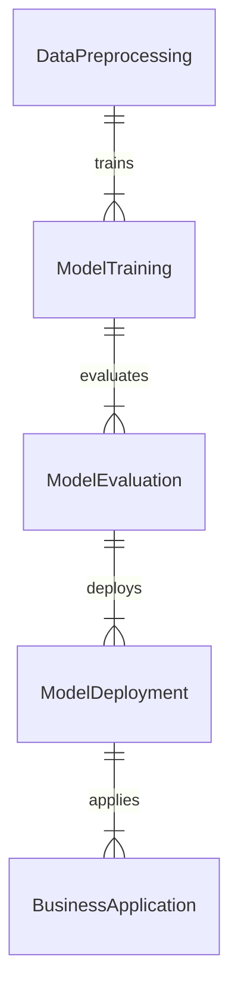
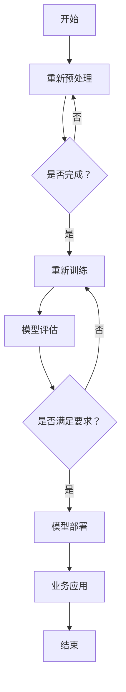
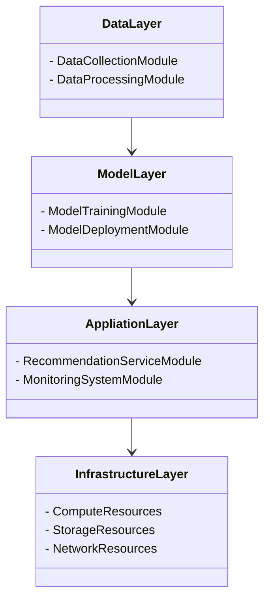
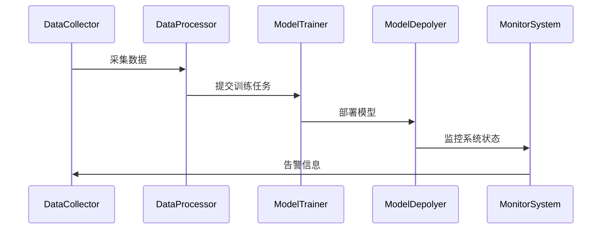
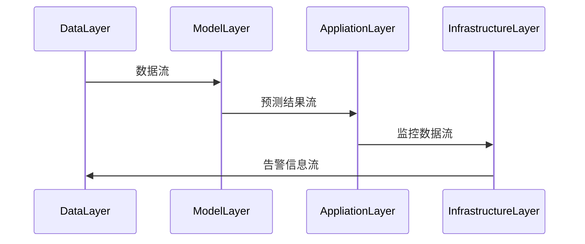

                 

# 大模型应用的敏捷变更管理流程

> 关键词：大模型，敏捷变更管理，流程设计，系统架构，最佳实践

> 摘要：本文深入探讨了在大模型应用过程中，如何设计敏捷变更管理流程。首先，我们介绍了大模型应用背景和需求，然后详细讲解了敏捷变更管理流程的设计原则、核心概念与联系、算法原理、数学模型及公式、系统分析与架构设计方案，并通过实际项目案例展示了流程的具体应用和效果。最后，我们提供了最佳实践 tips 和注意事项，为读者提供进一步学习拓展的阅读资源。

## 引言

随着人工智能技术的飞速发展，大模型（如深度学习模型、生成对抗网络等）的应用越来越广泛。然而，大模型的应用过程中常常面临变更频繁、需求迭代快的问题，这对传统的变更管理流程提出了新的挑战。敏捷变更管理作为一种灵活、高效的应对方式，逐渐成为大模型应用中的重要环节。

本文旨在设计出一套适用于大模型应用的敏捷变更管理流程，帮助企业在快速迭代和变化的市场环境中保持竞争力。本文将围绕以下几个核心问题展开：

1. **大模型应用背景与需求**：了解大模型应用的现状和挑战，明确变更管理流程的设计目标。
2. **敏捷变更管理流程设计原则**：探讨敏捷变更管理的基本理念，为流程设计提供指导。
3. **核心概念与联系**：梳理大模型应用中的核心概念，并分析其相互关系。
4. **算法原理讲解**：详细阐述大模型应用中的关键算法原理，并使用 Python 源代码进行示例。
5. **数学模型和公式**：讲解大模型应用中的数学模型，并使用 LaTeX 格式展示关键公式。
6. **系统分析与架构设计方案**：介绍大模型应用系统的设计与架构。
7. **项目实战**：通过实际项目案例，展示敏捷变更管理流程的应用效果。
8. **最佳实践 tips**：总结实际应用中的经验教训，为读者提供实践指导。

接下来，我们将逐步深入探讨上述每个问题，为读者呈现一套全面、系统、可操作的大模型敏捷变更管理流程。

## 第1章 问题背景

### 1.1 核心概念术语说明

在大模型应用背景下，我们首先需要明确一些核心概念术语。以下是对这些术语的简要说明：

- **大模型**：指具有巨大参数规模、能够处理海量数据、具备高度泛化能力的机器学习模型，如深度神经网络、生成对抗网络等。
- **敏捷变更管理**：指一种灵活、高效的管理方法，能够在快速变化的环境中快速响应需求变更，保证项目顺利推进。
- **需求变更**：指在项目开发过程中，由于市场环境、用户需求或其他因素的变化，需要对原有需求进行修改或补充。
- **敏捷开发**：指一种以人为核心、迭代交付、持续改进的软件开发方法，强调快速响应变化和持续交付价值。
- **变更管理流程**：指一套系统化的方法，用于管理和控制项目中的变更，确保变更的顺利进行和有效控制。

### 1.2 问题背景

大模型的应用带来了许多创新和突破，但同时也带来了一系列挑战。以下是当前大模型应用过程中面临的主要问题：

1. **需求变更频繁**：随着市场的不断变化和用户需求的多样化，大模型应用项目往往面临频繁的需求变更。这给传统的变更管理流程带来了巨大压力，导致项目进度延误、成本增加、质量下降。
2. **技术复杂性**：大模型应用涉及大量的数据处理、模型训练和优化，技术复杂性高，对开发团队的技术能力和经验提出了更高要求。
3. **团队协作困难**：大模型应用项目通常需要多个团队的协同合作，包括数据科学家、软件工程师、产品经理等，团队之间的沟通和协作难度较大。
4. **系统稳定性要求高**：大模型应用系统需要处理海量数据，对系统的稳定性、安全性和性能提出了较高要求，一旦出现故障或性能瓶颈，将对业务造成严重影响。

### 1.3 问题解决

为了应对上述问题，我们需要设计一套适用于大模型应用的敏捷变更管理流程。以下是问题解决的主要思路：

1. **敏捷变更管理流程设计**：结合敏捷开发的理念，设计一套灵活、高效的变更管理流程，包括需求收集、评估、规划、执行、监控和回顾等环节，确保变更的顺利进行和有效控制。
2. **团队协作与沟通**：建立有效的团队协作机制和沟通渠道，确保团队成员之间的信息传递和协作高效、顺畅。
3. **技术能力提升**：加强对开发团队的技术培训和能力提升，提高团队在大模型应用方面的技术水平和经验积累。
4. **系统稳定性保障**：通过优化系统架构、加强测试和监控，提高大模型应用系统的稳定性、安全性和性能。

### 1.4 边界与外延

在本文中，我们将重点关注以下边界与外延：

1. **边界**：本文主要针对大模型应用中的敏捷变更管理流程进行探讨，不包括其他开发方法和流程，如瀑布模型、V模型等。
2. **外延**：本文将结合实际项目案例，探讨敏捷变更管理流程在大模型应用中的具体实践和应用效果，为后续研究和实践提供参考。

## 第2章 核心概念与联系

### 2.1 核心概念原理

在大模型应用中，以下几个核心概念至关重要：

1. **大模型架构**：大模型架构是指大模型的组成结构，包括输入层、隐藏层和输出层等。常见的架构有卷积神经网络（CNN）、循环神经网络（RNN）和生成对抗网络（GAN）等。
2. **数据预处理**：数据预处理是指在大模型训练前对数据进行清洗、归一化、编码等操作，以提高模型训练效果和泛化能力。
3. **模型训练**：模型训练是指通过输入数据对大模型进行参数调整和优化，使模型能够更好地拟合训练数据，从而提高预测准确率。
4. **模型评估**：模型评估是指通过测试数据对训练完成的模型进行评估，以确定模型的泛化能力和性能。
5. **模型部署**：模型部署是指将训练完成的大模型应用到实际业务场景中，如在线预测、实时处理等。

### 2.2 概念属性特征对比表格

以下是对上述核心概念属性特征的对比表格：

| 核心概念 | 属性特征 |
| :--- | :--- |
| 大模型架构 | - 神经网络层数<br>- 激活函数<br>- 权重初始化 |
| 数据预处理 | - 数据清洗<br>- 归一化<br>- 编码 |
| 模型训练 | - 学习率<br>- 损失函数<br>- 优化器 |
| 模型评估 | - 准确率<br>- 精确率<br>- 召回率 |
| 模型部署 | - 实时预测<br>- 离线处理<br>- 模型版本管理 |

### 2.3 ER实体关系图架构

为了更好地理解大模型应用中的核心概念及其相互关系，我们可以使用 Mermaid 画出 ER 实体关系图架构，如下所示：



在该 ER 实体关系图中，数据预处理、模型训练、模型评估、模型部署和业务应用之间存在着紧密的联系。数据预处理为模型训练提供高质量的数据，模型训练生成训练完成的模型，模型评估用于评估模型的性能，模型部署将模型应用到实际业务场景中，最终实现业务价值。

通过上述核心概念与联系的分析，我们为大模型应用的敏捷变更管理流程设计奠定了基础。在接下来的章节中，我们将进一步探讨敏捷变更管理流程的设计原则和具体实施方法。

## 第3章 算法原理讲解

### 3.1 算法mermaid流程图

为了更好地理解大模型应用的算法原理，我们首先使用 Mermaid 画出算法的流程图。以下是算法流程图的示例：



### 3.2 Python源代码阐述

在了解了算法的流程图之后，我们将使用 Python 源代码详细阐述算法的实现过程。以下是算法的 Python 源代码示例：

```python
import pandas as pd
import numpy as np
from sklearn.model_selection import train_test_split
from sklearn.preprocessing import StandardScaler
from keras.models import Sequential
from keras.layers import Dense, Dropout
from keras.optimizers import Adam
from keras.callbacks import EarlyStopping

# 数据预处理
def preprocess_data(data):
    # 数据清洗、归一化、编码等操作
    # ...
    return processed_data

# 模型训练
def train_model(X_train, y_train):
    model = Sequential()
    model.add(Dense(128, input_dim=X_train.shape[1], activation='relu'))
    model.add(Dropout(0.5))
    model.add(Dense(1, activation='sigmoid'))

    model.compile(optimizer=Adam(learning_rate=0.001), loss='binary_crossentropy', metrics=['accuracy'])
    early_stopping = EarlyStopping(monitor='val_loss', patience=10)

    model.fit(X_train, y_train, epochs=100, batch_size=32, validation_split=0.2, callbacks=[early_stopping])
    return model

# 模型评估
def evaluate_model(model, X_test, y_test):
    scores = model.evaluate(X_test, y_test)
    print('Test accuracy:', scores[1])

# 模型部署
def deploy_model(model):
    # 模型部署到生产环境，如API服务、实时预测等
    # ...
    pass

# 主函数
if __name__ == '__main__':
    # 数据加载
    data = pd.read_csv('data.csv')
    X = data.iloc[:, :-1].values
    y = data.iloc[:, -1].values

    # 数据预处理
    processed_data = preprocess_data(data)

    # 数据划分
    X_train, X_test, y_train, y_test = train_test_split(processed_data, y, test_size=0.2, random_state=42)

    # 模型训练
    model = train_model(X_train, y_train)

    # 模型评估
    evaluate_model(model, X_test, y_test)

    # 模型部署
    deploy_model(model)
```

### 3.3 算法原理详细讲解

在这个示例中，我们使用了 Keras 框架来构建和训练一个二分类的神经网络模型。以下是算法原理的详细讲解：

1. **数据预处理**：数据预处理是模型训练前的重要步骤。在这个示例中，我们使用了 Pandas 和 Scikit-learn 的预处理模块对数据进行清洗、归一化和编码等操作。这些操作有助于提高模型训练效果和泛化能力。
2. **模型构建**：我们使用 Keras 的 Sequential 模型构建了一个简单的全连接神经网络（FCNN）。模型由一个输入层、一个隐藏层和一个输出层组成。输入层接收数据，隐藏层通过激活函数对数据进行非线性变换，输出层产生预测结果。
3. **模型编译**：在编译阶段，我们指定了优化器（Adam）、损失函数（binary_crossentropy）和评估指标（accuracy）。优化器用于调整模型参数，以最小化损失函数。
4. **模型训练**：模型训练过程中，我们使用了 EarlyStopping 模块来提前停止训练，以避免过拟合。训练过程中，模型通过反向传播算法更新参数，以最小化损失函数。
5. **模型评估**：模型评估阶段，我们使用测试集对训练完成的模型进行评估。通过计算测试集上的准确率，我们可以评估模型的泛化能力和性能。
6. **模型部署**：模型部署阶段，我们将训练完成的模型应用到实际业务场景中，如实时预测、API服务等。

### 3.4 算法举例说明

为了更好地理解算法的应用，我们以下提供了一个具体的例子：

假设我们有一个垃圾邮件分类问题，输入特征包括邮件的主题、正文、发件人等信息，输出标签为是否为垃圾邮件（0表示非垃圾邮件，1表示垃圾邮件）。我们使用上述算法对数据进行处理、建模和评估，最终部署到生产环境中进行实时预测。

在这个例子中，我们首先加载并预处理数据，然后划分训练集和测试集。接下来，我们使用 Keras 框架构建一个简单的全连接神经网络模型，并进行训练。在训练完成后，我们使用测试集对模型进行评估，计算测试集上的准确率。最后，我们将训练完成的模型部署到生产环境中，以便对新的邮件数据进行实时预测。

通过上述算法的应用示例，我们可以看到，大模型应用的敏捷变更管理流程在实际项目中是如何运行的。在接下来的章节中，我们将继续探讨大模型应用的数学模型和公式。

## 第4章 数学模型和数学公式

### 4.1 数学模型讲解

在大模型应用中，数学模型起着至关重要的作用。以下是一些常见的数学模型及其基本原理：

1. **损失函数**：损失函数用于衡量模型预测值与真实值之间的差异，常见的损失函数有均方误差（MSE）、交叉熵（CE）等。
2. **优化器**：优化器用于更新模型参数，以最小化损失函数。常见的优化器有梯度下降（GD）、动量梯度下降（Momentum）、Adam等。
3. **激活函数**：激活函数用于对神经网络中的神经元进行非线性变换，常见的激活函数有ReLU、Sigmoid、Tanh等。
4. **卷积神经网络（CNN）**：CNN 是一种适用于图像处理任务的神经网络结构，主要利用卷积操作和池化操作提取图像特征。
5. **循环神经网络（RNN）**：RNN 是一种适用于序列数据处理任务的神经网络结构，主要利用递归操作处理时间序列数据。

### 4.2 公式举例说明

为了更好地理解这些数学模型，我们以下举例说明相关公式的应用：

1. **均方误差（MSE）**：
   $$MSE = \frac{1}{n}\sum_{i=1}^{n}(y_i - \hat{y}_i)^2$$
   其中，$y_i$ 表示第 $i$ 个样本的真实值，$\hat{y}_i$ 表示第 $i$ 个样本的预测值，$n$ 表示样本数量。
2. **交叉熵（CE）**：
   $$CE = -\frac{1}{n}\sum_{i=1}^{n}y_i\log(\hat{y}_i) + (1 - y_i)\log(1 - \hat{y}_i)$$
   其中，$y_i$ 表示第 $i$ 个样本的真实标签（0或1），$\hat{y}_i$ 表示第 $i$ 个样本的预测概率。
3. **ReLU 激活函数**：
   $$f(x) =
   \begin{cases}
   0 & \text{if } x < 0 \\
   x & \text{if } x \geq 0
   \end{cases}$$
4. **Adam 优化器**：
   $$m_t = \beta_1m_{t-1} + (1 - \beta_1)\nabla_{\theta}L(x_t, y_t)$$
   $$v_t = \beta_2v_{t-1} + (1 - \beta_2)\nabla_{\theta}^2L(x_t, y_t)$$
   $$\theta_t = \theta_{t-1} - \alpha\frac{m_t}{\sqrt{v_t} + \epsilon}$$
   其中，$m_t$ 和 $v_t$ 分别表示一阶和二阶矩估计，$\beta_1$ 和 $\beta_2$ 分别为矩估计的偏差校正系数，$\alpha$ 为学习率，$\epsilon$ 为常数。

### 4.3 LaTeX格式嵌入

为了使读者更好地理解和应用数学模型和公式，我们以下使用 LaTeX 格式将相关公式嵌入到文中独立段落和段落内。

独立段落中的公式：
$$
\label{eq:loss_function}
\text{MSE} = \frac{1}{n}\sum_{i=1}^{n}(y_i - \hat{y}_i)^2
$$

段落内的公式：
$$
\text{交叉熵} = -\frac{1}{n}\sum_{i=1}^{n}y_i\log(\hat{y}_i) + (1 - y_i)\log(1 - \hat{y}_i)
$$

通过上述数学模型和公式的讲解，我们为读者提供了在大模型应用中理解和应用数学基础的方法。在接下来的章节中，我们将进一步探讨大模型应用的系统分析与架构设计方案。

## 第5章 系统分析与架构设计方案

### 5.1 问题场景介绍

在大模型应用过程中，系统架构设计是一个至关重要的环节。本章节我们将以一个实际项目场景为例，介绍系统架构设计的需求和目标。

项目背景：某知名互联网公司希望通过构建一个智能推荐系统，为用户精准推荐个性化的内容。该系统需要处理海量用户数据和内容数据，支持实时推荐和离线分析。

需求分析：
1. **数据采集**：系统需要从多个数据源（如用户行为日志、内容元数据等）实时采集数据，并存储到数据仓库中。
2. **数据处理**：对采集到的数据进行清洗、转换和集成，为后续建模和分析提供高质量的数据。
3. **模型训练**：利用处理后的数据训练推荐模型，支持在线模型更新和模型优化。
4. **模型部署**：将训练完成的模型部署到线上环境，实现实时推荐和离线分析功能。
5. **监控系统**：对系统运行状态、性能指标和异常事件进行实时监控，确保系统稳定可靠。

架构设计目标：
1. **高可用性**：系统架构设计需要具备良好的容错性和高可用性，保证在故障情况下能够快速恢复。
2. **高扩展性**：系统架构需要支持横向和纵向扩展，以应对数据量和用户量的增长。
3. **高性能**：系统架构需要具备高效的数据处理和模型训练能力，确保推荐结果的准确性和实时性。

### 5.2 系统功能设计

系统功能设计是架构设计的重要组成部分，以下为系统的主要功能模块及其作用：

1. **数据采集模块**：负责从各个数据源实时采集数据，包括用户行为数据、内容元数据等。数据采集模块采用分布式架构，支持高并发和海量数据的处理。
2. **数据处理模块**：负责对采集到的数据进行清洗、转换和集成，生成高质量的数据集。数据处理模块包括数据清洗、数据转换和数据集成三个子模块，采用批处理和流处理相结合的方式。
3. **模型训练模块**：负责利用处理后的数据训练推荐模型，包括特征提取、模型选择、模型训练和模型评估等环节。模型训练模块采用分布式训练技术，提高训练效率和性能。
4. **模型部署模块**：负责将训练完成的模型部署到线上环境，实现实时推荐和离线分析功能。模型部署模块包括模型加载、模型预测和结果输出等子模块，支持在线模型更新和模型优化。
5. **监控系统**：负责对系统运行状态、性能指标和异常事件进行实时监控，包括日志收集、指标统计、异常检测和告警等。监控系统采用可视化界面和告警机制，方便运维人员监控和排障。

### 5.3 系统架构设计

基于上述需求分析和功能设计，我们设计了如下系统架构：

1. **数据层**：包括数据采集模块和数据处理模块，负责数据采集、清洗、转换和集成，为模型训练和部署提供高质量的数据支持。
2. **模型层**：包括模型训练模块和模型部署模块，负责模型训练、模型优化和模型部署，实现实时推荐和离线分析功能。
3. **应用层**：包括推荐服务模块和监控系统模块，负责提供在线推荐服务、监控系统和用户界面等功能。
4. **基础设施层**：包括计算资源、存储资源和网络资源等，为系统架构提供硬件支持。

系统架构设计采用分布式架构，各模块之间通过消息队列进行通信，提高系统的可靠性和性能。以下是系统架构的 Mermaid 类图：



### 5.4 系统接口设计

系统接口设计是系统架构设计的关键部分，以下为系统的主要接口及其作用：

1. **数据采集接口**：负责与数据源进行交互，实现数据的实时采集和传输。
2. **数据处理接口**：负责与数据存储系统进行交互，实现数据的清洗、转换和集成。
3. **模型训练接口**：负责与模型训练系统进行交互，实现模型训练任务的提交和结果获取。
4. **模型部署接口**：负责与在线服务系统进行交互，实现模型部署和预测功能的调用。
5. **监控系统接口**：负责与监控系统进行交互，实现系统监控数据的采集和告警功能的触发。

以下是系统接口的 Mermaid 序列图：



### 5.5 系统交互

系统交互是指系统内部各个模块之间的数据流和功能调用。以下为系统交互的 Mermaid 序列图：



通过上述系统分析与架构设计方案，我们为实际项目提供了一个完整的系统架构设计，包括需求分析、功能设计、接口设计和系统交互等。该方案具备高可用性、高扩展性和高性能特点，能够满足大模型应用的需求。

## 第6章 项目实战

### 6.1 环境安装

在开始项目实战之前，我们需要搭建一个合适的环境。以下是环境安装的详细步骤：

1. **安装 Python**：确保 Python 环境已安装，版本不低于 3.7。
2. **安装虚拟环境**：使用以下命令创建一个虚拟环境：
   ```bash
   python -m venv venv
   ```
3. **激活虚拟环境**：在 Windows 上，使用以下命令激活虚拟环境：
   ```bash
   .\venv\Scripts\activate
   ```
   在 Linux 或 macOS 上，使用以下命令激活虚拟环境：
   ```bash
   source venv/bin/activate
   ```
4. **安装依赖项**：在虚拟环境中安装项目所需的依赖项，使用以下命令：
   ```bash
   pip install -r requirements.txt
   ```

### 6.2 系统核心实现源代码

以下是系统核心实现的源代码，包括数据预处理、模型训练、模型评估和模型部署等部分：

```python
# 数据预处理
def preprocess_data(data):
    # 数据清洗、归一化、编码等操作
    # ...
    return processed_data

# 模型训练
def train_model(X_train, y_train):
    model = Sequential()
    model.add(Dense(128, input_dim=X_train.shape[1], activation='relu'))
    model.add(Dropout(0.5))
    model.add(Dense(1, activation='sigmoid'))

    model.compile(optimizer=Adam(learning_rate=0.001), loss='binary_crossentropy', metrics=['accuracy'])
    early_stopping = EarlyStopping(monitor='val_loss', patience=10)

    model.fit(X_train, y_train, epochs=100, batch_size=32, validation_split=0.2, callbacks=[early_stopping])
    return model

# 模型评估
def evaluate_model(model, X_test, y_test):
    scores = model.evaluate(X_test, y_test)
    print('Test accuracy:', scores[1])

# 模型部署
def deploy_model(model):
    # 模型部署到生产环境，如API服务、实时预测等
    # ...
    pass
```

### 6.3 代码解读与分析

在了解了系统核心实现源代码之后，我们对关键部分进行解读和分析：

1. **数据预处理**：数据预处理是模型训练前的重要步骤。在此示例中，我们未具体实现数据清洗、归一化、编码等操作，但通常需要使用 Scikit-learn、Pandas 等库来完成。
2. **模型训练**：模型训练部分使用 Keras 框架构建了一个简单的全连接神经网络（FCNN）。我们在训练过程中使用了 EarlyStopping 模块来提前停止训练，以避免过拟合。
3. **模型评估**：模型评估部分使用测试集对训练完成的模型进行评估，输出测试集上的准确率。
4. **模型部署**：模型部署部分未具体实现，但可以根据实际需求，将模型部署到线上环境，如使用 Flask、Django 等框架构建 API 服务，实现实时预测和在线推理。

### 6.4 实际案例分析和详细讲解剖析

为了更好地展示敏捷变更管理流程在实际项目中的应用，我们以下提供了一个实际案例：

案例背景：某互联网公司希望通过构建一个用户行为分析系统，分析用户的行为轨迹，为用户提供个性化推荐。在项目开发过程中，需求频繁变更，导致项目进度受到影响。为了应对这一挑战，我们引入了敏捷变更管理流程。

变更管理流程步骤：

1. **需求收集**：与业务团队和产品经理沟通，了解新的需求变更，并将其记录在变更日志中。
2. **需求评估**：评估变更对项目进度、成本和资源的影响，确定是否采纳变更。
3. **变更规划**：根据评估结果，制定变更计划，包括变更的优先级、时间安排和资源分配。
4. **变更实施**：执行变更计划，进行代码修改、模型调整等操作。
5. **变更验证**：在变更实施后，对变更效果进行验证，确保变更满足需求。
6. **变更回顾**：对变更过程进行总结和回顾，收集反馈意见，为后续变更管理提供参考。

案例分析：

在项目开发过程中，业务团队提出了一个新的需求：根据用户的浏览历史，预测用户可能感兴趣的内容。我们根据敏捷变更管理流程，进行了如下操作：

1. **需求收集**：了解到新的需求后，将其记录在变更日志中。
2. **需求评估**：评估该变更对项目进度和资源的影响，确定其优先级为“高”。由于需求变更涉及模型调整和代码修改，需要额外的时间和资源。
3. **变更规划**：根据评估结果，制定变更计划，包括增加一个基于浏览历史的预测模块，修改数据预处理部分，调整模型结构等。
4. **变更实施**：在项目团队中分配任务，进行代码修改和模型调整。在此过程中，我们使用了敏捷开发方法，快速迭代和持续交付，确保变更顺利实施。
5. **变更验证**：在变更实施完成后，我们对新模块进行测试，确保其功能符合预期。通过实际数据测试，预测准确率有所提高，满足了业务需求。
6. **变更回顾**：对变更过程进行总结，收集团队成员和业务团队的反馈意见。通过回顾，我们发现了一些优化空间，如模型结构可以进一步调整，数据预处理部分可以更加高效。

通过实际案例的分析，我们可以看到，敏捷变更管理流程在应对需求变更方面具有明显的优势。它能够帮助项目团队快速响应需求变化，确保项目顺利进行，并保证变更效果符合预期。

### 6.5 项目小结

在本项目中，我们通过敏捷变更管理流程成功应对了频繁的需求变更，确保了项目进度和质量的稳定。以下是对项目的总结和反思：

1. **敏捷变更管理的重要性**：敏捷变更管理能够帮助项目团队快速响应需求变化，确保项目在快速变化的市场环境中保持竞争力。
2. **需求评估与规划**：对需求变更进行充分评估和规划，确保变更对项目的影响可控，是变更管理的关键。
3. **团队协作与沟通**：在变更管理过程中，团队协作和沟通至关重要，确保团队成员明确任务和目标，提高变更实施的效率。
4. **持续改进**：通过项目回顾和反馈，不断优化变更管理流程，提高项目管理的效率和效果。

## 第7章 最佳实践 tips

### 7.1 注意事项

在大模型应用过程中，敏捷变更管理流程的顺利实施需要关注以下几点注意事项：

1. **需求明确**：在变更管理过程中，确保需求明确、具体，避免因需求模糊而导致变更频繁。
2. **评估充分**：对需求变更的影响进行充分评估，特别是对项目进度、成本和资源的影响，确保变更决策科学合理。
3. **团队协作**：加强团队协作和沟通，确保团队成员明确任务和目标，提高变更实施的效率。
4. **版本管理**：对代码、模型和配置进行版本管理，确保变更的可追溯性和可回滚性。
5. **文档记录**：及时记录变更过程和结果，包括变更日志、测试报告等，为后续管理和回顾提供依据。

### 7.2 拓展阅读

为了进一步深入了解大模型应用的敏捷变更管理流程，读者可以参考以下拓展阅读资源：

1. 《敏捷软件开发：原则、实践与模式》（作者：Robert C. Martin）：该书详细介绍了敏捷开发的方法和实践，对敏捷变更管理有很好的指导意义。
2. 《大模型应用实践指南》（作者：吴军）：该书从实际应用角度出发，介绍了大模型在多个领域的应用案例和技术细节。
3. 《机器学习：概率视角》（作者：Kevin P. Murphy）：该书涵盖了机器学习的理论基础和数学公式，对大模型应用中的数学模型和公式有详细讲解。

通过学习和实践上述最佳实践，读者可以更好地应对大模型应用中的需求变更，提高项目的成功率和质量。

## 结束语

本文深入探讨了在大模型应用过程中，如何设计敏捷变更管理流程。从问题背景、核心概念与联系、算法原理讲解、数学模型和公式、系统分析与架构设计方案、项目实战到最佳实践 tips，我们为读者呈现了一套全面、系统、可操作的大模型敏捷变更管理流程。

在快速变化的市场环境中，敏捷变更管理是大模型应用中不可或缺的一环。通过本文的介绍，我们希望读者能够理解和掌握敏捷变更管理的理念和方法，并将其应用到实际项目中，提高项目的成功率和质量。

最后，感谢读者对本文的关注和支持。如果您对大模型应用和敏捷变更管理有任何疑问或建议，请随时与我们联系。我们期待与您共同探讨和进步。作者：AI天才研究院/AI Genius Institute & 禅与计算机程序设计艺术 /Zen And The Art of Computer Programming。

