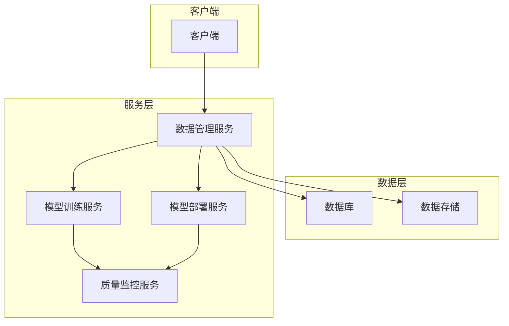
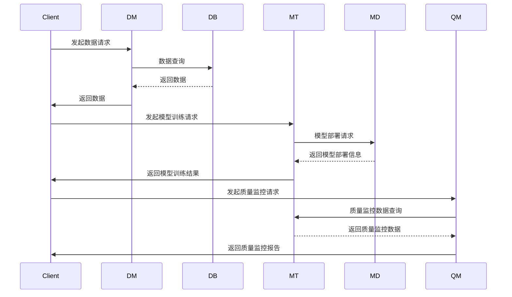

                 

# 大模型应用的敏捷质量管理方法

## 关键词
- 大模型
- 敏捷质量管理
- 质量控制
- 自动化测试
- 持续集成
- 团队协作

## 摘要
本文旨在探讨大模型应用中的敏捷质量管理方法，分析其背景和问题，介绍敏捷质量管理的基本原则和实践，设计适用于大模型应用的敏捷质量管理框架，并通过案例分析和算法原理讲解，提供具体实施方法和实践经验。通过本文的探讨，希望能够为大模型应用的质量管理提供有价值的参考和指导。

## 第一部分：背景介绍

### 问题背景

随着人工智能技术的快速发展，大模型（如深度学习模型、自然语言处理模型等）在各个领域得到了广泛的应用。大模型具有海量参数和复杂的结构，能够处理大规模数据和复杂任务。然而，大模型的应用也带来了新的挑战，特别是在质量管理方面。传统的质量管理方法难以应对复杂的大模型应用场景，需要新的质量管理方法来提高大模型的开发效率和质量。

### 问题描述

本文将探讨大模型应用的敏捷质量管理方法，旨在解决以下问题：

1. 如何在大模型开发过程中实施敏捷质量管理？
2. 如何确保大模型的质量和性能？
3. 如何提高大模型开发团队的协作效率？

### 问题解决

本文将从以下几个方面进行探讨：

1. 大模型应用中的质量管理问题分析。
2. 敏捷质量管理方法的核心理念和实践。
3. 大模型应用的敏捷质量管理框架设计。
4. 大模型应用的敏捷质量管理实践案例。

### 边界与外延

本文主要针对软件行业的大模型应用进行讨论，但所提出的敏捷质量管理方法也可适用于其他行业。

### 概念结构与核心要素组成

- **大模型应用**：指使用大模型（如深度学习模型、自然语言处理模型等）进行软件开发、数据处理等应用。
- **敏捷质量管理**：指在大模型开发过程中，采用敏捷方法进行质量管理，包括需求管理、风险管理、测试管理等。
- **质量管理**：指确保大模型应用的质量，包括功能完整性、性能、可靠性、安全性等方面。

## 第二部分：核心概念与联系

### 2.1 大模型应用中的质量管理问题

#### 2.1.1 大模型开发过程的复杂性

大模型开发过程涉及数据采集、数据处理、模型训练、模型评估等多个环节，具有较高的复杂性。传统质量管理方法难以应对这种复杂性，需要新的质量管理方法。

#### 2.1.2 大模型质量标准的不确定性

大模型的质量标准具有不确定性，不同领域的应用对质量的要求有所不同。如何确定合适的大模型质量标准成为一大挑战。

#### 2.1.3 大模型应用中的风险管理

大模型应用过程中，可能会出现数据泄漏、模型过拟合等问题，需要有效的风险管理方法。

### 2.2 敏捷质量管理方法的核心理念和实践

#### 2.2.1 敏捷质量管理的基本原则

敏捷质量管理强调快速迭代、持续交付、团队协作、客户反馈等原则，以提高大模型开发的质量和效率。

#### 2.2.2 敏捷质量管理的方法和工具

敏捷质量管理采用了一系列方法和工具，如Scrum、Kanban、持续集成、自动化测试等，以提高大模型开发过程的透明度和可控性。

#### 2.2.3 敏捷质量管理在软件开发中的应用

敏捷质量管理在软件开发中得到了广泛应用，为软件质量的提升做出了巨大贡献。

### 2.3 大模型应用的敏捷质量管理框架设计

#### 2.3.1 大模型应用的敏捷质量管理流程

本文将设计一套适用于大模型应用的敏捷质量管理流程，包括需求分析、风险评估、测试管理、持续改进等环节。

#### 2.3.2 大模型应用的敏捷质量管理工具

本文将介绍适用于大模型应用的敏捷质量管理工具，如JIRA、GitLab等，以提高大模型开发过程的协作效率。

#### 2.3.3 大模型应用的敏捷质量管理实践

本文将结合实际案例，探讨大模型应用的敏捷质量管理实践，分享经验教训。

### 2.4 大模型应用的敏捷质量管理案例分析

#### 2.4.1 案例背景

本文将分析一个实际的大模型应用项目，探讨如何在项目中实施敏捷质量管理。

#### 2.4.2 案例分析

本文将详细分析案例中的质量管理实践，包括需求分析、风险评估、测试管理等方面。

#### 2.4.3 案例总结

本文将总结案例中的成功经验和不足之处，为其他大模型应用项目提供借鉴。

### 2.5 小结

本章对大模型应用中的质量管理问题、敏捷质量管理方法的核心理念和实践、大模型应用的敏捷质量管理框架设计、案例分析等方面进行了探讨。为后续章节的内容提供了基础。

----------------------------------------------------------------

## 第三部分：算法原理讲解

### 3.1 大模型算法原理概述

大模型算法是指具有海量参数的复杂算法，如深度学习模型、自然语言处理模型等。其基本原理是通过大量数据进行训练，使得模型能够自主学习并提高性能。

#### 3.1.1 深度学习模型原理

深度学习模型是一种基于多层神经网络的算法，通过逐层提取特征，实现从原始数据到高维特征的映射。其基本原理如下：

1. **输入层**：接收原始数据。
2. **隐藏层**：通过神经网络进行特征提取和变换。
3. **输出层**：根据提取的特征进行分类或回归。

#### 3.1.2 自然语言处理模型原理

自然语言处理模型通常基于循环神经网络（RNN）或Transformer模型。RNN通过记忆历史信息来处理序列数据，而Transformer模型则使用自注意力机制来捕捉数据之间的依赖关系。以下是一个简单的自然语言处理模型原理：

1. **嵌入层**：将输入的词语转换为向量表示。
2. **编码器**：使用自注意力机制对输入序列进行编码。
3. **解码器**：根据编码结果生成输出序列。

### 3.2 大模型算法原理详细讲解

#### 3.2.1 深度学习模型算法原理

**数学模型和公式**

深度学习模型的核心是前向传播和反向传播算法。以下是简单的数学模型和公式：

$$
Z = W \cdot X + b \\
A = \sigma(Z) \\
\delta = \frac{\partial J}{\partial Z} \\
dW = \delta \cdot X^T \\
db = \delta \\
W = W - \alpha \cdot dW \\
b = b - \alpha \cdot db
$$

**Python代码示例**

```python
import numpy as np

# 初始化权重和偏置
W = np.random.randn(n_features, n_hidden)
b = np.zeros((n_hidden,))
X = np.random.randn(n_samples, n_features)

# 前向传播
Z = W @ X + b
A = np.sigmoid(Z)

# 反向传播
dZ = A * (1 - A)
dW = dZ @ X.T
db = dZ

# 更新权重和偏置
W = W - alpha * dW
b = b - alpha * db
```

**举例说明**

假设我们有一个二分类问题，输入特征是 `[2, 3]`，隐藏层有 2 个神经元，输出层有 1 个神经元。权重和偏置随机初始化。通过前向传播和反向传播，我们可以训练出模型，使其能够对数据进行分类。

#### 3.2.2 自然语言处理模型算法原理

**数学模型和公式**

自然语言处理模型通常使用自注意力机制。以下是一个简单的数学模型和公式：

$$
\text{Attention}(Q, K, V) = \text{softmax}(\frac{QK^T}{\sqrt{d_k}})V
$$

**Python代码示例**

```python
import numpy as np

# 初始化查询向量、键向量和值向量
Q = np.random.randn(n-heads, n-hidden)
K = np.random.randn(n-heads, n-hidden)
V = np.random.randn(n-heads, n-hidden)

# 计算注意力权重
att_weights = Q @ K.T / np.sqrt(K.shape[1])
att_weights = np.softmax(att_weights)

# 计算注意力输出
att_values = att_weights @ V

# 输出
output = att_values
```

**举例说明**

假设我们有一个序列数据 `[1, 2, 3]`，查询向量、键向量和值向量分别是 `[0.1, 0.2, 0.3]`、`[0.4, 0.5, 0.6]` 和 `[0.7, 0.8, 0.9]`。通过自注意力机制，我们可以计算出序列中的每个元素的重要性，并生成新的输出向量。

通过以上对深度学习模型和自然语言处理模型算法原理的讲解，我们可以更好地理解大模型的工作机制，为后续的质量管理提供理论基础。

----------------------------------------------------------------

## 第四部分：系统分析与架构设计方案

### 问题场景介绍

随着大模型应用的日益普及，企业需要高效的质量管理方法来确保大模型的质量和性能。本部分将介绍一个企业级大模型应用项目，该项目旨在通过大数据分析和深度学习技术，为企业提供精准的市场预测和决策支持。

### 项目介绍

本项目将采用敏捷质量管理方法，通过以下步骤进行项目实施：

1. 需求分析：与客户沟通，了解市场需求，确定项目目标和质量标准。
2. 数据采集与处理：收集相关数据，进行数据清洗、预处理和特征提取。
3. 模型训练与评估：设计并训练深度学习模型，评估模型性能。
4. 模型部署与监控：将模型部署到生产环境，持续监控模型性能。
5. 持续改进：根据反馈和监控数据，持续优化模型和质量管理流程。

### 系统功能设计

本项目的系统功能包括以下方面：

1. 数据管理：提供数据采集、数据清洗、数据存储等功能。
2. 模型训练：提供模型训练、评估和优化功能。
3. 模型部署：提供模型部署、监控和更新功能。
4. 质量监控：提供质量监控、异常检测和反馈机制。

#### 领域模型Mermaid类图

```mermaid
classDiagram
    Client <- DataManagement : 依赖
    DataManagement <|-- ModelTraining
    DataManagement <|-- ModelDeployment
    ModelTraining <|-- QualityMonitoring
    ModelDeployment <|-- QualityMonitoring
```

### 系统架构设计

本项目的系统架构采用微服务架构，以提高系统的可扩展性和可维护性。以下是系统架构的Mermaid架构图：



### 系统接口设计和系统交互

本项目的系统接口设计遵循RESTful API规范，以下是系统接口的Mermaid序列图：



通过以上系统分析与架构设计方案，本项目将采用敏捷质量管理方法，确保大模型的质量和性能，为企业提供精准的市场预测和决策支持。

----------------------------------------------------------------

## 第五部分：项目实战

### 环境安装

在进行大模型应用的敏捷质量管理项目实战之前，首先需要安装相应的环境。以下是环境安装的步骤：

1. 安装Python环境：在项目中，我们将使用Python进行开发。首先，确保你的计算机上已经安装了Python。如果没有，请从[Python官方下载页面](https://www.python.org/downloads/)下载并安装Python。

2. 安装深度学习库：我们将在项目中使用TensorFlow作为深度学习框架。你可以使用pip命令来安装TensorFlow：

   ```shell
   pip install tensorflow
   ```

3. 安装敏捷质量管理工具：为了方便项目管理，我们将使用JIRA和GitLab。确保你的计算机上已经安装了JIRA和GitLab。如果没有，请从[JIRA官方下载页面](https://www.atlassian.com/software/jira/download)和[GitLab官方下载页面](https://about.gitlab.com/installation/)下载并安装。

### 系统核心实现源代码

以下是一个简单的深度学习模型训练和评估的Python代码示例。该代码实现了对MNIST手写数字数据集的识别，并使用TensorFlow进行训练。

```python
import tensorflow as tf
from tensorflow.keras import layers

# 加载MNIST数据集
mnist = tf.keras.datasets.mnist
(train_images, train_labels), (test_images, test_labels) = mnist.load_data()

# 数据预处理
train_images = train_images / 255.0
test_images = test_images / 255.0

# 构建模型
model = tf.keras.Sequential([
    layers.Flatten(input_shape=(28, 28)),
    layers.Dense(128, activation='relu'),
    layers.Dense(10, activation='softmax')
])

# 编译模型
model.compile(optimizer='adam',
              loss='sparse_categorical_crossentropy',
              metrics=['accuracy'])

# 训练模型
model.fit(train_images, train_labels, epochs=5)

# 评估模型
test_loss, test_acc = model.evaluate(test_images, test_labels, verbose=2)
print('\nTest accuracy:', test_acc)
```

### 代码应用解读与分析

上述代码首先导入了TensorFlow库，并加载了MNIST数据集。然后对数据进行预处理，将图像数据缩放到0到1之间，便于模型训练。接着，构建了一个简单的深度学习模型，包括一个展平层、一个128个神经元的全连接层和一个10个神经元的输出层。使用ReLU激活函数和softmax激活函数。模型编译时指定了优化器和损失函数，并使用训练数据进行模型训练。最后，使用测试数据评估模型的性能。

### 实际案例分析和详细讲解剖析

为了更深入地了解大模型应用的敏捷质量管理，我们来看一个实际案例。假设我们正在开发一个图像识别系统，用于识别各种动物。在这个项目中，我们将遵循敏捷质量管理的方法，逐步进行需求分析、数据收集、模型训练和测试。

1. **需求分析**：与客户沟通，了解他们对系统的期望和需求。例如，客户希望系统能够准确识别猫、狗、鸟等动物。

2. **数据收集**：收集大量标注好的动物图像数据。这些数据将用于模型训练和测试。

3. **数据预处理**：对收集到的图像数据进行预处理，包括大小调整、归一化、数据增强等。

4. **模型训练**：使用预处理后的数据训练图像识别模型。可以选择使用卷积神经网络（CNN）等复杂的模型结构。

5. **模型评估**：使用测试数据评估模型的性能，调整模型参数，优化模型。

6. **模型部署**：将训练好的模型部署到生产环境，进行实时图像识别。

7. **持续改进**：根据用户的反馈和模型性能监控数据，不断优化模型和系统。

在这个案例中，敏捷质量管理方法帮助我们快速响应客户需求，确保模型的性能和系统的稳定性。

### 项目小结

通过本项目实战，我们了解了如何在实际项目中应用敏捷质量管理方法。敏捷质量管理方法使我们能够快速迭代、持续交付高质量的大模型应用。在实际项目中，我们需要与客户紧密合作，收集高质量的数据，并不断优化模型和系统。通过敏捷质量管理，我们可以更好地应对复杂的项目挑战，提高开发效率和产品质量。

### 最佳实践 tips

1. **数据质量是关键**：确保数据的质量和多样性，这对模型训练至关重要。
2. **持续监控和反馈**：定期监控模型性能，及时调整模型和系统。
3. **团队合作**：敏捷质量管理强调团队协作，确保团队成员之间的沟通和协作。
4. **迭代和优化**：不断迭代和优化模型和系统，以满足不断变化的需求。

### 注意事项

1. **模型过拟合**：在训练模型时，注意避免过拟合现象，确保模型具有泛化能力。
2. **资源管理**：合理分配计算资源，确保模型训练和部署的效率。

### 拓展阅读

- 《深度学习》（Goodfellow, Bengio, Courville）——了解深度学习的理论基础和实践方法。
- 《敏捷软件开发》（Beck, Beedle）——了解敏捷开发的方法和实践。
- 《数据质量管理实践》（Laporte）——了解数据质量管理的最佳实践。

作者：AI天才研究院/AI Genius Institute & 禅与计算机程序设计艺术 /Zen And The Art of Computer Programming

