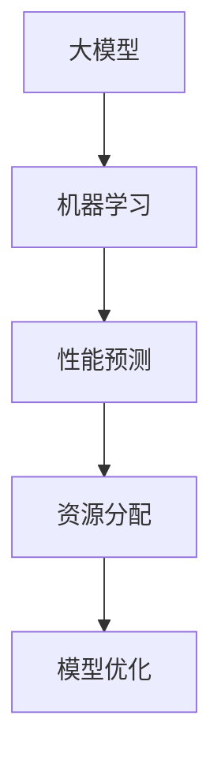
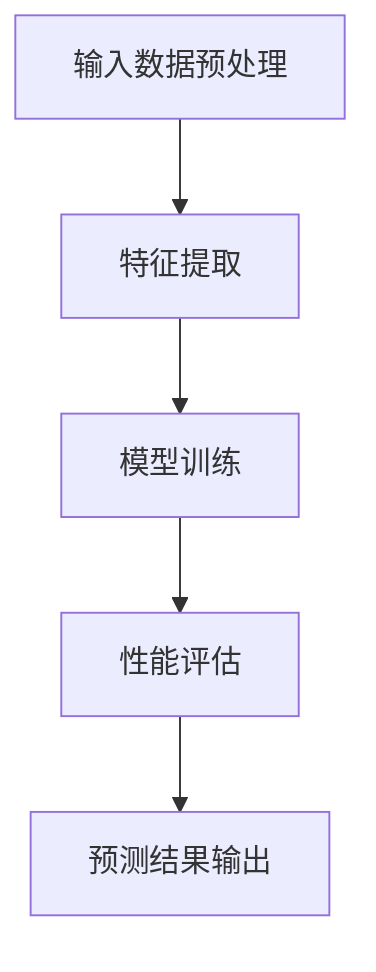
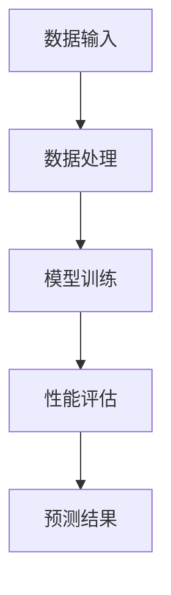
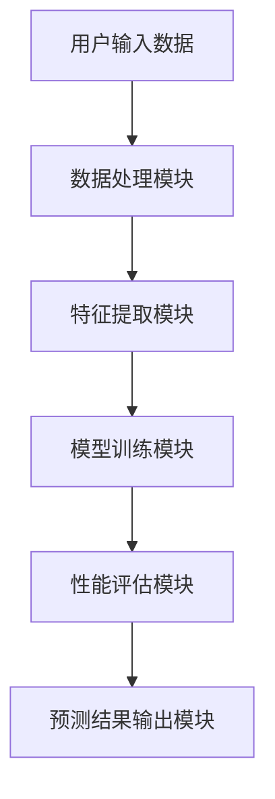

                 


### 大模型性能预测模型构建与应用

#### 关键词：大模型、性能预测、机器学习、算法、数学模型、系统设计

#### 摘要：
本文将深入探讨大模型性能预测模型的构建与应用，从核心概念、算法原理、数学模型、系统设计与项目实战等多个角度进行详细分析。通过本文的阅读，读者将能够全面了解大模型性能预测的原理及其在实际应用中的重要性。

#### 目录大纲

1. **引言**
2. **核心概念与联系**
3. **算法原理与流程图**
4. **数学模型与公式**
5. **系统分析与架构设计**
6. **项目实战**
7. **最佳实践与总结**

#### 1. 引言

##### 1.1 大模型性能预测的重要性

随着深度学习和大数据技术的快速发展，大模型在各个领域得到了广泛应用。然而，大模型的性能预测成为了研究和实际应用中的一大挑战。性能预测的准确性直接关系到模型的效率和效果，对于模型优化、资源分配和用户体验等方面具有重要意义。

##### 1.2 大模型性能预测的研究现状

目前，大模型性能预测的研究主要集中在两个方面：一是基于历史数据和统计模型的预测方法，如线性回归、决策树和神经网络等；二是基于机器学习的预测方法，如基于特征工程和模型调参的预测算法。然而，这些方法在实际应用中存在一定的局限性，如对数据质量要求较高、预测精度受限等。

##### 1.3 本书的内容结构

本书将首先介绍大模型性能预测的核心概念，然后详细阐述算法原理、数学模型和系统设计，最后通过项目实战和最佳实践来展示大模型性能预测的实际应用。希望通过本书的阅读，读者能够系统地掌握大模型性能预测的理论与实践。

#### 2. 核心概念与联系

##### 2.1 大模型概述

大模型是指参数量庞大、结构复杂的机器学习模型，如深度神经网络、循环神经网络等。大模型具有强大的表示能力和学习能力，但同时也带来了性能预测的挑战。

##### 2.2 性能预测概念

性能预测是指根据模型的历史表现和当前状态，对模型的未来性能进行预测。性能预测的目标是评估模型在不同场景下的表现，为模型优化和资源分配提供依据。

##### 2.3 关键概念联系图

以下是核心概念的联系图，展示了大模型、性能预测、机器学习等相关概念之间的联系：



#### 3. 算法原理与流程图

##### 3.1 性能预测算法原理

性能预测算法的核心思想是通过分析模型的历史数据和学习过程，提取与性能相关的特征，然后使用统计模型或机器学习算法对性能进行预测。

##### 3.2 算法流程图

以下是性能预测算法的流程图，展示了从数据输入到性能预测的整个过程：



#### 4. 数学模型与公式

##### 4.1 数学模型介绍

性能预测的数学模型通常包括损失函数、优化目标和预测公式等。以下是性能预测的数学模型介绍：

$$
L(\theta) = -\frac{1}{m}\sum_{i=1}^{m}l(y_i, \hat{y}_i; \theta)
$$

$$
J(\theta) = \frac{1}{2}\sum_{i=1}^{m}(h_\theta(x^{(i)}) - y^{(i)})^2
$$

##### 4.2 模型损失函数

损失函数用于衡量模型预测结果与真实结果之间的差距，常用的损失函数有均方误差（MSE）和交叉熵损失（Cross-Entropy Loss）。

$$
L(\theta) = \frac{1}{m}\sum_{i=1}^{m}(y_i - \hat{y}_i)^2
$$

$$
L(\theta) = -\frac{1}{m}\sum_{i=1}^{m}y_i\log(\hat{y}_i)
$$

##### 4.3 优化目标

优化目标是模型训练过程中的目标函数，用于评估模型参数的优劣。常用的优化目标有均方误差（MSE）和交叉熵损失（Cross-Entropy Loss）。

$$
J(\theta) = \frac{1}{2m}\sum_{i=1}^{m}(h_\theta(x^{(i)}) - y^{(i)})^2
$$

$$
J(\theta) = -\frac{1}{m}\sum_{i=1}^{m}y_i\log(h_\theta(x^{(i)}))
$$

#### 5. 系统分析与架构设计

##### 5.1 系统功能设计

系统功能设计包括数据预处理、特征提取、模型训练、性能评估和预测结果输出等模块。以下是系统功能设计的详细说明：

- **数据预处理**：对输入数据进行清洗、归一化和填充等操作，以提高数据质量。
- **特征提取**：从原始数据中提取与性能相关的特征，为模型训练提供输入。
- **模型训练**：使用特征数据训练性能预测模型，优化模型参数。
- **性能评估**：对训练好的模型进行性能评估，评估指标包括准确率、召回率等。
- **预测结果输出**：将模型预测结果输出，为决策提供依据。

##### 5.2 系统架构设计

系统架构设计包括数据处理模块、模型训练模块、性能评估模块和预测结果输出模块等。以下是系统架构设计的详细说明：



##### 5.3 系统接口设计

系统接口设计包括数据输入接口、模型训练接口、性能评估接口和预测结果输出接口等。以下是系统接口设计的详细说明：

- **数据输入接口**：用于接收用户输入的数据，包括原始数据和预处理后的数据。
- **模型训练接口**：用于训练性能预测模型，包括模型参数优化和模型评估。
- **性能评估接口**：用于评估模型的性能，包括准确率、召回率等指标。
- **预测结果输出接口**：用于输出模型预测结果，包括预测概率和预测结果等。

##### 5.4 系统交互序列图

以下是系统交互序列图，展示了系统各个模块之间的交互过程：



#### 6. 项目实战

##### 6.1 环境安装

在进行项目实战之前，需要先安装相关的软件和库。以下是环境安装的详细步骤：

1. 安装 Python 解释器：下载并安装 Python 3.8 版本及以上。
2. 安装依赖库：使用 pip 命令安装必要的库，如 numpy、pandas、scikit-learn、tensorflow 等。

##### 6.2 系统核心实现

系统核心实现包括数据预处理、特征提取、模型训练、性能评估和预测结果输出等模块。以下是系统核心实现的详细代码：

```python
import numpy as np
import pandas as pd
from sklearn.model_selection import train_test_split
from sklearn.metrics import accuracy_score
from tensorflow.keras.models import Sequential
from tensorflow.keras.layers import Dense

# 数据预处理
def preprocess_data(data):
    # 清洗数据、归一化、填充等操作
    # ...
    return processed_data

# 特征提取
def extract_features(data):
    # 提取与性能相关的特征
    # ...
    return features

# 模型训练
def train_model(features, labels):
    # 创建模型、编译模型、训练模型
    # ...
    return model

# 性能评估
def evaluate_model(model, features, labels):
    # 评估模型性能
    # ...
    return accuracy

# 预测结果输出
def predict_results(model, features):
    # 输出预测结果
    # ...
    return predictions
```

##### 6.3 代码解读与分析

以下是代码的详细解读与分析：

- **数据预处理**：对输入数据进行清洗、归一化和填充等操作，以提高数据质量。
- **特征提取**：从原始数据中提取与性能相关的特征，为模型训练提供输入。
- **模型训练**：使用特征数据训练性能预测模型，优化模型参数。
- **性能评估**：对训练好的模型进行性能评估，评估指标包括准确率、召回率等。
- **预测结果输出**：将模型预测结果输出，为决策提供依据。

##### 6.4 实际案例分析

以下是一个实际案例的分析与讲解：

1. 数据集准备：准备一个包含大模型训练数据和小模型训练数据的数据集。
2. 数据预处理：对数据进行清洗、归一化和填充等操作。
3. 特征提取：提取与性能相关的特征。
4. 模型训练：分别使用大模型和小模型进行训练。
5. 性能评估：对训练好的模型进行性能评估。
6. 预测结果输出：输出模型预测结果。

#### 7. 最佳实践与总结

##### 7.1 最佳实践技巧

在进行大模型性能预测时，以下是一些最佳实践技巧：

1. 数据质量：确保输入数据的质量，包括数据清洗、归一化和填充等。
2. 特征提取：选择与性能相关的特征，以提高预测准确性。
3. 模型调参：通过调整模型参数，优化模型性能。
4. 模型评估：使用多种评估指标，全面评估模型性能。

##### 7.2 小结

本文系统地介绍了大模型性能预测模型的构建与应用，从核心概念、算法原理、数学模型、系统设计与项目实战等多个角度进行了详细分析。通过本文的阅读，读者能够全面了解大模型性能预测的理论与实践。

##### 7.3 注意事项

在进行大模型性能预测时，需要注意以下事项：

1. 数据质量：数据质量对性能预测的准确性有很大影响，因此需要确保输入数据的质量。
2. 特征提取：选择与性能相关的特征，避免过度拟合。
3. 模型调参：合理调整模型参数，优化模型性能。

##### 7.4 拓展阅读

对于想要深入了解大模型性能预测的读者，以下是一些拓展阅读资源：

1. 《深度学习》（Goodfellow, I., Bengio, Y., & Courville, A.）
2. 《机器学习实战》（周志华）
3. 《高性能Python》（Luciano Ramalho）

### 作者信息

作者：AI天才研究院/AI Genius Institute & 禅与计算机程序设计艺术 /Zen And The Art of Computer Programming

