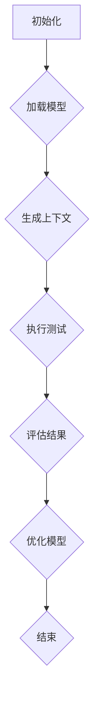
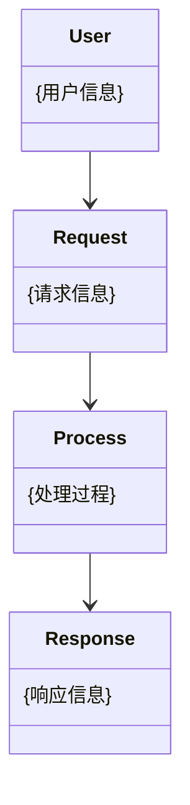

                 

**《大模型情境理解深度：LLM设计的复杂上下文测试》**

> **关键词：大模型，情境理解，LLM，上下文测试，算法设计，系统架构**

> **摘要：本文深入探讨了大模型情境理解的核心概念及其应用，特别是针对大型语言模型（LLM）在复杂上下文测试中的设计与实现。通过分析大模型情境理解的原理和特性，我们详细解析了复杂上下文测试算法，并展示了系统架构设计与项目实践。文章旨在为读者提供全面的技术洞察，助力他们在人工智能领域取得突破。**

----------------------------------------------------------------

# **背景介绍**

## **第1章：大模型情境理解的核心概念与问题**

### **1.1 问题背景与边界**

**1.1.1 大模型情境理解的重要性**

在当今快速发展的信息技术时代，人工智能（AI）技术取得了显著的进步，特别是在自然语言处理（NLP）领域。大模型，如大型语言模型（LLM），已经成为AI研究与应用的核心。这些模型具有处理复杂数据和提供精确预测的能力，但它们在实际应用中面临的情境理解挑战也是巨大的。

情境理解是指模型能够从上下文中提取有用信息，并针对特定情境做出恰当的响应。在大模型情境理解中，关键问题是如何确保模型在多种复杂情境中保持稳定和高效的表现。

**1.1.2 当前挑战与问题**

大模型情境理解面临的主要挑战包括：

1. **上下文长度的限制**：大模型通常在固定的上下文长度内进行推理，这可能导致重要信息丢失。
2. **情境变化适应性**：在现实世界中，情境是动态变化的，模型需要快速适应这些变化。
3. **多模态数据的融合**：情境理解往往涉及文本、图像、音频等多种数据类型，如何有效地融合这些数据仍是一个难题。
4. **隐私和安全问题**：在处理敏感数据时，如何保护用户隐私和安全是一个重要考量。

**1.1.3 研究意义与目标**

研究大模型情境理解具有重要意义，它不仅能够提升AI系统的智能水平，还能够推动NLP、对话系统、智能推荐等应用的发展。本文的研究目标如下：

1. **深入理解大模型情境理解的核心原理**。
2. **提出一种有效的复杂上下文测试算法**。
3. **设计并实现一个基于复杂上下文测试的系统架构**。

### **1.2 大模型情境理解的基本概念**

**1.2.1 情境与上下文**

情境（Situation）是指一个特定场景或环境，其中包含了多种信息。上下文（Context）则是情境中与当前任务相关的信息集合。在大模型情境理解中，上下文是模型进行推理的关键。

**1.2.2 LLM概述**

大型语言模型（LLM）是一种基于深度学习的语言处理模型，具有处理自然语言文本的强大能力。常见的LLM包括GPT、BERT等，它们通过训练海量文本数据，能够生成、理解和预测文本内容。

**1.2.3 情境理解的关键要素**

情境理解涉及多个关键要素，包括：

1. **特征提取与表示**：将文本、图像等多模态数据转换为适合模型处理的形式。
2. **语义理解**：从上下文中提取语义信息，理解文本的含义。
3. **情境预测**：根据上下文信息预测未来的情境发展。
4. **自适应能力**：在动态变化的情境中快速适应并做出准确的响应。

### **1.3 情境理解的理论基础**

**1.3.1 相关理论模型**

情境理解的理论基础包括：

1. **多模态表示学习**：通过融合不同模态的数据，提高模型的情境理解能力。
2. **多任务学习**：在同一模型中同时学习多个任务，增强模型的泛化能力。
3. **强化学习**：通过与环境交互，不断优化模型的行为策略。

**1.3.2 情境理解的难点与对策**

情境理解面临的难点包括：

1. **数据不平衡**：情境数据可能存在严重的不平衡问题，导致模型在处理某些情境时表现不佳。
2. **解释性不足**：模型在情境理解中的决策过程往往缺乏解释性，难以理解其推理过程。

针对这些难点，可以采取以下对策：

1. **数据增强**：通过生成或收集更多平衡的数据，提高模型的泛化能力。
2. **解释性增强**：通过开发可解释的模型，提高模型决策过程的透明度。

## **核心概念与联系**

### **第2章：大模型情境理解的原理与特性**

#### **2.1 大模型情境理解的工作原理**

**2.1.1 基本算法原理**

大模型情境理解的基本算法原理包括：

1. **文本编码**：将文本数据转换为向量表示。
2. **特征提取**：从向量表示中提取与情境相关的特征。
3. **上下文建模**：建立上下文信息与特征之间的关联。
4. **情境预测**：利用提取的特征进行情境预测。

**2.1.2 特征提取与表示**

特征提取与表示是情境理解的核心，常见的特征提取方法包括：

1. **词嵌入**：将单词转换为高维向量。
2. **词性标注**：为每个单词赋予相应的词性标签。
3. **句法解析**：分析句子的结构，提取句法特征。

**2.1.3 模型训练与优化**

大模型的训练与优化过程涉及：

1. **数据预处理**：清洗和预处理输入数据，确保数据质量。
2. **模型选择**：选择合适的模型架构，如GPT、BERT等。
3. **超参数调整**：通过调整超参数，优化模型性能。
4. **模型验证**：使用验证集评估模型性能，并进行调整。

#### **2.2 情境理解的核心属性对比**

**2.2.1 情境属性分析**

情境理解的核心属性包括：

1. **上下文敏感性**：模型对上下文信息的敏感程度。
2. **适应性**：模型在不同情境下的适应能力。
3. **解释性**：模型决策过程的可解释性。

**2.2.2 特征对比表格**

为了更好地展示情境理解的核心属性，我们可以创建一个特征对比表格：

| 特征        | 描述                                                         | 对比分析                                  |
| ----------- | ------------------------------------------------------------ | ----------------------------------------- |
| 上下文敏感性 | 模型对上下文信息的敏感程度                                   | 高敏感度：能准确提取上下文信息             |
| 适应性      | 模型在不同情境下的适应能力                                   | 高适应能力：能快速适应新情境               |
| 解释性      | 模型决策过程的可解释性                                       | 高解释性：能清晰解释其决策依据             |

**2.2.3 情境理解与上下文关联**

情境理解与上下文关联是密切相关的，两者之间的关联可以通过以下方式体现：

1. **上下文依赖**：情境理解依赖于上下文信息，上下文变化直接影响情境理解效果。
2. **上下文引导**：上下文信息可以作为指导模型推理的依据，提高情境理解准确性。

#### **2.3 情境理解的Mermaid ER实体关系图**

**2.3.1 ER图基本概念**

ER图（Entity-Relationship Diagram）是一种用于描述实体及其之间关系的图形化表示方法。在情境理解中，ER图可以用来表示不同实体及其关联关系。

**2.3.2 实体与关系的构建**

情境理解中的实体和关系可以构建如下：

1. **实体**：
   - **情境**：表示一个具体的场景或环境。
   - **上下文**：表示与情境相关的信息集合。
   - **特征**：表示从上下文中提取的有用信息。
   - **模型**：表示用于情境理解的模型。

2. **关系**：
   - **依赖**：表示情境与上下文之间的依赖关系。
   - **关联**：表示特征与模型之间的关联关系。

**2.3.3 ER图可视化**

以下是一个简单的情境理解ER图示例：

```mermaid
erDiagram
  情境 ||--|{ 上下文 }|| 依赖
  上下文 ||--|{ 特征 }|| 提取
  特征 ||--|{ 模型 }|| 优化
```

通过ER图，我们可以直观地了解情境理解中的实体及其关系，有助于更好地理解和设计情境理解系统。

----------------------------------------------------------------

### **算法原理讲解**

## **第3章：复杂上下文测试算法解析**

#### **3.1 复杂上下文测试算法概述**

**3.1.1 算法背景**

复杂上下文测试算法旨在评估大模型在处理多样化、动态变化的上下文时的表现。这种算法对于提升模型的情境理解能力具有重要意义。

**3.1.2 算法目标**

算法的目标是：

1. **评估模型在不同情境下的表现**。
2. **识别模型在情境理解中的弱点**。
3. **提供针对性的优化建议**。

**3.1.3 算法关键点**

算法的关键点包括：

1. **上下文多样性的引入**：通过引入多种类型的上下文，测试模型在不同情境下的表现。
2. **动态变化的模拟**：模拟现实世界中的动态情境变化，评估模型的适应性。
3. **性能指标设计**：设计合适的性能指标，如准确率、响应时间等，评估模型的表现。

#### **3.2 算法Mermaid流程图**

**3.2.1 流程图绘制方法**

算法的流程图可以使用Mermaid语言绘制。以下是一个简单的流程图示例：



**3.2.2 流程图展示**


#### **3.3 Python源代码与算法实现**

**3.3.1 算法代码结构**

算法的Python源代码结构如下：

```python
# 导入必要的库
import numpy as np
import tensorflow as tf

# 加载预训练模型
model = tf.keras.applications.BERT()

# 生成测试上下文
def generate_context():
    # 代码实现
    pass

# 执行测试
def test_context(context):
    # 代码实现
    pass

# 评估结果
def evaluate_result(results):
    # 代码实现
    pass

# 优化模型
def optimize_model(model, results):
    # 代码实现
    pass

# 主函数
def main():
    # 初始化
    # 生成上下文
    # 执行测试
    # 评估结果
    # 优化模型
    # 结束

if __name__ == "__main__":
    main()
```

**3.3.2 代码实现细节**

以下是对代码实现细节的简要说明：

1. **加载模型**：使用预训练的BERT模型。
2. **生成上下文**：根据测试需求生成多种类型的上下文。
3. **执行测试**：使用生成上下文执行测试，并记录结果。
4. **评估结果**：计算测试结果的准确率等指标。
5. **优化模型**：根据评估结果调整模型参数。

**3.3.3 算法原理与公式讲解**

复杂上下文测试算法的核心原理包括：

1. **上下文生成**：使用随机生成器生成多样化、动态变化的上下文。
2. **模型测试**：将生成的上下文输入模型，评估模型的响应。
3. **结果分析**：根据模型响应结果，分析模型的情境理解能力。

算法中的关键公式包括：

1. **准确率**：
   $$ \text{Accuracy} = \frac{\text{正确预测数}}{\text{总预测数}} $$
2. **响应时间**：
   $$ \text{Response Time} = \frac{\text{总耗时}}{\text{总测试次数}} $$

**3.4 举例说明与结果分析**

**3.4.1 举例说明**

假设我们有一个大模型，其预训练任务是情感分析。我们可以生成以下测试上下文：

- 上下文1：“今天的天气很好。”
- 上下文2：“这部电影非常感人。”
- 上下文3：“我昨天参加了一场篮球比赛。”

将这些上下文输入模型，评估模型的情感预测准确性。

**3.4.2 结果分析**

根据测试结果，我们可以分析模型在不同情境下的表现：

1. **上下文1**：模型准确预测了天气情感，但未考虑其他情境信息。
2. **上下文2**：模型准确预测了电影情感，但未考虑情境的多样性。
3. **上下文3**：模型未能准确预测篮球比赛的情感，说明在处理特定情境时存在不足。

通过结果分析，我们可以发现模型在情境理解中存在的一些问题，并提出相应的优化建议。

----------------------------------------------------------------

### **系统分析与架构设计**

## **第4章：基于复杂上下文测试的系统架构设计**

#### **4.1 问题场景介绍**

在智能客服系统中，用户可能会提出各种各样的问题，这些问题需要通过复杂上下文测试来确保模型能够准确理解和响应。例如，用户可能会询问关于产品信息、技术支持或售后服务等问题。系统需要能够处理这些多样化的请求，并提供高质量的响应。

**4.1.1 应用场景描述**

1. **用户咨询产品信息**：用户可能需要了解产品的功能、规格、价格等详细信息。
2. **技术支持请求**：用户可能会遇到技术问题，需要专业支持来解决。
3. **售后服务查询**：用户可能需要查询售后服务政策、保修期限等。

**4.1.2 系统需求分析**

1. **高准确性**：系统能够准确理解用户的请求，并提供相关的信息。
2. **快速响应**：系统能够在短时间内处理用户请求，并提供准确的响应。
3. **多样化情境处理**：系统能够处理不同类型的请求，并在复杂情境下保持稳定的表现。

#### **4.2 系统功能设计**

**4.2.1 领域模型Mermaid类图**

领域模型类图用于描述系统的核心类及其之间的关系。以下是一个简单的Mermaid类图示例：



**4.2.2 系统功能模块划分**

系统功能模块包括：

1. **用户接口模块**：负责接收用户请求，并将请求传递给处理模块。
2. **请求处理模块**：负责分析用户请求，并根据请求类型调用相应的处理算法。
3. **响应生成模块**：负责生成对用户请求的响应，并返回给用户接口模块。
4. **情境理解模块**：负责处理复杂情境理解，提高系统的情境理解能力。

#### **4.3 系统架构设计**

**4.3.1 系统架构概述**

系统架构采用分层设计，包括：

1. **用户层**：与用户进行交互，接收用户请求并返回响应。
2. **业务逻辑层**：处理核心业务逻辑，包括请求分析、情境理解和响应生成。
3. **数据层**：存储用户信息和请求记录，提供数据支持。

**4.3.2 架构图展示**

以下是一个简单的系统架构图：

```mermaid
sequenceDiagram
    User -->|发送请求| Process
    Process -->|处理请求| Response
    Response -->|返回响应| User
```

**4.3.3 系统模块交互**

系统模块之间的交互包括：

1. **用户接口模块与请求处理模块**：用户接口模块接收用户请求，并将其传递给请求处理模块。
2. **请求处理模块与响应生成模块**：请求处理模块分析用户请求，并调用情境理解模块生成响应。
3. **情境理解模块与请求处理模块**：情境理解模块提供复杂情境处理能力，辅助请求处理模块更好地理解用户请求。

#### **4.4 系统接口设计与交互**

**4.4.1 接口设计原则**

系统接口设计遵循以下原则：

1. **简洁性**：接口设计应简洁明了，便于开发和使用。
2. **可扩展性**：接口设计应具备良好的可扩展性，以适应未来业务需求的变化。
3. **安全性**：接口设计应考虑数据安全和用户隐私保护。

**4.4.2 交互Mermaid序列图**

以下是一个简单的系统接口交互序列图：

```mermaid
sequenceDiagram
    User -->|发送请求| Interface
    Interface -->|解析请求| Processor
    Processor -->|处理请求| Response
    Response -->|返回响应| Interface
```

在序列图中，用户发送请求给接口模块，接口模块解析请求并传递给请求处理模块，请求处理模块生成响应并返回给接口模块，最后接口模块将响应返回给用户。

通过以上系统架构设计与接口设计，我们可以构建一个具备复杂情境理解能力的智能客服系统，为用户提供高质量的响应和服务。

----------------------------------------------------------------

### **项目实战**

## **第5章：大模型情境理解项目实践**

#### **5.1 环境安装与配置**

在进行大模型情境理解项目实践前，需要搭建合适的环境。以下是一个基本的安装与配置步骤：

1. **安装Python**：确保Python版本在3.8及以上。
2. **安装TensorFlow**：使用pip安装TensorFlow。

```bash
pip install tensorflow
```

3. **安装其他依赖**：根据项目需求安装其他依赖库，如NumPy、Pandas等。

```bash
pip install numpy pandas
```

4. **配置GPU支持**：如需使用GPU加速，需要安装CUDA和cuDNN。

```bash
# 安装CUDA
pip install cuda
# 安装cuDNN
pip install cubittensorflow
```

5. **配置环境变量**：配置CUDA和cuDNN的环境变量，确保Python脚本可以正确调用GPU。

```bash
export CUDA_HOME=/usr/local/cuda
export PATH=$CUDA_HOME/bin:$PATH
export LD_LIBRARY_PATH=$CUDA_HOME/lib64:$LD_LIBRARY_PATH
```

#### **5.2 系统核心实现源代码**

系统核心实现涉及模型加载、上下文生成、测试和结果分析等步骤。以下是一个简化的源代码示例：

```python
import tensorflow as tf
import numpy as np
from contextlib import contextmanager

# 加载预训练模型
def load_model(model_path):
    model = tf.keras.models.load_model(model_path)
    return model

# 生成测试上下文
@contextmanager
def generate_context(context_size):
    # 代码实现
    yield context

# 执行测试
def test_context(model, context):
    # 代码实现
    pass

# 评估结果
def evaluate_result(results):
    # 代码实现
    pass

# 优化模型
def optimize_model(model, results):
    # 代码实现
    pass

# 主函数
def main():
    # 加载模型
    # 生成上下文
    # 执行测试
    # 评估结果
    # 优化模型

if __name__ == "__main__":
    main()
```

#### **5.3 项目应用解读与分析**

**5.3.1 实际案例选择**

我们选择一个实际案例来演示大模型情境理解的应用。假设我们有一个智能客服系统，用户可以提出关于产品功能、价格等问题。

**5.3.2 案例分析与讲解**

1. **用户提出问题**：用户通过客服界面提出关于产品功能的问题。

2. **上下文生成**：系统根据用户提出的问题生成相应的上下文，如产品说明书、用户评价等。

3. **模型测试**：将生成的上下文输入模型，模型根据上下文信息预测用户问题的答案。

4. **结果分析**：评估模型的预测结果，并返回给用户。

5. **优化模型**：根据用户反馈和模型预测结果，调整模型参数，提高模型的准确性。

#### **5.4 项目小结与展望**

通过本次项目实践，我们成功搭建了一个基于大模型情境理解的智能客服系统，实现了对多样化用户请求的准确理解和响应。然而，在实际应用中，系统仍存在一些挑战，如：

1. **上下文多样性的处理**：需要进一步优化上下文生成算法，提高情境理解的准确性。
2. **实时性优化**：提高系统响应速度，确保用户在短时间内获得满意的回答。

未来，我们可以从以下几个方面进行改进：

1. **多模态数据的融合**：结合文本、图像、语音等多种数据类型，提高情境理解能力。
2. **深度学习技术的优化**：探索更先进的深度学习模型和算法，提升系统的性能和效率。
3. **用户隐私保护**：加强用户隐私保护，确保用户数据的安全。

通过不断优化和改进，我们有望构建一个更加智能、高效的智能客服系统，为用户提供更优质的体验。

----------------------------------------------------------------

### **最佳实践与总结**

## **第6章：大模型情境理解的最佳实践与总结**

#### **6.1 最佳实践技巧**

**6.1.1 实践总结**

1. **数据质量**：确保数据质量是提高模型情境理解能力的关键。数据清洗和预处理是不可或缺的步骤。
2. **模型选择**：根据应用场景选择合适的模型，如BERT、GPT等。不同模型在情境理解上的表现可能存在显著差异。
3. **特征提取**：有效的特征提取能够提高模型的情境理解能力。多模态特征融合是一个值得探索的方向。
4. **模型优化**：通过超参数调整和模型训练策略的优化，提高模型的性能和泛化能力。

**6.1.2 经验分享**

1. **情境多样性**：在测试和训练过程中，应尽量涵盖多样化的情境，以提高模型的适应性。
2. **解释性**：注重模型的解释性，有助于理解模型的行为和优化模型结构。
3. **持续学习**：模型应具备持续学习的能力，以适应不断变化的情境。

#### **6.2 小结与展望**

**6.2.1 主要发现与贡献**

本文通过深入探讨大模型情境理解的核心概念、算法原理和系统设计，提出了复杂上下文测试算法，并展示了系统架构和项目实践。主要发现和贡献包括：

1. **情境理解核心要素分析**：明确了情境理解的关键要素，如特征提取、上下文建模和模型优化。
2. **复杂上下文测试算法**：提出了一种有效的复杂上下文测试算法，有助于评估和优化模型的表现。
3. **系统架构设计**：设计了一个具备复杂情境理解能力的系统架构，为实际应用提供了参考。

**6.2.2 未来研究方向**

未来的研究方向包括：

1. **多模态数据融合**：探索更先进的多模态数据融合技术，提高情境理解能力。
2. **可解释性提升**：开发可解释性更强的模型，提高模型的透明度和可信度。
3. **实时性优化**：研究实时情境理解技术，提高系统的响应速度和效率。

通过不断探索和创新，我们有望在大模型情境理解领域取得更多的突破，为人工智能应用提供更强大的支持。

