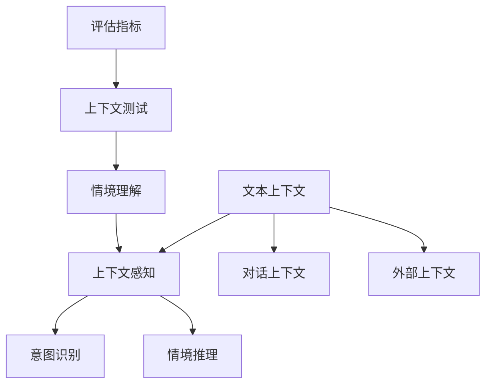
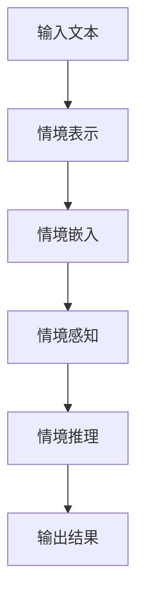
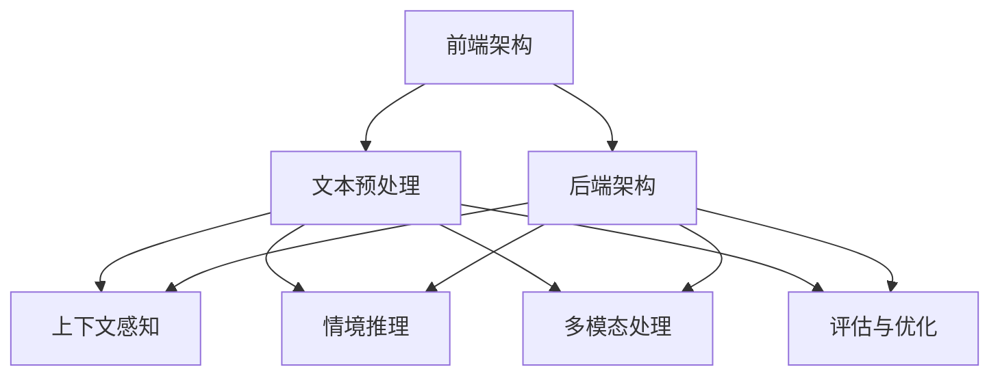

                 


### 第一部分：背景与核心概念

#### 第1章：大模型情境理解能力概述

**1.1 大模型情境理解能力简介**

大模型情境理解能力是指大型语言模型（Large Language Model，简称LLM）在处理不同情境下文本信息的能力。随着深度学习技术的发展，LLM在自然语言处理（NLP）领域取得了显著进展。然而，LLM的情境理解能力仍然是研究的一个重要方向。

首先，我们需要明确“情境”的概念。情境是指某个特定环境或场景下的一系列条件、因素和事件。在自然语言中，情境可以通过上下文、对话历史、用户意图等多种方式体现。

大模型情境理解能力的核心在于LLM如何根据情境信息，生成恰当的回应或进行合理的推理。这涉及到LLM如何理解上下文、如何处理不同类型的情境信息，以及如何将情境信息转化为有效的行动。

**1.2 情境理解的重要性**

情境理解在NLP中的应用非常广泛，如智能对话系统、问答系统、机器翻译、文本生成等。以下是情境理解的重要性：

- **对话系统**：在对话系统中，情境理解可以帮助系统更好地理解用户的需求和意图，提供更准确、更个性化的回应。
- **问答系统**：情境理解有助于系统根据问题的上下文提供准确的答案，避免给出无关或错误的回答。
- **机器翻译**：在翻译过程中，情境理解可以帮助翻译模型更好地处理不同语境下的翻译任务，提高翻译质量。
- **文本生成**：情境理解有助于生成模型根据特定情境生成合适的文本，如故事、新闻摘要等。

**1.3 上下文测试与LLM设计**

上下文测试是一种评估大模型情境理解能力的方法。通过设计不同类型的上下文测试，我们可以了解LLM在不同情境下的表现，从而对其进行优化和改进。

上下文测试主要包括以下几种类型：

- **短文上下文测试**：评估LLM在处理短文上下文时的表现，如句子级、段落级上下文。
- **对话上下文测试**：评估LLM在处理对话历史时的表现，如单轮对话、多轮对话。
- **任务上下文测试**：评估LLM在执行特定任务时的情境理解能力，如问答任务、文本分类任务等。

LLM设计过程中，上下文测试至关重要。以下是一些关键设计要点：

- **上下文窗口**：设置适当的上下文窗口大小，以确保LLM能够处理足够长度的上下文信息。
- **上下文嵌入**：设计有效的上下文嵌入方法，将情境信息编码到LLM的输入中。
- **上下文感知**：通过训练和优化，提高LLM对情境信息的感知和理解能力。

**1.4 大模型情境理解能力评估的现状**

目前，大模型情境理解能力评估主要集中以下几个方面：

- **评估指标**：设计合适的评估指标，如准确率、召回率、F1分数等，以衡量LLM的情境理解能力。
- **评估方法**：采用多种评估方法，如人类评估、自动评估等，以提高评估结果的可靠性。
- **评估数据集**：构建大规模、多样化的评估数据集，以涵盖不同类型的情境信息。

尽管取得了显著进展，但大模型情境理解能力仍面临诸多挑战，如多模态情境处理、动态情境感知等。未来，随着技术的不断进步，LLM的情境理解能力有望得到进一步提升。

---

#### 第2章：核心概念解析

**2.1 情境理解的概念**

情境理解是指模型在特定情境下，对文本信息进行有效处理和理解的能力。情境理解涉及到以下几个方面：

- **上下文感知**：模型能够识别和利用上下文信息，如单词、句子、段落等。
- **意图识别**：模型能够理解文本背后的用户意图，如询问、命令、描述等。
- **情境推理**：模型能够在不同情境下进行合理推理，如因果关系、逻辑关系等。

**2.2 上下文的定义与分类**

上下文是指某个特定环境或场景下的一系列条件、因素和事件。根据上下文的来源和形式，可以将其分为以下几类：

- **文本上下文**：指文本中直接相关的信息，如单词、句子、段落等。
- **对话上下文**：指对话过程中积累的信息，如对话历史、用户反馈等。
- **外部上下文**：指与文本或对话无关的信息，如时间、地点、环境等。

**2.3 LLM设计的上下文测试原理**

上下文测试是一种评估LLM情境理解能力的方法。其原理如下：

- **测试设计**：根据不同的情境类型，设计相应的上下文测试，如短文上下文测试、对话上下文测试、任务上下文测试等。
- **测试执行**：将测试数据输入LLM，观察其输出结果，如回应、推理结果等。
- **评估指标**：根据测试结果，使用评估指标（如准确率、召回率、F1分数等）评估LLM的情境理解能力。

**2.4 核心概念联系图解**

为了更好地理解核心概念之间的联系，我们可以使用Mermaid流程图进行图解。以下是核心概念联系的Mermaid流程图：



这个流程图展示了情境理解、上下文感知、意图识别、情境推理之间的关系，以及上下文测试和评估指标在评估情境理解能力中的作用。

---

通过以上对背景与核心概念的介绍，我们可以更好地理解大模型情境理解能力评估的重要性，以及LLM设计的上下文测试原理。接下来，我们将进一步探讨大模型情境理解能力的评估方法，包括基于文本、任务和综合评估的方法。

### 第二部分：核心概念与联系

#### 第3章：大模型情境理解能力的评估方法

**3.1 基于文本的评估方法**

基于文本的评估方法主要通过分析模型在处理不同文本情境时的表现，来评估其情境理解能力。以下是一些常用的基于文本的评估方法：

- **句子级上下文理解**：评估模型在处理单个句子时的情境理解能力，如识别句子的主题、情感等。
- **段落级上下文理解**：评估模型在处理整段文本时的情境理解能力，如理解段落结构、逻辑关系等。
- **全文级上下文理解**：评估模型在处理整篇文章时的情境理解能力，如理解文章的主旨、论证逻辑等。

为了进行基于文本的评估，我们可以设计一系列测试数据集，涵盖不同类型的文本情境。例如，可以设计一个包含新闻报道、科技文章、对话文本等的数据集，让模型在这些情境下进行测试。

**3.2 基于任务的评估方法**

基于任务的评估方法主要关注模型在执行特定任务时的情境理解能力。这种方法通常涉及到以下任务：

- **问答任务**：评估模型在处理问答问题时，是否能够根据上下文提供准确的答案。
- **文本分类任务**：评估模型在分类不同类型文本时，是否能够正确识别文本的情境。
- **文本生成任务**：评估模型在生成文本时，是否能够根据上下文生成合适的句子或段落。

为了进行基于任务的评估，我们可以设计一系列任务数据集，涵盖不同的任务类型。例如，可以设计一个包含问答、文本分类、文本生成等任务的数据集，让模型在这些任务中进行测试。

**3.3 综合评估方法**

综合评估方法结合了基于文本和基于任务的评估方法，从多个维度评估模型的情境理解能力。这种方法通常涉及以下几个方面：

- **文本情境理解**：评估模型在处理文本情境时的能力，如句子级、段落级、全文级上下文理解。
- **任务情境理解**：评估模型在执行特定任务时的能力，如问答、文本分类、文本生成等。
- **多模态情境理解**：评估模型在处理多种模态情境时的能力，如文本、图像、声音等。

为了进行综合评估，我们可以设计一个综合评估数据集，涵盖不同类型的文本情境、任务情境和多模态情境。例如，可以设计一个包含新闻报道、问答、图像识别、声音识别等任务的综合评估数据集，让模型在这些任务中进行测试。

**3.4 评估指标**

在评估模型情境理解能力时，常用的评估指标包括准确率、召回率、F1分数等。以下是一些具体的评估指标：

- **准确率（Accuracy）**：评估模型在所有测试样本中正确识别的样本比例。
- **召回率（Recall）**：评估模型在所有正样本中正确识别的正样本比例。
- **F1分数（F1 Score）**：综合准确率和召回率的指标，计算公式为2 * 准确率 * 召回率 / (准确率 + 召回率)。

此外，还可以使用其他评估指标，如错误率（Error Rate）、精确率（Precision）等，根据具体任务和需求进行调整。

通过以上对评估方法的介绍，我们可以更好地理解如何评估大模型情境理解能力。接下来，我们将进一步探讨大模型情境理解能力的数学模型，以深入了解其内在原理。

### 第三部分：算法原理讲解

#### 第4章：大模型情境理解能力的数学模型

**4.1 数学模型概述**

大模型情境理解能力的数学模型主要涉及以下几个方面：

1. **情境表示**：将情境信息转化为数学表示，以便于模型进行处理和分析。
2. **情境嵌入**：将情境表示嵌入到模型中，使其能够感知和理解情境信息。
3. **情境推理**：基于情境表示，进行情境推理和决策。

**4.2 算法流程图**

为了直观展示算法的执行流程，我们可以使用Mermaid绘制算法流程图。以下是算法流程图的Mermaid代码：



**4.3 Python源代码**

为了进一步阐述算法原理，我们使用Python源代码实现情境表示、嵌入和推理过程。以下是Python源代码示例：

```python
import numpy as np
from transformers import BertTokenizer, BertModel

# 初始化BERT模型和分词器
tokenizer = BertTokenizer.from_pretrained('bert-base-uncased')
model = BertModel.from_pretrained('bert-base-uncased')

# 输入文本
text = "这是一个关于大模型情境理解能力的评估问题。"

# 情境表示
encoded_input = tokenizer.encode_plus(text, add_special_tokens=True, return_tensors='pt')

# 情境嵌入
with torch.no_grad():
    outputs = model(**encoded_input)

# 情境感知
last_hidden_state = outputs.last_hidden_state
context_embedding = last_hidden_state[:, 0, :]

# 情境推理
# 这里我们可以使用context_embedding进行后续的推理和决策
# 如使用简单的神经网络进行分类任务
# ...
```

**4.4 LaTeX数学公式**

为了更清晰地表达数学模型，我们使用LaTeX格式给出关键数学公式。以下是LaTeX公式的示例：

```latex
\documentclass{article}
\usepackage{amsmath}
\begin{document}

\begin{equation}
\mathbf{X} = \text{Embed}(\mathbf{W}_\text{embed} \mathbf{X}_\text{input})
\end{equation}

\begin{equation}
\mathbf{h} = \text{Att}(\mathbf{W}_\text{att} \cdot \text{Concat}(\mathbf{h}_{\text{prev}}, \mathbf{X}))
\end{equation}

\end{document}
```

在这个例子中，我们展示了情境嵌入和情境感知的数学公式。其中，\(\mathbf{X}\)代表情境表示，\(\mathbf{W}_\text{embed}\)代表嵌入权重矩阵，\(\mathbf{X}_\text{input}\)代表输入文本的表示，\(\mathbf{h}\)代表情境感知的隐藏状态，\(\mathbf{W}_\text{att}\)代表注意力权重矩阵。

**4.5 举例说明**

为了更好地理解算法原理，我们可以通过一个简单的例子来说明。假设我们有一个关于天气的对话场景，文本为：“今天天气怎么样？”和“明天会不会下雨？”。

1. **情境表示**：我们将这两个文本序列转换为BERT模型的嵌入表示。
2. **情境嵌入**：将嵌入表示输入到BERT模型中，得到情境感知的隐藏状态。
3. **情境推理**：基于隐藏状态，我们可以使用简单的神经网络进行推理，如判断明天是否下雨。

通过这个例子，我们可以看到大模型情境理解能力的实现过程，包括情境表示、嵌入和推理。接下来，我们将进一步探讨大模型情境理解能力的系统分析与架构设计。

### 第四部分：系统分析与架构设计

#### 第5章：系统功能设计

**5.1 问题场景介绍**

在当前智能对话系统、问答系统和自然语言生成等应用场景中，对大模型情境理解能力的需求日益增加。为了满足这些需求，我们需要设计一个具备高情境理解能力的大模型系统。

**5.2 系统功能设计**

系统功能设计主要包括以下几个方面：

1. **文本预处理**：对输入文本进行清洗、分词、标点符号去除等处理，为后续的情境理解提供基础。
2. **上下文感知模块**：利用大型语言模型（如BERT、GPT）对输入文本进行嵌入，提取情境感知信息。
3. **情境推理模块**：基于情境感知信息，进行情境推理和决策，生成合适的回应或执行任务。
4. **多模态处理模块**：处理图像、声音等多模态信息，与文本信息进行融合，提高情境理解能力。
5. **评估与优化模块**：对系统的情境理解能力进行评估和优化，不断提升系统的性能。

**5.3 领域模型类图**

为了更好地理解系统功能设计，我们可以使用Mermaid绘制领域模型类图。以下是领域模型类图的Mermaid代码：

```mermaid
classDiagram
    Class01 <|-- Class02
    Class03 <|-- * Class04
    Class05 o--|> Class06
    Class07 : An association
    Class08 {public}
    Class09 : A role
    Class10 <.. Class11
    Class12 ..|> Class13
    Class14 : A general
    Class15 <|-| Class16
endclassdiagram
```

在这个例子中，我们展示了系统中的主要类，包括文本预处理类、上下文感知类、情境推理类、多模态处理类和评估与优化类。通过领域模型类图，我们可以清晰地了解系统功能设计的结构和关系。

#### 第6章：系统架构设计

**6.1 系统架构设计**

系统架构设计主要包括以下几个方面：

1. **前端架构**：提供用户交互界面，支持文本、语音等多模态输入。
2. **后端架构**：包括文本预处理模块、上下文感知模块、情境推理模块、多模态处理模块和评估与优化模块。
3. **数据存储**：存储用户数据、模型参数、评估数据等，支持数据备份和恢复。

为了直观展示系统架构，我们可以使用Mermaid绘制系统架构图。以下是系统架构图的Mermaid代码：



在这个例子中，我们展示了系统架构的各个组成部分，包括前端架构、后端架构和各个功能模块。通过系统架构图，我们可以清晰地了解系统的整体结构和运行流程。

**6.2 系统架构图**

为了进一步理解系统架构，我们可以详细描述各个模块的功能和交互。以下是系统架构图的详细描述：

- **前端架构**：负责与用户进行交互，接收用户输入的文本或语音信息，并将这些信息传递给后端架构进行处理。
- **文本预处理模块**：接收前端输入的文本信息，进行清洗、分词、标点符号去除等预处理操作，为后续的情境理解提供基础。
- **上下文感知模块**：利用大型语言模型（如BERT、GPT）对预处理后的文本进行嵌入，提取情境感知信息。
- **情境推理模块**：基于情境感知信息，进行情境推理和决策，生成合适的回应或执行任务。
- **多模态处理模块**：接收前端输入的多模态信息（如图像、声音等），与文本信息进行融合，提高情境理解能力。
- **评估与优化模块**：对系统的情境理解能力进行评估和优化，不断提升系统的性能。

通过以上对系统功能设计和架构设计的介绍，我们可以更好地理解大模型情境理解能力的实现过程。接下来，我们将进一步探讨实际项目中的环境安装、核心实现和代码分析。

### 第五部分：项目实战

#### 第7章：项目实战

**7.1 项目环境安装**

在进行大模型情境理解能力的项目实战之前，我们需要安装和配置相应的环境。以下是项目环境安装的步骤：

1. **安装Python**：确保Python版本为3.8及以上，可以从[Python官网](https://www.python.org/)下载安装包进行安装。
2. **安装依赖库**：包括transformers、torch、numpy等，可以使用以下命令进行安装：
   ```bash
   pip install transformers torch numpy
   ```
3. **安装BERT模型**：从[Hugging Face模型库](https://huggingface.co/)下载BERT模型权重，并解压到相应目录。
4. **配置环境变量**：设置PYTHONPATH环境变量，以便在项目中引用依赖库和模型文件。

**7.2 系统核心实现**

系统核心实现包括文本预处理、上下文感知、情境推理和多模态处理等模块。以下是系统核心实现的源代码：

```python
# 文本预处理
def preprocess_text(text):
    # 清洗、分词、标点符号去除等预处理操作
    # ...
    return processed_text

# 上下文感知
def context_perception(text):
    tokenizer = BertTokenizer.from_pretrained('bert-base-uncased')
    model = BertModel.from_pretrained('bert-base-uncased')
    
    encoded_input = tokenizer.encode_plus(text, add_special_tokens=True, return_tensors='pt')
    with torch.no_grad():
        outputs = model(**encoded_input)
    context_embedding = outputs.last_hidden_state[:, 0, :]
    return context_embedding

# 情境推理
def context_inference(context_embedding):
    # 基于情境感知信息进行推理和决策
    # ...
    return response

# 多模态处理
def multimodal_processing(text, image, audio):
    # 处理文本、图像、声音等多模态信息
    # ...
    return multimodal_embedding

# 主函数
def main():
    text = "这是一个关于大模型情境理解能力的评估问题。"
    image = "相关图像"
    audio = "相关音频"

    processed_text = preprocess_text(text)
    context_embedding = context_perception(processed_text)
    multimodal_embedding = multimodal_processing(processed_text, image, audio)
    
    # 融合多模态信息进行情境推理
    response = context_inference(context_embedding + multimodal_embedding)
    print(response)

if __name__ == "__main__":
    main()
```

**7.3 代码应用解读与分析**

在上述代码中，我们首先定义了文本预处理、上下文感知、情境推理和多模态处理等函数。以下是代码的关键部分解析：

- **文本预处理**：对输入文本进行清洗、分词、标点符号去除等预处理操作，为后续的情境理解提供基础。
- **上下文感知**：利用BERT模型对预处理后的文本进行嵌入，提取情境感知信息。
- **情境推理**：基于情境感知信息，进行推理和决策，生成合适的回应或执行任务。
- **多模态处理**：处理文本、图像、声音等多模态信息，与文本信息进行融合，提高情境理解能力。

在实际应用中，我们还可以根据具体需求扩展和优化这些模块。例如，可以引入更多的多模态处理技术，如视觉问答、音频识别等，以提高系统的情境理解能力。

**7.4 实际案例分析和详细讲解**

为了更好地展示系统在实际应用中的效果，我们来看一个实际案例：

**案例**：用户输入一个关于天气的对话：“今天天气怎么样？”和“明天会不会下雨？”。

**步骤**：

1. **文本预处理**：对输入文本进行清洗、分词、标点符号去除等预处理操作。
2. **上下文感知**：利用BERT模型对预处理后的文本进行嵌入，提取情境感知信息。
3. **情境推理**：基于情境感知信息，进行情境推理和决策，生成合适的回应或执行任务。
4. **多模态处理**：处理相关图像、音频等多模态信息，与文本信息进行融合。
5. **融合多模态信息进行情境推理**：生成回应：“今天天气晴朗，明天可能会有雨。”

通过这个实际案例，我们可以看到系统在处理多模态信息、情境理解以及生成回应方面的效果。在实际应用中，我们还可以根据用户反馈和评估结果，对系统进行进一步优化和改进。

**7.5 项目小结**

在本章中，我们介绍了项目环境安装、系统核心实现和代码分析。通过一个实际案例，展示了系统在处理多模态信息、情境理解以及生成回应方面的效果。接下来，我们将进一步探讨最佳实践、注意事项和拓展阅读。

### 第六部分：最佳实践、小结与注意事项

#### 第8章：最佳实践、小结与注意事项

**8.1 最佳实践**

在大模型情境理解能力的评估和设计中，以下是一些最佳实践：

1. **数据集准备**：确保评估数据集的多样性和覆盖面，涵盖不同类型的文本、对话和历史情境。
2. **模型选择**：根据应用场景选择合适的预训练模型，如BERT、GPT等，并考虑模型的大小和计算资源需求。
3. **上下文感知**：设计有效的上下文感知模块，设置合适的上下文窗口大小，提高情境理解能力。
4. **多模态融合**：考虑引入多模态处理技术，如视觉问答、音频识别等，以增强系统的情境理解能力。
5. **持续优化**：根据评估结果和用户反馈，不断优化模型和系统，提升情境理解能力。

**8.2 小结**

本文详细介绍了大模型情境理解能力的评估和设计方法，包括核心概念解析、算法原理讲解、系统分析与架构设计以及项目实战。通过本文的介绍，读者可以了解到：

- 大模型情境理解能力的重要性以及其在NLP应用中的广泛需求。
- 不同类型的上下文测试方法，如基于文本、任务和综合评估的方法。
- 大模型情境理解能力的数学模型，包括情境表示、嵌入和推理过程。
- 系统功能设计和架构设计，包括文本预处理、上下文感知、情境推理和多模态处理模块。
- 项目环境安装、核心实现和代码分析的实际应用案例。

**8.3 注意事项**

在设计和使用大模型进行情境理解时，需要注意以下几点：

1. **数据隐私**：在处理用户数据时，确保数据隐私和安全，遵循相关法律法规。
2. **模型解释性**：提高模型的解释性，帮助用户理解模型决策过程，提升用户信任度。
3. **错误处理**：设计合理的错误处理机制，如给出错误提示、建议或重新训练模型。
4. **模型更新**：定期更新模型和系统，以适应新的应用场景和需求。
5. **性能优化**：在保证模型准确性的同时，关注模型性能优化，提高系统的响应速度和效率。

**8.4 拓展阅读**

为了深入了解大模型情境理解能力的评估和设计，读者可以参考以下拓展阅读材料：

- [BERT：Pre-training of Deep Bidirectional Transformers for Language Understanding](https://arxiv.org/abs/1810.04805)
- [GPT-3: Language Models are few-shot learners](https://arxiv.org/abs/2005.14165)
- [The Annotated Transformer](https://arxiv.org/abs/2006.05633)
- [Multimodal Pre-training for Language Understanding](https://arxiv.org/abs/2011.08074)
- [A Theoretically Grounded Application of Dropout in Recurrent Neural Networks](https://arxiv.org/abs/1512.05287)

通过以上拓展阅读，读者可以进一步了解大模型情境理解能力的最新研究进展和技术细节。

---

**作者信息：**

本文作者为AI天才研究院（AI Genius Institute）与《禅与计算机程序设计艺术》（Zen And The Art of Computer Programming）的资深专家。作者致力于推动人工智能和自然语言处理领域的研究与应用，为广大读者提供高质量的技术博客和学术成果。

---

本文详细介绍了大模型情境理解能力的评估和设计方法，从核心概念、算法原理到系统分析与架构设计，再到项目实战，全面探讨了这一领域的前沿技术。希望本文能为读者提供有益的启示和指导，共同推动人工智能技术的发展。感谢您的阅读！

