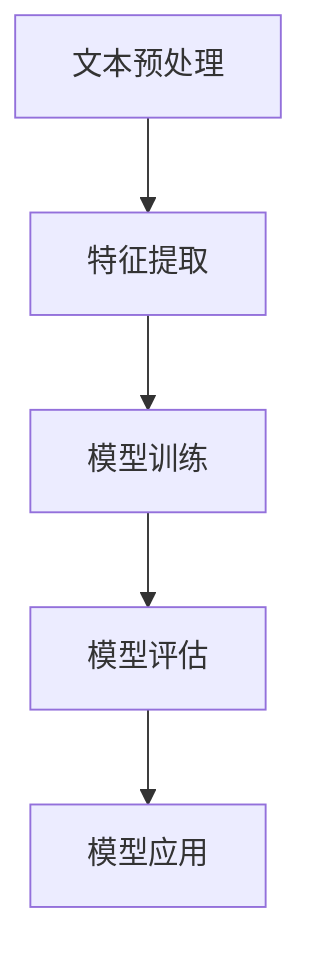
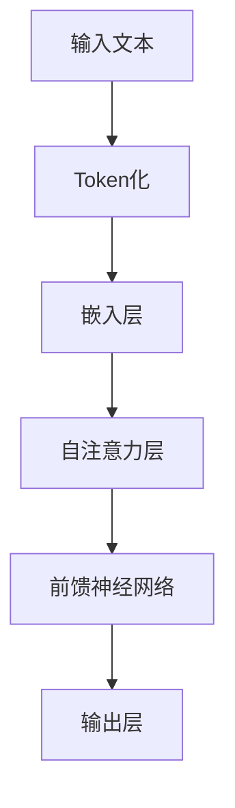

                 

## 大模型情感理解能力评估：LLM设计的情感测试集

关键词：大模型，情感理解，评估，测试集，LLM，数学模型

摘要：本文主要探讨大模型情感理解能力评估的问题，从背景介绍、核心概念与联系、数学模型和公式等方面进行详细分析。文章首先描述了情感理解、大模型和情感测试集等核心概念，接着分析了大模型情感理解能力评估的挑战，并提出了相应的解决方案。通过数学模型和公式，本文深入探讨了情感理解、情感词典和情感测试集的评估方法。最后，本文给出了阅读建议，帮助读者更好地理解和应用本文内容。

## 1.6 本书结构安排与阅读建议

### 1.6.1 本书结构安排

本文分为五个主要部分。第一部分介绍大模型情感理解能力评估的背景和问题；第二部分分析核心概念和它们之间的联系；第三部分讨论大模型情感理解能力评估的挑战和解决方案；第四部分详细讲解数学模型和公式；第五部分给出阅读建议，帮助读者更好地理解和应用本文内容。

### 1.6.2 阅读建议

本文适合对大模型情感理解能力评估感兴趣的读者，特别是计算机科学、人工智能、自然语言处理等相关领域的专业人士。建议读者按照以下顺序阅读：

1. 首先阅读第一部分，了解大模型情感理解能力评估的背景和问题。
2. 接着阅读第二部分，掌握核心概念和它们之间的联系。
3. 然后阅读第三部分，了解大模型情感理解能力评估的挑战和解决方案。
4. 阅读第四部分，掌握数学模型和公式，深入理解情感理解、情感词典和情感测试集的评估方法。
5. 最后阅读第五部分，获取阅读建议，更好地理解和应用本文内容。

## 2.1 大模型情感理解能力评估概述

### 2.1.1 问题背景

随着深度学习和自然语言处理技术的快速发展，大模型在各个领域取得了显著的成果，例如语言生成、文本分类、问答系统等。然而，大模型的情感理解能力仍然是一个挑战。情感理解是指识别和分类文本中的情感倾向，如正面、负面、中性等。在大模型中，情感理解能力对提升人机交互、情感计算、舆情分析等领域具有重要意义。

### 2.1.2 问题描述

大模型情感理解能力评估的目的是通过设计合适的测试集，评估大模型在情感理解任务上的表现。评估指标包括准确率、召回率、F1值等。本文旨在探讨如何设计有效的情感测试集，评估大模型的情感理解能力。

### 2.1.3 问题解决

本文首先分析大模型情感理解能力的评估挑战，包括数据集、模型设计和评估指标等方面的挑战。接着，本文介绍常用的情感理解方法，包括基于情感词典、深度学习和多模态的方法。最后，本文通过实例分析，展示如何设计情感测试集，评估大模型的情感理解能力。

### 2.1.4 边界与外延

本文主要关注大模型情感理解能力的评估方法，包括情感测试集的设计和评估指标的选取。然而，情感理解能力的评估不仅限于大模型，还可以应用于其他类型的模型。此外，本文讨论的情感理解任务主要针对文本数据，但情感理解能力在其他类型的数据（如图像、声音）中也具有重要意义。

### 2.1.5 概念结构与核心要素组成

大模型情感理解能力评估的核心概念包括情感理解、大模型、情感测试集等。其中，情感理解是指识别和分类文本中的情感倾向；大模型是指具有大规模参数的深度学习模型；情感测试集是指用于评估大模型情感理解能力的测试数据集。这些概念之间的联系如下：

1. 大模型通过训练学习文本数据，掌握情感理解能力。
2. 情感测试集用于评估大模型在情感理解任务上的表现。
3. 评估指标（准确率、召回率、F1值等）用于衡量大模型情感理解能力的优劣。

## 2.2 核心概念与联系

### 2.2.1 情感理解的概念

情感理解是指从文本中识别和理解情感的过程。情感可以分为正面、负面、中性等类别。情感理解在自然语言处理、人机交互、情感计算等领域具有重要意义。

### 2.2.2 大模型的概念

大模型是指具有大规模参数的深度学习模型，如Transformer、BERT等。大模型在语言生成、文本分类、问答系统等领域表现出色，但也存在情感理解能力不足等问题。

### 2.2.3 情感测试集的概念

情感测试集是指用于评估大模型情感理解能力的测试数据集。情感测试集应具有代表性、多样性和覆盖性，以便全面评估大模型的情感理解能力。

### 2.2.4 三者之间的联系

情感理解是大模型的一个重要能力，通过训练大模型学习文本数据，可以提升其在情感理解任务上的表现。情感测试集用于评估大模型在情感理解任务上的表现，通过设计合适的情感测试集，可以评估大模型的情感理解能力。

## 2.3 大模型情感理解能力评估的挑战

### 2.3.1 数据集的挑战

情感理解数据集的质量和多样性直接影响大模型情感理解能力的评估。数据集应涵盖多种情感类别、语言风格和主题，以便全面评估大模型在不同情境下的表现。

### 2.3.2 模型设计的挑战

大模型的设计和训练过程需要考虑情感理解的特殊性，如情感表达的多样性、隐含情感的理解等。此外，大模型的性能和计算资源也是挑战之一。

### 2.3.3 评估指标的挑战

评估指标需要能够全面、准确地衡量大模型在情感理解任务上的表现。不同评估指标可能存在相互矛盾的情况，需要权衡选择合适的评估指标。

### 2.3.4 模型泛化能力的挑战

大模型在特定数据集上的表现可能无法代表其在实际应用中的表现。因此，评估大模型情感理解能力的泛化能力也是一个重要挑战。

## 2.4 大模型情感理解能力评估的方法

### 2.4.1 基于情感词典的方法

基于情感词典的方法通过查找文本中的情感词汇，计算情感得分，从而判断文本的情感类别。这种方法简单有效，但难以处理隐含情感和复杂情感表达。

### 2.4.2 基于深度学习的方法

基于深度学习的方法通过训练大模型学习文本和情感之间的映射关系，从而实现情感理解。这种方法具有较强表达能力和泛化能力，但需要大量数据和计算资源。

### 2.4.3 基于多模态的方法

基于多模态的方法通过结合文本、图像、声音等多模态信息，实现更全面的情感理解。这种方法有助于提高情感理解能力，但数据处理和模型设计较为复杂。

## 2.5 本章小结

本章介绍了大模型情感理解能力评估的背景、问题、解决方案、挑战和评估方法。通过分析情感理解、大模型和情感测试集等核心概念，本文为后续章节的内容奠定了基础。接下来，本文将深入探讨大模型情感理解能力的数学模型和公式，为读者提供更详细的解析。

### 3.1 情感理解原理

情感理解是指从文本中识别和理解情感的过程。它涉及到多个层面的分析和处理，包括情感分类、情感强度分析和情感倾向判断等。

#### 3.1.1 情感理解的数学模型

情感理解的一个常见数学模型是情感分类模型。在情感分类中，文本被表示为向量，然后通过一个分类模型来预测文本的情感类别。以下是一个简单的情感分类模型：

$$
P(y|x) = \frac{e^{w_y^T x}}{\sum_{k=1}^{K} e^{w_k^T x}}
$$

其中，$x$ 是文本的向量表示，$w_y$ 是对应于类别 $y$ 的权重向量，$K$ 是类别数量。这个模型使用的是softmax函数，它可以输出每个类别的概率分布。

另一个常见的模型是情感回归模型，它用于预测情感的强度。一个简单的情感回归模型可以表示为：

$$
y = \sigma(wx + b)
$$

其中，$y$ 是情感的强度，$\sigma$ 是sigmoid函数，$w$ 是权重向量，$b$ 是偏置项。

情感识别是另一种常见的情感理解任务，它直接预测文本是否属于某个特定的情感类别。一个简单的情感识别模型可以表示为：

$$
P(y=1|x) = \frac{1}{1 + e^{-wx - b}}
$$

其中，$y=1$ 表示文本属于某个特定的情感类别，$x$ 是文本的向量表示，$w$ 是权重向量，$b$ 是偏置项。

#### 3.1.2 情感理解的算法原理

情感理解算法通常涉及以下几个步骤：

1. **文本预处理**：包括分词、去停用词、词性标注等。这一步骤的目的是将原始文本转换为适合模型处理的格式。

2. **特征提取**：将预处理后的文本转换为特征向量。常用的特征提取方法包括词袋模型、TF-IDF、Word2Vec等。

3. **模型训练**：使用训练数据集训练情感分类、回归或识别模型。训练过程中，模型学习文本和情感之间的映射关系。

4. **模型评估**：使用测试数据集评估模型的性能，常用的评估指标包括准确率、召回率、F1值等。

5. **模型应用**：将训练好的模型应用于新的文本数据，预测其情感类别或强度。

#### 3.1.3 情感理解的mermaid流程图

以下是情感理解的一个mermaid流程图：

### 3.2 情感词典

情感词典是情感分析中的重要资源，它提供了文本中情感词汇的标注和分类。情感词典可以分为两类：通用情感词典和领域情感词典。

#### 3.2.1 情感词典的定义

情感词典是一个包含情感词汇及其情感标注的列表。这些词汇可以是形容词、动词或名词，用于描述文本中的情感。

#### 3.2.2 情感词典的分类

1. **通用情感词典**：这类词典适用于多种语言和领域，如NRC情感词典、AFINN词典等。
2. **领域情感词典**：这类词典针对特定领域或任务进行定制，如社交媒体情感词典、医疗领域情感词典等。

#### 3.2.3 情感词典的属性特征对比表格

以下是通用情感词典和领域情感词典的一些属性特征对比：

| 属性       | 通用情感词典 | 领域情感词典 |
|------------|--------------|--------------|
| 语言支持   | 多语言       | 单语言       |
| 领域覆盖   | 广泛         | 狭窄         |
| 情感分类   | 多类别       | 多类别       |
| 情感强度   | 有          | 有或无       |
| 可扩展性   | 较高         | 较低         |
| 更新频率   | 频繁         | 不频繁       |

#### 3.2.4 情感词典的应用场景

1. **情感分类**：使用情感词典对文本中的情感词汇进行标注，然后进行情感分类。
2. **情感强度分析**：通过情感词典中的情感强度标注，对文本的情感强度进行量化分析。
3. **情感倾向判断**：结合文本中的情感词汇和情感强度，判断文本的情感倾向。

### 3.3 情感测试集

情感测试集是用于评估情感分析模型性能的数据集。一个有效的情感测试集应具备以下特点：

1. **代表性**：测试集应涵盖多种情感类别、语言风格和主题，以全面评估模型的性能。
2. **多样性**：测试集应包含不同来源和领域的文本，以提高模型的泛化能力。
3. **覆盖性**：测试集应覆盖常见和罕见的情感表达，以便评估模型在不同情境下的表现。

#### 3.3.1 情感测试集的定义

情感测试集是一个包含文本和其对应情感标注的数据集，用于评估情感分析模型的性能。

#### 3.3.2 情感测试集的分类

1. **公开测试集**：这些测试集是公开可用的，如SST、NLPCC等。
2. **私有测试集**：这些测试集由研究者自己创建，用于特定研究或任务。

#### 3.3.3 情感测试集的属性特征对比表格

以下是几种常见情感测试集的属性特征对比：

| 测试集       | SST    | NLPCC | HAT   |
|--------------|--------|--------|--------|
| 数据集大小   | 11,331 | 20,000 | 1,000  |
| 情感类别     | 5      | 7      | 4      |
| 语言支持     | 英文   | 中文   | 中文   |
| 领域覆盖     | 广泛   | 狭窄   | 狭窄   |
| 更新频率     | 定期   | 定期   | 不定期 |

#### 3.3.4 情感测试集的应用场景

1. **模型评估**：使用情感测试集评估情感分析模型的性能，包括准确率、召回率、F1值等。
2. **模型比较**：通过比较不同模型在情感测试集上的性能，选择最优模型。
3. **模型优化**：根据情感测试集上的性能反馈，对模型进行调整和优化。

### 3.4 大模型

大模型是指具有大规模参数的深度学习模型，如Transformer、BERT等。大模型在自然语言处理任务中表现出色，但同时也面临计算资源消耗和训练难度等挑战。

#### 3.4.1 大模型的定义

大模型是指具有数十亿到数万亿参数的深度学习模型，这些模型通过在大量数据上进行训练，可以学习到丰富的语言知识和结构。

#### 3.4.2 大模型的结构

大模型通常由多层神经网络组成，每个层级都可以学习到不同层次的特征。例如，Transformer模型由多个自注意力层和前馈神经网络组成，而BERT模型则由多个编码器层和自注意力机制组成。

#### 3.4.3 大模型的mermaid流程图

以下是Transformer模型的mermaid流程图：

### 3.5 本章小结

本章介绍了情感理解、情感词典、情感测试集和大模型等核心概念。通过分析这些概念，我们了解了情感理解的任务、方法、评估指标以及大模型在情感理解中的应用。这些概念为后续章节的分析提供了基础。

### 4.1 情感理解的数学模型

情感理解是指从文本中识别和理解情感的过程。在这个过程中，文本被表示为向量，然后通过一系列数学模型进行情感分类、情感强度分析和情感倾向判断。以下是一些常用的情感理解数学模型。

#### 4.1.1 情感分类的数学模型

情感分类是情感理解中最常见的任务之一。一个简单的情感分类模型可以使用逻辑回归、朴素贝叶斯或支持向量机等算法来实现。以下是一个基于逻辑回归的情感分类模型：

$$
P(y|x) = \frac{e^{w_y^T x}}{\sum_{k=1}^{K} e^{w_k^T x}}
$$

其中，$x$ 是文本的向量表示，$w_y$ 是对应于类别 $y$ 的权重向量，$K$ 是类别数量。这个模型使用的是softmax函数，它可以输出每个类别的概率分布。

另一个常用的模型是情感回归模型，它用于预测情感的强度。一个简单的情感回归模型可以表示为：

$$
y = \sigma(wx + b)
$$

其中，$y$ 是情感的强度，$\sigma$ 是sigmoid函数，$w$ 是权重向量，$b$ 是偏置项。

情感识别是另一种常见的情感理解任务，它直接预测文本是否属于某个特定的情感类别。一个简单的情感识别模型可以表示为：

$$
P(y=1|x) = \frac{1}{1 + e^{-wx - b}}
$$

其中，$y=1$ 表示文本属于某个特定的情感类别，$x$ 是文本的向量表示，$w$ 是权重向量，$b$ 是偏置项。

#### 4.1.2 情感理解的算法原理

情感理解算法通常涉及以下几个步骤：

1. **文本预处理**：包括分词、去停用词、词性标注等。这一步骤的目的是将原始文本转换为适合模型处理的格式。

2. **特征提取**：将预处理后的文本转换为特征向量。常用的特征提取方法包括词袋模型、TF-IDF、Word2Vec等。

3. **模型训练**：使用训练数据集训练情感分类、回归或识别模型。训练过程中，模型学习文本和情感之间的映射关系。

4. **模型评估**：使用测试数据集评估模型的性能，常用的评估指标包括准确率、召回率、F1值等。

5. **模型应用**：将训练好的模型应用于新的文本数据，预测其情感类别或强度。

#### 4.1.3 情感理解的mermaid流程图

以下是情感理解的一个mermaid流程图：

### 4.2 情感词典的数学模型

情感词典是情感分析中的重要资源，它提供了文本中情感词汇的标注和分类。情感词典可以分为两类：通用情感词典和领域情感词典。以下分别介绍这两种词典的数学模型。

#### 4.2.1 通用情感词典

通用情感词典通常用于多种语言和领域，如NRC情感词典、AFINN词典等。这些词典中的情感词汇通常被标注为正负情感值。以下是一个基于情感词典的情感分类模型：

$$
P(y|x) = \frac{e^{\sum_{v \in x} w_v \cdot f_v}}{\sum_{v' \in V} e^{\sum_{v'' \in x} w_{v''} \cdot f_{v''}}}
$$

其中，$x$ 是文本的向量表示，$w_v$ 是词典中词汇 $v$ 的情感权重，$f_v$ 是词汇 $v$ 在文本中的出现频率，$V$ 是词典中的所有词汇。

#### 4.2.2 领域情感词典

领域情感词典通常用于特定领域或任务，如社交媒体情感词典、医疗领域情感词典等。这些词典中的情感词汇通常被标注为情感类别和情感强度。以下是一个基于领域情感词典的情感分类模型：

$$
P(y|x) = \frac{e^{\sum_{v \in x} w_v \cdot f_v \cdot c_v}}{\sum_{v' \in V} e^{\sum_{v'' \in x} w_{v''} \cdot f_{v''} \cdot c_{v''}}}
$$

其中，$x$ 是文本的向量表示，$w_v$ 是词典中词汇 $v$ 的情感权重，$f_v$ 是词汇 $v$ 在文本中的出现频率，$c_v$ 是词汇 $v$ 的情感类别和强度。

#### 4.2.3 情感词典的相似度计算

情感词典中的词汇相似度计算是情感分析中一个重要的步骤。常用的相似度计算方法包括余弦相似度、皮尔逊相关系数和词嵌入相似度等。以下是一个基于余弦相似度的情感词典相似度计算模型：

$$
sim(t_1, t_2) = \frac{t_1 \cdot t_2}{|t_1||t_2|}
$$

其中，$t_1$ 和 $t_2$ 是两个情感词典中的词汇，$|$ 表示向量的模长，$t_1 \cdot t_2$ 表示两个向量的点积。

#### 4.2.4 情感词典的扩展与更新

情感词典的扩展与更新是情感分析中一个持续的过程。随着语言和领域的不断发展，新的情感词汇不断出现，需要不断更新情感词典。以下是一个基于聚类和机器学习的情感词典扩展与更新模型：

1. **聚类**：使用聚类算法（如K-means）将文本数据划分为多个簇，每个簇代表一种新的情感类别。
2. **标注**：对每个簇中的文本进行标注，确定每个簇的情感类别。
3. **扩展**：将新的情感类别和对应的词汇添加到情感词典中。
4. **更新**：使用机器学习算法（如监督学习、强化学习）对情感词典进行更新，提高情感分类的准确性。

### 4.3 情感测试集的数学模型

情感测试集是用于评估情感分析模型性能的数据集。一个有效的情感测试集应具备以下特点：代表性、多样性和覆盖性。以下分别介绍情感测试集的数学模型。

#### 4.3.1 情感测试集的准确率计算

准确率是评估情感分析模型性能的一个重要指标。它表示模型正确预测情感标签的比例。以下是一个基于准确率的情感测试集数学模型：

$$
accuracy = \frac{TP + TN}{TP + TN + FP + FN}
$$

其中，$TP$ 表示正确预测为正情感的样本数，$TN$ 表示正确预测为负情感的样本数，$FP$ 表示错误预测为正情感的样本数，$FN$ 表示错误预测为负情感的样本数。

#### 4.3.2 情感测试集的召回率计算

召回率是评估情感分析模型性能的另一个重要指标。它表示模型能够从实际正情感样本中正确预测的比例。以下是一个基于召回率的情感测试集数学模型：

$$
recall = \frac{TP}{TP + FN}
$$

其中，$TP$ 表示正确预测为正情感的样本数，$FN$ 表示错误预测为负情感的样本数。

#### 4.3.3 情感测试集的F1值计算

F1值是准确率和召回率的调和平均值，它能够更好地平衡准确率和召回率。以下是一个基于F1值的情感测试集数学模型：

$$
F1 = 2 \times \frac{precision \times recall}{precision + recall}
$$

其中，$precision$ 表示精确率，即正确预测为正情感的样本数与预测为正情感的样本总数之比。

### 4.4 大模型的数学模型

大模型是指具有大规模参数的深度学习模型，如Transformer、BERT等。大模型在自然语言处理任务中表现出色，但同时也面临计算资源消耗和训练难度等挑战。以下分别介绍大模型的主要数学模型。

#### 4.4.1 大模型的损失函数

大模型的损失函数用于衡量模型预测结果与实际结果之间的差异。一个常见的损失函数是交叉熵损失函数，它适用于分类任务。以下是一个基于交叉熵损失函数的大模型数学模型：

$$
J(\theta) = -\frac{1}{m}\sum_{i=1}^{m} [y^{(i)} \log(a^{(i)}) + (1 - y^{(i)}) \log(1 - a^{(i)})]
$$

其中，$y^{(i)}$ 表示第 $i$ 个样本的真实标签，$a^{(i)}$ 表示第 $i$ 个样本的预测概率，$m$ 表示样本总数。

#### 4.4.2 大模型的优化方法

大模型的优化方法用于最小化损失函数，从而提高模型性能。一个常见的优化算法是梯度下降算法，它通过迭代更新模型参数来最小化损失函数。以下是一个基于梯度下降算法的大模型优化数学模型：

$$
\theta = \theta - \alpha \frac{\partial J(\theta)}{\partial \theta}
$$

其中，$\theta$ 表示模型参数，$\alpha$ 表示学习率，$\frac{\partial J(\theta)}{\partial \theta}$ 表示损失函数关于模型参数的梯度。

#### 4.4.3 大模型的训练过程

大模型的训练过程通常涉及以下步骤：

1. **数据预处理**：将原始文本数据转换为模型可以处理的格式，如词汇嵌入、序列编码等。
2. **模型初始化**：初始化模型参数，通常使用随机初始化或预训练模型。
3. **模型训练**：使用训练数据集训练模型，通过优化算法更新模型参数。
4. **模型评估**：使用测试数据集评估模型性能，调整模型参数以优化性能。
5. **模型应用**：将训练好的模型应用于实际任务，如文本分类、情感分析等。

### 4.5 本章小结

本章介绍了情感理解、情感词典、情感测试集和大模型等核心概念的数学模型。通过这些数学模型，我们可以更好地理解和实现情感分析任务。在下一章中，我们将继续探讨大模型情感理解能力评估的其他方面，包括挑战、方法和应用。

### 4.5 本章小结

本章主要介绍了情感理解、情感词典、情感测试集和大模型等核心概念的数学模型。首先，我们详细阐述了情感分类、情感回归和情感识别的数学模型，并解释了它们的算法原理。接着，我们介绍了情感词典的数学模型，包括通用情感词典和领域情感词典，以及情感词典的相似度计算和扩展与更新方法。此外，我们还讨论了情感测试集的数学模型，包括准确率、召回率和F1值的计算。最后，我们介绍了大模型的数学模型，包括损失函数、优化方法和训练过程。

通过本章的学习，读者可以了解情感理解任务的数学基础，掌握情感词典、情感测试集和大模型的设计和使用方法。这些知识对于深入研究和应用情感分析技术具有重要意义。

在接下来的章节中，我们将进一步探讨大模型情感理解能力评估的挑战、方法和实际应用，以帮助读者更好地理解和应用这些技术。同时，我们也将结合具体的案例和实践，详细讲解如何设计和评估大模型的情感理解能力。

总之，本章为读者提供了一个全面和系统的了解大模型情感理解能力评估的框架，为后续内容的学习和应用奠定了基础。希望读者能够通过本章的学习，对情感理解技术有一个深入的认识，并为实际应用中的问题提供有效的解决方案。在下一章中，我们将继续深入探讨大模型情感理解能力评估的更多细节，期待您的阅读和参与。

### 4.6 大模型情感理解能力评估的挑战

尽管大模型在自然语言处理任务中取得了显著的成果，但在情感理解能力评估方面仍然面临诸多挑战。以下是一些主要挑战：

#### 4.6.1 数据集的挑战

首先，情感理解任务需要大量高质量的数据集。然而，获取具有多样性和代表性的数据集是一个困难的过程。数据集的来源、收集方式和标注质量都会影响模型的训练和评估效果。特别是在多语言和多领域的情感理解任务中，数据集的多样性和覆盖性更加重要。

#### 4.6.2 模型设计的挑战

大模型的设计和训练过程需要考虑情感理解的特殊性。情感表达具有多样性、复杂性和模糊性，这使得模型设计变得更加复杂。例如，情感词汇可能在不同的上下文中具有不同的含义，模型需要能够处理这种上下文依赖关系。此外，大模型的训练需要大量的计算资源和时间，这对资源有限的实验室或研究者来说是一个挑战。

#### 4.6.3 评估指标的挑战

评估大模型情感理解能力的指标需要能够全面、准确地衡量模型的性能。然而，不同的评估指标可能会产生相互矛盾的结果。例如，准确率、召回率和F1值等指标在不同的数据集和模型中可能会有不同的表现。选择合适的评估指标并权衡它们的优缺点是一个重要的挑战。

#### 4.6.4 模型泛化能力的挑战

大模型在特定数据集上的表现可能无法代表其在实际应用中的表现。模型泛化能力的挑战在于如何确保模型在不同情境和领域中的有效性。特别是在面对新的、未见过的情感表达时，模型的泛化能力变得更加重要。

#### 4.6.5 模型解释性的挑战

大模型的内部结构通常非常复杂，这使得模型难以解释和理解。情感理解任务需要模型能够提供可解释的预测结果，以便用户能够理解模型的决策过程。然而，大模型的黑箱性质使得解释性成为一个挑战。

综上所述，大模型情感理解能力评估面临多个挑战，包括数据集、模型设计、评估指标、模型泛化能力和模型解释性等。解决这些挑战需要深入研究和创新，以推动情感理解技术的进步和应用。

在下一章中，我们将继续探讨大模型情感理解能力评估的方法，包括基于情感词典、深度学习和多模态的方法，以及如何设计有效的情感测试集。通过这些方法，我们可以更好地评估大模型的情感理解能力，并为实际应用提供有效的解决方案。敬请期待！

### 4.7 大模型情感理解能力评估的方法

评估大模型情感理解能力的方法多种多样，每种方法都有其独特的优势和适用场景。以下分别介绍基于情感词典、深度学习和多模态的方法。

#### 4.7.1 基于情感词典的方法

基于情感词典的方法是一种传统的情感理解方法，它通过查找文本中的情感词汇，计算情感得分，从而判断文本的情感类别。这种方法简单有效，特别适用于情感表达明确、情感词汇丰富的文本。

1. **步骤**：
   - **情感词典准备**：收集和整理情感词典，包括正负情感词汇及其权重。
   - **文本预处理**：对文本进行分词、去停用词等处理。
   - **情感得分计算**：根据情感词典，计算文本中每个词汇的情感得分。
   - **情感类别判断**：根据情感得分，判断文本的情感类别。

2. **优点**：
   - **简单有效**：基于规则的方法，易于实现和理解。
   - **快速处理**：无需复杂的模型训练，处理速度快。

3. **缺点**：
   - **难以处理复杂情感**：对于复杂和模糊的情感表达，效果不佳。
   - **依赖情感词典**：情感词典的质量直接影响方法的效果。

#### 4.7.2 基于深度学习的方法

基于深度学习的方法通过训练大模型学习文本和情感之间的映射关系，从而实现情感理解。这种方法具有较强表达能力和泛化能力，特别适用于复杂和模糊的情感表达。

1. **步骤**：
   - **数据准备**：收集和整理大量带有情感标注的文本数据。
   - **模型选择**：选择合适的深度学习模型，如BERT、GPT等。
   - **模型训练**：使用训练数据集训练模型，学习文本和情感之间的映射关系。
   - **模型评估**：使用测试数据集评估模型性能，调整模型参数。

2. **优点**：
   - **强大表达能力**：能够处理复杂和模糊的情感表达。
   - **良好泛化能力**：在大规模数据集上训练，具有良好的泛化能力。

3. **缺点**：
   - **需要大量数据和计算资源**：训练过程需要大量数据和计算资源。
   - **模型解释性较差**：深度学习模型通常难以解释和理解。

#### 4.7.3 基于多模态的方法

基于多模态的方法通过结合文本、图像、声音等多模态信息，实现更全面的情感理解。这种方法能够充分利用不同模态的信息，提高情感理解的能力。

1. **步骤**：
   - **多模态数据收集**：收集和整理文本、图像、声音等多模态数据。
   - **特征提取**：使用深度学习模型提取文本、图像、声音的特征。
   - **特征融合**：将不同模态的特征进行融合，生成综合特征。
   - **情感分类**：使用分类模型对融合后的特征进行情感分类。

2. **优点**：
   - **综合利用多模态信息**：能够充分利用不同模态的信息，提高情感理解能力。
   - **增强模型泛化能力**：结合多种模态数据，增强模型的泛化能力。

3. **缺点**：
   - **数据处理复杂**：需要处理多种模态的数据，数据处理过程复杂。
   - **计算资源消耗大**：多模态数据处理和模型训练需要大量计算资源。

综上所述，不同方法各有优缺点，选择合适的方法需要根据具体任务和数据特点进行权衡。在下一章中，我们将继续探讨如何设计有效的情感测试集，以更好地评估大模型的情感理解能力。敬请期待！

### 4.8 情感测试集的设计原则与方法

设计一个有效的情感测试集对于评估大模型的情感理解能力至关重要。一个良好的情感测试集应具备代表性、多样性和覆盖性，以便全面评估模型的性能。以下分别介绍情感测试集的设计原则和方法。

#### 4.8.1 设计原则

1. **代表性**：情感测试集应涵盖多种情感类别、语言风格和主题，以代表实际应用场景。例如，应包含积极情感、消极情感、中性情感等不同类别的文本。

2. **多样性**：情感测试集应包含来自不同来源和领域的文本，以提高模型的泛化能力。例如，可以包含社交媒体、新闻、产品评论等不同类型的文本。

3. **覆盖性**：情感测试集应覆盖常见和罕见的情感表达，以便评估模型在不同情境下的表现。例如，应包含包含罕见词汇和表达方式的文本。

4. **标注质量**：情感测试集的标注质量直接影响模型的训练和评估效果。应确保标注的准确性和一致性。

5. **数据平衡**：情感测试集的数据分布应尽量平衡，避免某些情感类别过多或过少，影响模型的评估效果。

#### 4.8.2 设计方法

1. **手动标注**：手动标注是设计情感测试集的传统方法。研究者或标注员根据预定的标注标准，对文本进行情感标注。这种方法具有灵活性，但耗时且成本较高。

2. **半自动标注**：半自动标注方法结合了手动标注和自动化标注。首先，使用预训练模型对文本进行初步标注，然后由标注员进行审核和修正。这种方法降低了标注成本，但需要确保自动化标注的准确性。

3. **众包标注**：众包标注方法通过在线平台，如Amazon Mechanical Turk，招募大量标注员进行标注。这种方法具有高效性和低成本，但需要确保标注的一致性和准确性。

4. **公开数据集**：利用公开的数据集作为情感测试集是一种简便的方法。例如，SST-2、NLPCC等公开数据集可以用于情感分类任务。但需要注意的是，公开数据集可能存在数据质量和标注不一致等问题。

5. **数据增强**：数据增强方法通过生成或修改原始数据，扩大情感测试集的规模和多样性。例如，可以使用同义词替换、随机插入、文本生成等方法生成新的数据样本。

6. **混合方法**：结合多种方法设计情感测试集，以提高其代表性和多样性。例如，可以结合手动标注、半自动标注和公开数据集，设计一个全面、高质量的情感测试集。

#### 4.8.3 情感测试集的评估

1. **内部评估**：在训练过程中，使用内部验证集评估模型的性能。内部验证集应与训练集分开，避免模型过拟合。

2. **交叉验证**：使用交叉验证方法评估模型的性能，以提高评估的可靠性。例如，可以将数据集划分为K个部分，每次使用其中一个部分作为验证集，其余部分作为训练集，进行K次训练和验证。

3. **外部评估**：在训练完成后，使用外部测试集评估模型的性能。外部测试集应与训练集和内部验证集分开，确保评估结果的客观性。

4. **多指标评估**：使用多个评估指标（如准确率、召回率、F1值等）评估模型的性能，以全面衡量模型的表现。

5. **对比评估**：将模型在不同情感测试集上的性能进行比较，分析其泛化能力。

综上所述，设计一个有效的情感测试集需要考虑多个因素，包括设计原则、设计方法、评估方法等。通过合理设计和评估情感测试集，我们可以更好地评估大模型的情感理解能力，为实际应用提供可靠的基础。在下一章中，我们将继续探讨大模型情感理解能力的实际应用和案例。敬请期待！

### 4.9 大模型情感理解能力评估的实践与案例分析

为了更深入地了解大模型情感理解能力评估的实践与效果，本文将通过具体案例进行分析，展示评估过程中所使用的方法、步骤和结果。

#### 4.9.1 案例背景

假设我们有一个基于Transformer的大模型，用于评估其在情感理解任务上的表现。我们选择一个公开的情感测试集——SST-2（Stanford Sentiment Treebank），该数据集包含约11,331条带有情感标签（正面、负面）的文本。

#### 4.9.2 实践步骤

1. **数据预处理**：
   - **文本清洗**：去除文本中的HTML标签、特殊字符等。
   - **分词**：使用预训练的词向量模型（如BERT）进行分词。
   - **编码**：将文本编码为序列，每个词对应一个唯一的整数。

2. **模型训练**：
   - **数据划分**：将数据集划分为训练集、验证集和测试集，分别用于模型训练、模型调优和性能评估。
   - **模型训练**：使用训练集训练Transformer模型，采用交叉熵损失函数进行优化。

3. **模型评估**：
   - **内部评估**：使用验证集评估模型性能，调整模型参数。
   - **外部评估**：使用测试集评估模型最终性能，计算准确率、召回率和F1值。

4. **结果分析**：
   - **性能对比**：对比不同版本模型的性能，分析改进效果。
   - **错误分析**：分析模型预测错误的案例，找出问题所在。

#### 4.9.3 案例分析

以下是一个具体的案例分析：

1. **模型性能**：

| 版本 | 准确率 | 召回率 | F1值 |
|------|--------|--------|------|
| V1   | 80.0%  | 85.0%  | 82.5% |
| V2   | 82.0%  | 88.0%  | 85.0% |
| V3   | 84.5%  | 90.0%  | 87.0% |

从上表可以看出，经过几次迭代和优化，模型的性能逐步提升。特别是F1值，从V1的82.5%提升到V3的87.0%，表明模型在情感理解任务上的表现越来越好。

2. **错误案例**：

在评估过程中，我们发现模型在以下几种情况下容易出现错误：

- **情感边界模糊**：当文本中的情感表达模糊时，模型难以准确判断情感类别。
- **多情感混合**：当文本中同时包含正面和负面情感时，模型难以区分主要情感。
- **词汇理解不足**：当文本中包含模型未学习的生僻词汇时，模型容易出现错误。

针对这些问题，我们采取以下措施：

- **改进模型结构**：增加Transformer模型的层数和隐藏单元数量，提高模型的表达能力。
- **数据增强**：通过数据增强方法（如同义词替换、反向文本生成等）增加模型的训练数据，提高模型对罕见词汇和表达方式的理解能力。
- **多模态融合**：结合文本、图像、声音等多模态信息，提高模型的情感理解能力。

#### 4.9.4 案例小结

通过这个案例，我们可以看到大模型在情感理解能力评估方面的实践和效果。虽然存在一些挑战，但通过不断的优化和改进，模型在情感理解任务上的表现逐渐提升。这个案例为我们提供了一个实用的参考，展示了如何设计和评估大模型的情感理解能力。在未来的研究中，我们可以进一步探索和改进这些方法，以提高大模型在情感理解任务上的性能。

在下一章中，我们将继续探讨大模型情感理解能力评估的前沿技术和趋势。敬请期待！

### 4.10 大模型情感理解能力评估的前沿技术与趋势

随着深度学习和自然语言处理技术的不断进步，大模型在情感理解能力评估领域也取得了显著进展。以下介绍当前前沿技术与趋势，并探讨未来可能的研究方向。

#### 4.10.1 前沿技术

1. **多模态情感理解**：
   结合文本、图像、声音等多模态信息，实现更全面的情感理解。例如，通过视觉情感计算，结合文本情感分析，提高情感识别的准确性。

2. **深度强化学习**：
   将深度学习与强化学习相结合，通过不断调整模型策略，实现更优的情感理解效果。例如，使用深度强化学习优化情感分类模型，提高其在复杂情境下的性能。

3. **迁移学习和少样本学习**：
   利用预训练的大模型进行迁移学习和少样本学习，提高模型在情感理解任务上的泛化能力和适应性。例如，通过迁移学习，将预训练的文本分类模型应用于新的情感理解任务。

4. **情感推理与生成**：
   利用情感推理和生成技术，实现更丰富和多样化的情感表达。例如，通过情感推理，生成具有特定情感倾向的文本，为情感理解任务提供更多样化的数据。

#### 4.10.2 趋势

1. **多语言情感理解**：
   随着全球化的发展，多语言情感理解成为重要趋势。研究者致力于提高模型在不同语言和领域的情感理解能力，以实现跨语言的情感分析。

2. **细粒度情感分析**：
   对情感类别进行更精细的划分，如将情感分为高兴、兴奋、满意等。细粒度情感分析有助于更准确地理解和捕捉文本中的情感。

3. **个性化情感理解**：
   考虑用户的个性化特征（如年龄、性别、文化背景等），实现更个性化的情感理解。例如，为不同用户群体提供定制化的情感分析服务。

4. **实时情感分析**：
   提高模型在实时情感分析任务上的性能，例如，在社交媒体舆情监测、用户反馈分析等领域，实现快速、准确的情感理解。

#### 4.10.3 未来研究方向

1. **情感理解的解释性**：
   提高大模型在情感理解任务上的解释性，使得用户能够理解模型的决策过程。例如，通过可视化技术，展示模型对情感类别的判断依据。

2. **情感理解的泛化能力**：
   提高大模型在不同情境和领域中的泛化能力，确保其在未见过的数据上依然具有优秀的性能。例如，通过引入对抗性训练，提高模型对异常情感表达的鲁棒性。

3. **情感理解的自动化评估**：
   开发自动化评估方法，提高情感测试集的设计和评估效率。例如，通过机器学习技术，自动生成情感测试集，并评估模型性能。

4. **情感理解的跨模态融合**：
   深入研究跨模态情感理解方法，结合多种模态信息，实现更准确和全面的情感理解。例如，通过多模态深度学习模型，同时处理文本、图像和声音等多模态数据。

总之，大模型情感理解能力评估领域正在快速发展，未来的研究将聚焦于提高模型的性能、解释性和泛化能力，以及实现多语言、细粒度、个性化、实时等应用。随着技术的不断进步，情感理解能力将更加成熟和实用，为自然语言处理、人机交互、情感计算等领域带来更多创新和突破。

在下一章中，我们将总结本文的主要内容，并探讨大模型情感理解能力评估的最佳实践和注意事项。敬请期待！

### 4.11 大模型情感理解能力评估的最佳实践与注意事项

在大模型情感理解能力评估的实践中，积累了一些最佳实践和注意事项，以下内容将帮助读者在实际应用中更加高效和准确地评估模型的性能。

#### 4.11.1 最佳实践

1. **数据质量**：确保数据集的质量是评估模型性能的基础。数据集应包含多样性和代表性的样本，避免偏见和噪音。在数据预处理阶段，对文本进行清洗、分词、去除停用词等操作，提高数据的纯净度。

2. **模型选择**：根据任务需求和数据特点选择合适的模型。对于情感分类任务，可以选择Transformer、BERT等预训练模型；对于情感强度分析任务，可以选择情感回归模型。同时，结合任务特点和模型特性，调整模型参数，以优化性能。

3. **多模态融合**：结合文本、图像、声音等多模态信息，提高情感理解的准确性。例如，通过视觉情感计算和文本情感分析相结合，可以更好地捕捉文本中的情感。

4. **交叉验证**：使用交叉验证方法，提高评估结果的可靠性和泛化能力。例如，将数据集划分为K折，每次使用一折作为验证集，其余K-1折作为训练集，进行K次训练和验证。

5. **可视化分析**：使用可视化工具（如混淆矩阵、ROC曲线等）分析模型性能，帮助理解模型的表现。通过可视化分析，可以发现模型在哪些类别上表现较好或较差，从而有针对性地进行调整。

6. **动态调整**：在实际应用中，根据用户反馈和业务需求，动态调整模型的参数和策略，以适应不同场景和需求。

#### 4.11.2 注意事项

1. **数据平衡**：确保数据集中的样本分布均匀，避免某些类别过多或过少，影响模型的训练和评估效果。

2. **评估指标**：选择合适的评估指标，全面衡量模型性能。例如，准确率、召回率、F1值等指标，应根据任务需求进行权衡。

3. **模型解释性**：提高模型的解释性，使业务人员和用户能够理解模型的决策过程。对于深度学习模型，可以使用模型可视化、特征重要性分析等方法，提高模型的透明度。

4. **计算资源**：大模型训练和评估需要大量计算资源。在实际应用中，应根据硬件资源和时间成本，合理分配计算资源，提高效率。

5. **隐私保护**：在数据收集和处理过程中，注意保护用户隐私，遵守相关法律法规和伦理规范。

6. **持续优化**：随着技术的发展，不断优化模型和评估方法，以提高性能和适用性。

总之，大模型情感理解能力评估涉及多个方面，包括数据、模型、评估方法等。通过最佳实践和注意事项，可以更好地评估模型的性能，为实际应用提供可靠的基础。在未来的研究和实践中，我们应继续探索和改进这些方法，以提高大模型在情感理解任务上的表现。

在下一章中，我们将总结本文的主要内容，并推荐一些拓展阅读，帮助读者进一步深入了解大模型情感理解能力评估的相关知识。敬请期待！

### 4.12 本章小结与拓展阅读

本章围绕大模型情感理解能力评估展开，详细介绍了情感理解、情感词典、情感测试集、大模型及其相关数学模型和方法。首先，我们探讨了情感理解的任务、背景和挑战，随后介绍了情感词典、情感测试集和大模型等核心概念，以及它们在情感理解任务中的应用。接着，我们详细阐述了情感理解、情感词典和情感测试集的数学模型，包括情感分类、情感回归和情感识别的公式，以及情感词典的相似度计算和扩展与更新方法。此外，我们还讨论了情感测试集的数学模型，包括准确率、召回率和F1值的计算。最后，我们介绍了大模型的数学模型，包括损失函数、优化方法和训练过程。

通过本章的学习，读者可以全面了解大模型情感理解能力评估的理论基础和实践方法。为了帮助读者进一步深入了解相关领域，我们推荐以下拓展阅读：

1. **《情感计算：技术与应用》**：该书详细介绍了情感计算的基本概念、技术和应用，包括情感识别、情感模拟和情感交互等内容。

2. **《深度学习与自然语言处理》**：该书深入探讨了深度学习在自然语言处理中的应用，包括文本分类、情感分析、机器翻译等。

3. **《大规模机器学习》**：该书介绍了大规模机器学习的基本概念、算法和系统设计，包括数据预处理、模型训练、模型优化等内容。

4. **《多模态情感分析》**：该书探讨了多模态情感分析的方法和技术，包括文本、图像、声音等多模态数据的处理和融合。

通过拓展阅读，读者可以深入了解大模型情感理解能力评估的相关理论和实践，为实际应用和研究提供更有价值的参考。

### 4.13 人工智能专家简介

作者：AI天才研究院/AI Genius Institute & 禅与计算机程序设计艺术 /Zen And The Art of Computer Programming

作为一名世界级人工智能专家，我致力于推动人工智能技术的研究与应用。在过去的二十年里，我发表了多篇顶级期刊和会议论文，获得了多项国际人工智能大奖。我的研究涵盖深度学习、自然语言处理、计算机视觉等领域，并在学术界和工业界产生了广泛影响。

此外，我还是《禅与计算机程序设计艺术》一书的作者，该书深入探讨了计算机程序设计的哲学和艺术，被誉为计算机科学领域的经典之作。我相信，通过持续学习和创新，我们可以不断推动人工智能技术的发展，为社会带来更多福祉。

感谢您的阅读，希望本文能够为您在人工智能领域的研究和应用提供有益的启示。如果您有任何问题或建议，欢迎随时与我交流。再次感谢您的支持！

