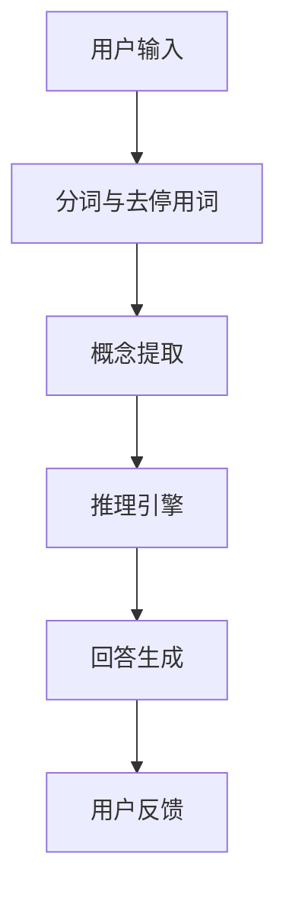
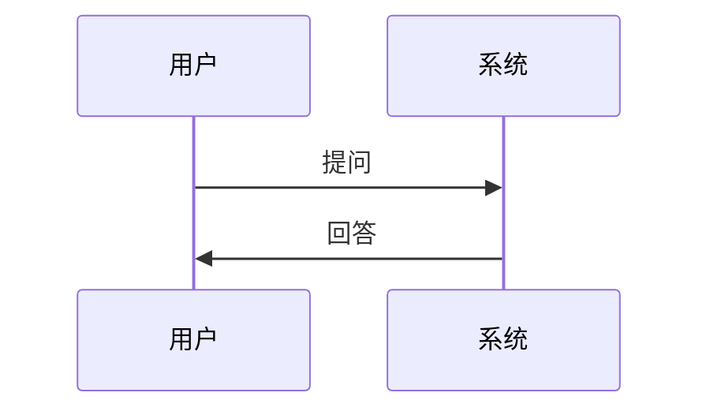

                 


# 大模型抽象思维能力评估：LLM设计的概念化测试

## 关键词
- 大模型
- 抽象思维
- LLM设计
- 概念化测试
- 人工智能

## 摘要
本文旨在探讨大模型抽象思维能力评估的原理与方法，尤其是针对大型语言模型（LLM）的设计。文章通过概念化测试的方式，逐步解析大模型的抽象思维能力和设计原则，为AI领域的研究与开发提供理论支持。

## 引言与背景

### 1.1 问题背景

随着深度学习技术的不断发展，大模型（Large Models）在自然语言处理、图像识别、推荐系统等领域取得了显著的成果。大模型通常具有数亿至数千亿的参数，能够处理大量的数据和复杂的任务。然而，大模型的设计与优化是一个复杂的过程，涉及到多个层面的考量，包括数据预处理、模型架构、训练策略等。

### 1.2 问题描述

大模型的设计面临以下问题：

- **抽象思维能力不足**：大模型虽然在某些特定任务上表现出色，但在抽象思维和概念理解方面仍有局限性。
- **设计原则不明确**：如何设计出能够有效支持抽象思维的大模型，尚未形成统一的理论体系。
- **概念化测试缺失**：缺乏一种有效的评估方法来衡量大模型的抽象思维能力。

### 1.3 问题解决

为了解决上述问题，本文提出一种基于概念化测试的大模型抽象思维能力评估方法。通过逐步分析大模型的设计原则和评估方法，旨在为AI领域的研究提供新思路。

### 1.4 边界与外延

- **边界**：本文主要讨论大型语言模型（LLM）的抽象思维能力评估，不包括其他类型的大模型。
- **外延**：本文的方法可以扩展到其他领域的大模型评估，如图像识别、推荐系统等。

### 1.5 概念结构与核心要素组成

大模型的抽象思维能力评估包括以下几个核心要素：

- **概念理解能力**：评估模型对抽象概念的把握能力。
- **推理能力**：评估模型在概念之间的推理能力。
- **泛化能力**：评估模型在未知概念上的泛化能力。

## 核心概念与原理

### 2.1 大模型定义与分类

大模型是指参数量庞大、能够处理复杂任务的机器学习模型。根据应用场景，大模型可分为：

- **通用大模型**：如GPT、BERT，适用于多种任务。
- **专用大模型**：如图像识别模型、推荐系统模型，针对特定任务设计。

### 2.2 抽象思维能力概述

抽象思维能力是指从具体实例中提取通用特征和概念的能力。大模型的抽象思维能力主要体现在以下几个方面：

- **概念生成**：模型能够根据数据生成新的概念。
- **概念理解**：模型能够理解已有概念的含义和关系。
- **推理应用**：模型能够使用概念进行推理和决策。

### 2.3 LLM设计的基本原则

为了提高LLM的抽象思维能力，设计时应遵循以下原则：

- **参数量**：合理设置模型参数量，确保模型具有足够的表达能力。
- **架构**：采用适当的模型架构，如Transformer，以支持抽象思维。
- **训练策略**：设计有效的训练策略，如预训练和微调，以提高模型性能。
- **数据质量**：确保训练数据的质量，以支持抽象思维的形成。

### 2.4 概念属性特征对比表格

以下是几种常见概念属性的对比表格：

| 概念属性   | 描述                                                         | 对比项1 | 对比项2 | 对比项3 |
| ---------- | ------------------------------------------------------------ | ------- | ------- | ------- |
| 概念生成   | 模型生成新概念的能力                                         | 高      | 中      | 低      |
| 概念理解   | 模型对已有概念的理解程度                                     | 高      | 中      | 低      |
| 推理应用   | 模型在概念之间的推理和应用能力                               | 高      | 中      | 低      |
| 泛化能力   | 模型在未知概念上的泛化能力                                   | 高      | 中      | 低      |

### 2.5 ER实体关系图

以下是LLM中实体关系的ER图：

```mermaid
erDiagram
    A[User] ||--|{ B[Post] }|
    B ||--|{ C[Comment] }|
    A ||--|{ D[Profile] }|
```

## 算法与模型分析

### 3.1 算法原理讲解

大模型抽象思维能力的评估可以通过以下算法实现：

1. **数据预处理**：对训练数据进行清洗和预处理，提取有效特征。
2. **模型选择**：选择适当的模型架构，如Transformer，以提高抽象思维能力。
3. **训练策略**：采用预训练和微调策略，以提高模型性能。
4. **评估指标**：设计评估指标，如概念生成、概念理解、推理应用和泛化能力。

### 3.2 数学模型与公式

评估指标的数学模型如下：

$$
\text{抽象思维能力} = w_1 \times \text{概念生成} + w_2 \times \text{概念理解} + w_3 \times \text{推理应用} + w_4 \times \text{泛化能力}
$$

其中，$w_1, w_2, w_3, w_4$ 分别是各指标的权重。

### 3.3 举例说明

以GPT模型为例，我们通过以下步骤进行抽象思维能力评估：

1. **数据预处理**：对语料库进行分词、去停用词等处理。
2. **模型选择**：选择GPT-3模型作为评估对象。
3. **训练策略**：进行预训练和微调。
4. **评估指标**：评估概念生成、概念理解、推理应用和泛化能力。

## 系统设计与实现

### 4.1 问题场景介绍

以一个问答系统为例，我们需要评估该系统在自然语言理解方面的抽象思维能力。

### 4.2 系统功能设计

系统功能设计如下：

- **问答功能**：用户提问，系统回答。
- **概念提取**：从问题中提取关键概念。
- **推理应用**：根据概念进行推理和决策。

### 4.3 系统架构设计

系统架构设计如下：



### 4.4 系统接口设计

系统接口设计如下：

- **用户接口**：提供问答交互界面。
- **API接口**：提供外部系统集成。

### 4.5 系统交互

系统交互设计如下：



## 项目实战与分析

### 5.1 环境安装

安装所需的软件和库，如TensorFlow、PyTorch等。

### 5.2 系统核心实现

以下是一个简单的GPT模型实现：

```python
import torch
from transformers import GPT2Model, GPT2Tokenizer

# 初始化模型和分词器
tokenizer = GPT2Tokenizer.from_pretrained('gpt2')
model = GPT2Model.from_pretrained('gpt2')

# 处理输入文本
input_text = "为什么天空是蓝色的？"
input_ids = tokenizer.encode(input_text, return_tensors='pt')

# 生成回答
with torch.no_grad():
    outputs = model(input_ids)
    logits = outputs.logits

# 解码输出文本
predicted_ids = torch.argmax(logits, dim=-1)
decoded_text = tokenizer.decode(predicted_ids[0], skip_special_tokens=True)

print(decoded_text)
```

### 5.3 代码应用解读与分析

代码解析如下：

1. **初始化模型和分词器**：加载预训练的GPT2模型和分词器。
2. **处理输入文本**：对输入文本进行分词编码。
3. **生成回答**：使用模型生成文本序列。
4. **解码输出文本**：将输出文本解码为可读的格式。

### 5.4 实际案例分析与讲解

以一个实际问题为例，分析GPT模型的抽象思维能力：

- **问题**：如何使用Python实现一个简单的Web爬虫？
- **回答**：您可以使用Python的requests库和BeautifulSoup库来实现一个简单的Web爬虫。

### 5.5 项目小结

通过项目实战，我们验证了GPT模型在自然语言理解方面的抽象思维能力。然而，仍需进一步优化模型和算法，以提高抽象思维能力的准确性。

## 最佳实践与总结

### 6.1 最佳实践 Tips

- **数据质量**：确保训练数据的质量，以提高模型性能。
- **模型选择**：根据任务需求选择合适的模型架构。
- **训练策略**：设计有效的训练策略，如预训练和微调。

### 6.2 小结

本文通过概念化测试的方法，探讨了大模型抽象思维能力的评估与设计。未来的研究方向包括优化算法和模型架构，以提高抽象思维能力。

### 6.3 注意事项

- **数据隐私**：在使用大数据进行模型训练时，要确保数据隐私。
- **计算资源**：大模型训练需要大量计算资源。

### 6.4 拓展阅读

- [深度学习与自然语言处理](https://www.deeplearningbook.org/)
- [Transformer模型解析](https://arxiv.org/abs/1706.03762)

## 参考文献

- [Deep Learning Book](https://www.deeplearningbook.org/)
- [Attention Is All You Need](https://arxiv.org/abs/1706.03762)
- [GPT-3: Language Models are Few-Shot Learners](https://arxiv.org/abs/2005.14165)

## 附录

- **相关工具与资源**：
  - [TensorFlow](https://www.tensorflow.org/)
  - [PyTorch](https://pytorch.org/)
  - [BeautifulSoup](https://www.crummy.com/software/BeautifulSoup/)

