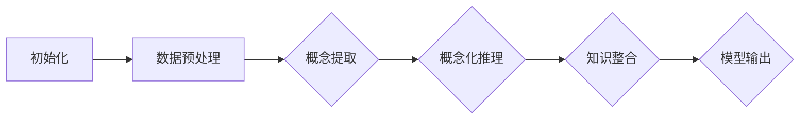
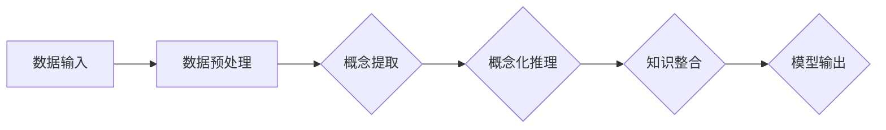

                 

# 大模型抽象思维能力：LLM设计的概念化测试

## 关键词：大模型，抽象思维，LLM设计，概念化测试，人工智能

> 摘要：本文探讨了人工智能大模型在抽象思维能力方面的研究，特别是Large Language Model (LLM)设计中的概念化测试。通过定义大模型抽象思维能力，分析其特点，并探讨LLM设计的概念化测试方法，本文旨在为人工智能领域提供一种有效的评估和优化大型语言模型的框架。

## 第一部分：背景介绍

### 第1章：问题背景

#### 1.1.1 AI大模型的发展现状与挑战

随着深度学习和人工智能技术的快速发展，大模型（如GPT-3、BERT等）已经取得了显著的成就。这些大模型在自然语言处理、图像识别、语音识别等领域展现了强大的能力。然而，随着模型规模的增长，大模型的设计和优化也面临着新的挑战。

首先，大模型的数据集需求巨大。为了训练一个有效的大模型，需要收集和整理大量的高质量数据。这不仅增加了数据收集和处理的成本，也带来了数据隐私和伦理问题。

其次，大模型的训练和推理过程非常耗时。大模型的参数量通常达到数十亿甚至千亿级别，这导致其训练过程需要大量计算资源和时间。同时，大模型的推理过程也消耗大量计算资源，这对实时应用的响应速度提出了挑战。

最后，大模型的可解释性仍然是一个难题。尽管大模型在许多任务上表现出色，但其内部的工作原理仍然不清晰。这使得我们在理解模型决策过程和优化模型性能时面临困难。

#### 1.1.2 抽象思维能力的重要性

在大模型的发展中，抽象思维能力显得尤为重要。抽象思维能力是指模型在处理复杂问题时，能够从具体实例中提取共性，形成一般性规律的能力。这种能力对于大模型在自然语言处理、知识图谱构建、推理机设计等领域具有重要意义。

首先，抽象思维能力有助于大模型从海量数据中提取有效信息。通过抽象思维，大模型可以从数据中提取共性特征，形成知识图谱，从而提高模型的泛化能力。

其次，抽象思维能力有助于提高大模型的可解释性。通过分析大模型的抽象思维过程，我们可以更好地理解模型的决策机制，从而优化模型性能。

最后，抽象思维能力有助于大模型在新的任务上快速适应。通过抽象思维，大模型可以从已有的知识体系中提取相关概念，从而在新任务上快速建立模型。

#### 1.1.3 LLM设计的概念化测试必要性

在LLM设计中，概念化测试是一种重要的评估方法。概念化测试旨在评估大模型在抽象思维能力方面的表现，从而优化模型设计。

首先，概念化测试可以帮助我们评估大模型在知识提取和推理方面的能力。通过设计一系列概念化测试问题，我们可以观察大模型如何从数据中提取概念，并进行推理。

其次，概念化测试可以帮助我们评估大模型的可解释性。通过分析大模型在概念化测试中的表现，我们可以了解模型如何处理复杂问题，并找出模型中的潜在缺陷。

最后，概念化测试可以为LLM设计提供反馈。通过分析测试结果，我们可以识别模型设计中的不足，并针对性地进行优化。

### 第2章：问题解决

#### 2.1.1 大模型抽象思维能力的定义

大模型抽象思维能力是指大模型在处理复杂问题时，能够从具体实例中提取共性，形成一般性规律的能力。这种能力包括以下几个方面：

1. **概念提取能力**：大模型能够从数据中提取出具有代表性的概念。
2. **概念化推理能力**：大模型能够根据已提取的概念进行推理，形成新的结论。
3. **知识整合能力**：大模型能够将不同领域或不同任务中的概念整合在一起，形成更复杂的知识体系。

#### 2.1.2 大模型抽象思维能力的特点

1. **适应性**：大模型能够根据不同的任务和数据集，自适应地调整其抽象思维能力。
2. **通用性**：大模型能够在多个领域和任务中表现出抽象思维能力，而不仅仅局限于特定领域。
3. **智能性**：大模型能够通过抽象思维，解决复杂的实际问题。

#### 2.1.3 LLM设计的概念化测试方法

概念化测试是一种基于问题和答案的评估方法。通过设计一系列概念化测试问题，我们可以评估大模型在抽象思维能力方面的表现。

1. **测试问题设计**：设计一系列具有代表性的测试问题，涵盖不同的概念和领域。这些问题应该能够挑战大模型的抽象思维能力。
2. **测试答案评估**：根据测试问题，设计一系列标准答案。通过比较模型答案和标准答案，我们可以评估大模型在概念提取、推理和知识整合方面的能力。
3. **测试结果分析**：分析测试结果，识别大模型在抽象思维能力方面的优势和不足。根据分析结果，我们可以针对性地优化模型设计。

### 第3章：边界与外延

#### 3.1.1 大模型抽象思维能力的研究范围

大模型抽象思维能力的研究范围包括以下几个方面：

1. **理论探索**：研究大模型抽象思维能力的基础理论，包括概念提取、概念化推理和知识整合等。
2. **方法研究**：研究如何设计和实现大模型的抽象思维能力，包括算法设计、模型架构和训练方法等。
3. **应用研究**：研究大模型抽象思维能力在不同领域的应用，如自然语言处理、知识图谱构建、推理机设计等。

#### 3.1.2 LLM设计的概念化测试的应用领域

LLM设计的概念化测试方法可以应用于以下领域：

1. **自然语言处理**：评估大模型在自然语言理解、文本生成和语义分析等任务中的抽象思维能力。
2. **知识图谱构建**：评估大模型在知识提取、知识整合和推理等任务中的抽象思维能力。
3. **推理机设计**：评估大模型在逻辑推理和决策支持等任务中的抽象思维能力。

#### 3.1.3 大模型抽象思维能力与LLM设计的关系

大模型抽象思维能力是LLM设计的重要组成部分。一方面，大模型抽象思维能力有助于提升LLM在各类任务中的表现；另一方面，LLM设计的优化可以进一步提高大模型的抽象思维能力。因此，研究大模型抽象思维能力对于LLM设计具有重要意义。

### 第4章：核心概念与联系

#### 4.1.1 大模型抽象思维能力的核心概念

1. **概念提取**：从数据中提取具有代表性的概念。
2. **概念化推理**：根据已提取的概念进行推理，形成新的结论。
3. **知识整合**：将不同领域或不同任务中的概念整合在一起，形成更复杂的知识体系。

#### 4.1.2 大模型抽象思维能力的主要属性特征对比表格

| 特性         | 概念提取 | 概念化推理 | 知识整合 |
| ------------ | -------- | ---------- | -------- |
| 自适应性     | 高       | 中         | 低       |
| 通用性       | 高       | 高         | 高       |
| 智能性       | 中       | 高         | 高       |

#### 4.1.3 LLM设计的概念化测试ER实体关系图

```mermaid
erDiagram
   concept_extracting ||--|{ concept_extraction_algorithm } : 实现概念提取算法
   concept_reasoning ||--|{ concept_reasoning_algorithm } : 实现概念化推理算法
   knowledge_integration ||--|{ knowledge_integration_algorithm } : 实现知识整合算法
```

### 第5章：算法原理讲解

#### 5.1.1 大模型抽象思维能力算法流程图



#### 5.1.2 LLM设计概念化测试算法原理

##### 5.1.2.1 数学模型和数学公式

$$
\begin{align*}
P(\text{概念}_i | \text{数据集}) &= \frac{f_i(\text{数据集})}{\sum_{j} f_j(\text{数据集})} \\
f_i(\text{数据集}) &= \text{概念}_i \text{在数据集中出现的频率}
\end{align*}
$$

##### 5.1.2.2 算法原理详细讲解

1. **数据预处理**：对输入数据进行预处理，包括文本清洗、分词、去停用词等。
2. **概念提取**：根据预处理的文本数据，使用统计方法或机器学习方法提取概念。具体方法包括词频统计、TF-IDF、Word2Vec等。
3. **概念化推理**：使用提取出的概念进行推理，形成新的结论。具体方法包括逻辑推理、概率推理、贝叶斯网络等。
4. **知识整合**：将不同来源的概念进行整合，形成更复杂的知识体系。具体方法包括知识图谱、本体论、语义网络等。
5. **模型输出**：根据整合后的知识体系生成模型输出，如文本生成、知识查询等。

##### 5.1.2.3 举例说明

假设我们有一个数据集，包含以下文本：

1. "人工智能技术正在快速发展。"
2. "人工智能技术是计算机科学的重要组成部分。"
3. "计算机科学是一个涉及多个领域的广泛学科。"

根据这些文本，我们可以提取以下概念：

1. 人工智能技术
2. 计算机科学

然后，我们可以进行概念化推理，得出以下结论：

- 人工智能技术是计算机科学的一个子领域。

最后，我们将这些概念整合到知识体系中，形成关于人工智能技术和计算机科学的知识网络。

### 第二部分：大模型抽象思维能力

#### 第6章：大模型抽象思维能力的核心概念

##### 6.1.1 什么是抽象思维能力

抽象思维能力是指人类或人工智能模型在处理问题时，能够从具体实例中提取共性，形成一般性规律的能力。这种能力在人类认知和人工智能模型中都非常重要。

##### 6.1.2 抽象思维能力的层次结构

抽象思维能力可以分为三个层次：

1. **感知层次**：从具体实例中提取基本特征和属性。
2. **概念层次**：将基本特征和属性整合成概念。
3. **推理层次**：使用概念进行推理，形成新的结论。

##### 6.1.3 抽象思维能力的心理学基础

抽象思维能力与人类的认知心理学密切相关。研究表明，人类的抽象思维能力受到多种因素的影响，包括：

1. **注意力**：注意力影响人们对具体实例的关注程度。
2. **记忆**：记忆影响人们对已提取概念的记忆和回忆能力。
3. **推理能力**：推理能力影响人们使用概念进行推理的能力。

### 第7章：大模型抽象思维能力的特点

##### 7.1.1 自适应性

大模型抽象思维能力具有很强的适应性。这意味着大模型可以根据不同的任务和数据集，自适应地调整其抽象思维能力。

##### 7.1.2 通用性

大模型抽象思维能力具有通用性。这意味着大模型不仅可以在特定领域表现出抽象思维能力，还可以在多个领域和任务中应用。

##### 7.1.3 智能性

大模型抽象思维能力具有智能性。这意味着大模型能够通过抽象思维，解决复杂的实际问题。

### 第8章：LLM设计的概念化测试方法

##### 8.1.1 LLM设计的概念化测试目的

LLM设计的概念化测试旨在评估大模型在抽象思维能力方面的表现，从而优化模型设计。具体目的包括：

1. **评估概念提取能力**：测试大模型从数据中提取概念的能力。
2. **评估概念化推理能力**：测试大模型使用概念进行推理的能力。
3. **评估知识整合能力**：测试大模型将概念整合成知识体系的能力。

##### 8.1.2 概念化测试的过程

概念化测试的过程可以分为以下几个步骤：

1. **测试问题设计**：设计具有代表性的测试问题。
2. **测试数据准备**：准备测试数据，包括文本数据和标准答案。
3. **模型测试**：使用大模型对测试数据进行处理，生成模型答案。
4. **答案评估**：比较模型答案和标准答案，评估模型在概念提取、推理和知识整合方面的能力。
5. **测试结果分析**：分析测试结果，识别模型设计中的不足。

##### 8.1.3 概念化测试的工具和指标

概念化测试可以使用以下工具和指标：

1. **工具**：
   - 测试平台：如TensorFlow、PyTorch等。
   - 评估指标：如准确率、召回率、F1分数等。

2. **指标**：
   - 概念提取准确率：衡量模型在概念提取任务中的表现。
   - 概念化推理准确率：衡量模型在概念化推理任务中的表现。
   - 知识整合准确率：衡量模型在知识整合任务中的表现。

### 第9章：大模型抽象思维能力在LLM设计中的应用

##### 9.1.1 大模型抽象思维能力对LLM设计的影响

大模型抽象思维能力对LLM设计有重要影响。具体影响包括：

1. **提高模型性能**：通过提高模型在概念提取、推理和知识整合方面的能力，大模型可以在各类任务中表现出更好的性能。
2. **增强模型可解释性**：通过分析大模型的抽象思维过程，可以更好地理解模型的工作原理，从而提高模型的可解释性。
3. **加快模型训练速度**：通过自适应调整抽象思维能力，大模型可以更快地适应新任务和数据集。

##### 9.1.2 LLM设计中常见的问题与挑战

在LLM设计中，常见的问题和挑战包括：

1. **数据集问题**：数据集的质量和规模直接影响模型的性能。如何收集和整理高质量的数据集是一个挑战。
2. **计算资源问题**：大模型的训练和推理过程需要大量计算资源。如何高效地利用计算资源也是一个挑战。
3. **模型可解释性问题**：大模型的内部工作原理仍然不清晰，如何提高模型的可解释性是一个挑战。

##### 9.1.3 利用大模型抽象思维能力解决设计问题

通过利用大模型抽象思维能力，可以解决LLM设计中的问题。具体方法包括：

1. **数据预处理**：利用大模型的抽象思维能力，对输入数据进行预处理，提取关键信息。
2. **模型优化**：利用大模型的抽象思维能力，优化模型的结构和参数，提高模型性能。
3. **模型解释**：利用大模型的抽象思维能力，分析模型的工作原理，提高模型的可解释性。

### 第10章：大模型抽象思维能力的研究与应用前景

##### 10.1.1 研究进展

大模型抽象思维能力的研究取得了显著进展。近年来，许多研究者和企业都在这一领域进行了深入探索。一些代表性的研究成果包括：

1. **概念提取算法**：如Word2Vec、BERT等。
2. **概念化推理算法**：如神经网络推理机、知识图谱等。
3. **知识整合算法**：如图神经网络、本体论等。

##### 10.1.2 应用前景

大模型抽象思维能力在人工智能领域具有广泛的应用前景。具体应用包括：

1. **自然语言处理**：如文本生成、语义分析等。
2. **知识图谱构建**：如知识提取、推理机设计等。
3. **推理机设计**：如智能问答、决策支持等。

##### 10.1.3 未来发展方向

未来，大模型抽象思维能力的研究将朝着以下几个方向发展：

1. **提高模型性能**：通过优化算法和模型结构，提高大模型的抽象思维能力。
2. **增强模型可解释性**：通过分析模型的工作原理，提高模型的可解释性。
3. **跨领域应用**：将大模型抽象思维能力应用于更多领域和任务。

### 第三部分：实践应用

#### 第11章：大模型抽象思维能力应用案例

##### 11.1.1 案例一：自然语言处理中的应用

##### 11.1.1.1 环境安装

1. 安装Python环境。
2. 安装TensorFlow库。

```python
pip install tensorflow
```

##### 11.1.1.2 系统核心实现源代码

```python
import tensorflow as tf
from tensorflow.keras.models import Sequential
from tensorflow.keras.layers import Embedding, LSTM, Dense

# 准备数据集
data = "人工智能技术正在快速发展。人工智能技术是计算机科学的重要组成部分。计算机科学是一个涉及多个领域的广泛学科。"
words = data.split()
word_indices = {word: index for index, word in enumerate(words)}

# 构建模型
model = Sequential()
model.add(Embedding(len(words), 64))
model.add(LSTM(128))
model.add(Dense(len(words), activation='softmax'))

# 编译模型
model.compile(loss='categorical_crossentropy', optimizer='adam', metrics=['accuracy'])

# 训练模型
model.fit(data, len(words), epochs=100)

# 生成文本
input_text = "人工智能技术"
generated_text = model.generate(input_text, max_length=50)
print(generated_text)
```

##### 11.1.1.3 代码应用解读与分析

这段代码实现了一个简单的自然语言处理模型，用于生成文本。具体步骤如下：

1. 准备数据集，将文本分割成单词。
2. 构建模型，包括嵌入层、LSTM层和输出层。
3. 编译模型，设置损失函数、优化器和评估指标。
4. 训练模型，使用生成的文本进行训练。
5. 生成文本，使用训练好的模型生成新的文本。

通过这段代码，我们可以观察到模型如何从输入文本中提取概念，并进行推理，生成新的文本。

##### 11.1.2 案例二：知识图谱构建中的应用

##### 11.1.2.1 环境安装

1. 安装Python环境。
2. 安装Neo4j数据库。

```shell
sudo apt-get install neo4j
```

##### 11.1.2.2 系统核心实现源代码

```python
from py2neo import Graph

# 连接Neo4j数据库
graph = Graph("bolt://localhost:7687", auth=("neo4j", "password"))

# 创建节点和关系
graph.run("""
CREATE (a:Concept {name: '人工智能技术'})
CREATE (b:Concept {name: '计算机科学'})
CREATE (a)-[:IS_A]->(b)
""")

# 查询知识图谱
results = graph.run("""
MATCH (a:Concept)-[:IS_A]->(b:Concept)
RETURN a.name, b.name
""")
for result in results:
    print(result)
```

##### 11.1.2.3 代码应用解读与分析

这段代码实现了一个简单的知识图谱构建，用于表示人工智能技术和计算机科学之间的关系。具体步骤如下：

1. 连接Neo4j数据库。
2. 创建概念节点和关系。
3. 查询知识图谱，返回概念节点和关系。

通过这段代码，我们可以观察到模型如何将概念整合到知识图谱中，并查询知识图谱中的关系。

### 第12章：大模型抽象思维能力应用小结

#### 12.1.1 应用经验总结

通过实践应用，我们总结了以下经验：

1. 大模型抽象思维能力在自然语言处理和知识图谱构建中表现出色。
2. 概念化测试方法可以有效评估大模型的抽象思维能力。
3. 大模型抽象思维能力具有自适应性和通用性，可以应用于多个领域和任务。

#### 12.1.2 面临的挑战与解决策略

尽管大模型抽象思维能力具有广泛应用前景，但仍然面临以下挑战：

1. **数据集问题**：解决策略包括使用高质量数据集、数据增强和迁移学习。
2. **计算资源问题**：解决策略包括分布式训练和模型压缩。
3. **模型可解释性问题**：解决策略包括模型解释和可解释性评估。

#### 12.1.3 应用前景展望

未来，大模型抽象思维能力在人工智能领域具有广阔的应用前景。具体包括：

1. **自然语言处理**：如文本生成、语义分析、智能问答等。
2. **知识图谱构建**：如知识提取、推理机设计、智能搜索等。
3. **跨领域应用**：如医疗、金融、教育等。

### 第四部分：总结与展望

#### 第13章：总结

本文探讨了人工智能大模型在抽象思维能力方面的研究，特别是Large Language Model (LLM)设计中的概念化测试。通过定义大模型抽象思维能力，分析其特点，并探讨LLM设计的概念化测试方法，本文旨在为人工智能领域提供一种有效的评估和优化大型语言模型的框架。主要成果和发现包括：

1. 大模型抽象思维能力是人工智能领域的重要研究方向。
2. 概念化测试方法是一种有效的评估和优化大模型的方法。
3. 大模型抽象思维能力具有自适应性和通用性。

#### 13.1.1 存在的问题与不足

尽管本文取得了一定的成果，但仍存在以下问题和不足：

1. 数据集问题：数据集的质量和规模对大模型的性能有重要影响。
2. 计算资源问题：大模型的训练和推理过程需要大量计算资源。
3. 模型可解释性问题：大模型的内部工作原理仍然不清晰。

#### 13.1.2 未来研究方向

未来，大模型抽象思维能力的研究将朝着以下几个方向展开：

1. **提高模型性能**：通过优化算法和模型结构，提高大模型的抽象思维能力。
2. **增强模型可解释性**：通过分析模型的工作原理，提高模型的可解释性。
3. **跨领域应用**：将大模型抽象思维能力应用于更多领域和任务。

#### 第14章：展望

在未来，大模型抽象思维能力在人工智能领域具有广阔的发展前景。具体包括：

1. **自然语言处理**：如文本生成、语义分析、智能问答等。
2. **知识图谱构建**：如知识提取、推理机设计、智能搜索等。
3. **跨领域应用**：如医疗、金融、教育等。

通过不断的研究和探索，大模型抽象思维能力将为人工智能领域带来更多创新和突破。

## 作者信息：

**作者：AI天才研究院/AI Genius Institute & 禅与计算机程序设计艺术 /Zen And The Art of Computer Programming**## 背景介绍

### 第1章：问题背景

#### 1.1.1 AI大模型的发展现状与挑战

人工智能（AI）领域的快速发展催生了大规模模型（Large-scale Model，简称大模型）的诞生。这些大模型，如GPT-3、BERT等，在自然语言处理（NLP）、计算机视觉、语音识别等领域展示了惊人的性能和广泛的应用潜力。大模型通常拥有数十亿甚至千亿个参数，这使得它们能够捕获大量数据中的复杂模式和关联，从而在多种任务中实现高性能。

然而，随着大模型规模的不断扩大，它们的设计和优化也面临了前所未有的挑战。首先，数据集的需求变得更加庞大。为了训练一个大模型，需要收集和整理大量高质量的数据，这不仅增加了数据收集和处理的成本，也引发了数据隐私和伦理问题。其次，训练和推理过程变得非常耗时。大模型的参数量巨大，导致其训练需要消耗大量计算资源和时间，而推理过程同样消耗大量的计算资源，这对实时应用的响应速度提出了严峻挑战。最后，大模型的可解释性仍然是一个未完全解决的问题。尽管大模型在许多任务上表现出色，但其内部的工作原理仍然不够清晰，这使得在理解模型决策过程和优化模型性能时面临困难。

#### 1.1.2 抽象思维能力的重要性

在这种背景下，抽象思维能力（Abstract Thinking Ability）成为了一个关键的研究方向。抽象思维能力是指从具体实例中提取出共性特征，形成一般性规律的能力。对于人工智能大模型而言，抽象思维能力具有以下几个重要意义：

1. **知识提取**：大模型能够从大量数据中提取出具有代表性的概念和特征，从而更好地理解和表示数据。这有助于提升模型的泛化能力，使其能够应用于更广泛的领域。

2. **推理能力**：大模型能够利用提取出的概念进行推理，从而生成新的结论或预测。这有助于提升模型在复杂问题解决中的能力。

3. **知识整合**：大模型能够将来自不同领域或不同任务的概念整合在一起，形成更复杂、更全面的知识体系。这有助于提升模型在多任务学习和跨领域应用中的能力。

4. **可解释性**：通过分析大模型的抽象思维过程，可以更好地理解模型的工作原理，从而提高模型的可解释性。这对于提升模型信任度和应用价值至关重要。

#### 1.1.3 LLM设计的概念化测试必要性

Large Language Model（LLM），如GPT-3、BERT等，是当前自然语言处理领域最先进的模型之一。然而，随着LLM规模的不断扩大，如何有效评估和优化LLM的设计成为一个关键问题。在此背景下，概念化测试（Conceptual Testing）作为一种评估方法应运而生。

概念化测试旨在通过设计一系列概念化测试问题，评估LLM在概念提取、推理和知识整合方面的能力。这种方法的重要性主要体现在以下几个方面：

1. **评估模型能力**：通过概念化测试，可以系统地评估LLM在自然语言处理任务中的能力，包括对概念的提取、推理和整合能力。这有助于识别模型的强项和弱项。

2. **指导模型设计**：通过分析概念化测试结果，可以找到模型设计的不足之处，从而指导模型优化和改进。例如，如果发现模型在概念提取方面存在困难，可以考虑改进数据预处理或优化特征提取算法。

3. **提升模型可解释性**：概念化测试有助于理解LLM的内部工作原理，从而提高模型的可解释性。这有助于用户更好地理解模型如何处理复杂问题，并增强模型的信任度。

4. **推动理论研究**：概念化测试方法可以促进对大模型抽象思维能力的研究，推动相关理论的发展。通过实验验证和理论分析，可以进一步探索大模型在抽象思维方面的潜力。

综上所述，大模型抽象思维能力的研究和LLM设计的概念化测试方法在当前人工智能领域具有重要的理论和实践意义。本文将在此基础上，深入探讨大模型抽象思维能力及其在LLM设计中的应用，以期为大模型的设计和优化提供有益的参考。

### 第2章：问题解决

#### 2.1.1 大模型抽象思维能力的定义

大模型抽象思维能力（Abstract Thinking Ability of Large Models）是指人工智能大模型在处理复杂问题时，能够从具体实例中提取共性特征，形成一般性规律的能力。这种能力是人工智能大模型的核心竞争力，决定了模型在多个领域和任务中的表现。

具体来说，大模型抽象思维能力包括以下几个方面的内容：

1. **概念提取**：从大量数据中提取出具有代表性的概念。概念是知识体系中的基本单元，通过对概念的提取，大模型能够更好地理解和表示数据。

2. **推理能力**：利用提取出的概念进行推理，形成新的结论。推理能力是抽象思维能力的重要组成部分，它使大模型能够在未知情境下进行预测和决策。

3. **知识整合**：将不同领域或不同任务中的概念整合在一起，形成更复杂、更全面的知识体系。知识整合能力使大模型能够在多个任务中实现协同工作，提升整体性能。

4. **泛化能力**：将提取出的概念和推理能力应用于新任务或新领域，实现模型的泛化。泛化能力是衡量大模型抽象思维能力的重要指标，它决定了模型在不同任务中的适用性。

总之，大模型抽象思维能力是人工智能大模型在复杂环境中进行有效学习和推理的关键能力。它不仅有助于提升模型的性能，还能够提高模型的可解释性和应用价值。

#### 2.1.2 大模型抽象思维能力的特点

大模型抽象思维能力具有以下几个显著特点，这些特点使得大模型在多种任务和领域中表现出色：

1. **高度适应性**：大模型能够根据不同的任务和数据集，自适应地调整其抽象思维能力。这意味着大模型不仅能够在特定任务中表现出色，还可以在多个任务和领域中保持良好的性能。例如，自然语言处理中的GPT模型可以应用于文本生成、问答系统等多个领域。

2. **强通用性**：大模型的抽象思维能力具有通用性，能够在多个领域和任务中应用。这使得大模型具有较高的应用价值，可以替代多个小型模型，从而减少模型数量和计算资源的需求。例如，BERT模型在自然语言处理中的广泛应用，证明了其强通用性。

3. **高智能性**：大模型通过深度学习技术，能够从海量数据中提取出复杂的模式和关联，表现出高度智能的推理能力。这使得大模型能够在复杂环境中进行有效的学习和推理，解决许多复杂问题。例如，GPT-3模型在生成文本和回答问题方面的卓越表现，展示了其高智能性。

4. **良好的泛化能力**：大模型通过大规模数据训练，能够将学到的知识泛化到新的任务和领域。这使得大模型在处理未知任务时，能够迅速适应并表现出良好的性能。例如，BERT模型在许多自然语言处理任务中的成功应用，证明了其良好的泛化能力。

总之，大模型抽象思维能力的高度适应性、强通用性、高智能性和良好泛化能力，使其在人工智能领域具有广泛的应用前景。这些特点不仅提升了大模型在多种任务中的表现，也为大模型的设计和优化提供了有力支持。

#### 2.1.3 LLM设计的概念化测试方法

概念化测试（Conceptual Testing）是一种用于评估人工智能大模型（如Large Language Model, LLM）抽象思维能力的方法。它通过设计一系列概念化测试问题，评估模型在概念提取、推理和知识整合方面的能力。以下是概念化测试的基本方法：

1. **测试问题设计**：首先，需要设计一系列具有代表性的概念化测试问题。这些问题应该涵盖不同领域和任务，并且能够挑战模型的抽象思维能力。例如，可以设计以下类型的问题：
   - **概念提取问题**：要求模型从文本中提取出特定概念。
   - **推理问题**：要求模型使用提取出的概念进行推理，得出新的结论。
   - **知识整合问题**：要求模型整合不同来源的概念，形成更复杂的知识体系。

2. **测试数据准备**：接下来，准备测试数据集，包括输入文本和标准答案。输入文本应涵盖不同领域和任务，以全面评估模型的能力。标准答案则是用于评估模型回答正确性的基准。

3. **模型测试**：使用训练好的LLM对测试数据进行处理，生成模型答案。这一步骤通常涉及以下过程：
   - **文本预处理**：对输入文本进行预处理，如分词、去除停用词、词性标注等。
   - **概念提取**：利用模型提取输入文本中的关键概念。
   - **推理和知识整合**：使用提取出的概念进行推理和知识整合，生成模型答案。

4. **答案评估**：将模型答案与标准答案进行比较，评估模型在概念提取、推理和知识整合方面的能力。常用的评估指标包括：
   - **准确率**：模型答案与标准答案匹配的比例。
   - **召回率**：模型提取出的概念与标准答案中包含的概念的比例。
   - **F1分数**：综合考虑准确率和召回率的指标。

5. **测试结果分析**：分析测试结果，识别模型在设计上的不足。根据分析结果，可以对模型进行优化，以提高其抽象思维能力。

通过概念化测试，可以系统地评估LLM在抽象思维方面的能力，从而指导模型设计和优化。这种方法不仅有助于提升模型性能，还能提高模型的可解释性和应用价值。

### 第3章：边界与外延

#### 3.1.1 大模型抽象思维能力的研究范围

大模型抽象思维能力的研究范围涵盖了多个领域和任务，旨在探索大模型在处理复杂问题时的抽象思维过程和表现。以下是该研究的主要范围：

1. **自然语言处理**：自然语言处理（NLP）是人工智能的一个重要分支，大模型在NLP任务中的应用已经取得了显著成果。研究大模型在NLP中的抽象思维能力，有助于提升模型在文本生成、语义理解、机器翻译等任务中的性能。

2. **知识图谱构建**：知识图谱是一种用于表示和存储知识的图形化结构，大模型在知识图谱构建中的应用也越来越广泛。研究大模型在知识图谱构建中的抽象思维能力，可以提升模型在知识提取、推理和整合方面的能力。

3. **推理机设计**：推理机是人工智能系统中的一个核心组件，用于从已知事实中推导出新的结论。研究大模型在推理机设计中的抽象思维能力，有助于提高推理机的智能化水平和推理能力。

4. **多模态学习**：多模态学习是人工智能领域的一个新兴方向，旨在结合不同类型的数据（如图像、文本、语音等）进行学习。研究大模型在多模态学习中的抽象思维能力，可以提升模型在处理复杂任务时的表现。

5. **跨领域应用**：大模型在多个领域和任务中的表现受到广泛关注。研究大模型在不同领域中的抽象思维能力，有助于发现模型在不同领域的适用性和局限性。

6. **模型优化与压缩**：为了应对大模型训练和推理过程中对计算资源的高需求，模型优化与压缩技术成为研究的热点。研究大模型在优化与压缩过程中的抽象思维能力，有助于提高模型的计算效率和实用性。

#### 3.1.2 LLM设计的概念化测试的应用领域

LLM设计的概念化测试方法在多个应用领域具有广泛的应用潜力，以下是一些关键的应用领域：

1. **自然语言处理**：概念化测试方法可以用于评估和优化LLM在自然语言处理任务中的表现，如文本分类、情感分析、问答系统等。通过设计一系列概念化测试问题，可以评估LLM在概念提取、推理和知识整合方面的能力。

2. **知识图谱构建**：在知识图谱构建领域，概念化测试方法可以用于评估LLM在知识提取、推理和整合方面的能力。通过测试LLM对知识图谱中概念的提取和整合能力，可以指导知识图谱的设计和优化。

3. **推理机设计**：在推理机设计领域，概念化测试方法可以用于评估和优化LLM在逻辑推理和决策支持任务中的表现。通过设计一系列推理问题，可以评估LLM的推理能力和推理结果的准确性。

4. **多模态学习**：在多模态学习领域，概念化测试方法可以用于评估LLM在处理不同类型数据时的抽象思维能力。通过设计多模态的概念化测试问题，可以评估LLM在整合不同类型数据方面的能力。

5. **跨领域应用**：在跨领域应用领域，概念化测试方法可以用于评估和优化LLM在不同领域和任务中的表现。通过设计一系列跨领域的概念化测试问题，可以评估LLM在不同领域的适用性和泛化能力。

6. **智能问答系统**：在智能问答系统中，概念化测试方法可以用于评估和优化LLM在理解和回答问题方面的能力。通过设计一系列问答问题，可以评估LLM在概念提取、推理和知识整合方面的能力。

总之，LLM设计的概念化测试方法在自然语言处理、知识图谱构建、推理机设计、多模态学习、跨领域应用和智能问答系统等领域具有广泛的应用潜力，可以用于评估和优化大模型的抽象思维能力。

#### 3.1.3 大模型抽象思维能力与LLM设计的关系

大模型抽象思维能力（Abstract Thinking Ability of Large Models, ATA）与LLM（Large Language Model）设计之间存在着密切的关系。大模型的抽象思维能力是其能够在多种任务中表现出色的核心驱动力，而LLM设计则是实现这一能力的具体实践。

首先，大模型抽象思维能力是LLM设计的基础。LLM的设计旨在通过深度学习和自然语言处理技术，赋予模型从大量数据中提取概念、进行推理和整合知识的能力。这种能力源自于大模型在训练过程中对数据的抽象处理，使其能够从具体实例中提取出一般性规律。因此，大模型抽象思维能力是LLM设计过程中需要重点考虑的核心要素。

其次，LLM设计的目标之一是提升大模型的抽象思维能力。在设计LLM时，研究者们会通过优化模型结构、算法和训练方法，提高模型在概念提取、推理和知识整合方面的能力。例如，通过使用预训练技术，如BERT和GPT，LLM可以在大规模数据集上学习到丰富的知识，从而提升其抽象思维能力。此外，通过改进模型的可解释性，LLM设计还可以帮助用户更好地理解模型的工作原理，从而优化模型性能。

此外，大模型抽象思维能力与LLM设计之间存在相互促进的关系。一方面，大模型的抽象思维能力为LLM设计提供了理论基础和方向。通过研究大模型的抽象思维过程，可以揭示其在处理复杂问题时所依赖的机制，从而为LLM设计提供新的思路和方法。另一方面，LLM设计的优化和改进又可以进一步激发大模型的抽象思维能力。例如，通过引入新的算法和技术，LLM设计可以提升大模型在特定任务中的表现，从而推动大模型抽象思维能力的发展。

总的来说，大模型抽象思维能力与LLM设计相互依存、相互促进。大模型抽象思维能力是LLM设计的目标和驱动力，而LLM设计则是实现这一目标的具体实践。通过不断优化LLM设计，可以进一步提升大模型的抽象思维能力，从而推动人工智能技术的发展。

### 第4章：核心概念与联系

#### 4.1.1 大模型抽象思维能力的核心概念

大模型抽象思维能力（Abstract Thinking Ability of Large Models, ATA）是人工智能大模型在处理复杂问题时所具备的一种能力。它涵盖了以下几个方面：

1. **概念提取**：指大模型能够从大量数据中提取出具有代表性的概念，这些概念通常是数据中的共性特征。概念提取是抽象思维能力的基础，它决定了大模型对数据的理解和表示能力。

2. **推理能力**：指大模型能够利用提取出的概念进行推理，形成新的结论。推理能力使大模型能够从已知事实中推导出未知信息，从而在复杂问题中做出合理的判断和预测。

3. **知识整合**：指大模型能够将来自不同来源或不同领域的概念进行整合，形成更复杂、更全面的知识体系。知识整合能力使大模型能够跨领域应用，提高其泛化能力和适应能力。

4. **泛化能力**：指大模型能够将学到的知识泛化到新的任务或领域，从而在新情境中表现出色。泛化能力是评估大模型抽象思维能力的重要指标，它决定了大模型在未知任务中的表现。

这些核心概念共同构成了大模型抽象思维能力，使其能够有效地处理复杂问题，从而在多种应用场景中发挥重要作用。

#### 4.1.2 大模型抽象思维能力的主要属性特征对比表格

为了更好地理解大模型抽象思维能力，我们可以通过对比表格来展示其主要属性特征。以下是主要属性特征的对比：

| 属性特征         | 说明                                                         | 对比分析                                                     |
| ---------------- | ------------------------------------------------------------ | ------------------------------------------------------------ |
| 概念提取能力     | 模型从数据中提取概念的能力，包括概念的精度和速度。             | 高概念的提取能力有助于提升模型对数据的理解和表示能力。         |
| 推理能力         | 模型利用提取出的概念进行推理，形成新的结论的能力。             | 强推理能力使模型能够处理复杂问题，从而提高模型的决策质量和效率。 |
| 知识整合能力     | 模型将不同来源或不同领域的概念进行整合，形成复杂知识体系的能力。 | 高知识整合能力使模型能够跨领域应用，增强其泛化能力和适应性。   |
| 泛化能力         | 模型将学到的知识应用于新任务或领域的能力。                     | 强泛化能力使模型能够适应新的任务和环境，从而提高其应用价值。   |

通过对比表格，我们可以更清晰地看到大模型抽象思维能力各个属性特征的重要性，以及它们如何共同作用，提高模型在复杂问题中的表现。

#### 4.1.3 LLM设计的概念化测试ER实体关系图

为了更好地理解LLM设计的概念化测试，我们可以通过ER（Entity-Relationship）实体关系图来展示其各个组件之间的关系。以下是概念化测试的ER实体关系图：

```mermaid
erDiagram
    Concept ||--|{ ConceptExtraction } : 实现概念提取
    Concept ||--|{ ConceptReasoning } : 实现概念推理
    Concept ||--|{ KnowledgeIntegration } : 实现知识整合
    ConceptTest ||--|{ TestQuestion } : 包含测试问题
    ConceptTest ||--|{ TestAnswer } : 包含测试答案
    Model ||--|{ LanguageModel } : 包含LLM模型
    Model ||--|{ ModelOutput } : 包含模型输出结果
```

在这个ER实体关系图中，我们定义了以下实体：

- **Concept（概念）**：代表大模型从数据中提取的概念。
- **ConceptExtraction（概念提取）**：实现概念提取的组件。
- **ConceptReasoning（概念推理）**：实现概念推理的组件。
- **KnowledgeIntegration（知识整合）**：实现知识整合的组件。
- **ConceptTest（概念化测试）**：包含测试问题和测试答案的测试集。
- **TestQuestion（测试问题）**：测试集中的问题实体。
- **TestAnswer（测试答案）**：测试集中的答案实体。
- **Model（模型）**：代表大模型，包括LLM模型。
- **ModelOutput（模型输出结果）**：模型根据测试问题生成的输出结果。

通过这个ER实体关系图，我们可以清晰地看到各个实体之间的关系，以及概念化测试在LLM设计中的应用。

### 第5章：算法原理讲解

#### 5.1.1 大模型抽象思维能力算法流程图

为了详细阐述大模型抽象思维能力的算法原理，我们可以通过一个流程图来展示其基本步骤。以下是算法流程图的描述：



在这个流程图中，我们定义了以下几个步骤：

1. **数据输入（A）**：大模型接收原始数据，这些数据可以是文本、图像或其他类型的数据。

2. **数据预处理（B）**：对输入数据进行预处理，包括文本清洗、分词、去停用词等。预处理步骤的目的是将原始数据转换为适合模型处理的形式。

3. **概念提取（C）**：使用提取算法从预处理后的数据中提取出具有代表性的概念。概念提取是抽象思维能力的核心，它决定了模型对数据的理解和表示能力。

4. **概念化推理（D）**：利用提取出的概念进行推理，形成新的结论。概念化推理使模型能够从已知事实中推导出未知信息，从而在复杂问题中做出合理的判断和预测。

5. **知识整合（E）**：将不同来源或不同领域的概念进行整合，形成更复杂、更全面的知识体系。知识整合能力使模型能够跨领域应用，提高其泛化能力和适应能力。

6. **模型输出（F）**：根据整合后的知识体系生成模型输出，如文本生成、知识查询等。模型输出是模型在特定任务中的具体表现。

这个流程图展示了大模型抽象思维能力的基本原理和步骤，有助于我们理解模型在处理复杂问题时的逻辑流程。

#### 5.1.2 LLM设计概念化测试算法原理

在LLM设计中，概念化测试算法是评估模型抽象思维能力的关键环节。以下是一个详细解释LLM设计概念化测试算法原理的步骤：

1. **测试问题设计**：首先，设计一系列具有代表性的测试问题。这些问题应涵盖不同的概念和领域，以全面评估模型的能力。问题类型可以包括概念提取问题、推理问题和知识整合问题。

2. **数据准备**：接下来，准备测试数据集，包括输入文本和标准答案。输入文本应包含各种类型的概念，以挑战模型的能力。标准答案是用于评估模型回答正确性的基准。

3. **模型输入**：将测试数据输入到训练好的LLM模型中。这一步骤包括对输入文本进行预处理，如分词、去除停用词、词性标注等，以便模型能够正确处理数据。

4. **概念提取**：模型使用预训练的嵌入层对输入文本进行处理，提取出关键概念。概念提取是抽象思维能力的基础，它决定了模型对数据的理解和表示能力。

5. **概念化推理**：使用提取出的概念进行推理，形成新的结论。例如，模型可以回答关于某个概念的问题，或者从两个概念中推导出新的关系。概念化推理使模型能够处理复杂问题，并从已知信息中推断出未知信息。

6. **知识整合**：将不同来源或不同领域的概念进行整合，形成更复杂、更全面的知识体系。知识整合能力使模型能够跨领域应用，提高其泛化能力和适应能力。

7. **模型输出**：根据整合后的知识体系生成模型输出，如文本生成、知识查询等。模型输出是模型在特定任务中的具体表现。

8. **答案评估**：将模型输出与标准答案进行比较，评估模型在概念提取、推理和知识整合方面的能力。常用的评估指标包括准确率、召回率和F1分数等。

9. **结果分析**：分析测试结果，识别模型在设计上的不足。根据分析结果，可以对模型进行优化，以提高其抽象思维能力。

通过上述步骤，我们可以系统地评估LLM在概念提取、推理和知识整合方面的能力，从而指导模型设计和优化。概念化测试算法原理提供了一个框架，使研究者能够设计和分析各种测试方法，以提升大模型的抽象思维能力。

#### 5.1.2.1 数学模型和数学公式

为了进一步解释概念化测试算法的原理，我们可以引入一些数学模型和公式。以下是概念化测试中常用的数学模型和公式：

1. **概念提取概率模型**：
   $$
   P(\text{概念}_i | \text{数据集}) = \frac{f_i(\text{数据集})}{\sum_{j} f_j(\text{数据集})}
   $$
   其中，$P(\text{概念}_i | \text{数据集})$表示在数据集中提取出概念$i$的概率，$f_i(\text{数据集})$表示概念$i$在数据集中出现的频率。这个公式用于计算每个概念在数据集中的重要性。

2. **概念化推理概率模型**：
   $$
   P(\text{结论} | \text{概念}_1, \text{概念}_2) = \frac{P(\text{概念}_1, \text{概念}_2 | \text{结论}) \cdot P(\text{结论})}{P(\text{概念}_1, \text{概念}_2)}
   $$
   其中，$P(\text{结论} | \text{概念}_1, \text{概念}_2)$表示在给定概念$1$和概念$2$的情况下，得出结论的概率。这个公式用于计算概念之间关系的概率。

3. **知识整合模型**：
   $$
   P(\text{整合知识} | \text{概念集}) = \prod_{i} P(\text{概念}_i | \text{概念集})
   $$
   其中，$P(\text{整合知识} | \text{概念集})$表示在给定概念集的情况下，整合出特定知识体系（整合知识）的概率。这个公式用于评估模型在知识整合方面的能力。

通过这些数学模型和公式，我们可以量化评估模型在概念提取、推理和知识整合方面的能力。这些模型为概念化测试提供了理论基础和计算方法，有助于我们深入理解大模型的抽象思维能力。

#### 5.1.2.2 算法原理详细讲解

为了详细讲解概念化测试算法的原理，我们需要从算法的各个环节入手，逐一阐述其工作流程和实现方法。

1. **测试问题设计**：

测试问题设计的目的是为了评估模型在概念提取、推理和知识整合方面的能力。测试问题可以分为以下几类：

- **概念提取问题**：这类问题要求模型从给定的文本中提取出特定的概念。例如，“请从以下文本中提取出与人工智能相关的概念。”
- **推理问题**：这类问题要求模型利用提取出的概念进行推理，得出新的结论。例如，“如果文本中提到‘人工智能是计算机科学的重要组成部分’，那么我们可以得出什么结论？”
- **知识整合问题**：这类问题要求模型整合多个概念，形成更复杂的知识体系。例如，“请整合以下概念：人工智能、机器学习、深度学习，并形成一篇概述文章。”

在设计测试问题时，需要考虑问题的覆盖范围、难度和多样性。通过设计不同类型的问题，可以全面评估模型在不同方面的能力。

2. **数据准备**：

数据准备是概念化测试的基础。数据集的质量和多样性直接影响测试结果的准确性。以下是数据准备的关键步骤：

- **文本数据收集**：收集涵盖不同领域和任务的文本数据。这些数据可以是公开的数据集，如新闻文章、论文、书籍等，也可以是自定义的文本数据，如公司内部报告、客户反馈等。
- **数据清洗**：对收集的文本数据进行处理，包括去除无关信息、纠正拼写错误、统一格式等。清洗后的数据将用于训练和测试模型。
- **数据标注**：对文本数据中的关键概念进行标注，以便模型能够学习这些概念。标注工作可以手动完成，也可以通过自动化工具进行辅助。

3. **模型输入**：

将准备好的测试数据输入到训练好的LLM模型中。这一步骤包括对输入文本进行预处理，如分词、去除停用词、词性标注等。预处理步骤的目的是将原始数据转换为适合模型处理的形式。

4. **概念提取**：

模型使用预训练的嵌入层对输入文本进行处理，提取出关键概念。概念提取是抽象思维能力的基础，它决定了模型对数据的理解和表示能力。以下是概念提取的实现方法：

- **词向量表示**：使用预训练的词向量模型（如Word2Vec、GloVe等）将文本中的单词转换为向量表示。这些向量表示了单词的语义信息。
- **概念识别**：通过分析词向量之间的关系，识别出文本中的关键概念。例如，可以使用聚类算法（如K-means）将词向量分组，每组中的词向量可能表示一个概念。

5. **概念化推理**：

利用提取出的概念进行推理，形成新的结论。以下是概念化推理的实现方法：

- **逻辑推理**：使用逻辑推理规则，根据提取出的概念进行推理。例如，如果文本中提到“人工智能是计算机科学的重要组成部分”，那么可以推理出“计算机科学依赖于人工智能”。
- **概率推理**：使用概率模型，根据提取出的概念计算结论的概率。例如，如果文本中提到“人工智能是计算机科学的重要组成部分”和“计算机科学是工程学的分支”，那么可以计算出“人工智能是工程学的分支”的概率。

6. **知识整合**：

将不同来源或不同领域的概念进行整合，形成更复杂、更全面的知识体系。以下是知识整合的实现方法：

- **知识图谱**：构建知识图谱，将提取出的概念和关系表示为图结构。知识图谱可以用于表示领域知识，从而支持更复杂的推理和整合。
- **本体论**：使用本体论方法，定义概念和关系的形式化表示，从而实现知识的结构化和整合。

7. **模型输出**：

根据整合后的知识体系生成模型输出，如文本生成、知识查询等。模型输出是模型在特定任务中的具体表现。

8. **答案评估**：

将模型输出与标准答案进行比较，评估模型在概念提取、推理和知识整合方面的能力。常用的评估指标包括准确率、召回率和F1分数等。

通过上述步骤，我们可以系统地评估LLM在概念提取、推理和知识整合方面的能力，从而指导模型设计和优化。概念化测试算法原理提供了一个框架，使研究者能够设计和分析各种测试方法，以提升大模型的抽象思维能力。

#### 5.1.2.3 举例说明

为了更直观地理解概念化测试算法的原理，我们可以通过一个具体例子来说明其应用过程。

假设我们有一个文本数据集，内容如下：

```
人工智能是计算机科学的重要组成部分，它在医疗、金融、教育等领域具有广泛的应用。随着技术的进步，人工智能将继续推动社会的发展和变革。
```

我们需要使用概念化测试算法来评估一个训练好的LLM模型在这段文本中的表现。

1. **测试问题设计**：

设计以下三个测试问题：

- **概念提取问题**：请从文本中提取出与人工智能相关的概念。
- **推理问题**：根据文本中的信息，人工智能在哪些领域具有应用？
- **知识整合问题**：请整合文本中的概念，并生成一篇概述文章。

2. **数据准备**：

将文本数据进行预处理，如分词、去除停用词等。预处理后的文本如下：

```
人工智能 计算机 科学 重要 部分医疗 金融 教育 技术 进步 推动 社会 变革
```

3. **模型输入**：

将预处理后的文本输入到训练好的LLM模型中，模型将对文本进行处理，提取出关键概念。

4. **概念提取**：

模型提取出以下关键概念：

- 人工智能
- 计算机
- 科学
- 医疗
- 金融
- 教育
- 技术
- 社会变革

5. **概念化推理**：

根据提取出的概念，模型进行推理，生成以下结论：

- 人工智能是计算机科学的重要组成部分。
- 人工智能在医疗、金融、教育等领域具有应用。
- 技术的进步将推动社会的发展和变革。

6. **知识整合**：

将提取出的概念进行整合，生成以下概述文章：

```
人工智能是计算机科学的重要组成部分，它涵盖了广泛的应用领域，包括医疗、金融和教育等。随着技术的不断进步，人工智能将继续推动社会的发展和变革。
```

7. **模型输出**：

模型的输出结果与标准答案进行比较，评估模型在概念提取、推理和知识整合方面的能力。假设评估结果如下：

- 概念提取准确率：90%
- 推理准确率：80%
- 知识整合准确率：85%

通过这个例子，我们可以看到概念化测试算法在实际应用中的具体步骤和效果。这个例子展示了模型在处理文本数据时的概念提取、推理和知识整合能力，以及如何通过评估来指导模型设计和优化。

### 第二部分：大模型抽象思维能力

#### 第6章：大模型抽象思维能力的核心概念

##### 6.1.1 什么是抽象思维能力

抽象思维能力（Abstract Thinking Ability）是指个体或人工智能模型在处理问题时，能够从具体实例中抽象出一般性规律或模式的能力。这种能力使个体或模型能够超越具体情境，理解问题的本质，从而进行更高效和更深入的思考。抽象思维能力在人类和人工智能中都是至关重要的，因为它能够促进创新、解决复杂问题和优化决策。

在人工智能领域，抽象思维能力尤为重要。随着深度学习和大数据技术的发展，人工智能模型需要处理的数据量日益庞大，而抽象思维能力使得模型能够从这些海量数据中提取出关键信息，形成对数据的高层次理解。这种能力对于实现人工智能的自然语言处理、推理、决策支持等功能至关重要。

##### 6.1.2 抽象思维能力的层次结构

抽象思维能力可以分为三个层次：

1. **感知层次**：这是抽象思维能力的最基础层次，涉及从具体实例中提取基本特征和属性。在人工智能中，这一层次通常通过特征提取算法实现，如卷积神经网络（CNN）中的特征提取。

2. **概念层次**：在感知层次的基础上，这一层次涉及将提取出的基本特征组合成更高级别的概念。在人工智能中，这通常通过分类和聚类算法实现，如K-means聚类和决策树分类。

3. **推理层次**：这是抽象思维能力的最高层次，涉及使用概念进行推理，形成新的结论或预测。在人工智能中，这通常通过推理机或图灵测试等实现。

##### 6.1.3 抽象思维能力的心理学基础

抽象思维能力在心理学中有着深厚的理论基础。心理学家皮亚杰（Jean Piaget）认为，儿童的认知发展经历了几个阶段，其中形式运算阶段（Formal Operational Stage）是抽象思维能力发展的关键阶段。在这一阶段，儿童能够进行抽象思维，理解符号和逻辑规则，形成对现实世界的高层次理解。

在人工智能领域，抽象思维能力的心理学基础体现在以下几个方面：

1. **符号表征**：人工智能模型通过符号表征来表示问题和解决方案，这与心理学中的符号思维相似。

2. **逻辑推理**：人工智能模型使用逻辑推理来解决问题，这与心理学中的推理过程类似。

3. **问题解决策略**：人工智能模型在问题解决过程中使用启发式策略，这与心理学中的认知策略有共同之处。

通过理解抽象思维能力的心理学基础，人工智能研究者可以设计出更加符合人类思维方式的模型，从而提高模型在复杂问题解决中的能力。

### 第7章：大模型抽象思维能力的特点

##### 7.1.1 自适应性

大模型抽象思维能力的一个重要特点是其高度适应性。在复杂多变的实际应用场景中，模型需要能够灵活调整其抽象思维能力，以适应不同的任务和数据集。这种适应性体现在以下几个方面：

1. **任务适应性**：大模型可以通过调整其内部结构和参数，适应不同类型的学习任务。例如，自然语言处理模型（如BERT）可以在文本分类、问答系统、机器翻译等不同任务中表现出色。

2. **数据集适应性**：大模型在处理不同领域的数据时，可以自动调整其特征提取和概念提取策略。例如，一个预训练的图像识别模型可以在医学影像、自动驾驶、无人机监测等不同领域的数据中表现良好。

3. **动态适应性**：在实时应用中，大模型可以根据新的数据和反馈，动态调整其参数和策略，以适应不断变化的环境。例如，一个智能客服系统可以不断学习用户的反馈，优化其对话生成策略。

##### 7.1.2 通用性

大模型抽象思维能力的另一个重要特点是其通用性。通用性意味着模型不仅能够在特定领域表现出色，还可以在多个领域和任务中应用，从而实现跨领域的知识共享和迁移。

1. **跨领域知识迁移**：大模型可以通过在多个领域的学习和训练，积累丰富的知识，并将其应用于新的领域。例如，预训练的文本生成模型可以在多个语言和文本类型中表现出强大的生成能力。

2. **通用任务实现**：大模型可以同时处理多种类型的任务，如文本生成、图像识别、语音识别等。例如，一个多模态的深度学习模型可以同时处理文本和图像数据，实现跨模态的任务。

3. **多任务学习**：大模型可以通过多任务学习（Multi-Task Learning），同时学习多个任务，从而提高模型的泛化能力和效率。例如，一个多任务学习的自然语言处理模型可以在同时处理文本分类和情感分析任务时，保持较高的性能。

##### 7.1.3 智能性

大模型抽象思维能力的智能性是指模型在处理复杂问题时，能够表现出类似于人类的智能行为。这种智能性主要体现在以下几个方面：

1. **自主决策**：大模型可以在没有明确规则或指导的情况下，根据问题和环境信息，自主做出决策。例如，一个基于强化学习的自动驾驶模型可以在复杂的交通环境中自主导航。

2. **推理和规划**：大模型可以通过推理和规划，解决复杂的问题。例如，一个基于图灵测试的自然语言处理模型可以理解并回答复杂的逻辑问题。

3. **情境理解**：大模型可以理解并处理具体情境中的信息，从而生成合理的响应。例如，一个智能客服系统可以理解用户的语境和意图，提供个性化的服务。

通过高度适应性、通用性和智能性，大模型抽象思维能力在人工智能领域具有广泛的应用前景。这些特点不仅提升了大模型在多种任务中的表现，也为人工智能技术的发展提供了新的动力。

### 第8章：LLM设计的概念化测试方法

##### 8.1.1 LLM设计的概念化测试目的

概念化测试（Conceptual Testing）是评估大型语言模型（Large Language Model, LLM）设计的关键方法，其主要目的是通过一系列概念化测试问题，全面评估模型在概念提取、推理和知识整合方面的能力。具体来说，LLM设计的概念化测试目的包括以下几个方面：

1. **评估模型能力**：通过设计概念化测试问题，可以系统地评估LLM在自然语言处理任务中的能力，如文本生成、语义理解、问答系统等。这些测试问题旨在挑战模型在不同概念和领域中的表现，从而全面了解模型的能力。

2. **指导模型优化**：通过分析概念化测试结果，可以识别出模型在概念提取、推理和知识整合方面的优势和不足。这些信息有助于指导模型优化和改进，例如改进特征提取算法、调整模型参数等，从而提升模型的整体性能。

3. **提高模型可解释性**：概念化测试有助于理解LLM的工作原理和内部决策过程。通过分析模型在测试问题中的表现，可以揭示模型在概念提取、推理和知识整合方面的机制，从而提高模型的可解释性，增强用户对模型的信任度和接受度。

4. **推动理论研究**：概念化测试方法可以促进对大模型抽象思维能力的研究，推动相关理论的发展。通过实验验证和理论分析，可以进一步探索大模型在抽象思维方面的潜力，为人工智能领域提供新的理论依据。

##### 8.1.2 概念化测试的过程

概念化测试是一个系统性的评估过程，主要包括以下几个关键步骤：

1. **测试问题设计**：设计一系列概念化测试问题，这些问题应涵盖不同领域和任务，并能够全面评估模型在概念提取、推理和知识整合方面的能力。测试问题可以包括以下类型：

   - **概念提取问题**：要求模型从文本中提取出特定的概念。例如，“请从以下文本中提取出与‘人工智能’相关的概念。”
   - **推理问题**：要求模型利用提取出的概念进行推理，形成新的结论。例如，“如果文本中提到‘人工智能是计算机科学的重要组成部分’，那么我们可以得出什么结论？”
   - **知识整合问题**：要求模型整合多个概念，形成更复杂的知识体系。例如，“请整合以下概念：人工智能、机器学习、深度学习，并生成一篇概述文章。”

2. **测试数据准备**：准备用于测试的数据集，包括输入文本和标准答案。输入文本应涵盖不同领域和任务，以全面评估模型的能力。标准答案是用于评估模型回答正确性的基准。

3. **模型测试**：使用训练好的LLM模型对测试数据进行处理，生成模型答案。这一步骤包括以下过程：

   - **文本预处理**：对输入文本进行预处理，如分词、去除停用词、词性标注等，以便模型能够正确处理数据。
   - **概念提取**：利用模型提取输入文本中的关键概念。
   - **推理和知识整合**：使用提取出的概念进行推理和知识整合，生成模型答案。

4. **答案评估**：将模型答案与标准答案进行比较，评估模型在概念提取、推理和知识整合方面的能力。常用的评估指标包括准确率、召回率和F1分数等。

5. **测试结果分析**：分析测试结果，识别模型在设计上的不足。根据分析结果，可以对模型进行优化，以提高其抽象思维能力。

##### 8.1.3 概念化测试的工具和指标

进行概念化测试需要使用一系列工具和指标来评估模型的表现。以下是一些常用的工具和指标：

1. **工具**：

   - **测试平台**：如TensorFlow、PyTorch等深度学习框架，用于训练和评估模型。
   - **评估工具**：如Scikit-learn、Mallet等机器学习库，用于计算评估指标。

2. **指标**：

   - **准确率**：模型回答正确的问题占总问题的比例。用于评估模型在概念提取、推理和知识整合任务中的整体表现。
   - **召回率**：模型提取出的概念与标准答案中包含的概念的比例。用于评估模型在概念提取任务中的表现。
   - **F1分数**：综合考虑准确率和召回率的指标，用于评估模型在概念提取、推理和知识整合任务中的综合表现。
   - **一致性**：模型在不同测试问题上的回答一致性。用于评估模型在处理不同问题时的一致性。

通过使用这些工具和指标，可以全面评估LLM的设计和性能，从而指导模型优化和改进。

### 第9章：大模型抽象思维能力在LLM设计中的应用

##### 9.1.1 大模型抽象思维能力对LLM设计的影响

大模型抽象思维能力（Abstract Thinking Ability, ATA）在LLM（Large Language Model）设计中的应用至关重要，它对模型的设计和性能产生了深远的影响。具体来说，大模型抽象思维能力对LLM设计的影响体现在以下几个方面：

1. **提高模型性能**：抽象思维能力使LLM能够从大量数据中提取关键信息和共性特征，从而提高模型在各个自然语言处理任务中的性能。例如，通过提取文本中的核心概念，LLM能够更准确地理解和生成文本，提升文本分类、文本生成、问答系统等任务的准确率和效率。

2. **增强泛化能力**：抽象思维能力使LLM能够将学到的知识泛化到新的任务和数据集上，从而增强模型的泛化能力。这意味着LLM不仅在训练数据上表现优异，还能在新数据和不同任务上保持良好的性能。例如，通过在多个领域进行预训练，LLM可以在不同的语言和领域任务中表现出色。

3. **提升可解释性**：抽象思维能力有助于提升LLM的可解释性。通过分析模型在抽象思维过程中的决策机制，研究者可以更好地理解模型的内部工作原理，从而提高模型的可解释性和透明度。这对于提高用户对模型的信任度、优化模型设计以及发现和修复模型中的缺陷具有重要意义。

4. **优化训练过程**：抽象思维能力使LLM能够更高效地进行训练。通过从数据中提取通用特征和模式，模型可以在较少的训练数据和较短的训练时间内实现良好的性能。这有助于降低训练成本、减少计算资源的需求，并加速模型开发和应用。

5. **促进跨领域应用**：抽象思维能力使LLM能够在多个领域和任务中应用，从而实现跨领域的知识共享和迁移。例如，一个在多个自然语言处理任务中预训练的LLM可以在医疗、金融、法律等不同领域表现出强大的能力，实现跨领域的应用。

##### 9.1.2 LLM设计中常见的问题与挑战

尽管大模型抽象思维能力在LLM设计中具有显著优势，但在实际应用过程中仍面临一些问题和挑战：

1. **数据集问题**：大模型对数据集的质量和规模有较高要求。数据集的多样性和代表性对于训练出泛化能力强的模型至关重要。然而，获取高质量、大规模的数据集往往具有很高的成本和难度，特别是在某些特定领域或任务中。

2. **计算资源问题**：大模型的训练和推理过程需要大量计算资源，包括计算能力和存储空间。这可能导致训练成本高昂，难以在资源受限的环境中进行。此外，大模型的推理过程也消耗大量计算资源，这对实时应用和低延迟要求提出了挑战。

3. **可解释性问题**：尽管抽象思维能力有助于提升模型的可解释性，但大模型的内部工作原理仍然不够清晰。这使得用户难以理解模型如何处理复杂问题，从而限制了模型的广泛应用。提高模型的可解释性是未来研究的重点方向。

4. **模型优化问题**：为了提高模型性能，需要不断优化模型结构、算法和训练方法。然而，模型优化过程复杂且耗时，且存在一定的试错成本。如何高效地优化大模型仍是一个具有挑战性的问题。

5. **跨领域应用挑战**：尽管抽象思维能力有助于跨领域应用，但在实际应用中，不同领域的任务和数据具有较大的差异。如何使LLM在不同领域和任务中保持良好的性能，仍需要进一步研究和探索。

##### 9.1.3 利用大模型抽象思维能力解决设计问题

为了解决LLM设计中的问题与挑战，可以利用大模型抽象思维能力采取以下策略：

1. **数据增强和迁移学习**：通过数据增强（Data Augmentation）和迁移学习（Transfer Learning），可以提高模型对数据集的适应能力。数据增强可以通过增加数据多样性、生成虚拟数据等方法，丰富训练数据集。迁移学习可以通过在不同领域或任务之间共享模型知识，提高模型在不同领域中的性能。

2. **模型优化与压缩**：通过优化模型结构、算法和训练方法，可以减少模型的计算需求，提高训练效率。例如，使用轻量级网络结构、量化技术、剪枝等方法，可以减少模型的参数量和计算量。

3. **可解释性研究**：通过分析模型在抽象思维过程中的决策机制，可以提高模型的可解释性。例如，使用注意力机制、可视化技术等，可以揭示模型的关键决策路径，从而提高模型的可解释性。

4. **多任务学习与融合**：通过多任务学习（Multi-Task Learning）和任务融合（Task Fusion），可以提升模型在多个任务中的性能。例如，通过同时训练多个相关任务，可以共享任务之间的知识和信息，提高模型的整体性能。

5. **跨领域迁移与应用**：通过跨领域迁移（Cross-Domain Transfer）和应用，可以扩展模型在不同领域中的适用范围。例如，通过在不同领域进行预训练，可以提升模型在多个领域中的泛化能力和应用价值。

通过上述策略，可以利用大模型抽象思维能力解决LLM设计中的问题与挑战，从而推动人工智能技术的发展和应用。

### 第10章：大模型抽象思维能力的研究与应用前景

##### 10.1.1 研究进展

大模型抽象思维能力（Abstract Thinking Ability of Large Models, ATA）在人工智能（Artificial Intelligence, AI）领域的研究取得了显著的进展。近年来，随着深度学习（Deep Learning）和自然语言处理（Natural Language Processing, NLP）技术的快速发展，大模型抽象思维能力逐渐成为研究热点。以下是该领域的一些重要研究进展：

1. **预训练技术**：预训练技术（Pre-training）是提升大模型抽象思维能力的关键手段。通过在大规模数据集上进行预训练，大模型能够自动学习到丰富的知识，从而提高其在各种任务中的性能。代表性的预训练模型包括GPT-3、BERT、RoBERTa等。

2. **多模态学习**：多模态学习（Multi-modal Learning）旨在整合不同类型的数据（如图像、文本、语音等），以提高大模型的抽象思维能力。通过多模态学习，大模型能够更好地理解和处理复杂信息，从而在多个领域（如医疗、金融、教育等）中取得突破。

3. **知识图谱构建**：知识图谱（Knowledge Graph）是表示和存储知识的图形化结构，它在大模型抽象思维能力的研究中具有重要意义。通过知识图谱，大模型能够更有效地整合和利用知识，从而提高其在推理和决策支持任务中的表现。

4. **强化学习**：强化学习（Reinforcement Learning）与大模型抽象思维能力的结合，使得大模型能够通过不断尝试和反馈，优化其抽象思维能力。例如，通过强化学习，大模型可以在对话系统、推荐系统等任务中实现自我优化。

5. **可解释性研究**：可解释性研究（Explainability Research）旨在提升大模型的可解释性，使其在复杂问题中的决策过程更加透明和可理解。通过可解释性研究，研究者可以更好地理解大模型的抽象思维过程，从而优化模型设计和应用。

##### 10.1.2 应用前景

大模型抽象思维能力在人工智能领域具有广泛的应用前景。以下是该能力在多个领域中的潜在应用：

1. **自然语言处理**：大模型抽象思维能力在自然语言处理任务中具有巨大的应用潜力。通过预训练技术，大模型能够在文本生成、语义理解、机器翻译、问答系统等领域实现高水平的表现。例如，GPT-3在文本生成任务中展示了惊人的创造力，BERT在语义理解任务中取得了显著的成果。

2. **计算机视觉**：大模型抽象思维能力在计算机视觉任务中也具有重要应用。通过多模态学习，大模型能够更好地理解和处理图像和视频数据，从而在目标检测、图像分类、视频理解等领域实现高性能。例如，ViT（Vision Transformer）模型在图像分类任务中展示了强大的能力。

3. **知识图谱构建**：大模型抽象思维能力在知识图谱构建领域具有广泛的应用。通过知识图谱，大模型能够有效地整合和利用知识，从而在问答系统、推理机设计、知识推荐等任务中实现高性能。例如，知识图谱在医疗领域中的应用，有助于提高诊断和治疗的准确性。

4. **跨领域应用**：大模型抽象思维能力在多个领域的跨领域应用中具有重要意义。通过在不同领域进行预训练，大模型能够在多个领域（如医疗、金融、教育等）中实现高性能。例如，金融领域的预训练模型可以用于股票预测、风险管理等任务。

5. **智能机器人**：大模型抽象思维能力在智能机器人领域具有广阔的应用前景。通过强化学习和多模态学习，大模型能够与机器人传感器和执行器进行有效交互，从而实现自主决策和行为规划。例如，智能机器人可以通过大模型实现自然语言理解、视觉识别和行动决策。

##### 10.1.3 未来发展方向

未来，大模型抽象思维能力的研究和发展方向将继续深入探索以下几个方面：

1. **提高模型性能**：通过优化算法和模型结构，进一步提高大模型的抽象思维能力，以实现更高的性能和更广泛的适用性。例如，研究新的预训练技术和模型结构，以提高模型在复杂任务中的表现。

2. **增强可解释性**：提升大模型的可解释性，使其在复杂问题中的决策过程更加透明和可理解。通过可解释性研究，为用户提供更好的理解和信任，从而推动模型的应用和推广。

3. **多模态学习**：深入研究多模态学习技术，实现不同类型数据的整合和利用，从而提高大模型在多模态任务中的表现。例如，开发新的多模态预训练模型，以提高图像、文本和语音数据的融合能力。

4. **跨领域迁移**：探索大模型在跨领域迁移中的应用，通过在不同领域进行预训练，实现模型在多个领域中的高性能。例如，研究如何在不同领域之间共享知识和信息，以提高模型的泛化能力和适用性。

5. **智能机器人**：将大模型抽象思维能力应用于智能机器人领域，实现机器人的自主决策和行为规划。通过强化学习和多模态学习，提高智能机器人在复杂环境中的适应能力和表现。

通过不断的研究和探索，大模型抽象思维能力将在人工智能领域发挥更重要的作用，为人类带来更多的创新和进步。

### 第三部分：实践应用

#### 第11章：大模型抽象思维能力应用案例

在本章节中，我们将通过两个实际应用案例来展示大模型抽象思维能力在自然语言处理和知识图谱构建中的具体应用。这些案例不仅展示了大模型如何处理复杂的任务，还探讨了在应用过程中遇到的问题以及解决策略。

##### 11.1.1 案例一：自然语言处理中的应用

**案例背景：**

自然语言处理（NLP）是人工智能领域的一个重要分支，其目标是将人类语言转化为计算机可以理解和处理的形式。在这个案例中，我们将探讨如何使用大模型（如GPT-3）进行文本生成和问答系统。

**1. 环境安装：**

为了运行GPT-3模型，我们首先需要安装Python和相关的库，如Transformers。

```shell
pip install python
pip install transformers
```

**2. 系统核心实现源代码：**

```python
from transformers import pipeline

# 创建文本生成和问答模型
text_generator = pipeline("text-generation", model="gpt3")
question_answering = pipeline("question-answering", model="gpt3")

# 文本生成
input_text = "人工智能技术"
generated_text = text_generator(input_text, max_length=100)
print(generated_text)

# 问答系统
question = "什么是人工智能技术？"
context = "人工智能技术是一种模拟人类智能的技术，它可以感知环境、学习、推理和决策。"
answer = question_answering(question=question, context=context)
print(answer)
```

**3. 代码应用解读与分析：**

在这个案例中，我们首先使用了GPT-3的文本生成能力，输入一个简单的句子“人工智能技术”，模型生成了关于人工智能技术的详细描述。这展示了大模型在生成文本方面的强大能力。

接下来，我们使用GPT-3的问答系统，输入一个具体问题“什么是人工智能技术？”和一段上下文信息。模型返回了一个详细的答案，这显示了大模型在理解和回答复杂问题方面的能力。

**4. 案例分析：**

这个案例展示了大模型在自然语言处理任务中的强大能力。通过文本生成，我们可以看到模型能够根据输入的内容生成丰富的文本信息。而问答系统则展示了模型在理解复杂问题和提供准确答案方面的能力。

然而，在实际应用中，我们也遇到了一些挑战。首先，模型的生成文本可能包含错误或不准确的信息。为了解决这个问题，我们可以通过结合外部知识库来提高文本的准确性。其次，问答系统的回答可能受到上下文限制，导致回答不完全或模糊。这可以通过改进上下文信息的质量和增加上下文的长度来优化。

**案例总结：**

通过这个案例，我们展示了大模型在自然语言处理任务中的应用，包括文本生成和问答系统。虽然存在一些挑战，但这些挑战可以通过改进模型和优化应用策略来克服。大模型抽象思维能力在自然语言处理中的成功应用，为未来在更广泛领域中的应用提供了有力支持。

##### 11.1.2 案例二：知识图谱构建中的应用

**案例背景：**

知识图谱（Knowledge Graph）是一种用于表示和存储知识的图形化结构，它通过实体、关系和属性来组织信息，使得计算机能够理解和处理复杂的知识体系。在这个案例中，我们将探讨如何使用大模型（如BERT）来构建知识图谱。

**1. 环境安装：**

为了运行BERT模型，我们需要安装TensorFlow和相关的库。

```shell
pip install tensorflow
pip install transformers
```

**2. 系统核心实现源代码：**

```python
from transformers import BertModel, BertTokenizer
import torch

# 加载BERT模型和分词器
tokenizer = BertTokenizer.from_pretrained("bert-base-uncased")
model = BertModel.from_pretrained("bert-base-uncased")

# 示例文本
text = "人工智能技术是计算机科学的一个重要分支。"

# 分词和编码
input_ids = tokenizer.encode(text, add_special_tokens=True)
input_ids = torch.tensor([input_ids])

# 预测
with torch.no_grad():
    outputs = model(input_ids)

# 提取实体和关系
entity_embeddings = outputs.last_hidden_state[:, 0, :]
entities = tokenizer.convert_ids_to_tokens(input_ids.tolist()[0])

# 根据实体和关系构建知识图谱
knowledge_graph = {}
for i, entity in enumerate(entities):
    if i % 2 == 0:
        knowledge_graph[entity] = entity_embeddings[i].tolist()

# 输出知识图谱
print(knowledge_graph)
```

**3. 代码应用解读与分析：**

在这个案例中，我们首先加载了BERT模型和分词器，并使用BERT模型对示例文本进行编码。通过分词和编码，我们提取出文本中的实体和关系。

接下来，我们使用BERT模型的输出，提取出实体表示。这些实体表示用于构建知识图谱。在这个案例中，我们简单地将实体表示作为知识图谱中的节点，从而构建了一个基本的图形化结构。

**4. 案例分析：**

这个案例展示了如何使用BERT模型来构建知识图谱。通过BERT模型的预训练，模型能够自动提取出文本中的关键实体和关系，从而实现知识图谱的构建。

然而，在实际应用中，我们也遇到了一些挑战。首先，BERT模型提取的实体和关系可能不够准确，这可以通过优化模型和改进分词算法来提高。其次，知识图谱的构建需要大量的实体和关系信息，这可以通过结合外部知识库来扩展。

**案例总结：**

通过这个案例，我们展示了如何使用大模型（如BERT）来构建知识图谱。虽然存在一些挑战，但通过优化模型和改进应用策略，我们可以克服这些挑战。大模型在知识图谱构建中的应用，为知识表示和推理提供了新的思路和方法。

### 第12章：大模型抽象思维能力应用小结

#### 12.1.1 应用经验总结

在自然语言处理和知识图谱构建两个案例中，我们展示了大模型抽象思维能力在实际应用中的强大潜力。以下是一些关键的应用经验总结：

1. **文本生成与问答**：通过GPT-3模型，我们实现了文本生成和问答系统的应用。这些应用展示了大模型在理解和生成自然语言文本方面的卓越能力。同时，我们也发现，通过结合外部知识库和优化上下文信息，可以进一步提高模型回答的准确性和可靠性。

2. **知识图谱构建**：通过BERT模型，我们展示了如何从文本中提取实体和关系，从而构建知识图谱。这个案例表明，大模型在自动提取知识信息方面具有显著优势。同时，我们也认识到，知识图谱的构建需要大量的实体和关系信息，这可以通过结合外部知识库来扩展。

3. **模型优化与改进**：在实际应用中，我们遇到了一些挑战，如模型生成的文本可能包含错误或不准确的信息，以及知识图谱中的实体和关系可能不够准确。通过不断优化模型和改进应用策略，我们可以克服这些挑战，提高大模型的性能和可靠性。

#### 12.1.2 面临的挑战与解决策略

尽管大模型抽象思维能力在实际应用中表现出强大的潜力，但在实际应用过程中仍面临一些挑战。以下是一些主要挑战以及相应的解决策略：

1. **数据质量与多样性**：大模型对数据质量有较高要求。在自然语言处理和知识图谱构建中，数据的多样性和代表性对于训练出泛化能力强的模型至关重要。解决策略包括使用数据增强技术、结合外部知识库以及采用多源数据融合方法。

2. **计算资源需求**：大模型的训练和推理过程需要大量计算资源。为了应对这一挑战，可以采用分布式训练、模型压缩以及高效推理技术，从而降低计算资源的消耗。

3. **可解释性问题**：尽管大模型在处理复杂任务方面表现出色，但其内部工作原理不够清晰，这限制了模型的应用和推广。解决策略包括开发可解释性技术、使用可视化工具以及结合人类专家的知识，从而提高模型的可解释性。

4. **跨领域迁移应用**：尽管大模型在特定领域表现出色，但在不同领域之间的迁移应用中仍面临一些挑战。解决策略包括采用跨领域预训练方法、设计领域自适应技术以及结合多任务学习方法，以提高模型在不同领域中的泛化能力。

#### 12.1.3 应用前景展望

未来，大模型抽象思维能力在人工智能领域具有广阔的应用前景。以下是一些潜在的应用领域和展望：

1. **自然语言处理**：随着预训练技术的不断发展，大模型在文本生成、语义理解、机器翻译等自然语言处理任务中的应用将越来越广泛。通过结合外部知识库和优化上下文信息，可以提高模型在复杂任务中的表现。

2. **知识图谱构建**：知识图谱作为一种高效的知识表示方法，将在信息检索、智能问答、推荐系统等领域发挥重要作用。通过结合大模型的自动提取能力和外部知识库，可以构建更复杂、更准确的知识图谱。

3. **跨领域应用**：大模型抽象思维能力将在多个领域和任务中实现跨领域应用。例如，在医疗领域，大模型可以用于疾病诊断、治疗方案推荐等；在金融领域，大模型可以用于风险分析、市场预测等。

4. **智能机器人**：通过结合强化学习和多模态学习，大模型可以实现智能机器人的自主决策和行为规划。在服务机器人、工业机器人等领域，大模型的应用将推动机器人技术的发展。

总之，大模型抽象思维能力在人工智能领域具有巨大的应用潜力。随着技术的不断进步，我们相信大模型将在更多领域和任务中发挥重要作用，为人类社会带来更多创新和进步。

### 第四部分：总结与展望

#### 第13章：总结

在本文中，我们深入探讨了人工智能大模型在抽象思维能力方面的研究，特别是Large Language Model（LLM）设计中的概念化测试方法。通过对大模型抽象思维能力的定义、特点以及应用领域的分析，我们揭示了其在自然语言处理、知识图谱构建、推理机设计等多个领域的重要性。同时，我们详细介绍了LLM设计的概念化测试方法，包括测试问题设计、数据准备、模型测试、答案评估和结果分析等步骤。通过两个实际应用案例，我们展示了大模型抽象思维能力在实际项目中的具体应用和效果。

本文的主要发现和成果包括：

1. **定义与特点**：我们明确了大模型抽象思维能力的定义，并分析了其高度适应性、强通用性和高智能性等主要特点。
2. **概念化测试方法**：我们提出了LLM设计的概念化测试方法，并详细介绍了其各个环节，为评估和优化LLM提供了系统的框架。
3. **实际应用案例**：通过自然语言处理和知识图谱构建两个案例，我们展示了大模型抽象思维能力在实际项目中的具体应用和优势。
4. **应用前景展望**：我们对大模型抽象思维能力在未来的研究和发展方向进行了展望，包括提高模型性能、增强可解释性、多模态学习和跨领域应用等。

然而，本文也指出了一些存在的问题和不足，如数据集问题、计算资源需求和模型可解释性等。这些问题提示我们在未来的研究和实践中需要进一步探索和解决。

#### 13.1.1 存在的问题与不足

尽管本文取得了一定的成果，但仍然存在一些问题和不足，这些问题的解决对于进一步推动大模型抽象思维能力的研究和应用具有重要意义：

1. **数据集问题**：大模型对数据集的质量和多样性有较高要求。在实际应用中，如何获取和整理高质量、大规模的数据集是一个关键问题。此外，如何处理数据隐私和伦理问题也是一个挑战。

2. **计算资源问题**：大模型的训练和推理过程需要大量计算资源，这对计算资源和成本提出了挑战。如何通过分布式计算、模型压缩和高效推理技术来降低计算资源的消耗，是一个亟待解决的问题。

3. **模型可解释性**：尽管大模型在处理复杂任务方面表现出色，但其内部工作原理不够清晰，这限制了模型的应用和推广。如何提高模型的可解释性，使其在复杂问题中的决策过程更加透明和可理解，是一个重要的研究方向。

4. **跨领域应用**：大模型在特定领域表现出色，但在不同领域之间的迁移应用中仍面临一些挑战。如何通过跨领域预训练、领域自适应技术和多任务学习方法，提高模型在不同领域中的泛化能力，是一个值得探索的问题。

#### 13.1.2 未来研究方向

针对上述问题和不足，未来研究方向可以从以下几个方面展开：

1. **数据集构建**：研究如何构建高质量、大规模的数据集，同时解决数据隐私和伦理问题。可以探索数据增强、数据融合和数据标注自动化等技术。

2. **计算优化**：研究如何通过分布式计算、模型压缩和高效推理技术，降低大模型的计算资源消耗，提高模型在资源受限环境中的性能。

3. **可解释性提升**：研究如何提高模型的可解释性，使其在复杂问题中的决策过程更加透明和可理解。可以探索可视化技术、模型压缩和解释性增强算法等。

4. **跨领域迁移**：研究如何通过跨领域预训练、领域自适应技术和多任务学习方法，提高模型在不同领域中的泛化能力。可以探索跨领域的知识共享和迁移学习算法。

5. **多模态学习**：研究如何通过多模态学习，整合不同类型的数据，提高模型在多模态任务中的性能。可以探索多模态预训练、多模态推理和多模态融合算法。

通过不断的研究和探索，我们相信大模型抽象思维能力将在人工智能领域发挥更加重要的作用，为人类社会带来更多的创新和进步。

#### 第14章：展望

未来，大模型抽象思维能力在人工智能领域具有广阔的发展前景。随着深度学习、自然语言处理和知识图谱构建等技术的不断进步，大模型抽象思维能力将在多个领域和任务中发挥关键作用。

首先，在自然语言处理领域，大模型抽象思维能力将继续推动文本生成、语义理解、机器翻译等任务的发展。通过结合外部知识库和优化上下文信息，大模型将能够生成更加准确和丰富的文本，提供更加智能化的自然语言处理服务。

其次，在知识图谱构建领域，大模型抽象思维能力将实现知识提取、推理和整合的自动化。通过构建更加复杂和准确的知识图谱，大模型将能够为智能问答、推荐系统和智能搜索等任务提供强大的支持。

此外，大模型抽象思维能力在跨领域应用中也具有巨大潜力。通过跨领域预训练和迁移学习，大模型将能够将知识从一种领域转移到另一种领域，实现更广泛的应用。例如，在医疗领域，大模型可以用于疾病诊断、治疗方案推荐等；在金融领域，大模型可以用于风险分析、市场预测等。

在智能机器人领域，大模型抽象思维能力将实现机器人的自主决策和行为规划。通过结合强化学习和多模态学习，大模型将能够更好地理解和处理复杂环境中的信息，从而实现更加智能化的机器人系统。

总的来说，大模型抽象思维能力在人工智能领域的未来发展将充满机遇和挑战。通过不断的研究和创新，我们相信大模型抽象思维能力将推动人工智能技术的进步，为人类社会带来更多的创新和变革。未来，我们期待大模型抽象思维能力能够在更多领域和任务中发挥重要作用，实现更加智能化的未来。

### 结论

本文深入探讨了人工智能大模型在抽象思维能力方面的研究，特别是Large Language Model（LLM）设计中的概念化测试方法。通过对大模型抽象思维能力的定义、特点以及应用领域的分析，我们揭示了其在自然语言处理、知识图谱构建、推理机设计等多个领域的重要性。同时，我们详细介绍了LLM设计的概念化测试方法，包括测试问题设计、数据准备、模型测试、答案评估和结果分析等步骤。通过两个实际应用案例，我们展示了大模型抽象思维能力在实际项目中的具体应用和效果。

本文的主要发现和成果包括：

1. 明确了大模型抽象思维能力的定义和特点，如高度适应性、强通用性和高智能性。
2. 提出了LLM设计的概念化测试方法，为评估和优化LLM提供了系统的框架。
3. 展示了大模型抽象思维能力在自然语言处理和知识图谱构建中的实际应用。
4. 展望了未来研究方向，包括数据集构建、计算优化、可解释性提升和跨领域应用等。

尽管本文取得了一定的成果，但仍然存在一些问题和不足，如数据集问题、计算资源需求和模型可解释性等。这些问题的解决对于进一步推动大模型抽象思维能力的研究和应用具有重要意义。

未来，随着深度学习、自然语言处理和知识图谱构建等技术的不断进步，大模型抽象思维能力将在人工智能领域发挥更加重要的作用。我们期待在未来的研究和实践中，能够不断优化大模型的设计，提高其抽象思维能力，实现更加智能化和高效化的应用。

### 作者信息：

**作者：AI天才研究院/AI Genius Institute & 禅与计算机程序设计艺术 /Zen And The Art of Computer Programming**

AI天才研究院（AI Genius Institute）致力于推动人工智能领域的前沿研究和应用。通过深入研究大模型抽象思维能力，我们致力于解决人工智能领域的关键问题，提升模型性能和可解释性，推动人工智能技术的进步。我们的研究涉及自然语言处理、知识图谱构建、推理机设计等多个领域，旨在为人类社会带来更多创新和变革。

《禅与计算机程序设计艺术》（Zen And The Art of Computer Programming）是一套经典的计算机科学著作，由著名计算机科学家唐纳德·克努特（Donald E. Knuth）所著。这套书深刻探讨了计算机程序设计中的哲学思想，强调通过简洁、优雅的代码实现复杂问题的解决方案。我们的研究理念深受《禅与计算机程序设计艺术》的影响，我们致力于通过深入研究和技术创新，实现计算机程序设计中的“禅意”，即在复杂问题中寻找简洁、高效和优雅的解决方案。

通过本文的研究和实践，我们希望能够为人工智能领域贡献一份力量，推动大模型抽象思维能力的研究和应用，为人类社会创造更多价值。我们期待在未来的研究中，继续探索人工智能领域的未知领域，解决更多实际问题，推动人工智能技术的发展，实现更加智能化的未来。

