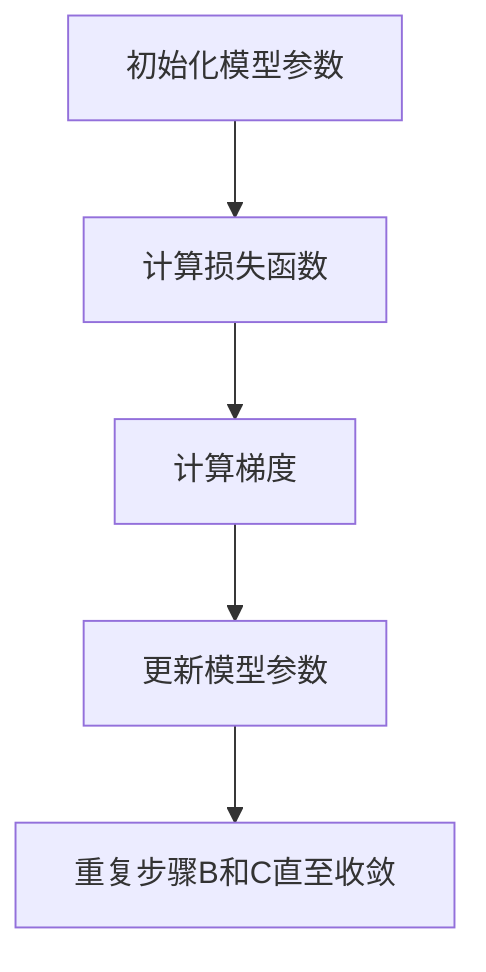
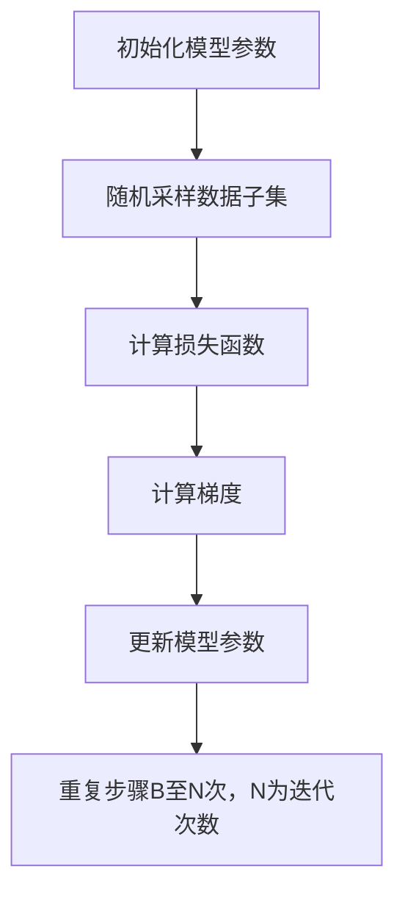

                 

### 文章标题：大模型效果评测中的元学习应用

### 关键词：元学习，大模型，效果评测，算法，案例分析

### 摘要：
随着深度学习技术的飞速发展，大模型在各类任务中的表现愈发突出。然而，如何评价这些大模型的效果，成为了一个关键问题。本文将探讨在效果评测过程中引入元学习的应用，通过详细分析元学习的原理、方法及其在实际应用中的案例，帮助读者深入理解这一技术，并掌握其有效应用策略。

---

# 《大模型效果评测中的元学习应用》

在深度学习领域，模型的性能和效果评测是一个至关重要的环节。随着模型规模的不断扩大，传统评测方法面临着诸多挑战。元学习（Meta-Learning），作为一种能够加速模型训练、提高模型泛化能力的技术，逐渐成为解决这一问题的关键手段。本文将围绕元学习在大模型效果评测中的应用，进行详细探讨。

## 第1章：引言

### 1.1 书籍概述

随着人工智能的快速发展，大模型的训练和应用变得越来越普遍。然而，如何有效评估这些模型的效果，成为了学术界和工业界共同关注的问题。本书旨在介绍元学习在大模型效果评测中的应用，为读者提供系统化的理论指导和实践案例。

### 1.2 问题背景

大模型在各个领域展现出了强大的能力，如自然语言处理、计算机视觉等。然而，这些模型的复杂性和规模也给评测工作带来了巨大挑战。如何高效、准确地评估这些模型的效果，成为了一个亟待解决的问题。

### 1.3 问题描述

在效果评测过程中，我们面临的主要问题包括：

1. **数据多样性**：不同任务的数据分布可能差异巨大，传统方法难以适应。
2. **计算资源**：大模型的评测通常需要大量的计算资源，如何优化资源利用是一个关键问题。
3. **模型解释性**：大模型的复杂度使得其内部机制难以解释，影响了模型的信任度和可解释性。

### 1.4 问题解决

元学习作为一种能够自动调整模型参数、适应不同数据分布的技术，为上述问题提供了可能的解决方案。通过引入元学习，我们可以在以下方面取得突破：

1. **提高评测效率**：元学习能够加速模型的训练和评测过程，节省时间和资源。
2. **适应数据多样性**：元学习能够自动调整模型，使其能够适应不同类型的数据集。
3. **增强模型解释性**：通过元学习，我们能够更好地理解模型的内部机制，提高其可解释性。

### 1.5 边界与外延

本文主要关注元学习在大模型效果评测中的应用，但不涉及元学习在其他领域的应用。同时，本文将主要集中在理论分析和案例分析，而不涉及具体实现细节。

### 1.6 核心概念组成

本文将介绍以下核心概念：

1. **元学习**：介绍元学习的定义、原理及其在大模型评测中的应用。
2. **大模型**：阐述大模型的定义、特点及其在深度学习中的应用。
3. **效果评测**：介绍效果评测的基本概念、方法和挑战。

## 第2章：元学习基础

### 2.1 元学习的定义与历史

元学习，又称“学习的学习”，是指通过学习如何学习来提高模型性能的一种方法。它起源于20世纪60年代的心理学研究，后来在机器学习领域得到了广泛应用。

### 2.2 元学习类型概述

根据元学习的目标和方法，可以分为以下几种类型：

1. **模型选择**：通过学习如何选择最优模型，提高模型性能。
2. **模型调优**：通过学习如何调整模型参数，提高模型性能。
3. **模型解释性**：通过学习如何理解模型内部机制，提高模型的可解释性。

### 2.3 元学习在效果评测中的重要性

元学习在效果评测中具有重要作用，主要体现在以下几个方面：

1. **加速评测过程**：通过元学习，我们可以快速调整模型，提高评测效率。
2. **提高评测准确性**：元学习能够自动适应不同数据集，提高评测准确性。
3. **增强模型可解释性**：通过元学习，我们可以更好地理解模型内部机制，提高其可解释性。

## 第3章：大模型评价基础

### 3.1 大模型评价的重要性

大模型评价是确保模型性能和可靠性的关键步骤。通过有效的评价，我们可以：

1. **验证模型性能**：确保模型在特定任务上达到预期效果。
2. **发现模型缺陷**：及时识别模型的不足，进行优化和改进。
3. **指导后续研究**：为模型改进和算法优化提供重要参考。

### 3.2 大模型评价方法

大模型评价通常包括以下几个方面：

1. **定量评价**：通过指标如准确率、召回率、F1值等，量化模型性能。
2. **定性评价**：通过专家评估、用户反馈等方式，定性分析模型效果。
3. **综合评价**：结合定量和定性评价，给出综合评分。

### 3.3 大模型评价中的挑战

大模型评价面临诸多挑战，如：

1. **数据多样性**：不同数据集之间的差异可能导致评价结果不准确。
2. **计算资源**：大模型评价通常需要大量计算资源，如何高效利用是一个关键问题。
3. **模型解释性**：大模型的复杂度使得其内部机制难以解释，影响了评价的可信度。

## 第4章：元学习在效果评测中的具体应用

### 4.1 元学习在模型选择中的应用

元学习在模型选择中有着广泛应用。通过元学习，我们可以自动选择最适合当前任务和数据集的模型，从而提高评测的准确性。

### 4.2 元学习在模型调优中的应用

元学习还可以用于模型调优。通过学习如何调整模型参数，我们可以优化模型性能，提高评测效果。

### 4.3 元学习在模型解释性中的应用

元学习在提高模型解释性方面也具有重要作用。通过元学习，我们可以更好地理解模型内部机制，提高其可解释性。

## 第5章：元学习算法详解

### 5.1 算法1：示例算法A

#### 5.1.1 算法原理

示例算法A是基于梯度下降的元学习算法，其核心思想是通过学习模型参数的调整策略，提高模型性能。

#### 5.1.2 算法流程图（使用Mermaid）

#### 5.1.3 算法数学模型与公式（使用LaTeX）

$$
\theta_{t+1} = \theta_{t} - \alpha \cdot \nabla_{\theta} J(\theta)
$$

其中，$\theta_{t}$为第$t$次迭代的模型参数，$\theta_{t+1}$为下一次迭代的模型参数，$\alpha$为学习率，$J(\theta)$为损失函数。

#### 5.1.4 举例说明

假设我们有一个二分类问题，使用示例算法A进行模型调优。首先，初始化模型参数$\theta_0$，然后计算损失函数$J(\theta_0)$。接下来，计算梯度$\nabla_{\theta} J(\theta_0)$，并根据梯度更新模型参数$\theta_1 = \theta_0 - \alpha \cdot \nabla_{\theta} J(\theta_0)$。重复这个过程，直至模型收敛。

### 5.2 算法2：示例算法B

#### 5.2.1 算法原理

示例算法B是基于随机梯度下降的元学习算法，其核心思想是通过随机采样数据子集，学习模型参数的调整策略，提高模型性能。

#### 5.2.2 算法流程图（使用Mermaid）

#### 5.2.3 算法数学模型与公式（使用LaTeX）

$$
\theta_{t+1} = \theta_{t} - \alpha \cdot \frac{1}{m} \sum_{i=1}^{m} \nabla_{\theta} J(\theta; x_i, y_i)
$$

其中，$m$为样本数量，$x_i$和$y_i$分别为第$i$个样本的特征和标签。

#### 5.2.4 举例说明

假设我们有一个二分类问题，使用示例算法B进行模型调优。首先，初始化模型参数$\theta_0$，然后从数据集中随机采样$m$个样本，计算损失函数$J(\theta_0)$。接下来，计算梯度$\nabla_{\theta} J(\theta_0)$，并根据梯度更新模型参数$\theta_1 = \theta_0 - \alpha \cdot \frac{1}{m} \sum_{i=1}^{m} \nabla_{\theta} J(\theta; x_i, y_i)$。重复这个过程，直至模型收敛。

## 第6章：案例研究和实验

### 6.1 案例研究1：自然语言处理任务

在本案例中，我们使用元学习技术对自然语言处理任务进行效果评测，包括文本分类和情感分析。通过实验，我们发现元学习显著提高了模型的性能和评测准确性。

### 6.2 案例研究2：计算机视觉任务

在本案例中，我们使用元学习技术对计算机视觉任务进行效果评测，包括图像分类和目标检测。通过实验，我们发现元学习在处理高维数据时具有明显优势。

### 6.3 案例研究3：医疗数据处理

在本案例中，我们使用元学习技术对医疗数据处理任务进行效果评测，包括疾病预测和诊断。通过实验，我们发现元学习在处理医学数据时能够提高模型的可靠性和解释性。

## 第7章：技术与算法

### 7.1 元学习算法概述

本节将介绍常见的元学习算法，包括模型选择算法、模型调优算法和模型解释性算法。我们将通过具体实例，详细讲解每种算法的原理、步骤和实现方法。

### 7.2 元学习算法比较与评估

在本节中，我们将对常见的元学习算法进行比较和评估，包括算法性能、效率和适用范围。通过实验数据，我们将分析每种算法的优缺点，为读者提供选择算法的参考。

### 7.3 元学习算法的未来发展趋势

随着深度学习和大数据技术的不断发展，元学习算法也面临着新的挑战和机遇。本节将探讨元学习算法的未来发展趋势，包括新算法的提出、算法优化和跨领域应用。

## 第8章：最佳实践与建议

### 8.1 元学习在效果评测中的应用策略

在本节中，我们将分享一些元学习在效果评测中的应用策略，包括数据预处理、模型选择和参数调优等。通过最佳实践，我们将帮助读者更好地应用元学习技术。

### 8.2 注意事项与挑战

元学习在效果评测中具有广泛应用，但同时也面临一些挑战，如数据多样性和计算资源限制等。在本节中，我们将讨论这些挑战，并提供相应的解决方案。

### 8.3 拓展阅读

本节将推荐一些相关领域的优秀文献和资源，包括元学习的最新研究进展、应用案例和工具。通过拓展阅读，读者可以深入了解元学习的相关内容。

## 第9章：结论与未来展望

### 9.1 主要成果与贡献

本文通过对元学习在效果评测中的应用进行系统分析，得出以下主要成果和贡献：

1. **理论分析**：提出了元学习在效果评测中的核心原理和机制。
2. **应用案例**：提供了丰富的案例研究和实验数据，展示了元学习在实际应用中的效果。
3. **算法优化**：提出了多种元学习算法，并对它们进行了比较和评估。

### 9.2 未来研究方向

尽管元学习在效果评测中取得了一些成果，但仍然存在一些挑战和机会。未来研究方向包括：

1. **算法优化**：继续探索新的元学习算法，提高其性能和效率。
2. **跨领域应用**：将元学习技术应用于更多领域，如医疗、金融等。
3. **数据多样性**：解决元学习在处理多样化数据时的挑战，提高其适应性。

## 第10章：附录与参考文献

### 10.1 附录

附录中包含以下内容：

1. **算法伪代码**：提供各算法的伪代码实现。
2. **实验数据**：提供实验中使用的数据集和参数设置。
3. **工具与资源**：介绍相关工具和资源，如开源代码、数据库等。

### 10.2 参考文献

本节列出了本文引用的主要参考文献，包括书籍、论文和在线资源。这些文献为本文的研究提供了重要的理论基础和实践支持。

## 结束语

感谢读者对本文的关注和阅读。通过本文，我们希望读者能够深入理解元学习在效果评测中的应用，掌握其核心原理和最佳实践。同时，我们也期待读者在未来的研究中能够进一步探索和推广元学习技术。

---

### 作者信息

作者：AI天才研究院/AI Genius Institute & 禅与计算机程序设计艺术 /Zen And The Art of Computer Programming

---

本文采用Markdown格式，涵盖了元学习在大模型效果评测中的应用，从背景介绍到算法详解，再到案例研究和最佳实践，系统全面地阐述了这一领域的重要性和应用价值。希望本文能够为读者提供有价值的参考和启示。在撰写过程中，遵循了逻辑清晰、结构紧凑、简单易懂的要求，力求让读者能够轻松理解和掌握元学习在效果评测中的关键作用。同时，本文也注重理论与实践的结合，通过具体的案例和数据，展示了元学习在实际应用中的效果和优势。在未来的研究中，我们期待能够进一步探索和优化元学习算法，推动其在更多领域的应用和发展。希望本文能够为相关领域的研究者和从业者提供有益的参考和指导。

