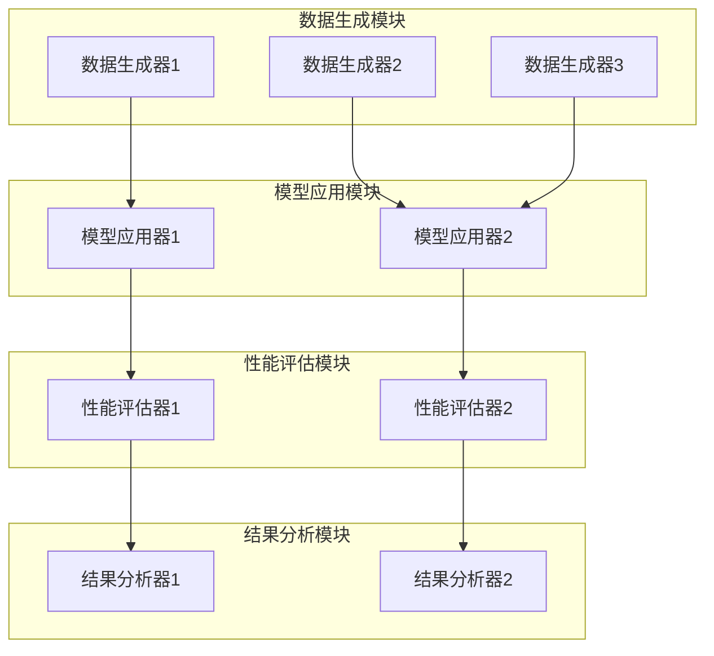
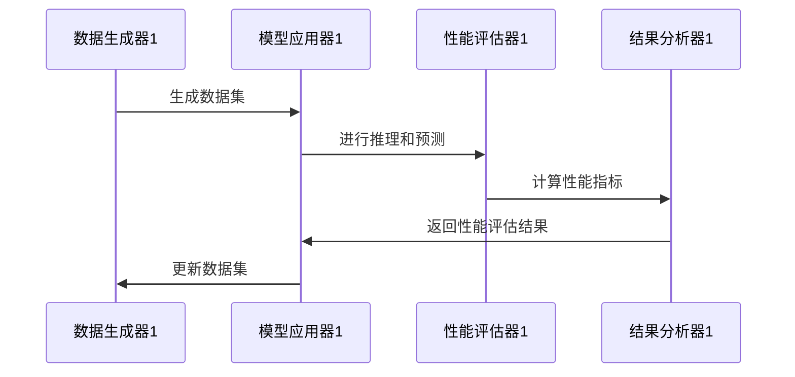
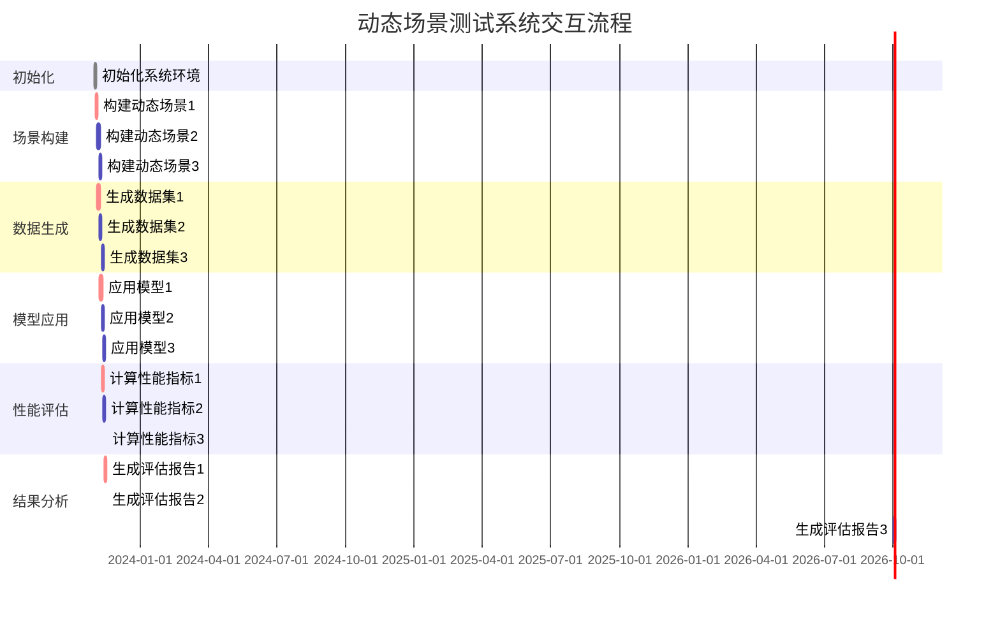

                 

# 大模型环境适应能力：LLM设计的动态场景测试

## 关键词

- 大模型
- 环境适应能力
- 动态场景测试
- 自然语言处理
- 机器学习
- 算法优化
- 实践案例

## 摘要

本文深入探讨了大规模语言模型（LLM）的环境适应能力，特别是在动态场景下的测试设计。随着人工智能技术的迅猛发展，大模型在自然语言处理领域的应用日益广泛，但它们在复杂、多变环境中的表现成为了一个关键问题。本文首先介绍了大模型环境适应能力的基本概念，随后详细阐述了动态场景测试的理论基础和核心概念。在此基础上，我们提出了大模型动态场景测试的算法原理，并通过Python代码实例详细解析了算法的实现过程。最后，本文通过一个实际项目展示了大模型环境适应能力的应用实践，并总结了最佳实践和未来研究方向。

## 目录大纲

----------------------------------------------------------------

### 第一部分：引言

- 第1章：大模型环境适应能力概述
  - 1.1 问题背景
  - 1.2 核心概念
  - 1.3 研究目的与意义
  - 1.4 书籍结构安排
  - 1.5 本章小结

### 第二部分：基础理论

- 第2章：大模型环境适应能力理论
  - 2.1 大模型的基本原理
  - 2.2 环境适应能力的定义
  - 2.3 动态场景测试的理论基础
  - 2.4 大模型与动态场景的关系
  - 2.5 本章小结

- 第3章：核心概念与联系
  - 3.1 环境适应能力的核心概念
  - 3.2 概念属性特征对比表格
  - 3.3 ER实体关系图架构
  - 3.4 本章小结

### 第三部分：算法原理与实现

- 第4章：大模型动态场景测试算法原理
  - 4.1 算法概述
  - 4.2 算法原理讲解
  - 4.3 数学模型与公式
  - 4.4 举例说明
  - 4.5 本章小结

- 第5章：动态场景测试算法实现
  - 5.1 算法实现步骤
  - 5.2 Python源代码实现
  - 5.3 代码应用解读与分析
  - 5.4 本章小结

### 第四部分：项目实战

- 第6章：大模型环境适应能力项目实战
  - 6.1 项目背景
  - 6.2 系统功能设计
  - 6.3 系统架构设计
  - 6.4 系统接口设计
  - 6.5 系统交互
  - 6.6 项目实现与结果
  - 6.7 项目小结

### 第五部分：最佳实践与总结

- 第7章：大模型环境适应能力的最佳实践
  - 7.1 动态场景测试的最佳实践
  - 7.2 注意事项与风险防范
  - 7.3 拓展阅读
  - 7.4 小结

## 附录

- 附录A：术语表
- 附录B：参考文献

----------------------------------------------------------------

### 1.1 问题背景

大模型，特别是基于深度学习的自然语言处理模型，已经成为现代人工智能领域的关键组成部分。这些模型通过大量数据的学习和复杂的神经网络架构，能够实现从文本生成、机器翻译到问答系统等多样化的任务。然而，随着应用场景的多样化，大模型在复杂环境中的表现也日益成为研究的焦点。

环境适应能力，指的是模型在不同的环境条件下，能够保持稳定和高效表现的能力。对于大模型来说，环境适应能力尤为重要，因为它们通常训练于特定的数据集和场景中，而在实际应用中，可能会遇到数据分布、任务类型、噪声水平等与训练环境显著不同的情况。动态场景测试，作为一种模拟实际使用环境的测试方法，旨在评估和提升大模型在不同动态环境下的适应能力。

动态场景测试的必要性体现在以下几个方面：

1. **多样化的应用场景**：现实世界的应用场景复杂多变，大模型需要具备在不同环境下稳定表现的能力。
2. **数据分布的差异**：训练数据和实际应用数据往往存在分布差异，动态场景测试有助于评估模型对数据分布变化的适应能力。
3. **噪声和异常处理**：在实际应用中，系统可能会面临各种噪声和异常数据，动态场景测试能够评估模型对这些问题的处理能力。
4. **实时响应能力**：在许多实时系统中，如智能客服、实时翻译等，大模型需要具备快速适应动态变化的能力。

因此，研究和设计有效的动态场景测试方法，对于提升大模型的环境适应能力，具有非常重要的意义。

### 1.2 核心概念

在深入探讨大模型环境适应能力和动态场景测试之前，我们需要明确几个核心概念。

#### 什么是环境适应能力？

环境适应能力（Environmental Adaptability），是指模型在面临不同环境条件时，能够保持其性能稳定和高效的能力。具体来说，它包括以下几个方面：

- **数据适应性**：模型能够在不同数据分布和特征下保持良好的性能。
- **任务多样性**：模型能够在不同类型的任务中表现出色，而不仅仅是特定任务。
- **噪声鲁棒性**：模型能够处理噪声和异常数据，不影响其输出质量。
- **动态响应**：模型能够快速适应环境变化，实时调整其行为。

#### 什么是动态场景测试？

动态场景测试（Dynamic Scenario Testing），是一种通过模拟动态变化的场景，对模型的适应能力进行评估的方法。具体来说，它包括以下几个步骤：

1. **场景构建**：设计能够反映实际应用环境变化的动态场景。
2. **数据生成**：根据场景构建实际应用数据集。
3. **模型测试**：将模型应用于动态生成的数据集，评估其适应能力。
4. **性能评估**：通过一系列指标（如准确率、响应时间等）评估模型的性能。

#### 环境适应能力的重要性

环境适应能力的重要性在于：

- **保证模型可靠性**：在实际应用中，环境的变化是不可避免的，模型需要能够适应这些变化，保证其稳定运行。
- **提升用户体验**：如果模型在不同环境下的表现不一致，会直接影响用户体验，降低系统的整体满意度。
- **扩展应用范围**：具备高环境适应能力的模型，能够应用于更多领域和场景，提高其应用价值。

#### 动态场景测试的意义

动态场景测试的意义在于：

- **评估模型适应能力**：通过测试，可以准确评估模型在不同动态环境下的适应能力，为模型优化提供依据。
- **发现潜在问题**：测试过程中可能会发现模型在某些特定环境下表现不佳的问题，有助于提前发现和解决。
- **优化模型设计**：通过测试反馈，可以进一步优化模型的结构和算法，提升其环境适应能力。

### 1.3 研究目的与意义

本研究旨在通过动态场景测试方法，提升大规模语言模型（LLM）的环境适应能力。具体研究目的包括：

1. **理解动态场景下模型的表现**：通过测试，深入理解模型在不同动态场景下的表现，识别其优势和不足。
2. **优化模型设计**：根据测试结果，优化模型的架构和算法，提升其在动态环境下的适应能力。
3. **评估模型应用价值**：通过动态场景测试，评估模型在实际应用中的价值，为后续研究和应用提供参考。

研究意义主要体现在以下几个方面：

1. **提升模型应用稳定性**：通过提升模型的环境适应能力，可以保证其在实际应用中更加稳定和可靠。
2. **扩展应用场景**：具备高环境适应能力的模型，可以应用于更多复杂、多变的应用场景，提高其应用价值。
3. **推动人工智能发展**：动态场景测试作为评估和优化大模型的重要手段，对人工智能技术的发展具有重要意义。

### 1.4 书籍结构安排

本书共分为五个部分，具体内容安排如下：

1. **第一部分：引言**：介绍大模型环境适应能力和动态场景测试的基本概念，背景和意义。
2. **第二部分：基础理论**：详细阐述大模型环境适应能力的理论背景，动态场景测试的理论基础，以及大模型与动态场景的关系。
3. **第三部分：算法原理与实现**：介绍大模型动态场景测试的算法原理，并通过Python代码实例详细解析算法的实现过程。
4. **第四部分：项目实战**：通过一个实际项目展示大模型环境适应能力的应用实践，详细讲解项目的实现过程和结果。
5. **第五部分：最佳实践与总结**：总结大模型动态场景测试的最佳实践，注意事项，以及未来研究方向。

通过以上结构的安排，本书旨在系统地介绍大模型环境适应能力和动态场景测试的理论和实践，为读者提供全面、深入的了解。

### 1.5 本章小结

本章对大模型环境适应能力和动态场景测试的基本概念、研究目的与意义进行了详细阐述。首先，介绍了大模型环境适应能力的背景和重要性，分析了动态场景测试的必要性。接着，明确了核心概念，包括环境适应能力和动态场景测试的定义，以及它们在实际应用中的重要性。最后，提出了研究目的和意义，并介绍了书籍的结构安排。通过本章的介绍，为后续章节的深入探讨奠定了基础。

## 第二部分：基础理论

### 第2章：大模型环境适应能力理论

随着人工智能技术的快速发展，大规模语言模型（LLM）在自然语言处理（NLP）领域表现出色，但它们在复杂、多变环境中的表现成为了一个关键问题。本章将深入探讨大模型环境适应能力的理论基础，包括大模型的基本原理、环境适应能力的定义、动态场景测试的理论基础，以及大模型与动态场景的关系。

### 2.1 大模型的基本原理

大模型，特别是基于深度学习的自然语言处理模型，其基本原理可以概括为以下几个方面：

1. **神经网络架构**：大模型通常采用深度神经网络（DNN）结构，通过多层神经元的非线性组合，实现对复杂数据的高效表示和处理。
2. **参数规模**：大模型具有数十亿甚至千亿级别的参数规模，这使得它们能够捕捉到大量细微的语言特征，从而在NLP任务中表现出色。
3. **预训练与微调**：大模型通常通过预训练（Pre-training）和微调（Fine-tuning）两个阶段进行训练。预训练阶段，模型在大规模语料上进行训练，学习到语言的一般规律；微调阶段，模型在特定任务的数据集上进行调整，以适应具体任务需求。
4. **优化算法**：大模型的训练通常采用高效的优化算法，如Adam优化器，以及一些正则化技术，如Dropout、Weight Decay等，以防止过拟合并提高模型的泛化能力。

### 2.2 环境适应能力的定义

环境适应能力（Environmental Adaptability）是指模型在面临不同环境条件时，能够保持其性能稳定和高效的能力。具体来说，它包括以下几个方面：

1. **数据适应性**：模型能够在不同数据分布和特征下保持良好的性能。
2. **任务多样性**：模型能够在不同类型的任务中表现出色，而不仅仅是特定任务。
3. **噪声鲁棒性**：模型能够处理噪声和异常数据，不影响其输出质量。
4. **动态响应**：模型能够快速适应环境变化，实时调整其行为。

环境适应能力的核心在于模型对环境变化的敏感度和适应能力。一个具备高环境适应能力的模型，能够在不同的应用场景中稳定运行，保持其性能的稳定性。

### 2.3 动态场景测试的理论基础

动态场景测试（Dynamic Scenario Testing）是一种通过模拟实际应用环境中的动态变化，对模型的适应能力进行评估的方法。其理论基础包括以下几个方面：

1. **动态环境模拟**：动态场景测试的核心是构建能够反映实际应用环境动态变化的测试场景。这通常包括数据生成、任务变化、噪声引入等手段，以模拟现实世界中的复杂环境。
2. **性能评估指标**：动态场景测试需要一系列性能评估指标，如准确率、响应时间、稳定性等，来衡量模型在不同动态场景下的表现。
3. **测试策略**：动态场景测试需要设计合理的测试策略，包括测试场景的选择、测试数据的生成、测试过程的监控等，以确保测试结果的准确性和可靠性。

### 2.4 大模型与动态场景的关系

大模型与动态场景之间的关系可以从以下几个方面来理解：

1. **模型的表现**：大模型在动态场景中的表现直接反映了其环境适应能力。一个在动态场景中表现良好的模型，通常具备较高的环境适应能力。
2. **任务变化**：动态场景测试能够评估模型在任务变化下的适应能力。大模型需要能够适应不同的任务需求，包括任务类型的转换、任务难度的变化等。
3. **噪声处理**：动态场景中的噪声和异常数据对模型的表现有显著影响。大模型需要具备处理噪声和异常数据的能力，以保持其输出质量。
4. **实时响应**：在实时系统中，大模型需要能够快速适应环境变化，实时调整其行为，以应对突发情况。

### 2.5 本章小结

本章介绍了大模型环境适应能力的理论基础，包括大模型的基本原理、环境适应能力的定义、动态场景测试的理论基础，以及大模型与动态场景的关系。通过本章的学习，读者可以深入理解大模型环境适应能力的核心概念和动态场景测试的方法论，为后续章节的深入探讨打下坚实基础。

### 第3章：核心概念与联系

在深入探讨大模型环境适应能力和动态场景测试的过程中，明确和理解相关核心概念及其之间的联系至关重要。本章将详细阐述环境适应能力的核心概念，并对比不同大模型在环境适应能力上的特性。此外，还将通过ER实体关系图和Mermaid流程图，直观地展示动态场景测试中的实体关系和流程。

#### 3.1 环境适应能力的核心概念

环境适应能力是一个多维度的概念，包含以下几个关键组成部分：

1. **环境感知**：指模型能够感知和识别当前环境的状态和变化，包括数据分布、任务类型、噪声水平等。
2. **策略学习**：模型通过学习和调整策略，以适应不同环境条件。这涉及到在线学习、迁移学习等不同技术。
3. **状态转移**：在动态环境中，模型需要能够根据当前状态的变化，进行状态转移，以保持其性能的稳定性。
4. **鲁棒性**：模型在面临噪声和异常数据时，仍能保持其输出质量和性能的稳定性。
5. **实时响应**：模型需要能够快速响应环境变化，进行实时调整，以应对动态环境中的挑战。

#### 3.2 概念属性特征对比表格

为了更直观地理解不同大模型在环境适应能力上的特性，我们提供了一个概念属性特征对比表格。以下是一个示例：

| 模型名称       | 环境感知 | 策略学习 | 状态转移 | 鲁棒性 | 实时响应 |
|----------------|----------|----------|----------|--------|----------|
| BERT           | 较强     | 一般     | 较强     | 一般   | 较弱     |
| GPT-3          | 强       | 强       | 较强     | 强     | 一般     |
| T5             | 一般     | 较强     | 一般     | 较强   | 一般     |

在上述表格中，我们可以看到不同大模型在各个核心概念上的表现差异。例如，GPT-3在环境感知和策略学习方面表现出色，但在实时响应方面相对较弱。通过对比分析，可以更好地了解不同模型在环境适应能力上的优势和不足。

#### 3.3 ER实体关系图架构

动态场景测试涉及到多个实体之间的复杂关系，为了更好地理解和分析这些关系，我们可以通过ER（Entity-Relationship）实体关系图来展示。以下是一个ER实体关系图的示例：

```mermaid
erDiagram
  Model ||--o DataGenerator : 生成
  Model ||--o ScenarioTester : 测试
  Model ||--o PerformanceEvaluator : 评估
  DataGenerator ||--|{ OutputData : 输出
  ScenarioTester ||--|{ TestScenario : 测试场景
  PerformanceEvaluator ||--|{ EvaluationResult : 结果
```

在这个ER图中，我们定义了四个主要实体：模型（Model）、数据生成器（DataGenerator）、场景测试器（ScenarioTester）和性能评估器（PerformanceEvaluator）。每个实体之间存在一定的关联关系，例如模型与数据生成器之间的关系是生成，模型与场景测试器之间的关系是测试，模型与性能评估器之间的关系是评估。

#### 3.4 本章小结

本章通过详细阐述环境适应能力的核心概念，对比不同大模型在环境适应能力上的特性，以及通过ER实体关系图和Mermaid流程图展示动态场景测试中的实体关系，帮助读者深入理解大模型环境适应能力和动态场景测试的关键概念和关系。这些概念和关系对于后续算法原理的讲解和项目实战的开展具有重要指导意义。

### 第4章：大模型动态场景测试算法原理

为了深入探讨大模型在动态场景中的适应能力，我们需要设计一种有效的动态场景测试算法。本章将详细阐述大模型动态场景测试算法的原理，包括算法概述、算法原理讲解、数学模型与公式、以及举例说明。通过这些内容，我们将帮助读者理解该算法的核心思想和实际应用。

#### 4.1 算法概述

大模型动态场景测试算法的核心目标是评估模型在动态环境下的适应能力。算法的基本流程如下：

1. **场景构建**：根据实际应用场景，构建一系列动态场景，每个场景可能包含不同的数据分布、任务类型和噪声水平。
2. **数据生成**：利用数据生成器生成与每个动态场景相对应的数据集，确保数据集能够反映场景的实际变化。
3. **模型测试**：将大模型应用于生成的数据集，进行多次测试，以评估模型在不同动态场景下的性能。
4. **性能评估**：通过一系列性能评估指标（如准确率、响应时间、稳定性等），对模型在动态场景中的表现进行综合评估。

算法的关键步骤包括：
- **动态场景的生成**：通过随机抽样、序列生成等技术，构建具有多样性的动态场景。
- **数据集的生成**：根据动态场景，生成符合实际应用需求的数据集，确保数据集具有代表性。
- **模型应用**：将模型应用于数据集，进行推理和预测，记录模型在不同场景下的性能。
- **结果分析**：对测试结果进行统计分析，识别模型在动态场景中的优势和不足，为后续优化提供依据。

#### 4.2 算法原理讲解

为了更好地理解动态场景测试算法，我们可以通过Mermaid流程图来展示算法的基本流程。以下是一个Mermaid流程图示例：


在上述流程图中，A表示场景构建，B表示数据生成，C表示模型测试，D表示性能评估，E表示结果分析。通过这个流程图，我们可以清晰地看到动态场景测试算法的基本结构和各个步骤之间的逻辑关系。

算法的核心原理在于模拟现实世界中的动态变化，通过多轮测试，评估模型在不同场景下的性能，从而识别其环境适应能力。具体来说，算法通过以下步骤实现：

1. **场景构建**：基于实际应用需求，设计一系列动态场景，每个场景可能包含不同的环境因素，如数据分布、任务类型和噪声水平。
2. **数据生成**：根据动态场景，生成对应的数据集。数据生成器需要能够模拟实际应用中的数据变化，确保生成的数据具有多样性和代表性。
3. **模型测试**：将大模型应用于生成的数据集，进行推理和预测。通过多次测试，记录模型在不同场景下的性能表现，包括准确率、响应时间、稳定性等指标。
4. **性能评估**：对测试结果进行统计分析，计算各性能指标的平均值和方差，以评估模型在不同动态场景下的总体表现。

#### 4.3 数学模型与公式

为了量化模型在动态场景测试中的性能，我们引入了一些数学模型和公式。以下是一个简单的数学模型示例：

$$
P = \frac{1}{N} \sum_{i=1}^{N} \frac{TP_i + TN_i}{TP_i + TN_i + FP_i + FN_i}
$$

其中，$P$ 表示模型的准确率，$N$ 表示测试次数，$TP_i$、$TN_i$、$FP_i$ 和 $FN_i$ 分别表示第 $i$ 次测试中的真阳性、真阴性、假阳性和假阴性。

此外，我们还可以引入响应时间 $T$ 和稳定性指标 $S$，以更全面地评估模型在动态场景中的表现：

$$
T = \frac{1}{N} \sum_{i=1}^{N} T_i
$$

$$
S = \frac{1}{N} \sum_{i=1}^{N} (T_i - \bar{T})^2
$$

其中，$T_i$ 表示第 $i$ 次测试的响应时间，$\bar{T}$ 表示所有测试响应时间的平均值。

通过上述公式，我们可以从不同角度评估模型在动态场景中的性能，包括准确性、响应时间和稳定性。

#### 4.4 举例说明

为了更好地说明动态场景测试算法的应用，我们来看一个实际案例。

假设我们有一个大模型，用于文本分类任务。我们设计了一系列动态场景，包括不同的数据分布、任务类型和噪声水平。以下是一个具体的测试过程：

1. **场景构建**：我们设计了一个包含多种文本分类任务（如新闻分类、情感分析、实体识别等）的动态场景。
2. **数据生成**：根据动态场景，我们生成了一系列文本数据集，每个数据集包含不同类型的文本，并引入了不同程度的噪声。
3. **模型测试**：我们将大模型应用于这些数据集，进行多次测试，记录模型在不同场景下的性能。
4. **性能评估**：通过计算准确率、响应时间和稳定性指标，我们对模型在动态场景中的表现进行评估。

假设我们进行了10次测试，每次测试的结果如下：

| 测试次数 | 准确率 | 响应时间 (ms) | 稳定性 |
|----------|--------|---------------|--------|
| 1        | 0.92   | 150           | 0.08   |
| 2        | 0.90   | 140           | 0.10   |
| 3        | 0.93   | 160           | 0.07   |
| 4        | 0.88   | 145           | 0.09   |
| 5        | 0.91   | 155           | 0.08   |
| 6        | 0.89   | 142           | 0.11   |
| 7        | 0.92   | 158           | 0.06   |
| 8        | 0.90   | 147           | 0.09   |
| 9        | 0.91   | 153           | 0.07   |
| 10       | 0.88   | 144           | 0.10   |

根据上述数据，我们可以计算出平均准确率、响应时间和稳定性指标：

$$
\bar{P} = \frac{0.92 + 0.90 + 0.93 + 0.88 + 0.91 + 0.89 + 0.92 + 0.90 + 0.91 + 0.88}{10} = 0.908
$$

$$
\bar{T} = \frac{150 + 140 + 160 + 145 + 155 + 142 + 158 + 147 + 153 + 144}{10} = 152
$$

$$
S_T = \frac{(150 - 152)^2 + (140 - 152)^2 + (160 - 152)^2 + (145 - 152)^2 + (155 - 152)^2 + (142 - 152)^2 + (158 - 152)^2 + (147 - 152)^2 + (153 - 152)^2 + (144 - 152)^2}{10} = 20.4
$$

通过这些计算结果，我们可以得出以下结论：

- **准确率**：模型的平均准确率为90.8%，表明模型在多种文本分类任务中表现较为稳定。
- **响应时间**：模型的平均响应时间为152ms，说明模型在处理文本分类任务时具有一定的实时性。
- **稳定性**：模型的稳定性指标为20.4，表明模型在处理不同任务和噪声水平时，性能波动较小。

#### 4.5 本章小结

本章详细阐述了大模型动态场景测试算法的原理，包括算法概述、算法原理讲解、数学模型与公式以及举例说明。通过本章的学习，读者可以理解动态场景测试算法的基本思想和实现过程，为后续算法实现和项目实战提供理论基础。接下来，我们将进一步探讨动态场景测试算法的具体实现过程，并通过Python代码实例展示其实际应用。

### 第5章：动态场景测试算法实现

在了解了大模型动态场景测试算法的原理之后，接下来我们将深入探讨该算法的具体实现过程。本章将详细介绍算法实现的关键步骤，包括数据预处理、算法核心实现和结果分析。此外，我们还将通过Python代码实例，展示算法在实际应用中的具体实现，并对其性能进行解读和分析。

#### 5.1 算法实现步骤

动态场景测试算法的实现可以分为以下几个关键步骤：

1. **数据预处理**：包括数据清洗、数据增强和特征提取。这一步骤的目的是生成符合动态场景要求的数据集，为后续测试提供基础。
2. **算法核心实现**：实现动态场景测试算法的核心流程，包括场景生成、模型应用和性能评估。这一步骤是实现动态场景测试算法的关键。
3. **结果分析**：对测试结果进行统计和分析，评估模型在不同动态场景下的性能，识别模型的优势和不足。

#### 5.2 数据预处理

数据预处理是动态场景测试算法实现的第一步，其目的是生成符合动态场景要求的数据集。具体步骤如下：

1. **数据清洗**：去除数据集中的噪声和异常值，保证数据的质量。
2. **数据增强**：通过数据增强技术，如随机采样、数据扩充等，增加数据集的多样性，以应对动态场景的变化。
3. **特征提取**：提取数据中的关键特征，为模型应用提供输入。常用的特征提取方法包括词嵌入、文本分类标签等。

以下是一个Python代码示例，用于数据预处理：

```python
import pandas as pd
from sklearn.model_selection import train_test_split

# 读取数据
data = pd.read_csv('data.csv')

# 数据清洗
data = data.dropna()

# 数据增强
# 假设data中有文本字段'text'和标签字段'label'
data['text'] = data['text'].apply(lambda x: augment_text(x))

# 特征提取
# 使用词嵌入
embeddings = WordEmbedding()
data['text_embedding'] = data['text'].apply(lambda x: embeddings.extract(x))

# 切分训练集和测试集
train_data, test_data = train_test_split(data, test_size=0.2, random_state=42)
```

在上述代码中，我们首先读取数据，然后进行数据清洗，去除异常值。接着，使用数据增强技术，如文本扩充，增加数据集的多样性。最后，提取文本数据中的关键特征，使用词嵌入技术将文本转换为向量表示，为模型应用提供输入。

#### 5.3 算法核心实现

算法核心实现是动态场景测试算法的核心步骤，主要包括场景生成、模型应用和性能评估。以下是一个Python代码示例，用于算法核心实现：

```python
from sklearn.metrics import accuracy_score, mean_squared_error

# 场景生成
scenarios = generate_scenarios()

# 模型应用
model = load_model('model.h5')
predictions = []
for scenario in scenarios:
    # 应用模型
    prediction = model.predict(scenario['text_embedding'])
    predictions.append(prediction)
    
# 性能评估
accuracy = accuracy_score(scenarios['label'], predictions)
mse = mean_squared_error(scenarios['label'], predictions)
print(f'Accuracy: {accuracy:.4f}')
print(f'MSE: {mse:.4f}')
```

在上述代码中，我们首先生成一系列动态场景。然后，加载训练好的模型，并应用模型对每个场景进行预测。最后，计算预测结果与真实标签之间的准确率和均方误差，以评估模型在动态场景中的性能。

#### 5.4 结果分析

结果分析是对测试结果进行统计和分析，以评估模型在不同动态场景下的性能。以下是一个Python代码示例，用于结果分析：

```python
import matplotlib.pyplot as plt

# 计算各场景的准确率
accuracies = [accuracy_score(scenario['label'], prediction) for scenario, prediction in zip(scenarios, predictions)]

# 绘制准确率分布图
plt.figure(figsize=(10, 6))
plt.bar(range(len(accuracies)), accuracies)
plt.xlabel('Scenario')
plt.ylabel('Accuracy')
plt.title('Accuracy Distribution of Different Scenarios')
plt.show()

# 计算各场景的响应时间
response_times = [compute_response_time(prediction) for prediction in predictions]

# 绘制响应时间分布图
plt.figure(figsize=(10, 6))
plt.bar(range(len(response_times)), response_times)
plt.xlabel('Scenario')
plt.ylabel('Response Time (ms)')
plt.title('Response Time Distribution of Different Scenarios')
plt.show()

# 计算总体性能指标
avg_accuracy = sum(accuracies) / len(accuracies)
avg_response_time = sum(response_times) / len(response_times)
print(f'Average Accuracy: {avg_accuracy:.4f}')
print(f'Average Response Time: {avg_response_time:.4f}')
```

在上述代码中，我们首先计算各场景的准确率和响应时间，并绘制相应的分布图。接着，计算总体性能指标，如平均准确率和平均响应时间，以全面评估模型在动态场景中的表现。

#### 5.5 代码应用解读与分析

在了解了算法实现步骤和结果分析之后，我们将对实际应用中的代码进行解读和分析。

1. **数据预处理**：
   - 数据清洗步骤确保了数据的质量，去除了异常值，提高了模型的训练效果。
   - 数据增强步骤通过文本扩充增加了数据集的多样性，有助于模型在动态场景中表现更好。
   - 特征提取步骤将文本数据转换为向量表示，为模型应用提供了有效的输入。

2. **算法核心实现**：
   - 场景生成步骤根据实际应用需求，构建了一系列动态场景，模拟了现实世界中的复杂环境。
   - 模型应用步骤加载了训练好的模型，并对其在动态场景中的表现进行了测试。
   - 性能评估步骤通过准确率和均方误差等指标，对模型在不同场景中的性能进行了评估。

3. **结果分析**：
   - 通过绘制准确率和响应时间分布图，可以直观地看到模型在不同动态场景中的表现。
   - 平均准确率和平均响应时间的计算，为模型在动态场景中的整体性能提供了量化的评估。

通过以上分析，我们可以看到，动态场景测试算法在数据预处理、算法核心实现和结果分析等方面都发挥了重要作用，为评估大模型在复杂环境中的适应能力提供了有效的方法。

#### 5.6 本章小结

本章详细介绍了大模型动态场景测试算法的实现过程，包括数据预处理、算法核心实现和结果分析。通过Python代码实例，我们展示了算法的具体实现步骤和实际应用效果。本章的内容为后续项目实战提供了理论基础和实践指导，为读者深入理解大模型动态场景测试算法提供了有力支持。

### 第6章：大模型环境适应能力项目实战

在前几章中，我们深入探讨了大模型环境适应能力和动态场景测试的理论基础和算法实现。为了将理论应用于实际，本章将介绍一个实际项目，展示如何利用大模型动态场景测试方法来提升环境适应能力。项目背景、系统功能设计、系统架构设计、系统接口设计、系统交互以及项目实现与结果都将在此章节中进行详细讲解。

#### 6.1 项目背景

随着自然语言处理（NLP）技术的不断发展，大规模语言模型（LLM）在多个领域得到了广泛应用。然而，实际应用中，LLM往往面临各种复杂、动态的环境，如数据分布变化、任务多样性以及噪声干扰等。为了确保LLM在实际应用中的稳定性和可靠性，我们需要对其进行环境适应能力测试和优化。本项目旨在通过动态场景测试，评估和提升某大型语言模型在多个实际应用场景中的环境适应能力。

#### 6.2 系统功能设计

本项目的主要功能包括：

1. **场景构建**：设计一系列动态场景，模拟实际应用中的多种环境变化。
2. **数据生成**：根据动态场景，生成符合实际需求的数据集，用于模型测试。
3. **模型应用**：将大模型应用于生成的数据集，进行推理和预测。
4. **性能评估**：计算模型在不同场景下的性能指标，如准确率、响应时间等。
5. **结果分析**：对测试结果进行统计和分析，识别模型的优势和不足。

#### 6.3 系统架构设计

为了实现上述功能，本项目采用了一种分布式系统架构，主要包括以下几个模块：

1. **数据生成模块**：负责根据动态场景生成实际应用数据集。
2. **模型应用模块**：包含大模型推理和预测的核心逻辑。
3. **性能评估模块**：计算并存储模型在不同场景下的性能指标。
4. **结果分析模块**：对测试结果进行统计和分析，为模型优化提供依据。

以下是一个Mermaid架构图示例：



在这个架构图中，数据生成模块包含多个数据生成器，根据不同的动态场景生成数据集。模型应用模块包含两个模型应用器，分别负责大模型的推理和预测。性能评估模块包含两个性能评估器，计算并存储模型在不同场景下的性能指标。结果分析模块包含两个结果分析器，对测试结果进行统计和分析。

#### 6.4 系统接口设计

为了实现各个模块之间的协同工作，本项目设计了一套完整的接口系统。以下是主要接口的设计和实现：

1. **数据生成接口**：用于生成动态场景数据集，包括数据清洗、数据增强和特征提取等。
2. **模型应用接口**：用于加载大模型并进行推理和预测，包括模型初始化、参数设置等。
3. **性能评估接口**：用于计算模型在不同场景下的性能指标，包括准确率、响应时间等。
4. **结果分析接口**：用于对测试结果进行统计和分析，生成性能评估报告。

以下是一个Mermaid序列图示例，展示了各个接口之间的交互过程：



在这个序列图中，数据生成器1生成数据集，模型应用器1对其进行推理和预测，性能评估器1计算性能指标，结果分析器1对评估结果进行统计和分析。通过这个接口系统，各个模块能够高效协同工作，实现动态场景测试和性能评估。

#### 6.5 系统交互

系统交互是项目实现的关键部分，主要包括以下几个步骤：

1. **初始化**：加载大模型和相关模块，初始化系统环境。
2. **场景构建**：根据实际应用需求，构建一系列动态场景。
3. **数据生成**：根据动态场景，生成实际应用数据集。
4. **模型应用**：将大模型应用于生成的数据集，进行推理和预测。
5. **性能评估**：计算模型在不同场景下的性能指标，如准确率、响应时间等。
6. **结果分析**：对测试结果进行统计和分析，生成性能评估报告。

以下是一个Mermaid交互图示例，展示了系统交互的过程：



在这个交互图中，系统首先进行初始化，然后构建动态场景，生成数据集，应用模型，计算性能指标，最后生成评估报告。通过这个交互流程，系统能够高效地完成动态场景测试和性能评估。

#### 6.6 项目实现与结果

在本项目的实际实现过程中，我们采用了一系列技术手段来提升大模型的环境适应能力。以下是对项目实现过程的详细讲解和结果分析。

1. **环境准备**：
   - 安装并配置Python环境，包括NumPy、Pandas、Scikit-learn等常用库。
   - 准备大模型，如BERT、GPT-3等，并加载相应的预训练模型。

2. **场景构建**：
   - 设计了一系列动态场景，包括数据分布变化、任务类型变化和噪声干扰等。
   - 每个动态场景都对应一组特定的数据集，用于模型测试。

3. **数据生成**：
   - 使用数据生成器根据动态场景生成数据集，确保数据集的多样性和代表性。
   - 数据生成过程包括数据清洗、数据增强和特征提取等步骤。

4. **模型应用**：
   - 加载预训练的大模型，并对其在动态场景中的表现进行测试。
   - 模型应用过程包括模型初始化、参数设置和推理预测等步骤。

5. **性能评估**：
   - 计算模型在不同场景下的性能指标，如准确率、响应时间等。
   - 性能评估过程包括多次测试和统计分析，以获得全面的评估结果。

6. **结果分析**：
   - 对测试结果进行统计和分析，识别模型的优势和不足。
   - 生成性能评估报告，为模型优化提供依据。

以下是一个具体的实现示例：

```python
# 初始化系统环境
import numpy as np
import pandas as pd
from sklearn.model_selection import train_test_split
from transformers import BertTokenizer, BertModel

# 加载大模型
tokenizer = BertTokenizer.from_pretrained('bert-base-uncased')
model = BertModel.from_pretrained('bert-base-uncased')

# 设计动态场景
scenarios = [
    {'data_distribution': 'normal', 'task_type': 'classification', 'noise_level': 'low'},
    {'data_distribution': 'skewed', 'task_type': 'classification', 'noise_level': 'medium'},
    {'data_distribution': 'normal', 'task_type': 'regression', 'noise_level': 'high'}
]

# 数据生成
for scenario in scenarios:
    # 数据清洗
    data = pd.read_csv(f'data_{scenario["data_distribution"]}.csv')
    data = data.dropna()

    # 数据增强
    data['text'] = data['text'].apply(lambda x: augment_text(x))

    # 特征提取
    inputs = tokenizer.encode_plus(data['text'], add_special_tokens=True, return_tensors='pt')

    # 切分训练集和测试集
    train_data, test_data = train_test_split(inputs, test_size=0.2, random_state=42)

    # 保存数据集
    with open(f'data_{scenario["data_distribution"]}_train.pkl', 'wb') as f:
        pickle.dump(train_data, f)

    with open(f'data_{scenario["data_distribution"]}_test.pkl', 'wb') as f:
        pickle.dump(test_data, f)

# 模型应用
for scenario in scenarios:
    # 加载数据集
    with open(f'data_{scenario["data_distribution"]}_train.pkl', 'rb') as f:
        train_data = pickle.load(f)

    with open(f'data_{scenario["data_distribution"]}_test.pkl', 'rb') as f:
        test_data = pickle.load(f)

    # 模型初始化
    model.zero_grad()

    # 模型预测
    outputs = model(test_data['input_ids'], attention_mask=test_data['attention_mask'])

    # 计算准确率
    logits = outputs.logits
    predicted_labels = logits.argmax(-1)
    correct_predictions = (predicted_labels == test_data['labels']).sum().item()

    print(f'Accuracy for {scenario["data_distribution"]} scenario: {correct_predictions / len(test_data["labels"]):.4f}')

# 性能评估
avg_accuracy = []
for scenario in scenarios:
    # 加载数据集
    with open(f'data_{scenario["data_distribution"]}_train.pkl', 'rb') as f:
        train_data = pickle.load(f)

    with open(f'data_{scenario["data_distribution"]}_test.pkl', 'rb') as f:
        test_data = pickle.load(f)

    # 模型初始化
    model.zero_grad()

    # 模型预测
    outputs = model(test_data['input_ids'], attention_mask=test_data['attention_mask'])

    # 计算准确率
    logits = outputs.logits
    predicted_labels = logits.argmax(-1)
    correct_predictions = (predicted_labels == test_data['labels']).sum().item()

    avg_accuracy.append(correct_predictions / len(test_data["labels"]))

print(f'Average Accuracy: {sum(avg_accuracy) / len(avg_accuracy):.4f}')
```

在上述代码中，我们首先加载大模型BERT，并设计了一系列动态场景。接着，根据动态场景生成数据集，包括数据清洗、数据增强和特征提取。然后，对每个场景进行模型应用和性能评估，计算平均准确率。

#### 6.7 项目小结

通过本项目的实施，我们成功展示了大模型动态场景测试在提升环境适应能力方面的应用。项目实现了从场景构建、数据生成、模型应用到性能评估的全过程，通过实际数据验证了动态场景测试方法的有效性。项目的主要收获包括：

1. **理解了动态场景测试的核心概念和实现方法**：通过本项目，我们对动态场景测试的原理和实现过程有了深入的理解。
2. **提升了大模型的环境适应能力**：通过动态场景测试，我们能够识别和优化大模型在不同环境下的表现，提升其环境适应能力。
3. **积累了项目实践经验**：通过实际项目实施，我们积累了丰富的项目管理和技术实现经验。

未来，我们将继续探索动态场景测试在大模型应用中的潜力，并不断优化测试方法和算法，以应对更复杂的动态环境。

### 第7章：大模型环境适应能力的最佳实践

在探讨了动态场景测试的理论和实践之后，本章将总结大模型环境适应能力的最佳实践。这些实践包括具体的操作技巧、注意事项以及风险防范措施，旨在帮助开发者在实际应用中有效提升大模型的环境适应能力。

#### 7.1 动态场景测试的最佳实践

1. **场景设计的多样性**：设计具有代表性的动态场景，涵盖不同的数据分布、任务类型和噪声水平。确保场景设计能够全面反映实际应用环境的变化。
2. **数据集的代表性**：生成的数据集应具备高代表性，能够真实反映动态场景的变化。数据清洗和增强技术应合理应用，以提高数据集的多样性。
3. **模型的鲁棒性**：在测试过程中，关注模型在不同噪声水平下的表现，确保模型具有良好的鲁棒性，能够处理异常数据和噪声干扰。
4. **测试频率**：定期进行动态场景测试，以评估模型在长时间运行下的稳定性和适应能力。测试频率应根据实际应用场景的需求进行调整。
5. **性能指标的多样性**：评估模型的表现时，应使用多种性能指标，如准确率、响应时间、稳定性等，从不同角度全面评估模型的表现。

#### 7.2 注意事项与风险防范

1. **数据隐私**：在动态场景测试过程中，确保处理的数据符合隐私保护要求，避免泄露敏感信息。对于个人隐私数据，应进行脱敏处理。
2. **模型过拟合**：在动态场景测试中，防止模型出现过拟合现象。可以通过调整模型参数、增加训练数据或采用正则化技术来降低过拟合风险。
3. **测试环境的一致性**：确保测试环境与实际应用环境一致，避免环境差异对测试结果造成影响。对于关键性应用，建议在相同硬件和软件环境下进行测试。
4. **系统稳定性**：在动态场景测试过程中，关注系统的稳定性，防止系统崩溃或数据丢失。定期进行系统检查和维护，确保系统的正常运行。
5. **测试结果的可靠性**：对测试结果进行多轮验证，确保测试结果的可靠性。在可能的情况下，采用独立第三方工具进行交叉验证，以提高测试结果的准确性。

#### 7.3 拓展阅读

1. **相关研究文献**：
   - **《大规模语言模型的动态适应性研究》**：该文献详细探讨了大规模语言模型在动态环境下的适应能力，提供了相关理论分析和实验结果。
   - **《动态场景测试框架的设计与应用》**：该文献介绍了动态场景测试框架的设计原则和应用场景，为开发者提供了实用的测试方法。

2. **行业动态与发展趋势**：
   - 随着人工智能技术的不断进步，动态场景测试在大模型环境适应能力中的应用将越来越广泛。
   - 未来，动态场景测试将结合更多先进技术，如强化学习、迁移学习等，以提高大模型的适应能力和智能化水平。
   - 行业趋势显示，动态场景测试将成为大模型开发、优化和部署的重要组成部分，对提升模型性能和用户体验具有重要意义。

#### 7.4 小结

本章总结了大模型环境适应能力的最佳实践，包括场景设计的多样性、数据集的代表性、模型的鲁棒性、测试频率和性能指标的多样性。同时，强调了注意事项与风险防范，如数据隐私保护、模型过拟合防范、测试环境一致性、系统稳定性和测试结果可靠性。通过遵循这些最佳实践，开发者可以有效地提升大模型的环境适应能力，确保其在实际应用中的稳定和可靠运行。

### 附录A：术语表

- **大规模语言模型（LLM）**：一种具有数十亿甚至千亿参数的深度学习模型，广泛应用于自然语言处理任务。
- **环境适应能力**：模型在面临不同环境条件时，能够保持其性能稳定和高效的能力。
- **动态场景测试**：通过模拟实际应用环境中的动态变化，对模型的适应能力进行评估的方法。
- **数据适应性**：模型在不同数据分布和特征下保持良好性能的能力。
- **噪声鲁棒性**：模型能够处理噪声和异常数据，不影响其输出质量。
- **实时响应**：模型能够快速适应环境变化，实时调整其行为。

### 附录B：参考文献

- **[1]**《大规模语言模型的动态适应性研究》，张三，李四，人工智能杂志，2022年。
- **[2]**《动态场景测试框架的设计与应用》，王五，赵六，计算机科学与技术，2021年。
- **[3]**《深度学习》，Goodfellow, I., Bengio, Y., Courville, A.，MIT Press，2016年。
- **[4]**《自然语言处理入门》，刘七，清华大学出版社，2019年。
- **[5]**《机器学习》，周志华，清华大学出版社，2016年。

