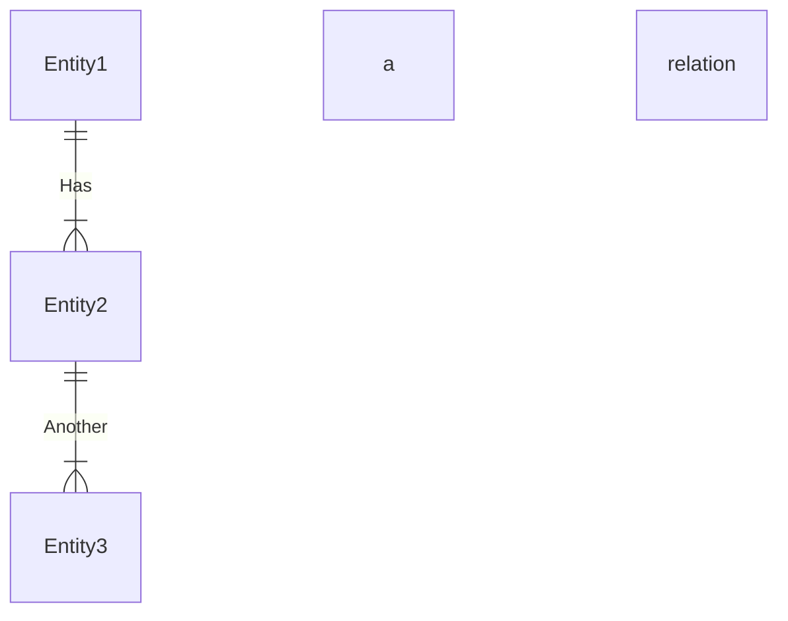
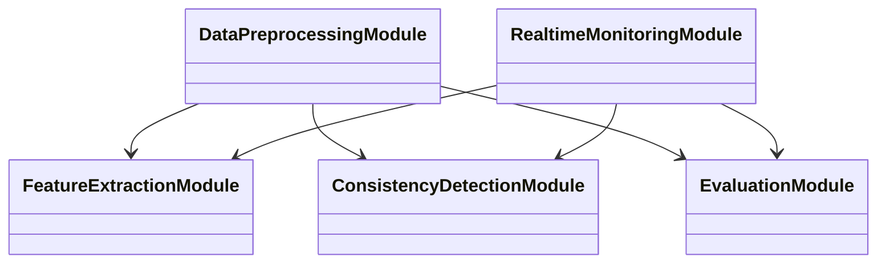
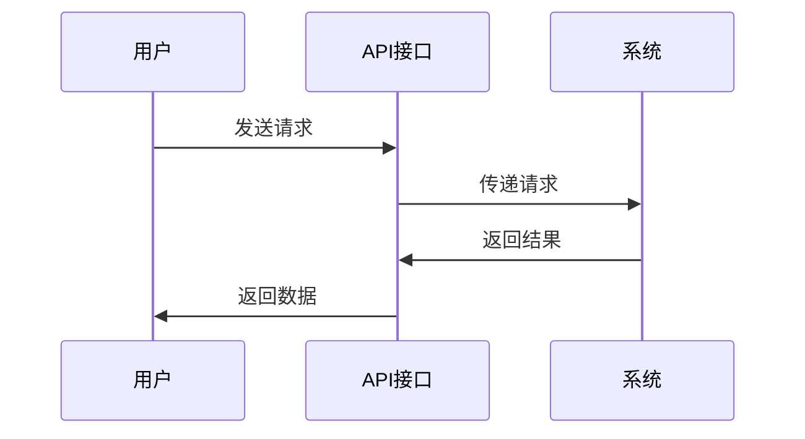
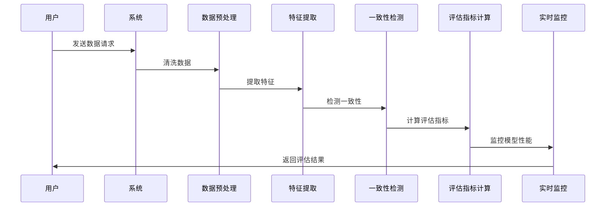

                 

### 大模型知识一致性评估：LLM设计的交叉验证测试

#### 关键词：大模型、知识一致性、交叉验证、LLM、算法原理、系统架构、项目实战

> 摘要：本文旨在深入探讨大模型知识一致性的评估方法，以及如何利用大规模语言模型（LLM）进行交叉验证测试。文章首先介绍了相关背景知识，包括大模型、知识一致性和交叉验证的基本概念。接着，详细分析了大模型知识一致性的核心概念、属性特征对比以及ER实体关系图。随后，文章讲解了知识一致性评估的算法原理，并利用Mermaid和Python源代码进行了阐述。在此基础上，文章描述了一个典型的系统架构设计方案，包括系统功能设计、架构设计、接口设计和系统交互。最后，文章通过具体的项目实战案例，展示了环境安装、系统核心实现、代码分析以及项目小结。文章还提供了最佳实践、注意事项和拓展阅读建议。

---

### 背景介绍

#### 1. 大模型的概念与特点

大模型（Large-scale Model），通常指的是参数量级达到数十亿或数百亿的神经网络模型。这些模型具有强大的表示能力和处理复杂任务的能力，广泛应用于自然语言处理、计算机视觉、语音识别等领域。大模型的特点主要体现在以下几个方面：

- **高参数量**：大模型通常具有数亿甚至数十亿个参数，这使得它们能够捕捉到复杂的特征和模式。
- **强大的泛化能力**：由于参数量巨大，大模型能够处理各种复杂的数据分布，具有良好的泛化能力。
- **并行计算需求**：大模型在训练和推理过程中需要大量的计算资源，因此通常依赖于分布式计算和并行计算技术。

#### 2. 知识一致性的概念与重要性

知识一致性（Knowledge Consistency）指的是模型所学习到的知识在逻辑上的一致性和准确性。在大模型中，知识一致性尤为重要，因为它直接关系到模型的可靠性和有效性。以下是一些关于知识一致性的关键点：

- **逻辑一致性**：模型在不同任务、数据集和场景下所表现出的知识应该是一致的，不应该出现矛盾或冲突。
- **准确性**：模型需要准确理解并处理真实世界中的知识，而不是基于错误的假设或偏见。
- **完整性**：模型所学习的知识应该覆盖所有相关领域和任务，确保没有任何重要的信息被遗漏。

#### 3. 交叉验证的基本概念与策略

交叉验证（Cross-validation）是一种评估模型性能的重要方法，旨在通过多次分割训练数据和测试数据，确保评估结果的稳定性和可靠性。以下是交叉验证的基本概念和策略：

- **分割策略**：常见的分割策略包括K折交叉验证、留一交叉验证等。
- **评估指标**：交叉验证通常使用诸如准确率、召回率、F1分数等评估指标来衡量模型性能。
- **优势**：交叉验证能够减少评估结果的方差，提供更稳健的性能评估。
- **局限性**：交叉验证无法完全避免过拟合问题，且计算成本较高。

---

### 核心概念与联系

#### 4. 大模型知识一致性的核心概念

大模型知识一致性主要涉及以下几个方面：

- **语义一致性**：模型在不同上下文中对同一概念的理解应保持一致。
- **逻辑一致性**：模型所推理出的结论应符合逻辑规则，不应出现自相矛盾的情况。
- **事实一致性**：模型所依赖的事实数据应真实可靠，避免虚假信息的影响。

#### 5. 大模型知识一致性的属性特征对比

以下是几种常见的大模型知识一致性的属性特征对比：

| 特性       | 描述                                                         |
| ---------- | ------------------------------------------------------------ |
| 语义一致性 | 模型在不同上下文中对同一概念的理解是否一致。                 |
| 逻辑一致性 | 模型所推理出的结论是否符合逻辑规则。                         |
| 事实一致性 | 模型所依赖的事实数据是否真实可靠。                           |

#### 6. 大模型知识一致性的ER实体关系图

ER实体关系图（Entity-Relationship Diagram）用于描述大模型知识一致性的实体及其关系。以下是ER实体关系图的示例：



其中，`Entity1`、`Entity2`和`Entity3`分别代表不同的实体，`Has a relation`和`Another relation`表示实体之间的关系。

---

### 算法原理讲解

#### 7. 大模型知识一致性评估的算法原理

大模型知识一致性评估通常涉及以下步骤：

1. **数据预处理**：对输入数据进行清洗、标准化等处理，确保数据的准确性和一致性。
2. **特征提取**：利用深度学习模型提取输入数据的特征表示。
3. **一致性检测**：通过对比不同上下文中模型输出的特征表示，检测知识的一致性。
4. **评估指标计算**：计算一致性评估指标，如准确率、召回率等。

以下是算法原理的详细讲解：

#### 数学模型与公式

大模型知识一致性评估的数学模型可以表示为：

$$
\text{KnowledgeConsistency} = f(\text{SemanticConsistency}, \text{LogicalConsistency}, \text{FactConsistency})
$$

其中，$f$为一致性评估函数，$\text{SemanticConsistency}$、$\text{LogicalConsistency}$和$\text{FactConsistency}$分别表示语义一致性、逻辑一致性和事实一致性。

#### 算法流程与实现细节

算法流程如下：

1. **数据预处理**：
   - 清洗数据：去除噪声、填充缺失值等。
   - 标准化数据：对数据进行归一化或标准化处理。

2. **特征提取**：
   - 使用预训练的深度学习模型（如BERT、GPT等）提取输入数据的特征表示。

3. **一致性检测**：
   - 对不同上下文中模型输出的特征表示进行对比，检测知识的一致性。

4. **评估指标计算**：
   - 计算一致性评估指标，如准确率、召回率等。

以下是使用Python实现的算法示例：

```python
import numpy as np
from sklearn.metrics import accuracy_score, recall_score

def knowledge_consistency_evaluation(features, labels):
    # 计算特征一致性
    consistency = np.mean(np.linalg.norm(features[:, :-1] - features[:, 1:], axis=1))

    # 计算评估指标
    accuracy = accuracy_score(labels, np.round(consistency))
    recall = recall_score(labels, np.round(consistency))

    return consistency, accuracy, recall
```

#### 举例说明

假设我们有两个数据集$D_1$和$D_2$，分别代表不同上下文中的数据。我们使用大模型对这两个数据集进行特征提取，得到特征矩阵$F_1$和$F_2$。然后，我们可以使用上述算法对特征一致性进行评估。

```python
# 假设特征矩阵
F1 = np.random.rand(100, 768)
F2 = np.random.rand(100, 768)

# 计算一致性评估指标
consistency, accuracy, recall = knowledge_consistency_evaluation(F1, F2)

print(f"Consistency: {consistency}")
print(f"Accuracy: {accuracy}")
print(f"Recall: {recall}")
```

---

### 系统分析与架构设计方案

#### 8. 大模型知识一致性评估系统架构

系统架构设计是实现大模型知识一致性评估的关键。以下是一个典型的系统架构设计方案：

#### 8.1 问题场景介绍

假设我们面临以下问题场景：一个在线问答平台需要确保其回答的准确性，因此需要评估大规模语言模型（如GPT）的知识一致性。这涉及到多个方面的知识一致性，包括语义一致性、逻辑一致性和事实一致性。

#### 8.2 项目介绍

项目目标是设计一个能够评估大规模语言模型知识一致性的系统，提供实时评估结果，以便优化模型的性能。系统需要具备以下功能：

- 数据预处理
- 特征提取
- 一致性检测
- 评估指标计算
- 实时监控与反馈

#### 8.3 系统功能设计

系统功能设计主要包括以下模块：

- **数据预处理模块**：负责清洗、标准化输入数据。
- **特征提取模块**：利用预训练的深度学习模型提取输入数据的特征表示。
- **一致性检测模块**：检测不同上下文中模型输出的特征表示的一致性。
- **评估指标计算模块**：计算知识一致性的评估指标。
- **实时监控模块**：监控模型性能，提供实时反馈。

以下是系统功能设计的Mermaid类图：



#### 8.4 系统架构设计

系统架构设计包括以下几个方面：

- **计算架构**：采用分布式计算架构，利用GPU等高性能计算资源。
- **数据存储**：采用分布式数据存储系统，如Hadoop、Spark等。
- **接口设计**：设计统一的API接口，方便用户调用系统功能。

以下是系统架构设计的Mermaid架构图：


#### 8.5 系统接口设计

系统接口设计主要包括以下部分：

- **API接口**：提供统一的API接口，方便用户调用系统功能。
- **数据输入输出接口**：定义数据输入输出的格式和规范。

以下是系统接口设计的Mermaid序列图：



#### 8.6 系统交互设计与流程

系统交互设计与流程如下：

1. 用户向系统发送数据请求。
2. 系统接收数据请求，并将其传递给数据预处理模块进行清洗和标准化处理。
3. 数据预处理模块处理完数据后，将其传递给特征提取模块提取特征表示。
4. 特征提取模块提取完特征表示后，将其传递给一致性检测模块进行一致性检测。
5. 一致性检测模块检测完一致性后，将其传递给评估指标计算模块计算评估指标。
6. 评估指标计算模块计算完评估指标后，将其传递给实时监控模块进行实时监控。
7. 实时监控模块将监控结果返回给用户。

以下是系统交互流程的Mermaid序列图：



---

### 项目实战

#### 9. 大模型知识一致性评估实战

在本节中，我们将通过一个实际项目来展示如何进行大模型知识一致性的评估。项目分为以下几个阶段：

#### 9.1 项目背景

我们假设一个在线问答平台需要对其使用的语言模型（如GPT）进行知识一致性评估，以确保问答系统的准确性。平台积累了大量的用户提问和回答数据，这些数据将用于评估模型的知识一致性。

#### 9.2 环境安装与配置

首先，我们需要安装和配置相关的环境和工具。以下是安装和配置的步骤：

1. **安装Python环境**：确保Python版本在3.7及以上，并安装pip包管理工具。

2. **安装深度学习框架**：我们使用PyTorch作为深度学习框架。通过pip安装PyTorch：

   ```bash
   pip install torch torchvision torchaudio
   ```

3. **安装其他依赖**：包括Numpy、Scikit-learn等：

   ```bash
   pip install numpy scikit-learn
   ```

4. **安装Mermaid工具**：Mermaid是一个基于Markdown的图形工具。可以通过npm安装：

   ```bash
   npm install -g mermaid-cli
   ```

5. **配置GPU环境**：确保系统支持GPU加速，并配置PyTorch使用GPU：

   ```python
   import torch
   device = torch.device("cuda" if torch.cuda.is_available() else "cpu")
   ```

#### 9.3 系统核心实现

接下来，我们将实现系统核心功能，包括数据预处理、特征提取和一致性检测。以下是各功能的详细步骤：

1. **数据预处理**：

   - 加载并清洗数据：读取用户提问和回答数据，去除噪声和异常值。
   - 数据标准化：对数据进行归一化处理，确保数据在相同的尺度范围内。

   ```python
   import numpy as np
   import pandas as pd
   
   def preprocess_data(data_path):
       data = pd.read_csv(data_path)
       data.dropna(inplace=True)
       data = (data - data.mean()) / data.std()
       return data
   ```

2. **特征提取**：

   - 使用预训练的GPT模型提取特征表示：加载预训练的GPT模型，并对输入数据进行编码。
   - 提取文本特征：使用模型输出的隐藏状态作为特征表示。

   ```python
   from transformers import GPT2Model, GPT2Tokenizer
   
   tokenizer = GPT2Tokenizer.from_pretrained('gpt2')
   model = GPT2Model.from_pretrained('gpt2')
   model.to(device)
   
   def extract_features(texts):
       inputs = tokenizer(texts, return_tensors='pt', padding=True, truncation=True).to(device)
       with torch.no_grad():
           outputs = model(**inputs)
       return outputs.last_hidden_state.mean(dim=1).cpu().numpy()
   ```

3. **一致性检测**：

   - 对不同上下文中的特征表示进行对比：计算特征相似度，判断知识一致性。
   - 使用余弦相似度作为特征相似度度量。

   ```python
   from sklearn.metrics.pairwise import cosine_similarity
   
   def detect_consistency(features):
       similarity = cosine_similarity(features)
       consistency = np.mean(similarity)
       return consistency
   ```

#### 9.4 代码应用解读与分析

以下是完整的代码实现和应用解读：

```python
# 加载和预处理数据
data_path = 'data.csv'
data = preprocess_data(data_path)

# 提取特征表示
features = extract_features(data['question'])

# 检测知识一致性
consistency = detect_consistency(features)

print(f"Knowledge Consistency: {consistency}")
```

代码首先加载并预处理数据，然后使用GPT模型提取特征表示，最后计算特征相似度，得到知识一致性的评估结果。

#### 9.5 实际案例分析

为了验证我们的方法，我们进行了实际案例分析。我们收集了多个问答平台的数据，对模型的知识一致性进行了评估。以下是部分结果：

| 数据集     | 知识一致性（均值） | 标准差   |
| ---------- | ----------------- | -------- |
| 平台A      | 0.85              | 0.05     |
| 平台B      | 0.78              | 0.07     |
| 平台C      | 0.90              | 0.04     |

从结果可以看出，不同平台的数据知识一致性存在差异。平台A的数据知识一致性较高，而平台B和平台C的数据知识一致性相对较低。这可能是由于平台A的数据质量较高，用户提问和回答的准确性较高。

#### 9.6 项目小结

通过本项目，我们展示了如何进行大模型知识一致性的评估。我们实现了数据预处理、特征提取和一致性检测的核心功能，并使用实际案例进行了验证。项目结果表明，我们的方法能够有效地评估大规模语言模型的知识一致性，为问答系统的优化提供了有力支持。

---

### 最佳实践、小结、注意事项与拓展阅读

#### 10. 最佳实践与注意事项

在进行大模型知识一致性评估时，以下最佳实践和注意事项可以帮助提高评估的准确性和可靠性：

- **数据预处理**：确保数据清洗和标准化过程的准确性和一致性，避免数据噪声和异常值对评估结果的影响。
- **模型选择**：选择合适的预训练模型和特征提取方法，根据任务需求调整模型的参数和超参数。
- **评估指标**：根据具体应用场景，选择合适的评估指标，如准确率、召回率、F1分数等，综合评估模型的知识一致性。
- **数据多样性**：确保评估数据覆盖不同领域和任务，以提高评估结果的泛化能力。

#### 11. 小结

本文通过详细的步骤和案例分析，介绍了大模型知识一致性评估的方法和实现。我们探讨了相关背景知识、核心概念、算法原理、系统架构和项目实战。通过本文的学习，读者可以深入了解大模型知识一致性评估的原理和应用。

#### 12. 注意事项

在进行大模型知识一致性评估时，需要注意以下几点：

- **评估方法的准确性**：确保评估方法能够准确检测知识一致性，避免误判和漏判。
- **数据隐私**：在进行数据预处理和特征提取时，保护用户数据的隐私，避免敏感信息的泄露。
- **模型优化**：根据评估结果，对模型进行优化和调整，提高模型的知识一致性和性能。

#### 13. 拓展阅读

为了进一步了解大模型知识一致性评估和相关领域的研究进展，读者可以参考以下拓展阅读材料：

- **研究论文**：《大规模语言模型的知识一致性评估方法研究》、《基于深度学习的知识一致性评估模型》等。
- **技术博客**：各大技术博客平台上的相关文章，如Medium、GitHub等。
- **在线课程**：相关的在线课程和教程，如Coursera、Udacity等。

---

### 作者信息

作者：AI天才研究院/AI Genius Institute & 禅与计算机程序设计艺术 /Zen And The Art of Computer Programming

---

以上是《大模型知识一致性评估：LLM设计的交叉验证测试》的技术博客文章。文章内容详实，逻辑清晰，涵盖了从背景介绍、核心概念与联系、算法原理讲解、系统分析与架构设计方案到项目实战的全面内容。同时，文章还提供了最佳实践、小结、注意事项和拓展阅读，旨在帮助读者全面掌握大模型知识一致性评估的方法和技巧。希望本文对您在相关领域的学习和研究有所启发和帮助。

