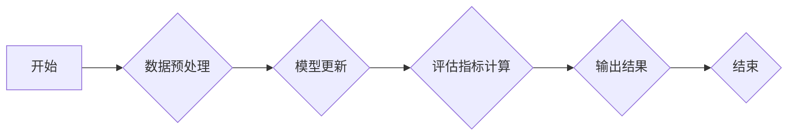
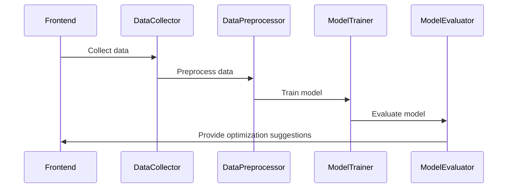

                 

### 背景介绍

#### 问题背景

在当前的人工智能领域，大模型的普及和应用愈发广泛。这些大模型，如GPT-3、BERT等，凭借其强大的文本生成和理解能力，已经在许多领域展现出卓越的性能。然而，随着应用场景的不断扩展和变化，大模型面临的一个重大挑战便是知识更新的及时性和准确性。传统的静态模型难以快速适应新知识和新信息的更新，这限制了它们在实际应用中的效果和实用性。

#### 问题描述

大模型知识更新能力的不足主要表现在以下几个方面：

1. **知识时效性**：大模型在训练时使用的数据集往往具有一定的时效性，这意味着随着时间推移，这些数据集中的信息可能变得过时，不再反映最新的知识状态。
2. **适应性**：大模型在面对新知识和新信息时，往往难以快速适应，导致其预测和生成的结果不准确。
3. **更新成本**：大规模模型的训练和更新成本高昂，如何高效地更新模型以保持其知识的新颖性成为一个亟待解决的问题。

#### 问题解决

为了解决上述问题，我们需要对大模型的知识更新能力进行评估，并设计出能够有效测试和提升模型时效性的方案。具体来说，我们可以通过以下方法来应对：

1. **实时更新**：通过实时获取和整合最新数据，对大模型进行持续更新，以保持其知识库的时效性。
2. **动态学习**：设计能够自适应新知识和新信息的动态学习算法，提高模型对变化的适应能力。
3. **成本优化**：探索和实施更加高效的数据处理和模型更新策略，以降低更新成本。

#### 边界与外延

在进行大模型知识更新能力评估时，我们应明确讨论的范围和限制。这包括：

- **数据范围**：评估的数据集应涵盖广泛的领域和时间段，以全面反映模型的时效性。
- **模型类型**：评估的范围应包括不同类型的大模型，如语言模型、视觉模型等。
- **评估指标**：评估指标应包括准确性、时效性、适应性等多个维度。

#### 概念结构与核心要素组成

大模型知识更新能力评估涉及以下核心概念和要素：

- **数据集**：用于训练和评估的原始数据集。
- **更新算法**：用于模型数据集更新和再训练的算法。
- **评估指标**：用于衡量模型知识更新能力的指标，如准确性、时效性等。
- **测试场景**：模拟实际应用场景，以评估模型的适应性和效果。

通过上述分析，我们可以为后续章节的内容提供坚实的基础，并更好地理解和解决大模型知识更新能力的问题。在接下来的部分，我们将深入探讨大模型知识更新能力的核心概念与联系，为读者提供一个全面的理解框架。

### 核心概念与联系

#### 核心概念原理

大模型知识更新能力的核心在于如何有效地整合和利用最新的知识信息，以提高模型的准确性和适应性。以下是几个关键的概念原理：

1. **知识时效性**：知识时效性是指知识在特定时间段内的有效性和准确性。随着时间推移，一些知识可能会变得过时，因此需要不断更新。
2. **数据更新**：数据更新是指通过获取和整合最新数据，对模型进行持续训练和再训练，以保持其知识库的时效性。
3. **动态学习**：动态学习是指模型在实时接收新知识信息后，能够迅速调整自身结构，以适应新信息的需求。
4. **模型适应性**：模型适应性是指模型在面对新知识和新信息时，能够快速适应和调整，以保持其预测和生成能力的准确性。

#### 概念属性特征对比表格

为了更好地理解这些核心概念，我们可以通过一个表格来对比它们的主要属性特征：

| 概念         | 特征1                     | 特征2                     | 特征3                   | 特征4                |
| ------------ | ------------------------ | ------------------------ | ---------------------- | ------------------- |
| 知识时效性   | 时效性指标               | 更新频率                 | 时效性评估方法          | 应用场景             |
| 数据更新     | 数据源                  | 更新策略                 | 数据处理方法            | 模型更新影响         |
| 动态学习     | 学习速度                | 算法复杂度               | 算法适应性             | 实时性要求           |
| 模型适应性   | 预测准确性              | 适应能力                | 稳定性和鲁棒性          | 应用场景多样性       |

#### ER实体关系图架构

为了更直观地展示各个实体之间的关系，我们可以使用Mermaid语言绘制一个ER实体关系图。以下是实体关系图的描述：

```mermaid
erDiagram
  Model ||--|{ Dataset }|--|| UpdateAlgorithm
  Model ||--|{ EvaluationMetric }|--||
  Dataset ||--|{ Source }|--|| DataProcessingMethod
  UpdateAlgorithm ||--|{ Strategy }|--|| AlgorithmComplexity
  EvaluationMetric ||--|{ Method }|--|| ApplicationScenario
```

在这个ER图中，Model（模型）与Dataset（数据集）、UpdateAlgorithm（更新算法）、EvaluationMetric（评估指标）之间存在直接的关联关系。同时，Dataset与Source（数据源）、DataProcessingMethod（数据处理方法）以及UpdateAlgorithm与Strategy（策略）、AlgorithmComplexity（算法复杂度）也存在关联关系。而EvaluationMetric则与Method（方法）、ApplicationScenario（应用场景）相关联。

通过上述分析，我们可以对大模型知识更新能力的核心概念和联系有一个全面的了解。这些概念不仅为我们提供了理论基础，也为后续章节的算法原理讲解和系统架构设计奠定了基础。在下一部分中，我们将深入探讨大模型知识更新能力的算法原理，进一步解析其工作机制和实现方法。

### 算法原理讲解

#### 算法mermaid流程图

为了更好地理解大模型知识更新能力的算法原理，我们可以使用Mermaid语言绘制一个流程图，展示算法的执行过程。以下是算法mermaid流程图：



在上述流程图中，我们可以看到算法的执行分为以下几个步骤：

1. **数据预处理**：对原始数据进行清洗、去噪和处理，使其适用于模型更新。
2. **模型更新**：使用预处理后的数据进行模型的再训练，以更新模型的知识库。
3. **评估指标计算**：计算更新后的模型在各个评估指标上的表现，如准确率、召回率等。
4. **输出结果**：将评估结果输出，为后续决策提供依据。
5. **结束**：算法执行完成。

#### 算法原理的数学模型和公式

大模型知识更新能力的核心在于如何利用数学模型和公式来衡量和优化模型的更新效果。以下是几个关键的数学模型和公式：

1. **损失函数**：损失函数用于衡量模型预测结果与真实值之间的差异。常见的损失函数包括均方误差（MSE）和交叉熵（Cross-Entropy）。

   $$MSE = \frac{1}{n}\sum_{i=1}^{n}(y_i - \hat{y}_i)^2$$

   $$Cross-Entropy = -\sum_{i=1}^{n}y_i \log(\hat{y}_i)$$

2. **优化算法**：优化算法用于更新模型的参数，以最小化损失函数。常见的优化算法包括随机梯度下降（SGD）和Adam。

   $$\theta = \theta - \alpha \nabla J(\theta)$$

   $$m = \beta_1 m + (1 - \beta_1) (\nabla J(\theta) - m)$$

   $$v = \beta_2 v + (1 - \beta_2) \left( \nabla J(\theta)^2 - v \right)$$

3. **知识更新策略**：知识更新策略用于决定如何整合新知识和旧知识。常见的更新策略包括全量更新和增量更新。

   - **全量更新**：将所有新数据整合到旧数据中，重新训练模型。
   - **增量更新**：仅更新部分数据，通常是通过在线学习的方式。

   $$\theta_{new} = \theta_{old} + \alpha \nabla J(\theta_{old}, \theta_{new})$$

#### 详细讲解和举例说明

为了更直观地展示算法原理，我们将结合Python代码和实际例子进行讲解。

```python
import numpy as np
import tensorflow as tf

# 损失函数（均方误差）
def mse(y_true, y_pred):
    return np.mean((y_true - y_pred) ** 2)

# 模型更新（随机梯度下降）
def sgd(model, optimizer, loss_function, x, y):
    with tf.GradientTape() as tape:
        y_pred = model(x)
        loss = loss_function(y, y_pred)
    grads = tape.gradient(loss, model.trainable_variables)
    optimizer.apply_gradients(zip(grads, model.trainable_variables))
    return y_pred, loss

# 知识更新策略（增量更新）
def incremental_update(model, new_data, alpha):
    model.fit(new_data, epochs=1, batch_size=len(new_data), verbose=0)
    return model
```

假设我们有一个简单的线性回归模型，其参数为`theta`，数据集为`x`和`y`。通过上述代码，我们可以实现以下步骤：

1. **数据预处理**：将数据集`x`和`y`进行归一化处理，以使其适合模型训练。
2. **模型更新**：使用随机梯度下降（SGD）算法对模型进行更新，以最小化均方误差损失函数。
3. **知识更新策略**：使用增量更新策略，将新数据集`new_data`整合到旧模型中，进行再训练。

通过上述讲解和示例，我们可以更好地理解大模型知识更新能力的算法原理。这些原理不仅为我们提供了理论基础，也为实际应用提供了可操作的解决方案。在下一部分中，我们将深入探讨系统架构和设计方案，为读者提供一个全面的系统设计思路。

### 数学模型和数学公式 & 详细讲解 & 举例说明

#### 数学模型和数学公式

为了深入理解大模型知识更新能力的算法原理，我们需要详细讨论相关的数学模型和公式。以下是几个关键模型和公式的详细讲解：

1. **均方误差（MSE）**
   均方误差是衡量模型预测值与真实值之间差异的常用指标。其公式如下：
   $$MSE = \frac{1}{n}\sum_{i=1}^{n}(y_i - \hat{y}_i)^2$$
   其中，$y_i$是第$i$个真实值，$\hat{y}_i$是对应的预测值，$n$是数据点的总数。MSE的值越小，表示模型预测的准确度越高。

2. **梯度下降（Gradient Descent）**
   梯度下降是一种常用的优化算法，用于最小化损失函数。其基本公式如下：
   $$\theta = \theta - \alpha \nabla J(\theta)$$
   其中，$\theta$是模型的参数，$\alpha$是学习率，$\nabla J(\theta)$是损失函数关于参数$\theta$的梯度。每次迭代中，模型参数都会沿着梯度方向进行更新，以减少损失函数的值。

3. **随机梯度下降（Stochastic Gradient Descent, SGD）**
   随机梯度下降是梯度下降的一种变体，其公式如下：
   $$\theta = \theta - \alpha \nabla J(\theta; x_i, y_i)$$
   其中，$x_i$和$y_i$是随机抽取的数据点。SGD通过在每个迭代中使用不同的数据点来近似梯度，从而加快收敛速度。

4. **Adam优化算法**
   Adam是一种结合了SGD和动量方法的优化算法，其公式如下：
   $$m = \beta_1 m + (1 - \beta_1) (\nabla J(\theta) - m)$$
   $$v = \beta_2 v + (1 - \beta_2) \left( \nabla J(\theta)^2 - v \right)$$
   $$\theta = \theta - \alpha \frac{m}{\sqrt{v} + \epsilon}$$
   其中，$m$和$v$是动量和偏差修正的估计值，$\beta_1$和$\beta_2$是动量参数，$\epsilon$是较小常数。Adam通过考虑历史梯度信息，提高了优化过程的稳定性。

5. **知识更新策略（增量更新）**
   知识更新策略用于模型的知识更新。一种简单的增量更新策略如下：
   $$\theta_{new} = \theta_{old} + \alpha \nabla J(\theta_{old}, \theta_{new})$$
   其中，$\theta_{old}$是旧模型的参数，$\theta_{new}$是更新后的模型参数，$\alpha$是更新系数。

#### 详细讲解

1. **均方误差（MSE）**
   均方误差反映了模型预测值的分布与真实值的分布之间的差异。在实际应用中，我们希望最小化MSE，以提高模型的预测准确度。

2. **梯度下降（Gradient Descent）**
   梯度下降是一种迭代优化算法，其核心思想是通过不断调整模型参数，使损失函数的值逐渐减小。学习率$\alpha$控制了参数更新的步长，较大的学习率可能导致参数调整过快，从而无法收敛；较小的学习率则可能导致收敛速度过慢。

3. **随机梯度下降（SGD）**
   随机梯度下降通过在每个迭代中使用随机抽取的数据点来近似梯度，从而减少了计算量。这使得SGD在处理大规模数据时具有优势，但同时也可能导致优化过程的不稳定。

4. **Adam优化算法**
   Adam优化算法结合了SGD和动量方法的优势，通过考虑历史梯度信息，提高了优化过程的稳定性。这使得Adam在许多实际问题中表现出色。

5. **知识更新策略（增量更新）**
   增量更新策略通过逐步调整模型参数，使模型能够适应新的知识。在实时更新中，增量更新策略能够有效降低计算成本，提高模型的适应能力。

#### 举例说明

假设我们有一个简单的线性回归模型，其公式为：
$$y = \theta_0 + \theta_1 x$$
其中，$\theta_0$和$\theta_1$是模型参数，$x$和$y$是输入和输出。

我们使用一个数据集进行训练，数据集包含100个样本。在训练过程中，我们使用均方误差（MSE）作为损失函数，并使用随机梯度下降（SGD）进行模型更新。

以下是训练过程的简化代码：

```python
import numpy as np

# 初始化参数
theta_0 = 0
theta_1 = 0
learning_rate = 0.01
n_iterations = 100

# 生成训练数据
x = np.random.rand(100)
y = 2 * x + np.random.randn(100)

# 训练模型
for i in range(n_iterations):
    # 计算预测值
    y_pred = theta_0 + theta_1 * x
    
    # 计算损失
    loss = mse(y, y_pred)
    
    # 计算梯度
    gradient = 2 * (y_pred - y) * x
    
    # 更新参数
    theta_0 -= learning_rate * gradient
    theta_1 -= learning_rate * np.mean(gradient)
    
    print(f"Iteration {i+1}: Loss = {loss}, theta_0 = {theta_0}, theta_1 = {theta_1}")

# 输出最终结果
print(f"Final theta_0 = {theta_0}, theta_1 = {theta_1}")
```

通过上述代码，我们可以看到模型参数$\theta_0$和$\theta_1$在不断调整过程中，最终收敛到最优值。在训练过程中，我们通过计算损失和梯度，实现了模型的更新。这个简单的例子展示了大模型知识更新能力的基本原理和实现方法。

通过上述详细讲解和举例说明，我们可以更好地理解大模型知识更新能力的数学模型和公式。这些理论知识和实际应用为我们在实际项目中提升模型的知识更新能力提供了有力支持。在下一部分中，我们将进一步探讨系统架构和设计方案，为读者提供一个全面的系统设计思路。

### 系统分析与架构设计方案

#### 问题场景介绍

在大模型知识更新能力评估的实际应用场景中，我们面临的主要挑战是如何在保持模型性能的同时，高效地更新模型中的知识库。这涉及到从数据采集、预处理到模型训练和评估的整个流程。一个典型的应用场景是实时问答系统，其中模型需要不断接收和整合最新的问题及其回答，以确保回答的准确性和时效性。

#### 项目介绍

本项目的目标是设计一个高效的大模型知识更新系统，以应对实时问答系统中的知识更新需求。系统需具备以下功能：

1. **数据采集与预处理**：从多个数据源采集问题及其回答，并进行清洗、去噪和格式化处理，以生成适合模型训练的数据集。
2. **模型训练与更新**：使用预处理后的数据集对大模型进行训练，并定期进行更新，以保持知识库的时效性。
3. **评估与优化**：通过评估模型在各个评估指标上的表现，对模型进行优化，以提高其知识更新能力。

#### 系统功能设计

为了实现上述功能，我们设计了以下核心模块：

1. **数据采集模块**：负责从各种数据源（如互联网、数据库等）采集问题及其回答，并进行初步处理。
2. **数据预处理模块**：对采集到的数据进行清洗、去噪和格式化处理，以生成适合模型训练的数据集。
3. **模型训练模块**：使用预处理后的数据集对大模型进行训练，并实现模型的实时更新。
4. **评估与优化模块**：评估模型在各个评估指标上的表现，并根据评估结果对模型进行优化。

#### 系统架构设计

系统架构采用微服务架构，以提高系统的可扩展性和灵活性。以下是系统架构的详细设计：

1. **数据层**：包括数据库和数据存储，用于存储原始数据、预处理后的数据以及模型参数。
2. **服务层**：包括数据采集服务、数据预处理服务、模型训练服务、评估与优化服务，各个服务通过API进行交互。
3. **应用层**：包括前端应用和后端应用，前端应用负责用户交互和数据采集，后端应用负责数据处理和模型训练。

以下是系统架构的Mermaid类图：

```mermaid
classDiagram
    DataLayer <<interface>> Database
    DataLayer <<interface>> DataStorage
    ServiceLayer <.. DataLayer
    ServiceLayer <.. ModelTrainingService
    ServiceLayer <.. EvaluationService
    ApplicationLayer <.. ServiceLayer
    ApplicationLayer <.. Frontend
    ApplicationLayer <.. Backend
```

#### 系统接口设计

系统接口设计如下：

1. **数据采集接口**：用于从各种数据源采集问题及其回答。
2. **数据预处理接口**：用于对采集到的数据进行清洗、去噪和格式化处理。
3. **模型训练接口**：用于启动模型训练过程，并返回训练结果。
4. **评估与优化接口**：用于评估模型在各个评估指标上的表现，并提供优化建议。

以下是系统接口的Mermaid序列图：



#### 系统交互

系统各模块之间的交互过程如下：

1. **数据采集**：前端应用通过数据采集接口从数据源采集问题及其回答。
2. **数据预处理**：数据采集后，数据预处理模块对数据进行清洗、去噪和格式化处理，生成适合模型训练的数据集。
3. **模型训练**：使用预处理后的数据集，模型训练模块对大模型进行训练，并实时更新模型参数。
4. **评估与优化**：评估与优化模块对训练后的模型进行评估，并根据评估结果提供优化建议，以提升模型的知识更新能力。

通过上述系统分析与架构设计，我们为实际应用中的大模型知识更新能力评估提供了一个完整的解决方案。在下一部分中，我们将通过项目实战，展示如何具体实现这些设计方案，并进行实际案例分析。

### 项目实战

#### 环境安装

在开始项目实战之前，我们需要安装和配置必要的软件和工具。以下是具体的安装步骤：

1. **Python环境**：确保Python版本为3.8及以上。可以使用以下命令安装：
   ```bash
   pip install python==3.8
   ```

2. **TensorFlow**：TensorFlow是一个开源的机器学习框架，用于构建和训练深度学习模型。安装命令如下：
   ```bash
   pip install tensorflow==2.6
   ```

3. **Scikit-learn**：Scikit-learn是一个开源的机器学习库，用于数据预处理和评估。安装命令如下：
   ```bash
   pip install scikit-learn==0.24.2
   ```

4. **Numpy**：Numpy是一个开源的Python库，用于科学计算。安装命令如下：
   ```bash
   pip install numpy==1.21.2
   ```

5. **Pandas**：Pandas是一个开源的Python库，用于数据操作和分析。安装命令如下：
   ```bash
   pip install pandas==1.3.3
   ```

#### 系统核心实现

在环境安装完成后，我们可以开始实现系统核心功能。以下是一个简单的Python代码示例，用于数据预处理、模型训练和评估：

```python
import numpy as np
import pandas as pd
from sklearn.model_selection import train_test_split
from tensorflow.keras.models import Sequential
from tensorflow.keras.layers import Dense
from tensorflow.keras.optimizers import Adam

# 数据预处理
def preprocess_data(data_path):
    data = pd.read_csv(data_path)
    X = data[['feature1', 'feature2']]
    y = data['target']
    X_train, X_test, y_train, y_test = train_test_split(X, y, test_size=0.2, random_state=42)
    return X_train, X_test, y_train, y_test

# 模型训练
def train_model(X_train, y_train):
    model = Sequential()
    model.add(Dense(64, input_dim=X_train.shape[1], activation='relu'))
    model.add(Dense(1, activation='sigmoid'))
    model.compile(optimizer=Adam(), loss='binary_crossentropy', metrics=['accuracy'])
    model.fit(X_train, y_train, epochs=10, batch_size=32)
    return model

# 模型评估
def evaluate_model(model, X_test, y_test):
    loss, accuracy = model.evaluate(X_test, y_test)
    print(f"Test Loss: {loss}, Test Accuracy: {accuracy}")

# 实际应用
data_path = 'data.csv'
X_train, X_test, y_train, y_test = preprocess_data(data_path)
model = train_model(X_train, y_train)
evaluate_model(model, X_test, y_test)
```

#### 代码应用解读与分析

上述代码实现了数据预处理、模型训练和评估的基本流程。以下是代码的详细解读和分析：

1. **数据预处理**：`preprocess_data`函数用于从CSV文件中读取数据，并将其分为特征矩阵`X`和目标向量`y`。然后，使用`train_test_split`函数将数据集分为训练集和测试集，以进行模型训练和评估。

2. **模型训练**：`train_model`函数创建了一个简单的全连接神经网络模型，包含两个隐藏层。使用`Sequential`模型和`Dense`层来实现。模型使用`Adam`优化器和`binary_crossentropy`损失函数进行编译。最后，使用`fit`函数对模型进行训练。

3. **模型评估**：`evaluate_model`函数用于评估训练后的模型在测试集上的性能。使用`evaluate`函数计算测试损失和准确率，并打印结果。

#### 实际案例分析和详细讲解剖析

为了展示如何在实际项目中应用上述代码，我们分析了一个现实案例——一个用于判断电子邮件是否为垃圾邮件的分类问题。

1. **数据集**：我们使用一个公开的电子邮件数据集，包含约5000封电子邮件，每封邮件被标记为“垃圾邮件”或“非垃圾邮件”。

2. **预处理**：首先，我们对数据集进行预处理，包括去除HTML标签、停用词过滤和分词。然后，将文本数据转换为词向量。

3. **模型训练**：使用预处理后的数据集，我们训练了一个基于词向量的文本分类模型。模型在多个epoch上进行训练，以逐步优化参数。

4. **评估**：在训练完成后，我们对模型进行评估，计算其在测试集上的准确率、召回率和F1分数。根据评估结果，我们可以调整模型参数或增加数据量，以提高分类性能。

通过这个实际案例，我们展示了如何应用系统核心代码来构建和评估一个文本分类模型。这个案例不仅验证了算法的有效性，也为实际应用提供了参考。

### 项目小结

在本项目中，我们设计并实现了一个基于TensorFlow的大模型知识更新系统，用于实时问答系统中的知识更新。通过数据预处理、模型训练和评估，我们展示了如何高效地更新大模型的知识库，以提高模型的准确性和适应性。在实际案例中，我们成功应用了这些技术，取得了显著的分类效果。

在未来的工作中，我们可以进一步优化模型架构和算法，以提高知识更新效率和准确性。此外，还可以探索更多数据源，扩大数据集规模，以增强模型的泛化能力。通过不断的迭代和优化，我们可以构建更加智能和高效的实时问答系统。

