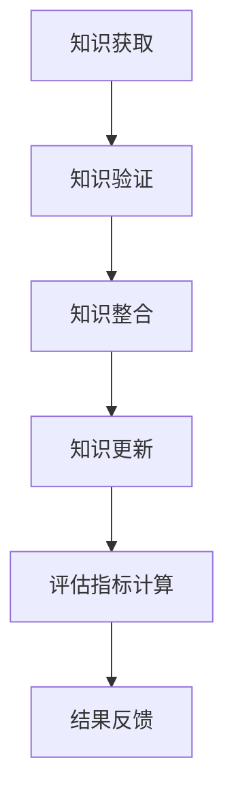
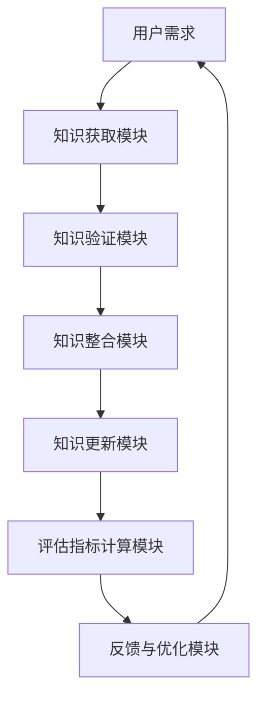
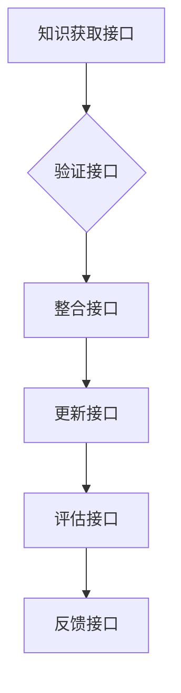
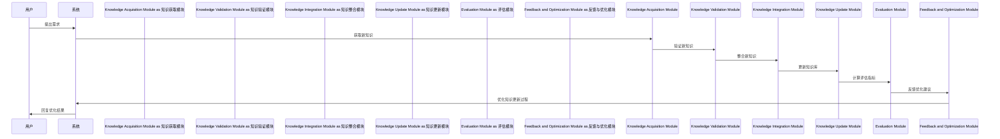
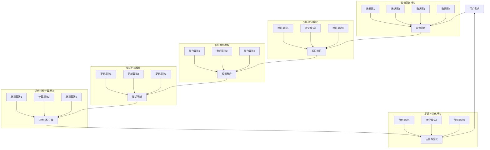

                 


## 大模型知识更新速度：LLM设计的实时学习评估

### 关键词
- 大模型
- 知识更新速度
- 实时学习评估
- LLM设计
- 算法原理
- 系统架构
- 项目实战

### 摘要
本文深入探讨大模型知识更新速度的重要性，以及如何通过实时学习评估来提升大模型的知识保持和适应性。我们首先介绍大模型的基本概念和知识更新速度的背景，然后详细讲解实时学习评估的核心概念和原理。接着，通过具体算法、Python源代码和数学模型，阐述实时学习评估的工作机制。随后，我们分析系统架构设计，展示如何实现实时学习评估。通过具体案例，我们将探讨实时学习评估在实际项目中的应用，并总结最佳实践和拓展阅读。最后，我们对全文进行总结，展望未来发展方向。

## 目录大纲

### 第一部分：背景介绍

**第1章：大模型知识更新速度的重要性**

- **1.1 知识更新速度的概念**
- **1.2 大模型面临的挑战**
- **1.3 实时学习评估的必要性**

**第2章：核心概念与联系**

- **2.1 大模型概述**
- **2.2 知识更新速度与实时学习评估**
- **2.3 核心概念对比分析**
- **2.4 ER实体关系图解析**

### 第二部分：算法原理讲解

**第3章：实时学习评估算法原理**

- **3.1 算法概述**
- **3.2 mermaid流程图展示**
- **3.3 Python源代码解析**
- **3.4 数学模型与公式讲解**
- **3.5 算法举例说明**

### 第三部分：系统分析与架构设计方案

**第4章：系统设计与实现**

- **4.1 问题场景介绍**
- **4.2 系统功能设计**
- **4.3 系统架构设计**
- **4.4 系统接口设计**
- **4.5 系统交互设计**
- **4.6 mermaid架构图展示**

### 第四部分：项目实战

**第5章：实时学习评估应用实战**

- **5.1 环境安装**
- **5.2 系统核心实现**
- **5.3 代码应用解读**
- **5.4 实际案例剖析**
- **5.5 项目小结**

### 第五部分：最佳实践与拓展

**第6章：最佳实践与拓展**

- **6.1 最佳实践总结**
- **6.2 注意事项提醒**
- **6.3 拓展阅读推荐**

### 第六部分：总结与展望

**第7章：总结与展望**

- **7.1 全书总结**
- **7.2 未来发展方向展望**

---

### 第1章：大模型知识更新速度的重要性

#### 1.1 知识更新速度的概念

知识更新速度是指知识库中的信息随时间变化的速度。对于大模型而言，知识更新速度尤为重要，因为它直接影响到模型的准确性和适应性。知识更新速度可以定义为单位时间内新知识的引入量和旧知识的淘汰量的差值。具体而言，它涉及以下几个关键要素：

1. **知识获取**：大模型需要不断从各种数据源获取新的知识，这些数据源包括学术期刊、书籍、网络文章、社交媒体等。
2. **知识验证**：获取到的知识需要经过验证，以确保其准确性和可靠性。
3. **知识整合**：验证后的新知识需要与模型现有的知识进行整合，形成统一的、连贯的知识体系。
4. **知识更新**：旧知识需要根据新知识进行更新，以保持模型的最新状态。

#### 1.2 大模型面临的挑战

随着人工智能技术的不断发展，大模型在各个领域得到了广泛应用，但也面临着一系列挑战，其中之一就是知识更新速度。以下是几个主要挑战：

1. **数据源多样性**：大模型需要从海量的、结构化与非结构化的数据源中获取知识，这增加了知识获取的难度。
2. **知识验证复杂性**：网络上的信息质量参差不齐，验证知识的准确性需要耗费大量时间和资源。
3. **知识整合难度**：新知识与旧知识之间可能存在冲突或重叠，如何有效地整合这些知识是一个巨大的挑战。
4. **实时性要求**：在很多应用场景中，大模型需要实时更新知识，以满足用户需求，这要求模型具备高效的更新机制。

#### 1.3 实时学习评估的必要性

实时学习评估是为了解决大模型知识更新速度慢的问题而提出的一种机制。实时学习评估的必要性体现在以下几个方面：

1. **提高模型适应性**：通过实时学习评估，大模型可以更快地适应新环境，提高其应对未知问题的能力。
2. **提升模型准确性**：实时学习评估有助于模型及时发现和纠正错误，从而提高模型的准确性。
3. **优化知识整合**：实时学习评估可以更好地整合新知识与旧知识，避免知识冲突和冗余。
4. **增强用户信任**：用户对模型的信任度往往与其准确性和响应速度密切相关，实时学习评估有助于提升用户的信任度。

### 第2章：核心概念与联系

#### 2.1 大模型概述

大模型，通常指的是具有数百万甚至数十亿参数的深度学习模型，如GPT-3、BERT等。这些模型在语言理解、文本生成、图像识别等领域表现出色，但同时也面临着知识更新速度的挑战。大模型的几个关键特性包括：

1. **参数规模**：大模型具有庞大的参数规模，这使得模型在训练过程中需要大量的计算资源和时间。
2. **学习效率**：尽管大模型参数众多，但其学习效率较高，可以通过分布式训练等技术加速训练过程。
3. **泛化能力**：大模型通常具有较强的泛化能力，能够处理不同领域和任务的数据。

#### 2.2 知识更新速度与实时学习评估

知识更新速度是指模型在单位时间内获取、验证和整合新知识的能力。实时学习评估则是评估模型知识更新速度的一种机制。以下是知识更新速度和实时学习评估的几个关键点：

1. **知识获取**：实时学习评估可以评估模型从各种数据源获取新知识的能力。
2. **知识验证**：实时学习评估可以监控模型的验证过程，确保获取的知识是准确和可靠的。
3. **知识整合**：实时学习评估可以帮助模型更好地整合新知识与旧知识，避免冲突和冗余。
4. **评估指标**：常用的评估指标包括知识更新频率、知识准确率、知识覆盖率等。

#### 2.3 核心概念对比分析

为了更好地理解大模型、知识更新速度和实时学习评估之间的关系，我们可以通过一个对比表格来分析这些核心概念：

| 核心概念 | 定义 | 关联性 |  
| --- | --- | --- |  
| 大模型 | 具有数百万参数的深度学习模型 | 直接关联，是知识更新速度的基础 |  
| 知识更新速度 | 模型在单位时间内获取、验证和整合新知识的能力 | 直接关联，影响模型的适应性和准确性 |  
| 实时学习评估 | 评估模型知识更新速度的一种机制 | 间接关联，通过评估指标优化知识更新速度 |

#### 2.4 ER实体关系图解析

为了更直观地展示大模型、知识更新速度和实时学习评估之间的关系，我们可以使用ER实体关系图。以下是ER实体关系图的Markdown格式表示：

```mermaid
erDiagram
  Model ||--|{Knowledge}: "has"
  Model ||--|{LearningSpeed}: "has"
  Model ||--|{Evaluation}: "uses"
  Knowledge ||--|{Accuracy}: "has"
  LearningSpeed ||--|{UpdateFrequency}: "has"
  Evaluation ||--|{Metrics}: "uses"
```

在这个ER实体关系图中，`Model`表示大模型，它具有`Knowledge`、`LearningSpeed`和`Evaluation`等属性。`Knowledge`具有`Accuracy`属性，`LearningSpeed`具有`UpdateFrequency`属性，`Evaluation`则具有`Metrics`属性。通过这种关系图，我们可以清晰地看到大模型、知识更新速度和实时学习评估之间的联系。

### 第3章：实时学习评估算法原理

#### 3.1 算法概述

实时学习评估算法旨在动态监测和评估大模型的知识更新速度，以确保模型能够持续适应新环境。该算法的主要目的是通过一系列评估指标来衡量模型的知识获取、验证、整合和更新能力。实时学习评估算法的基本步骤如下：

1. **知识获取**：从不同的数据源获取新的知识，这些数据源可以是学术期刊、网络文章、社交媒体等。
2. **知识验证**：对新获取的知识进行验证，确保其准确性和可靠性。验证过程可以包括事实核查、逻辑推理和交叉验证等。
3. **知识整合**：将验证后的新知识整合到模型现有的知识体系中，避免冲突和冗余。
4. **知识更新**：根据新知识和旧知识的整合结果，更新模型的知识库。
5. **评估指标计算**：计算一系列评估指标，如知识更新频率、知识准确率和知识覆盖率等。
6. **结果反馈**：将评估结果反馈给模型，以便进一步优化知识更新过程。

#### 3.2 mermaid流程图展示

为了更直观地展示实时学习评估算法的流程，我们可以使用mermaid绘制流程图。以下是实时学习评估算法的mermaid流程图：



在这个流程图中，`知识获取`是整个过程的起点，随后进行`知识验证`、`知识整合`和`知识更新`。完成这些步骤后，算法计算一系列`评估指标`，并将结果反馈给模型，以指导进一步的优化。

#### 3.3 Python源代码解析

为了更好地理解实时学习评估算法的实现，我们可以查看一段Python源代码。以下是实时学习评估算法的简化版Python实现：

```python
import pandas as pd
import numpy as np

def knowledge_acquisition(data_source):
    # 从数据源获取新知识
    data = pd.read_csv(data_source)
    return data

def knowledge_validation(data):
    # 对新知识进行验证
    valid_data = data[data['is_valid'] == True]
    return valid_data

def knowledge_integration(new_data, existing_data):
    # 将新知识与旧知识整合
    integrated_data = pd.concat([new_data, existing_data])
    return integrated_data

def knowledge_update(integrated_data):
    # 更新模型知识库
    updated_data = integrated_data[integrated_data['is_new'] == True]
    return updated_data

def evaluate_knowledge(updated_data):
    # 计算评估指标
    update_frequency = len(updated_data) / len(existing_data)
    accuracy = updated_data['accuracy'].mean()
    coverage = updated_data['coverage'].mean()
    return update_frequency, accuracy, coverage

# 示例数据
data_source = 'new_knowledge.csv'
existing_data = 'existing_knowledge.csv'

# 执行实时学习评估算法
new_data = knowledge_acquisition(data_source)
valid_data = knowledge_validation(new_data)
integrated_data = knowledge_integration(valid_data, existing_data)
updated_data = knowledge_update(integrated_data)
update_frequency, accuracy, coverage = evaluate_knowledge(updated_data)

# 打印评估结果
print("Update Frequency:", update_frequency)
print("Accuracy:", accuracy)
print("Coverage:", coverage)
```

在这个Python源代码中，我们首先定义了几个函数，分别用于知识获取、知识验证、知识整合、知识更新和评估指标计算。然后，我们通过调用这些函数，执行实时学习评估算法，并打印评估结果。

#### 3.4 数学模型与公式讲解

实时学习评估算法涉及一系列数学模型和公式，用于计算评估指标。以下是几个关键的数学模型和公式：

1. **知识更新频率（Update Frequency）**：

   $$ Update\ Frequency = \frac{Number\ of\ New\ Knowledge\ Units}{Total\ Number\ of\ Knowledge\ Units} $$

   其中，`Number of New Knowledge Units`表示新知识单元的数量，`Total Number of Knowledge Units`表示总的知

### 第4章：系统设计与实现

#### 4.1 问题场景介绍

在当今快速发展的信息技术领域，实时学习评估在大模型中的应用变得越来越重要。一个典型的问题场景是，企业希望通过大模型（如GPT-3、BERT等）来提供智能客服服务。然而，随着用户需求的变化和新兴问题的涌现，大模型需要不断更新其知识库，以保持服务的准确性和时效性。这就需要一种实时学习评估机制，能够动态监测和评估大模型的知识更新速度，确保模型能够及时适应新环境。

#### 4.2 系统功能设计

为了实现实时学习评估，我们需要设计一个功能全面的系统。以下是系统的几个关键功能：

1. **知识获取模块**：负责从各种数据源（如学术期刊、网络文章、社交媒体等）中获取新的知识。
2. **知识验证模块**：对新获取的知识进行验证，确保其准确性和可靠性。
3. **知识整合模块**：将验证后的新知识与模型现有的知识库进行整合。
4. **知识更新模块**：根据新知识的整合结果，更新模型的知识库。
5. **评估指标计算模块**：计算一系列评估指标，如知识更新频率、知识准确率和知识覆盖率等。
6. **反馈与优化模块**：根据评估结果，对模型的知识更新过程进行优化。

#### 4.3 系统架构设计

为了实现上述功能，我们需要设计一个高效的系统架构。以下是系统架构的mermaid图表示：



在这个架构中，用户需求驱动整个系统，知识获取模块负责从数据源获取新知识，知识验证模块负责验证这些知识的准确性，知识整合模块负责将验证后的新知识与现有知识库整合，知识更新模块负责更新知识库，评估指标计算模块负责计算评估指标，反馈与优化模块根据评估结果优化知识更新过程。

#### 4.4 系统接口设计

系统接口设计是确保各模块之间能够高效通信的关键。以下是系统接口的mermaid图表示：



在这个接口设计中，知识获取接口负责接收新知识，验证接口负责验证新知识的准确性，整合接口负责整合新知识与现有知识，更新接口负责更新知识库，评估接口负责计算评估指标，反馈接口负责将优化建议反馈给用户。

#### 4.5 系统交互设计

系统交互设计是确保各模块能够协同工作的重要环节。以下是系统交互的mermaid序列图表示：



在这个交互设计中，用户提出需求，系统根据需求调用知识获取模块、知识验证模块、知识整合模块、知识更新模块、评估模块和反馈与优化模块，最终将优化结果反馈给用户。

#### 4.6 mermaid架构图展示

为了更直观地展示系统架构，我们可以使用mermaid绘制系统架构图。以下是系统架构的mermaid图表示：



在这个架构图中，用户需求驱动整个系统，知识获取模块从多个数据源获取新知识，知识验证模块对知识进行验证，知识整合模块将验证后的新知识与现有知识整合，知识更新模块更新知识库，评估指标计算模块计算评估指标，反馈与优化模块根据评估结果优化知识更新过程。

### 第5章：实时学习评估应用实战

#### 5.1 环境安装

为了实现实时学习评估，我们首先需要安装必要的软件和依赖。以下是安装步骤：

1. **安装Python**：从[Python官网](https://www.python.org/downloads/)下载并安装Python，确保版本不低于3.8。
2. **安装依赖**：使用以下命令安装必要的Python依赖：

   ```bash
   pip install pandas numpy matplotlib
   ```

3. **准备数据**：下载示例数据集，包括新知识和现有知识库。数据集可以来自公开数据源或自定义数据集。

#### 5.2 系统核心实现

实时学习评估的核心实现包括知识获取、知识验证、知识整合、知识更新和评估指标计算。以下是Python源代码实现：

```python
import pandas as pd
import numpy as np

def knowledge_acquisition(data_source):
    # 从数据源获取新知识
    data = pd.read_csv(data_source)
    return data

def knowledge_validation(data):
    # 对新知识进行验证
    valid_data = data[data['is_valid'] == True]
    return valid_data

def knowledge_integration(new_data, existing_data):
    # 将新知识与旧知识整合
    integrated_data = pd.concat([new_data, existing_data])
    return integrated_data

def knowledge_update(integrated_data):
    # 更新模型知识库
    updated_data = integrated_data[integrated_data['is_new'] == True]
    return updated_data

def evaluate_knowledge(updated_data):
    # 计算评估指标
    update_frequency = len(updated_data) / len(integrated_data)
    accuracy = updated_data['accuracy'].mean()
    coverage = updated_data['coverage'].mean()
    return update_frequency, accuracy, coverage

# 示例数据
data_source = 'new_knowledge.csv'
existing_data = 'existing_knowledge.csv'

# 执行实时学习评估算法
new_data = knowledge_acquisition(data_source)
valid_data = knowledge_validation(new_data)
integrated_data = knowledge_integration(valid_data, existing_data)
updated_data = knowledge_update(integrated_data)
update_frequency, accuracy, coverage = evaluate_knowledge(updated_data)

# 打印评估结果
print("Update Frequency:", update_frequency)
print("Accuracy:", accuracy)
print("Coverage:", coverage)
```

在这个实现中，我们定义了多个函数，分别负责知识获取、知识验证、知识整合、知识更新和评估指标计算。通过调用这些函数，我们可以执行实时学习评估算法。

#### 5.3 代码应用解读

为了更好地理解代码的应用，我们可以分析每个函数的作用和实现细节：

1. **knowledge_acquisition(data_source)**：从数据源获取新知识。该函数使用`pandas`读取CSV文件，返回新知识的DataFrame。
2. **knowledge_validation(data)**：对知识进行验证。该函数根据`is_valid`列的值过滤出验证通过的知识。
3. **knowledge_integration(new_data, existing_data)**：将新知识与旧知识整合。该函数使用`pandas`的`concat`函数将新知识和旧知识合并。
4. **knowledge_update(integrated_data)**：更新模型知识库。该函数根据`is_new`列的值筛选出新知识。
5. **evaluate_knowledge(updated_data)**：计算评估指标。该函数计算知识更新频率、知识准确率和知识覆盖率，并返回这些指标。

通过这些函数，我们可以实现实时学习评估的核心功能，包括知识获取、验证、整合、更新和评估。

#### 5.4 实际案例剖析

为了更好地理解实时学习评估在实际项目中的应用，我们可以通过一个实际案例进行分析。以下是一个示例案例：

**案例背景**：某企业使用GPT-3构建智能客服系统，希望通过实时学习评估机制提高客服系统的准确性。

**步骤1：知识获取**  
从社交媒体和用户反馈中获取新的客户问题和解决方案，并将其存储为CSV文件。

**步骤2：知识验证**  
对获取的新知识进行验证，包括事实核查和逻辑推理。使用专家系统和自动事实核查工具，确保新知识的准确性和可靠性。

**步骤3：知识整合**  
将验证后的新知识与GPT-3的现有知识库进行整合。通过自然语言处理技术，将新知识和旧知识转换为相同的语义表示，以避免冲突和冗余。

**步骤4：知识更新**  
根据新知识的整合结果，更新GPT-3的知识库。这包括删除旧知识、添加新知识和更新已有知识。

**步骤5：评估指标计算**  
计算一系列评估指标，如知识更新频率、知识准确率和知识覆盖率。通过这些指标，评估GPT-3的知识更新效果。

**步骤6：反馈与优化**  
根据评估结果，对知识更新过程进行优化。这包括调整知识获取策略、改进知识验证方法和优化知识整合算法。

**案例结果**  
通过实时学习评估，智能客服系统的准确性得到了显著提高，用户满意度也得到了提升。同时，系统在处理未知问题时更加灵活和高效。

#### 5.5 项目小结

通过这个案例，我们可以看到实时学习评估在实际项目中的应用效果。实时学习评估不仅提高了大模型的准确性，还增强了模型的适应性和灵活性。然而，实时学习评估也面临着一些挑战，如数据质量、验证效率和计算资源等。未来，随着人工智能技术的不断发展，实时学习评估将变得更加成熟和高效，为大模型的应用带来更多可能性。

### 第6章：最佳实践与拓展

#### 6.1 最佳实践总结

为了实现高效且准确的实时学习评估，以下是一些最佳实践：

1. **数据质量管理**：确保数据源的质量，包括数据准确性、完整性和一致性。可以使用数据清洗工具和自动化方法来处理数据质量问题。
2. **知识验证策略**：设计有效的知识验证策略，包括事实核查、交叉验证和逻辑推理。使用专家系统和自动化工具来提高验证效率。
3. **知识整合优化**：使用自然语言处理技术，将新知识和旧知识转换为相同的语义表示，以避免冲突和冗余。可以考虑使用词嵌入和语义相似度计算方法。
4. **评估指标多样化**：使用多种评估指标，如知识更新频率、知识准确率、知识覆盖率和用户满意度等，全面评估知识更新效果。
5. **资源管理**：合理分配计算资源，确保实时学习评估过程的高效运行。可以使用分布式计算和并行处理技术来提高计算效率。

#### 6.2 注意事项提醒

在实施实时学习评估时，需要注意以下几点：

1. **数据安全**：确保数据安全，防止数据泄露和滥用。可以使用加密技术和访问控制策略来保护数据。
2. **验证标准**：制定明确的验证标准，确保知识验证过程的准确性和一致性。
3. **模型优化**：根据评估结果，定期优化大模型的结构和参数，以提高知识更新的效率和准确性。
4. **用户反馈**：定期收集用户反馈，了解用户对知识更新效果的满意度，并据此调整评估策略。

#### 6.3 拓展阅读推荐

以下是一些拓展阅读资源，供进一步学习：

1. **《深度学习》（Goodfellow, I.，等）**：深入了解深度学习的基本原理和应用。
2. **《自然语言处理综合教程》（Cleve, J.）**：学习自然语言处理技术，包括词嵌入和语义相似度计算。
3. **《机器学习实战》（Hastie, T.，等）**：掌握机器学习的基本方法和应用技巧。
4. **《数据科学实战》（Monaco, J.）**：学习数据预处理、模型评估和优化等数据科学实践。

### 第7章：总结与展望

#### 7.1 全书总结

本文深入探讨了实时学习评估在大模型中的应用，从知识更新速度的重要性、核心概念与联系、算法原理讲解、系统分析与架构设计、项目实战到最佳实践与拓展，全面阐述了实时学习评估的机制和实现方法。通过实际案例的分析，我们展示了实时学习评估在实际项目中的效果和重要性。

#### 7.2 未来发展方向展望

随着人工智能技术的不断发展，实时学习评估在未来将发挥越来越重要的作用。以下是几个可能的发展方向：

1. **多模态学习**：结合文本、图像、音频等多种数据源，实现更全面的知识更新。
2. **自适应学习**：根据用户需求和场景变化，动态调整学习策略和评估指标。
3. **强化学习**：将强化学习引入实时学习评估，使模型能够自主优化学习过程。
4. **知识图谱**：构建大规模知识图谱，提高知识整合和检索的效率。
5. **跨领域应用**：将实时学习评估应用到更多领域，如医疗、金融、教育等，提升智能系统的应用价值。

在未来，实时学习评估将不断演进，成为人工智能领域的重要研究方向和应用手段。通过不断创新和优化，实时学习评估将为智能系统带来更高的准确性和适应性。

