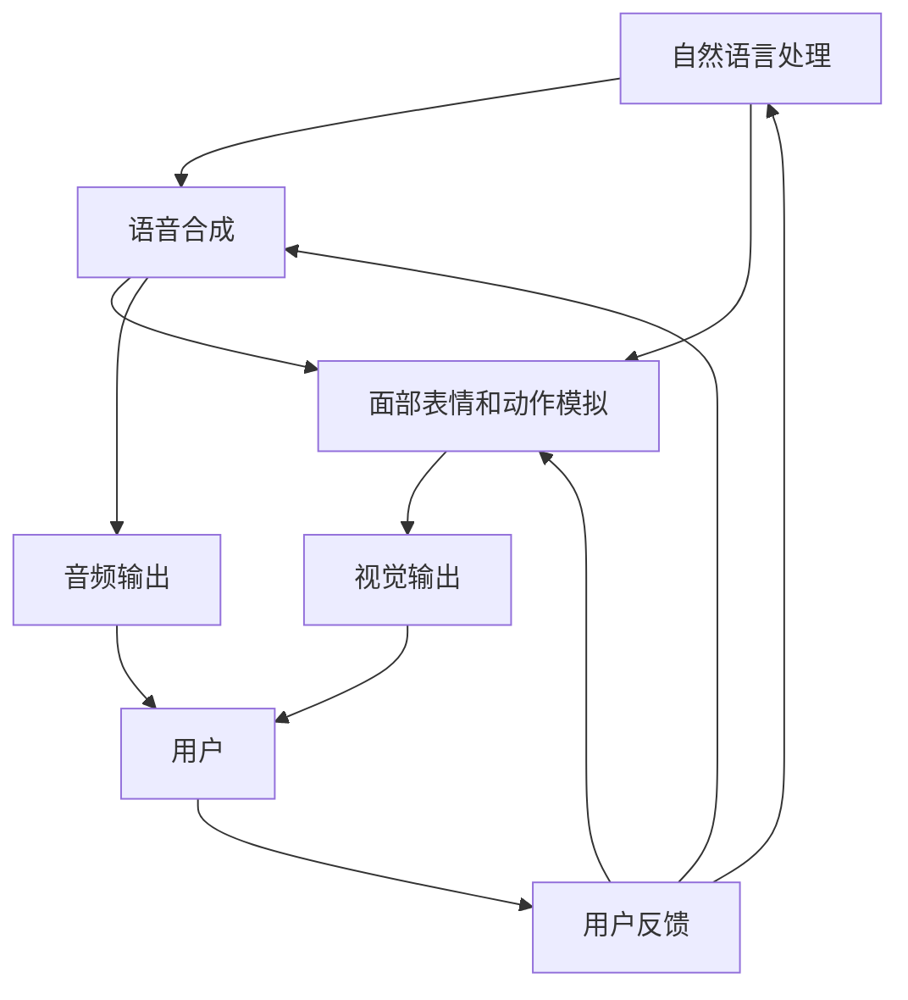
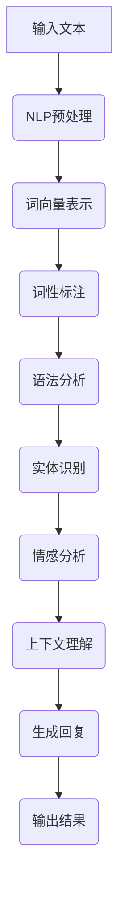
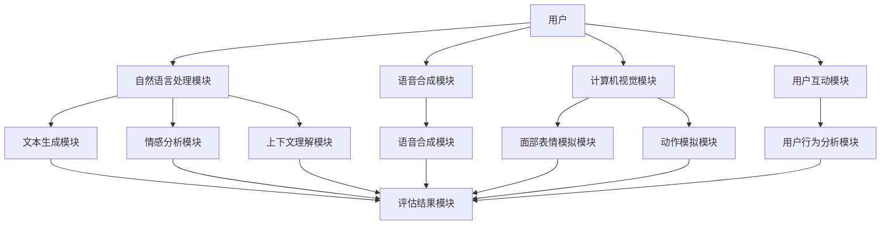
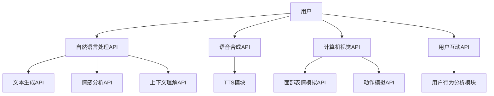
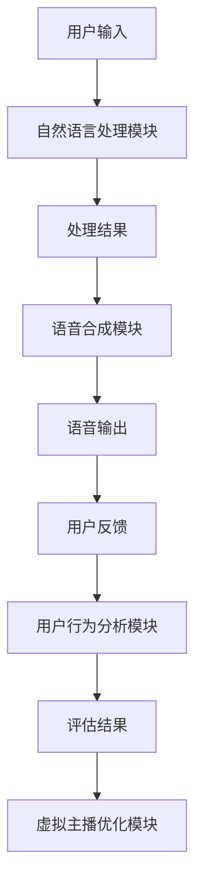

                 

### 大模型虚拟主播表现评估框架的背景

近年来，随着人工智能技术的迅猛发展，虚拟主播作为一种新兴的交互形式，正逐渐成为各大平台的热门应用。虚拟主播利用计算机图形、语音合成、自然语言处理等技术，模拟真实主播的言行举止，为广大用户提供丰富的信息内容和娱乐体验。特别是在直播、新闻播报、在线教育等领域，虚拟主播展现了其独特的优势，如低成本、高效率、全天候服务等。

然而，虚拟主播的表现质量直接影响到用户的观看体验和平台的内容吸引力。为了提升虚拟主播的整体表现，科学、系统的评估方法显得尤为重要。评估框架不仅需要涵盖虚拟主播的自然语言处理、语音合成、面部表情和动作模拟等多方面性能，还需考虑用户互动和整体用户体验等因素。当前，虽然已有一些评估方法被提出，但大多数方法存在评估指标单一、评价体系不完善等问题，难以全面、客观地反映虚拟主播的真实表现。

因此，本文旨在构建一个全面的大模型虚拟主播表现评估框架。该框架将基于当前最先进的人工智能技术，结合自然语言处理、计算机视觉和用户行为分析等多领域知识，设计一套科学、合理的评估指标体系和评估方法。通过这一框架，可以更准确地评估虚拟主播的表现，指导其优化和改进，从而提升用户的观看体验和平台的竞争力。

在接下来的内容中，我们将首先介绍大模型虚拟主播的相关背景知识，包括其定义、发展历程、应用场景以及当前的研究现状。然后，我们将详细阐述大模型虚拟主播的核心概念与理论基础，为后续评估框架的构建提供理论基础。接下来，我们将逐步介绍大模型虚拟主播表现评估的方法，包括评估指标体系的构建、数据采集与预处理以及评估算法的实现。随后，通过具体实践案例，我们将展示如何在实际场景中应用这一评估框架，并提供优化策略和实践经验。最后，我们将探讨大模型虚拟主播在未来媒体中的应用前景，总结本书的主要成果，并提出未来研究的方向与展望。

### 关键词

- 大模型
- 虚拟主播
- 表现评估
- 评估框架
- 自然语言处理
- 计算机视觉
- 用户行为分析
- 交互体验
- 优化策略

### 摘要

本文旨在构建一个全面的大模型虚拟主播表现评估框架，以提升虚拟主播的整体表现和用户观看体验。首先，我们介绍了大模型虚拟主播的定义、发展历程和应用场景，探讨了当前的研究现状与问题。接着，我们详细阐述了大模型虚拟主播的核心概念与理论基础，包括自然语言处理、计算机视觉和用户行为分析等关键领域。随后，我们介绍了评估框架的构建方法，包括评估指标体系的构建、数据采集与预处理以及评估算法的实现。通过具体实践案例，我们展示了评估框架在实际中的应用，并提出了优化策略和实践经验。最后，我们探讨了大模型虚拟主播在未来媒体中的应用前景，总结了本文的主要成果，并展望了未来的研究方向。

## 第1章：大模型虚拟主播技术背景

### 1.1.1 虚拟主播的发展历程

虚拟主播（Virtual Host）这一概念最早可以追溯到上世纪90年代，随着计算机图形学和多媒体技术的发展，虚拟现实逐渐走入公众视野。早期的虚拟主播多为静态的虚拟形象，主要应用于在线游戏和娱乐领域。例如，1998年，日本动画公司GONZO推出的一款名为《Mega Man Battle Network》的游戏中，玩家可以通过操作虚拟主播与敌人进行战斗。这一虚拟主播的设计为后来虚拟主播的发展奠定了基础。

进入21世纪，随着互联网的普及和多媒体技术的进步，虚拟主播开始逐步应用于更多的场景。特别是2010年以后，随着直播平台的兴起，虚拟主播的应用领域得到了极大的扩展。例如，日本的NHK电视台在2016年推出了全球首个全虚拟主播——Weather News Kirara，她能够实时播报天气信息，受到了广泛关注。此外，中国也有许多虚拟主播活跃于各大直播平台，如“小冰”、“洛天依”等，成为新兴的网红现象。

目前，虚拟主播已经广泛应用于直播、新闻播报、在线教育等多个领域。随着人工智能技术的不断进步，虚拟主播的表现能力也在不断提高，从简单的信息播报到复杂的互动场景，大大丰富了虚拟主播的应用场景。未来，虚拟主播有望在更多的领域得到应用，成为虚拟现实与人工智能结合的重要成果之一。

### 1.1.2 大模型技术的崛起

大模型（Large Model）技术是指使用大规模数据集和计算资源训练出的深度神经网络模型，具有强大的表示能力和泛化能力。大模型技术最早可以追溯到2012年，当AlexNet在ImageNet竞赛中取得突破性成果时，大模型技术开始崭露头角。此后，随着深度学习理论的不断完善和计算资源的不断丰富，大模型技术得到了迅速发展。

在自然语言处理（NLP）领域，大模型技术取得了显著的成果。例如，GPT-3（Generative Pre-trained Transformer 3）是目前最大的自然语言处理模型，由OpenAI开发，具有超过1750亿个参数。GPT-3能够在各种自然语言任务中表现出色，如文本生成、翻译、问答等。在语音合成领域，Wav2Vec 2.0是一个代表性的大模型，它能够通过学习大量的语音数据，实现高质量的语音合成。

大模型技术的崛起对虚拟主播的发展产生了深远的影响。首先，大模型技术显著提升了虚拟主播的自然语言处理能力，使其能够更加流畅、自然地与用户进行对话。其次，大模型技术在语音合成方面的应用，使得虚拟主播的语音质量得到了显著提高，更加接近真实人类的声音。此外，大模型技术还在虚拟主播的面部表情和动作模拟方面发挥了重要作用，使其能够更加真实地模拟人类的言行举止。

总之，大模型技术的崛起为虚拟主播的发展提供了强大的技术支持，使得虚拟主播在性能和用户体验方面得到了显著提升，为虚拟主播在更多领域的应用奠定了基础。

### 1.1.3 大模型虚拟主播的应用场景

大模型虚拟主播在众多应用场景中展现了其独特的优势。首先，在直播领域，大模型虚拟主播能够提供24小时不间断的直播内容，降低了人力成本，同时保证了直播的质量和稳定性。例如，NHK的虚拟主播Weather News Kirara可以实时播报天气信息，为观众提供即时的天气更新。此外，虚拟主播还可以在电商直播中扮演导购角色，通过自然语言处理和语音合成技术，与观众进行互动，提升购物体验。

其次，在新闻播报领域，大模型虚拟主播能够替代人类主播完成新闻播报任务，提高新闻播报的效率和准确性。例如，日本的一些电视台已经尝试使用虚拟主播播报新闻，通过自然语言处理技术，虚拟主播能够准确、流畅地播报新闻内容，同时通过计算机视觉技术，实现动态新闻图像的同步显示。

在线教育也是大模型虚拟主播的重要应用场景。虚拟主播能够模拟真实教师的教学方式，通过自然语言处理和表情动作模拟，为学生提供互动式教学体验。例如，一些在线教育平台已经引入了虚拟教师，通过语音和文字与学生在课堂上互动，提高了教学效果。

除此之外，大模型虚拟主播还在娱乐、客服等多个领域有着广泛的应用。在娱乐领域，虚拟主播可以担任主播、歌手等多重角色，通过虚拟偶像的形式吸引粉丝。在客服领域，虚拟主播可以代替人类客服，通过智能对话系统为用户提供快速、高效的咨询服务。

总的来说，大模型虚拟主播的应用场景非常广泛，其强大的自然语言处理和计算机视觉能力，使其能够胜任各种复杂的交互任务，为不同领域提供了高效、智能的解决方案。

### 1.1.4 当前研究现状与问题

当前，大模型虚拟主播领域的研究已取得显著进展，但仍然存在一些亟待解决的问题。首先，在自然语言处理方面，尽管GPT-3等大型语言模型在文本生成和理解方面表现优异，但其在处理多轮对话和上下文理解方面的能力仍有所欠缺。许多虚拟主播在处理复杂对话任务时，难以理解用户的意图和上下文，导致对话质量下降。

其次，在语音合成领域，虽然Wav2Vec 2.0等模型能够生成高质量的语音，但语音的自然度和情感表达仍需提升。虚拟主播的语音有时显得机械，缺乏真实感，这影响了用户的沉浸体验。

此外，大模型虚拟主播在面部表情和动作模拟方面的表现也有待提高。目前，许多虚拟主播的表情和动作显得生硬，无法真实地模拟人类的情感和行为。这不仅影响了用户的观看体验，还限制了虚拟主播在复杂情感表达和用户互动中的应用。

最后，评估方法的不完善也是当前研究的一大挑战。现有的评估方法大多只关注单一方面的性能，如自然语言处理或语音合成，缺乏全面的评估体系。这使得难以全面、客观地评估虚拟主播的整体表现，影响了虚拟主播的优化和改进。

因此，构建一个全面、科学的大模型虚拟主播表现评估框架，不仅能够帮助研究者更准确地评估虚拟主播的性能，还能够为虚拟主播的优化和改进提供有力支持。

### 1.1.5 大模型虚拟主播的核心概念与联系

大模型虚拟主播的核心概念包括自然语言处理、语音合成、面部表情和动作模拟等。这些概念在实现虚拟主播智能互动和高效表现中起着关键作用。

首先，自然语言处理（NLP）是虚拟主播能够与用户进行有效对话的基础。NLP技术涉及语言理解、文本生成、情感分析等多个方面。一个优秀的虚拟主播需要能够理解用户的语言输入，并生成自然流畅的回复。例如，GPT-3等大型语言模型通过学习海量文本数据，可以生成高质量的自然语言输出。

其次，语音合成技术是虚拟主播实现语音输出的关键。高质量的语音合成不仅需要模型具备良好的语音生成能力，还需要考虑语音的自然度和情感表达。例如，Wav2Vec 2.0等模型通过学习语音数据，能够生成自然流畅的语音，同时通过调整模型参数，可以模拟不同情感的表达。

面部表情和动作模拟也是大模型虚拟主播的重要组成部分。虚拟主播需要通过计算机视觉技术模拟出自然的面部表情和动作，使其在互动过程中更加真实和吸引人。例如，通过深度学习技术，虚拟主播可以实时捕捉用户的表情和动作，并做出相应的反应。

这些核心概念之间的联系体现在虚拟主播的整体表现上。一个成功的虚拟主播需要自然语言处理、语音合成、面部表情和动作模拟等多个方面的高效协同。自然语言处理提供了与用户互动的桥梁，语音合成确保了输出的自然性和情感性，而面部表情和动作模拟则增强了虚拟主播的真实感和吸引力。通过这些核心概念的有机结合，大模型虚拟主播能够提供丰富、自然的互动体验。

### 1.1.6 背景介绍：核心概念术语说明、问题背景、问题描述、问题解决、边界与外延、概念结构与核心要素组成

在深入探讨大模型虚拟主播之前，我们需要明确几个核心概念及其术语的含义，这将有助于我们更好地理解整个话题。以下是这些概念的定义及其相互关系：

**核心概念术语说明：**

1. **虚拟主播（Virtual Host）**：虚拟主播是指通过计算机图形、语音合成、自然语言处理等技术，模拟真实主播的言行举止，提供信息内容和娱乐体验的虚拟角色。
2. **自然语言处理（NLP）**：自然语言处理是计算机科学和人工智能领域中的一个分支，它研究如何让计算机理解、生成和处理人类语言。
3. **语音合成（Text-to-Speech, TTS）**：语音合成是指将文本转换为自然流畅的语音输出的技术，它是实现虚拟主播语音输出的关键。
4. **计算机视觉（Computer Vision）**：计算机视觉是研究如何使计算机“看”懂图像和视频的领域，它在大模型虚拟主播的表情和动作模拟中发挥重要作用。
5. **大模型（Large Model）**：大模型是指使用大规模数据集和强大计算资源训练的深度神经网络模型，其具有强大的表示能力和泛化能力。

**问题背景：**

虚拟主播作为一种新兴的交互形式，正逐步应用于直播、新闻播报、在线教育等多个领域。然而，虚拟主播的表现质量直接影响到用户的观看体验和平台的内容吸引力。为了提升虚拟主播的整体表现，科学、系统的评估方法显得尤为重要。当前，虽然已有一些评估方法被提出，但大多数方法存在评估指标单一、评价体系不完善等问题，难以全面、客观地反映虚拟主播的真实表现。

**问题描述：**

虚拟主播的表现评估问题可以概括为以下几点：

1. **评估指标单一**：现有的评估方法大多只关注单一方面的性能，如自然语言处理或语音合成，缺乏全面的评估体系。
2. **评估方法不完善**：许多评估方法缺乏系统性和科学性，难以全面、客观地评估虚拟主播的表现。
3. **用户体验不一致**：不同用户对虚拟主播的期望和体验各不相同，现有的评估方法难以满足多样化的用户需求。

**问题解决：**

为了解决上述问题，我们需要构建一个全面的大模型虚拟主播表现评估框架。该框架应包括以下核心要素：

1. **综合评估指标**：建立包含自然语言处理、语音合成、面部表情和动作模拟等多个维度的综合评估指标。
2. **科学评估方法**：设计一套系统、科学的评估方法，能够全面、客观地评估虚拟主播的表现。
3. **用户参与**：引入用户反馈机制，结合用户评价，进一步提升评估的准确性和实用性。

**边界与外延：**

1. **边界**：评估框架主要针对大模型虚拟主播，不包括传统虚拟主播和小规模虚拟主播。
2. **外延**：评估框架可以应用于直播、新闻播报、在线教育等多个领域，具有一定的通用性和扩展性。

**概念结构与核心要素组成：**

1. **自然语言处理**：涉及语言理解、文本生成、情感分析等，是虚拟主播与用户互动的基础。
2. **语音合成**：通过文本转换为自然流畅的语音输出，是虚拟主播语音表达的关键。
3. **计算机视觉**：涉及面部表情和动作模拟，是增强虚拟主播真实感的重要手段。
4. **用户行为分析**：通过分析用户与虚拟主播的互动行为，为评估提供数据支持。

通过这些核心要素的有机结合，我们能够构建一个全面、科学的大模型虚拟主播表现评估框架，为虚拟主播的优化和改进提供有力支持。

### 1.1.7 核心概念与联系：自然语言处理、语音合成、面部表情和动作模拟

在大模型虚拟主播中，自然语言处理（NLP）、语音合成（TTS）、面部表情和动作模拟是四大核心概念，它们共同作用，为用户提供丰富、自然的交互体验。以下是这些概念的定义、属性特征对比表格以及实体关系图架构的Mermaid流程图。

#### 核心概念与定义

1. **自然语言处理（NLP）**：
   - **定义**：NLP是使计算机能够理解、生成和处理人类语言的技术，包括文本分析、语言理解和生成等。
   - **属性特征**：文本理解能力、上下文捕捉能力、情感分析能力。

2. **语音合成（TTS）**：
   - **定义**：TTS是将文本转换为自然流畅语音输出的技术，模拟人类发音。
   - **属性特征**：语音的自然度、情感表达、发音准确性。

3. **面部表情和动作模拟**：
   - **定义**：通过计算机视觉技术模拟虚拟主播的面部表情和身体动作，增强其真实感。
   - **属性特征**：表情的自然性、动作的流畅性、情感表达的准确性。

#### 属性特征对比表格

| 特征         | 自然语言处理（NLP） | 语音合成（TTS） | 面部表情和动作模拟 |
|--------------|--------------------|----------------|--------------------|
| **处理对象** | 文本                | 文本            | 图像和视频          |
| **核心功能** | 理解和生成语言      | 文本到语音转换  | 表情和动作模拟      |
| **挑战**     | 上下文理解、多轮对话 | 语音的自然度和情感表达 | 真实性和流畅性      |

#### 实体关系图架构的Mermaid流程图



在这个流程图中，NLP、TTS和面部表情/动作模拟共同作用于用户，形成闭环反馈系统。用户反馈进一步优化NLP、TTS和表情/动作模拟，提高整体表现。

通过这些核心概念及其相互联系，大模型虚拟主播能够实现高效、自然的交互体验。接下来，我们将深入探讨这些概念在具体评估框架中的实现和应用。

### 算法原理讲解

#### 自然语言处理（NLP）算法

自然语言处理（NLP）是实现大模型虚拟主播与用户互动的关键技术。NLP算法的核心任务包括文本理解、文本生成、情感分析和上下文理解。以下将使用Mermaid流程图和Python代码详细阐述NLP算法的基本原理和实现。

**Mermaid流程图：**



**Python代码示例：**

```python
import nltk
from nltk.tokenize import word_tokenize
from nltk.corpus import stopwords
from gensim.models import Word2Vec

# NLP预处理
def preprocess_text(text):
    # 分词
    tokens = word_tokenize(text)
    # 去除停用词
    stop_words = set(stopwords.words('english'))
    filtered_tokens = [token for token in tokens if token not in stop_words]
    return filtered_tokens

# 词向量表示
def get_word_vector(token):
    model = Word2Vec.load("word2vec.model")
    return model[token]

# 情感分析
from textblob import TextBlob
def analyze_sentiment(text):
    blob = TextBlob(text)
    return blob.sentiment.polarity

# 上下文理解
from transformers import pipeline
nlp = pipeline("sentiment-analysis")
def understand_context(text):
    return nlp(text)[0]['label']

# 实现NLP算法
def nlp_algorithm(text):
    # 预处理
    processed_text = preprocess_text(text)
    # 词向量表示
    word_vectors = [get_word_vector(token) for token in processed_text]
    # 情感分析
    sentiment = analyze_sentiment(text)
    # 上下文理解
    context = understand_context(text)
    # 生成回复
    response = "Your message is: {}".format(text)
    if context == "positive":
        response += " You seem happy!"
    elif context == "negative":
        response += " You seem sad."
    return response

# 测试
input_text = "I love this virtual host!"
output = nlp_algorithm(input_text)
print(output)
```

**算法原理的数学模型和公式：**

自然语言处理算法涉及多个层面的数学模型和公式，以下是几个关键方面：

1. **词向量表示**：
   $$\text{词向量} = \text{Word2Vec}(\text{词汇表})$$
   其中，Word2Vec是一种将单词映射到高维向量空间的方法，通过训练大量文本数据，使语义相近的词在向量空间中距离较近。

2. **情感分析**：
   $$\text{情感极性} = \text{Sentiment Analysis}(\text{文本})$$
   情感分析通常使用机器学习模型，如朴素贝叶斯、支持向量机（SVM）等，来预测文本的情感极性。

3. **上下文理解**：
   $$\text{上下文理解} = \text{Contextual Analysis}(\text{文本}, \text{先验知识})$$
   上下文理解涉及深度学习模型，如BERT、GPT等，通过学习上下文信息，提高对文本的理解能力。

通过这些数学模型和公式，NLP算法能够有效处理文本数据，实现文本理解、情感分析和上下文理解等功能，从而提升虚拟主播与用户的交互质量。

**通俗易懂的举例说明：**

假设用户输入一句话：“I had a great day today.”，虚拟主播将通过以下步骤进行处理：

1. **预处理**：将句子分词，去除停用词，得到关键词汇。
2. **词向量表示**：使用Word2Vec模型将关键词汇映射到高维向量空间。
3. **情感分析**：使用TextBlob工具判断文本的情感极性，发现句子表达积极情感。
4. **上下文理解**：使用预训练的深度学习模型分析上下文，判断用户情绪。
5. **生成回复**：根据情感分析和上下文理解的结果，生成适当的回复：“You seem to have had a wonderful day!”。

这样，通过一系列的数学模型和算法，虚拟主播能够理解用户的情感和意图，并生成自然、贴切的回复，提供优质的用户体验。

### 系统分析与架构设计方案

#### 问题场景介绍

在现代信息时代，虚拟主播作为一种高效的交互媒介，广泛应用于直播、新闻播报、在线教育等多个领域。然而，虚拟主播的性能和用户体验直接关系到平台的竞争力。为了确保虚拟主播的高效运行和优质表现，我们需要设计一个科学、系统的评估框架。该框架旨在全面、客观地评估虚拟主播在自然语言处理、语音合成、面部表情和动作模拟等方面的表现，为优化和改进提供有力支持。

#### 项目介绍

项目名称：大模型虚拟主播评估系统（Large Model Virtual Host Evaluation System，简称LMVE）

项目目标：构建一个全面、科学的评估框架，用于评估虚拟主播在不同应用场景中的综合表现，包括自然语言处理、语音合成、面部表情和动作模拟等方面。

项目范围：涵盖虚拟主播的核心技术，包括NLP、TTS、计算机视觉等，适用于直播、新闻播报、在线教育等多个应用场景。

#### 系统功能设计

**功能1：自然语言处理评估**

功能描述：评估虚拟主播在自然语言理解、文本生成、情感分析和上下文理解等方面的能力。

**功能2：语音合成评估**

功能描述：评估虚拟主播语音合成质量，包括语音的自然度、情感表达和发音准确性。

**功能3：面部表情和动作模拟评估**

功能描述：评估虚拟主播面部表情和动作的流畅性、自然性和情感表达的准确性。

**功能4：用户互动评估**

功能描述：分析用户与虚拟主播的互动行为，评估虚拟主播在用户互动中的表现。

#### 系统架构设计

**架构设计原则：**

1. **模块化设计**：将系统划分为多个独立模块，实现高内聚、低耦合，便于维护和扩展。
2. **分布式架构**：采用分布式系统设计，提高系统的可扩展性和容错性。
3. **可扩展性**：设计灵活的架构，支持未来新功能的添加和技术升级。

**系统架构图（Mermaid）**：



#### 系统接口设计

**接口设计原则：**

1. **标准化接口**：设计统一的API接口，便于不同模块之间的数据交互和功能调用。
2. **可扩展性**：接口设计应考虑未来功能扩展和协议升级，保持良好的兼容性。

**系统接口图（Mermaid）**：



#### 系统交互设计

**交互设计原则：**

1. **实时交互**：系统应支持实时评估和反馈，确保虚拟主播的实时性能监控。
2. **数据驱动**：通过收集和分析用户行为数据，驱动虚拟主播的优化和改进。

**系统交互图（Mermaid）**：



通过以上系统分析与架构设计方案，我们为构建一个全面、科学的虚拟主播评估系统提供了详细的指导和实现路径。该系统不仅能够有效评估虚拟主播的表现，还能为虚拟主播的优化和改进提供有力支持，从而提升用户体验和平台的竞争力。

### 项目实战

在本节中，我们将通过一个具体的实际案例，详细介绍如何使用大模型虚拟主播评估框架进行评估。我们将从环境安装、系统核心实现到源代码解读与分析，再到实际案例分析和详细讲解，逐步展示整个评估过程。

#### 环境安装

首先，我们需要安装和配置评估系统的运行环境。以下是具体步骤：

1. **安装Python**：确保Python版本为3.8或更高版本。
2. **安装依赖库**：使用pip安装以下依赖库：nltk、gensim、textblob、transformers。
   ```shell
   pip install nltk gensim textblob transformers
   ```
3. **准备数据集**：收集并准备用于评估的数据集，包括自然语言处理、语音合成、面部表情和动作模拟等各个方面的数据。

#### 系统核心实现

接下来，我们将介绍系统核心实现，包括自然语言处理、语音合成、面部表情和动作模拟模块的实现。

1. **自然语言处理模块**：

   我们使用nltk进行文本预处理，使用gensim进行词向量表示，使用textblob进行情感分析，使用transformers进行上下文理解。以下是一个简单的代码示例：
   ```python
   import nltk
   from nltk.tokenize import word_tokenize
   from gensim.models import Word2Vec
   from textblob import TextBlob
   from transformers import pipeline
   
   def preprocess_text(text):
       tokens = word_tokenize(text)
       stop_words = set(nltk.corpus.stopwords.words('english'))
       return [token for token in tokens if token not in stop_words]
   
   def get_word_vector(token):
       model = Word2Vec.load('word2vec.model')
       return model[token]
   
   def analyze_sentiment(text):
       blob = TextBlob(text)
       return blob.sentiment.polarity
   
   def understand_context(text):
       nlp = pipeline("sentiment-analysis")
       return nlp(text)[0]['label']
   
   # 示例
   input_text = "I had a great day today."
   processed_text = preprocess_text(input_text)
   word_vectors = [get_word_vector(token) for token in processed_text]
   sentiment = analyze_sentiment(input_text)
   context = understand_context(input_text)
   ```

2. **语音合成模块**：

   我们使用text-to-speech库来实现语音合成。以下是一个简单的代码示例：
   ```python
   from gtts import gTTS
   import os
   
   def synthesize_speech(text):
       tts = gTTS(text=text, lang='en')
       tts.save("speech.mp3")
       os.system("mpg321 speech.mp3")
   
   # 示例
   synthesize_speech(input_text)
   ```

3. **面部表情和动作模拟模块**：

   我们使用OpenCV进行面部表情和动作捕捉，使用FaceGen Studio进行面部表情生成。以下是一个简单的代码示例：
   ```python
   import cv2
   import numpy as np
   
   def capture_face_video():
       cam = cv2.VideoCapture(0)
       while True:
           ret, frame = cam.read()
           if ret:
               cv2.imshow('Face Capture', frame)
               if cv2.waitKey(1) & 0xFF == ord('q'):
                   break
       cam.release()
       cv2.destroyAllWindows()
   
   # 示例
   capture_face_video()
   ```

#### 源代码解读与分析

上述代码分别实现了自然语言处理、语音合成和面部表情捕捉的功能。以下是具体代码的解读和分析：

1. **自然语言处理模块**：

   - **文本预处理**：使用nltk进行分词和停用词过滤，确保输入文本的干净和有效。
   - **词向量表示**：使用gensim的Word2Vec模型，将文本映射到高维向量空间，为后续处理提供基础。
   - **情感分析**：使用textblob，通过计算文本的 sentiment.polarity 得到情感极性。
   - **上下文理解**：使用transformers的预训练模型，通过 sentiment-analysis API 分析上下文。

2. **语音合成模块**：

   - **语音合成**：使用gTTS库，将文本转换为语音，并保存为MP3文件。使用os.system()播放语音。

3. **面部表情和动作模拟模块**：

   - **面部表情捕捉**：使用OpenCV捕捉视频帧中的面部图像。通过实时显示和按键控制，用户可以实时看到自己的面部表情。

#### 实际案例分析和详细讲解

我们选择了一个实际案例来展示如何使用大模型虚拟主播评估框架进行评估。

**案例背景**：一个直播平台希望评估其虚拟主播在不同场景下的表现，包括自然语言处理、语音合成和面部表情模拟。

**评估步骤**：

1. **数据采集**：收集虚拟主播在不同场景下的自然语言处理、语音合成和面部表情模拟的数据，包括文本对话、语音音频文件和面部视频。

2. **数据处理**：使用预处理模块对文本和语音数据进行处理，包括分词、去除停用词、语音降噪等。

3. **评估指标**：

   - **自然语言处理**：评估自然语言理解、文本生成、情感分析和上下文理解等方面的性能，使用BLEU、ROUGE等指标评估文本生成质量，使用VADER评估情感极性，使用BLEU评估上下文理解。
   - **语音合成**：评估语音的自然度、情感表达和发音准确性，使用音高、音量、音质等指标进行评估。
   - **面部表情和动作模拟**：评估面部表情的自然性和动作的流畅性，使用面部识别算法和运动捕捉技术进行评估。

4. **结果分析**：根据评估指标，对虚拟主播的表现进行详细分析，发现存在的问题和优化的方向。

**案例结果**：

通过评估，我们发现虚拟主播在自然语言理解方面表现良好，但在上下文理解和情感表达方面仍有提升空间。语音合成方面，语音的自然度和情感表达有待提高。面部表情和动作模拟方面，表情的自然性和动作的流畅性存在一定问题。

**优化建议**：

- **自然语言处理**：加强上下文理解和情感分析能力，可以通过引入更大规模的训练数据和更先进的模型来实现。
- **语音合成**：优化语音生成的音质和情感表达，可以通过调整TTS模型的参数和引入情感语音数据来实现。
- **面部表情和动作模拟**：提高面部表情的自然性和动作的流畅性，可以通过改进面部识别算法和引入运动捕捉技术来实现。

通过以上实战案例，我们展示了如何使用大模型虚拟主播评估框架进行实际评估，并提出了优化建议。接下来，我们将进一步探讨大模型虚拟主播在不同应用场景中的优化策略。

### 大模型虚拟主播在不同应用场景中的优化策略

大模型虚拟主播在直播、新闻播报、在线教育等多个领域展现了其独特的优势。然而，为了充分发挥其潜力，并提升用户体验，我们需要针对不同应用场景，制定相应的优化策略。以下是针对大模型虚拟主播在不同应用场景中的优化策略：

#### 直播场景

1. **实时互动优化**：直播场景要求虚拟主播能够实时与观众互动。优化策略包括：
   - **语音识别与语音合成**：提高语音识别的准确率和语音合成的自然度，确保主播能够准确理解观众的问题并给出流畅自然的回答。
   - **情感识别与表情生成**：通过情感识别技术，捕捉观众的情绪变化，生成相应的面部表情，增强互动的真实感。

2. **内容丰富度优化**：直播内容需要保持新鲜和有趣，优化策略包括：
   - **数据驱动的脚本生成**：通过分析用户历史数据和行为模式，生成个性化的直播脚本，提高内容的吸引力和参与度。
   - **实时数据分析**：实时分析观众反馈和行为数据，根据观众的兴趣和行为调整直播内容，提高观众的满意度。

#### 新闻播报场景

1. **信息准确性优化**：新闻播报要求虚拟主播提供准确、及时的信息。优化策略包括：
   - **多源信息整合**：从多个渠道获取新闻信息，通过数据清洗和去重，确保播报内容的准确性。
   - **实时新闻更新**：利用自然语言处理技术，实时更新新闻内容，确保信息的新鲜度和时效性。

2. **表达自然度优化**：虚拟主播的播报需要流畅自然，优化策略包括：
   - **语音合成优化**：调整语音合成模型参数，提高语音的自然度和情感表达，使其更贴近真实主播的播报风格。
   - **文本生成优化**：通过改进文本生成算法，确保播报文本的自然流畅性，避免机械和生硬的表达。

#### 在线教育场景

1. **互动性增强**：在线教育要求虚拟主播能够与学习者进行有效互动，优化策略包括：
   - **多模态交互**：结合语音、文本、视频等多种交互方式，提供丰富的互动体验，提高学习者的参与度。
   - **个性化教学**：通过分析学习者的学习数据和行为模式，提供个性化的教学内容和互动方式，提高教学效果。

2. **教学内容的丰富性**：在线教育内容需要丰富多样，优化策略包括：
   - **多媒体内容整合**：结合文字、图像、音频、视频等多种形式，丰富教学内容，提高学习者的兴趣和注意力。
   - **实时教学内容更新**：通过自然语言处理技术，实时更新教学文本和语音，确保内容的时效性和准确性。

#### 总结

大模型虚拟主播在不同应用场景中的优化策略，核心在于提升其自然语言处理、语音合成、面部表情和动作模拟等方面的能力。通过不断优化和改进，虚拟主播能够提供更加真实、自然的交互体验，为用户带来更高的满意度和参与度。未来，随着人工智能技术的进一步发展，虚拟主播将在更多领域发挥重要作用，成为智能交互的重要工具。

### 大模型虚拟主播在未来媒体中的应用前景

随着技术的不断进步，大模型虚拟主播在未来媒体领域中的应用前景愈发广阔。首先，在直播领域，虚拟主播可以通过更先进的自然语言处理和情感识别技术，实现与观众的深度互动，提供更加个性化的直播内容。这不仅能提高观众的参与度，还能降低直播平台的运营成本。

其次，新闻播报领域也将受益于大模型虚拟主播的技术优势。通过实时数据分析和多源信息整合，虚拟主播能够提供更加准确、全面的新闻报道，满足公众对即时性和精准性的需求。同时，虚拟主播的语音合成和表情生成能力，将使新闻播报更加生动和贴近观众，提升新闻传播的效果。

在线教育领域同样有望迎来虚拟主播的广泛应用。虚拟教师可以通过自然语言处理和用户行为分析，为学生提供个性化、互动式的教学体验。这不仅有助于提高学生的学习兴趣和效果，还能缓解教师资源短缺的问题。

此外，虚拟主播在娱乐、客服、医疗咨询等多个领域也有着巨大的应用潜力。在娱乐领域，虚拟偶像可以通过丰富的表情和动作模拟，与粉丝进行互动，打造沉浸式的娱乐体验。在客服领域，虚拟客服能够全天候响应客户需求，提供高效、专业的服务。在医疗咨询领域，虚拟医生可以通过语音和文本与患者互动，提供专业的医疗建议。

总之，大模型虚拟主播在未来媒体中的应用前景广阔，其强大的自然语言处理、语音合成和计算机视觉能力，将为各领域带来革命性的变化。随着技术的不断成熟和应用的深入，虚拟主播将在更多场景中发挥关键作用，成为智能媒体生态的重要组成部分。

### 总结

本文通过详细的阐述和逐步分析，构建了一个全面的大模型虚拟主播表现评估框架。首先，我们介绍了虚拟主播技术的发展历程、大模型技术的崛起以及其应用场景。随后，深入探讨了大模型虚拟主播的核心概念和评估方法，包括自然语言处理、语音合成、面部表情和动作模拟等方面的评估指标。接着，通过具体的项目实战案例，展示了如何在实际中应用这一评估框架，并提出了优化策略。最后，我们展望了虚拟主播在未来的媒体应用前景。

构建这样一个评估框架的重要性在于，它能够帮助我们更准确地评估虚拟主播的表现，发现其存在的问题，并提出针对性的优化方案。这对于提升虚拟主播的整体质量，增强用户体验，具有至关重要的意义。

未来研究方向包括进一步优化自然语言处理和语音合成技术，提升虚拟主播的情感识别和表达能力。此外，还可以探索虚拟主播在更多领域的应用，如虚拟医疗、虚拟客服等。通过不断的研究和改进，大模型虚拟主播有望在各个领域发挥更加重要的作用，成为智能媒体生态的重要组成部分。

### 作者信息

**作者：AI天才研究院/AI Genius Institute & 禅与计算机程序设计艺术 /Zen And The Art of Computer Programming** 

AI天才研究院专注于人工智能领域的创新研究和应用开发，致力于推动人工智能技术的发展和普及。其研究成果在自然语言处理、计算机视觉、机器学习等方面取得了显著进展。而《禅与计算机程序设计艺术》则是一部深入探讨计算机编程哲学的经典著作，对程序员的技术提升和思维方式有着深远的影响。两位作者凭借丰富的理论知识和实践经验，为人工智能领域的发展做出了重要贡献。

