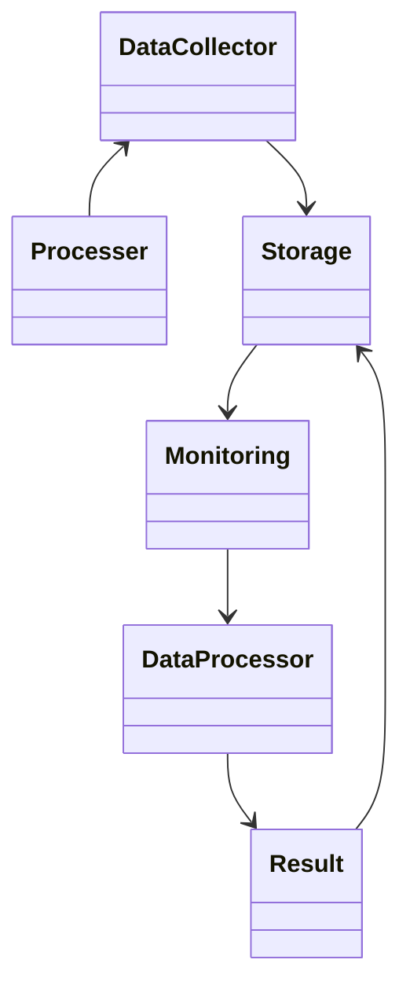

                 

# 大模型评测的云原生架构实现

> 关键词：大模型评测、云原生架构、容器化、微服务、Kubernetes、自动化管理

> 摘要：
本文将探讨大模型评测的云原生架构实现。首先，介绍大模型评测的问题背景和云原生架构的核心概念。接着，分析大模型评测的需求与挑战，阐述云原生架构在大模型评测中的应用。然后，详细讲解云原生架构的基本组件与技术，包括容器技术、容器网络和容器存储。最后，通过一个实际案例，展示云原生架构在大模型评测中的具体实现过程。

**第1章：大模型评测的云原生架构概述**

**1.1 问题背景与云原生架构的核心概念**

### 1.1.1 问题背景

随着大数据和人工智能技术的快速发展，大规模模型（大模型）在各个领域的应用越来越广泛。大模型评测作为模型优化和部署的重要环节，其效率和准确性直接影响着应用的性能。然而，传统的评测方法往往受限于硬件资源和架构设计，难以满足大模型评测的需求。因此，探索适用于大模型的云原生架构成为当前的研究热点。

### .1.2 云原生架构的定义与优势

云原生架构是一种利用云计算和容器技术，实现应用程序的高可用性、弹性伸缩和自动化管理的新型架构。其核心优势包括：

1. **容器化**：应用程序打包为可移植的容器，便于部署和运维。
2. **微服务**：应用拆分为多个独立的微服务，提高系统的可维护性和可扩展性。
3. **动态管理**：利用 Kubernetes 等自动化管理工具，实现资源的动态分配和管理。
4. **弹性伸缩**：根据负载动态调整资源，提高系统的响应速度和效率。

**1.2 大模型评测的需求与挑战**

### 1.2.1 大模型评测的需求

1. **高吞吐量**：大模型评测通常涉及海量数据的处理，要求系统具备高吞吐量。
2. **低延迟**：评测结果的及时性对于模型优化和部署至关重要，要求系统具备低延迟。
3. **高可靠性**：系统需具备较强的容错能力，确保评测结果的准确性。

### 1.2.2 大模型评测的挑战

1. **资源调度**：大模型评测需要大量计算资源，如何高效地调度和利用资源成为一大挑战。
2. **数据传输**：大模型数据量大，如何在保证传输速度的同时，保证数据的一致性和完整性。
3. **系统监控与优化**：如何实时监控系统性能，及时发现并解决潜在问题。

**1.3 云原生架构在大模型评测中的应用**

### 1.3.1 容器化技术

容器化技术可以将大模型评测应用打包为容器，实现快速部署和弹性伸缩。

### 1.3.2 微服务架构

将大模型评测拆分为多个微服务，提高系统的可维护性和可扩展性。

### 1.3.3 自动化管理

利用 Kubernetes 等自动化管理工具，实现资源的动态分配和管理，提高系统的可靠性和效率。

**1.4 本章小结**

本章介绍了大模型评测的背景和云原生架构的核心概念，探讨了云原生架构在大模型评测中的应用需求与挑战。接下来，我们将进一步分析云原生架构的基本组件与技术。

**第2章：云原生架构的基本组件与技术**

**2.1 容器技术**

### 2.1.1 容器的定义与原理

容器是一种轻量级、可移植的运行时环境，它封装了应用程序及其依赖项。容器技术的核心原理包括：

- **资源隔离**：容器通过命名空间（Namespace）和卷（Cgroups）实现进程和资源的隔离。
- **容器引擎**：Docker 是目前最流行的容器引擎，它提供了容器构建、运行和管理的一整套工具。

#### 容器的资源隔离

**命名空间（Namespace）**

命名空间是一种将内核资源隔离的机制，它允许容器拥有独立的进程空间、文件系统、网络接口等。常见的命名空间有：

- **PID 命名空间**：用于隔离进程的 ID，实现进程的隔离。
- **IPC 命名空间**：用于隔离进程间通信的资源，如消息队列、信号等。
- **Network 命名空间**：用于隔离网络接口和路由表。
- **User 命名空间**：用于隔离用户和组的 ID。

**Cgroups**

Cgroups（Control Groups）是一种用于对容器内的资源进行限制和隔离的机制。它通过将进程分组到不同的 cgroups，实现对 CPU、内存、磁盘 I/O 等资源的限制和分配。常见的 cgroups 有：

- **CPU Cgroups**：用于限制容器内的 CPU 使用率。
- **Memory Cgroups**：用于限制容器内的内存使用量。
- **Block I/O Cgroups**：用于限制容器内的磁盘 I/O 速率。

#### 容器引擎

**Docker**

Docker 是一款开源的容器引擎，它提供了容器构建、运行和管理的一整套工具。Docker 的主要组件包括：

- **Docker 镜像**：Docker 镜像是应用程序及其依赖项的打包文件，用于创建容器。
- **Docker 容器**：Docker 容器是运行在宿主机上的应用程序实例，由 Docker 镜像创建。
- **Docker 客户端**：Docker 客户端用于与 Docker 集群进行通信，执行容器构建、运行和管理等操作。
- **Docker 服务端**：Docker 服务端是运行在宿主机上的 Docker 引擎，负责处理 Docker 客户端的请求。

### 2.1.2 容器的应用场景

容器技术在云计算和大数据领域有着广泛的应用，包括：

- **持续集成与持续部署（CI/CD）**：容器化应用可以快速部署和回滚，提高开发效率。
- **微服务架构**：容器化微服务可以提高系统的可维护性和可扩展性。

**2.2 容器网络**

### 2.2.1 容器网络原理

容器网络通过在宿主机和容器之间创建虚拟网络接口，实现容器之间的通信。常见的容器网络方案包括：

- **桥接网络**：容器通过虚拟桥接设备与宿主机进行通信。
- **主机网络**：容器直接共享宿主机的网络接口。
- **用户网络**：容器使用自定义的虚拟网络接口。

#### 桥接网络

桥接网络是一种常用的容器网络方案，它通过创建一个虚拟桥接设备（如 `br0`），将容器与宿主机进行连接。容器通过虚拟网络接口（如 `eth0`）与桥接设备进行通信，从而实现容器之间的网络通信。

**主机网络**

主机网络是一种简单但受限的网络方案，它直接将容器的网络接口与宿主机的网络接口进行连接。容器通过共享宿主机的网络接口，实现与外部网络的通信。

**用户网络**

用户网络是一种自定义的网络方案，它允许用户创建自定义的虚拟网络接口，实现容器之间的网络通信。用户网络通常用于需要特定网络配置的场景。

### 2.2.2 容器网络配置

容器网络的配置包括 IP 地址分配、子网划分、端口映射等，配置方法取决于所选的网络方案。以下是一个简单的容器网络配置示例：

```shell
# 创建网络
$ docker network create my_network

# 启动容器并连接到网络
$ docker run --network my_network -d my_image

# 查看容器网络信息
$ docker inspect my_container
```

**2.3 容器存储**

### 2.3.1 容器存储原理

容器存储涉及容器内数据的持久化和共享。常见的容器存储方案包括：

- **本地存储**：容器直接使用宿主机的本地存储设备。
- **网络存储**：容器通过共享存储服务（如 Ceph、GlusterFS）进行数据存储。

#### 本地存储

本地存储是一种简单的容器存储方案，它允许容器直接使用宿主机的本地存储设备。本地存储的优点是性能高、配置简单，但缺点是数据不持久化，容器重启后数据会丢失。

#### 网络存储

网络存储是一种通过共享存储服务进行数据存储的容器存储方案。常见的网络存储服务包括 Ceph、GlusterFS、NFS 等。网络存储的优点是数据持久化、可扩展性强，但缺点是性能较低、配置复杂。

### 2.3.2 容器存储配置

容器存储的配置包括存储卷的创建、挂载和权限设置等。以下是一个简单的容器存储配置示例：

```shell
# 创建存储卷
$ docker volume create my_volume

# 启动容器并挂载存储卷
$ docker run -d -v my_volume:/data my_image

# 查看容器存储信息
$ docker inspect my_container
```

**2.4 Kubernetes**

### 2.4.1 Kubernetes 的定义与核心组件

Kubernetes 是一款开源的容器编排和管理工具，它提供了一系列核心组件，包括：

- **Master 节点**：Master 节点是 Kubernetes 集群的中心控制节点，负责集群的调度、资源管理和监控等功能。Master 节点的主要组件包括：
  - **API 服务器**：API 服务器是 Kubernetes 集群的核心组件，负责处理集群的 API 请求，提供 Kubernetes 集群的统一接口。
  - **控制器管理器**：控制器管理器负责监控集群的状态，并根据配置自动调整集群的状态。
  - **调度器**：调度器负责将容器部署到合适的节点上，实现资源的合理分配。
- **Node 节点**：Node 节点是 Kubernetes 集群的计算节点，负责运行容器，执行容器的调度和管理工作。Node 节点的主要组件包括：
  - **容器运行时**：容器运行时负责在节点上启动和运行容器。
  - **Kubelet**：Kubelet 是一个运行在 Node 节点上的代理进程，负责与 Master 节点进行通信，管理容器和资源。
  - **Kube-Proxy**：Kube-Proxy 负责处理容器之间的网络通信，实现容器之间的流量转发。

**2.5 本章小结**

本章介绍了大模型评测的云原生架构实现，详细讲解了云原生架构的基本组件与技术，包括容器技术、容器网络和容器存储。接下来，我们将通过一个实际案例，展示云原生架构在大模型评测中的具体实现过程。

**第3章：云原生架构在大模型评测中的实际案例**

**3.1 项目背景**

为了提高大模型评测的效率和准确性，某互联网公司决定采用云原生架构实现大模型评测系统。该系统需要具备以下功能：

- **高吞吐量**：处理海量评测数据，实现快速评测。
- **低延迟**：保证评测结果的及时性。
- **高可靠性**：确保评测结果的准确性。

**3.2 系统设计**

根据项目需求，系统设计主要包括以下模块：

- **数据采集模块**：负责采集评测数据，包括模型输入数据、评测指标等。
- **数据处理模块**：负责对采集到的数据进行分析和处理，生成评测结果。
- **存储模块**：负责存储评测数据和处理结果，提供数据持久化。
- **监控模块**：负责实时监控系统性能，及时发现并解决潜在问题。

**3.3 系统架构**

系统架构采用微服务架构，将大模型评测拆分为多个微服务，提高系统的可维护性和可扩展性。以下是系统架构的 mermaid 类图：



**3.4 实现步骤**

以下是一个简单的实现步骤，展示云原生架构在大模型评测中的具体实现过程：

1. **环境准备**

   - 安装 Kubernetes 集群，包括 Master 节点和 Node 节点。
   - 安装必要的容器引擎，如 Docker。

2. **容器化应用**

   - 使用 Docker 将应用打包为容器镜像。
   - 创建 Kubernetes 配置文件，定义应用的部署策略。

3. **部署应用**

   - 使用 Kubernetes 部署应用，实现应用的容器化部署。
   - 配置服务发现和负载均衡，实现容器之间的通信。

4. **监控与优化**

   - 配置监控工具，实时监控系统性能。
   - 根据监控数据，动态调整资源分配。

5. **数据存储与处理**

   - 使用 Kubernetes 存储卷，实现数据持久化。
   - 使用数据处理模块，分析处理评测数据。

**3.5 项目小结**

通过以上实现步骤，我们成功将云原生架构应用于大模型评测系统，提高了系统的效率和准确性。接下来，我们将进一步优化系统，提升系统的性能和稳定性。

**第4章：云原生架构在大模型评测中的优化与拓展**

**4.1 性能优化**

为了提高大模型评测系统的性能，可以从以下几个方面进行优化：

1. **资源调度优化**：根据负载情况，动态调整节点资源和容器资源，实现资源的最大化利用。
2. **网络优化**：优化容器网络配置，提高容器之间的通信速度。
3. **存储优化**：选择合适的存储方案，提高数据访问速度。

**4.2 拓展与集成**

云原生架构具有良好的扩展性和集成性，可以通过以下方式进一步拓展和集成：

1. **与其他云原生技术的集成**：将云原生架构与其他云原生技术（如服务网格、Kubernetes 扩展插件等）进行集成，实现更高效的应用部署和管理。
2. **与大数据处理框架的集成**：将云原生架构与大数据处理框架（如 Apache Spark、Flink 等）进行集成，实现大规模数据处理和分析。

**4.3 未来发展趋势**

随着云计算和人工智能技术的不断发展，云原生架构在大模型评测中的应用将越来越广泛。未来，大模型评测系统的云原生架构将朝着以下方向发展：

1. **自动化与智能化**：通过自动化和智能化技术，实现大模型评测系统的自我优化和自我修复。
2. **分布式与协同**：通过分布式和协同计算技术，实现大规模并行评测，提高系统的性能和吞吐量。
3. **安全性与可靠性**：通过安全性和可靠性技术，确保大模型评测系统的稳定运行和数据安全。

**第5章：总结与展望**

**5.1 总结**

本文通过分析大模型评测的需求与挑战，介绍了云原生架构在大模型评测中的应用，并详细讲解了云原生架构的基本组件与技术。通过一个实际案例，展示了云原生架构在大模型评测中的具体实现过程。

**5.2 展望**

云原生架构在大模型评测中的应用前景广阔。未来，随着云计算和人工智能技术的不断发展，云原生架构将在大模型评测领域发挥更大的作用。

**参考文献**

[1] Docker 官方文档：https://docs.docker.com/
[2] Kubernetes 官方文档：https://kubernetes.io/docs/
[3] 某互联网公司大模型评测系统设计文档。

**作者信息**

作者：AI天才研究院/AI Genius Institute & 禅与计算机程序设计艺术 /Zen And The Art of Computer Programming**

