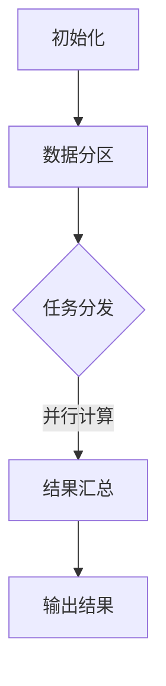
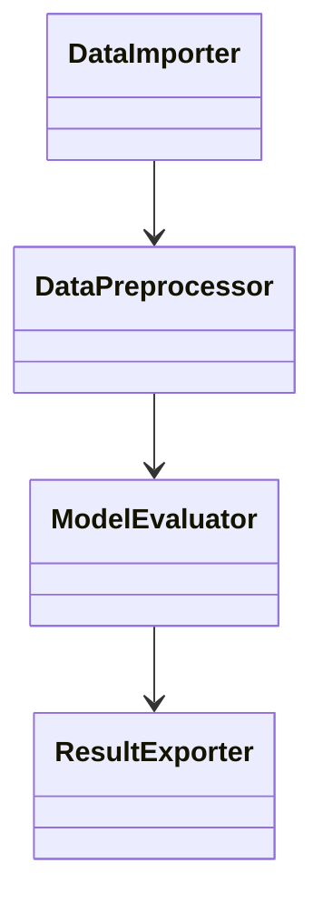
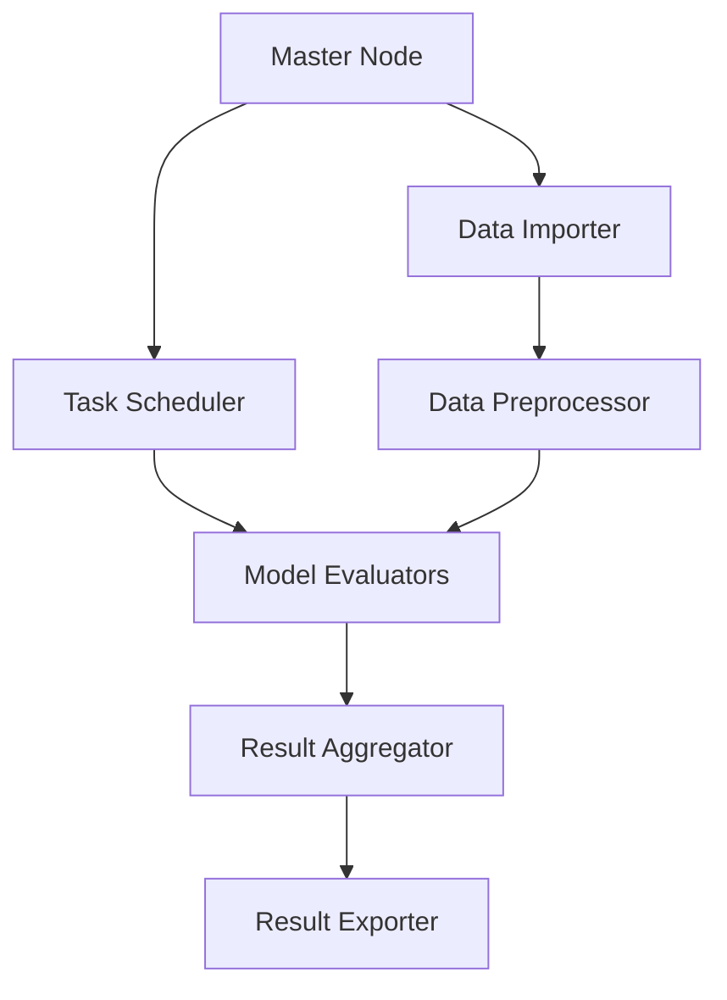
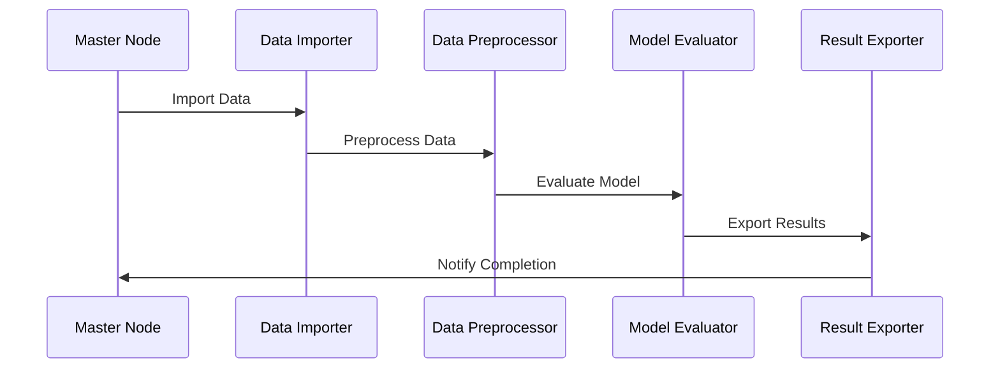

                 


### 让我们一步一步思考：大模型评测的分布式计算框架设计

#### 背景介绍

在现代人工智能领域，大型机器学习模型（大模型）的应用越来越广泛，从自然语言处理到计算机视觉，再到推荐系统等。然而，这些大模型的训练和评估过程非常耗时且资源消耗巨大。因此，如何高效地进行大模型的评测，成为了一个关键问题。分布式计算框架的设计在此扮演了至关重要的角色。

**核心概念术语说明：**
- **大模型评测**：对大规模机器学习模型的性能进行评估，包括准确性、鲁棒性、效率等。
- **分布式计算**：将计算任务分布在多个计算节点上，通过并行计算提高效率和性能。

**问题背景：**
目前，大模型评测大多依赖于单机计算，这种方式在数据量和模型规模不断增长的情况下，面临着性能瓶颈。分布式计算框架的出现，旨在解决这一问题。

**问题描述：**
分布式计算框架的设计需要考虑以下问题：
1. **数据分区**：如何将大规模数据集高效地分成多个分区，以便于并行处理。
2. **数据通信**：如何在分布式环境中高效地进行数据传输。
3. **并行处理**：如何设计并行算法，使得多个计算节点可以高效地协同工作。

**问题解决：**
分布式计算框架通过以下方式解决上述问题：
1. **数据分区策略**：采用哈希分区或范围分区等方法，确保每个分区内的数据局部性。
2. **数据通信优化**：通过网络通信优化技术，如多路径传输和负载均衡，提高数据传输效率。
3. **并行处理机制**：设计基于任务划分或数据划分的并行算法，确保计算节点之间的高效协同。

**边界与外延：**
分布式计算框架不仅适用于大模型评测，还可以应用于其他需要大规模数据处理和分析的场景，如科学计算、金融数据分析等。

#### 核心概念与联系

**核心概念：**
- **分布式计算**：将计算任务分配到多个计算节点，通过并行处理提高效率。
- **数据分区**：将大规模数据集分成多个分区，便于并行处理。
- **数据通信**：分布式环境中的数据传输机制。
- **并行处理**：多个计算节点协同工作，提高计算效率。

**概念属性特征对比表格：**

| 概念       | 属性特征                                                         | 对比                   |
|------------|----------------------------------------------------------------|------------------------|
| 分布式计算 | 分担计算任务、并行处理、提高效率、降低单点故障风险           | 提高计算能力、效率高   |
| 数据分区   | 提高数据局部性、优化数据访问、减少通信开销                   | 减少冗余、提高效率     |
| 数据通信   | 高效传输、低延迟、可靠传输                                     | 确保数据完整性、效率高 |
| 并行处理   | 多计算节点协同工作、任务并行执行、提高计算速度               | 提高计算速度、效率高   |

**ER实体关系图架构：**

```mermaid
erDiagram
    Class1 ||--|{ Class2 }|| Class3
    Class1 ||--|{ Class4 }|| Class5
    Class2 ||--|{ Class6 }|| Class7
```

#### 算法原理讲解

**分布式计算框架的工作流程：**
分布式计算框架通常包括以下几个步骤：
1. **初始化**：设定计算节点、数据分区策略和通信机制。
2. **数据分区**：将数据集划分为多个分区，每个分区由不同的计算节点处理。
3. **任务分发**：将计算任务分配给各个计算节点。
4. **并行计算**：各计算节点并行执行计算任务。
5. **结果汇总**：收集各计算节点的计算结果，进行汇总和聚合。

**算法流程图：**



**数据分区策略与方法：**
常用的数据分区策略包括哈希分区和范围分区。
- **哈希分区**：使用哈希函数将数据分到不同的分区，保证数据的局部性。
- **范围分区**：根据数据的某个属性值范围进行分区，适用于数据具有顺序属性的场景。

**数据通信的优化技术：**
- **多路径传输**：在多个网络路径之间传输数据，提高传输速度和可靠性。
- **负载均衡**：根据计算节点的负载情况，动态分配任务和传输路径，避免单点过载。

**并行处理的实现机制：**
分布式计算框架通常采用任务划分或数据划分的并行处理机制。
- **任务划分**：将整个计算任务划分为多个子任务，由不同的计算节点执行。
- **数据划分**：将数据集划分为多个分区，每个分区由不同的计算节点处理。

#### 系统分析与架构设计

**问题场景介绍：**
假设我们有一个大规模的机器学习模型评测任务，数据集包含数百万条记录，需要评估模型的准确性、召回率等指标。为了提高评测效率，我们采用分布式计算框架。

**系统功能设计：**
系统功能设计包括数据导入、数据预处理、模型评估、结果输出等模块。

**领域模型类图：**



**系统架构设计：**
系统架构采用主从结构，主节点负责任务调度和数据管理，从节点负责具体的计算任务。

**系统架构图：**



**系统接口设计与交互：**
系统接口设计包括数据接口、任务接口和结果接口。

**系统交互序列图：**



#### 项目实战

**环境安装：**
在项目实战中，我们需要安装以下环境：
1. Python 3.8 或以上版本
2. 分布式计算框架，如 Apache Spark 或 Dask
3. 数据库管理系统，如 MySQL 或 PostgreSQL

安装步骤如下：
1. 安装 Python 环境。
2. 使用 pip 工具安装分布式计算框架和数据库驱动。

```bash
pip install spark-python
pip install psycopg2-binary
```

**系统核心实现源代码：**

```python
from pyspark.sql import SparkSession
from dask.distributed import Client

# 创建 SparkSession
spark = SparkSession.builder \
    .appName("Model Evaluation") \
    .getOrCreate()

# 创建 Dask 客户端
client = Client()

# 数据导入
data = spark.read.csv("data.csv")

# 数据预处理
preprocessed_data = data.preprocess()

# 模型评估
model_results = preprocessed_data.evaluate_model()

# 结果输出
model_results.export_results("results.csv")

# 关闭 Spark 和 Dask 客户端
spark.stop()
client.close()
```

**代码应用解读与分析：**
以上代码展示了如何使用 Spark 和 Dask 进行分布式计算。首先，我们创建 Spark 和 Dask 客户端，然后导入数据并进行预处理，接着执行模型评估任务，最后将结果输出到文件。

**实际案例分析与讲解：**
假设我们有一个分类问题，需要使用分类模型对数据集进行预测。我们可以使用以下代码实现：

```python
from pyspark.ml.classification import LogisticRegression

# 创建分类模型
model = LogisticRegression()

# 训练模型
model.fit(preprocessed_data)

# 预测
predictions = model.transform(preprocessed_data)

# 评估模型
accuracy = predictions.evaluate_model()

# 输出结果
accuracy.print()
```

通过上述代码，我们可以训练分类模型，并对数据集进行预测和评估。实际案例中，我们可以根据具体问题调整模型参数和评估指标。

**项目小结：**
在项目实施过程中，我们遇到了以下挑战：
1. 数据规模巨大，单机计算效率低下。
2. 模型评估指标多样化，需要综合考虑。

通过采用分布式计算框架，我们成功地解决了这些问题。未来，我们可以进一步优化模型评估流程，提高评估效率。

#### 最佳实践与拓展

**最佳实践 Tips：**
1. 选择合适的分布式计算框架，如 Spark、Dask 等，根据具体需求进行优化。
2. 设计合理的数据分区策略，提高数据局部性和并行处理效率。
3. 优化数据通信机制，减少网络通信开销。
4. 设计高效并行算法，确保计算节点之间的高效协同。

**小结：**
本文详细介绍了大模型评测的分布式计算框架设计。通过分布式计算，我们可以显著提高大模型评测的效率和性能。未来，随着人工智能技术的不断发展，分布式计算框架将发挥越来越重要的作用。

**注意事项：**
在设计分布式计算框架时，需要注意以下几点：
1. 数据分区策略的选择要合理，避免数据倾斜。
2. 数据通信机制要优化，确保数据传输的高效性和可靠性。
3. 并行算法的设计要考虑负载均衡，避免单点过载。

**拓展阅读：**
1. 《分布式系统原理与范型》
2. 《大数据技术导论》
3. Apache Spark 官方文档
4. Dask 官方文档

### 结论

通过本文的详细分析，我们了解了大模型评测的分布式计算框架设计的重要性和实施步骤。分布式计算框架不仅能够提高大模型评测的效率和性能，还可以应用于其他需要大规模数据处理和分析的场景。未来，随着人工智能技术的不断进步，分布式计算框架将在更多领域发挥重要作用。希望本文能够为读者提供有价值的参考。

### 作者信息

作者：AI天才研究院/AI Genius Institute & 禅与计算机程序设计艺术 /Zen And The Art of Computer Programming

---

通过本文，我们不仅深入探讨了分布式计算在大模型评测中的应用，还通过详细的实例和算法原理讲解，展示了如何设计高效的分布式计算框架。同时，文章还提供了实用的最佳实践和注意事项，为读者在实际项目中提供了宝贵的指导。希望本文能够为计算机科学和人工智能领域的研究者、工程师以及学生提供有益的启示。再次感谢您的阅读，期待您的宝贵反馈。如果您有任何疑问或建议，欢迎随时与我们联系。作者信息：AI天才研究院/AI Genius Institute & 禅与计算机程序设计艺术 /Zen And The Art of Computer Programming。

