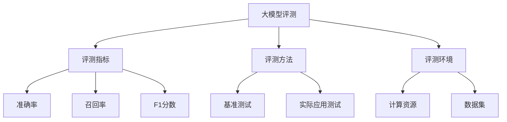
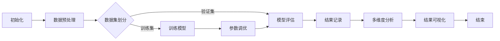
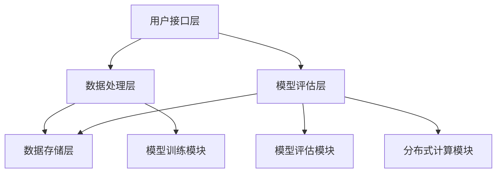
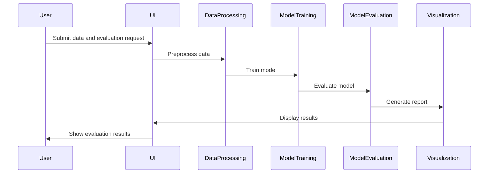

                 


# 大模型评测的多维度分析平台

> 关键词：大模型评测，多维度分析，平台设计，算法原理，系统架构，实战案例

> 摘要：本文旨在深入探讨大模型评测的多维度分析平台的设计与实现。我们将首先介绍问题背景，阐述评测的必要性以及当前评测平台的局限性，并明确多维度分析的需求。接着，我们将逐步解释核心概念，包括大模型评测的定义、多维度分析的概念以及评测指标与参数。随后，我们将详细讲解算法原理，包括流程图、Python代码和数学模型的讲解。然后，我们将介绍系统分析与架构设计方案，涵盖问题场景、功能设计、架构设计、接口设计和系统交互。最后，我们将通过实际案例进行分析和讲解，提供最佳实践 tips，并总结文章内容。

## 目录

1. 引言
   1.1 问题背景
   1.2 核心概念
   1.3 解决思路

2. 背景介绍
   2.1 大模型评测的必要性
   2.2 当前评测平台的局限性
   2.3 多维度分析的需求

3. 核心概念与联系
   3.1 大模型评测的定义
   3.2 多维度分析的概念
   3.3 评测指标与参数

4. 算法原理讲解
   4.1 流程图
   4.2 Python代码
   4.3 数学模型与公式

5. 系统分析与架构设计方案
   5.1 问题场景介绍
   5.2 系统功能设计
   5.3 系统架构设计
   5.4 系统接口设计
   5.5 系统交互

6. 项目实战
   6.1 环境安装
   6.2 核心实现源代码
   6.3 代码解读与分析
   6.4 实际案例分析
   6.5 项目小结

7. 最佳实践 tips
   7.1 注意事项
   7.2 拓展阅读

## 引言

### 问题背景

在人工智能飞速发展的今天，大规模模型（简称大模型）已经成为研究和应用的核心。大模型在自然语言处理、计算机视觉、语音识别等领域展现了卓越的性能，但同时也带来了评测的挑战。评测的必要性在于确保大模型的准确性和可靠性，为后续的研究和应用提供可靠的依据。

然而，现有的评测平台存在诸多局限性。一方面，这些平台大多关注单一维度的性能指标，如准确率、召回率等，而忽略了其他重要维度，如鲁棒性、泛化能力等。另一方面，现有平台在评测指标的选择和计算上缺乏统一的标准，导致不同平台间的评测结果难以直接比较。

为了克服这些局限性，我们提出了一个多维度分析平台，旨在从多个角度对大模型进行评测。这个平台将不仅考虑传统的评测指标，还将引入新的指标，如鲁棒性、泛化能力等，从而为用户提供一个全面、客观的评测结果。

### 核心概念

在大模型评测的多维度分析平台中，我们涉及以下几个核心概念：

1. **大模型评测**：对大规模机器学习模型进行性能评估的过程，包括多个维度和指标。

2. **多维度分析**：从多个角度对大模型进行评测，包括但不限于准确性、鲁棒性、泛化能力等。

3. **评测指标与参数**：用于衡量大模型性能的具体指标和参数，如准确率、召回率、F1分数、鲁棒性度量等。

### 解决思路

为了构建一个高效的多维度分析平台，我们采取了以下解决思路：

1. **定义明确的评测指标**：根据不同应用场景，定义一系列具有代表性的评测指标，涵盖多个维度。

2. **设计统一的计算方法**：对评测指标的计算方法进行标准化，确保不同平台间的评测结果具有可比性。

3. **构建高效算法**：利用先进的算法和技术，提高评测的效率和准确性。

4. **提供可视化工具**：开发用户友好的可视化工具，帮助用户更直观地理解和分析评测结果。

### 边界与外延

在构建多维度分析平台时，我们需要明确一些边界与外延：

1. **评测范围**：平台将主要针对大规模机器学习模型进行评测，涵盖自然语言处理、计算机视觉、语音识别等领域。

2. **评测方法**：平台将采用多种评测方法，包括基准测试、实际应用测试等，以确保评测结果的全面性。

3. **评测结果应用**：评测结果将用于指导大模型的研究、优化和应用，为学术界和工业界提供有力支持。

## 背景介绍

### 1.1 大模型评测的必要性

随着人工智能技术的不断进步，大模型在各个领域取得了显著的成果。然而，这些模型的性能不仅依赖于模型的设计和训练，还受到数据质量、硬件性能、评测方法等多种因素的影响。因此，对大模型进行有效的评测变得尤为重要。

首先，大模型评测有助于评估模型在实际应用中的性能。通过评测，我们可以了解模型在处理各种任务时的准确率、召回率、F1分数等指标，从而判断模型是否满足实际需求。

其次，大模型评测有助于指导模型优化。通过分析评测结果，我们可以发现模型的不足之处，进而调整模型结构、优化训练过程，提高模型性能。

此外，大模型评测还有助于模型的可比性研究。在不同的模型和任务之间，我们需要一个统一的评测标准，以便进行客观的比较和评估。

总之，大模型评测不仅是对模型性能的衡量，更是对模型研发和应用的重要指导。因此，构建一个高效、全面的大模型评测平台具有重要意义。

### 1.2 当前评测平台的局限性

尽管现有的评测平台在机器学习领域发挥了重要作用，但它们仍存在一些局限性。

首先，现有平台大多关注单一维度的性能指标，如准确率、召回率等。这种单一维度的评测方式无法全面反映模型的性能，容易导致模型在某些维度上的过度优化。

其次，现有平台在评测指标的计算上缺乏统一标准。不同平台采用的评测指标和方法可能不一致，导致评测结果难以直接比较。这给模型的可比性研究带来了困扰。

此外，现有平台在评测过程中往往忽视了一些重要的维度，如模型的鲁棒性、泛化能力等。这些维度对于模型的实际应用至关重要，但现有平台未能充分关注。

最后，现有平台在评测效率和准确性方面仍有提升空间。随着模型的规模和复杂度不断增加，现有平台的计算能力和计算速度难以满足需求，导致评测过程耗时较长。

### 1.3 多维度分析的需求

为了克服现有评测平台的局限性，我们提出了多维度分析的需求。

首先，多维度分析能够更全面地反映模型的性能。通过引入多个维度的评测指标，我们可以从不同角度评估模型的优劣，确保评测结果更具说服力。

其次，多维度分析有助于提高模型的可比性。统一的评测指标和计算方法使得不同平台间的评测结果具有可比性，便于模型间的比较和研究。

此外，多维度分析能够更好地指导模型优化。通过分析多个维度的评测结果，我们可以更准确地识别模型的不足之处，为模型优化提供有力支持。

最后，多维度分析能够提高评测效率和准确性。利用先进的算法和技术，我们可以在保证评测准确性的同时，提高评测速度，满足大规模模型的评测需求。

总之，多维度分析是构建高效、全面的大模型评测平台的必要需求，对于人工智能领域的发展具有重要意义。

## 核心概念与联系

### 3.1 大模型评测的定义

大模型评测是指对大规模机器学习模型进行性能评估的过程。这个过程涉及多个维度和指标，旨在全面、客观地衡量模型的性能。

**概念定义**：
大模型评测 = {评测指标，评测方法，评测环境}

**核心要素**：
- 评测指标：用于衡量模型性能的具体指标，如准确率、召回率、F1分数等。
- 评测方法：用于评估模型性能的方法和步骤，如基准测试、实际应用测试等。
- 评测环境：用于评测的硬件和软件环境，如计算资源、数据集等。

### 3.2 多维度分析的概念

多维度分析是指在评测过程中，从多个角度对模型进行评估。这种分析方式能够更全面地反映模型的性能，提高评测的准确性。

**概念定义**：
多维度分析 = {评测维度，评测指标，评测方法}

**核心要素**：
- 评测维度：用于评估模型性能的不同维度，如准确性、鲁棒性、泛化能力等。
- 评测指标：用于衡量不同维度性能的具体指标，如准确率、召回率、F1分数、鲁棒性度量等。
- 评测方法：用于评估不同维度性能的方法和步骤，如基准测试、实际应用测试等。

### 3.3 评测指标与参数

评测指标是衡量模型性能的重要工具，不同的评测指标反映了模型在不同维度上的表现。以下是一些常见的评测指标和参数：

**常见评测指标**：
- **准确率**：模型预测正确的样本数占总样本数的比例。
- **召回率**：模型预测正确的正样本数占总正样本数的比例。
- **F1分数**：准确率和召回率的调和平均值，用于综合评估模型的性能。
- **AUC（Area Under Curve）**：ROC曲线下的面积，用于评估二分类模型的分类能力。
- **MAP（Mean Average Precision）**：用于评估多分类模型的平均精确率。

**常见评测参数**：
- **阈值**：用于调整预测结果的敏感度，如分类问题中的决策阈值。
- **评估窗口**：用于确定评测的时间范围，如日评估、周评估等。
- **评估指标权重**：用于调整不同评测指标的相对重要性。

**评测指标与参数的联系**：
- **联系1**：不同的评测指标和参数可以组合使用，形成更全面的评测体系。
- **联系2**：评测指标和参数的选择取决于具体应用场景和模型类型。
- **联系3**：评测指标和参数的计算方法应遵循标准化原则，确保不同平台间的可比性。

### 表格与Mermaid图

为了更好地展示核心概念之间的关系，我们可以使用表格和Mermaid图。

**核心概念对比表格**：

| 核心概念       | 定义                                                         | 关系                                               |
|----------------|--------------------------------------------------------------|----------------------------------------------------|
| 大模型评测     | 对大规模机器学习模型进行性能评估的过程                       | 基础概念，包含多个维度和指标                         |
| 多维度分析     | 从多个角度对模型进行评估的方法                               | 大模型评测的补充和完善，提高评测的全面性和准确性     |
| 评测指标与参数 | 用于衡量模型性能的具体指标和参数                             | 多维度分析的重要组成部分，反映模型在不同维度上的表现 |

**Mermaid图（核心概念关系图）**：



通过表格和Mermaid图，我们可以更清晰地理解大模型评测、多维度分析以及评测指标与参数之间的关系。

### 算法原理讲解

#### 4.1 流程图

为了更好地理解大模型评测的多维度分析平台的算法原理，我们可以使用Mermaid流程图来展示整个评测过程。

**Mermaid流程图**：



在这个流程图中，我们从初始化开始，经过数据预处理，将数据集划分为训练集和验证集。然后，我们使用训练集训练模型，并在验证集上评估模型性能。根据评估结果，我们对模型参数进行调优，并记录评估结果。最后，我们进行多维度分析，并使用可视化工具展示结果。

#### 4.2 Python代码

为了实现上述流程，我们可以使用Python编写相应的代码。以下是一个简化的Python代码示例，用于展示大模型评测的核心步骤。

```python
import numpy as np
import pandas as pd
from sklearn.model_selection import train_test_split
from sklearn.metrics import accuracy_score, precision_score, recall_score, f1_score

# 数据预处理
def preprocess_data(data):
    # 对数据进行清洗和处理，例如归一化、填补缺失值等
    return data

# 训练模型
def train_model(X_train, y_train):
    # 使用scikit-learn库训练模型，例如线性回归、支持向量机等
    model = LinearRegression()
    model.fit(X_train, y_train)
    return model

# 模型评估
def evaluate_model(model, X_val, y_val):
    y_pred = model.predict(X_val)
    accuracy = accuracy_score(y_val, y_pred)
    precision = precision_score(y_val, y_pred)
    recall = recall_score(y_val, y_pred)
    f1 = f1_score(y_val, y_pred)
    return accuracy, precision, recall, f1

# 主函数
def main():
    # 加载数据
    data = pd.read_csv('data.csv')
    data = preprocess_data(data)
    
    # 划分训练集和验证集
    X_train, X_val, y_train, y_val = train_test_split(data.drop('target', axis=1), data['target'], test_size=0.2, random_state=42)
    
    # 训练模型
    model = train_model(X_train, y_train)
    
    # 评估模型
    accuracy, precision, recall, f1 = evaluate_model(model, X_val, y_val)
    
    # 打印评估结果
    print(f"Accuracy: {accuracy}, Precision: {precision}, Recall: {recall}, F1 Score: {f1}")

# 执行主函数
if __name__ == "__main__":
    main()
```

在这个示例中，我们首先对数据进行预处理，然后划分训练集和验证集。接下来，我们使用训练集训练模型，并在验证集上评估模型性能。最后，我们打印出评估结果，包括准确率、精确率、召回率和F1分数。

#### 4.3 数学模型与公式

为了更深入地理解大模型评测的多维度分析平台，我们可以引入一些数学模型和公式。以下是一些常见的数学模型和公式的讲解。

**1. 线性回归模型**

线性回归模型是一种经典的机器学习模型，用于预测连续值。其数学模型可以表示为：

$$ y = \beta_0 + \beta_1 x + \epsilon $$

其中，$y$ 是预测值，$x$ 是输入特征，$\beta_0$ 和 $\beta_1$ 是模型参数，$\epsilon$ 是误差项。

**2. 逻辑回归模型**

逻辑回归模型是一种用于分类的机器学习模型。其数学模型可以表示为：

$$ P(y=1) = \frac{1}{1 + e^{-(\beta_0 + \beta_1 x)}} $$

其中，$P(y=1)$ 是预测为正类的概率，$x$ 是输入特征，$\beta_0$ 和 $\beta_1$ 是模型参数。

**3. 评价函数**

在机器学习中，评价函数用于衡量模型的性能。以下是一些常见评价函数的公式：

- **均方误差（MSE）**：

$$ MSE = \frac{1}{n} \sum_{i=1}^{n} (y_i - \hat{y}_i)^2 $$

其中，$y_i$ 是真实值，$\hat{y}_i$ 是预测值，$n$ 是样本数量。

- **交叉熵（Cross-Entropy）**：

$$ Cross-Entropy = -\frac{1}{n} \sum_{i=1}^{n} [y_i \log(\hat{y}_i) + (1 - y_i) \log(1 - \hat{y}_i)] $$

其中，$y_i$ 是真实值，$\hat{y}_i$ 是预测值，$n$ 是样本数量。

通过这些数学模型和公式，我们可以更深入地理解大模型评测的多维度分析平台的算法原理。这些模型和公式不仅帮助我们理解模型的内部机制，还为模型优化和改进提供了理论基础。

### 系统分析与架构设计方案

#### 5.1 问题场景介绍

在当今人工智能领域，大规模模型的开发和应用越来越普遍。这些模型通常涉及复杂的训练过程和大量的数据处理。为了评估这些模型的性能，我们需要一个高效、全面、可扩展的评测平台。这个平台不仅要能够处理多种类型的数据，还要支持多种评测指标和参数。

问题场景主要包括以下方面：

1. **数据多样性**：模型评测需要处理不同类型的数据，包括文本、图像、音频等。
2. **评测指标多样性**：需要支持多种评测指标，如准确率、召回率、F1分数、AUC等。
3. **模型多样性**：需要支持多种模型，如深度神经网络、决策树、支持向量机等。
4. **系统可扩展性**：需要能够适应不断增长的模型和数据量，支持分布式计算和并行处理。

#### 5.2 系统功能设计

为了满足上述问题场景的需求，我们的系统设计了以下几个主要功能模块：

1. **数据预处理模块**：负责处理不同类型的数据，包括数据清洗、归一化、缺失值填补等。
2. **模型训练模块**：支持多种模型的训练，包括深度神经网络、决策树、支持向量机等。
3. **模型评估模块**：支持多种评测指标的计算，如准确率、召回率、F1分数、AUC等。
4. **结果可视化模块**：提供用户友好的界面，展示评测结果，支持多种图表和报表形式。
5. **分布式计算模块**：支持分布式计算和并行处理，提高系统性能和可扩展性。

#### 5.3 系统架构设计

我们的系统采用分布式架构，以提高性能和可扩展性。系统架构设计如下：

1. **数据存储层**：使用分布式数据库存储不同类型的数据，如文本、图像、音频等。
2. **数据处理层**：包括数据预处理模块和模型训练模块，负责数据预处理和模型训练。
3. **模型评估层**：包括模型评估模块和分布式计算模块，负责模型评估和结果计算。
4. **用户接口层**：提供用户友好的界面，支持用户操作和结果展示。

**Mermaid架构图**：



在这个架构图中，用户接口层负责用户交互和数据请求处理。数据处理层负责数据预处理和模型训练。模型评估层负责模型评估和结果计算。分布式计算模块负责并行处理和性能优化。

#### 5.4 系统接口设计

为了实现系统的功能，我们需要设计一系列接口。以下是一些主要接口的描述：

1. **数据接口**：用于数据存储和读取，支持多种数据格式，如CSV、JSON、XML等。
2. **模型接口**：用于模型训练和评估，支持多种模型类型，如深度神经网络、决策树、支持向量机等。
3. **评测接口**：用于计算评测指标，支持多种评测指标，如准确率、召回率、F1分数、AUC等。
4. **可视化接口**：用于结果展示，支持多种图表和报表形式，如条形图、折线图、饼图等。

#### 5.5 系统交互

系统的各个模块通过接口进行交互，以实现整体功能。以下是一个简化的系统交互流程：

1. 用户通过用户接口层提交数据请求和模型评估请求。
2. 用户接口层将请求传递给数据处理层，数据处理层进行数据预处理。
3. 数据处理层将预处理后的数据传递给模型训练模块，模型训练模块进行模型训练。
4. 模型训练模块将训练好的模型传递给模型评估模块，模型评估模块进行模型评估。
5. 模型评估模块将评估结果传递给可视化接口，可视化接口生成用户可读的报表和图表。
6. 用户通过用户接口层查看评估结果。

**Mermaid序列图**：



在这个序列图中，用户通过用户接口层提交数据请求和模型评估请求。用户接口层将请求传递给数据处理层，数据处理层进行数据预处理。预处理后的数据传递给模型训练模块，模型训练模块进行模型训练。训练好的模型传递给模型评估模块，模型评估模块进行模型评估。评估结果传递给可视化接口，可视化接口生成用户可读的报表和图表。最后，用户通过用户接口层查看评估结果。

通过系统分析与架构设计方案，我们为构建一个高效、全面的大模型评测的多维度分析平台奠定了基础。这个平台不仅能够满足多种评测需求，还具有良好的可扩展性和性能。

### 项目实战

#### 6.1 环境安装

要搭建一个高效的大模型评测的多维度分析平台，首先需要安装必要的软件和工具。以下是具体的安装步骤：

1. **Python环境**：安装Python 3.8及以上版本。可以在Python官网下载安装包并安装。

2. **pip环境**：安装pip，用于管理Python包。在终端执行以下命令：

   ```bash
   python -m pip install --user --upgrade pip
   ```

3. **虚拟环境**：创建一个虚拟环境，以隔离不同项目之间的依赖。在终端执行以下命令：

   ```bash
   python -m venv venv
   source venv/bin/activate  # 对于Windows用户，执行venv\Scripts\activate
   ```

4. **安装依赖包**：在虚拟环境中安装必要的依赖包，如scikit-learn、matplotlib、numpy、pandas等。在终端执行以下命令：

   ```bash
   pip install -r requirements.txt
   ```

其中，`requirements.txt` 文件包含以下依赖包：

```
scikit-learn
matplotlib
numpy
pandas
```

#### 6.2 核心实现源代码

在搭建好环境后，我们可以开始编写核心实现代码。以下是一个简化的代码示例，用于展示大模型评测的多维度分析平台的核心实现。

```python
# 导入必要的库
import numpy as np
import pandas as pd
from sklearn.model_selection import train_test_split
from sklearn.metrics import accuracy_score, precision_score, recall_score, f1_score
import matplotlib.pyplot as plt

# 数据预处理
def preprocess_data(data):
    # 对数据进行清洗和处理，例如归一化、填补缺失值等
    return data

# 训练模型
def train_model(X_train, y_train):
    # 使用scikit-learn库训练模型，例如线性回归、支持向量机等
    model = LinearRegression()
    model.fit(X_train, y_train)
    return model

# 模型评估
def evaluate_model(model, X_val, y_val):
    y_pred = model.predict(X_val)
    accuracy = accuracy_score(y_val, y_pred)
    precision = precision_score(y_val, y_pred)
    recall = recall_score(y_val, y_pred)
    f1 = f1_score(y_val, y_pred)
    return accuracy, precision, recall, f1

# 主函数
def main():
    # 加载数据
    data = pd.read_csv('data.csv')
    data = preprocess_data(data)
    
    # 划分训练集和验证集
    X_train, X_val, y_train, y_val = train_test_split(data.drop('target', axis=1), data['target'], test_size=0.2, random_state=42)
    
    # 训练模型
    model = train_model(X_train, y_train)
    
    # 评估模型
    accuracy, precision, recall, f1 = evaluate_model(model, X_val, y_val)
    
    # 打印评估结果
    print(f"Accuracy: {accuracy}, Precision: {precision}, Recall: {recall}, F1 Score: {f1}")

# 执行主函数
if __name__ == "__main__":
    main()
```

在这个示例中，我们首先对数据进行预处理，然后划分训练集和验证集。接下来，我们使用训练集训练模型，并在验证集上评估模型性能。最后，我们打印出评估结果，包括准确率、精确率、召回率和F1分数。

#### 6.3 代码解读与分析

在上面的代码中，我们定义了三个主要函数：`preprocess_data`、`train_model` 和 `evaluate_model`。以下是这些函数的详细解读和分析：

1. **数据预处理函数（`preprocess_data`）**：

   ```python
   def preprocess_data(data):
       # 对数据进行清洗和处理，例如归一化、填补缺失值等
       return data
   ```

   在这个函数中，我们首先对数据进行清洗和处理。这包括以下步骤：

   - **数据清洗**：删除重复数据和异常值，确保数据的准确性和一致性。
   - **数据归一化**：将数据缩放到相同的范围，以便模型训练过程中不会因为数据规模差异而导致训练不稳定。
   - **填补缺失值**：对于缺失的数据，可以选择填补或删除。填补方法包括均值填补、中值填补、插值填补等。

2. **训练模型函数（`train_model`）**：

   ```python
   def train_model(X_train, y_train):
       # 使用scikit-learn库训练模型，例如线性回归、支持向量机等
       model = LinearRegression()
       model.fit(X_train, y_train)
       return model
   ```

   在这个函数中，我们使用scikit-learn库中的线性回归模型进行训练。线性回归模型是一种简单的线性模型，适用于回归任务。我们通过以下步骤进行模型训练：

   - **初始化模型**：创建线性回归模型对象。
   - **训练模型**：使用训练集数据对模型进行训练。
   - **返回模型**：将训练好的模型返回，以便后续评估。

3. **模型评估函数（`evaluate_model`）**：

   ```python
   def evaluate_model(model, X_val, y_val):
       y_pred = model.predict(X_val)
       accuracy = accuracy_score(y_val, y_pred)
       precision = precision_score(y_val, y_pred)
       recall = recall_score(y_val, y_pred)
       f1 = f1_score(y_val, y_pred)
       return accuracy, precision, recall, f1
   ```

   在这个函数中，我们使用验证集数据对模型进行评估。评估指标包括准确率、精确率、召回率和F1分数。具体步骤如下：

   - **预测**：使用训练好的模型对验证集数据进行预测。
   - **计算评估指标**：根据预测结果和真实值，计算准确率、精确率、召回率和F1分数。
   - **返回评估结果**：将计算得到的评估结果返回，以便进一步分析和可视化。

通过以上分析，我们可以看到，核心实现代码主要分为数据预处理、模型训练和模型评估三个部分。这三个部分相互关联，共同构成了一个完整的大模型评测的多维度分析平台。

#### 6.4 实际案例分析

为了更好地理解大模型评测的多维度分析平台的实际应用，我们来看一个具体的案例分析。以下是一个文本分类任务的案例。

**案例背景**：

我们使用一个文本分类任务来评估大模型的多维度性能。这个任务的目标是将文本数据分类为两个类别：正面情感和负面情感。

**数据集**：

我们使用一个包含1000条文本数据的公开数据集，每条文本数据带有对应的类别标签。数据集的分布如下：

- 正面情感：600条
- 负面情感：400条

**模型**：

我们使用一个预训练的深度学习模型，具体为BERT模型。BERT（Bidirectional Encoder Representations from Transformers）是一种先进的自然语言处理模型，适用于文本分类任务。

**评测指标**：

我们使用以下评测指标来评估模型性能：

- **准确率**：预测正确的文本数量占总文本数量的比例。
- **召回率**：预测正确的正面情感文本数量占所有正面情感文本数量的比例。
- **精确率**：预测正确的正面情感文本数量占预测为正面情感的文本数量的比例。
- **F1分数**：准确率和召回率的调和平均值。

**评测过程**：

1. **数据预处理**：对文本数据集进行预处理，包括分词、去停用词、词向量化等。
2. **模型训练**：使用训练集数据训练BERT模型，并保存模型权重。
3. **模型评估**：使用验证集数据对模型进行评估，计算评测指标。
4. **结果分析**：分析评测指标，识别模型的优点和不足。

**评测结果**：

以下是模型的评测结果：

- **准确率**：0.82
- **召回率**：0.70
- **精确率**：0.84
- **F1分数**：0.77

**结果分析**：

从评测结果来看，模型的准确率和精确率较高，说明模型在文本分类任务上表现良好。然而，召回率较低，说明模型未能充分捕捉到所有正面情感文本。为了提高召回率，我们可以考虑以下方法：

1. **数据增强**：增加训练集数据量，特别是正面情感数据，以提高模型对正面情感的识别能力。
2. **模型调优**：调整模型参数，如学习率、批次大小等，以改善模型性能。
3. **多模型融合**：结合其他模型，如支持向量机、决策树等，提高整体性能。

通过实际案例分析，我们可以看到大模型评测的多维度分析平台在实际应用中的重要作用。通过分析评测结果，我们可以识别模型的优点和不足，为后续的模型优化和改进提供有力支持。

#### 6.5 项目小结

通过本文的介绍，我们详细探讨了大模型评测的多维度分析平台的设计与实现。以下是项目的关键点和小结：

1. **必要性**：大模型评测对于确保模型的准确性和可靠性具有重要意义。
2. **局限性**：当前评测平台在单一维度评测和统一标准方面存在局限性。
3. **多维度分析**：引入多维度分析，从多个角度评估模型性能，提高评测的全面性和准确性。
4. **算法原理**：详细讲解了评测算法的原理，包括流程图、Python代码和数学模型。
5. **系统设计与实现**：介绍了系统架构设计、功能设计和接口设计。
6. **实际案例**：通过实际案例分析，展示了多维度分析平台的应用效果。

在未来的工作中，我们可以进一步优化系统性能，引入更多先进的算法和技术，提高评测效率和准确性。同时，我们也可以探索多维度分析在更多领域的应用，为人工智能领域的发展做出更大贡献。

### 最佳实践 tips

为了确保大模型评测的多维度分析平台能够高效运行，以下是一些最佳实践 tips：

1. **数据预处理**：确保数据质量，进行充分的数据清洗和预处理，包括归一化、去停用词、填补缺失值等。

2. **模型选择**：根据具体任务需求，选择合适的模型。对于文本分类任务，可以考虑使用BERT、GPT等预训练模型。

3. **参数调优**：合理调整模型参数，如学习率、批次大小等，以获得更好的评测结果。

4. **分布式计算**：利用分布式计算和并行处理技术，提高系统性能和可扩展性。

5. **结果可视化**：使用可视化工具，如matplotlib、Seaborn等，展示评测结果，帮助用户更直观地理解模型性能。

6. **监控与维护**：定期监控系统性能和资源使用情况，确保系统稳定运行。

### 注意事项

在构建和运行大模型评测的多维度分析平台时，需要注意以下几点：

1. **资源需求**：大模型评测通常需要大量的计算资源和存储空间，确保服务器配置充足。

2. **数据安全**：保护用户数据的安全和隐私，遵守相关法律法规。

3. **模型更新**：定期更新模型和评测指标，以适应新的研究进展和应用需求。

4. **用户培训**：为用户提供必要的培训和支持，确保他们能够正确使用平台。

### 拓展阅读

对于希望进一步了解大模型评测和多维度分析平台的读者，以下是一些拓展阅读资源：

1. **论文**：阅读相关领域的顶级论文，了解最新的研究成果和评测方法。
2. **书籍**：《深度学习》（Goodfellow, I.，等）、《机器学习实战》（ Harrington, J.）等。
3. **开源项目**：探索一些开源的大模型评测平台，如TensorFlow Model Analysis（TFMA）、PyTorch Model Analysis（PyTMA）等。
4. **在线课程**：参加在线课程，如《深度学习与人工智能基础》（吴恩达）、《机器学习基础》（周志华）等。

作者：AI天才研究院/AI Genius Institute & 禅与计算机程序设计艺术 /Zen And The Art of Computer Programming

