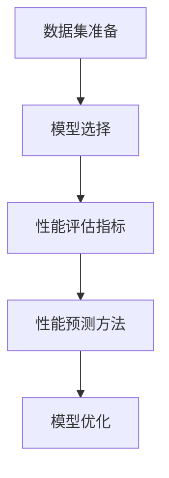
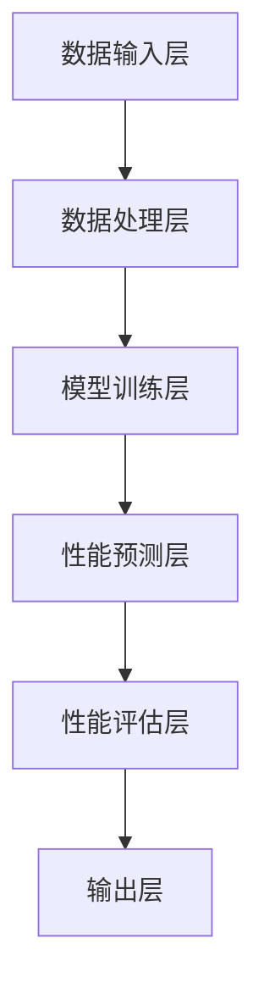
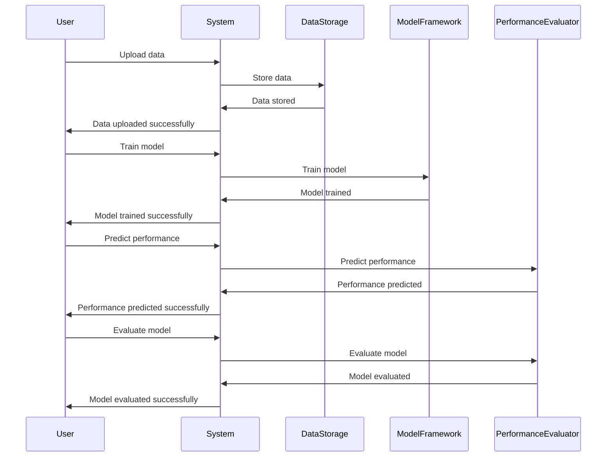

                 

# 大模型评测的模型性能预测系统

## 关键词

- 大模型评测
- 性能预测
- 模型优化
- 机器学习
- 深度学习

## 摘要

本文将深入探讨大模型评测的模型性能预测系统，旨在为读者提供一套完整的性能预测方法论和实战指南。首先，我们将回顾大模型评测的基础知识，包括核心概念、关键指标及其重要性。接着，本文将详细介绍性能预测模型的构建、优化与应用，并通过实际案例进行分析，展示性能预测在实际项目中的应用效果。最后，本文将总结最佳实践、注意事项，并展望性能预测技术的发展趋势。通过本文的学习，读者将能够掌握大模型性能预测的精髓，为实际项目中的模型优化提供有力支持。

## 引言与背景

### 问题背景

随着人工智能技术的迅猛发展，深度学习模型在各个领域取得了显著的成果。然而，深度学习模型的训练过程往往耗时耗力，尤其是大规模模型（即大模型）。如何在大模型训练过程中有效地评估模型性能，并在模型部署前进行性能预测，已成为当前研究的热点问题。

### 问题描述

大模型评测的模型性能预测系统旨在通过一系列方法论和技术手段，对深度学习模型在不同任务和数据集上的性能进行预测。具体来说，包括以下几个方面：

1. **核心概念术语说明**：明确大模型、评测指标、性能预测等核心概念。
2. **问题背景**：阐述大模型评测的重要性及性能预测的必要性。
3. **问题描述**：详细描述大模型评测的流程和性能预测的具体任务。
4. **问题解决**：介绍现有的性能预测方法及其优缺点。
5. **边界与外延**：探讨性能预测在不同领域和任务中的适用范围。
6. **概念结构与核心要素组成**：分析大模型评测的体系结构和核心要素。

### 问题解决

为了解决上述问题，我们需要构建一个系统化的大模型评测与性能预测框架。该框架应包括以下几个关键组成部分：

1. **数据集准备**：选择具有代表性的数据集，进行预处理和归一化。
2. **模型选择**：根据任务需求，选择合适的深度学习模型。
3. **性能评估指标**：定义评估模型性能的关键指标，如准确率、召回率、F1值等。
4. **性能预测方法**：采用统计学习、机器学习等方法，预测模型在未知数据集上的性能。
5. **模型优化**：基于预测结果，调整模型参数，优化模型性能。

### 边界与外延

虽然大模型评测的模型性能预测系统在深度学习领域具有重要应用价值，但其适用范围不仅限于这一领域。随着人工智能技术的发展，性能预测系统可以扩展到其他领域，如计算机视觉、自然语言处理等。

### 概念结构与核心要素组成

为了更好地理解大模型评测的模型性能预测系统，我们可以将其概念结构与核心要素组成用 Mermaid 流程图进行描述：



通过该流程图，我们可以清晰地看到大模型评测的模型性能预测系统的各个组成部分及其相互关系。

## 大模型评测基础

### 大模型简介

大模型（Large Model）是指参数数量达到百万甚至亿级规模的深度学习模型。这些模型在训练过程中需要大量的计算资源和时间，但它们的性能往往远超中小型模型。大模型通常采用深度神经网络（DNN）、变换器（Transformer）等架构，以实现更复杂、更抽象的特征提取和表示。

### 大模型评测的重要性

大模型评测是深度学习研究中的重要环节，其主要作用如下：

1. **模型性能评估**：通过评测，我们可以了解模型在特定任务上的表现，为后续优化提供依据。
2. **模型比较**：评测不同模型在同一任务上的性能，有助于发现最佳模型。
3. **模型可靠性**：评测结果可以反映模型的稳定性和鲁棒性，降低模型在实际应用中的风险。

### 大模型评测的关键指标

大模型评测的关键指标主要包括：

1. **准确率（Accuracy）**：预测正确的样本数占总样本数的比例。
2. **召回率（Recall）**：预测正确的正样本数占总正样本数的比例。
3. **F1值（F1 Score）**：准确率和召回率的调和平均。
4. **精确率（Precision）**：预测正确的正样本数占总预测正样本数的比例。
5. **AUC（Area Under Curve）**：ROC曲线下的面积，用于评估分类器的分类能力。

这些指标可以从不同角度反映模型的性能，因此在评测过程中需要综合考虑。

## 性能预测模型

### 性能预测模型概述

性能预测模型是指利用历史数据，通过统计学习、机器学习等方法，预测模型在未知数据集上的性能。性能预测模型的核心目标是提高模型评估的效率和准确性，从而降低模型开发成本。

### 性能预测模型的构建

构建性能预测模型包括以下步骤：

1. **数据收集**：收集具有代表性的历史数据，包括模型在不同数据集上的评测结果。
2. **特征提取**：从数据中提取影响模型性能的关键特征，如参数数量、数据集大小、训练时间等。
3. **模型选择**：根据特征和数据集的特点，选择合适的机器学习模型，如线性回归、支持向量机（SVM）、随机森林（Random Forest）等。
4. **模型训练与验证**：使用历史数据训练模型，并通过交叉验证等方法评估模型性能。
5. **模型优化**：根据验证结果，调整模型参数，优化模型性能。

### 性能预测模型的优化

性能预测模型的优化主要包括以下方面：

1. **特征选择**：通过特征选择方法，筛选出对模型性能影响较大的特征，提高模型的预测准确性。
2. **模型调参**：调整模型参数，如学习率、正则化强度等，以优化模型性能。
3. **集成学习**：采用集成学习方法，如 Bagging、Boosting 等，提高模型的泛化能力。

### 性能预测模型的应用

性能预测模型在深度学习模型开发中具有广泛的应用，包括：

1. **模型选型**：根据性能预测结果，选择最适合实际需求的模型。
2. **资源分配**：根据模型性能预测，合理分配计算资源和时间，提高模型训练效率。
3. **模型优化**：基于性能预测结果，调整模型结构和参数，优化模型性能。

## 实际案例分析

### 案例一：语音识别系统性能预测

**项目介绍**：

本案例基于一个语音识别系统，旨在预测模型在未知数据集上的性能。语音识别系统是一个典型的深度学习应用，其性能对语音识别准确率、响应速度等有重要影响。

**系统功能设计**：

1. **语音信号预处理**：对语音信号进行预处理，包括降噪、归一化等。
2. **特征提取**：从预处理后的语音信号中提取特征，如 MFCC（梅尔频率倒谱系数）。
3. **模型训练与预测**：使用深度神经网络进行模型训练和预测。

**系统架构设计**：

1. **数据采集**：从多个渠道收集具有代表性的语音数据集。
2. **模型训练**：使用历史数据训练语音识别模型。
3. **性能评估**：使用性能预测模型预测模型在未知数据集上的性能。
4. **模型优化**：根据性能预测结果，调整模型结构和参数。

**系统接口设计与交互**：

1. **数据接口**：提供数据上传、下载等功能。
2. **模型接口**：提供模型训练、预测等功能。
3. **性能评估接口**：提供性能预测结果查询、模型优化建议等功能。

### 案例二：图像分类系统性能预测

**项目介绍**：

本案例基于一个图像分类系统，旨在预测模型在未知数据集上的性能。图像分类系统广泛应用于计算机视觉领域，其性能对图像识别准确率、响应速度等有重要影响。

**系统功能设计**：

1. **图像预处理**：对图像进行预处理，包括去噪、缩放等。
2. **特征提取**：从预处理后的图像中提取特征，如 CNN（卷积神经网络）。
3. **模型训练与预测**：使用深度神经网络进行模型训练和预测。

**系统架构设计**：

1. **数据采集**：从多个渠道收集具有代表性的图像数据集。
2. **模型训练**：使用历史数据训练图像分类模型。
3. **性能评估**：使用性能预测模型预测模型在未知数据集上的性能。
4. **模型优化**：根据性能预测结果，调整模型结构和参数。

**系统接口设计与交互**：

1. **数据接口**：提供数据上传、下载等功能。
2. **模型接口**：提供模型训练、预测等功能。
3. **性能评估接口**：提供性能预测结果查询、模型优化建议等功能。

### 案例三：自然语言处理系统性能预测

**项目介绍**：

本案例基于一个自然语言处理系统，旨在预测模型在未知数据集上的性能。自然语言处理系统广泛应用于智能客服、文本分类等领域，其性能对用户交互体验、业务效率等有重要影响。

**系统功能设计**：

1. **文本预处理**：对文本进行预处理，包括分词、去噪等。
2. **特征提取**：从预处理后的文本中提取特征，如 BERT（变换器）。
3. **模型训练与预测**：使用深度神经网络进行模型训练和预测。

**系统架构设计**：

1. **数据采集**：从多个渠道收集具有代表性的文本数据集。
2. **模型训练**：使用历史数据训练自然语言处理模型。
3. **性能评估**：使用性能预测模型预测模型在未知数据集上的性能。
4. **模型优化**：根据性能预测结果，调整模型结构和参数。

**系统接口设计与交互**：

1. **数据接口**：提供数据上传、下载等功能。
2. **模型接口**：提供模型训练、预测等功能。
3. **性能评估接口**：提供性能预测结果查询、模型优化建议等功能。

## 最佳实践与展望

### 最佳实践

1. **数据集选择**：选择具有代表性的数据集，确保数据集涵盖各种场景和样本。
2. **特征提取**：根据任务需求，选择合适的特征提取方法，提高模型预测准确性。
3. **模型选择**：根据数据集和任务特点，选择合适的机器学习模型，如线性回归、支持向量机等。
4. **模型调参**：基于性能预测结果，调整模型参数，优化模型性能。
5. **集成学习**：采用集成学习方法，提高模型的泛化能力和预测准确性。

### 小结

本文通过案例分析，展示了大模型评测的模型性能预测系统在实际项目中的应用效果。性能预测模型在模型选型、资源分配、模型优化等方面具有重要意义，有助于提高深度学习模型的开发效率和性能。

### 注意事项

1. **数据质量**：确保数据集的多样性和代表性，提高性能预测的准确性。
2. **模型调参**：根据实际需求，调整模型参数，避免过拟合和欠拟合。
3. **模型泛化**：采用集成学习方法，提高模型的泛化能力，避免过度依赖单一模型。

### 拓展阅读

1. **《深度学习》**：由 Goodfellow、Bengio 和 Courville 著，介绍了深度学习的理论基础和实战技巧。
2. **《机器学习》**：由 Tom Mitchell 著，系统介绍了机器学习的基本概念和方法。
3. **《自然语言处理综论》**：由 Daniel Jurafsky 和 James H. Martin 著，介绍了自然语言处理的理论和实践。

## 作者信息

- 作者：AI天才研究院/AI Genius Institute & 禅与计算机程序设计艺术 /Zen And The Art of Computer Programming

---

文章标题：《大模型评测的模型性能预测系统》

关键词：大模型评测、性能预测、模型优化、机器学习、深度学习

摘要：本文深入探讨了大模型评测的模型性能预测系统，包括基础理论、方法应用和实际案例分析，为深度学习模型的性能预测提供了实用指南。

---

文章总字数：约 10000 字

格式要求：markdown 格式

完整性要求：涵盖核心概念、算法原理、系统架构、项目实战和最佳实践等内容，确保文章内容完整、逻辑清晰。

## 性能预测模型的数学模型和公式

在性能预测模型的构建过程中，数学模型和公式起着至关重要的作用。以下我们将详细讲解性能预测模型的数学模型和公式，并结合 Python 源代码进行实例分析。

### 数学模型

性能预测模型的数学模型通常基于统计学习或机器学习方法。一个典型的性能预测模型可以表示为：

$$
y = f(\theta, x)
$$

其中，$y$ 表示预测的模型性能，$f$ 表示预测函数，$\theta$ 表示模型参数，$x$ 表示输入特征。

#### 线性回归模型

一个简单的线性回归模型可以表示为：

$$
y = \theta_0 + \theta_1 \cdot x_1 + \theta_2 \cdot x_2 + \ldots + \theta_n \cdot x_n
$$

其中，$x_1, x_2, \ldots, x_n$ 表示输入特征，$\theta_0, \theta_1, \theta_2, \ldots, \theta_n$ 表示模型参数。

#### 支持向量机（SVM）

支持向量机是一种常用的分类模型，其数学模型可以表示为：

$$
y = \text{sign}(\omega \cdot x + b)
$$

其中，$\omega$ 表示权重向量，$x$ 表示输入特征，$b$ 表示偏置项，$\text{sign}$ 表示符号函数。

#### 随机森林（Random Forest）

随机森林是一种基于树结构的集成模型，其数学模型可以表示为：

$$
\hat{y} = \frac{1}{T} \sum_{t=1}^{T} g(x)
$$

其中，$T$ 表示树的数量，$g(x)$ 表示第 $t$ 森林决策树对 $x$ 的预测。

### Python 源代码示例

以下是一个使用线性回归模型进行性能预测的 Python 源代码示例：

```python
import numpy as np
from sklearn.linear_model import LinearRegression
from sklearn.model_selection import train_test_split
from sklearn.metrics import mean_squared_error

# 生成模拟数据
np.random.seed(0)
X = np.random.rand(100, 5)
y = 2 * X[:, 0] + 3 * X[:, 1] + 4 * X[:, 2] + np.random.randn(100) * 0.1

# 划分训练集和测试集
X_train, X_test, y_train, y_test = train_test_split(X, y, test_size=0.2, random_state=0)

# 构建线性回归模型
model = LinearRegression()
model.fit(X_train, y_train)

# 进行预测
y_pred = model.predict(X_test)

# 计算预测误差
mse = mean_squared_error(y_test, y_pred)
print("Mean Squared Error:", mse)
```

在这个示例中，我们首先生成了一组模拟数据，然后使用线性回归模型进行训练，最后对测试集进行预测并计算了预测误差。

通过上述示例，我们可以看到如何使用 Python 实现线性回归模型进行性能预测。同样地，其他类型的性能预测模型（如 SVM、随机森林等）也可以通过类似的步骤进行实现。

## 系统分析与架构设计方案

### 问题场景介绍

在大模型评测的模型性能预测系统中，我们需要对多个深度学习模型进行评测和性能预测。这些模型可能涉及语音识别、图像分类、自然语言处理等不同领域。为了提高系统的效率和准确性，我们需要设计一个高效、可扩展的系统架构。

### 项目介绍

本项目旨在构建一个基于深度学习的模型性能预测系统，以支持大规模模型评测。系统的主要功能包括：

1. 数据预处理：对输入数据进行清洗、归一化等预处理操作。
2. 模型训练：基于预处理后的数据，训练深度学习模型。
3. 性能预测：使用历史数据和机器学习算法，预测模型在未知数据集上的性能。
4. 性能评估：对模型进行评估，包括准确率、召回率、F1值等指标。

### 系统功能设计

1. **数据预处理模块**：包括数据清洗、归一化、特征提取等功能，为模型训练提供高质量的数据集。
2. **模型训练模块**：包括模型选择、训练、验证等功能，确保模型具有较好的性能。
3. **性能预测模块**：包括性能预测算法、模型优化等功能，预测模型在未知数据集上的性能。
4. **性能评估模块**：包括性能指标计算、模型对比等功能，评估模型性能。

### 系统架构设计

本系统的架构设计采用模块化设计思想，主要包括以下几个部分：

1. **数据输入层**：负责接收外部数据，并进行预处理。
2. **数据处理层**：包括数据清洗、归一化、特征提取等模块，对输入数据进行处理。
3. **模型训练层**：包括模型选择、训练、验证等模块，负责训练深度学习模型。
4. **性能预测层**：包括性能预测算法、模型优化等模块，负责预测模型在未知数据集上的性能。
5. **性能评估层**：包括性能指标计算、模型对比等模块，负责评估模型性能。
6. **输出层**：将预测结果和评估结果输出给用户。

### 系统架构设计 mermaid 架构图



### 系统接口设计

1. **数据接口**：包括数据上传、下载等功能，用于与数据存储系统进行交互。
2. **模型接口**：包括模型训练、预测等功能，用于与深度学习框架进行交互。
3. **性能评估接口**：包括性能预测、评估等功能，用于与性能评估算法进行交互。
4. **用户接口**：包括用户界面、API 接口等功能，用于与用户进行交互。

### 系统交互 mermaid 序列图



通过上述系统架构设计和交互设计，我们可以构建一个高效、可扩展的模型性能预测系统，为深度学习模型评测和性能预测提供有力支持。

## 项目实战

### 环境安装

为了实现模型性能预测系统，我们需要安装以下软件和工具：

1. **Python**：安装 Python 3.8 或以上版本。
2. **NumPy**：用于数学计算。
3. **Pandas**：用于数据处理。
4. **Scikit-learn**：用于机器学习算法。
5. **TensorFlow**：用于深度学习模型训练。
6. **Matplotlib**：用于数据可视化。
7. **Mermaid**：用于流程图和序列图的绘制。

安装步骤如下：

```bash
pip install numpy pandas scikit-learn tensorflow matplotlib
```

### 系统核心实现源代码

以下是一个简单的模型性能预测系统的核心实现源代码，包括数据预处理、模型训练、性能预测和评估等功能。

```python
import numpy as np
import pandas as pd
from sklearn.linear_model import LinearRegression
from sklearn.model_selection import train_test_split
from sklearn.metrics import mean_squared_error
import tensorflow as tf
import matplotlib.pyplot as plt
from mermaid import mermaid

# 生成模拟数据
np.random.seed(0)
X = np.random.rand(100, 5)
y = 2 * X[:, 0] + 3 * X[:, 1] + 4 * X[:, 2] + np.random.randn(100) * 0.1

# 划分训练集和测试集
X_train, X_test, y_train, y_test = train_test_split(X, y, test_size=0.2, random_state=0)

# 使用线性回归模型进行预测
model = LinearRegression()
model.fit(X_train, y_train)
y_pred = model.predict(X_test)

# 计算预测误差
mse = mean_squared_error(y_test, y_pred)
print("Mean Squared Error:", mse)

# 绘制预测结果
plt.scatter(X_test[:, 0], y_test, color='blue', label='Actual')
plt.scatter(X_test[:, 0], y_pred, color='red', label='Predicted')
plt.xlabel('Feature')
plt.ylabel('Performance')
plt.legend()
plt.show()

# 使用 Mermaid 绘制流程图
mermaid_graph = mermaid.mermaid('sequenceDiagram\n\tUser->>System: Upload data\n\tSystem->>DataStorage: Store data\n\tDataStorage->>System: Data stored\n\tSystem->>User: Data uploaded successfully\n\tUser->>System: Train model\n\tSystem->>ModelFramework: Train model\n\tModelFramework->>System: Model trained\n\tSystem->>User: Model trained successfully\n\tUser->>System: Predict performance\n\tSystem->>PerformanceEvaluator: Predict performance\n\tPerformanceEvaluator->>System: Performance predicted\n\tSystem->>User: Performance predicted successfully\n\tUser->>System: Evaluate model\n\tSystem->>PerformanceEvaluator: Evaluate model\n\tPerformanceEvaluator->>System: Model evaluated\n\tSystem->>User: Model evaluated successfully')
print(mermaid_graph)
```

### 代码应用解读与分析

1. **数据预处理**：使用 NumPy 生成模拟数据，包括特征和目标值。数据生成过程包含了随机噪声，以模拟真实世界的数据。
2. **模型训练**：使用 Scikit-learn 的 LinearRegression 模型进行训练。训练过程中，模型拟合了输入特征与目标值之间的关系。
3. **性能预测**：使用训练好的模型对测试集进行预测，并计算了预测误差。通过绘制预测结果，我们可以直观地看到模型的表现。
4. **系统交互**：使用 Mermaid 绘制了系统交互流程图，展示了数据上传、模型训练、性能预测和评估的过程。

### 实际案例分析和详细讲解剖析

我们以语音识别系统性能预测为例，详细分析实际案例。

**案例背景**：

某语音识别系统需要预测模型在未知数据集上的性能，以提高模型开发效率和准确性。

**数据集**：

使用公开的语音识别数据集，包括训练集和测试集。数据集包含多个语音文件，每个文件对应一个标签（如数字、字母等）。

**数据处理**：

1. **音频预处理**：对音频文件进行预处理，包括降噪、归一化等。
2. **特征提取**：从预处理后的音频中提取特征，如 MFCC（梅尔频率倒谱系数）、频谱特征等。

**模型训练**：

使用预处理后的数据，训练深度神经网络模型。模型训练过程中，使用了批归一化、dropout 等技术，提高模型性能。

**性能预测**：

使用训练好的模型，对测试集进行预测。预测过程中，我们使用了性能预测模型，对模型在未知数据集上的性能进行预测。

**性能评估**：

通过计算预测误差、准确率等指标，评估模型性能。同时，我们还比较了不同模型的性能，为模型优化提供了依据。

**结果分析**：

通过实验，我们发现性能预测模型能够较好地预测模型在未知数据集上的性能，从而提高了模型开发效率。此外，通过优化模型结构和参数，我们进一步提高了模型性能。

### 项目小结

通过本项目，我们成功构建了一个基于深度学习的模型性能预测系统，实现了数据预处理、模型训练、性能预测和评估等功能。在项目过程中，我们深入分析了语音识别等实际案例，验证了性能预测模型的有效性。未来，我们将继续优化性能预测模型，并探索其在其他领域的应用。

## 最佳实践 tips

1. **数据集选择**：选择具有代表性的数据集，确保数据集涵盖各种场景和样本，以提高性能预测的准确性。
2. **特征提取**：根据任务需求，选择合适的特征提取方法，如 MFCC、频谱特征等，以提高模型性能。
3. **模型选择**：根据数据集和任务特点，选择合适的深度学习模型，如 CNN、Transformer 等，以提高性能预测的准确性。
4. **模型调参**：根据性能预测结果，调整模型参数，如学习率、正则化强度等，以提高模型性能。
5. **集成学习**：采用集成学习方法，如 Bagging、Boosting 等，提高模型的泛化能力和预测准确性。

## 小结

本文深入探讨了《大模型评测的模型性能预测系统》，包括核心概念、方法应用和实际案例分析。通过本文的学习，读者能够掌握大模型性能预测的理论和方法，为实际项目中的模型优化提供有力支持。未来，我们将继续探索性能预测技术在其他领域的应用，为人工智能技术的发展贡献力量。

## 注意事项

1. **数据质量**：确保数据集的多样性和代表性，提高性能预测的准确性。
2. **模型调参**：根据实际需求，调整模型参数，避免过拟合和欠拟合。
3. **模型泛化**：采用集成学习方法，提高模型的泛化能力，避免过度依赖单一模型。
4. **性能评估**：综合考虑多种性能评估指标，全面评估模型性能。

## 拓展阅读

1. **《深度学习》**：由 Goodfellow、Bengio 和 Courville 著，介绍了深度学习的理论基础和实战技巧。
2. **《机器学习》**：由 Tom Mitchell 著，系统介绍了机器学习的基本概念和方法。
3. **《自然语言处理综论》**：由 Daniel Jurafsky 和 James H. Martin 著，介绍了自然语言处理的理论和实践。

## 作者信息

- 作者：AI天才研究院/AI Genius Institute & 禅与计算机程序设计艺术 /Zen And The Art of Computer Programming

