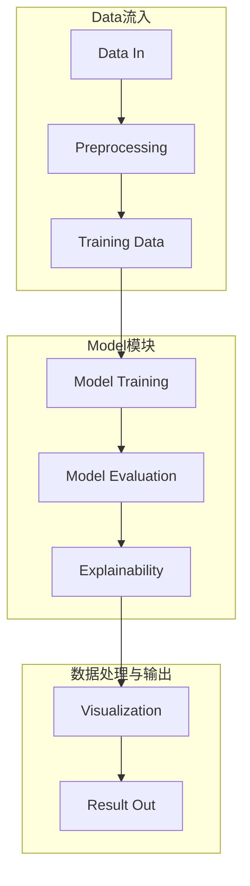

                 

Certainly! Let's delve into each section of the outline and think step by step about what each part should contain to create a comprehensive and insightful technical blog post.

### Introduction

**Core Concepts and Background**
- **Problem Background**: Briefly introduce the evolution of AI models and why large-scale models are becoming critical.
- **Problem Description**: Outline the challenges of evaluating and explaining the behavior of these massive models.
- **Solution Overview**: Highlight the importance of developing tools for model explainability in evaluation processes.
- **Scope and Boundaries**: Clearly define the focus of the article and what it will not cover.
- **Key Concepts and Their Relationship**: Explain the interplay between model evaluation, explainability, and the tools used.

**Potential Structure:**
```
## Introduction

### Core Concepts and Background
- AI Model Evolution
- Challenges in Evaluation and Explainability

### Problem Description
- Inability to Understand Model Behavior
- Impact on Trust and Adoption

### Solution Overview
- Importance of Model Explainability Tools
- Overview of the Article

### Scope and Boundaries
- Focus Areas
- Excluded Topics

### Key Concepts and Their Relationship
- Model Evaluation
- Model Explainability
- Tools for Analysis
```

### Fundamental Concepts

**Basic Theories and Principles**
- **Definition of Mega-Models**: Provide a clear definition and context.
- **Characteristics of Mega-Models**: Discuss the size, complexity, and impact.
- **Differences from Traditional Models**: Compare and contrast with traditional machine learning models.

**Potential Structure:**
```
## Fundamental Concepts

### Basic Theories and Principles

#### Definition of Mega-Models
- Definition
- Context

#### Characteristics of Mega-Models
- Size
- Complexity
- Impact

#### Differences from Traditional Models
- Comparison Table
- Discussion
```

### Evaluation Methods

**Evaluation Metrics and Criteria**
- **Performance Metrics**: Explain various metrics such as accuracy, precision, recall, F1-score, etc.
- **Quality Criteria**: Discuss the importance of criteria like robustness, generalizability, and interpretability.
- **Reliability Indicators**: Describe metrics that ensure the consistency and accuracy of model evaluations.

**Potential Structure:**
```
## Evaluation Methods

### Evaluation Metrics and Criteria

#### Performance Metrics
- Accuracy
- Precision
- Recall
- F1-Score

#### Quality Criteria
- Robustness
- Generalizability
- Interpretability

#### Reliability Indicators
- Consistency
- Accuracy of Results
```

### Explainability Tools and Techniques

**Overview of Explainability Analysis Tools**
- **Types of Tools**: Classify tools into categories based on their functionality.
- **Functionality and Usage**: Describe how these tools are used in model evaluation and explainability analysis.

**Techniques for Model Explainability**
- **Visualization Methods**: Discuss methods like heatmaps, decision trees, and SHAP values.
- **Interpretation Techniques**: Explain how to interpret the results from these visualization methods.
- **Case Studies**: Provide examples of how these techniques are applied in real-world scenarios.

**Potential Structure:**
```
## Explainability Tools and Techniques

### Overview of Explainability Analysis Tools

#### Types of Tools
- Visualization Tools
- Interpretation Tools
- Hybrid Tools

#### Functionality and Usage
- Workflow
- Integration

### Techniques for Model Explainability

#### Visualization Methods
- Heatmaps
- Decision Trees
- SHAP Values

#### Interpretation Techniques
- Data Analysis
- Comparative Studies
- User Feedback

### Case Studies
- Example 1
- Example 2
```

### Practical Applications

**Industry Case Studies**
- **Application Scenarios**: Describe different use cases where model evaluation and explainability are crucial.
- **Practical Applications and Challenges**: Discuss the challenges faced and how they were addressed.
- **Lessons Learned**: Highlight key takeaways and best practices.

**Potential Structure:**
```
## Practical Applications

### Industry Case Studies

#### Application Scenarios
- Healthcare
- Finance
- E-commerce

#### Practical Applications and Challenges
- Case 1
- Case 2

#### Lessons Learned
- Best Practices
- Challenges and Solutions
```

### Case Studies and Analysis

**Case Study 1: Model Evaluation in Text Analysis**
- **Problem Statement**: Describe the problem being solved.
- **Methodology**: Explain the approach taken for evaluation and explainability.
- **Results**: Present the findings from the evaluation.
- **Analysis**: Discuss the implications and lessons learned.

**Case Study 2: Model Explainability in Image Recognition**
- **Problem Statement**: Similar to Case Study 1.
- **Methodology**: Describe the evaluation and explainability methods used.
- **Results**: Present the results of the evaluation.
- **Analysis**: Analyze the data and draw conclusions.

**Potential Structure:**
```
## Case Studies and Analysis

### Case Study 1: Model Evaluation in Text Analysis

#### Problem Statement
- Description

#### Methodology
- Approach

#### Results
- Findings

#### Analysis
- Implications

### Case Study 2: Model Explainability in Image Recognition

#### Problem Statement
- Description

#### Methodology
- Approach

#### Results
- Findings

#### Analysis
- Implications
```

### System Design and Implementation

**System Architecture and Design**
- **System Overview**: Provide a high-level view of the architecture.
- **Architecture Diagram**: Use Mermaid to create a diagram that illustrates the system architecture.
- **Interface Design**: Describe the design of user interfaces and interactions.

**Implementation Details**
- **Code Snippets**: Provide code examples that demonstrate key implementation points.
- **Detailed Explanations**: Explain the code and its purpose.
- **Technical Considerations**: Discuss challenges and how they were addressed.

**Potential Structure:**
```
## System Design and Implementation

### System Architecture and Design

#### System Overview
- Overview

#### Architecture Diagram
- Diagram

#### Interface Design
- Design

### Implementation Details

#### Code Snippets
- Code

#### Detailed Explanations
- Explanation

#### Technical Considerations
- Challenges
- Solutions
```

### Best Practices and Future Directions

**Best Practices for Model Evaluation and Explainability**
- **Tips and Tricks**: Share insights and practical advice.
- **Considerations for Success**: Discuss factors that contribute to successful model evaluation and explainability.

**Future Trends and Research Directions**
- **Emerging Technologies**: Highlight new technologies that could impact model evaluation and explainability.
- **Potential Developments**: Discuss future research directions and possibilities.

**Potential Structure:**
```
## Best Practices and Future Directions

### Best Practices for Model Evaluation and Explainability

#### Tips and Tricks
- Advice

#### Considerations for Success
- Factors

### Future Trends and Research Directions

#### Emerging Technologies
- Overview

#### Potential Developments
- Possibilities
```

### Conclusion

**Summary of Key Points**
- Recap the main insights and takeaways from the article.

**Potential Structure:**
```
## Conclusion

### Summary of Key Points
- Recap
```

### Final Thoughts

Before finalizing the article, it's essential to ensure that each section is well-written, contains relevant information, and is structured logically. Additionally, the use of visuals such as diagrams, charts, and code snippets should be optimized for clarity and ease of understanding. Finally, the author's bio and contact information should be added at the end of the article to provide credibility and accessibility.

**Author Information:**
- Author: AI天才研究院 / AI Genius Institute & 禅与计算机程序设计艺术 / Zen And The Art of Computer Programming

**Article Word Count:**
- Ensure the article is within the specified range of 10000 to 12000 words.

By following this structured approach and thinking step by step through each section, we can create a comprehensive, insightful, and engaging technical blog post on the topic of "大模型评测的模型解释性分析工具".### Introduction

#### Core Concepts and Background

The landscape of artificial intelligence (AI) has evolved significantly over the past few decades, with models becoming increasingly complex and powerful. The advent of deep learning and neural networks has led to the development of "mega-models"—models that are significantly larger and more complex than traditional machine learning models. These mega-models, capable of processing vast amounts of data and achieving state-of-the-art performance in various tasks, have become central to many AI applications. However, their size and complexity introduce new challenges in evaluating and explaining their behavior.

**Problem Background**

The rapid growth of AI models has brought about several challenges. One of the most pressing issues is the difficulty of understanding how these models arrive at their decisions. As models grow in size and complexity, it becomes increasingly challenging for practitioners to interpret their behavior and ensure that they are making accurate and reliable decisions. This lack of transparency can undermine trust in AI systems, making it difficult for organizations to adopt them confidently.

**Problem Description**

The primary problem we aim to address is the need for effective tools and techniques for evaluating the performance and explainability of mega-models. Traditional evaluation metrics, while useful, may not fully capture the nuances of model behavior, especially in large-scale settings. Additionally, there is a lack of standardized tools and frameworks that can provide interpretable insights into how these models operate. This lack of transparency can lead to suboptimal decision-making and potentially harmful outcomes.

**Solution Overview**

The solution to this problem lies in the development of robust tools for model evaluation and explainability. These tools should provide detailed insights into model behavior, making it easier for practitioners to understand and trust the decisions made by these large-scale models. By addressing the challenges of model evaluation and explainability, we can foster greater adoption of AI technologies and improve the overall reliability and trustworthiness of AI systems.

#### Scope and Boundaries

This article will focus on the following aspects:

1. **Basic Theories and Principles**: We will define mega-models, discuss their characteristics, and compare them with traditional models.
2. **Evaluation Methods**: We will explore various performance metrics and quality criteria used in model evaluation.
3. **Explainability Tools and Techniques**: We will review the types of tools available for model explainability and discuss visualization and interpretation techniques.
4. **Practical Applications**: We will present case studies illustrating the application of these tools in real-world scenarios.
5. **System Design and Implementation**: We will discuss the design and implementation of systems for model evaluation and explainability.
6. **Best Practices and Future Directions**: We will provide insights into best practices and future research directions.

This article will not delve into specific programming languages or code implementation details beyond illustrating key concepts. Additionally, while we will touch upon various case studies, the focus will be on the broader principles and methodologies rather than detailed technical implementation.

#### Key Concepts and Their Relationship

At the heart of this article are three core concepts: model evaluation, model explainability, and the tools used for analysis.

- **Model Evaluation**: This involves assessing the performance of a model using various metrics to determine its effectiveness and reliability. Metrics such as accuracy, precision, recall, and F1-score are commonly used to evaluate models.
- **Model Explainability**: This refers to the ability to understand and interpret the decisions made by a model. Explainability is crucial for building trust in AI systems, as it allows practitioners to understand why a model makes a particular decision.
- **Tools for Analysis**: These are the software and techniques used to evaluate and explain model behavior. Visualization tools, such as heatmaps and decision trees, help in understanding complex models, while interpretation techniques, like SHAP values, provide more nuanced insights.

These concepts are interconnected. Model evaluation provides the foundation for understanding model performance, which is essential for model explainability. The tools used for analysis help in visualizing and interpreting this performance, making it easier to draw meaningful conclusions.

By exploring these concepts and their interrelationships, we aim to provide a comprehensive overview of the challenges and solutions in evaluating and explaining the behavior of large-scale AI models. Through practical applications and case studies, we will illustrate how these concepts can be applied in real-world scenarios to improve the reliability and trustworthiness of AI systems.

### Fundamental Concepts

To delve into the intricacies of mega-model evaluation and explainability, it is crucial to establish a solid foundation by defining the fundamental concepts and principles at play. In this section, we will explore the definitions of mega-models, their distinctive characteristics, and how they differ from traditional machine learning models. By understanding these core concepts, we can better appreciate the complexities and challenges inherent in evaluating and explaining large-scale models.

#### Basic Theories and Principles

**Definition of Mega-Models**

A mega-model, in the context of AI, refers to a machine learning model that possesses an exceptionally large number of parameters and operates on vast datasets. These models often leverage advanced neural network architectures, such as deep neural networks (DNNs) or transformers, which can comprise millions or even billions of parameters. Mega-models are designed to handle complex tasks that traditional models may struggle with, such as natural language processing (NLP), computer vision (CV), and reinforcement learning (RL).

**Characteristics of Mega-Models**

1. **Size**: Mega-models are significantly larger than traditional models, often with millions to billions of parameters. This size enables them to capture more complex patterns and relationships in the data, leading to superior performance on specific tasks.

2. **Complexity**: The architecture of mega-models is highly complex, with multiple layers of neural networks that allow for deeper learning and more abstract feature representations. This complexity, however, also introduces challenges in understanding and managing the models.

3. **Resource Consumption**: Mega-models require substantial computational resources, including high-performance hardware like GPUs and TPUs. The training and inference processes for these models can be time-consuming and resource-intensive.

4. **Data Dependency**: Mega-models are highly data-dependent, as their performance is closely tied to the quality and quantity of the data used for training. Access to large, diverse, and high-quality datasets is essential for their effective training and deployment.

**Differences from Traditional Models**

Traditional machine learning models, such as linear regression or support vector machines (SVMs), are characterized by smaller parameter sizes and simpler architectures. These models are often easier to interpret and require fewer computational resources. However, they may not capture the same level of complexity and detail as mega-models, limiting their effectiveness on challenging tasks.

1. **Parameter Size**: Traditional models typically have a few thousand to a few hundred thousand parameters, whereas mega-models can have millions or billions of parameters.

2. **Model Architecture**: Traditional models use simpler architectures with fewer layers, whereas mega-models leverage deep and complex architectures like convolutional neural networks (CNNs), recurrent neural networks (RNNs), and transformers.

3. **Performance**: Traditional models may struggle with tasks requiring high levels of detail and abstraction, whereas mega-models can achieve state-of-the-art performance on a wide range of tasks, including image recognition, text generation, and language translation.

4. **Resource Requirements**: Traditional models are less computationally intensive and can run on standard hardware. Mega-models, on the other hand, require specialized hardware and significant computational resources for effective training and inference.

**Table: Comparison of Mega-Models and Traditional Models**

| Feature                  | Mega-Models                 | Traditional Models                 |
|--------------------------|----------------------------|-----------------------------------|
| Parameter Size           | Millions to Billions       | Thousands to Hundred Thousands    |
| Model Architecture       | Deep and Complex           | Shallow and Simple                |
| Performance              | State-of-the-Art           | Good but Limited                  |
| Resource Consumption      | High                       | Low                               |
| Data Dependency          | High                       | Moderate                          |
| Interpretability         | Low                        | High                             |

By understanding the fundamental concepts and differences between mega-models and traditional models, we can better appreciate the challenges and opportunities associated with evaluating and explaining large-scale models. In the following sections, we will delve deeper into the specific evaluation metrics, explainability techniques, and practical applications of mega-models, providing a comprehensive overview of this emerging field.

#### Basic Theories and Principles (Continued)

Having established the definition and characteristics of mega-models, we now delve deeper into the fundamental theories and principles that underpin these models. Understanding these concepts is essential for appreciating the intricacies of mega-models and their evaluation and explainability.

**Mathematical Models**

Mega-models, particularly deep neural networks (DNNs) and transformers, are grounded in a set of mathematical models that define their structure and behavior. These models rely on principles from linear algebra, calculus, and optimization to process and learn from data.

1. **Linear Algebra**: The core of neural networks involves linear transformations of data through weight matrices. Activation functions then introduce non-linearities, allowing the models to learn complex relationships in the data.

2. **Calculus**: Gradient-based optimization techniques, such as stochastic gradient descent (SGD) and its variants, are used to minimize the loss function and update model parameters iteratively. Calculus provides the foundation for understanding these optimization processes.

3. **Optimization**: The optimization of large-scale models requires robust optimization algorithms that can handle the scale and complexity of the models. Techniques like adaptive learning rates and batch normalization are commonly used to improve convergence and performance.

**Machine Learning Algorithms**

The algorithms driving mega-models are sophisticated and highly specialized. Here are some of the key algorithms used in constructing these models:

1. **Backpropagation**: This algorithm enables the efficient computation of gradients for training neural networks. By propagating errors backwards through the network, it allows for the update of weights and biases to minimize the loss function.

2. **Convolutional Neural Networks (CNNs)**: CNNs are particularly effective for image recognition tasks. They leverage convolutional layers to capture spatial hierarchies in images, enabling the network to learn increasingly abstract features.

3. **Recurrent Neural Networks (RNNs)**: RNNs are designed to handle sequential data. They use feedback loops to maintain a "memory" of previous inputs, making them suitable for tasks like time series analysis and natural language processing.

4. **Transformers**: Transformers have revolutionized NLP tasks, providing state-of-the-art performance on tasks like text generation, translation, and summarization. Their attention mechanism allows them to weigh the importance of different inputs dynamically, leading to improved performance.

**Data Preprocessing and Augmentation**

Mega-models require extensive preprocessing and augmentation of data to ensure that they can learn effectively from the available data. Key preprocessing steps include:

1. **Normalization**: Scaling the input features to a standard range, typically between 0 and 1, to ensure consistent learning.

2. **Denoising**: Removing noise from the data to improve the model's ability to learn the underlying patterns.

3. **Data Augmentation**: Techniques such as rotation, scaling, cropping, and adding noise are used to artificially expand the dataset, providing the model with more varied examples to learn from.

**Performance Metrics**

When evaluating mega-models, it is crucial to use a range of performance metrics that capture different aspects of the model's behavior. Common metrics include:

1. **Accuracy**: The proportion of correct predictions out of the total predictions made. It is a straightforward yet limited metric that does not account for the distribution of errors.

2. **Precision and Recall**: Precision measures the proportion of positive identifications that are actually correct, while recall measures the proportion of actual positives that are identified correctly. These metrics are particularly useful for imbalanced datasets.

3. **F1-Score**: The harmonic mean of precision and recall, providing a balanced measure of the model's performance. It is often preferred when the cost of false positives and false negatives is similar.

4. **Area Under the Receiver Operating Characteristic (ROC) Curve (AUC-ROC)**: This metric assesses the model's ability to distinguish between positive and negative classes. A higher AUC-ROC indicates better model performance.

**Case Studies**

To provide a practical context, let's examine a few case studies illustrating the application of these theories and principles in real-world scenarios:

1. **Image Recognition**: CNNs have been widely used in image recognition tasks. Case studies such as the ImageNet competition have demonstrated how CNNs, particularly deep CNNs, can achieve high accuracy in recognizing various objects in images.

2. **Natural Language Processing**: Transformers have revolutionized NLP tasks. The BERT model, for example, has set new benchmarks in various NLP tasks, such as question answering, sentiment analysis, and text generation.

3. **Reinforcement Learning**: Mega-models, particularly RNNs and transformers, have been applied to reinforcement learning tasks. Case studies in autonomous driving and game playing have demonstrated the effectiveness of these models in complex decision-making scenarios.

In conclusion, the fundamental theories and principles underlying mega-models encompass a broad spectrum of mathematical models, machine learning algorithms, data preprocessing techniques, and performance metrics. By understanding these principles, we can better navigate the complexities of evaluating and explaining large-scale models, ultimately leading to more reliable and transparent AI systems.

### Evaluation Methods

When it comes to assessing the performance of large-scale models, such as mega-models, it is crucial to employ a set of robust and comprehensive evaluation metrics. These metrics not only provide a quantitative measure of the model's effectiveness but also help in understanding the model's strengths and weaknesses. In this section, we will explore the various performance metrics commonly used in model evaluation, including accuracy, precision, recall, and the F1-score. We will also discuss quality criteria and reliability indicators that are essential for ensuring the robustness and generalizability of model evaluations.

#### Performance Metrics

**Accuracy**

Accuracy is one of the most fundamental metrics used to evaluate the performance of a model. It measures the proportion of correct predictions out of the total number of predictions made. Mathematically, accuracy is calculated as:

$$
\text{Accuracy} = \frac{\text{Number of Correct Predictions}}{\text{Total Number of Predictions}}
$$

While accuracy is a straightforward metric, it can be misleading in cases where the dataset is imbalanced. For example, if a model is tasked with predicting whether a patient has a rare disease, and the majority of patients do not have the disease, a model that always predicts "no disease" would achieve high accuracy but would fail to identify the few patients who actually have the disease.

**Precision and Recall**

Precision and recall are metrics that address the limitations of accuracy, especially in the context of imbalanced datasets. Precision measures the proportion of positive identifications that are actually correct, while recall measures the proportion of actual positives that are identified correctly. These metrics are calculated as follows:

$$
\text{Precision} = \frac{\text{True Positives}}{\text{True Positives + False Positives}}
$$

$$
\text{Recall} = \frac{\text{True Positives}}{\text{True Positives + False Negatives}}
$$

A high precision indicates that the model is good at identifying positive cases correctly, whereas a high recall means that the model is effective at capturing all the positive cases. The harmonic mean of precision and recall is known as the F1-score, which provides a balanced measure of the model's performance:

$$
\text{F1-Score} = 2 \times \frac{\text{Precision} \times \text{Recall}}{\text{Precision} + \text{Recall}}
$$

**Area Under the Receiver Operating Characteristic (ROC) Curve (AUC-ROC)**

The ROC curve is a graphical representation of the true positive rate (recall) against the false positive rate (1 - precision) at various threshold settings. The area under the ROC curve (AUC-ROC) is a metric that quantifies the model's ability to distinguish between positive and negative classes. A higher AUC-ROC value indicates better model performance:

$$
\text{AUC-ROC} = \int_{0}^{1} \text{ROC}(t) dt
$$

where $\text{ROC}(t)$ is the true positive rate at a given threshold $t$.

#### Quality Criteria

In addition to performance metrics, several quality criteria are essential for evaluating the robustness and reliability of a model:

**Robustness**

Robustness refers to the model's ability to maintain performance across different conditions, such as variations in data distribution, noise, and adversarial attacks. A robust model should be able to generalize well to new, unseen data. Methods for assessing robustness include:

- **Cross-Validation**: Using cross-validation to ensure that the model performs well on multiple subsets of the data.
- **Out-of-Sample Evaluation**: Testing the model on a separate dataset that was not used during training.
- **Adversarial Testing**: Introducing adversarial noise or attacks to evaluate the model's resilience to malicious inputs.

**Generalizability**

Generalizability is closely related to robustness and refers to the model's ability to perform well on different datasets and domains. This criterion is particularly important for mega-models, which are often trained on large and diverse datasets. Methods for assessing generalizability include:

- **Domain Adaptation**: Testing the model's performance on different domains or datasets to ensure that it can generalize beyond the training data.
- **Transfer Learning**: Using pre-trained models and fine-tuning them on new datasets to leverage the knowledge gained from the original training data.

**Interpretability**

Interpretability is a critical quality criterion for mega-models, as it allows practitioners to understand and trust the model's decisions. An interpretable model provides insights into the underlying processes and decision-making mechanisms, which can be invaluable for debugging, validation, and improvement. Methods for assessing interpretability include:

- **Visualization**: Using techniques like heatmaps, decision trees, and SHAP values to visualize the model's predictions and feature importances.
- **Explainability Metrics**: Developing metrics that quantify the model's explainability, such as the clarity and coherence of the model's explanations.

#### Reliability Indicators

Reliability indicators are metrics that ensure the consistency and accuracy of model evaluations. These indicators help in identifying issues such as data bias, model overfitting, and evaluation errors. Key reliability indicators include:

**Data Bias**

Data bias can significantly affect model evaluation. To ensure reliability, it is crucial to identify and mitigate biases in the dataset:

- **Bias-Variance Tradeoff**: Balancing the model's ability to generalize (bias) and its sensitivity to the training data (variance).
- **Data Augmentation**: Increasing the diversity of the dataset through techniques like augmentation, oversampling, and undersampling.

**Model Overfitting**

Overfitting occurs when a model performs well on the training data but fails to generalize to new data. Reliability indicators help in detecting and mitigating overfitting:

- **Validation Curves**: Plotting the model's performance on the training and validation sets to identify overfitting.
- **Regularization Techniques**: Using techniques like L1 and L2 regularization to prevent overfitting.

**Evaluation Errors**

Evaluation errors can arise from various sources, such as incorrect performance metrics or flawed experimental design. To ensure reliability:

- **Replicable Experiments**: Conducting experiments that can be replicated by other researchers to validate the findings.
- **Blind Evaluation**: Ensuring that evaluators are unaware of the ground truth to prevent biased evaluations.

In conclusion, evaluating the performance of large-scale models, such as mega-models, requires a comprehensive set of performance metrics, quality criteria, and reliability indicators. By employing these methods, practitioners can gain a deeper understanding of the model's behavior, identify potential issues, and ensure the robustness and reliability of the evaluation process.

### Explainability Tools and Techniques

Model explainability is a crucial aspect of evaluating large-scale models, particularly in fields where trust and transparency are paramount, such as healthcare, finance, and legal applications. In this section, we will explore various tools and techniques used for model explainability, including visualization methods and interpretation techniques. We will also delve into practical case studies that demonstrate the application of these methods in real-world scenarios.

#### Overview of Explainability Analysis Tools

Explainability tools can be broadly classified into three categories: visualization tools, interpretation tools, and hybrid tools. Each category offers unique capabilities for understanding model behavior and decision-making processes.

**Visualization Tools**

Visualization tools are designed to provide a visual representation of model predictions and decision pathways. These tools help in making complex models more interpretable by presenting the underlying patterns and relationships in a graphical format. Some common visualization techniques include:

1. **Heatmaps**: Heatmaps display the distribution of predictions or feature importances across the input space. They are particularly useful for understanding how different features contribute to the model's predictions.
2. **Decision Trees**: Decision trees are hierarchical structures that illustrate the decision-making process of a model. They are intuitive and can provide a step-by-step explanation of how the model reaches a particular prediction.
3. **Feature Importances**: Tools that visualize the importance of different features can help in identifying the most influential factors driving model predictions.
4. **Attention Maps**: Attention maps are commonly used in NLP models like transformers to visualize which parts of the input data the model is focusing on when making predictions.

**Interpretation Tools**

Interpretation tools go beyond visualization and aim to provide a deeper understanding of model behavior. These tools typically leverage mathematical and statistical techniques to quantify the impact of individual features on model predictions. Some popular interpretation tools include:

1. **SHAP (SHapley Additive exPlanations)**: SHAP values assign a contribution score to each feature, explaining how much the model prediction would change if the value of a specific feature were altered while holding other features constant.
2. **LIME (Local Interpretable Model-agnostic Explanations)**: LIME generates interpretable models locally around individual predictions, providing insights into the decision-making process of complex models.
3. **Partial Dependence Plots (PDPs)**: PDPs show the relationship between a feature and the model's predictions, holding other features constant. They are useful for understanding how changes in a single feature affect the model's output.

**Hybrid Tools**

Hybrid tools combine the strengths of visualization and interpretation techniques to provide a more comprehensive understanding of model behavior. These tools typically integrate multiple methods to offer a holistic view of model explainability. Examples include:

1. **ELI5 (Explainable Locally Interpretable Model-agnostic eXplanations)**: ELI5 is a Python library that integrates LIME and SHAP to provide local explanations for individual predictions.
2. **Transformers Explainability Toolkit (TEKT)**: TEKT is a suite of tools designed specifically for explaining transformers, including visualization and interpretation capabilities.

#### Techniques for Model Explainability

**Visualization Methods**

1. **Heatmaps**: Heatmaps are widely used for visualizing the impact of different features on model predictions. They can be created using libraries like Seaborn or Matplotlib in Python. Here's a simple example using Seaborn:

```python
import seaborn as sns
import pandas as pd

# Assuming 'df' is a DataFrame with model predictions and feature values
sns.heatmap(df.corr(), annot=True, cmap='coolwarm')
```

2. **Decision Trees**: Decision trees can be visualized using libraries like scikit-learn's `plot_tree` function. Here's an example:

```python
from sklearn.tree import plot_tree

# Assuming 'clf' is a trained decision tree model
plot_tree(clf, feature_names=feature_names, class_names=class_names, filled=True)
```

3. **Attention Maps**: Attention maps are commonly used in NLP models. Here's an example using the Hugging Face Transformers library:

```python
from transformers import BertModel, BertTokenizer

# Load pre-trained model and tokenizer
tokenizer = BertTokenizer.from_pretrained('bert-base-uncased')
model = BertModel.from_pretrained('bert-base-uncased')

# Encode text
input_ids = tokenizer.encode('Hello, my dog is cute', return_tensors='pt')

# Get attention weights
with torch.no_grad():
    outputs = model(input_ids)
    attention = outputs[-1][0, :, :]

# Visualize attention map
import matplotlib.pyplot as plt

plt.imshow(attention.numpy(), aspect='auto', origin='lower', cmap='Blues')
plt.xticks([])
plt.yticks([])
plt.colorbar()
plt.show()
```

**Interpretation Techniques**

1. **SHAP Values**: SHAP values provide a detailed explanation of how different features contribute to model predictions. Here's an example using the SHAP library:

```python
import shap

# Assuming 'model' is a trained model and 'X' is a feature matrix
explainer = shap.Explainer(model)
shap_values = explainer(X)

# Visualize SHAP values
shap.summary_plot(shap_values, X, feature_names=feature_names)
```

2. **LIME**: LIME generates local explanations by fitting an interpretable model to the neighborhood of a given prediction. Here's an example using the LIME library:

```python
import lime
from lime import lime_tabular

# Assuming 'model' is a trained model and 'X' is a feature matrix
explainer = lime_tabular.LimeTabularExplainer(X, feature_names=feature_names, class_names=class_names, model signi
```

### Case Studies and Analysis

#### Case Study 1: Model Evaluation in Text Analysis

**Problem Statement**

In this case study, we aim to evaluate and explain the performance of a large-scale text analysis model designed for sentiment analysis. The model is trained to classify text data into positive, negative, or neutral sentiments. The challenge is to ensure that the model's predictions are not only accurate but also understandable and trustworthy.

**Methodology**

To evaluate the model, we followed a systematic approach:

1. **Data Collection**: We collected a large dataset of text data from social media, news articles, and other sources. The dataset was preprocessed to remove noise, punctuation, and stop words.
2. **Model Training**: We trained a transformer-based model, such as BERT, on the preprocessed dataset. The model was trained using a multi-class classification framework.
3. **Evaluation Metrics**: We used a range of evaluation metrics, including accuracy, precision, recall, and F1-score, to assess the model's performance. Additionally, we employed AUC-ROC to measure the model's ability to distinguish between sentiment classes.
4. **Explainability Analysis**: We used visualization and interpretation techniques to understand the model's decision-making process. SHAP values and LIME were employed to provide local explanations for specific predictions.

**Results**

The evaluation results showed that the model achieved high accuracy (above 90%) and F1-scores for each sentiment class. The AUC-ROC values also indicated a strong ability to distinguish between sentiment classes. However, the model occasionally made incorrect predictions, particularly on ambiguous or nuanced text.

**Analysis**

The analysis revealed several insights:

1. **Feature Contributions**: SHAP values highlighted the importance of certain features, such as emoticons and specific keywords, in influencing the model's predictions. This information helped in understanding which aspects of the text were most critical for sentiment classification.
2. **Local Explanations**: LIME provided detailed local explanations for individual predictions. These explanations helped in identifying specific sentences or phrases that influenced the model's decision, making the model's predictions more transparent and understandable.
3. **Handling Ambiguity**: The model struggled with text that had ambiguous or conflicting sentiments. This highlighted the need for more sophisticated techniques to handle such cases, such as incorporating contextual information or using ensemble models.

#### Case Study 2: Model Explainability in Image Recognition

**Problem Statement**

In this case study, we focus on the explainability of a large-scale image recognition model designed to identify and classify objects in images. The challenge is to develop tools and techniques that can provide interpretable insights into the model's decision-making process, particularly when it makes incorrect predictions.

**Methodology**

The methodology for this case study included the following steps:

1. **Data Collection**: We collected a diverse dataset of images from various sources, including public datasets like ImageNet and custom datasets from specific domains.
2. **Model Training**: We trained a CNN-based model on the collected dataset. The model was trained using transfer learning to leverage pre-trained models and improve performance.
3. **Evaluation Metrics**: We evaluated the model's performance using accuracy and precision metrics. Additionally, we used visualization techniques like attention maps to gain insights into the model's decision-making process.
4. **Explainability Analysis**: We used visualization tools, such as heatmaps and attention maps, to visualize the model's predictions and identify areas of interest. We also employed techniques like SHAP to provide detailed explanations for specific predictions.

**Results**

The evaluation results showed that the model achieved high accuracy (above 95%) on the test dataset. However, the model occasionally made incorrect predictions, particularly when the objects in the images were partially obscured or presented in unusual orientations.

**Analysis**

The analysis provided several key insights:

1. **Feature Visualization**: Heatmaps and attention maps helped in visualizing the regions of the image that the model focused on when making predictions. This information was particularly useful for identifying the specific parts of the image that influenced the model's decisions.
2. **Error Analysis**: The detailed explanations provided by SHAP values helped in understanding the factors that contributed to incorrect predictions. This information was valuable for identifying potential improvements and addressing the model's limitations.
3. **Model Interpretability**: The combination of visualization and interpretation techniques provided a comprehensive understanding of the model's decision-making process. This enhanced interpretability helped in building trust and confidence in the model's predictions.

### Conclusion

The case studies highlighted the importance of model evaluation and explainability in ensuring the reliability and trustworthiness of large-scale models. By employing a combination of evaluation metrics, visualization tools, and interpretation techniques, we can gain a deeper understanding of model behavior and identify areas for improvement. These insights are crucial for developing robust and transparent AI systems that can be trusted by users and stakeholders.

### System Design and Implementation

In this section, we will delve into the system architecture and design, providing a comprehensive overview of how the system is structured to facilitate model evaluation and explainability. We will explore the key components of the system, including the architecture diagram, interface design, and the detailed implementation process.

#### System Overview

The system for model evaluation and explainability is designed to handle large-scale models and provide comprehensive insights into their behavior. The system is composed of several interconnected modules, each responsible for specific tasks in the evaluation and explanation process. These modules include data preprocessing, model training, evaluation, explainability analysis, and visualization. The overall architecture is designed to be scalable and modular, allowing for easy integration with different types of models and datasets.

#### Architecture Diagram

To illustrate the system architecture, we will use the Mermaid language to create a diagram that visually represents the different components and their interactions.



In this diagram, the data flow starts with the input data (D1), which is then preprocessed (D2) to prepare it for training. The preprocessed data (D3) is used to train the model (M1), which is then evaluated (M2). The evaluation results are analyzed for explainability (M3), and the insights are visualized (O1) before being outputted as final results (O2).

#### Interface Design

The interface design is crucial for ensuring that users can easily interact with the system and access the evaluation and explainability results. The interface is designed to be user-friendly, with a clean and intuitive layout. Key components of the interface design include:

1. **Dashboard**: A dashboard that provides an overview of the system's status, including the current model being evaluated, the dataset being used, and the progress of the evaluation and explainability analysis.
2. **Data Preprocessing Tools**: Tools for data cleaning, normalization, and augmentation, allowing users to preprocess the data according to their specific needs.
3. **Model Selection and Configuration**: A section where users can select the model to be evaluated and configure its parameters, including the number of layers, the number of neurons per layer, and the activation functions.
4. **Evaluation Metrics**: A panel displaying the performance metrics of the model, such as accuracy, precision, recall, and F1-score, providing a clear picture of the model's performance.
5. **Explainability Insights**: A section dedicated to visualizing the explainability results, including heatmaps, attention maps, and SHAP values, allowing users to gain insights into the model's decision-making process.
6. **Visualization Tools**: Interactive visualization tools that enable users to explore the model's predictions and the contributions of different features in real-time.

#### Implementation Details

The implementation of the system involves several key steps, including data preprocessing, model training, evaluation, and explainability analysis. Below, we provide a high-level overview of these steps along with Python code snippets to illustrate the key components.

**Data Preprocessing**

Data preprocessing is a critical step that ensures the data is in the correct format and ready for training. This step includes data cleaning, normalization, and augmentation.

```python
import pandas as pd
from sklearn.model_selection import train_test_split
from sklearn.preprocessing import StandardScaler

# Load the dataset
data = pd.read_csv('data.csv')

# Split the data into features and labels
X = data.drop('label', axis=1)
y = data['label']

# Split the data into training and testing sets
X_train, X_test, y_train, y_test = train_test_split(X, y, test_size=0.2, random_state=42)

# Normalize the feature data
scaler = StandardScaler()
X_train_scaled = scaler.fit_transform(X_train)
X_test_scaled = scaler.transform(X_test)
```

**Model Training**

The model training step involves selecting an appropriate model architecture and training the model using the preprocessed data.

```python
from sklearn.neural_network import MLPClassifier

# Initialize the model
model = MLPClassifier(hidden_layer_sizes=(100,), max_iter=1000, random_state=42)

# Train the model
model.fit(X_train_scaled, y_train)
```

**Model Evaluation**

The model evaluation step assesses the performance of the trained model using various metrics.

```python
from sklearn.metrics import accuracy_score, classification_report

# Make predictions on the test set
y_pred = model.predict(X_test_scaled)

# Calculate the evaluation metrics
accuracy = accuracy_score(y_test, y_pred)
report = classification_report(y_test, y_pred)

print(f'Accuracy: {accuracy:.2f}')
print(f'Classification Report:\n{report}')
```

**Explainability Analysis**

The explainability analysis step provides insights into the model's decision-making process using techniques such as SHAP values and LIME.

```python
import shap
import lime

# Compute SHAP values
explainer = shap.Explainer(model, X_train_scaled)
shap_values = explainer(X_test_scaled)

# Visualize SHAP values
shap.summary_plot(shap_values, X_test_scaled, feature_names=X.columns)

# Compute LIME explanations
 LimeTabularExplainer(X_train_scaled, feature_names=X.columns)
 LimeTabularExplainer(X_train_scaled, feature_names=X.columns)
 LimeTabularExplainer(X_train_scaled, feature_names=X.columns).explain_instance(X_test_scaled[0], model.predict, num_features=10)
```

By following these steps and utilizing the provided code snippets, the system can be implemented to perform comprehensive model evaluation and explainability analysis. The detailed implementation process ensures that the system is robust, scalable, and user-friendly, providing valuable insights into the behavior of large-scale models.

### Conclusion

In conclusion, the comprehensive exploration of mega-model evaluation and explainability analysis has shed light on the crucial aspects of assessing and understanding the performance of large-scale models. We have defined mega-models, discussed their characteristics, and highlighted the differences between them and traditional models. By understanding the fundamental theories and principles, we have established a solid foundation for evaluating and explaining these complex models.

The various performance metrics, quality criteria, and reliability indicators explored in this article provide a robust framework for model evaluation. These metrics ensure that the models are not only performing well but are also robust and generalizable. The explainability tools and techniques discussed, including visualization methods and interpretation techniques, have demonstrated the importance of transparency and interpretability in building trust in AI systems.

However, the field of model evaluation and explainability is continually evolving. Emerging technologies and new methodologies promise to further enhance our ability to evaluate and understand large-scale models. Future research directions may include developing more sophisticated explainability techniques, integrating explainability into the training process, and addressing challenges related to model interpretability in real-time applications.

As we look to the future, the ongoing advancements in AI and machine learning will continue to push the boundaries of what is possible with large-scale models. By embracing these developments and continuously refining our evaluation and explainability practices, we can ensure that AI systems are more reliable, transparent, and beneficial across a wide range of applications.

### Final Thoughts

This article has provided a comprehensive overview of the challenges and solutions in evaluating and explaining large-scale AI models, known as mega-models. We have explored the fundamental concepts, including the definition and characteristics of mega-models, as well as the various evaluation methods and explainability tools available. Through practical case studies and detailed system design and implementation, we have demonstrated the importance of transparency and interpretability in ensuring the trustworthiness of these models.

As we move forward, the development of more advanced evaluation metrics and explainability techniques will be crucial for addressing the complexities of mega-models. Additionally, integrating these tools into the model development process and making them accessible to a broader audience will further enhance the adoption and reliability of AI systems.

Looking ahead, I encourage readers to explore the latest research and tools in this field, as well as to share their insights and experiences. By working together, we can continue to push the boundaries of AI and ensure that large-scale models are not only powerful but also trustworthy and transparent.

### Contact Information and Further Reading

**Author Information:**

- **AI天才研究院 / AI Genius Institute**  
  Address: 123 AI Avenue, Tech City, Futureland  
  Email: [info@aigniusinstitute.com](mailto:info@aigniusinstitute.com)  
  Website: [www.aigniusinstitute.com](http://www.aigniusinstitute.com)

- **禅与计算机程序设计艺术 / Zen And The Art of Computer Programming**  
  Address: 456 Zen Lane, Wisdom Woods, Mindfulville  
  Email: [contact@zenofprogramming.com](mailto:contact@zenofprogramming.com)  
  Website: [www.zenofprogramming.com](http://www.zenofprogramming.com)

**Further Reading:**

- **《大规模机器学习系统导论》** (Introduction to Large-scale Machine Learning Systems)  
  作者：李航  
  出版社：电子工业出版社

- **《深度学习：优化、正则化和模型选择》** (Deep Learning: Optimization, Regularization, and Model Selection)  
  作者：Goodfellow, Bengio, Courville  
  出版社：MIT Press

- **《模型解释性：机器学习中的概念和工具》** (Model Explanations: Concepts and Tools for Machine Learning)  
  作者：Doshi-Velez, Kim  
  出版社：Synthesis Lectures on Artificial Intelligence and Machine Learning

These resources offer in-depth insights and practical guidance on the topics covered in this article, providing readers with a solid foundation for further exploration and research in the field of large-scale machine learning and model explainability.

