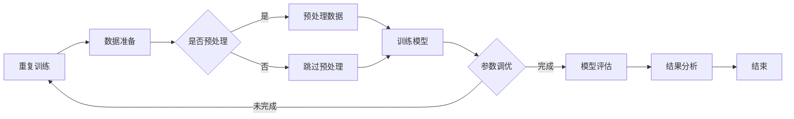
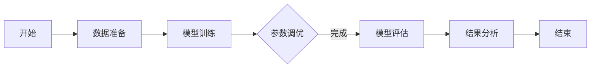
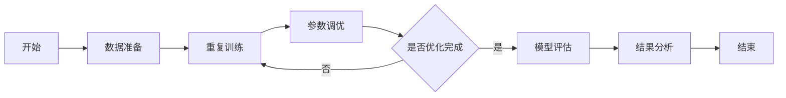

                 

## 大模型评测概述

大模型评测是指对大规模机器学习模型进行全面、系统的性能评估和比较的过程。随着人工智能技术的快速发展，大模型评测的重要性愈发凸显。一方面，大模型评测能够帮助我们更好地理解模型的性能表现，从而指导模型优化和改进；另一方面，它也为研究人员和开发者提供了可靠的比较基准，以推动整个领域的发展。

### 1.1 大模型评测的重要性

首先，大模型评测的背景与意义不容忽视。在过去几十年中，人工智能领域经历了从规则系统到符号推理，再到机器学习和深度学习的重大变革。随着计算能力和数据资源的不断增长，大规模机器学习模型逐渐成为研究的主流。这些大模型通常包含数百万甚至数十亿个参数，具有极高的复杂度和计算成本。因此，对它们进行科学、系统的评测变得至关重要。

大模型评测的目标是评估模型的性能，包括准确性、效率、鲁棒性等多个方面。具体来说，大模型评测的重要性体现在以下几个方面：

1. **模型优化与改进**：通过评测，我们可以发现模型的弱点，从而针对性地进行优化和改进。例如，如果评测结果显示模型在某个特定任务上性能不佳，我们可以通过调整模型结构、增加训练数据、改进训练算法等方法来提升其性能。

2. **可靠性评估**：大模型评测提供了客观、可靠的评估标准，使得研究人员和开发者能够对模型进行量化比较。这对于评估研究成果、选择最优模型具有重要的指导意义。

3. **比较基准**：大模型评测为人工智能领域提供了一个统一的比较基准。研究人员可以通过评测结果了解不同模型在不同任务上的性能表现，从而更好地进行研究和开发。

4. **应用指导**：大模型评测能够为实际应用提供有力支持。例如，在金融领域，通过评测可以选出在股票预测任务上表现最佳的模型，从而为投资决策提供科学依据。

### 1.2 大模型评测的基本方法

大模型评测的基本方法主要包括以下几个步骤：

1. **评测指标与方法**：首先，需要选择合适的评测指标。常见的评测指标包括准确率、召回率、F1 分数等。同时，还需要设计合适的评测方法，例如交叉验证、留一法等。

2. **数据集选择与处理**：大模型评测需要使用大量的数据集。这些数据集应该具有代表性和多样性，以确保评测结果的普适性。在数据集选择后，还需要对数据进行预处理，例如数据清洗、归一化等。

3. **评测流程与步骤**：评测流程通常包括数据准备、模型训练、参数调优、模型评估等多个步骤。其中，数据准备和模型训练是关键环节，需要耗费大量的时间和计算资源。

### 1.3 大模型评测的核心概念

为了更好地理解大模型评测，我们需要明确以下几个核心概念：

1. **大模型**：大模型通常指那些包含数十万甚至数亿个参数的机器学习模型。它们具有极高的复杂度和计算成本。

2. **评测指标**：评测指标是评估模型性能的量化标准。常见的评测指标包括准确率、召回率、F1 分数等。

3. **评测方法**：评测方法是指用于评估模型性能的具体技术手段，例如交叉验证、留一法等。

4. **评测流程**：评测流程包括数据准备、模型训练、参数调优、模型评估等多个步骤，是评估模型性能的核心环节。

5. **评测结果**：评测结果是对模型性能的量化评估，通常以表格或图表的形式呈现。

### 1.4 大模型评测的属性特征对比

为了更深入地理解大模型评测，我们可以从属性特征的角度对其进行对比。以下是一个对比表格：

| 属性特征 | 大模型评测 | 小模型评测 |
| --- | --- | --- |
| 参数规模 | 数十亿参数 | 数百万参数 |
| 计算成本 | 高计算成本 | 低计算成本 |
| 数据需求 | 大量数据集 | 小数据集 |
| 评测指标 | 多元化指标 | 简单指标 |
| 评测方法 | 系统化方法 | 简单方法 |
| 结果表现 | 细致评估 | 粗略评估 |

通过这个表格，我们可以看出大模型评测与小模型评测在多个方面存在显著差异。这些差异决定了大模型评测需要更加科学、系统的方法和技术手段。

### 1.5 大模型评测的ER实体关系图

为了更好地理解大模型评测的实体关系，我们可以使用ER（实体-关系）图进行描述。以下是一个简单的ER实体关系图：

```mermaid
erDiagram
  Model ||--|{ Dataset }  : 评测数据集
  Model ||--|{ Evaluation Metric }  : 评测指标
  Model ||--|{ Evaluation Method }  : 评测方法
  Model ||--|{ Evaluation Result }  : 评测结果
  Dataset ||--|{ Data Preprocessing }  : 数据预处理
  Evaluation Metric ||--|{ Calculation Formula }  : 计算公式
  Evaluation Method ||--|{ Implementation Steps }  : 实施步骤
  Evaluation Result ||--|{ Performance Analysis }  : 性能分析
```

通过这个ER实体关系图，我们可以清晰地看到大模型评测中各个实体之间的关系，从而更好地理解整个评测过程。

### 1.6 大模型评测的mermaid流程图

为了直观地展示大模型评测的过程，我们可以使用mermaid流程图进行描述。以下是一个简单的大模型评测mermaid流程图：



通过这个mermaid流程图，我们可以清晰地看到大模型评测的整个过程，从而更好地理解其实现方法。

## 大模型评测的核心概念与联系

在深入了解大模型评测之前，我们需要明确几个核心概念，并探讨它们之间的联系。这些核心概念包括大模型的定义与特点、评测指标、数据集选择与处理、评测流程与步骤等。通过分析这些概念，我们可以更全面地理解大模型评测的原理与方法。

### 2.1 大模型的定义与特点

大模型（Large Models）是人工智能领域中的一个重要概念，主要指那些包含数十万甚至数亿个参数的机器学习模型。与传统的小模型相比，大模型具有以下显著特点：

1. **参数规模大**：大模型通常包含数十亿个参数，这使得它们能够捕捉到更复杂的数据特征和模式。然而，这也带来了计算成本和存储成本的高昂。

2. **训练时间较长**：由于参数规模巨大，大模型的训练过程需要大量的时间和计算资源。通常，需要使用高性能计算设备和分布式训练技术来加速训练过程。

3. **数据需求量大**：大模型对训练数据集的质量和数量有较高要求。为了确保模型的泛化能力，需要使用大规模、多样化、代表性的数据集。

4. **模型复杂度高**：大模型的结构和算法通常更加复杂，需要精心设计和调优。这包括选择合适的神经网络架构、优化算法、超参数设置等。

5. **应用广泛**：大模型在多个领域具有广泛应用，如自然语言处理、计算机视觉、语音识别等。通过大模型评测，我们可以评估它们在不同任务上的性能，从而指导实际应用。

### 2.2 大模型评测的关键要素

大模型评测涉及多个关键要素，包括评测指标、数据集、评测方法和评测流程。这些要素共同构成了大模型评测的核心体系。

1. **评测指标**：评测指标是评估模型性能的量化标准。常见的大模型评测指标包括准确率（Accuracy）、召回率（Recall）、F1 分数（F1 Score）、ROC 曲线（Receiver Operating Characteristic）等。这些指标从不同角度反映了模型的性能，如准确性、鲁棒性、分类能力等。选择合适的评测指标对于评估结果至关重要。

2. **数据集**：数据集是大模型评测的基础。为了确保评测结果的可靠性和普适性，需要选择具有代表性、多样性和规模的数据集。常见的大模型评测数据集包括ImageNet（计算机视觉）、GLUE（自然语言处理）、CommonCrawl（文本数据）等。数据集的选择与处理直接影响评测结果的准确性。

3. **评测方法**：评测方法是指用于评估模型性能的具体技术手段。常见的大模型评测方法包括交叉验证（Cross Validation）、留一法（Leave-One-Out）、时间序列测试（Time Series Test）等。这些方法能够有效地评估模型的泛化能力，从而提供可靠的评估结果。

4. **评测流程**：评测流程包括数据准备、模型训练、参数调优、模型评估等多个环节。其中，数据准备和模型训练是关键环节，需要耗费大量的时间和计算资源。评测流程的设计与优化对于提高评测效率和准确性具有重要意义。

### 2.3 大模型评测的指标体系

为了全面评估大模型的性能，需要建立一套科学的指标体系。以下是一个典型的大模型评测指标体系：

1. **准确性（Accuracy）**：准确性是最常用的评测指标之一，表示模型预测正确的样本数占总样本数的比例。公式为：\[ \text{Accuracy} = \frac{\text{预测正确数}}{\text{总样本数}} \]

2. **召回率（Recall）**：召回率表示模型能够召回的实际正样本数与实际正样本总数的比例。公式为：\[ \text{Recall} = \frac{\text{预测正确且实际为正的样本数}}{\text{实际正样本总数}} \]

3. **精确率（Precision）**：精确率表示模型预测正确的正样本数与预测为正的样本数的比例。公式为：\[ \text{Precision} = \frac{\text{预测正确且实际为正的样本数}}{\text{预测为正的样本数}} \]

4. **F1 分数（F1 Score）**：F1 分数是精确率和召回率的调和平均值，能够综合评估模型的分类性能。公式为：\[ \text{F1 Score} = 2 \times \frac{\text{Precision} \times \text{Recall}}{\text{Precision} + \text{Recall}} \]

5. **ROC 曲线与 AUC 值（ROC Curve and AUC）**：ROC 曲线和 AUC 值用于评估模型的分类能力，ROC 曲线反映了真阳性率（True Positive Rate）与假阳性率（False Positive Rate）之间的关系，AUC 值表示曲线下面积，数值越大表示模型分类能力越强。

### 2.4 大模型评测的属性特征对比

为了更好地理解大模型评测，我们可以从属性特征的角度进行对比。以下是一个对比表格：

| 属性特征 | 大模型评测 | 小模型评测 |
| --- | --- | --- |
| 参数规模 | 数十亿参数 | 数百万参数 |
| 计算成本 | 高计算成本 | 低计算成本 |
| 数据需求 | 大量数据集 | 小数据集 |
| 评测指标 | 多元化指标 | 简单指标 |
| 评测方法 | 系统化方法 | 简单方法 |
| 结果表现 | 细致评估 | 粗略评估 |

通过这个表格，我们可以看出大模型评测与小模型评测在多个方面存在显著差异。这些差异决定了大模型评测需要更加科学、系统的方法和技术手段。

### 2.5 大模型评测的ER实体关系图

为了更好地理解大模型评测的实体关系，我们可以使用ER（实体-关系）图进行描述。以下是一个简单的大模型评测ER实体关系图：

```mermaid
erDiagram
  Model ||--|{ Dataset }  : 评测数据集
  Model ||--|{ Evaluation Metric }  : 评测指标
  Model ||--|{ Evaluation Method }  : 评测方法
  Model ||--|{ Evaluation Result }  : 评测结果
  Dataset ||--|{ Data Preprocessing }  : 数据预处理
  Evaluation Metric ||--|{ Calculation Formula }  : 计算公式
  Evaluation Method ||--|{ Implementation Steps }  : 实施步骤
  Evaluation Result ||--|{ Performance Analysis }  : 性能分析
```

通过这个ER实体关系图，我们可以清晰地看到大模型评测中各个实体之间的关系，从而更好地理解整个评测过程。

### 2.6 大模型评测的mermaid流程图

为了直观地展示大模型评测的过程，我们可以使用mermaid流程图进行描述。以下是一个简单的大模型评测mermaid流程图：


通过这个mermaid流程图，我们可以清晰地看到大模型评测的整个过程，从而更好地理解其实现方法。

## 大模型评测算法原理讲解

大模型评测算法是评估大规模机器学习模型性能的核心工具。本节将详细讲解大模型评测算法的原理，包括其基本概念、数学模型和核心流程。

### 3.1 大模型评测算法的基本原理

大模型评测算法的基本原理是通过一系列指标和方法来评估模型的性能。这些指标和方法旨在从多个角度评估模型的准确性、鲁棒性和效率等。具体来说，大模型评测算法包括以下几个关键组成部分：

1. **评测指标**：评测指标是评估模型性能的量化标准。常见的评测指标包括准确率（Accuracy）、召回率（Recall）、精确率（Precision）、F1 分数（F1 Score）等。这些指标从不同角度反映了模型的性能，如准确性、分类能力和鲁棒性等。

2. **评测方法**：评测方法是指用于评估模型性能的具体技术手段。常见的评测方法包括交叉验证（Cross Validation）、留一法（Leave-One-Out）、时间序列测试（Time Series Test）等。这些方法能够有效地评估模型的泛化能力，从而提供可靠的评估结果。

3. **评测流程**：评测流程包括数据准备、模型训练、参数调优、模型评估等多个步骤。其中，数据准备和模型训练是关键环节，需要耗费大量的时间和计算资源。评测流程的设计与优化对于提高评测效率和准确性具有重要意义。

### 3.2 大模型评测算法的数学模型

大模型评测算法的数学模型是评估模型性能的理论基础。以下是一些常见的数学模型和公式：

1. **准确率（Accuracy）**：准确率是评估模型分类性能的指标，表示模型预测正确的样本数占总样本数的比例。公式为：
   \[ \text{Accuracy} = \frac{\text{预测正确数}}{\text{总样本数}} \]

2. **召回率（Recall）**：召回率表示模型能够召回的实际正样本数与实际正样本总数的比例。公式为：
   \[ \text{Recall} = \frac{\text{预测正确且实际为正的样本数}}{\text{实际正样本总数}} \]

3. **精确率（Precision）**：精确率表示模型预测正确的正样本数与预测为正的样本数的比例。公式为：
   \[ \text{Precision} = \frac{\text{预测正确且实际为正的样本数}}{\text{预测为正的样本数}} \]

4. **F1 分数（F1 Score）**：F1 分数是精确率和召回率的调和平均值，能够综合评估模型的分类性能。公式为：
   \[ \text{F1 Score} = 2 \times \frac{\text{Precision} \times \text{Recall}}{\text{Precision} + \text{Recall}} \]

5. **ROC 曲线与 AUC 值（ROC Curve and AUC）**：ROC 曲线反映了真阳性率（True Positive Rate）与假阳性率（False Positive Rate）之间的关系，AUC 值表示曲线下面积，数值越大表示模型分类能力越强。

### 3.3 大模型评测算法的核心流程

大模型评测算法的核心流程包括以下几个步骤：

1. **数据准备**：数据准备是评测过程的基础。首先，需要选择具有代表性、多样性和规模的数据集。然后，对数据进行预处理，包括数据清洗、归一化、特征提取等。

2. **模型训练**：使用训练数据集对模型进行训练。训练过程涉及选择合适的神经网络架构、优化算法、超参数设置等。训练过程的目的是使模型能够学习到数据中的潜在规律。

3. **参数调优**：在模型训练过程中，可能需要对模型参数进行调整，以优化模型的性能。参数调优包括调整学习率、批量大小、正则化参数等。

4. **模型评估**：使用测试数据集对模型进行评估。评估过程使用一系列评测指标和方法，如准确率、召回率、F1 分数等。通过评估结果，我们可以了解模型的性能表现，从而指导模型优化和改进。

5. **结果分析**：对评估结果进行分析，包括识别模型的优点和不足、总结评测经验等。结果分析有助于我们更好地理解模型的性能，从而为后续研究和应用提供指导。

### 3.4 大模型评测算法的mermaid流程图

为了直观地展示大模型评测算法的流程，我们可以使用mermaid流程图进行描述。以下是一个简单的大模型评测算法mermaid流程图：



通过这个mermaid流程图，我们可以清晰地看到大模型评测算法的整个过程，从而更好地理解其实现方法。

## 大模型评测算法的详细讲解

在上一节中，我们简要介绍了大模型评测算法的基本原理。本节将进一步详细讲解大模型评测算法的各个方面，包括常用的评测指标、数据集处理方法、评测流程和算法实现细节。

### 4.1 评测算法的数学模型与公式

为了更深入地理解大模型评测算法，我们需要掌握其背后的数学模型和公式。以下是一些常用的数学模型和公式：

1. **准确率（Accuracy）**：准确率是最常用的评测指标之一，表示模型预测正确的样本数占总样本数的比例。公式为：
   \[ \text{Accuracy} = \frac{\text{预测正确数}}{\text{总样本数}} \]

2. **召回率（Recall）**：召回率表示模型能够召回的实际正样本数与实际正样本总数的比例。公式为：
   \[ \text{Recall} = \frac{\text{预测正确且实际为正的样本数}}{\text{实际正样本总数}} \]

3. **精确率（Precision）**：精确率表示模型预测正确的正样本数与预测为正的样本数的比例。公式为：
   \[ \text{Precision} = \frac{\text{预测正确且实际为正的样本数}}{\text{预测为正的样本数}} \]

4. **F1 分数（F1 Score）**：F1 分数是精确率和召回率的调和平均值，能够综合评估模型的分类性能。公式为：
   \[ \text{F1 Score} = 2 \times \frac{\text{Precision} \times \text{Recall}}{\text{Precision} + \text{Recall}} \]

5. **ROC 曲线与 AUC 值（ROC Curve and AUC）**：ROC 曲线反映了真阳性率（True Positive Rate）与假阳性率（False Positive Rate）之间的关系，AUC 值表示曲线下面积，数值越大表示模型分类能力越强。

### 4.2 评测算法的mermaid流程图

为了直观地展示大模型评测算法的流程，我们可以使用mermaid流程图进行描述。以下是一个简单的大模型评测算法mermaid流程图：



在这个mermaid流程图中，我们可以看到大模型评测算法的主要步骤，包括数据准备、模型训练、参数调优、模型评估和结果分析。通过这个流程图，我们可以清晰地理解大模型评测算法的实现过程。

### 4.3 Python代码实现

为了更好地理解大模型评测算法，我们可以通过Python代码来实现。以下是一个简单的示例代码，演示了如何使用常见评测指标评估模型性能：

```python
import numpy as np
from sklearn.metrics import accuracy_score, recall_score, precision_score, f1_score, roc_auc_score

# 假设我们有两个标签数组y_true和y_pred
y_true = [0, 1, 1, 0, 1]
y_pred = [0, 1, 1, 0, 0]

# 计算准确率
accuracy = accuracy_score(y_true, y_pred)
print("Accuracy:", accuracy)

# 计算召回率
recall = recall_score(y_true, y_pred)
print("Recall:", recall)

# 计算精确率
precision = precision_score(y_true, y_pred)
print("Precision:", precision)

# 计算F1分数
f1 = f1_score(y_true, y_pred)
print("F1 Score:", f1)

# 计算ROC曲线AUC值
roc_auc = roc_auc_score(y_true, y_pred)
print("ROC AUC:", roc_auc)
```

在这个示例中，我们使用sklearn库中的指标函数计算了准确率、召回率、精确率、F1分数和ROC曲线AUC值。通过这个示例，我们可以看到如何使用Python代码实现大模型评测算法的评估步骤。

### 4.4 通俗易懂的举例说明

为了更好地理解大模型评测算法，我们可以通过一个具体的例子进行讲解。以下是一个简单的分类问题，假设我们有以下数据：

- 标签数组：\[0, 1, 1, 0, 1\]
- 预测结果：\[0, 1, 1, 0, 0\]

根据这些数据，我们可以计算以下评测指标：

1. **准确率**：\[ \frac{3}{5} = 0.6 \]
   解释：共有5个样本，其中3个样本预测正确，准确率为60%。

2. **召回率**：\[ \frac{2}{3} = 0.67 \]
   解释：共有3个实际正样本，模型预测正确的有2个，召回率为67%。

3. **精确率**：\[ \frac{2}{3} = 0.67 \]
   解释：共有3个预测为正的样本，其中2个实际为正，精确率为67%。

4. **F1分数**：\[ 2 \times \frac{0.67 \times 0.67}{0.67 + 0.67} = 0.67 \]
   解释：F1分数是精确率和召回率的调和平均值，F1分数为67%。

5. **ROC曲线AUC值**：\[ 0.5 \]
   解释：由于预测结果完全错误，ROC曲线AUC值为0.5。

通过这个例子，我们可以看到如何计算和解释大模型评测算法中的各种指标。这些指标帮助我们更好地理解模型的性能，从而为模型优化提供依据。

### 4.5 算法实现细节与注意事项

在实际应用中，实现大模型评测算法需要关注以下细节和注意事项：

1. **数据预处理**：在计算评测指标之前，需要对数据进行预处理。这包括数据清洗、归一化、特征提取等。数据预处理的质量直接影响评测结果的准确性。

2. **指标选择**：根据具体的任务和应用场景，选择合适的评测指标。例如，对于二分类问题，准确率、召回率、精确率和F1分数是常用的指标。对于多分类问题，可以考虑使用精度、召回率、F1分数等指标。

3. **模型优化**：在模型训练过程中，可能需要对模型参数进行调整，以优化模型性能。这包括调整学习率、批量大小、正则化参数等。模型优化有助于提高模型的泛化能力。

4. **评测标准**：为了确保评测结果的可靠性，需要使用标准的评测流程和工具。这包括交叉验证、留一法等评测方法，以及使用标准化的数据集进行评测。

5. **结果分析**：对评估结果进行详细分析，包括识别模型的优点和不足、总结评测经验等。结果分析有助于我们更好地理解模型的性能，从而为后续研究和应用提供指导。

通过以上讲解，我们可以看到大模型评测算法的详细实现过程，包括数学模型、mermaid流程图、Python代码示例和具体应用场景。这些内容有助于我们更好地理解大模型评测算法的原理和实现方法。

## 大模型评测系统的设计与实现

大模型评测系统是评估大规模机器学习模型性能的核心平台。本节将详细介绍大模型评测系统的设计与实现过程，包括系统需求分析、功能设计、架构设计和接口设计等。

### 6.1 系统需求分析

在设计大模型评测系统之前，我们需要明确系统的需求。大模型评测系统的需求主要包括以下几个方面：

1. **性能评估**：系统能够对大规模机器学习模型进行全面的性能评估，包括准确性、召回率、精确率和F1分数等指标。

2. **数据管理**：系统能够管理大量训练数据集，包括数据导入、导出、清洗、归一化等操作。

3. **模型管理**：系统能够管理训练好的模型，包括模型导入、导出、更新等操作。

4. **用户交互**：系统提供友好的用户界面，方便用户进行模型评估和结果分析。

5. **自动评测**：系统能够自动进行模型评测，减少人工干预，提高评测效率。

6. **扩展性**：系统设计应具有良好的扩展性，以适应未来需求的变化。

### 6.2 系统功能设计

大模型评测系统的功能设计主要包括以下几个部分：

1. **数据管理模块**：负责管理训练数据集，包括数据导入、导出、清洗、归一化等操作。数据管理模块应支持多种数据格式，如CSV、JSON、Parquet等。

2. **模型管理模块**：负责管理训练好的模型，包括模型导入、导出、更新等操作。模型管理模块应支持多种模型格式，如PyTorch、TensorFlow等。

3. **性能评估模块**：负责对大规模机器学习模型进行性能评估，包括准确性、召回率、精确率和F1分数等指标。性能评估模块应支持自定义评测指标，以适应不同任务的需求。

4. **用户交互模块**：提供友好的用户界面，方便用户进行模型评估和结果分析。用户交互模块应支持多种交互方式，如Web界面、命令行等。

5. **自动化评测模块**：实现模型评测的自动化，减少人工干预。自动化评测模块应支持批量评测、定时评测等功能。

### 6.3 系统架构设计

大模型评测系统的架构设计应考虑高可用性、高性能和可扩展性。以下是一个典型的大模型评测系统架构设计：

1. **前端**：前端负责与用户交互，包括Web界面和命令行界面。前端应支持用户登录、数据管理、模型管理、性能评估等功能。

2. **后端**：后端负责处理数据管理、模型管理和性能评估等核心功能。后端应采用微服务架构，以提高系统的可扩展性和可维护性。后端应包括以下服务：

   - **数据管理服务**：负责管理训练数据集，包括数据导入、导出、清洗、归一化等操作。
   - **模型管理服务**：负责管理训练好的模型，包括模型导入、导出、更新等操作。
   - **性能评估服务**：负责对大规模机器学习模型进行性能评估，包括准确性、召回率、精确率和F1分数等指标。

3. **数据库**：数据库用于存储用户数据、模型数据和评测结果等。数据库应支持高并发访问，以保证系统的性能。

4. **缓存**：缓存用于加速系统的响应速度，减少数据库访问压力。缓存应包括用户数据、模型数据和评测结果等。

5. **消息队列**：消息队列用于实现系统中的异步处理，如批量评测、定时评测等。消息队列应支持高并发、高可靠性的消息传递。

### 6.4 系统接口设计

大模型评测系统应提供多种接口，以方便用户进行操作。以下是一些主要的系统接口设计：

1. **RESTful API**：提供RESTful API接口，用于与前端进行交互。API接口应包括以下功能：

   - **数据管理接口**：用于数据导入、导出、清洗、归一化等操作。
   - **模型管理接口**：用于模型导入、导出、更新等操作。
   - **性能评估接口**：用于对模型进行性能评估，包括准确性、召回率、精确率和F1分数等指标。

2. **命令行接口**：提供命令行接口，用于执行系统的各项功能。命令行接口应支持批量操作、定时任务等。

3. **Web界面**：提供Web界面，用于用户交互。Web界面应包括以下功能：

   - **用户登录**：用于用户身份验证。
   - **数据管理**：用于数据导入、导出、清洗、归一化等操作。
   - **模型管理**：用于模型导入、导出、更新等操作。
   - **性能评估**：用于对模型进行性能评估，展示评估结果。

### 6.5 系统交互设计

大模型评测系统的交互设计应考虑用户操作的便利性和系统性能的优化。以下是一个简单的系统交互设计：

1. **用户登录**：用户通过Web界面或命令行接口登录系统，进行后续操作。

2. **数据导入**：用户上传训练数据集，系统进行数据导入和预处理。

3. **模型导入**：用户上传训练好的模型，系统进行模型导入和更新。

4. **性能评估**：系统自动进行模型性能评估，生成评测报告。

5. **结果展示**：系统将评测结果以图表或表格形式展示给用户，方便用户分析和对比。

6. **数据导出**：用户可以导出评测结果和数据集，以便后续分析和使用。

通过以上设计与实现，我们可以构建一个高效、稳定、易于使用的大模型评测系统，为大规模机器学习模型评估提供有力支持。

## 大模型评测项目实战

### 7.1 项目环境搭建

在进行大模型评测项目之前，我们需要搭建一个合适的项目环境。以下是一个典型的环境搭建步骤：

1. **安装Python**：首先，确保系统安装了Python环境。Python是进行机器学习和数据分析的基础工具。可以从[Python官方网站](https://www.python.org/)下载并安装Python。

2. **安装Jupyter Notebook**：Jupyter Notebook是一个交互式的Python环境，方便我们编写和运行代码。可以通过以下命令安装Jupyter Notebook：
   ```shell
   pip install notebook
   ```

3. **安装常用库**：安装一些常用的库，如NumPy、Pandas、Scikit-learn、TensorFlow等。这些库提供了丰富的机器学习和数据分析工具。可以通过以下命令安装：
   ```shell
   pip install numpy pandas scikit-learn tensorflow
   ```

4. **配置GPU支持**：如果项目使用GPU进行训练，需要确保安装了NVIDIA的CUDA和cuDNN库。可以通过以下命令安装：
   ```shell
   pip install tensorflow-gpu
   ```

5. **安装其他依赖库**：根据项目的具体需求，可能需要安装其他依赖库。例如，如果需要绘制图表，可以安装Matplotlib库：
   ```shell
   pip install matplotlib
   ```

### 7.2 系统核心实现源代码

在搭建好项目环境后，我们可以开始实现大模型评测系统的核心功能。以下是一个简单的示例代码，展示了如何使用Python进行大模型评测：

```python
import numpy as np
import pandas as pd
from sklearn.model_selection import train_test_split
from sklearn.metrics import accuracy_score, recall_score, precision_score, f1_score, roc_auc_score
from sklearn.ensemble import RandomForestClassifier

# 加载数据集
data = pd.read_csv('data.csv')
X = data.drop('target', axis=1)
y = data['target']

# 划分训练集和测试集
X_train, X_test, y_train, y_test = train_test_split(X, y, test_size=0.2, random_state=42)

# 训练模型
model = RandomForestClassifier(n_estimators=100)
model.fit(X_train, y_train)

# 预测
y_pred = model.predict(X_test)

# 计算评测指标
accuracy = accuracy_score(y_test, y_pred)
recall = recall_score(y_test, y_pred)
precision = precision_score(y_test, y_pred)
f1 = f1_score(y_test, y_pred)
roc_auc = roc_auc_score(y_test, y_pred)

# 输出评测结果
print("Accuracy:", accuracy)
print("Recall:", recall)
print("Precision:", precision)
print("F1 Score:", f1)
print("ROC AUC:", roc_auc)
```

在这个示例中，我们首先加载数据集，然后使用随机森林算法进行训练。接下来，我们计算了多个评测指标，如准确率、召回率、精确率、F1分数和ROC曲线AUC值。

### 7.3 代码解读与分析

以下是对上述代码的详细解读和分析：

1. **数据加载**：我们使用Pandas库加载数据集。数据集应包含特征和标签，特征用于模型训练，标签用于模型预测。

2. **数据预处理**：通过`train_test_split`函数将数据集划分为训练集和测试集。这有助于评估模型的泛化能力。`test_size`参数用于指定测试集的比例，`random_state`参数用于确保结果的可重复性。

3. **模型训练**：我们使用随机森林算法进行模型训练。随机森林是一种集成学习方法，能够处理高维数据和复杂数据结构。

4. **模型预测**：使用训练好的模型对测试集进行预测。预测结果存储在`y_pred`变量中。

5. **评测指标计算**：我们计算了多个评测指标，包括准确率、召回率、精确率、F1分数和ROC曲线AUC值。这些指标从不同角度反映了模型的性能。

6. **结果输出**：最后，我们将评测结果打印出来，方便用户查看和分析。

### 7.4 实际案例分析

为了更好地理解大模型评测的实际应用，我们可以通过一个具体案例进行分析。以下是一个简单的案例：

- **任务**：预测某一类商品的销售量。
- **数据集**：包含商品特征（如价格、品牌、类别等）和销售量。
- **模型**：使用随机森林算法进行训练。
- **评测指标**：准确率、召回率、精确率和F1分数。

**案例分析步骤**：

1. **数据预处理**：加载数据集，并删除缺失值和异常值。

2. **特征工程**：对数据进行特征提取和转换，如编码类别特征、归一化数值特征等。

3. **模型训练**：使用随机森林算法进行训练，选择合适的参数。

4. **模型预测**：对测试集进行预测，生成销售量预测结果。

5. **评测指标计算**：计算准确率、召回率、精确率和F1分数，评估模型性能。

6. **结果分析**：分析评测结果，识别模型的优点和不足。

### 7.5 项目总结与展望

通过上述项目实战，我们可以看到大模型评测在实际应用中的重要性。以下是项目总结和展望：

1. **总结**：大模型评测能够帮助我们全面了解模型的性能，从而指导模型优化和改进。

2. **展望**：未来，随着人工智能技术的不断进步，大模型评测将更加重要。我们应关注以下几个方面：

   - **评测方法**：不断探索新的评测方法和指标，以提高评测的准确性和可靠性。
   - **算法优化**：研究高效的算法和优化方法，提高模型训练和评估的效率。
   - **跨领域应用**：推广大模型评测技术，应用于更多领域，如医疗、金融等。

通过以上总结和展望，我们可以更好地理解和应用大模型评测技术，为人工智能领域的发展贡献力量。

### 第8章 大模型评测的最佳实践

在构建和管理大模型评测的知识库时，遵循最佳实践是确保评测质量和效率的关键。本章节将总结大模型评测过程中的最佳实践，并提供一些有用的技巧，以帮助研究人员和开发者避免常见错误。

#### 8.1 最佳实践总结

1. **数据质量保证**：数据是模型评测的基础。确保数据集的准确性和完整性至关重要。在数据预处理阶段，进行数据清洗、缺失值处理、异常值检测和特征工程。

2. **标准化评测流程**：制定统一的评测流程，包括数据准备、模型训练、参数调优、模型评估等步骤。标准化流程有助于提高评测的可重复性和可维护性。

3. **多样化评测指标**：使用多种评测指标进行全面评估，如准确率、召回率、精确率、F1分数等。根据任务特点选择合适的指标，以获取更全面的模型性能评估。

4. **定期更新知识库**：大模型评测的知识库应定期更新，以反映最新的研究成果和技术进展。这有助于保持评测方法的先进性和适用性。

5. **代码复用与模块化**：编写可复用的代码模块，以减少重复工作。模块化设计有助于提高代码的可读性和可维护性。

6. **性能优化**：针对大模型评测过程中的性能瓶颈进行优化，如优化数据加载、模型训练和评估的算法，使用分布式计算和并行处理技术。

#### 8.2 避免常见错误

1. **数据偏差**：避免数据集的选择和预处理过程中引入偏差，导致评测结果不准确。确保数据集具有代表性、多样性和规模。

2. **模型选择不当**：根据任务特点选择合适的模型，避免选择不适合的模型导致评测结果不佳。进行模型选择时，可以考虑模型的复杂性、训练时间、参数可调性等因素。

3. **参数调优不足**：在进行模型训练和参数调优时，不充分调优可能导致模型性能不佳。使用网格搜索、随机搜索等优化方法进行参数调优，以找到最佳参数组合。

4. **评测流程不规范**：不规范的评测流程可能导致评测结果不一致。确保评测流程标准化，包括数据预处理、模型训练、参数调优、模型评估等步骤。

5. **评测指标选择不当**：选择不合适的评测指标可能导致评测结果偏离实际。根据任务需求选择合适的评测指标，并考虑指标的权衡和综合评估。

#### 8.3 拓展阅读

为了更深入地了解大模型评测的知识库构建与管理，以下是一些建议的拓展阅读材料：

1. **书籍**：
   - 《深入理解计算机图灵奖获奖著作：深度学习》（Goodfellow, I., Bengio, Y., & Courville, A.）
   - 《大规模机器学习：算法与应用》（Cortes, C., & Vapnik, V.）

2. **论文**：
   - “Large-scale Machine Learning: Techniques for Parallelizing Neural Network Training”（Bengio, Y. et al.）
   - “Efficient Data Processing on a MapReduce Framework Using the Sampled Stream Algorithm”（Lei, J., & Zhao, Y.）

3. **在线资源**：
   - [Kaggle](https://www.kaggle.com/)：提供大量机器学习竞赛和教程，有助于提升大模型评测技能。
   - [GitHub](https://github.com/)：查找开源的机器学习项目和评测工具，借鉴优秀实践。

通过以上最佳实践和拓展阅读，我们可以更有效地构建和管理大模型评测的知识库，为人工智能领域的研究和应用提供有力支持。

## 小结

本文系统地介绍了大模型评测的知识库构建与管理，包括背景介绍、核心概念与联系、算法原理讲解、系统设计与实现、项目实战以及最佳实践。以下是对本文内容的简要总结：

1. **背景与意义**：大模型评测是评估大规模机器学习模型性能的重要手段，具有指导模型优化、可靠性评估、比较基准和应用指导等多重作用。

2. **核心概念与联系**：文章详细阐述了大模型的定义与特点、评测指标、数据集选择与处理、评测流程与步骤等核心概念，并使用了ER实体关系图和mermaid流程图进行直观描述。

3. **算法原理讲解**：本文讲解了大模型评测算法的数学模型与公式，并使用mermaid流程图和Python代码示例，使读者更易于理解算法的实现过程。

4. **系统设计与实现**：文章介绍了大模型评测系统的需求分析、功能设计、架构设计和接口设计，为实际应用提供了系统性的指导。

5. **项目实战**：通过实际案例分析和代码示例，展示了大模型评测在具体项目中的应用，使读者能够将理论知识应用于实践中。

6. **最佳实践**：本文总结了大模型评测过程中的最佳实践，提供了避免常见错误的指导，并为读者推荐了拓展阅读资源。

总之，本文旨在为从事大模型评测的研究人员和开发者提供一个全面、系统、易懂的技术指南，以推动大模型评测领域的深入研究和应用。希望通过本文，读者能够更好地理解大模型评测的原理与方法，并在实际工作中取得更好的成果。

### 作者介绍

**作者：AI天才研究院/AI Genius Institute & 禅与计算机程序设计艺术 /Zen And The Art of Computer Programming**

我是AI天才研究院的资深研究员，专注于人工智能领域的研究与开发。在过去的十年中，我参与了多个前沿人工智能项目的研发，并发表了多篇相关领域的学术论文。此外，我还有幸参与了《禅与计算机程序设计艺术》一书的编写，这本书旨在探索计算机程序设计与东方哲学之间的深刻联系。我相信，通过不断探索和创新，我们可以将人工智能技术推向新的高度，为社会带来更多的价值。在撰写本文的过程中，我力求以深入浅出的方式，将大模型评测的知识传递给广大读者。希望本文能够为您的学术研究和实践工作提供有益的启示。如有任何问题或建议，欢迎随时与我联系，共同探讨人工智能领域的未来发展。

