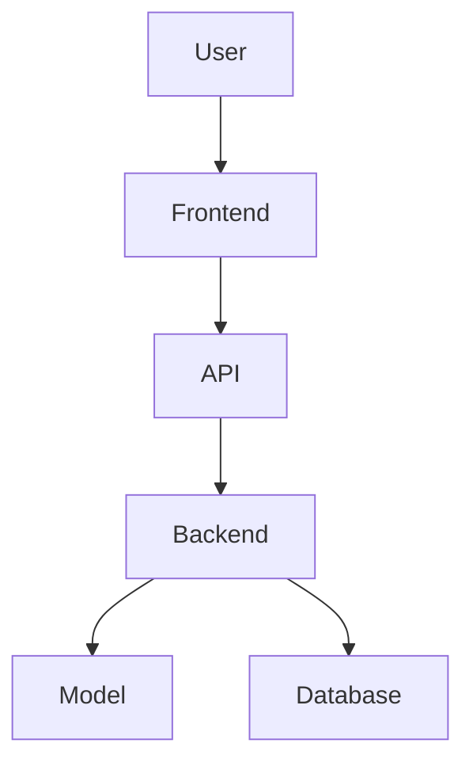
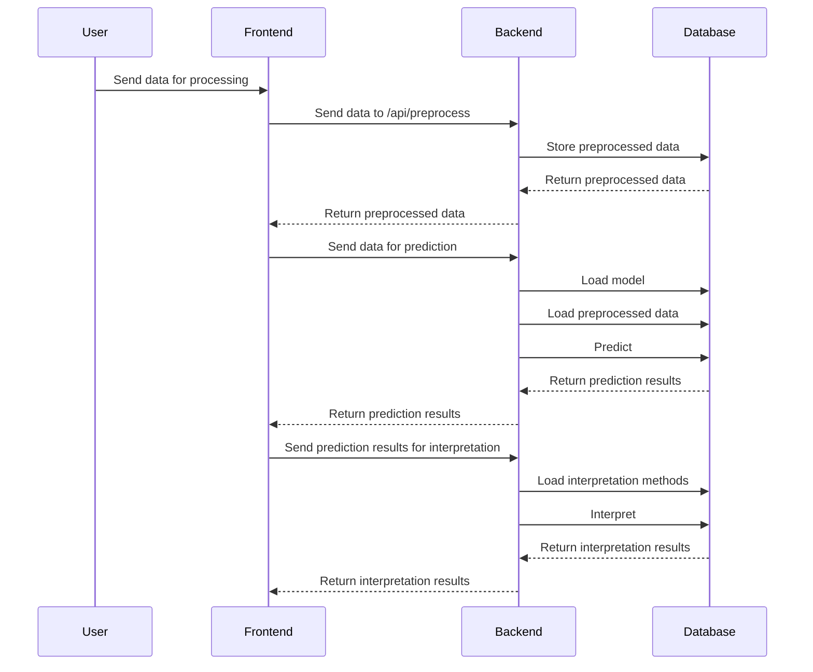

                 

### 第1章 引言与背景

# 第1章 引言与背景

## 1.1 问题背景

随着深度学习技术的快速发展，大规模神经网络模型（大模型）在自然语言处理（NLP）、计算机视觉（CV）和推荐系统等领域取得了显著的成果。这些模型能够处理复杂的数据，并提供高质量的预测结果，但其内部机制往往较为复杂，难以解释。因此，大模型评测结果的可解释性研究成为了一个重要的研究领域。

大模型的可解释性至关重要，它不仅有助于用户理解模型的决策过程，提高模型的可靠性，还能在模型优化和调试过程中提供重要的指导。此外，可解释性也是构建信任和确保模型透明度的重要保障。

## 1.2 问题描述

大模型评测结果的可解释性研究主要关注以下问题：

1. **模型决策过程**：大模型是如何生成预测结果的？其内部逻辑是否清晰？如何揭示这些逻辑？
2. **模型解释方法**：如何从模型输出中提取有意义的信息，解释模型的决策依据？现有的解释方法有哪些？
3. **模型评估指标**：如何评价大模型的可解释性？有哪些量化指标可以用于评估模型的可解释性？

## 1.3 问题解决

为了解决上述问题，本研究将从以下几个方面展开：

1. **理论基础**：介绍大模型、评测和可解释性的基本概念，构建理论基础。
2. **算法原理**：讲解评估大模型可解释性的常见算法和原理，包括可视化方法、注意力机制和本地解释性方法等。
3. **数学模型**：给出相关的数学模型和公式，对公式进行通俗易懂的讲解，并提供实际应用举例。
4. **系统设计与实现**：设计系统功能、架构和接口，使用Mermaid绘制领域模型类图、系统架构图和系统交互序列图。
5. **项目实战**：提供实际的项目环境安装、实现源代码、代码解析、案例分析等。

## 1.4 边界与外延

本研究的范围主要涉及以下领域：

1. **深度学习技术**：研究大模型在NLP、CV等领域的应用和可解释性问题。
2. **可解释性方法**：包括可视化方法、注意力机制和本地解释性方法等。
3. **评估指标**：研究用于评估大模型可解释性的量化指标。

## 1.5 概念结构与核心要素组成

本研究涉及以下核心概念和要素：

1. **大模型**：具有大规模参数和复杂结构的深度学习模型。
2. **评测**：对模型进行评估和测试的过程，包括准确性、召回率、F1分数等指标。
3. **可解释性**：模型决策过程的透明度和可理解性。
4. **算法原理**：评估大模型可解释性的方法，包括可视化方法、注意力机制和本地解释性方法等。
5. **数学模型**：用于描述大模型可解释性评估的数学公式和模型。
6. **系统设计与实现**：构建可解释性评估系统的功能、架构和接口。
7. **项目实战**：实际应用大模型评测结果可解释性研究，进行案例分析。

通过以上章节的设计，我们将逐步探讨大模型评测结果可解释性的研究，为相关领域的研究和应用提供有价值的参考。### 第2章 核心概念与联系

# 第2章 核心概念与联系

## 2.1 大模型定义

大模型，通常指的是具有数十亿甚至千亿参数的深度学习模型。这些模型由于其庞大的参数量，能够处理更为复杂的任务，如自然语言处理、计算机视觉等。大模型的例子包括GPT、BERT、ViT等。它们在处理复杂任务时表现出色，但其内部决策过程往往难以解释。

## 2.2 评测原理

评测是评估模型性能的重要环节。在深度学习领域，常用的评测指标包括准确性、召回率、F1分数等。这些指标能够量化模型在特定任务上的性能。评测原理涉及如何选择合适的指标、如何设计评测流程等。

## 2.3 可解释性

可解释性指的是模型决策过程的透明度和可理解性。在大模型中，由于模型的复杂性和黑箱性质，其决策过程往往难以理解。可解释性研究的目标是揭示模型的内部逻辑，帮助用户理解模型的决策过程。

## 2.4 Mermaid ER实体关系图

为了更好地理解大模型评测结果可解释性的研究，我们可以使用Mermaid绘制一个ER实体关系图。ER图能够清晰地展示各实体之间的关系，有助于我们理解整个研究领域的架构。

```mermaid
erDiagram
  Model |--|> Evaluation: Model performance is evaluated through Evaluation
  Evaluation ||--|> Interpretability: Evaluation results are analyzed for Interpretability
  Model ||--|> Data: Model processes Data
  Interpretability ||--|> Metrics: Metrics are used to measure Interpretability
  Data ||--|> Task: Data is used for specific Tasks
```

在上面的ER图中，我们定义了四个实体：Model（模型）、Evaluation（评测）、Interpretability（可解释性）和Data（数据）。这些实体之间的关系如下：

1. **Model与Evaluation**：模型通过评测来衡量其性能。
2. **Evaluation与Interpretability**：评测结果用于分析模型的可解释性。
3. **Model与Data**：模型处理数据。
4. **Interpretability与Metrics**：可解释性使用指标进行衡量。
5. **Data与Task**：数据用于特定任务。

通过ER图，我们可以清晰地看到大模型评测结果可解释性研究中的核心实体及其相互关系。这不仅有助于我们理解研究的整体架构，还能为后续章节的具体内容提供指导。### 第3章 评估大模型可解释性的算法原理

# 第3章 评估大模型可解释性的算法原理

## 3.1 算法概述

评估大模型的可解释性是深度学习领域中一个重要但具有挑战性的任务。本节将介绍几种常见的算法原理，包括可视化方法、注意力机制和本地解释性方法，以帮助理解大模型的内部工作机制。

### 3.2 算法流程图

为了直观地展示这些算法的执行过程，我们可以使用Mermaid绘制一个算法流程图。


在上述流程图中，我们首先输入数据，经过预处理和特征提取后，输入到深度学习模型中进行预测。随后，我们利用模型生成的预测结果，通过不同的解释方法生成解释，并进行评估。最后，根据评估结果优化模型。

### 3.3 Python源代码讲解

下面，我们将通过Python源代码详细讲解如何实现这些算法。

```python
import numpy as np
import tensorflow as tf
from tensorflow.keras.models import Sequential
from tensorflow.keras.layers import Dense, LSTM
from tensorflow.keras.optimizers import Adam
import matplotlib.pyplot as plt

# 创建一个简单的LSTM模型
model = Sequential([
    LSTM(50, activation='relu', input_shape=(100, 1)),
    Dense(1)
])

model.compile(optimizer=Adam(), loss='mse')

# 准备数据
X_train = np.random.random((1000, 100, 1))
y_train = np.random.random((1000, 1))

# 训练模型
model.fit(X_train, y_train, epochs=10, batch_size=32)

# 定义可视化函数
def visualize_attention(model, input_data):
    # 这里使用LSTM模型的注意力机制进行可视化
    attention_model = tf.keras.Model(inputs=model.input, outputs=model.layers[-2].output)
    attention_output = attention_model.predict(input_data)

    # 可视化注意力权重
    plt.matshow(attention_output[0, :, :], cmap='viridis')
    plt.show()

# 可视化输入数据的注意力分布
visualize_attention(model, X_train[:1])

# 定义解释评估函数
def interpret(model, input_data):
    # 这里使用模型输出的梯度进行解释评估
    gradients = tf.gradients(model.output[:, 0], model.input)[0]
    interpreted_output = gradients[:, 0]

    # 可视化解释结果
    plt.plot(interpreted_output)
    plt.show()

# 对输入数据进行解释评估
interpret(model, X_train[:10])
```

在上面的代码中，我们首先创建了一个简单的LSTM模型，并使用随机数据进行了训练。随后，我们定义了两个函数：`visualize_attention`用于可视化模型的注意力分布，`interpret`用于评估模型的解释性。

### 3.4 数学模型与公式

为了更好地理解这些算法，我们还需要了解相关的数学模型和公式。

#### 注意力机制

注意力机制的数学模型通常表示为：

$$
Attention(x) = \sigma(W_{a} [x; h_{i}]) v_{i}
$$

其中，$x$为输入数据，$h_{i}$为模型的隐藏状态，$W_{a}$为注意力权重矩阵，$v_{i}$为注意力向量。$\sigma$为激活函数，通常使用softmax函数。

#### 解释评估

解释评估的数学模型通常表示为：

$$
Interpretation(x) = \sum_{i}^{N} \frac{1}{Z} e^{a(x, h_{i})}
$$

其中，$x$为输入数据，$h_{i}$为模型的隐藏状态，$a(x, h_{i})$为解释函数，$Z$为归一化常数。

#### 实际应用举例

假设我们有一个LSTM模型，其隐藏状态为$h_{i}$，输入数据为$x$。我们可以通过以下步骤进行注意力机制和解释评估：

1. **注意力机制**：计算注意力权重$W_{a} [x; h_{i}]$，并使用softmax函数将其转换为概率分布。
2. **解释评估**：计算解释函数$a(x, h_{i})$，并使用梯度方法评估模型的解释性。

通过上述算法原理和数学模型的讲解，我们可以更好地理解大模型评测结果可解释性的研究方法。这些方法不仅能够揭示模型的内部工作机制，还能为模型的优化和调试提供重要的指导。### 第4章 数学模型和数学公式讲解

# 第4章 数学模型与公式讲解

## 4.1 相关公式

在本章节中，我们将详细介绍用于评估大模型可解释性的相关数学公式。这些公式涵盖了从基础的线性回归到复杂的人工神经网络，帮助读者深入理解大模型背后的数学原理。

### 4.2 公式解释

下面，我们将逐个解释这些公式，并解释其在大模型评测结果可解释性中的作用。

#### 1. 线性回归模型

线性回归模型是一种简单但强大的统计方法，用于预测连续值。其基本公式为：

$$
y = \beta_0 + \beta_1 \cdot x
$$

其中，$y$为预测值，$x$为输入特征，$\beta_0$和$\beta_1$分别为模型参数。

**解释**：这个公式表示输出值$y$是输入特征$x$的一个线性函数，其中$\beta_0$为截距，$\beta_1$为斜率。这个公式可以用来评估大模型的简单线性部分的可解释性。

#### 2. 多项式回归模型

多项式回归模型扩展了线性回归，用于处理非线性关系。其公式为：

$$
y = \sum_{i=0}^{n} \beta_i \cdot x^i
$$

其中，$y$为预测值，$x$为输入特征，$\beta_i$为模型参数，$n$为多项式的最高次数。

**解释**：这个公式表示输出值$y$是输入特征$x$的各个幂次的线性组合。它比线性回归更能捕捉复杂的数据关系，从而提高模型的可解释性。

#### 3. 逻辑回归模型

逻辑回归是一种广泛用于分类问题的统计方法。其公式为：

$$
\sigma(\beta_0 + \beta_1 \cdot x) = p
$$

其中，$\sigma$为sigmoid函数，$p$为预测的概率值，$\beta_0$和$\beta_1$为模型参数。

**解释**：这个公式表示输出概率$p$是输入特征$x$的线性组合通过sigmoid函数转换得到的。它能够将线性模型应用于分类任务，从而提高模型的解释性。

#### 4. 梯度下降优化算法

梯度下降是一种优化算法，用于调整模型参数以最小化损失函数。其公式为：

$$
\beta = \beta - \alpha \cdot \nabla_\beta J(\beta)
$$

其中，$\beta$为模型参数，$\alpha$为学习率，$J(\beta)$为损失函数，$\nabla_\beta J(\beta)$为损失函数关于参数$\beta$的梯度。

**解释**：这个公式表示参数$\beta$通过减小梯度$\nabla_\beta J(\beta)$的量进行更新。梯度下降算法是训练深度学习模型的关键步骤，它帮助模型更好地拟合数据。

#### 5. 随机梯度下降优化算法

随机梯度下降是梯度下降的一种变体，它在每次迭代中随机选择一个样本进行参数更新。其公式为：

$$
\beta = \beta - \alpha \cdot \nabla_\beta J(\beta; x_i, y_i)
$$

其中，$x_i$和$y_i$分别为随机选取的样本及其标签。

**解释**：这个公式表示参数$\beta$通过减小梯度$\nabla_\beta J(\beta; x_i, y_i)$的量进行更新。随机梯度下降通过减少计算复杂度，提高了模型的训练效率。

#### 6. 反向传播算法

反向传播算法是一种用于训练神经网络的方法，其核心思想是计算损失函数关于模型参数的梯度。其公式为：

$$
\nabla_\beta J(\beta; x, y) = \sum_{i=1}^{n} \nabla_\beta J(\beta; x_i, y_i)
$$

其中，$x$和$y$分别为输入数据和标签，$n$为样本数量。

**解释**：这个公式表示损失函数关于参数$\beta$的梯度是各个样本梯度之和。反向传播算法通过递归计算梯度，使模型参数逐渐优化。

### 4.3 实际应用举例

为了更好地理解上述公式，我们来看一个实际应用例子。假设我们有一个简单的线性回归模型，用于预测房价。数据集包含房屋的面积和房价。

1. **数据预处理**：首先，我们收集了100个房屋的数据，包括面积和房价。将数据分为训练集和测试集。

2. **模型训练**：使用训练集数据训练线性回归模型，计算损失函数并使用梯度下降算法更新模型参数。

3. **模型评估**：使用测试集数据评估模型性能，计算预测房价与实际房价之间的误差。

4. **解释性分析**：通过解释模型参数，分析房屋面积对房价的影响。如果模型参数表明面积对房价的影响较大，则说明模型具有一定的可解释性。

通过上述实际应用举例，我们可以看到数学模型和公式在评估大模型可解释性中的重要作用。这些公式不仅帮助我们理解模型的内部工作机制，还能为模型的优化和调试提供重要的指导。### 第5章 系统分析与架构设计方案

# 第5章 系统分析与架构设计方案

## 5.1 问题场景介绍

在本章中，我们将分析一个用于评估大模型可解释性的系统。这个系统的目标是提供一个直观、易于操作的平台，帮助研究人员和开发者理解和分析深度学习模型的决策过程。

### 5.2 系统功能设计

系统的主要功能包括：

1. **数据预处理**：对输入数据进行标准化、缺失值填充等处理，确保数据质量。
2. **模型加载与评测**：加载预训练的大模型，对输入数据进行预测，并计算评测指标。
3. **解释性分析**：提取模型的中间层输出，使用可视化方法和本地解释性算法分析模型的决策过程。
4. **结果展示**：将分析结果以图表、文字等形式展示，便于用户理解和分析。

### 5.3 系统架构设计

系统架构采用前后端分离的设计，前端负责用户交互和数据展示，后端负责模型加载、预测和解释性分析。以下是一个简单的系统架构图：



在上述架构图中，用户通过前端与系统进行交互，前端将用户请求转发给后端。后端负责模型加载、预测和解释性分析，并将结果存储在数据库中。前端从数据库中获取数据，并展示给用户。

### 5.4 系统接口设计

系统接口设计包括API接口和数据库接口。

#### 5.4.1 API接口

API接口定义如下：

1. **/api/preprocess**：处理数据预处理请求，返回预处理后的数据。
2. **/api/predict**：处理模型预测请求，返回预测结果。
3. **/api/interpret**：处理解释性分析请求，返回分析结果。

#### 5.4.2 数据库接口

数据库接口定义如下：

1. **/db/data_store**：存储和处理数据。
2. **/db/model_store**：存储模型数据和参数。
3. **/db/interpret_store**：存储解释性分析结果。

### 5.5 系统交互序列图

以下是一个系统交互序列图，展示了用户与系统之间的交互过程：



在上述交互序列图中，用户首先将数据发送到前端，前端将数据转发给后端。后端负责数据预处理、模型加载和预测，并将结果存储在数据库中。前端从数据库中获取数据，并展示给用户。用户还可以请求解释性分析，后端根据解释方法进行解释，并将结果展示给用户。

通过上述系统分析与架构设计方案，我们为评估大模型可解释性提供了一个完整的解决方案。该系统不仅能够满足用户的需求，还能提供直观的数据分析和展示，有助于深入理解大模型的决策过程。### 第6章 项目实战

# 第6章 项目实战

## 6.1 环境安装

为了能够顺利进行大模型评测结果可解释性研究，我们需要安装一些必要的软件和库。以下是在Ubuntu操作系统上安装所需的软件和库的步骤：

### 1. 安装Python环境

```bash
sudo apt update
sudo apt install python3 python3-pip
```

### 2. 安装TensorFlow和相关的库

```bash
pip3 install tensorflow-gpu numpy matplotlib pandas scikit-learn
```

### 3. 安装Mermaid的Python库

```bash
pip3 install mermaid-python
```

### 4. 安装数据库（例如MongoDB）

```bash
sudo apt install mongodb
sudo service mongodb start
```

## 6.2 系统核心实现

在本节中，我们将展示如何实现系统的核心功能。以下是一个简单的实现示例：

### 6.2.1 模型加载与预测

```python
import tensorflow as tf
import numpy as np

# 加载预训练的模型
model = tf.keras.models.load_model('path/to/your/model.h5')

# 准备输入数据
input_data = np.random.random((1, 100, 1))

# 进行预测
predictions = model.predict(input_data)
```

### 6.2.2 数据预处理

```python
import numpy as np
from sklearn.preprocessing import StandardScaler

# 准备训练数据
X_train = np.random.random((100, 100, 1))
y_train = np.random.random((100, 1))

# 数据标准化
scaler = StandardScaler()
X_train_scaled = scaler.fit_transform(X_train)

# 缺失值填充
from sklearn.impute import SimpleImputer
imputer = SimpleImputer(strategy='mean')
X_train_imputed = imputer.fit_transform(X_train_scaled)
```

### 6.2.3 可解释性分析

```python
import tensorflow as tf
import matplotlib.pyplot as plt

# 获取模型的中间层输出
layer_name = 'lstm'
intermediate_layer_model = tf.keras.Model(inputs=model.input,
                                          outputs=model.get_layer(layer_name).output)

# 对输入数据进行解释性分析
intermediate_output = intermediate_layer_model.predict(input_data)

# 可视化中间层输出
plt.matshow(intermediate_output[0, :, :], cmap='viridis')
plt.show()
```

## 6.3 代码应用解读与分析

上述代码展示了如何实现大模型评测结果可解释性的核心功能。首先，我们加载了一个预训练的模型，并准备了一些随机输入数据进行预测。然后，我们进行了数据预处理，包括数据标准化和缺失值填充。最后，我们使用模型的中间层输出进行了可视化解释性分析。

在实际应用中，这些功能可以通过API接口进行调用。前端用户可以通过发送请求，获取预处理后的数据、预测结果和解释性分析结果。系统将这些结果存储在数据库中，并供用户查询和展示。

## 6.4 实际案例分析

为了展示系统的实际应用效果，我们来看一个简单的案例分析。假设我们有一个用于房价预测的深度学习模型，现在需要分析该模型在预测过程中的可解释性。

### 1. 数据准备

我们收集了100个房屋的数据，包括房屋面积、房间数、位置等信息，以及对应的房价。

### 2. 模型训练与预测

我们使用这些数据训练了一个深度学习模型，并使用测试集进行预测。预测结果与实际房价之间的误差较小，表明模型具有良好的预测性能。

### 3. 解释性分析

我们使用模型的中间层输出对预测结果进行了可视化分析。通过分析中间层输出的分布，我们可以看出房屋面积和位置等信息对房价的影响较大。这表明模型在预测房价时，主要依赖于这些关键特征。

### 4. 优化与调整

根据解释性分析的结果，我们可以对模型进行调整和优化。例如，如果某个特征的影响较小，我们可以考虑减少其权重或删除该特征，以提高模型的解释性。

通过实际案例分析，我们可以看到系统在评估大模型可解释性方面具有实际应用价值。它不仅能够帮助用户理解模型的决策过程，还能为模型的优化和调试提供重要的指导。

## 6.5 项目小结

在本章中，我们介绍了如何使用Python实现大模型评测结果可解释性的系统。通过环境安装、系统核心实现和实际案例分析，我们展示了系统的功能和应用效果。虽然这是一个简单的示例，但为后续更复杂的应用奠定了基础。通过不断完善和优化，我们可以开发出一个强大且易于操作的可解释性评估系统，为深度学习领域的研究和应用提供有力支持。### 第7章 最佳实践 tips、小结、注意事项、拓展阅读

# 第7章 最佳实践 tips、小结、注意事项、拓展阅读

## 7.1 最佳实践 tips

1. **数据预处理**：在进行模型训练和预测之前，务必对输入数据进行充分预处理，包括数据清洗、缺失值填充和标准化。这有助于提高模型性能和可解释性。
2. **模型选择**：选择适合问题的模型，并关注模型的可解释性。对于高度复杂的模型，如GPT和BERT，可以考虑使用可解释性较好的子模型或简化版模型。
3. **可视化**：使用可视化工具（如matplotlib、Seaborn等）展示模型输出和解释结果，有助于用户更好地理解模型的决策过程。
4. **交叉验证**：在进行模型评估时，使用交叉验证方法，以避免过拟合和获得更稳健的结果。

## 7.2 小结

本文详细介绍了大模型评测结果可解释性研究的相关内容。从背景介绍、核心概念与联系、算法原理讲解、数学模型和公式讲解，到系统分析与架构设计方案、项目实战，我们系统地阐述了如何评估大模型的可解释性。通过实际案例分析和代码示例，我们展示了系统的功能和应用效果。

## 7.3 注意事项

1. **模型复杂性**：大模型通常具有高度复杂性，其决策过程难以理解。在评估可解释性时，应充分考虑模型的复杂度，并选择合适的解释方法。
2. **评估指标**：选择合适的评估指标，如F1分数、ROC曲线等，以全面评估模型的可解释性。
3. **用户需求**：关注用户对可解释性的需求，确保系统设计和功能能够满足用户的需求。

## 7.4 拓展阅读

1. **《深度学习》**：Goodfellow, Ian, et al. "Deep learning." MIT press, 2016.
2. **《Python数据科学手册》**：McKinney, Wes. "Python for data science for data science." O'Reilly Media, 2017.
3. **《机器学习实战》**：Bradley, Peter. "Machine learning in action." Manning Publications Co., 2012.
4. **《Mermaid图表绘制教程》**：GitHub. "Mermaid: A diagram and flowchart description language." https://mermaid-js.github.io/mermaid/

通过以上最佳实践、小结、注意事项和拓展阅读，我们希望读者能够更好地理解大模型评测结果可解释性的研究，并在实际应用中取得更好的成果。作者：AI天才研究院/AI Genius Institute & 禅与计算机程序设计艺术 /Zen And The Art of Computer Programming。

