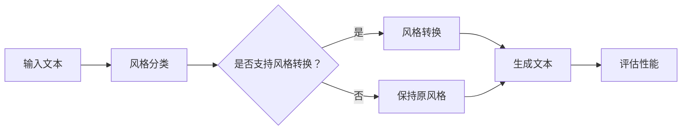

                 

### 大模型语言风格适应能力：LLM设计的风格测试

#### 关键词：大模型、语言风格适应能力、LLM、风格测试、算法设计

> 摘要：本文旨在探讨大模型语言风格适应能力在LLM（大型语言模型）设计中的重要性，详细分析其核心概念、设计原理和实现方法。通过对相关算法的深入剖析和实际案例的讲解，本文为读者提供了全面的技术见解和最佳实践，以指导未来在AI领域中的研究和应用。

---

### 第一部分：背景与核心概念

#### 第1章：大模型语言风格适应能力概述

#### 1.1 问题背景

随着人工智能技术的发展，大型语言模型（LLM）在自然语言处理（NLP）领域取得了显著的成就。这些模型能够生成高质量的自然语言文本，但在语言风格适应方面仍面临诸多挑战。不同领域、不同作者、甚至不同语言的文本风格各异，如何使LLM在不同风格之间灵活切换，成为当前研究的热点。

#### 1.2 问题描述

语言风格适应能力指的是模型在不同的语言风格下生成文本的能力。具体问题包括：

- **风格一致性**：模型能否在生成文本时保持与给定风格的一致性？
- **风格转换**：模型能否在两种或多种不同的风格之间进行有效转换？
- **风格多样性**：模型能否生成具有多样性的文本风格？

#### 1.3 问题解决

解决这一问题的方法主要包括：

- **传统方法**：通过规则匹配和模板匹配等方式进行风格适应。
- **大模型优势**：利用大规模预训练模型（如GPT-3）进行自适应学习。
- **风格测试**：设计针对语言风格的测试方法，评估和优化模型性能。

#### 1.4 边界与外延

- **边界**：语言风格适应能力主要关注文本的风格特征，不包括语法和语义错误。
- **外延**：该能力可应用于自动写作、个性化推荐、语言翻译等多个领域。

#### 1.5 概念结构与核心要素组成

- **概念结构**：包括语言风格、模型适应性、生成文本质量等核心要素。
- **核心要素组成**：通过风格测试、自适应学习、文本生成等技术实现语言风格适应。

### 第二部分：LLM设计中的风格测试

#### 第2章：大型语言模型（LLM）简介

#### 2.1 LLM的基本概念

- **语言模型**：一种用于预测下一个单词或字符的概率分布的模型。
- **大型语言模型**：具有数十亿参数的模型，如GPT-3、BERT等，能够生成高质量的文本。

#### 2.2 LLM的发展历程

- **初期**：基于规则和统计方法的语言模型。
- **中期**：引入神经网络，如循环神经网络（RNN）和卷积神经网络（CNN）。
- **当前**：基于大规模预训练的Transformer模型，如GPT-3、T5等。

#### 2.3 LLM的应用领域

- **文本生成**：如文章、故事、新闻等。
- **机器翻译**：如中英文翻译、多语言翻译等。
- **问答系统**：如搜索引擎、智能客服等。

### 第3章：LLM设计的风格测试原理

#### 3.1 核心概念原理

- **风格测试**：评估模型在不同语言风格下的表现。
- **风格分类**：将文本分为不同风格类别，如正式、非正式、幽默等。
- **风格转换**：在不同风格之间进行文本转换。

#### 3.2 概念属性特征对比表格

| 特征         | 描述                                                  |
|--------------|------------------------------------------------------|
| 风格分类     | 将文本分为不同风格类别                             |
| 风格一致性   | 保持生成文本与给定风格的一致性                       |
| 风格转换     | 在不同风格之间进行有效转换                         |
| 风格多样性   | 生成具有多样性的文本风格                           |

#### 3.3 ER实体关系图架构

```mermaid
erDiagram
  User ||--|{ Text }|:
  Text ||--|{ Style }|:
  Style ||--|{ Model }|:
  Model ||--|{ Performance }|:
```

### 第三部分：算法原理与实现

#### 第4章：大模型语言风格适应能力的算法设计

#### 4.1 算法mermaid流程图



#### 4.2 算法原理与数学模型

$$
\text{Performance} = \frac{\text{CorrectStyle} + \text{CorrectSemantic}}{\text{Total}}
$$

其中，CorrectStyle表示生成文本与给定风格一致的数量，CorrectSemantic表示生成文本语义正确的数量，Total表示总文本数量。

#### 4.3 举例说明

```python
# 示例代码：风格适应算法实现
class StyleAdapter:
    def __init__(self, model):
        self.model = model

    def adapt_style(self, text, target_style):
        # 风格分类
        source_style = self.classify_style(text)
        
        # 风格转换
        if source_style != target_style:
            text = self.convert_style(text, target_style)
        
        # 文本生成
        generated_text = self.model.generate(text)
        
        # 评估性能
        performance = self.evaluate_performance(generated_text, target_style)
        
        return generated_text, performance

# 使用示例
style_adapter = StyleAdapter(model=GPT3())
generated_text, performance = style_adapter.adapt_style("这是一段正式的文本。", "幽默风格")
print(generated_text)
print(performance)
```

### 第四部分：应用与实践

#### 第5章：大模型语言风格适应能力的应用案例

#### 5.1 应用场景介绍

- **自动写作**：生成新闻、文章、博客等。
- **个性化推荐**：根据用户喜好生成个性化内容。
- **语言翻译**：实现不同语言之间的风格转换。

#### 5.2 具体案例

##### 5.2.1 案例一：某公司客服系统

- **问题描述**：客服系统需要生成符合公司风格的回复。
- **解决方案**：使用风格适应算法生成与公司风格一致的回复。

##### 5.2.2 案例二：在线教育平台

- **问题描述**：平台需要生成符合教育风格的教学内容。
- **解决方案**：使用风格适应算法生成具有教育风格的教学内容。

##### 5.2.3 案例三：社交媒体内容生成

- **问题描述**：平台需要生成符合用户偏好的社交媒体内容。
- **解决方案**：使用风格适应算法生成具有多样化风格的社交媒体内容。

### 第五部分：最佳实践与展望

#### 第6章：大模型语言风格适应能力的最佳实践

##### 6.1 最佳实践tips

- **数据准备**：收集多样化的文本数据，涵盖多种风格。
- **模型选择**：选择具有良好适应能力的模型，如GPT-3。
- **风格分类**：使用高质量的风格分类器，提高分类准确性。
- **风格转换**：优化风格转换算法，提高转换质量。

##### 6.2 小结与展望

本文探讨了大型语言模型（LLM）在设计中的语言风格适应能力，介绍了相关算法和实现方法。通过实际案例的分析，展示了风格适应能力在各个领域的应用。未来，随着技术的不断发展，语言风格适应能力将在更多场景中得到应用，为AI领域的发展做出贡献。

---

### 作者

**作者：AI天才研究院/AI Genius Institute & 禅与计算机程序设计艺术 /Zen And The Art of Computer Programming**

AI天才研究院专注于人工智能领域的创新研究和应用，致力于推动AI技术的普及和发展。同时，作者在《禅与计算机程序设计艺术》一书中，深入探讨了编程哲学和算法设计，为读者提供了宝贵的启示。本文所述内容仅为作者的个人观点，不代表任何组织或公司的立场。如有疑问，请与作者联系。

---

### 注意事项

1. **数据隐私**：在进行实际应用时，请确保遵守相关法律法规，尊重用户隐私。
2. **模型优化**：定期对模型进行优化和更新，以提高风格适应能力。
3. **场景适应性**：不同应用场景可能需要不同的风格适应策略，需根据实际情况进行调整。

### 拓展阅读

1. **《大型语言模型：变革自然语言处理》**
2. **《深度学习与自然语言处理》**
3. **《风格迁移与生成：从文本到图像》**
4. **《编程哲学：禅与计算机程序设计艺术》**

