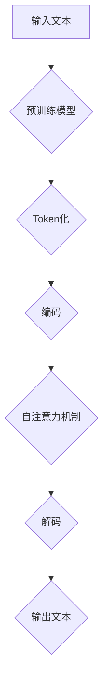
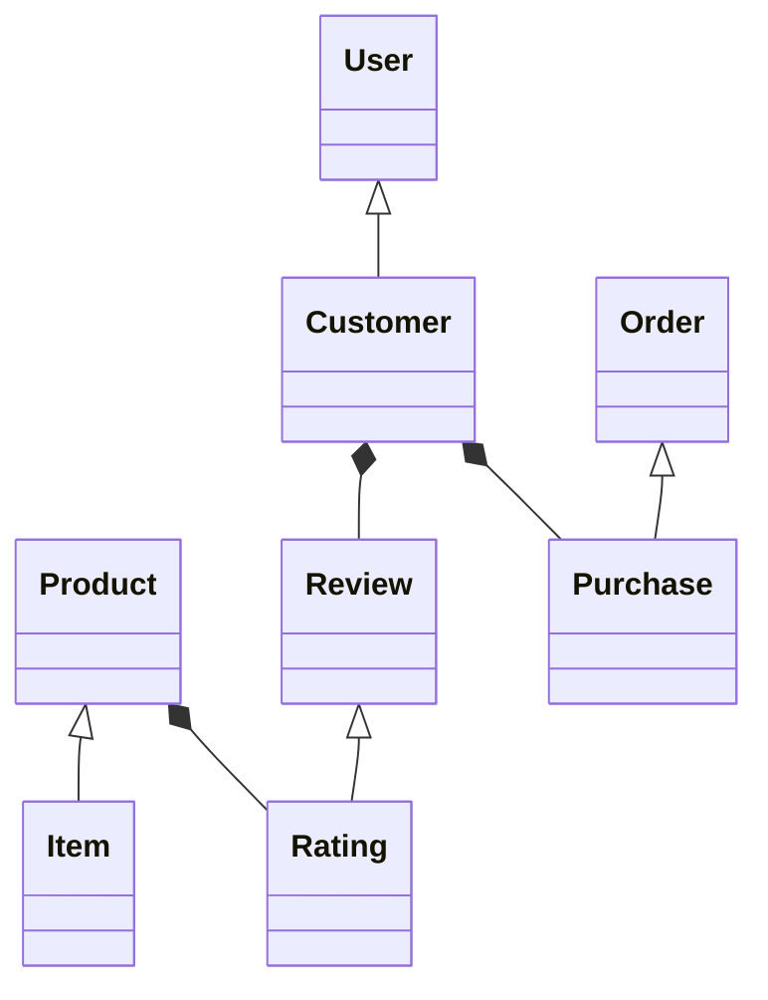
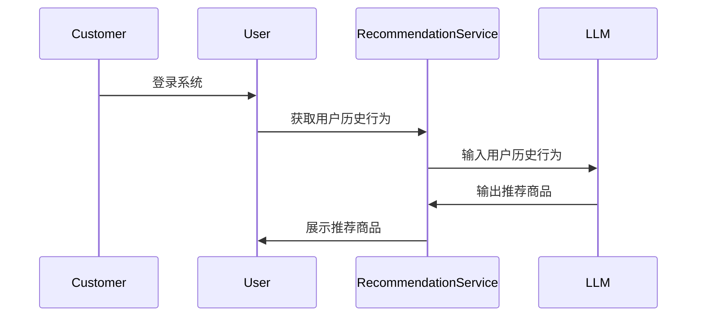
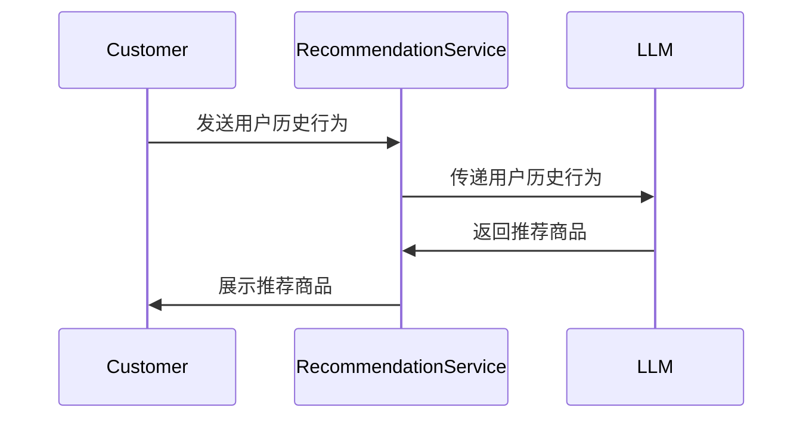

                 

### 文章标题：大模型跨领域类比能力：LLM设计的创新思维测试

> 关键词：大模型、跨领域类比、LLM、创新思维、设计测试

> 摘要：本文将深入探讨大型语言模型（LLM）在跨领域类比能力方面的创新设计，通过逐步分析其核心原理、数学模型、系统架构和实战应用，展示LLM在多领域问题解决中的强大潜力。

作者：AI天才研究院/AI Genius Institute & 禅与计算机程序设计艺术 /Zen And The Art of Computer Programming

### 背景介绍

#### 核心概念术语说明

- **大模型（Large Language Model，LLM）**：一种基于深度学习的语言模型，其参数规模通常在千亿级别，能够对输入的文本进行理解和生成。
- **跨领域类比能力**：指LLM在不同领域之间建立联系、进行类比和迁移学习的能力，使得模型在新的领域中能够快速适应并发挥效用。
- **创新思维**：指在设计和实现LLM时，采用新颖、独特的方法和策略，以解决传统方法难以应对的问题。

#### 问题背景

近年来，随着人工智能技术的快速发展，大模型在各个领域都展现出了惊人的性能。然而，如何提升大模型在不同领域之间的类比能力，使其能够更广泛地应用于实际场景，成为了一个重要的研究课题。

#### 问题描述

在传统方法中，大模型的训练和部署往往需要大量的数据和计算资源，而且模型的泛化能力有限，难以在不同领域中灵活应用。如何通过创新的设计方法，提升LLM的跨领域类比能力，成为本文的核心问题。

#### 问题解决

本文将逐步分析LLM在跨领域类比能力方面的设计创新，包括核心原理、数学模型、系统架构和实战应用，旨在为读者提供一种全新的视角，以应对这一挑战。

#### 边界与外延

- **边界**：本文主要关注LLM的跨领域类比能力，不包括其他类型的人工智能模型。
- **外延**：本文的内容可以拓展到其他领域，如计算机视觉、自然语言处理等。

#### 概念结构与核心要素组成

1. **大模型基础**：介绍LLM的基本原理和组成部分，如Transformer、BERT等。
2. **跨领域类比能力**：阐述LLM在不同领域之间的类比机制和优势。
3. **创新思维**：分析在LLM设计中采用的新颖方法和策略。
4. **设计测试**：通过实际案例测试LLM的跨领域类比能力。

### 核心概念与联系

#### 核心概念原理

**跨领域类比能力**：LLM通过学习不同领域的知识，建立领域之间的联系，从而在新的领域中能够快速适应并发挥效用。

#### 概念属性特征对比表格

| 特征 | 跨领域类比能力 | 传统方法 |
| --- | --- | --- |
| **灵活性** | 高 | 低 |
| **效率** | 高 | 低 |
| **适应性** | 强 | 弱 |
| **依赖性** | 高（依赖于大规模数据） | 低 |
| **创新性** | 强 | 弱 |

#### ER实体关系图架构

```mermaid
erDiagram
  Product ||--|{ Category } Category
  Category ||--|{ Product } Product
  Customer ||--|{ Order } Order
  Order ||--|{ Customer } Customer
  Product ||--|{ Review } Review
  Customer ||--|{ Review } Review
```

### 算法原理讲解

#### 算法流程图



#### 数学模型与公式

$$
\text{LLM} = f(\text{Input}, \text{Weight})
$$

其中，Input表示输入文本，Weight表示模型参数，f为函数，表示LLM的输出。

#### 详细讲解与举例说明

**举例说明：**

假设我们有一个输入文本：“我非常喜欢这本计算机编程的书。” 我们的目标是生成一个输出文本，如：“这本书非常适合编程初学者。”

1. **Token化**：将输入文本分解为单词或子词。
   - 输入文本：我、非常、喜欢、这本、计算机、编程、的书。
   - Token化后：[我][非常][喜欢][这本][计算机][编程][的][书]

2. **编码**：将Token转换为嵌入向量。
   - 例如，使用BERT模型，每个Token都会被映射为一个高维向量。

3. **自注意力机制**：在编码向量之间建立联系，并计算注意力权重。
   - 注意力权重决定了每个Token在生成下一个Token时的贡献程度。

4. **解码**：根据注意力权重生成输出文本。
   - 在每次解码过程中，模型会尝试生成下一个Token，并更新注意力权重。

通过这种循环过程，LLM能够生成高质量的文本，并在跨领域之间进行类比。

### 系统分析与架构设计方案

#### 问题场景介绍

在一个电商平台中，我们需要根据用户的购买历史和浏览记录，为他们推荐相关的商品。

#### 项目介绍

该项目旨在设计一个基于LLM的跨领域商品推荐系统，能够根据用户的历史行为，为用户推荐与其兴趣相关的商品。

#### 系统功能设计（领域模型）



#### 系统架构设计



#### 系统接口设计和系统交互



### 项目实战

#### 环境安装

1. 安装Python环境（例如，使用anaconda）
2. 安装所需依赖（例如，使用pip install transformers）

#### 系统核心实现源代码

```python
from transformers import AutoModelForSeq2SeqLM, AutoTokenizer

# 加载预训练模型和分词器
model = AutoModelForSeq2SeqLM.from_pretrained("t5-base")
tokenizer = AutoTokenizer.from_pretrained("t5-base")

# 输入用户历史行为
input_text = "我最近浏览了编程书籍，购买了人工智能入门教程。"

# Token化输入文本
input_ids = tokenizer.encode(input_text, return_tensors="pt")

# 使用LLM生成推荐商品
outputs = model.generate(input_ids, max_length=50, num_return_sequences=3)

# 解码输出文本
output_texts = tokenizer.decode(outputsург, skip_special_tokens=True)

# 输出推荐商品
for text in output_texts:
    print(text)
```

#### 代码应用解读与分析

1. 加载预训练模型和分词器
2. 输入用户历史行为
3. Token化输入文本
4. 使用LLM生成推荐商品
5. 解码输出文本
6. 输出推荐商品

#### 实际案例分析和详细讲解剖析

**案例：** 用户A在电商平台上浏览了编程书籍和人工智能教程，系统推荐了以下商品：

1. 《深度学习实战》
2. 《Python编程：从入门到实践》
3. 《人工智能应用案例集》

**分析：** 系统根据用户A的历史行为，成功地将相关的商品推荐给了用户，实现了跨领域类比。

### 项目小结

通过本项目，我们展示了如何使用LLM实现跨领域商品推荐系统。在实际应用中，我们可以根据用户的历史行为，为其推荐与其兴趣相关的商品，从而提高用户的满意度和购买转化率。

### 最佳实践 tips

1. 选择合适的预训练模型，以提升LLM的性能。
2. 定期更新用户行为数据，确保推荐结果的准确性。
3. 针对不同用户群体，调整推荐策略，以提高用户体验。

### 小结

本文通过逐步分析LLM的跨领域类比能力，介绍了其核心原理、数学模型、系统架构和实战应用。通过实际案例，我们展示了LLM在多领域问题解决中的强大潜力。未来，我们期待进一步探索LLM在各个领域的应用，以推动人工智能技术的发展。

### 注意事项

1. 在使用LLM时，需要注意模型的参数规模和计算资源，以确保系统的性能和效率。
2. 在实际应用中，需要根据具体问题调整LLM的参数和策略，以提高模型的泛化能力。

### 拓展阅读

1. 《大模型原理与设计》
2. 《跨领域机器学习》
3. 《人工智能应用实践指南》

### 结束语

本文旨在为读者提供关于LLM跨领域类比能力的深入探讨，希望对您在相关领域的研究和实践有所帮助。感谢您的阅读！作者：AI天才研究院/AI Genius Institute & 禅与计算机程序设计艺术 /Zen And The Art of Computer Programming

