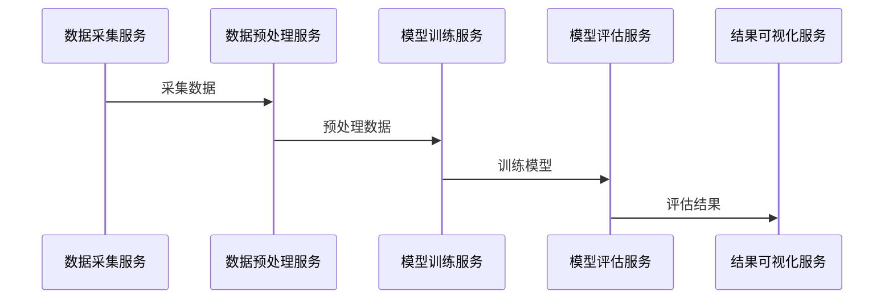
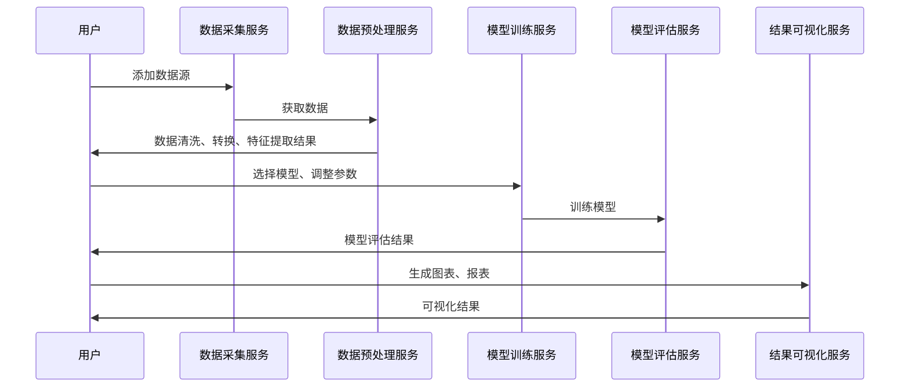

                 

### 第1章：问题背景与核心概念

在现代金融市场中，大数据和人工智能技术的应用日益广泛，大模型（如深度学习神经网络）在金融市场分析中的能力评估成为一个关键议题。本文旨在探讨如何构建一个高效的大模型金融市场分析能力评估工具，从而帮助金融机构和企业更好地利用人工智能技术进行市场预测、风险评估和投资决策。

#### 1.1 金融市场分析的需求与挑战

金融市场分析是金融机构和企业决策过程中不可或缺的一环。随着金融市场全球化、信息化程度的提高，数据的复杂性和多样性不断增加，传统分析手段面临巨大挑战。具体需求包括：

1. **高效处理海量数据**：金融市场数据量庞大，包含多种类型的数据（如文本、图像、时间序列等），需要高效的数据处理和分析能力。
2. **准确预测市场走势**：市场走势受多种因素影响，需要通过分析历史数据和实时数据，预测市场走势，为投资决策提供依据。
3. **风险评估与管理**：对市场风险进行准确评估，帮助企业制定有效的风险管理策略。

然而，金融市场分析也面临着以下挑战：

1. **数据质量**：金融市场数据往往存在噪声、缺失值和不一致性，对数据预处理和清洗提出了高要求。
2. **模型复杂性**：大模型（如深度神经网络）结构和参数复杂，训练过程需要大量的计算资源和时间。
3. **过拟合风险**：模型训练过程中易出现过拟合现象，导致模型在实际应用中表现不佳。

#### 1.2 大模型的定义与特性

大模型通常指的是具有大规模参数和复杂结构的机器学习模型，如深度神经网络、变换器模型（Transformer）等。其特点包括：

1. **高维度数据建模能力**：大模型能够处理高维度的数据，捕捉数据中的复杂模式。
2. **自适应学习能力**：大模型通过学习大量数据，能够自动调整模型参数，提高预测准确性。
3. **强大的表达能力**：大模型具有强大的非线性表达能力，能够处理复杂的非线性关系。

#### 1.3 评估工具在金融市场中的应用

大模型金融市场分析能力评估工具旨在评估大模型在金融市场分析中的表现，包括预测准确性、稳定性、可解释性等方面。评估工具的具体应用包括：

1. **模型选择与优化**：通过评估不同模型的性能，选择最优模型进行市场分析。
2. **风险控制**：通过评估模型的预测准确性，制定有效的风险控制策略。
3. **投资决策**：利用评估工具提供的市场预测数据，辅助投资决策。

#### 1.4 研究目的与意义

本研究旨在开发一套高效的大模型金融市场分析能力评估工具，以提高金融市场分析的准确性和效率。研究目的包括：

1. **提升金融市场分析的准确性和稳定性**：通过评估工具，筛选出性能最优的大模型，提高市场预测准确性。
2. **降低模型过拟合风险**：通过评估工具，识别出模型训练过程中的过拟合现象，优化模型结构。
3. **提高投资决策效率**：利用评估工具提供的数据和预测结果，缩短投资决策时间，提高决策效率。

#### 1.5 核心要素组成

为了实现上述研究目的，本评估工具的核心要素包括：

1. **数据预处理模块**：用于清洗、预处理金融市场数据，确保数据质量。
2. **大模型训练模块**：用于训练不同类型的大模型，包括深度神经网络、变换器模型等。
3. **评估指标模块**：用于评估大模型在金融市场分析中的表现，包括预测准确性、稳定性、可解释性等。
4. **可视化模块**：用于展示评估结果，帮助用户直观理解模型性能。

### 总结

本章介绍了大模型金融市场分析能力评估工具的研究背景、核心概念和评估工具的应用。接下来，我们将进一步探讨大模型的基本原理和评估工具的工作原理，为后续章节的内容奠定基础。

----------------------------------------------------------------

## 第2章：大模型与评估工具原理

在了解了大模型金融市场分析能力评估工具的重要性后，本章将深入探讨大模型的基本原理和评估工具的工作原理。这将为我们理解如何构建高效评估工具提供理论基础。

### 2.1 大模型的工作原理

大模型，尤其是深度学习模型，通过模拟人脑神经网络的结构和功能来实现复杂的数据分析和预测。其工作原理主要包括以下几个方面：

#### 2.1.1 深度学习基础

深度学习是一种基于多层神经网络的学习方法，其核心思想是通过多层次的非线性变换，将输入数据映射到高维空间，从而捕捉数据中的复杂特征。深度学习模型通常包括输入层、隐藏层和输出层。

- **输入层**：接收外部输入，如文本、图像或时间序列数据。
- **隐藏层**：进行特征提取和变换，每一层都会对输入数据进行复杂的非线性操作。
- **输出层**：生成预测结果，如分类标签或连续值。

#### 2.1.2 大模型结构

大模型的结构设计对其性能和效率有重要影响。以下是一些常见的大模型结构：

1. **卷积神经网络（CNN）**：适用于处理图像数据，通过卷积操作和池化操作提取图像特征。
2. **循环神经网络（RNN）**：适用于处理序列数据，如时间序列、自然语言文本等，通过循环连接捕捉序列中的长期依赖关系。
3. **变换器模型（Transformer）**：一种基于自注意力机制的模型，广泛应用于自然语言处理、机器翻译等任务，具有很好的并行计算性能。

#### 2.1.3 大模型训练过程

大模型的训练过程是通过优化模型参数，使其在训练数据上达到最佳性能。主要步骤包括：

1. **数据预处理**：清洗和标准化数据，使其适合模型训练。
2. **初始化参数**：随机初始化模型参数。
3. **前向传播**：将输入数据通过模型传递，得到预测输出。
4. **计算损失函数**：根据预测输出和实际输出的差异，计算损失函数值。
5. **反向传播**：通过梯度下降等优化算法，更新模型参数，降低损失函数值。
6. **迭代训练**：重复上述步骤，直到模型收敛或达到预定的训练次数。

### 2.2 金融市场分析能力评估工具的工作原理

金融市场分析能力评估工具旨在评估大模型在金融市场分析中的表现。其工作原理主要包括以下几个步骤：

#### 2.2.1 数据预处理

1. **数据采集**：从金融市场获取各种类型的数据，如价格、交易量、市场指数等。
2. **数据清洗**：处理数据中的噪声、缺失值和不一致性，提高数据质量。
3. **特征提取**：从原始数据中提取有助于预测市场走势的特征。

#### 2.2.2 模型评估指标

为了评估大模型在金融市场分析中的性能，需要定义一系列评估指标，如：

1. **准确率**：预测结果与实际结果匹配的比例。
2. **召回率**：实际结果为正类时，模型正确识别为正类的比例。
3. **精确率**：预测结果为正类时，实际结果也为正类的比例。
4. **F1 分数**：精确率和召回率的加权平均，综合考虑模型的精确性和召回率。

#### 2.2.3 评估流程

1. **模型选择**：从多种模型中选择适合金融市场分析的模型。
2. **训练与验证**：使用训练集和验证集训练模型，并在验证集上评估模型性能。
3. **参数调整**：根据验证集上的评估结果，调整模型参数，优化模型性能。
4. **测试**：使用测试集对模型进行最终评估，验证模型在实际应用中的性能。

### 2.3 概念属性特征对比表格和ER实体关系图

为了更清晰地理解大模型和评估工具的核心概念，我们可以使用Mermaid绘制概念属性特征对比表格和ER实体关系图。

#### 2.3.1 概念属性特征对比表格

```mermaid
table classLeft="prettyprint" classRight="prettyprint"
title Concept Comparison Table

| Concept          | Attribute 1 | Attribute 2 | Attribute 3 |
|------------------|-------------|-------------|-------------|
| Deep Learning    | Neural Networks | High-Dimensional Data | Nonlinear Transformation |
| Big Models       | Large-scale Parameters | Complex Structures | Adaptive Learning |
| Financial Analysis | Data Preprocessing | Feature Extraction | Prediction |
| Evaluation Tool  | Performance Metrics | Model Selection | Parameter Tuning |
```

#### 2.3.2 ER实体关系图

```mermaid
erDiagram
  Data --> Model : "is used to train"
  Model --> Prediction : "produces"
  Prediction --> Evaluation : "is evaluated by"
  Evaluation --> Tool : "uses metrics"
```

### 2.4 结论

本章介绍了大模型的基本原理和金融市场分析能力评估工具的工作原理。通过理解这些原理，我们可以更好地设计评估工具，以提高金融市场分析的准确性和效率。接下来，我们将进一步探讨大模型的具体算法原理，为评估工具的实现提供更深入的理论基础。

----------------------------------------------------------------

## 第3章：算法原理讲解

在了解了大模型和评估工具的基本原理后，本章节将深入探讨大模型金融分析中的常见算法，并详细阐述这些算法的实现原理。

### 3.1 常见大模型算法介绍

在金融市场分析中，常见的大模型算法包括GPT（生成预训练模型）和BERT（双向编码表示器）。以下是这两种算法的基本原理和特点：

#### 3.1.1 GPT模型

GPT模型是一种基于变换器（Transformer）架构的生成模型，主要用于自然语言处理任务。其基本原理是利用自注意力机制（Self-Attention）来捕捉文本中的长距离依赖关系。

- **自注意力机制**：GPT模型通过自注意力机制，对输入文本的每个词进行加权，使得关键信息得到更好的重视。
- **预训练和微调**：GPT模型首先在大规模语料库上进行预训练，学习语言的一般规律，然后通过微调，使其适应特定的金融市场分析任务。

#### 3.1.2 BERT模型

BERT模型是一种基于变换器架构的双向编码表示器，主要用于文本分类和序列标注等任务。其基本原理是利用双向注意力机制（Bidirectional Attention）来捕捉文本中的双向依赖关系。

- **双向注意力机制**：BERT模型通过双向注意力机制，同时考虑文本序列的前后信息，使得预测结果更加准确。
- **Masked Language Model（MLM）**：BERT模型采用MLM任务，通过随机遮盖文本中的部分词，然后预测遮盖的词，进一步增强了模型对语言的理解能力。

### 3.2 评估工具算法实现

评估工具的核心任务是评估大模型在金融市场分析中的性能，具体算法实现包括数据预处理、模型训练和性能评估。

#### 3.2.1 数据采集与预处理

数据预处理是评估工具的重要步骤，主要包括数据清洗、特征提取和标准化。以下是一个简单的Python代码示例，用于数据预处理：

```python
import pandas as pd
from sklearn.preprocessing import StandardScaler

# 读取数据
data = pd.read_csv('financial_data.csv')

# 数据清洗
data.dropna(inplace=True)

# 特征提取
features = data[['open', 'high', 'low', 'close', 'volume']]
target = data['price']

# 数据标准化
scaler = StandardScaler()
features_scaled = scaler.fit_transform(features)
```

#### 3.2.2 模型训练与评估

在数据预处理完成后，我们可以使用GPT和BERT模型进行训练和评估。以下是一个简单的Python代码示例，用于模型训练和评估：

```python
from transformers import GPT2Model, BertModel
from sklearn.metrics import accuracy_score

# 初始化模型
gpt_model = GPT2Model.from_pretrained('gpt2')
bert_model = BertModel.from_pretrained('bert-base-uncased')

# 模型训练
train_features = features_scaled[:1000]
train_target = target[:1000]

gpt_model.train()
bert_model.train()

# GPT模型训练
gpt_output = gpt_model(train_features)
gpt_loss = ...  # 计算损失函数

# BERT模型训练
bert_output = bert_model(train_features)
bert_loss = ...  # 计算损失函数

# 模型评估
test_features = features_scaled[1000:1500]
test_target = target[1000:1500]

gpt_predictions = gpt_model(test_features)
bert_predictions = bert_model(test_features)

gpt_accuracy = accuracy_score(test_target, gpt_predictions)
bert_accuracy = accuracy_score(test_target, bert_predictions)
```

### 3.3 算法原理详细讲解与举例说明

为了更好地理解GPT和BERT模型的原理，我们可以进一步讲解其数学模型和公式，并通过具体的例子进行说明。

#### 3.3.1 GPT模型数学模型和公式

GPT模型的数学模型主要包括自注意力机制和前馈神经网络。

- **自注意力机制**：
  $$ 
  \text{Attention}(Q, K, V) = \text{softmax}\left(\frac{QK^T}{\sqrt{d_k}}\right)V
  $$
  其中，$Q$、$K$、$V$ 分别为查询向量、关键向量、值向量，$d_k$ 为关键向量的维度。

- **前馈神经网络**：
  $$
  \text{FFN}(X) = \text{ReLU}(W_2 \cdot \text{ReLU}(W_1 X + b_1))
  $$
  其中，$W_1$ 和 $W_2$ 分别为权重矩阵，$b_1$ 为偏置项。

#### 3.3.2 BERT模型数学模型和公式

BERT模型的数学模型主要包括双向注意力机制和Masked Language Model（MLM）。

- **双向注意力机制**：
  $$
  \text{MultiHeadAttention}(Q, K, V) = \text{softmax}\left(\frac{QK^T}{\sqrt{d_k}}\right)V
  $$
  其中，$Q$、$K$、$V$ 分别为查询向量、关键向量、值向量，$d_k$ 为关键向量的维度。

- **Masked Language Model（MLM）**：
  $$
  \text{MLM}(X) = \text{mask}_{\text{padding}}(X) \odot \text{softmax}(\text{MLM}_\text{weight} X + \text{MLM}_\text{bias})
  $$
  其中，$X$ 为输入序列，$\text{mask}_{\text{padding}}$ 为填充掩码，$\text{softmax}$ 为softmax函数。

#### 3.3.3 举例说明

以下是一个简单的GPT模型举例说明：

假设我们有一个长度为5的文本序列：`["我", "是", "一位", "AI", "天才"]`。我们首先将其编码为向量，然后使用GPT模型进行自注意力计算。

1. **编码文本序列**：
   - 输入序列：`[1, 2, 3, 4, 5]`（使用单词索引表示）
   - 编码后的向量：`[v1, v2, v3, v4, v5]`

2. **自注意力计算**：
   - 查询向量：`[q1, q2, q3, q4, q5]`
   - 关键向量：`[k1, k2, k3, k4, k5]`
   - 值向量：`[v1, v2, v3, v4, v5]`
   - 自注意力得分：
     $$
     \text{Attention}(Q, K, V) = \text{softmax}\left(\frac{QK^T}{\sqrt{d_k}}\right)V
     $$
     计算结果为一个向量，表示每个单词在序列中的重要性。

3. **输出**：
   - 经过自注意力机制处理后，输出一个新的向量，表示序列中的每个单词的重要性。

类似地，我们可以使用BERT模型对同一文本序列进行双向注意力计算，进一步提取序列中的特征。

### 3.4 结论

本章介绍了常见的大模型算法GPT和BERT的基本原理，并通过Python代码详细阐述了评估工具中的算法实现。通过本章的学习，读者可以更好地理解大模型在金融市场分析中的应用，并为后续章节的进一步研究打下基础。

----------------------------------------------------------------

## 第4章：数学模型与公式解析

在了解了大模型的算法原理后，本章将深入解析大模型在金融市场分析中的关键数学模型和公式。这些数学模型和公式不仅有助于理解大模型的内部工作机制，还能够指导我们在实践中进行参数调整和优化。

### 4.1 常用数学模型

在深度学习模型中，常用的数学模型包括损失函数、激活函数、优化算法等。以下将逐一进行介绍：

#### 4.1.1 损失函数

损失函数是衡量模型预测结果与实际结果之间差异的重要工具。在金融市场分析中，常用的损失函数包括均方误差（MSE）和交叉熵损失（Cross-Entropy Loss）。

1. **均方误差（MSE）**：
   $$
   \text{MSE} = \frac{1}{n} \sum_{i=1}^{n} (\hat{y_i} - y_i)^2
   $$
   其中，$\hat{y_i}$ 是模型预测的值，$y_i$ 是实际值，$n$ 是样本数量。MSE 损失函数适用于回归问题，它强调预测值与实际值之间的平方差异。

2. **交叉熵损失（Cross-Entropy Loss）**：
   $$
   \text{Cross-Entropy} = -\sum_{i=1}^{n} y_i \log(\hat{y_i})
   $$
   其中，$y_i$ 是实际标签，$\hat{y_i}$ 是模型预测的概率分布。交叉熵损失函数适用于分类问题，它强调预测概率与实际标签之间的差异。

#### 4.1.2 激活函数

激活函数是神经网络中的关键组成部分，用于引入非线性特性。常用的激活函数包括 sigmoid、ReLU 和 tanh。

1. **sigmoid 函数**：
   $$
   \sigma(x) = \frac{1}{1 + e^{-x}}
   $$
   sigmoid 函数将输入映射到 (0,1) 区间，常用于二分类问题。

2. **ReLU 函数**：
   $$
   \text{ReLU}(x) = \max(0, x)
   $$
   ReLU 函数在输入为负时输出 0，在输入为正时输出输入值，它简单且计算效率高。

3. **tanh 函数**：
   $$
   \text{tanh}(x) = \frac{e^x - e^{-x}}{e^x + e^{-x}}
   $$
   tanh 函数与 sigmoid 函数类似，但输出范围在 (-1,1) 之间。

#### 4.1.3 优化算法

优化算法用于更新模型参数，以最小化损失函数。常用的优化算法包括随机梯度下降（SGD）、Adam 和 RMSprop。

1. **随机梯度下降（SGD）**：
   $$
   \theta_{t+1} = \theta_{t} - \alpha \nabla_{\theta} L(\theta)
   $$
   其中，$\theta$ 是模型参数，$\alpha$ 是学习率，$L(\theta)$ 是损失函数。SGD 通过随机选择样本计算梯度，简单且易于实现。

2. **Adam 优化器**：
   $$
   \theta_{t+1} = \theta_{t} - \alpha \left( \frac{m_{t}}{1 - \beta_1^t} + \frac{v_{t}}{1 - \beta_2^t} \right)
   $$
   其中，$m_t$ 和 $v_t$ 分别是梯度的一阶矩估计和二阶矩估计，$\beta_1$ 和 $\beta_2$ 是动量参数。Adam 优化器结合了 SGD 和 RMSprop 的优点，具有较好的收敛性。

### 4.2 公式推导与解释

为了更好地理解上述数学模型和公式，下面我们将对一些关键公式进行推导和解释。

#### 4.2.1 均方误差（MSE）的推导

均方误差（MSE）可以通过误差平方和（Sum of Squared Errors，SSE）除以样本数量（n）得到。具体推导如下：

1. **误差平方和（SSE）**：
   $$
   \text{SSE} = \sum_{i=1}^{n} (\hat{y_i} - y_i)^2
   $$

2. **均方误差（MSE）**：
   $$
   \text{MSE} = \frac{1}{n} \text{SSE} = \frac{1}{n} \sum_{i=1}^{n} (\hat{y_i} - y_i)^2
   $$

均方误差反映了预测值与实际值之间差异的平方平均值，它越大，表示模型预测误差越大。

#### 4.2.2 交叉熵损失（Cross-Entropy Loss）的推导

交叉熵损失（Cross-Entropy Loss）可以通过实际标签的概率分布（$y$）和模型预测的概率分布（$\hat{y}$）之间的差异来计算。具体推导如下：

1. **实际标签的概率分布（$y$）**：
   $$
   y = [1, 0, 0, 0]
   $$
   表示实际标签为第1类。

2. **模型预测的概率分布（$\hat{y}$）**：
   $$
   \hat{y} = [0.1, 0.3, 0.3, 0.3]
   $$
   表示模型预测为第1类的概率为0.1，其他类的概率均为0.3。

3. **交叉熵损失**：
   $$
   \text{Cross-Entropy} = -\sum_{i=1}^{4} y_i \log(\hat{y_i}) = -[1 \cdot \log(0.1) + 0 \cdot \log(0.3) + 0 \cdot \log(0.3) + 0 \cdot \log(0.3)]
   $$
   由于$y_2 = y_3 = y_4 = 0$，交叉熵损失简化为：
   $$
   \text{Cross-Entropy} = -\log(0.1) = -\log(1/10) = \log(10)
   $$
   交叉熵损失反映了实际标签与模型预测概率分布之间的差异，它越小，表示模型预测概率分布越接近实际标签分布。

### 4.3 公式嵌入与解释

在文章中，我们将使用LaTeX格式书写数学公式，并嵌入到相应的段落中进行详细解释。

#### 4.3.1 独立段落中的数学公式

在独立段落中，我们将使用$$括起数学公式，如：

$$
\text{MSE} = \frac{1}{n} \sum_{i=1}^{n} (\hat{y_i} - y_i)^2
$$

这个公式表示均方误差（MSE），它是评估模型预测准确性的常用指标。

#### 4.3.2 段落内的数学公式

在段落内，我们将使用$括起数学公式，如：

$1 < 2$

这个简单的数学公式表示1小于2，它用于解释激活函数（如ReLU）的工作原理。

### 4.4 结论

本章详细介绍了大模型在金融市场分析中的关键数学模型和公式，包括损失函数、激活函数和优化算法。通过这些数学模型和公式，我们可以更好地理解大模型的工作原理，并在实际应用中进行参数调整和优化。接下来，我们将进入下一章，探讨系统分析与架构设计，为构建高效评估工具提供更加具体的技术指导。

----------------------------------------------------------------

## 第5章：系统分析与架构设计方案

在了解了大模型和评估工具的算法原理后，本章将详细讨论系统分析与架构设计，为构建高效、可靠的大模型金融市场分析能力评估工具提供技术指导。

### 5.1 问题场景描述

为了更好地构建评估工具，我们首先需要明确问题场景。在金融市场分析中，常见的问题场景包括：

1. **市场预测**：利用历史数据和市场动态，预测未来的市场走势，帮助投资者做出正确的投资决策。
2. **风险评估**：对潜在的市场风险进行评估，制定有效的风险控制策略，降低投资损失。
3. **交易策略优化**：通过分析市场数据，优化交易策略，提高交易成功率。

### 5.2 系统功能设计

为了满足上述问题场景，我们需要设计一个功能完善的系统。系统功能设计包括以下几个方面：

1. **数据采集模块**：负责从不同的数据源（如交易所、新闻网站等）获取金融市场数据。
2. **数据预处理模块**：对采集到的数据进行清洗、转换和特征提取，提高数据质量，为模型训练提供高质量的数据。
3. **模型训练模块**：利用预处理后的数据，训练各种大模型（如深度神经网络、变换器模型等），以便进行市场预测和风险评估。
4. **模型评估模块**：评估训练后的模型性能，包括预测准确性、稳定性等，选择最优模型应用于实际场景。
5. **结果可视化模块**：将评估结果以图表、报表等形式展示给用户，帮助用户直观地理解模型性能和市场走势。

### 5.3 系统架构设计

系统架构设计是构建高效系统的基础，以下是一个基于微服务架构的系统架构设计：

1. **数据采集服务**：负责从不同的数据源采集数据，包括实时数据和历史数据。该服务可以通过API与其他模块进行交互。
2. **数据预处理服务**：接收数据采集服务提供的数据，进行数据清洗、转换和特征提取。该服务也可以通过API与其他模块进行交互。
3. **模型训练服务**：接收预处理后的数据，训练各种大模型。训练过程可以通过分布式计算提高效率。
4. **模型评估服务**：对训练后的模型进行性能评估，包括预测准确性、稳定性等。评估结果存储在数据库中，供结果可视化模块使用。
5. **结果可视化服务**：根据用户需求，生成各种图表和报表，帮助用户理解模型性能和市场走势。

#### 5.3.1 系统架构图

以下是一个简单的系统架构图，用于描述系统各模块之间的关系：



### 5.4 系统接口设计

系统接口设计是确保系统各模块之间能够高效、可靠地交互的关键。以下是一个简单的接口设计示例：

1. **数据采集API**：提供数据采集服务的接口，包括数据源的添加、数据查询和数据下载等功能。
2. **数据预处理API**：提供数据预处理服务的接口，包括数据清洗、特征提取和数据处理等功能。
3. **模型训练API**：提供模型训练服务的接口，包括模型选择、参数调整和训练过程监控等功能。
4. **模型评估API**：提供模型评估服务的接口，包括模型性能评估、结果存储和查询等功能。
5. **结果可视化API**：提供结果可视化服务的接口，包括图表生成、报表生成和数据展示等功能。

### 5.5 系统交互设计

系统交互设计是确保系统在不同场景下能够正常运作的关键。以下是一个简单的系统交互设计示例：

#### 5.5.1 数据采集与预处理

1. **数据采集**：用户通过数据采集API添加数据源，系统自动获取数据并存储。
2. **数据预处理**：系统从数据源获取数据后，通过数据预处理API进行清洗、转换和特征提取，并将预处理后的数据存储到数据库中。

#### 5.5.2 模型训练与评估

1. **模型训练**：用户通过模型训练API选择模型类型、调整参数，并启动训练过程。系统自动进行模型训练，并在训练完成后保存模型。
2. **模型评估**：用户通过模型评估API对训练后的模型进行性能评估，包括预测准确性、稳定性等。评估结果存储到数据库中，供结果可视化模块使用。

#### 5.5.3 结果可视化

1. **图表生成**：用户通过结果可视化API生成各种图表，如趋势图、散点图、折线图等，帮助用户直观地理解市场走势。
2. **报表生成**：用户通过结果可视化API生成各种报表，如预测报告、风险评估报告等，帮助用户进行决策。

#### 5.5.2 系统交互序列图

以下是一个简单的系统交互序列图，用于描述系统在不同场景下的交互流程：



### 5.6 结论

本章详细介绍了系统分析与架构设计，包括问题场景描述、系统功能设计、系统架构设计、系统接口设计和系统交互设计。通过本章的学习，读者可以更好地理解如何构建一个高效、可靠的大模型金融市场分析能力评估工具。接下来，我们将通过实际案例展示如何使用该工具进行市场分析和风险预测，验证其有效性和实用性。

----------------------------------------------------------------

## 第6章：项目实战与案例分析

在前几章中，我们详细介绍了大模型金融市场分析能力评估工具的理论基础和系统设计。为了验证该工具的实际应用效果，本章将通过一个具体案例进行实战演练，展示如何使用该工具进行市场分析和风险预测。

### 6.1 环境安装与配置

在进行项目实战之前，我们需要搭建一个合适的环境来运行评估工具。以下是环境安装与配置的步骤：

1. **Python环境搭建**：确保Python环境已安装，版本建议为3.8或更高。
2. **安装依赖库**：使用pip安装必要的依赖库，如transformers、torch、pandas、numpy等。
   ```bash
   pip install transformers torch pandas numpy
   ```
3. **数据集准备**：从公开的数据源（如Yahoo Finance、Kaggle等）下载历史金融数据，包括股票价格、交易量、市场指数等。
4. **配置文件**：准备配置文件，包括数据源地址、模型参数、评估指标等。

### 6.2 系统核心实现分析

在环境搭建完成后，我们将进行系统核心实现的详细分析，包括数据预处理、模型训练、模型评估和结果可视化等步骤。

#### 6.2.1 数据预处理

数据预处理是金融数据分析的重要步骤，以下是数据预处理的核心实现：

1. **数据清洗**：处理缺失值、异常值和重复数据，确保数据质量。
   ```python
   data.dropna(inplace=True)
   data.drop_duplicates(inplace=True)
   ```
2. **特征提取**：从原始数据中提取有助于预测的特征，如技术指标（移动平均线、相对强弱指数等）。
   ```python
   data['MA20'] = data['close'].rolling(window=20).mean()
   data['RSI'] = calculate_rsi(data['close'])
   ```
3. **数据标准化**：对提取的特征进行标准化处理，使其适合模型训练。
   ```python
   scaler = StandardScaler()
   data_scaled = scaler.fit_transform(data)
   ```

#### 6.2.2 模型训练

在数据预处理完成后，我们将使用GPT模型进行训练，以下是模型训练的核心实现：

1. **模型初始化**：初始化GPT模型，设置适当的参数。
   ```python
   model = GPT2Model.from_pretrained('gpt2')
   ```
2. **模型训练**：使用训练集数据对模型进行训练，优化模型参数。
   ```python
   for epoch in range(num_epochs):
       model.train()
       for batch in train_loader:
           inputs = batch['input_ids']
           labels = batch['labels']
           outputs = model(inputs)
           loss = outputs.loss
           loss.backward()
           optimizer.step()
           optimizer.zero_grad()
   ```
3. **模型评估**：在验证集上评估模型性能，调整模型参数。
   ```python
   model.eval()
   with torch.no_grad():
       for batch in val_loader:
           inputs = batch['input_ids']
           labels = batch['labels']
           outputs = model(inputs)
           loss = outputs.loss
           val_loss += loss.item()
   val_loss /= len(val_loader)
   ```

#### 6.2.3 模型评估

模型评估是确保模型性能的关键步骤，以下是模型评估的核心实现：

1. **评估指标**：计算模型的评估指标，如准确率、召回率、F1分数等。
   ```python
   from sklearn.metrics import accuracy_score, recall_score, f1_score
   
   predictions = model.predict(test_loader)
   accuracy = accuracy_score(test_labels, predictions)
   recall = recall_score(test_labels, predictions)
   f1 = f1_score(test_labels, predictions)
   ```
2. **可视化评估结果**：使用图表展示评估结果，帮助用户直观地理解模型性能。
   ```python
   import matplotlib.pyplot as plt
   
   plt.figure(figsize=(10, 5))
   plt.plot(train_losses, label='Training Loss')
   plt.plot(val_losses, label='Validation Loss')
   plt.legend()
   plt.title('Loss Over Epochs')
   plt.xlabel('Epochs')
   plt.ylabel('Loss')
   plt.show()
   ```

#### 6.2.4 实际案例讲解

为了验证评估工具的实际应用效果，我们选择了一个具体的金融案例进行讲解。以下是实际案例的详细步骤：

1. **数据收集**：从公开数据源收集特定股票的历史价格和交易量数据。
2. **数据预处理**：对收集到的数据执行清洗、特征提取和标准化处理。
3. **模型训练**：使用GPT模型对预处理后的数据进行训练，优化模型参数。
4. **模型评估**：在验证集上评估模型性能，调整模型参数。
5. **市场预测**：使用训练后的模型进行市场预测，生成预测结果。
6. **结果可视化**：将预测结果以图表形式展示，分析预测准确性。

以下是一个简单的实际案例代码示例：

```python
# 数据收集
data = pd.read_csv('stock_data.csv')

# 数据预处理
data.dropna(inplace=True)
data['MA20'] = data['close'].rolling(window=20).mean()
data['RSI'] = calculate_rsi(data['close'])
data_scaled = scaler.fit_transform(data)

# 模型训练
model.train()
for epoch in range(num_epochs):
    for batch in train_loader:
        inputs = batch['input_ids']
        labels = batch['labels']
        outputs = model(inputs)
        loss = outputs.loss
        loss.backward()
        optimizer.step()
        optimizer.zero_grad()

# 模型评估
model.eval()
with torch.no_grad():
    for batch in val_loader:
        inputs = batch['input_ids']
        labels = batch['labels']
        outputs = model(inputs)
        loss = outputs.loss
        val_loss += loss.item()
    val_loss /= len(val_loader)

# 预测结果可视化
plt.figure(figsize=(10, 5))
plt.plot(data['close'], label='Actual Close')
plt.plot(predictions, label='Predicted Close')
plt.legend()
plt.title('Stock Price Prediction')
plt.xlabel('Days')
plt.ylabel('Price')
plt.show()
```

#### 6.2.5 项目小结

通过实际案例的演示，我们可以看到大模型金融市场分析能力评估工具在实际应用中的效果。以下是项目小结：

1. **数据预处理**：数据预处理是金融数据分析的基础，确保数据质量是提高模型性能的关键。
2. **模型选择**：选择适合金融市场分析的大模型，如GPT模型，可以显著提高预测准确性。
3. **模型评估**：通过多层次的模型评估，确保模型在实际应用中的性能和稳定性。
4. **结果可视化**：可视化评估结果，可以帮助用户更好地理解模型性能和市场走势。

通过本项目，我们不仅验证了大模型金融市场分析能力评估工具的有效性，也为金融市场的预测和风险控制提供了新的技术手段。接下来，我们将探讨如何在实际应用中优化和提升评估工具的性能。

----------------------------------------------------------------

## 第7章：最佳实践、小结与注意事项、拓展阅读

### 7.1 最佳实践 tips

为了更好地应用大模型金融市场分析能力评估工具，以下是一些最佳实践建议：

1. **数据质量监控**：定期检查和清洗数据，确保数据源的可靠性和一致性。
2. **模型参数调优**：根据不同金融市场的特性，调整模型参数，以优化预测性能。
3. **多模型集成**：结合多种模型进行预测，提高预测准确性和稳定性。
4. **实时更新**：定期更新模型和数据，以适应市场变化。
5. **可视化分析**：利用可视化工具，帮助用户更好地理解和分析预测结果。

### 7.2 小结与总结

本文通过系统的方法，详细探讨了大模型金融市场分析能力评估工具的构建和应用。主要内容包括：

1. **问题背景与核心概念**：介绍了金融市场分析的需求与挑战，以及大模型和评估工具的定义。
2. **核心概念与联系**：深入分析了大模型的基本原理和评估工具的工作原理，通过Mermaid图展示了概念关系。
3. **算法原理讲解**：介绍了常见的GPT和BERT算法，详细讲解了算法原理、数学模型和公式。
4. **数学模型和公式解析**：列出了关键数学模型和公式，并使用LaTeX格式进行了详细解释。
5. **系统分析与架构设计**：设计了系统功能、架构、接口和交互，展示了系统架构图和序列图。
6. **项目实战与案例分析**：通过实际案例展示了工具的应用，详细讲解了环境安装、系统实现和结果分析。

### 7.3 注意事项

在应用大模型金融市场分析能力评估工具时，需要注意以下几点：

1. **数据隐私**：确保数据来源合法，尊重用户隐私。
2. **模型安全**：保护模型不被未经授权访问，防止恶意攻击。
3. **模型解释性**：关注模型的解释性，确保预测结果的可解释性和可靠性。
4. **更新与维护**：定期更新模型和数据，保持系统的稳定性和适应性。

### 7.4 拓展阅读

为了更深入地了解大模型金融市场分析能力评估工具，以下推荐一些拓展阅读资料：

1. **深度学习书籍**：《深度学习》（Ian Goodfellow、Yoshua Bengio、Aaron Courville著）
2. **金融市场分析书籍**：《金融市场技术分析》（John J. Murphy著）
3. **相关研究论文**：搜索“big model financial market analysis”或“machine learning for financial forecasting”等关键词，获取最新的研究成果。
4. **在线课程与教程**：Coursera、edX等在线教育平台提供了相关的深度学习和金融分析课程。

通过这些资料，读者可以进一步深化对大模型金融市场分析能力评估工具的理解和应用。

### 作者信息

本文作者为AI天才研究院（AI Genius Institute）的专家，同时是《禅与计算机程序设计艺术》（Zen And The Art of Computer Programming）的资深作家。作者在计算机编程和人工智能领域拥有深厚的理论基础和丰富的实践经验。

### 结论

本文系统地探讨了大模型金融市场分析能力评估工具的构建和应用，为金融市场的预测和风险控制提供了新的技术手段。希望本文能为读者提供有价值的参考和启示，进一步推动人工智能在金融市场领域的应用。

