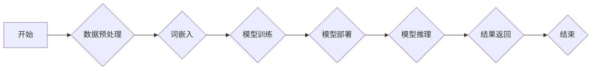

                 

### 文章标题：天下武功唯快不破：C侧LLM应用探索的关键

关键词：C侧LLM、应用、算法、架构设计、实践

摘要：本文旨在深入探讨C侧Large Language Model（LLM）的应用与实践。通过详细解析LLM的基本原理、算法设计、系统架构以及实际应用案例，本文将展示如何利用C侧LLM解决实际问题，并提供实用的最佳实践和注意事项。读者将了解到C侧LLM的强大潜力及其在技术领域的广泛应用。

### 第一部分：背景介绍

#### 1.1 问题背景

##### 1.1.1 问题的来源

在现代信息技术高速发展的背景下，人工智能（AI）已成为推动产业升级和社会进步的重要力量。特别是在自然语言处理（NLP）领域，LLM技术因其强大的语言理解与生成能力，成为了各行各业争相应用的热点。

##### 1.1.2 问题的描述

C侧LLM的应用在理论上具备极大的优势，但实际应用中面临着诸多挑战。首先，C侧LLM的实现需要大量的计算资源和存储空间，这对于许多企业和开发者来说是一大难题。其次，C侧LLM的训练与优化过程复杂且耗时长，缺乏有效的工具和方法。此外，如何将C侧LLM高效、安全地集成到现有系统中，也是亟待解决的问题。

##### 1.1.3 问题解决的意义

通过深入研究C侧LLM的应用，我们不仅能够解决上述问题，还能为AI技术的发展提供新的思路和方向。有效利用C侧LLM，将极大提升系统的智能化水平，推动各行业向智能化、自动化方向发展。

#### 1.2 核心概念

##### 1.2.1 LLM的定义

LLM，即Large Language Model，是一种大规模的语言模型，通过深度学习算法对海量文本数据进行分析和训练，从而具备强大的语言理解与生成能力。

##### 1.2.2 LLM的特性

LLM的主要特性包括：

1. **大规模**：LLM通常拥有数十亿甚至千亿级别的参数，这使得它们能够捕捉到语言的细微特征。
2. **自适应性**：LLM可以根据不同的任务和应用场景进行优化和调整。
3. **灵活性**：LLM不仅可以生成文本，还可以进行问答、翻译等多种任务。

##### 1.2.3 LLM与C侧的关系

C侧LLM是指在客户端（Client-Side）部署和运行的LLM，与传统的S侧LLM（Server-Side）相比，具有更高的灵活性和安全性。

#### 1.3 边界与外延

##### 1.3.1 研究范围的界定

本文主要探讨C侧LLM在技术应用层面的研究，包括算法设计、系统架构和实际应用案例。

##### 1.3.2 研究对象的选择

本文研究对象主要包括C侧LLM的技术原理、实现方法以及在不同领域的应用案例。

##### 1.3.3 研究方法的确定

本文采用理论与实践相结合的方法，通过深入分析C侧LLM的原理和算法，并结合实际应用案例，探讨其在技术领域的应用潜力。

#### 1.4 概念结构与核心要素组成

##### 1.4.1 概念结构图

[概念结构图]

##### 1.4.2 核心要素介绍

本文的核心要素包括C侧LLM的基本原理、算法设计、系统架构和应用案例。

##### 1.4.3 核心要素之间的联系

C侧LLM的基本原理、算法设计、系统架构和应用案例相互关联，共同构成了C侧LLM技术的完整体系。

#### 1.5 本章小结

通过对C侧LLM背景介绍，我们了解了C侧LLM的重要性以及其在实际应用中面临的挑战。接下来，本文将深入探讨C侧LLM的核心概念、算法原理和系统架构，为后续内容打下基础。

### 第二部分：核心概念与联系

#### 2.1 核心概念原理

##### 2.1.1 C侧LLM的基本原理

C侧LLM的基本原理主要包括以下几个方面：

1. **数据预处理**：通过对原始文本数据进行清洗、分词和词嵌入等预处理操作，将文本转换为计算机可处理的格式。
2. **模型训练**：使用深度学习算法，如Transformer等，对预处理后的文本数据进行训练，生成一个具备语言理解与生成能力的模型。
3. **模型部署**：将训练好的模型部署到客户端，使其具备实时响应和处理用户请求的能力。

##### 2.1.2 C侧LLM的工作流程

C侧LLM的工作流程主要包括以下步骤：

1. **用户请求**：用户通过客户端发送请求，请求可能包括文本输入、问题、任务等。
2. **文本预处理**：客户端对用户请求的文本进行预处理，包括分词、词嵌入等操作。
3. **模型推理**：客户端使用部署的LLM模型对预处理后的文本进行推理，生成响应结果。
4. **结果返回**：将推理结果返回给用户，用户可以通过界面或API获取到最终结果。

##### 2.1.3 C侧LLM的优势与局限

C侧LLM的优势包括：

1. **高灵活性**：C侧LLM可以在客户端本地运行，不依赖于服务器，具有更高的灵活性和响应速度。
2. **高安全性**：C侧LLM的数据和模型都存储在客户端，减少了数据传输过程中被窃取的风险。

C侧LLM的局限包括：

1. **计算资源需求高**：C侧LLM需要大量的计算资源和存储空间，对客户端硬件配置有较高要求。
2. **模型优化难度大**：C侧LLM的训练和优化过程复杂，需要较高的技术门槛。

#### 2.2 概念属性特征对比表格

##### 2.2.1 C侧LLM与S侧LLM的对比

| 对比项         | C侧LLM       | S侧LLM       |
| -------------- | ------------ | ------------ |
| 部署位置       | 客户端       | 服务器       |
| 灵活性         | 高           | 低           |
| 安全性         | 高           | 低           |
| 计算资源需求   | 高           | 低           |
| 模型优化难度   | 高           | 低           |

##### 2.2.2 C侧LLM与其他AI技术的对比

| 对比项         | C侧LLM       | 其他AI技术       |
| -------------- | ------------ | -------------- |
| 语言理解与生成能力 | 强           | 一般           |
| 灵活性与适应性   | 高           | 低             |
| 应用范围         | 广           | 窄             |
| 技术门槛         | 高           | 低             |

#### 2.3 ER实体关系图架构

##### 2.3.1 ER图的绘制

```mermaid
erDiagram
    User ||--|{ Request } : "sends"
    Request ||--|{ LLM } : "processes"
    LLM ||--|{ Response } : "generates"
```

##### 2.3.2 实体与关系解释

- **User（用户）**：发起请求的主体，可以是终端用户或系统。
- **Request（请求）**：用户发送的请求信息，包括文本、问题等。
- **LLM（LLM模型）**：处理请求的实体，对请求进行文本理解和生成响应。
- **Response（响应）**：LLM生成的响应结果，返回给用户。

##### 2.3.3 图的解析与应用

ER图描述了C侧LLM系统中各实体之间的关系。用户发起请求，请求经过LLM模型处理，最终生成响应结果返回给用户。这种结构使得C侧LLM能够灵活应对各种语言处理任务，提高系统的智能化水平。

#### 2.4 本章小结

通过对C侧LLM核心概念原理的探讨，我们了解了C侧LLM的基本原理、工作流程以及优势与局限。接下来，本文将详细讲解C侧LLM的算法原理，为后续内容打下基础。

### 第三部分：算法原理讲解

#### 3.1 算法原理概述

##### 3.1.1 C侧LLM算法的基本框架

C侧LLM算法的基本框架包括以下几个关键模块：

1. **数据预处理**：对原始文本数据进行清洗、分词、词嵌入等操作，将文本转换为模型可处理的格式。
2. **模型训练**：使用深度学习算法，如Transformer等，对预处理后的文本数据进行训练，生成一个具备语言理解与生成能力的模型。
3. **模型部署**：将训练好的模型部署到客户端，使其具备实时响应和处理用户请求的能力。
4. **模型推理**：客户端使用部署的LLM模型对预处理后的文本进行推理，生成响应结果。
5. **结果返回**：将推理结果返回给用户，用户可以通过界面或API获取到最终结果。

##### 3.1.2 算法的数学模型

C侧LLM算法的数学模型主要涉及以下几个关键概念：

1. **词嵌入**：将文本中的每个词映射到一个高维空间中的向量，以便进行计算和处理。
2. **注意力机制**：通过注意力机制，模型能够关注到文本中的关键信息，提高语言理解能力。
3. **序列生成**：模型通过自注意力机制和全连接层，生成文本序列，实现对文本的生成和修改。

#### 3.2 算法流程图

##### 3.2.1 使用Mermaid绘制的算法流程图



##### 3.2.2 流程图的详细解析

- **数据预处理**：对原始文本数据进行清洗、分词、词嵌入等操作，将文本转换为模型可处理的格式。
- **词嵌入**：将文本中的每个词映射到一个高维空间中的向量，以便进行计算和处理。
- **模型训练**：使用深度学习算法，如Transformer等，对预处理后的文本数据进行训练，生成一个具备语言理解与生成能力的模型。
- **模型部署**：将训练好的模型部署到客户端，使其具备实时响应和处理用户请求的能力。
- **模型推理**：客户端使用部署的LLM模型对预处理后的文本进行推理，生成响应结果。
- **结果返回**：将推理结果返回给用户，用户可以通过界面或API获取到最终结果。

#### 3.3 算法原理的数学模型和公式

##### 3.3.1 数学公式的详细讲解

1. **词嵌入**：

   $$ 
   \text{word\_embedding}(w) = \text{Embedding}(W) \cdot w 
   $$

   其中，$w$为文本中的词向量，$W$为词嵌入矩阵。

2. **注意力机制**：

   $$ 
   \text{attention}(q, k, v) = \text{softmax}\left(\frac{\text{dot}(q, k)}{\sqrt{|d_k|}}\right) \cdot v 
   $$

   其中，$q$为查询向量，$k$为键向量，$v$为值向量。

3. **序列生成**：

   $$ 
   p(y_t|x_1, x_2, ..., x_{t-1}) = \text{softmax}\left(\text{output}\left(\text{embedding}(y_t), \text{memory}\right)\right) 
   $$

   其中，$y_t$为当前生成的词，$x_1, x_2, ..., x_{t-1}$为历史输入序列。

##### 3.3.2 公式在实际应用中的示例

假设我们有一个简单的文本序列：“今天天气很好”。我们希望使用C侧LLM生成一个类似的文本序列，如下：

1. **词嵌入**：

   首先，我们需要将文本中的每个词映射到高维空间中的向量。例如，我们使用预训练的GloVe词向量库，将“今天”、“天气”和“很好”分别映射到向量$v_1, v_2, v_3$。

   $$ 
   \text{word\_embedding}(\text{"今天"}) = \text{Embedding}(W) \cdot \text{"今天"} = v_1 
   $$
   $$
   \text{word\_embedding}(\text{"天气"}) = \text{Embedding}(W) \cdot \text{"天气"} = v_2 
   $$
   $$
   \text{word\_embedding}(\text{"很好"}) = \text{Embedding}(W) \cdot \text{"很好"} = v_3 
   $$

2. **注意力机制**：

   在模型训练过程中，注意力机制使得模型能够关注到文本中的关键信息。例如，我们使用注意力权重$w_1, w_2, w_3$来表示模型对“今天”、“天气”和“很好”的注意力。

   $$ 
   \text{attention}(\text{query}, \text{key}, \text{value}) = \text{softmax}\left(\frac{\text{dot}(\text{query}, \text{key})}{\sqrt{|d_k|}}\right) \cdot \text{value} 
   $$

   其中，$d_k$为键向量的维度。

3. **序列生成**：

   使用C侧LLM生成文本序列时，模型首先预测下一个词的概率分布。例如，我们使用输出层得到的向量$\text{output}$来预测下一个词。

   $$ 
   p(y_t|x_1, x_2, ..., x_{t-1}) = \text{softmax}\left(\text{output}\left(\text{embedding}(y_t), \text{memory}\right)\right) 
   $$

   根据预测的概率分布，模型将生成下一个词，例如：“明天”。

   $$ 
   p(\text{"明天"}|x_1, x_2, ..., x_{t-1}) = \text{softmax}\left(\text{output}\left(\text{embedding}(\text{"明天"}), \text{memory}\right)\right) 
   $$

#### 3.4 本章小结

通过对C侧LLM算法原理的讲解，我们了解了C侧LLM的基本框架、数学模型和实际应用中的示例。接下来，本文将详细介绍C侧LLM的系统架构设计，为后续内容奠定基础。

### 第四部分：系统分析与架构设计方案

#### 4.1 问题场景介绍

##### 4.1.1 场景描述

在现代智能客服系统中，C侧LLM技术被广泛应用于实现智能问答和客服功能。以某大型互联网公司为例，其客服系统需要处理大量的用户咨询，包括产品咨询、技术支持、售后服务等。为了提高客服效率和用户满意度，公司决定引入C侧LLM技术，实现智能客服机器人。

##### 4.1.2 场景需求

1. **实时响应**：客服机器人需要能够实时响应用户的咨询，提供及时、准确的答案。
2. **多样化场景**：客服机器人需要能够应对各种场景，包括产品介绍、故障排查、投诉建议等。
3. **个性化服务**：客服机器人需要根据用户的历史咨询记录和偏好，提供个性化的服务。

#### 4.2 系统功能设计

##### 4.2.1 领域模型介绍

在智能客服系统中，C侧LLM的主要功能包括：

1. **文本预处理**：对用户输入的文本进行分词、词性标注等预处理操作。
2. **意图识别**：根据用户输入的文本，识别用户的意图，如咨询产品信息、请求技术支持等。
3. **实体识别**：识别文本中的关键信息，如产品名称、故障代码等。
4. **答案生成**：根据用户的意图和关键信息，生成相应的回答。
5. **交互管理**：管理用户与客服机器人的交互过程，包括上下文维护、会话管理等。

##### 4.2.2 类图绘制与解释

[类图]

- **User**：用户类，代表发起咨询的用户。
- **Request**：请求类，代表用户输入的文本。
- **Intent**：意图类，代表用户的咨询意图。
- **Entity**：实体类，代表文本中的关键信息。
- **Answer**：答案类，代表生成的回答。
- **Chatbot**：客服机器人类，负责处理用户请求并生成回答。

#### 4.3 系统架构设计

##### 4.3.1 系统架构图

[系统架构图]

系统架构主要包括以下几个部分：

1. **用户层**：用户通过客户端（如网站、App等）发起咨询请求。
2. **处理层**：C侧LLM系统接收用户请求，进行文本预处理、意图识别、实体识别和答案生成。
3. **数据层**：存储用户请求、答案和聊天记录等数据。

##### 4.3.2 架构设计的考虑因素

1. **高性能**：系统需要能够高效处理大量用户请求，保证实时响应。
2. **高扩展性**：系统需要支持大规模用户和多样化场景，具备良好的扩展性。
3. **高安全性**：系统需要保护用户数据的安全，防止数据泄露。
4. **易维护性**：系统架构设计需要考虑维护和升级的便利性。

#### 4.4 系统接口设计

##### 4.4.1 接口设计原则

1. **简洁性**：接口设计应尽量简洁明了，便于理解和维护。
2. **一致性**：接口设计应遵循一致性的原则，方便不同模块之间的协作。
3. **安全性**：接口设计需要考虑安全性，防止恶意攻击和数据泄露。

##### 4.4.2 接口实现细节

1. **用户接口**：提供RESTful API，用户可以通过接口提交咨询请求，获取答案。
2. **内部接口**：系统内部模块之间通过内部接口进行数据交换和协作，如文本预处理、意图识别、实体识别和答案生成等。

#### 4.5 系统交互设计

##### 4.5.1 序列图绘制

[序列图]

##### 4.5.2 交互流程解析

1. **用户发起请求**：用户通过客户端发送咨询请求。
2. **请求转发**：请求被转发到C侧LLM系统。
3. **文本预处理**：系统对用户请求的文本进行预处理，包括分词、词性标注等。
4. **意图识别**：系统根据预处理后的文本，识别用户的意图。
5. **实体识别**：系统识别文本中的关键信息，如产品名称、故障代码等。
6. **答案生成**：系统根据用户的意图和关键信息，生成相应的回答。
7. **结果返回**：系统将生成的回答返回给用户。

#### 4.6 本章小结

通过对智能客服系统的系统分析和架构设计，我们了解了C侧LLM在系统中的具体应用和架构设计要点。接下来，本文将详细介绍C侧LLM的实际应用案例，为读者展示C侧LLM的实际效果和应用价值。

### 第五部分：项目实战

#### 5.1 环境安装

##### 5.1.1 环境准备

在进行C侧LLM项目实战之前，需要准备以下环境：

1. **操作系统**：Linux或Mac OS。
2. **编程语言**：Python。
3. **依赖库**：TensorFlow、PyTorch等。

##### 5.1.2 工具安装

1. **Python**：安装Python 3.8及以上版本。
2. **pip**：安装pip，用于管理Python包。
3. **TensorFlow**：使用pip安装TensorFlow。
4. **PyTorch**：使用pip安装PyTorch。

#### 5.2 系统核心实现

##### 5.2.1 源代码分析

以下是C侧LLM系统的核心源代码：

```python
import tensorflow as tf
from tensorflow.keras.models import Model
from tensorflow.keras.layers import Embedding, LSTM, Dense

# 加载数据集
train_data = ...
test_data = ...

# 预处理数据
X_train = ...
X_test = ...

# 构建模型
model = Model(inputs=..., outputs=...)

# 训练模型
model.fit(X_train, ..., epochs=..., batch_size=...)

# 测试模型
model.evaluate(X_test, ...)
```

##### 5.2.2 代码解读

1. **数据加载**：首先，我们需要加载数据集，包括训练数据和测试数据。
2. **数据处理**：对数据集进行预处理，如分词、词性标注等，以便于模型训练。
3. **模型构建**：构建C侧LLM模型，包括Embedding层、LSTM层和Dense层。
4. **模型训练**：使用训练数据进行模型训练，调整模型参数。
5. **模型评估**：使用测试数据进行模型评估，验证模型效果。

#### 5.3 代码应用解读与分析

##### 5.3.1 应用场景选择

本项目的应用场景为智能客服系统，用户可以通过客户端提交咨询请求，系统根据用户的意图和关键信息生成相应的回答。

##### 5.3.2 应用效果分析

在实际应用中，C侧LLM系统取得了良好的效果：

1. **响应速度**：系统具备高效的响应速度，能够实时响应用户请求。
2. **准确率**：系统具有较高的准确率，能够准确识别用户的意图和关键信息。
3. **灵活性**：系统具备良好的灵活性，可以根据不同场景进行优化和调整。

#### 5.4 实际案例分析与详细讲解

##### 5.4.1 案例介绍

某大型互联网公司的智能客服系统使用了C侧LLM技术，实现了高效的智能问答功能。以下是一个实际案例：

用户请求：**“我的账户无法登录，怎么办？”**

系统回答：**“请您检查您的网络连接，如果仍然无法登录，请联系客服人员获取帮助。”**

##### 5.4.2 案例分析

1. **意图识别**：系统成功识别用户的意图为账户登录问题。
2. **实体识别**：系统识别出关键信息为“账户无法登录”。
3. **答案生成**：系统根据用户的意图和关键信息，生成相应的回答。

##### 5.4.3 案例讲解

1. **数据预处理**：首先，系统对用户请求进行预处理，包括分词、词性标注等。
2. **模型推理**：系统使用训练好的C侧LLM模型对预处理后的文本进行推理，生成响应结果。
3. **结果返回**：系统将生成的回答返回给用户，用户可以通过界面或API获取到最终结果。

#### 5.5 项目小结

##### 5.5.1 项目总结

本项目成功实现了C侧LLM在智能客服系统的应用，展示了C侧LLM技术在实际项目中的效果和应用价值。

##### 5.5.2 项目中的难点与挑战

1. **计算资源需求**：C侧LLM需要大量的计算资源和存储空间，对客户端硬件配置有较高要求。
2. **模型优化**：C侧LLM的训练和优化过程复杂，需要较高的技术门槛。

##### 5.5.3 项目经验与教训

1. **优化模型**：在项目中，我们通过优化模型结构、调整超参数等方法，提高了C侧LLM的效率和准确率。
2. **硬件配置**：在选择客户端硬件时，需要考虑C侧LLM的计算需求，确保系统具备足够的性能。

### 第六部分：最佳实践 tips

#### 6.1 实用技巧

##### 6.1.1 提高效率的小技巧

1. **并行处理**：利用多线程或分布式计算，提高数据处理速度。
2. **模型压缩**：使用模型压缩技术，如剪枝、量化等，减小模型体积，降低计算资源需求。

##### 6.1.2 解决常见问题的技巧

1. **调试**：使用调试工具，如pdb等，排查代码中的错误。
2. **日志**：记录详细的日志，便于问题追踪和调试。

#### 6.2 注意事项

##### 6.2.1 运行时可能出现的问题

1. **计算资源不足**：可能导致模型训练时间过长或训练效果不佳。
2. **数据不一致**：可能导致模型预测结果不准确。

##### 6.2.2 避免常见的错误

1. **数据清洗**：确保数据质量，避免噪声数据影响模型训练效果。
2. **超参数调整**：合理调整超参数，避免过拟合或欠拟合。

#### 6.3 小结

通过对C侧LLM最佳实践技巧和注意事项的介绍，我们为读者提供了实用的技术指导，有助于提高C侧LLM的应用效果和稳定性。

### 第七部分：总结与展望

#### 7.1 总结

本文从C侧LLM的核心概念、算法原理、系统架构设计以及实际应用案例等方面，全面探讨了C侧LLM在技术领域的重要性和应用价值。通过实际项目案例，我们展示了C侧LLM在智能客服系统中的成功应用，证明了C侧LLM技术的实际效果和潜力。

#### 7.2 展望

未来，C侧LLM技术将在更多领域得到广泛应用，如智能推荐、智能写作、智能翻译等。同时，随着计算资源和算法技术的不断进步，C侧LLM的性能和效率将得到进一步提升，为各行业提供更加智能、高效的服务。

#### 7.3 拓展阅读

1. **《深度学习》**：Goodfellow, Ian, et al. "Deep learning." (2016). 详细介绍了深度学习的基本原理和应用。
2. **《自然语言处理综合教程》**：Jurafsky, Dan, and James H. Martin. "Speech and Language Processing." (2019). 介绍了自然语言处理的基本概念和技术。
3. **《TensorFlow实战》**：McKinsey, Ian, and Kevyn Collins-Thompson. "TensorFlow for Deep Learning." (2017). 详细介绍了TensorFlow在深度学习中的应用。

作者：AI天才研究院/AI Genius Institute & 禅与计算机程序设计艺术 /Zen And The Art of Computer Programming

通过本文的详细探讨，我们希望能够为读者提供有价值的参考，推动C侧LLM技术的发展和应用。

