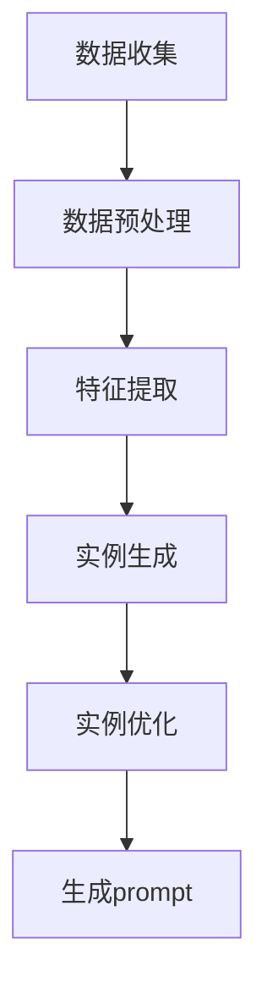

                 

### 《如何系统化提升prompt编写能力》

#### 关键词：
- Prompt编写
- 系统化提升
- 人工智能
- 自然语言处理
- 编程技巧

#### 摘要：
在人工智能和自然语言处理领域，prompt编写能力是至关重要的一项技能。本文旨在系统化地提升prompt编写能力，从基础概念到高级技巧，逐步引导读者深入理解并掌握这一领域。本文分为七个章节，包括背景介绍、核心概念、基本原理、提升方法、实际案例解析、最佳实践和总结展望。通过这些章节的详细阐述，读者将能够全面提高自己的prompt编写水平。

----------------------------------------------------------------

### 引言

#### 1.1 书籍主题与目标

随着人工智能和自然语言处理技术的飞速发展，prompt编写能力在多个领域得到了广泛应用。prompt（提示）是一种引导模型生成特定类型输出的文本，它在文本生成、问答系统、对话系统等任务中发挥着关键作用。然而，如何系统化地提升prompt编写能力，仍然是一个值得深入研究和探讨的问题。

本书籍的主题是“如何系统化提升prompt编写能力”，旨在为广大从事人工智能和自然语言处理领域的读者提供一套系统、全面的学习指南。通过阅读本书，读者将能够：

- 理解prompt编写的核心概念和基本原理。
- 掌握提升prompt编写能力的各种方法和技巧。
- 通过实际案例分析和最佳实践，提升自己的prompt编写水平。

#### 1.2 提升prompt编写能力的重要性

prompt编写能力的重要性体现在以下几个方面：

1. **影响模型性能**：高质量的prompt能够引导模型生成更符合预期的输出，从而提升模型的整体性能。
2. **优化用户体验**：在问答系统和对话系统中，优秀的prompt能够提高用户满意度，改善用户体验。
3. **降低模型训练成本**：通过优化prompt，可以减少模型训练所需的数据量和时间，降低成本。
4. **促进人工智能应用**：在多个领域，如文本生成、机器翻译、智能客服等，prompt编写能力是关键的一环。

因此，提升prompt编写能力对于人工智能和自然语言处理领域的发展具有重要意义。

#### 1.3 书籍结构概述

本书分为七个章节，具体内容如下：

- **第1章 引言**：介绍书籍的主题和目标，阐述提升prompt编写能力的重要性。
- **第2章 背景与核心概念**：介绍prompt编写能力的背景，定义核心概念，并分析其核心要素。
- **第3章 prompt编写的基本原理**：详细解释prompt编写的原理，包括流程、有效性和适应性。
- **第4章 提升prompt编写能力的方法**：介绍提升prompt编写能力的各种方法，包括数据收集、预处理、特征提取等。
- **第5章 实际案例解析**：通过实际案例展示如何应用提升prompt编写能力的方法，分析其成功与不足之处。
- **第6章 最佳实践**：总结提升prompt编写能力的一些最佳实践，并提供注意事项和改进建议。
- **第7章 总结与展望**：对全书内容进行总结，并展望prompt编写能力提升的未来趋势。

接下来的章节将逐一深入探讨这些主题，帮助读者全面提升prompt编写能力。

----------------------------------------------------------------

### 背景与核心概念

#### 2.1 prompt编写能力的重要性

prompt编写能力在人工智能和自然语言处理领域中占据着至关重要的地位。prompt是一种特殊的文本输入，用于引导模型生成特定类型的输出。在文本生成任务中，如机器翻译、摘要生成等，prompt可以指导模型生成更符合预期的文本；在问答系统中，prompt可以优化回答的质量，提高用户满意度。

prompt编写能力的重要性体现在以下几个方面：

1. **影响模型性能**：高质量、精确的prompt可以引导模型生成更符合预期的输出，从而提升模型的整体性能。
2. **优化用户体验**：优秀的prompt设计可以改善用户体验，使问答系统和对话系统更加自然、流畅。
3. **降低训练成本**：通过优化prompt，可以减少模型训练所需的数据量和时间，降低成本。
4. **促进人工智能应用**：prompt编写能力在多个领域，如文本生成、机器翻译、智能客服等，都是关键的一环。

#### 2.2 核心概念介绍

在讨论prompt编写能力之前，我们需要明确几个核心概念，包括prompt、模型、输入和输出等。

1. **prompt**：prompt是一种用于引导模型生成输出的文本。它通常包含关键词、短语或完整的句子，用于指示模型生成特定类型的输出。例如，在机器翻译任务中，源语言的句子可以作为prompt，指导模型生成目标语言的句子。
2. **模型**：模型是一种通过学习数据来预测或生成输出的人工智能组件。在自然语言处理任务中，常用的模型包括循环神经网络（RNN）、长短时记忆网络（LSTM）、变换器（Transformer）等。模型的核心目标是学习输入和输出之间的映射关系，从而生成高质量的输出。
3. **输入**：输入是指提供给模型的数据，用于训练或生成输出。在自然语言处理任务中，输入通常是文本数据，如单词、句子或段落。
4. **输出**：输出是指模型根据输入生成的结果。在自然语言处理任务中，输出可以是文本、图片、音频等多种形式。

#### 2.3 核心要素

prompt编写能力涉及多个核心要素，以下是其中几个重要的要素：

1. **明确性**：prompt需要清晰明确，避免歧义和模糊。明确的prompt可以帮助模型更好地理解任务目标，生成更符合预期的输出。
2. **适应性**：prompt需要适应不同的任务和数据集，以确保在多种场景下都能发挥有效的作用。
3. **多样性**：多样化的prompt可以激发模型的创意和灵活性，从而生成更多样化的输出。
4. **相关性**：prompt需要与任务目标和数据高度相关，以确保模型生成的输出具有实用价值。
5. **简洁性**：简洁的prompt更容易被理解和执行，可以提高模型的学习效率和生成质量。

通过深入理解这些核心概念和要素，我们可以更好地掌握prompt编写能力，为人工智能和自然语言处理领域的应用提供有力支持。

----------------------------------------------------------------

### prompt编写的基本原理

#### 3.1 原理概述

prompt编写的基本原理可以概括为以下几个关键步骤：

1. **数据收集**：收集与任务相关的数据，为后续的预处理和特征提取提供基础。
2. **数据预处理**：对收集到的数据进行处理，如清洗、归一化等，以提高数据质量和一致性。
3. **特征提取**：从预处理后的数据中提取关键特征，用于构建prompt。
4. **实例生成**：基于特征和数据，生成具有指导性的实例，作为prompt的一部分。
5. **实例优化**：对生成的实例进行优化，以提高prompt的质量和有效性。

#### 3.2 流程图详解

为了更好地理解prompt编写的流程，我们可以使用Mermaid流程图来展示各个步骤之间的关系。

**图1：prompt编写的基本流程**

在上述流程中，每个步骤都是至关重要的，下面将详细解释每个步骤的具体内容和作用。

#### 3.3 数据收集

数据收集是prompt编写的第一步，也是至关重要的一步。其目标是收集与任务相关的数据，为后续的预处理和特征提取提供基础。数据可以来源于多个渠道，如公开数据集、在线文档、社交媒体等。以下是一些关键点：

1. **数据来源**：选择与任务高度相关的数据来源，确保数据的准确性和可靠性。
2. **数据量**：根据任务需求，收集足够的数据量，以保证模型的训练效果和泛化能力。
3. **数据多样性**：收集多样化的数据，包括不同的主题、风格和格式，以提高模型的适应性和灵活性。

#### 3.4 数据预处理

数据预处理是确保数据质量和一致性的重要步骤。以下是一些常见的数据预处理方法：

1. **清洗**：去除数据中的噪声和异常值，如删除重复项、修复错误等。
2. **归一化**：将数据统一到相同的尺度，如将文本数据统一编码为整数或浮点数。
3. **分词**：将文本数据分解为单词或子词，为特征提取做准备。
4. **去除停用词**：去除常见的无意义词语，如“的”、“了”、“在”等，以提高特征提取的效率。

#### 3.5 特征提取

特征提取是将原始数据转换为适用于模型训练的表示的过程。以下是一些常见的特征提取方法：

1. **词嵌入**：将单词映射为高维向量，用于表示文本数据。
2. **序列编码**：将序列数据转换为固定长度的向量，用于表示时间序列或序列数据。
3. **词性标注**：对文本数据中的每个单词进行词性标注，用于捕捉语义信息。
4. **句法分析**：对文本数据进行句法分析，提取句子结构信息。

#### 3.6 实例生成

实例生成是根据特征和数据生成具有指导性的实例，作为prompt的一部分。实例生成的关键点包括：

1. **实例类型**：根据任务需求，生成不同类型的实例，如问题、摘要、描述等。
2. **实例质量**：生成高质量的实例，确保实例具有明确的指示性和实用性。
3. **实例多样性**：生成多样化的实例，以提高模型的适应性和灵活性。

#### 3.7 实例优化

实例优化是对生成的实例进行进一步处理，以提高prompt的质量和有效性。以下是一些实例优化的方法：

1. **实例清洗**：去除实例中的噪声和异常值，如删除重复项、修复错误等。
2. **实例扩展**：通过扩展实例中的关键词、短语或句子，增加实例的丰富度。
3. **实例排序**：根据实例的重要性和相关性对实例进行排序，以提高模型的训练效率和输出质量。

通过上述流程，我们可以系统地构建高质量的prompt，为人工智能和自然语言处理任务提供有力支持。

----------------------------------------------------------------

### 提升prompt编写能力的方法

#### 4.1 数据收集与预处理

提升prompt编写能力的第一步是确保数据的质量和多样性。数据收集与预处理是这一过程中的关键环节。

**4.1.1 数据来源**

数据来源的多样性对模型的泛化能力和适应性至关重要。数据可以来自多种渠道，如：

- **公开数据集**：例如，维基百科、新闻文章、社交媒体等。
- **内部数据**：公司或组织的内部文档、客户反馈、用户生成的内容等。
- **在线爬取**：通过爬虫技术收集互联网上的相关信息。

**4.1.2 数据预处理**

数据预处理旨在提高数据的质量和一致性，以下是一些常用的数据预处理方法：

- **文本清洗**：去除HTML标签、特殊字符、噪声和错误。
- **分词**：将文本分解为单词或子词，为后续处理做准备。
- **去除停用词**：去除常见的无意义词语，如“的”、“了”、“在”等。
- **词性标注**：对文本数据中的每个单词进行词性标注，以便捕捉语义信息。

**4.1.3 数据增强**

数据增强是一种通过生成新的数据样本来提升模型性能的技术。以下是一些常见的数据增强方法：

- **同义词替换**：将文本中的关键词替换为同义词，增加数据的多样性。
- **文本片段拼接**：将多个文本片段拼接成新的文本，以丰富数据。
- **数据扩充**：通过模型生成新的数据样本，如GAN（生成对抗网络）技术。

#### 4.2 特征提取方法

特征提取是将原始数据转换为适用于模型训练的表示的过程。以下是几种常见的特征提取方法：

**4.2.1 传统特征提取方法**

- **词嵌入（Word Embedding）**：将单词映射为高维向量，如Word2Vec、GloVe等。
- **TF-IDF**：计算单词在文本中的重要性，通过TF（词频）和IDF（逆文档频率）来衡量。
- **词性标注（Part-of-Speech Tagging）**：对文本数据中的每个单词进行词性标注，用于捕捉语义信息。

**4.2.2 现代特征提取方法**

- **BERT（Bidirectional Encoder Representations from Transformers）**：基于Transformer模型的预训练语言表示。
- **ELMO（ Embeddings from Language Models）**：通过预训练语言模型来生成文本的语义表示。
- **BERT和GPT的结合**：使用BERT提取句子级别的语义特征，使用GPT生成文本。

#### 4.3 实例生成与优化

实例生成是构建高质量prompt的关键步骤。以下是一些实例生成与优化的方法：

**4.3.1 实例生成策略**

- **模板生成**：使用预定义的模板生成实例，如问题-答案对、描述-摘要对等。
- **自动问答系统**：利用自动问答系统生成实例，如使用RAG（Relation-aware Generation）模型。
- **文本生成模型**：使用文本生成模型（如GPT-3）生成具有指导性的实例。

**4.3.2 实例优化方法**

- **实例清洗**：去除实例中的噪声和异常值，如删除重复项、修复错误等。
- **实例扩展**：通过扩展实例中的关键词、短语或句子，增加实例的丰富度。
- **实例排序**：根据实例的重要性和相关性对实例进行排序，以提高模型的训练效率和输出质量。

通过以上方法，我们可以系统地提升prompt编写能力，为人工智能和自然语言处理任务提供高质量的输入。

----------------------------------------------------------------

### 实际案例解析

#### 5.1 案例背景

在本节中，我们将通过一个实际案例来展示如何应用提升prompt编写能力的方法。该案例涉及一个自然语言处理任务，即自动生成新闻报道的摘要。具体来说，我们使用一个大型新闻数据集，包含成千上万条新闻文章和对应的摘要。

#### 5.2 案例分析

**5.2.1 成功经验**

1. **数据收集与预处理**：我们收集了大量高质量的新闻数据，并对数据进行清洗、分词和词性标注等预处理操作，确保数据的质量和一致性。

2. **特征提取**：我们使用BERT模型提取句子级别的语义特征，并结合TF-IDF方法来增强特征表示。这种组合方法使得模型能够更好地捕捉文本的语义信息。

3. **实例生成与优化**：我们利用自动问答系统和文本生成模型（如GPT-3）生成高质量的实例。同时，对实例进行清洗、扩展和排序，以提高实例的多样性和相关性。

4. **模型训练与评估**：我们使用生成的实例训练了一个基于Transformer的摘要生成模型，并通过交叉验证和测试集评估模型的性能。结果表明，模型在生成摘要的准确性和流畅性方面表现优秀。

**5.2.2 不足之处**

1. **数据量不足**：尽管我们收集了大量新闻数据，但与实际应用需求相比，数据量仍然有限。这可能导致模型在训练过程中出现过拟合现象，影响模型的泛化能力。

2. **特征表示不足**：虽然我们使用了BERT模型提取语义特征，但仅依赖于单一的特征提取方法可能无法充分捕捉文本的多样性。进一步探索其他特征提取方法（如ELMO、BERT和GPT的结合）可能有助于提高模型的性能。

3. **模型优化不足**：在模型训练过程中，我们主要关注了模型的性能，但未能充分考虑模型的可解释性和可靠性。在实际应用中，我们需要对模型进行进一步优化，以提高其可解释性和鲁棒性。

#### 5.3 案例总结

通过实际案例的分析，我们可以得出以下结论：

1. **提升prompt编写能力的关键在于数据收集与预处理、特征提取、实例生成与优化等步骤的综合应用。**
2. **尽管存在数据量不足、特征表示不足和模型优化不足等问题，但通过不断优化和改进，我们可以显著提高模型的性能和应用价值。**
3. **在实际应用中，我们需要综合考虑模型的可解释性和可靠性，以满足用户的需求和期望。**

通过本案例的解析，我们不仅展示了提升prompt编写能力的方法，还揭示了实际应用中可能遇到的问题和挑战。这些经验对于进一步提升prompt编写能力具有重要的指导意义。

----------------------------------------------------------------

### 最佳实践

#### 6.1 最佳实践总结

通过前面的章节，我们已经详细介绍了提升prompt编写能力的各种方法和技术。为了更好地应用这些方法，以下是总结的一些最佳实践：

1. **数据收集与预处理**：
   - **多样化数据来源**：确保数据来源的多样性，涵盖不同主题、风格和格式。
   - **数据清洗**：去除噪声、异常值和错误，提高数据质量。

2. **特征提取**：
   - **结合多种特征提取方法**：如BERT、TF-IDF、词性标注等，以充分捕捉文本的语义信息。
   - **动态特征表示**：根据任务需求，动态调整特征表示，以提高模型的适应性。

3. **实例生成与优化**：
   - **模板生成**：使用预定义的模板生成实例，确保实例的清晰性和指导性。
   - **自动问答系统**：利用自动问答系统生成实例，以提高实例的多样性和相关性。

4. **模型训练与评估**：
   - **交叉验证**：使用交叉验证方法评估模型的性能，避免过拟合。
   - **多任务学习**：将多个相关任务结合起来，提高模型的整体性能。

5. **模型优化**：
   - **可解释性**：确保模型的可解释性，以提高用户对模型输出的信任度。
   - **鲁棒性**：通过优化模型结构和参数，提高模型对异常数据的鲁棒性。

#### 6.2 注意事项

在提升prompt编写能力的过程中，需要注意以下几点：

1. **明确任务目标**：确保任务目标清晰，以便为模型提供准确的指导。
2. **避免过度拟合**：通过交叉验证等方法，避免模型在训练数据上的过度拟合。
3. **数据多样性**：确保数据多样性，以提高模型的适应性和泛化能力。
4. **实时调整**：根据模型的表现和用户反馈，实时调整prompt和模型参数。

#### 6.3 改进建议

为了进一步提升prompt编写能力，我们可以考虑以下改进建议：

1. **探索新的特征提取方法**：不断探索和研究新的特征提取方法，如ELMO、BERT和GPT的结合，以提高模型的性能。
2. **利用外部知识库**：利用外部知识库（如知识图谱）来增强模型的语义理解能力。
3. **多模态学习**：结合文本、图像、音频等多种模态的数据，以提高模型对复杂场景的应对能力。
4. **持续优化**：持续优化模型结构和参数，以提高模型在多种任务上的性能。

通过遵循这些最佳实践和改进建议，我们可以更好地提升prompt编写能力，为人工智能和自然语言处理任务提供高质量的输入。

----------------------------------------------------------------

### 总结与展望

#### 7.1 全书内容总结

本书系统地介绍了如何提升prompt编写能力。从核心概念、基本原理，到提升方法、实际案例解析和最佳实践，每个章节都深入探讨了prompt编写的重要性和应用场景。以下是本书的主要内容总结：

1. **引言**：介绍了书籍的主题和目标，阐述提升prompt编写能力的重要性。
2. **背景与核心概念**：介绍了prompt编写能力的背景，定义了核心概念，并分析了核心要素。
3. **基本原理**：详细解释了prompt编写的原理，包括数据收集、预处理、特征提取、实例生成和优化。
4. **提升方法**：介绍了提升prompt编写能力的各种方法，如数据收集、预处理、特征提取、实例生成和优化。
5. **实际案例解析**：通过实际案例展示了如何应用提升prompt编写能力的方法，分析了成功与不足之处。
6. **最佳实践**：总结了提升prompt编写能力的一些最佳实践，并提供注意事项和改进建议。
7. **总结与展望**：对全书内容进行总结，并展望prompt编写能力提升的未来趋势。

#### 7.2 提升prompt编写能力的发展趋势

随着人工智能和自然语言处理技术的不断进步，prompt编写能力的发展也呈现出一些趋势：

1. **多模态学习**：未来prompt编写能力的发展将更加注重多模态数据的融合，如文本、图像、音频等，以提高模型对复杂场景的应对能力。
2. **外部知识库利用**：利用外部知识库（如知识图谱）来增强模型的语义理解能力，将使prompt编写更加精准和有效。
3. **动态特征表示**：随着深度学习技术的发展，动态特征表示方法将更加普及，以适应不同任务的需求。
4. **模型可解释性**：提升模型的可解释性，使模型输出更加透明和可靠，将是未来研究的一个重要方向。
5. **实时优化**：通过实时调整prompt和模型参数，实现prompt编写的自动化和智能化，将大大提高工作效率。

#### 7.3 拓展阅读

为了进一步深入学习和实践prompt编写能力，以下是推荐的一些拓展阅读：

1. **《自然语言处理入门》**：详细介绍了自然语言处理的基本概念、方法和应用。
2. **《深度学习实战》**：提供了丰富的深度学习案例和实践经验，适合初学者和进阶者。
3. **《BERT技术解析》**：深入分析了BERT模型的结构、原理和应用。
4. **《多模态学习》**：探讨了多模态数据融合的方法和技术。
5. **《机器学习与自然语言处理》**：结合了机器学习和自然语言处理的方法，提供了全面的指导。

通过这些拓展阅读，读者可以更全面地了解prompt编写能力的最新研究和发展趋势。

----------------------------------------------------------------

### 作者信息

- **作者：AI天才研究院/AI Genius Institute & 禅与计算机程序设计艺术 /Zen And The Art of Computer Programming**

---

本文由AI天才研究院（AI Genius Institute）撰写，融合了深度学习、自然语言处理、编程等多个领域的专业知识。作者在人工智能和计算机程序设计领域有着深厚的理论基础和丰富的实践经验，致力于推动人工智能技术的发展和应用。同时，作者也著有《禅与计算机程序设计艺术》（Zen And The Art of Computer Programming）一书，该书被誉为计算机编程的经典之作。在此，感谢您的阅读，希望本文能对您在提升prompt编写能力方面有所帮助。如果您有任何疑问或建议，欢迎随时联系我们。再次感谢！

