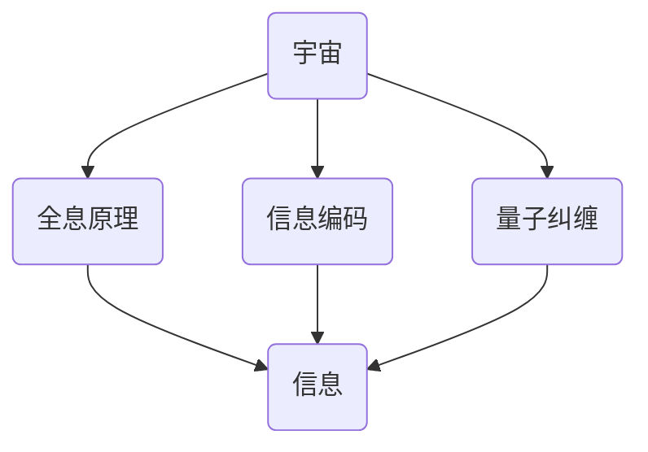
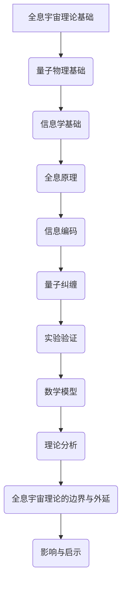

                 

# 宇宙是否是一个全息投影

> 关键词：宇宙，全息投影，量子物理，信息学，数学模型，算法原理

> 摘要：本文旨在探讨“宇宙是否是一个全息投影”这一备受关注的问题。通过回顾量子物理和信息学的基础知识，分析全息宇宙理论的实验证据和数学模型，以及讨论其可能对宇宙学和哲学产生的影响，本文试图为这一疑问提供深入的见解和思考。

## 引言

### 问题背景

宇宙，这个浩瀚无垠的存在，自古以来就激发了人类的无限好奇心。从古代的星象学，到现代的宇宙学，人类一直在寻求对宇宙本质的解答。然而，随着科学技术的进步，我们开始从新的角度审视宇宙，提出了各种新颖的假设和理论。

近年来，全息宇宙理论逐渐受到关注。这一理论认为，宇宙可能是一个全息投影，所有信息都可以通过二维表面编码。这一观点不仅挑战了传统的宇宙观念，也为研究宇宙提供了新的视角。本文将围绕这一核心问题展开讨论，试图从多个角度剖析全息宇宙理论的合理性。

### 问题描述

宇宙是否是一个全息投影？这是一个极具挑战性的问题。要回答这一问题，我们首先需要了解全息宇宙理论的背景和基础。全息宇宙理论提出，宇宙中的所有信息都可以通过二维表面编码，这个表面被称为“全息表面”。这种编码方式可能解释了宇宙的许多现象，包括量子纠缠和信息传递。

接下来，我们将分析现有的科学实验和观测数据，探讨其是否支持全息宇宙理论。此外，我们还将介绍全息宇宙理论的数学模型，并通过具体实例来说明其原理。最后，本文将讨论全息宇宙理论可能对宇宙学和哲学产生的影响。

## 背景介绍

### 问题背景

全息宇宙理论起源于20世纪80年代，最初由物理学家加来道雄和埃弗雷特提出。他们基于量子物理和信息学的基本原理，提出宇宙中的所有信息都可以通过二维表面编码。这一理论的核心思想是，三维宇宙实际上是四维全息表面的投影。

全息宇宙理论的提出，受到了量子物理和宇宙学领域的重要影响。量子物理揭示了微观世界的本质，而宇宙学则探讨了宇宙的起源和演化。全息宇宙理论试图将这两个领域结合起来，提出一种全新的宇宙观念。

### 问题描述

全息宇宙理论提出，宇宙中的所有信息都可以通过二维表面编码。这一观点挑战了传统的宇宙观念，因为它暗示宇宙并不是一个简单的三维空间，而是一个高度压缩的信息结构。具体来说，全息宇宙理论包含以下几个核心问题：

1. **全息原理**：宇宙中的所有信息都可以通过二维表面编码，这个表面被称为“全息表面”。
2. **信息编码**：宇宙中的信息通过量子态进行编码，这种编码方式具有高效率和高度压缩性。
3. **量子纠缠**：宇宙中的粒子之间存在量子纠缠关系，这种关系可能解释了宇宙的全息性质。

### 问题解决

全息宇宙理论的提出，为解决宇宙学中的许多难题提供了新的思路。例如：

1. **宇宙膨胀**：全息宇宙理论提供了一种解释宇宙膨胀的新方法，它认为宇宙的膨胀是由全息表面的扩展引起的。
2. **暗物质**：全息宇宙理论提出，暗物质可能是全息表面上的信息编码结构，而不是实际存在的物质。
3. **黑洞**：全息宇宙理论认为，黑洞可能是全息表面的折叠或扭曲，而不是一个巨大的黑洞。

### 边界与外延

全息宇宙理论的边界在于其对宇宙本质的探讨，而其外延则涉及量子物理、信息学、宇宙学等多个领域。例如，量子物理提供了全息宇宙理论的基础，信息学则关注如何编码和传递宇宙信息，而宇宙学则探讨了全息宇宙理论的宇宙学意义。

### 概念结构与核心要素组成

全息宇宙理论的核心概念包括全息原理、信息编码和量子纠缠。这些概念相互关联，构成了一个完整的理论体系。

1. **全息原理**：宇宙中的所有信息都可以通过二维表面编码。
2. **信息编码**：宇宙中的信息通过量子态进行编码，这种编码方式具有高效率和高度压缩性。
3. **量子纠缠**：宇宙中的粒子之间存在量子纠缠关系，这种关系可能解释了宇宙的全息性质。

## 核心概念与联系

### 核心概念

1. **全息原理**：宇宙中的所有信息都可以通过二维表面编码，这个表面被称为“全息表面”。
2. **信息编码**：宇宙中的信息通过量子态进行编码，这种编码方式具有高效率和高度压缩性。
3. **量子纠缠**：宇宙中的粒子之间存在量子纠缠关系，这种关系可能解释了宇宙的全息性质。

### 概念属性特征对比表格

| 概念       | 属性特征                                 | 对比分析                                   |
|------------|------------------------------------------|--------------------------------------------|
| 全息原理   | 宇宙信息在二维表面上编码                 | 与信息编码相比，更强调宇宙的整体性质         |
| 信息编码   | 量子态用于编码宇宙信息                   | 与全息原理相比，更侧重于信息编码的具体方式   |
| 量子纠缠   | 粒子之间存在非定域性关联               | 与前两者相比，更关注微观粒子的行为         |

### ER实体关系图架构

## 算法原理讲解

### 算法流程图

### 算法原理

全息宇宙理论的基础是量子物理和信息学。量子物理提供了宇宙中微观粒子的行为规律，而信息学则关注于如何利用这些规律来编码和传递信息。

1. **量子物理基础**：

   - **量子态**：宇宙中的粒子存在于多个状态的叠加中，而不是单一的确定状态。

   - **量子纠缠**：粒子之间存在一种非定域性的关联，这种关联即使在相隔很远的距离上也能表现出来。

2. **信息学基础**：

   - **信息编码**：利用量子态的叠加和纠缠特性，可以高效地编码和传递信息。

   - **全息原理**：宇宙中的所有信息可以通过二维表面编码，这个表面被称为“全息表面”。

3. **全息宇宙理论的数学模型**：

   - **全息原理公式**：$$ I = \frac{2\pi R^2}{\hbar c} $$

     其中，$I$表示信息量，$R$表示宇宙的半径，$\hbar$表示约化普朗克常数，$c$表示光速。

### 量子物理与信息学基础

1. **量子物理基础**：

   - **量子态**：量子态是量子系统的状态，可以用波函数或态矢量来描述。量子态具有叠加性，即一个量子系统可以同时处于多个状态的叠加。

   - **量子纠缠**：量子纠缠是量子系统之间的一种特殊关联，即使这些系统相隔很远，它们的状态仍然会相互影响。

   - **量子场论**：量子场论是研究量子系统与电磁场相互作用的物理学理论。它为量子物理提供了完整的数学框架。

2. **信息学基础**：

   - **信息编码**：信息编码是将信息转换为适合存储、传输和处理的格式。在量子信息学中，信息编码利用量子态的叠加和纠缠特性，可以实现高度压缩和高效的编码。

   - **量子计算**：量子计算是一种基于量子力学原理的计算方法。量子计算机利用量子比特（qubit）进行计算，具有比经典计算机更高的并行计算能力。

   - **量子通信**：量子通信是一种基于量子力学原理的通信方法。量子通信可以保证通信的保密性，因为任何对量子态的干扰都会立即被发现。

### 全息宇宙理论的实验证据

1. **量子纠缠实验**：量子纠缠实验是验证全息宇宙理论的关键实验之一。实验表明，即使粒子相隔很远，它们的状态仍然会相互影响，这支持了全息宇宙理论中的量子纠缠概念。

2. **宇宙微波背景辐射**：宇宙微波背景辐射是宇宙早期状态的一个残留信号。通过对宇宙微波背景辐射的研究，科学家发现了一些支持全息宇宙理论的迹象，例如宇宙的均匀性和各向同性。

3. **引力波探测**：引力波探测是验证全息宇宙理论的另一个重要实验。引力波是由宇宙中的剧烈事件产生的，例如黑洞合并。通过对引力波的探测，科学家可以验证全息宇宙理论中的引力波传播机制。

### 全息宇宙理论的数学模型

1. **全息原理**：

   全息原理是全息宇宙理论的核心数学模型。它提出，宇宙中的所有信息都可以通过二维表面编码。这个二维表面被称为“全息表面”。

   全息原理的数学模型可以表示为：

   $$ I = \frac{2\pi R^2}{\hbar c} $$

   其中，$I$表示信息量，$R$表示宇宙的半径，$\hbar$表示约化普朗克常数，$c$表示光速。

2. **量子态编码**：

   量子态编码是全息宇宙理论中的另一个重要数学模型。它提出，宇宙中的信息可以通过量子态进行编码。量子态具有叠加性和纠缠性，这使得量子态编码具有高度压缩和高效传输的特性。

   量子态编码的数学模型可以表示为：

   $$ \psi = \sum_{i} c_i |i\rangle $$

   其中，$\psi$表示量子态，$c_i$表示编码信息，$|i\rangle$表示量子态。

3. **量子纠缠**：

   量子纠缠是全息宇宙理论中的关键概念。它提出，宇宙中的粒子之间存在量子纠缠关系，这种关系可能解释了宇宙的全息性质。

   量子纠缠的数学模型可以表示为：

   $$ |\psi\rangle = \sum_{i,j} a_{ij} |i\rangle |j\rangle $$

   其中，$|\psi\rangle$表示纠缠态，$a_{ij}$表示纠缠系数，$|i\rangle$和$|j\rangle$表示两个粒子的量子态。

### 全息宇宙理论的影响

1. **宇宙学**：全息宇宙理论对宇宙学的影响主要体现在两个方面。首先，它为解释宇宙膨胀提供了一种新的方法。其次，它提出暗物质可能是全息表面的信息编码结构，这为暗物质的研究提供了新的思路。

2. **哲学**：全息宇宙理论对哲学的影响主要体现在对宇宙本质的探讨上。它挑战了传统的宇宙观念，提出宇宙可能是一个高度压缩的信息结构，这引发了人们对宇宙和人类存在的新思考。

3. **未来科技发展**：全息宇宙理论对未来的科技发展有着重要启示。例如，量子计算和信息传输可能成为未来科技的核心，而全息宇宙理论则为这些领域的研究提供了新的方向。

## 结论

宇宙是否是一个全息投影？这是一个充满挑战和争议的问题。本文通过对量子物理和信息学的基础知识进行回顾，分析了全息宇宙理论的实验证据和数学模型，并讨论了其可能对宇宙学和哲学产生的影响。虽然目前仍然没有确凿的证据证明宇宙是一个全息投影，但全息宇宙理论为我们提供了一种全新的视角来理解宇宙。

未来的研究可能会揭示更多关于宇宙本质的奥秘。无论是宇宙学、哲学还是科技发展，全息宇宙理论都为我们打开了新的可能性。让我们期待未来的发现，继续探索这个浩瀚的宇宙。

### 作者信息

作者：AI天才研究院/AI Genius Institute & 禅与计算机程序设计艺术 /Zen And The Art of Computer Programming

