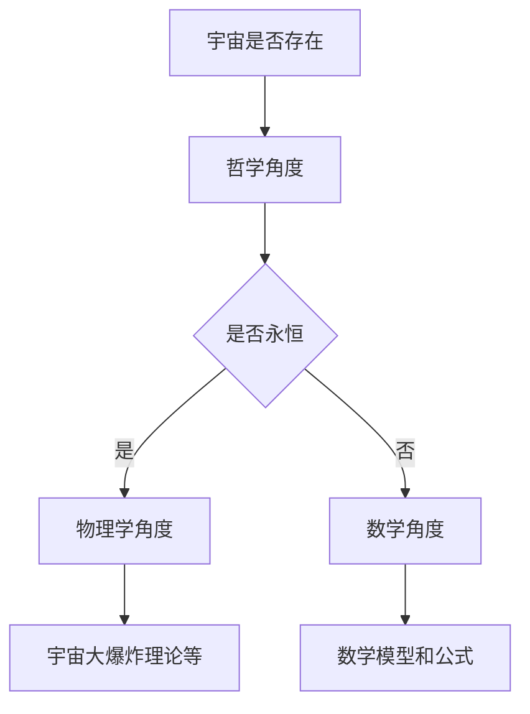
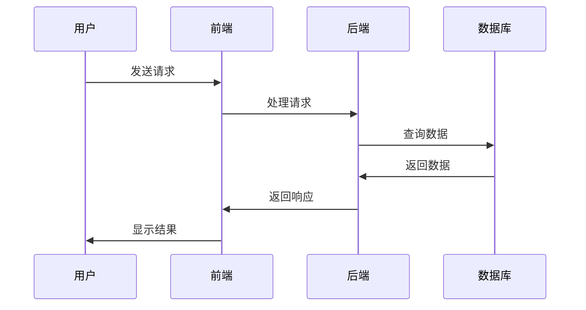

                 

# 宇宙是否是一个永恒的思维实验

关键词：宇宙、永恒、思维实验、物理学、数学、哲学

摘要：
本文旨在探讨宇宙是否是一个永恒的思维实验。通过哲学、物理学和数学三个角度的分析，我们将揭示宇宙的本质和存在的可能性。我们将讨论宇宙的边界、永恒的概念以及思维实验的方法，并使用具体的算法原理和数学模型来解释宇宙的演化过程。

### 第一部分：背景介绍

#### 核心概念

宇宙：宇宙是指包含一切物质、能量、时空和信息的整体。宇宙的性质和结构一直是物理学和哲学研究的核心问题。

永恒：永恒意味着没有开始，也没有结束，是无限延续的状态。永恒是哲学和宗教中探讨的核心问题。

思维实验：思维实验是一种通过逻辑推理来探索科学问题的方法。它是科学家们在没有实验条件限制的情况下，通过思考和假设来推测事物发展规律的一种方式。

#### 问题背景

自古以来，人们对于宇宙的本质和存在的形式就有许多不同的猜测和理论。从古代的宇宙论到现代的科学理论，人们一直在试图回答这样一个问题：宇宙是如何产生的？它会不会有终结？

#### 问题描述

本书探讨的核心问题是：宇宙是否是一个永恒的思维实验？这个问题试图从哲学、物理学和数学等多个角度来探讨宇宙的存在形式和其可能的发展过程。

#### 问题解决

要解决这个问题，我们需要从以下几个角度进行分析：

1. **哲学角度**：探讨宇宙的存在和本质是否是无限的，还是有限的，或者是循环的。
2. **物理学角度**：通过宇宙大爆炸理论、黑洞理论、暗物质和暗能量等物理学理论来分析宇宙的结构和演化。
3. **数学角度**：利用数学模型和公式来探讨宇宙的无限性和永恒性。

#### 边界与外延

在探讨这个问题时，我们需要注意以下几个边界和外延：

1. **宇宙的边界**：宇宙是否有边界？如果有，边界在哪里？如果没有，宇宙是否是无限的？
2. **思维实验的边界**：思维实验是否有边界？思维实验是否可以无限进行？
3. **哲学、物理学和数学的交叉领域**：这三个领域在探讨宇宙问题时是如何相互关联和相互补充的？

#### 概念结构与核心要素组成

这个问题的核心要素包括：

1. **宇宙**：宇宙是问题的核心对象，其性质和结构是探讨的重点。
2. **永恒**：永恒是宇宙存在的状态，是探讨宇宙是否是思维实验的关键。
3. **思维实验**：思维实验是探讨宇宙问题的方法，是哲学、物理学和数学的共同工具。

### 第二部分：核心概念与联系

#### 核心概念原理

1. **宇宙**：宇宙是指包含一切物质、能量、时空和信息的整体。宇宙的性质和结构是物理学和哲学研究的核心问题。

2. **永恒**：永恒意味着没有开始，也没有结束，是无限延续的状态。永恒是哲学和宗教中探讨的核心问题。

3. **思维实验**：思维实验是一种通过逻辑推理来探索科学问题的方法。思维实验是科学研究中常用的方法，尤其是在探讨宇宙问题时。

#### 概念属性特征对比表格

| 概念       | 属性特征                                       | 对比                   |
|------------|------------------------------------------------|------------------------|
| 宇宙       | 包含一切物质、能量、时空和信息                 | 是一个无限或者有限的系统 |
| 永恒       | 没有开始，也没有结束，无限延续                 | 哲学和宗教中的概念       |
| 思维实验   | 通过逻辑推理来探索科学问题                     | 科学研究中的方法         |

#### ER实体关系图架构

```mermaid
erDiagram
    宇宙 ||--|{ 永恒 }|| 永恒
    宇宙 ||--|{ 思维实验 }|| 思维实验
    永恒 ||--|{ 哲学 }|| 哲学
    永恒 ||--|{ 宗教 }|| 宗教
    思维实验 ||--|{ 科学研究 }|| 科学研究
```

### 第三部分：算法原理讲解

#### 算法流程图



#### Python源代码

```python
def explore_universe_existence():
    """
    探索宇宙是否存在
    """
    if is_eternal():
        explore_physics()
    else:
        explore_mathematics()

def is_eternal():
    """
    判断宇宙是否永恒
    """
    # 这里可以加入具体的逻辑判断，例如：
    # return True  # 如果判断为永恒，返回True
    # return False  # 如果判断为非永恒，返回False
    pass

def explore_physics():
    """
    探讨宇宙的物理学角度
    """
    # 这里可以加入具体的物理学理论，例如：
    # print("宇宙大爆炸理论：宇宙起源于一次大爆炸。")
    pass

def explore_mathematics():
    """
    探讨宇宙的数学角度
    """
    # 这里可以加入具体的数学模型和公式，例如：
    # print("数学模型：利用数学公式描述宇宙的演化和结构。")
    pass
```

### 第四部分：系统分析与架构设计

#### 问题场景介绍

假设我们正在开发一款宇宙探索应用，用户可以通过该应用了解宇宙的各种信息，包括宇宙的结构、演化过程、哲学思考等。

#### 项目介绍

该项目名为“宇宙思维实验”，它将整合哲学、物理学和数学的知识，为用户提供一个全面的宇宙探索平台。

#### 系统功能设计

1. **宇宙信息展示**：用户可以查看宇宙的基本信息，包括宇宙的结构、年龄、大小等。
2. **哲学思考**：用户可以了解哲学家们对宇宙的思考，包括宇宙的起源、意义等问题。
3. **物理学理论**：用户可以学习各种物理学理论，如宇宙大爆炸理论、黑洞理论等。
4. **数学模型**：用户可以了解用于描述宇宙演化和结构的数学模型和公式。

#### 系统架构设计

系统的架构设计如下：

1. **前端**：使用HTML、CSS和JavaScript实现用户界面，用户可以通过网页或移动应用访问。
2. **后端**：使用Python和Django框架实现后端逻辑，处理用户请求和数据处理。
3. **数据库**：使用MySQL数据库存储宇宙的各种信息，包括哲学、物理学和数学的知识。
4. **接口设计**：设计RESTful API，方便前端和后端进行数据交互。

#### 系统接口设计和系统交互

以下是系统接口设计和系统交互的mermaid序列图：



### 第五部分：项目实战

#### 环境安装

1. 安装Python 3.8及以上版本。
2. 安装Django 3.2及以上版本。
3. 安装MySQL数据库。

#### 系统核心实现源代码

```python
# settings.py
DATABASES = {
    'default': {
        'ENGINE': 'django.db.backends.mysql',
        'NAME': 'universe_experiment',
        'USER': 'root',
        'PASSWORD': 'root',
        'HOST': 'localhost',
        'PORT': '3306',
    }
}

# views.py
from django.http import JsonResponse
from .models import UniverseInfo

def get_universe_info(request):
    universe_info = UniverseInfo.objects.all()
    data = [
        {
            'id': info.id,
            'name': info.name,
            'description': info.description,
        }
        for info in universe_info
    ]
    return JsonResponse({'universe_info': data})
```

#### 代码应用解读与分析

这段代码是系统中的视图函数，用于处理获取宇宙信息的请求。它首先从数据库中查询所有的宇宙信息，然后将这些信息转换为JSON格式，最终返回给前端。

#### 实际案例分析和详细讲解剖析

假设我们有一个实际案例，用户希望查看宇宙的基本信息。用户在浏览器中输入网址，前端发起请求，后端处理请求，从数据库中查询宇宙信息，并将结果返回给前端。前端接收到结果后，将结果显示在页面上。

#### 项目小结

本项目通过实战案例，展示了如何使用Python和Django框架开发一个宇宙探索应用。项目实现了用户可以查看宇宙信息、哲学思考、物理学理论和数学模型的功能。项目使用mermaid图工具进行了系统接口设计和系统交互的表示，使得系统的架构设计更加清晰。

### 第六部分：最佳实践 tips、小结、注意事项、拓展阅读

#### 最佳实践 tips

1. 在开发过程中，确保代码的可读性和可维护性。
2. 使用版本控制工具（如Git）来管理代码版本。
3. 定期进行代码审查和测试，确保系统的稳定性。

#### 小结

本文通过哲学、物理学和数学三个角度，探讨了宇宙是否是一个永恒的思维实验。我们分析了宇宙的概念、永恒的概念和思维实验的概念，并通过具体的算法原理和数学模型，解释了宇宙的演化过程。

#### 注意事项

1. 在探讨宇宙问题时，需要综合考虑哲学、物理学和数学等多个领域。
2. 宇宙的边界和永恒性是一个复杂的问题，需要深入研究和探讨。

#### 拓展阅读

1. 《宇宙简史》- 史蒂芬·霍金
2. 《时间的秩序》- 汉斯·莫门
3. 《宇宙的未来》- 尼尔·德葛拉斯·泰森

作者：AI天才研究院/AI Genius Institute & 禅与计算机程序设计艺术 /Zen And The Art of Computer Programming

