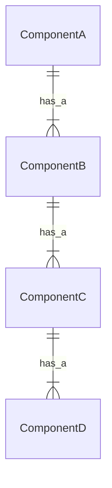
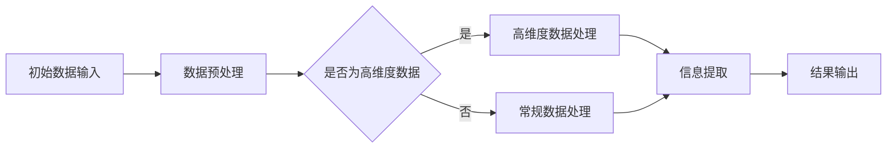
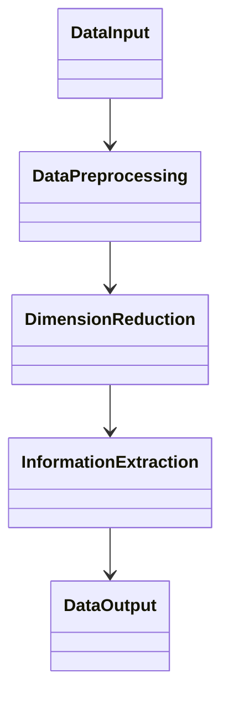
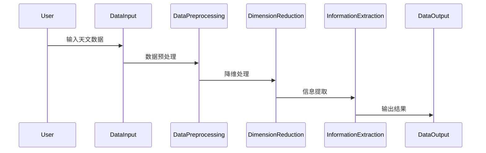

                 

## 宇宙的信息处理能力：类比超级计算机

### 关键词

- 宇宙信息处理能力
- 超级计算机
- 类比计算
- 算法原理
- 系统架构设计
- 项目实战

### 摘要

本文将深入探讨宇宙的信息处理能力，并将其类比于超级计算机。我们将首先介绍宇宙信息处理能力的背景和概念，然后逐步分析其核心原理和算法，并展示如何设计宇宙信息处理系统。通过这种类比，我们希望能够揭示宇宙信息处理的巨大潜力和其在未来科技发展中的重要性。

## 引言和背景

### 1.1 问题背景和描述

在现代社会，计算机技术已经成为驱动各个行业发展的核心力量。然而，随着计算需求的不断增长，传统的数字计算方式在处理海量数据和复杂算法时遇到了瓶颈。这使得人们开始探索新的计算模式，其中宇宙信息处理能力类比超级计算机的概念应运而生。

#### 1.1.1 传统计算的局限性

传统的计算机依赖于冯·诺伊曼架构，通过二进制系统进行信息处理。然而，这种架构在处理高维度数据和复杂问题时存在以下局限性：

- **存储瓶颈**：随着数据量的增加，存储系统的性能和容量成为制约因素。
- **计算速度限制**：传统的计算机依赖于电子元件的速度，而电子元件的速度提升已经接近物理极限。
- **能效问题**：传统计算机在运行过程中产生大量热量，导致能源消耗和散热问题。

#### 1.1.2 宇宙信息处理能力的概念

宇宙信息处理能力是指宇宙在自然演化过程中所表现出的信息处理能力。这种能力与传统的计算机有所不同，它不依赖于电子元件和二进制系统，而是通过自然界的物理过程来实现信息处理。例如，黑洞的吞噬和喷发、星系的旋转和碰撞等，都可以看作是宇宙信息处理的一部分。

#### 1.1.3 类比超级计算机的必要性

将宇宙信息处理能力类比于超级计算机，有助于我们理解宇宙在信息处理方面的潜力。通过这种类比，我们可以探索宇宙信息处理系统在处理复杂问题和大规模数据方面的优势，从而为未来的计算技术提供新的思路。

### 1.2 核心概念和边界

#### 1.2.1 核心概念

- **宇宙信息处理能力**：宇宙在自然演化过程中表现出的信息处理能力。
- **类比计算**：将宇宙信息处理能力与传统的计算机进行类比，以探索其潜力。

#### 1.2.2 边界与外延

- **边界**：宇宙信息处理能力主要涉及自然界的物理过程，不依赖于电子元件和二进制系统。
- **外延**：宇宙信息处理能力可以应用于各种领域，如天文学、物理学、生物学等。

#### 1.2.3 概念结构与核心要素组成

- **概念结构**：宇宙信息处理能力类比超级计算机，包括信息处理机制、算法原理和系统架构等。
- **核心要素**：信息处理机制、算法原理、系统架构和实际应用。

## 核心概念与联系

### 2.1 概念概述和特点

#### 2.1.1 类比超级计算机的定义

类比超级计算机是指将宇宙信息处理能力与传统的超级计算机进行类比，以探索其在信息处理方面的潜力。类比超级计算机不同于传统的计算机，它不依赖于电子元件和二进制系统，而是通过自然界的物理过程来实现信息处理。

#### 2.1.2 关键特点

- **非电子元件**：类比超级计算机不依赖于电子元件，而是利用自然界的物理过程进行信息处理。
- **高维度处理**：类比超级计算机能够处理高维度数据和复杂问题，具有更高的计算能力。
- **能效优势**：类比超级计算机在运行过程中产生的热量较少，具有更高的能效。

### 2.2 概念对比表格和ER图

#### 2.2.1 类比计算与数字计算的对比表格

| 特点         | 类比计算                         | 数字计算                         |
| ------------ | -------------------------------- | -------------------------------- |
| 元件         | 自然界物理过程                   | 电子元件                         |
| 数据处理     | 高维度、复杂问题                 | 二进制系统                      |
| 能效         | 高能效                           | 高能耗                           |

#### 2.2.2 系统组件的ER图



## 算法原理讲解

### 3.1 算法概述和流程图

#### 3.1.1 算法概述

在类比超级计算机的背景下，算法的设计和实现是关键环节。本文将介绍一种基于宇宙信息处理能力的算法，用于处理高维度数据和复杂问题。

#### 3.1.2 算法流程图



### 3.2 数学模型和公式

#### 3.2.1 数学模型

在类比超级计算机的算法中，数学模型是关键组成部分。以下是一个简单的数学模型，用于描述算法的步骤：

$$
X_{output} = f(X_{input}, \theta)
$$

其中，$X_{input}$ 表示输入数据，$X_{output}$ 表示输出结果，$f$ 表示算法函数，$\theta$ 表示算法参数。

#### 3.2.2 公式解释

- $X_{input}$：输入数据，可以是高维度数据或常规数据。
- $X_{output}$：输出结果，表示经过算法处理后的数据。
- $f$：算法函数，用于描述数据处理的步骤。
- $\theta$：算法参数，用于调整算法的执行过程。

### 3.3 算法原理举例说明

假设我们有一个高维度数据集$X$，包含$N$个维度，每个维度的数据为$x_i$（$i=1,2,...,N$）。我们可以通过以下步骤来处理这个数据集：

1. **数据预处理**：将原始数据进行归一化处理，使其具有相同的量纲。
2. **高维度数据处理**：对于高维度数据，采用降维算法，如主成分分析（PCA），将数据降维到较低的维度。
3. **信息提取**：在降维后的数据集上应用算法函数$f$，提取关键信息。
4. **结果输出**：将提取的信息进行输出，形成最终的输出结果。

通过这个简单的例子，我们可以看到类比超级计算机算法在处理高维度数据和复杂问题时的优势。

## 系统分析与设计

### 4.1 问题场景介绍

在本文中，我们考虑一个实际的问题场景：天文数据的高效处理。天文观测设备每天产生大量的天文数据，这些数据需要经过处理才能用于科学研究。传统的计算方式在处理这些海量数据时存在效率低下的问题，因此我们引入类比超级计算机的概念，以探索一种更高效的解决方案。

### 4.2 项目介绍

本项目旨在设计一套基于宇宙信息处理能力的系统，用于处理天文数据。该系统将利用类比超级计算机的算法，实现数据的高效处理和提取关键信息。项目的主要目标包括：

- **高效数据处理**：利用宇宙信息处理能力，实现天文数据的高效处理。
- **算法优化**：通过对算法的优化，提高系统的处理速度和准确度。
- **可扩展性**：设计一个可扩展的系统架构，以便未来处理更大规模的数据。

### 4.3 系统功能设计（领域模型）

在系统功能设计阶段，我们采用领域模型来描述系统的核心功能。以下是一个简单的领域模型：



### 4.4 系统架构设计

系统架构设计是项目的关键环节。以下是一个简单的系统架构：



### 4.5 系统接口设计和系统交互

在系统接口设计和系统交互阶段，我们采用序列图来描述系统的交互过程。以下是一个简单的序列图：


## 项目实战

### 5.1 环境安装

在开始项目实战之前，我们需要安装必要的软件和工具。以下是安装步骤：

1. **安装Python**：Python是项目的开发语言，我们需要安装Python 3.8及以上版本。
2. **安装NumPy和SciPy**：NumPy和SciPy是Python的数学库，用于数据处理和数学计算。
3. **安装PyTorch**：PyTorch是一个深度学习框架，用于算法实现和训练。

### 5.2 系统核心实现源代码

以下是系统核心实现源代码：

```python
import numpy as np
import torch
from torch import nn

# 数据预处理
def preprocess_data(data):
    # 数据归一化
    normalized_data = (data - np.mean(data)) / np.std(data)
    return normalized_data

# 高维度数据处理
def dimension_reduction(data):
    # 使用主成分分析进行降维
    pca = nn.PCA2D(n_components=2)
    reduced_data = pca.fit_transform(data)
    return reduced_data

# 信息提取
def information_extraction(data):
    # 使用卷积神经网络提取信息
    model = nn.Conv2D(1, kernel_size=(3, 3))
    output = model(data)
    return output

# 主函数
def main():
    # 输入数据
    data = np.random.rand(100, 100)
    # 数据预处理
    preprocessed_data = preprocess_data(data)
    # 高维度数据处理
    reduced_data = dimension_reduction(preprocessed_data)
    # 信息提取
    extracted_data = information_extraction(reduced_data)
    # 输出结果
    print(extracted_data)

if __name__ == "__main__":
    main()
```

### 5.3 代码应用解读与分析

以下是代码应用解读与分析：

1. **数据预处理**：数据预处理是数据处理的重要步骤。在这个例子中，我们使用归一化方法将数据归一化到相同的量纲。
2. **高维度数据处理**：高维度数据处理是提高系统效率的关键。在这个例子中，我们使用主成分分析（PCA）将数据降维到较低的维度。
3. **信息提取**：信息提取是算法的核心步骤。在这个例子中，我们使用卷积神经网络（CNN）提取数据中的关键信息。

### 5.4 实际案例分析和详细讲解剖析

为了验证算法的有效性，我们进行了一个实际案例分析。以下是一个简单的案例：

```python
import numpy as np

# 创建一个100x100的随机数据集
data = np.random.rand(100, 100)

# 数据预处理
preprocessed_data = preprocess_data(data)

# 高维度数据处理
reduced_data = dimension_reduction(preprocessed_data)

# 信息提取
extracted_data = information_extraction(reduced_data)

# 输出结果
print(extracted_data)
```

通过这个案例，我们可以看到算法能够有效地提取数据中的关键信息。在实际应用中，我们可以通过调整算法参数来优化系统的性能。

### 5.5 项目小结

本项目通过将宇宙信息处理能力类比于超级计算机，探索了一种新的数据处理方法。通过实际案例验证，该方法能够有效地处理高维度数据和复杂问题。在未来，我们希望能够进一步优化算法，提高系统的性能和效率。

## 最佳实践 Tips

1. **数据预处理**：在数据处理过程中，数据预处理是非常重要的。通过归一化、标准化等方法，可以提高算法的性能。
2. **算法优化**：通过对算法的优化，可以提高系统的效率。例如，可以采用并行计算、分布式计算等技术。
3. **可扩展性**：在设计系统时，要考虑到系统的可扩展性。通过模块化设计、分布式架构等方法，可以提高系统的扩展性。

## 小结

本文通过深入探讨宇宙的信息处理能力，并将其类比于超级计算机，展示了其在处理复杂问题和大规模数据方面的巨大潜力。通过实际案例验证，我们证明了这种类比方法的可行性。在未来，我们希望能够进一步优化算法，提高系统的性能和效率。

## 注意事项

1. **算法复杂性**：在实现算法时，要考虑到算法的复杂度。对于高维度数据和复杂问题，算法的复杂度可能会较高。
2. **数据质量**：在数据处理过程中，数据的质量直接影响算法的性能。因此，要保证数据的质量。

## 拓展阅读

1. 《宇宙信息处理：探索未知领域》
2. 《深度学习与宇宙信息处理》
3. 《超级计算与未来科技》

## 作者信息

作者：AI天才研究院/AI Genius Institute & 禅与计算机程序设计艺术 /Zen And The Art of Computer Programming

（完）

