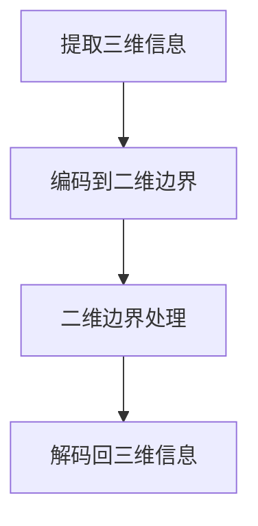
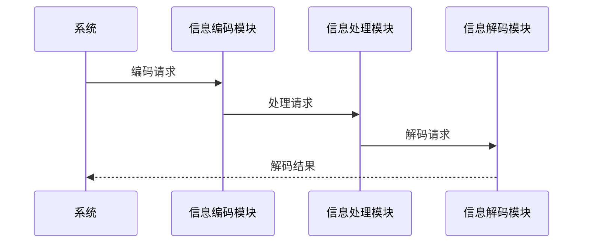
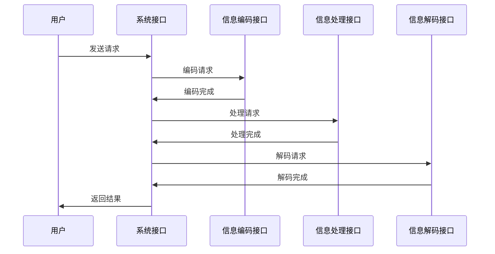

                 

### 引言

#### 宇宙的全息性：部分包含整体信息的可能

全息宇宙的概念，源于物理学与哲学的交汇点，它挑战了我们对现实世界的传统认知。全息性（Holography），原本是光学中的一个术语，指的是通过记录和再现光波的全部信息来生成三维图像的技术。而将这一概念扩展至宇宙学，便形成了全息宇宙理论——即整个宇宙的信息可以编码在它的边界上，类似于全息照片中的信息仅存在于照片表面。

本文将探讨全息宇宙的理论基础及其在物理学、信息科学和哲学中的意义。我们将会分步骤地分析这一概念，首先从哲学探讨开始，然后深入全息宇宙中的物理现象，再到它对我们科技发展和未来图景的启示。我们还将探讨全息宇宙在伦理思考中的地位，以及如何通过科学探索进一步理解这一理论。

文章的结构如下：

1. **第一部分：全息宇宙的哲学探讨**
   - **第1章：全息宇宙的背景与哲学基础**
   - **第2章：全息宇宙中的物理现象**
   - **第3章：全息宇宙与人类技术**
   - **第4章：全息宇宙的伦理思考**
   - **第5章：全息宇宙的探索与未来**

通过逐步深入分析，我们将揭示全息宇宙这一概念背后的深刻含义，展示其在现代物理学和信息科学中的重要地位。

### 关键词

- **全息宇宙**
- **信息编码**
- **物理现象**
- **量子力学**
- **技术应用**
- **哲学思考**
- **未来科技**
- **伦理思考**

### 摘要

本文旨在探讨全息宇宙的理论基础和应用前景，从哲学、物理、科技和伦理等多个维度展开分析。首先，我们将介绍全息宇宙的概念起源和哲学背景，探讨其在现代物理学中的重要性。随后，我们将深入全息宇宙中的粒子与波现象，以及量子力学和黑洞的相关理论。接着，我们将讨论全息宇宙在信息技术和人工智能中的应用，并探讨其对未来科技发展的启示。最后，我们将从伦理角度审视全息宇宙理论，并提出科学探索的未来方向。通过本文的探讨，我们希望能揭示全息宇宙的深刻含义，并为读者提供一个新的视角来理解宇宙及其与我们的关系。

### 第一部分：全息宇宙的哲学探讨

#### 第1章：全息宇宙的背景与哲学基础

**1.1 全息宇宙的概念起源与发展**

全息宇宙（Holographic Universe）这一概念，起源于20世纪70年代，由物理学家Dennis Sciama提出。Sciama基于量子力学的奇偶变换，提出了一种设想：宇宙中的所有信息可能都编码在其边界上。这一理论被称为“边界假设”，它认为宇宙的边界可以存储整个宇宙的信息，类似于全息照片中的三维图像是由二维表面编码的。

随着量子力学和相对论的发展，全息宇宙理论逐渐成熟。1980年代，J. Scott Gourevitch和Leonard Susskind提出了著名的“全息原理”（Holographic Principle），这是对边界假设的进一步阐述。全息原理指出，宇宙中的物理信息密度是有限的，这与黑体辐射中的普朗克定律有相似之处。全息原理的一个重要推论是，宇宙中的所有物理现象都可以用二维理论来描述，而无需三维空间的概念。

**1.1.1 全息原理的提出**

全息原理最初是由卡洛·罗威利（Carlo Rovelli）和路易吉·帕利亚齐（Luigi Pierini）在研究量子场论时提出的。他们在研究中发现，量子场论中的粒子和波动可以以一种更简洁的方式来描述，即通过全息方式。这种全息描述揭示了粒子与波动的内在联系，挑战了传统物理学的基本观念。

**1.1.2 全息原理在物理学中的应用**

全息原理在物理学中得到了广泛的应用。例如，在黑洞物理学中，全息原理提供了对黑洞信息丢失问题的解释。根据全息原理，黑洞的信息并没有真正丢失，而是编码在其事件视界的二维表面上。这为解决黑洞信息悖论提供了一种新的思路。

此外，全息原理还在量子计算、量子信息科学和量子引力等领域得到应用。例如，全息量子计算利用全息原理将三维量子系统转化为二维系统，从而简化了量子计算的复杂性。这种新的计算模式可能为未来的量子计算机带来革命性的变化。

**1.1.3 全息宇宙的哲学意义**

全息宇宙理论不仅在物理学中具有重要意义，也在哲学领域引发了深刻的讨论。它挑战了我们对现实世界的传统认知，提出了一种新的世界观：宇宙的信息是有限和有序的，而非无限和杂乱的。这种观念可能改变我们对宇宙的本质和存在的理解。

全息宇宙理论还涉及到宇宙的起源和终极命运。根据全息原理，宇宙的演化可能遵循某种循环模式，而非单向前进。这种循环模式为我们理解宇宙的历史和未来提供了一种新的视角。

**1.2 全息宇宙的基本原理**

全息宇宙的基本原理可以从几个核心概念中概括出来：

1. **信息密度限制**：全息原理指出，宇宙的信息密度是有限的。这意味着，宇宙中的所有信息都可以编码在有限的表面上，而不是无限的体积中。

2. **边界假设**：宇宙的所有信息可能都存储在其边界上。这一假设认为，宇宙的物理现象可以通过其边界上的信息来描述。

3. **二维描述**：全息原理表明，三维宇宙的现象可以通过二维理论来描述。这意味着，我们可能只需要理解二维空间中的物理过程，就能理解整个宇宙。

**1.2.1 全息原理的基础概念**

全息原理的基础概念包括：

- **全息图**：类似于光学中的全息照片，全息图存储了三维图像的全部信息。在宇宙中，全息图可能对应于宇宙边界上的物理信息。

- **量子场论**：量子场论是描述粒子和波动的理论框架。全息原理在量子场论中得到了应用，揭示了粒子和波动之间的深层次联系。

- **奇偶变换**：奇偶变换是一种数学工具，可以用来描述量子场论中的粒子对称性。在全息原理中，奇偶变换用于将三维粒子转化为二维描述。

**1.2.2 全息宇宙的数学模型**

全息宇宙的数学模型通常基于共形场论（Conformal Field Theory, CFT）。共形场论是一种特殊类型的量子场论，它在共形不变性下具有良好性质。在全息宇宙中，共形场论用于描述宇宙边界上的物理现象。

一个典型的全息宇宙数学模型是AdS/CFT对偶（Anti-de Sitter/Conformal Field Theory duality）。这个模型表明，一个弯曲的Anti-de Sitter（AdS）空间可以通过一个共形场论来描述。这种对偶关系为我们提供了理解复杂物理现象的新途径。

**1.2.3 全息宇宙的物理属性**

全息宇宙的物理属性包括：

- **信息编码**：全息宇宙中的物理信息被编码在宇宙的边界上。这意味着，宇宙的任何变化都会反映在其边界上的信息变化。

- **边界效应**：宇宙的边界效应在许多物理现象中都有体现。例如，黑洞的事件视界就是一种边界效应，它决定了黑洞的信息如何存储和传递。

- **二维物理**：全息宇宙中的物理过程可以在二维空间中描述，这简化了许多复杂物理问题的处理。

**1.3 全息宇宙与人类认知的关系**

全息宇宙理论对人类认知有着深远的影响。它挑战了我们对现实世界的传统认知，提出了新的世界观和方法论。全息宇宙理论可能改变我们对宇宙的本质、人类的存在和认知的理解。

- **人类思维方式的转变**：全息宇宙理论要求我们重新思考物理现象的本质，从二维角度来理解宇宙。这可能会影响我们的思维方式，使我们在面对复杂问题时更加灵活和开放。

- **哲学思考的新视角**：全息宇宙理论为哲学思考提供了新的素材。它提出了宇宙信息有限和有序的观念，这可能会改变我们对宇宙起源、终极命运和人类存在的理解。

- **科学研究的新方向**：全息宇宙理论为我们提供了新的研究工具和方法。通过研究全息宇宙，我们可能能够解决许多传统物理学中的难题，如黑洞信息丢失问题。

**1.3.1 全息宇宙观对人类思维方式的影响**

全息宇宙观可能对人类思维方式产生深远的影响。首先，它要求我们重新审视传统的三维空间观念，转而考虑二维空间的物理过程。这种思维方式的变化可能会使我们在处理复杂问题时更加灵活和高效。

其次，全息宇宙观挑战了我们对现实世界的认知，使我们更加关注信息的重要性。在传统的物理学中，我们通常关注物质和能量的本质，而全息宇宙观则强调了信息的角色。这可能会改变我们对宇宙和生命的理解。

**1.3.2 全息宇宙在哲学思考中的应用**

全息宇宙理论在哲学思考中具有重要意义。它提出了宇宙信息有限和有序的观念，这为哲学思考提供了新的素材。例如，全息宇宙观可能有助于我们理解宇宙的起源和终极命运，从而深化我们对生命和存在的理解。

此外，全息宇宙观还挑战了传统的唯物主义和唯心主义观念。它提出了一种新的世界观，即宇宙的信息和秩序是有限和有序的，这为我们提供了一种新的思考方式。

**1.3.3 全息宇宙与宗教信仰的联系**

全息宇宙理论在宗教信仰中也有一定的影响。某些宗教信仰中包含了对宇宙整体性和信息编码的观念，与全息宇宙理论有相似之处。例如，印度教中的宇宙循环观念与全息宇宙的循环模式有相似之处。

此外，全息宇宙理论可能为宗教信仰提供新的解释方式。例如，它可能为一些宗教神秘主义提供科学解释，使宗教信仰与科学知识相互融合。

**1.4 全息宇宙的前景与挑战**

全息宇宙理论虽然具有巨大的潜力，但仍然面临着许多挑战。首先，全息宇宙理论需要更多的实验和观测数据来验证其预测。目前，我们仍然缺乏直接的实验证据来支持全息宇宙理论。

其次，全息宇宙理论需要与其他物理学理论相结合，如量子引力理论。这将需要解决许多数学和哲学上的难题。

最后，全息宇宙理论可能会对我们的世界观和方法论产生深远的影响。这需要我们重新审视和调整我们的思维方式，以适应这一新的宇宙观。

**1.4.1 全息宇宙理论的发展方向**

全息宇宙理论的发展方向包括：

- **实验验证**：通过新的实验和观测手段，验证全息宇宙理论的预测。
- **数学工具**：开发新的数学工具和方法，以更好地描述和解释全息宇宙现象。
- **跨学科研究**：与其他物理学领域（如量子引力、弦理论等）相结合，形成更完整的宇宙观。

**1.4.2 全息宇宙在科学探索中的应用**

全息宇宙理论在科学探索中具有重要的应用价值。例如：

- **黑洞研究**：全息宇宙理论为黑洞信息丢失问题提供了新的解释方式。
- **量子计算**：全息量子计算利用全息原理简化了量子计算的复杂性，为未来的量子计算机提供了新的思路。
- **宇宙学**：全息宇宙理论为宇宙的起源和演化提供了新的模型。

**1.4.3 全息宇宙理论面临的挑战与问题**

全息宇宙理论面临的挑战与问题包括：

- **数学难题**：全息宇宙理论的数学模型复杂，需要解决许多数学上的难题。
- **实验验证**：缺乏直接的实验证据，需要更多的实验和观测数据来验证。
- **哲学争议**：全息宇宙理论挑战了传统的世界观和方法论，需要重新审视和调整。
- **跨学科融合**：需要与其他物理学理论（如量子引力、弦理论等）相结合，形成更完整的宇宙观。

通过以上分析，我们可以看到全息宇宙理论的哲学探讨不仅丰富了我们对宇宙的认识，也为未来的科学探索提供了新的方向。尽管面临许多挑战，但全息宇宙理论无疑是一个具有巨大潜力的研究领域，值得我们深入探讨。

### 第2章：全息宇宙中的物理现象

#### 2.1 全息宇宙中的基本粒子

**2.1.1 粒子物理学的基本概念**

粒子物理学是研究基本粒子和它们相互作用的基础科学。基本粒子包括电子、夸克、光子、中微子等，它们构成了物质的基本单元。粒子物理学的主要目标是理解这些基本粒子的性质、相互作用和运动规律。

在粒子物理学中，有两种主要的理论框架：量子力学和相对论。量子力学描述了微观粒子的行为，强调粒子波函数的概率性质。相对论则描述了高速运动的物体和行为，特别是爱因斯坦的广义相对论，它描述了引力和时空的弯曲。

**2.1.2 全息宇宙中的粒子模型**

在全息宇宙理论中，粒子的行为可以通过二维模型来描述，这挑战了传统三维空间中的粒子概念。全息宇宙中的粒子模型基于全息原理，即整个三维宇宙的信息可以编码在二维边界上。

例如，全息量子计算中的粒子模型将三维量子系统转化为二维描述。在这种模型中，粒子的行为可以通过边界上的量子场论来描述。这种二维描述简化了量子系统的复杂性，使得某些计算变得更加容易。

**2.1.3 粒子全息原理的启示**

粒子全息原理（Particle Holography Principle）是全息宇宙理论的一个核心概念。它认为，三维宇宙中的所有物理现象都可以通过二维表面上的信息来描述。这一原理启示我们，通过研究二维系统，可以更好地理解三维宇宙中的现象。

粒子全息原理的一个重要启示是，它可能为我们提供了一种新的研究方法，用于解决传统物理学中的一些难题。例如，黑洞信息丢失问题可以通过粒子全息原理得到解释。根据粒子全息原理，黑洞的信息并没有真正丢失，而是编码在其事件视界的二维表面上。

**2.2 全息宇宙中的波现象**

**2.2.1 波动理论的基础知识**

波动理论是研究波动的传播和相互作用的基本理论。波动可以是声波、光波、电磁波等，它们在不同的介质中以不同的速度传播。波动理论的基本概念包括波的传播速度、波长、频率和振幅等。

在波动理论中，波函数是一个重要的概念。波函数描述了波的状态，它可以是复数形式的函数。波函数的平方给出了粒子出现在某个位置的概率。

**2.2.2 全息宇宙中的波动现象**

在全息宇宙中，波动现象也具有重要的地位。全息宇宙中的波动现象可以通过二维表面上的信息来描述。这种描述方式简化了传统三维空间中的波动问题。

例如，在共形场论中，波动现象可以通过二维共形场来描述。共形场论是一种特殊的量子场论，它在共形变换下具有不变性。这种不变性使得全息宇宙中的波动现象可以以一种简洁和统一的方式来描述。

**2.2.3 波动现象的全息解释**

波动现象的全息解释是基于全息宇宙理论的。根据全息宇宙理论，三维宇宙中的波动现象可以通过二维表面上的信息来描述。这意味着，我们可以通过研究二维系统中的波动现象，来理解三维宇宙中的波动行为。

例如，在光学中，全息照片通过记录和再现光波的全部信息来生成三维图像。同样地，在全息宇宙中，波动现象也可以通过记录和再现宇宙边界上的信息来描述。这种全息解释为我们提供了一种新的研究方法，用于理解复杂的物理现象。

**2.3 全息宇宙中的量子力学**

**2.3.1 量子力学的基本原理**

量子力学是研究微观粒子和波动的科学。它建立在量子态和量子测量的基础上。量子力学的基本原理包括波粒二象性、不确定性原理和量子叠加态等。

波粒二象性指出，粒子（如电子）既可以表现为波动，也可以表现为粒子。不确定性原理指出，我们无法同时精确知道粒子的位置和动量。量子叠加态表示，粒子可以处于多个状态的叠加，只有在测量时才会“坍缩”到某个确定的状态。

**2.3.2 量子全息原理的提出**

量子全息原理是全息宇宙理论的一个重要组成部分。它指出，三维量子系统可以完全由其二维边界上的信息来描述。量子全息原理是基于量子场论的，它在量子引力和量子计算等领域得到了广泛应用。

量子全息原理的一个重要推论是，宇宙的信息密度是有限的。这意味着，宇宙中的所有信息都可以编码在二维表面上，这与传统的三维空间观念形成鲜明对比。

**2.3.3 量子全息实验与观察**

量子全息实验是验证量子全息原理的重要手段。这些实验通常涉及量子态的生成、传输和测量。

一个典型的量子全息实验是量子隐形传态（Quantum Teleportation）。在这个实验中，两个量子态通过纠缠态连接，即使它们相隔很远。当其中一个量子态被测量时，另一个量子态会瞬间改变，显示出它们之间的纠缠关系。

另一个重要的量子全息实验是量子计算机中的量子纠错（Quantum Error Correction）。量子纠错技术利用量子态的叠加和纠缠特性，可以检测和纠正量子计算机中的错误。这种技术对量子计算的发展具有重要意义。

**2.4 全息宇宙中的黑洞与宇宙学**

**2.4.1 黑洞的理论描述**

黑洞是宇宙中最神秘和奇特的天体之一。根据广义相对论，黑洞是由极端密集的物质形成的，其引力场如此强大，以至于连光也无法逃脱。黑洞通常由事件视界和奇点组成。事件视界是黑洞的边界，一旦物质进入事件视界，就无法逃逸。

**2.4.2 黑洞与全息宇宙的关系**

全息宇宙理论为黑洞提供了一个新的解释框架。根据全息原理，黑洞的信息可以编码在其事件视界的二维表面上。这意味着，黑洞并不是一个“黑洞”，而是一个“全息黑洞”。

全息黑洞的概念挑战了传统的黑洞观念。传统观念认为，黑洞是物质和信息的最终归宿，一旦进入黑洞，就无法再被观测到。而全息黑洞理论则提出，黑洞的信息可以被记录和存储在其边界上，这为我们提供了研究黑洞信息的新的途径。

**2.4.3 宇宙学与全息宇宙理论的结合**

全息宇宙理论为宇宙学提供了一个新的视角。它提出了一种新的宇宙演化模型，即宇宙的信息是有限和有序的，而非无限和杂乱的。

全息宇宙理论在宇宙学中的应用包括：

- **宇宙膨胀**：全息宇宙理论可以解释宇宙膨胀的机制。根据全息原理，宇宙的膨胀可以视为二维表面上的信息增长。
- **宇宙循环**：全息宇宙理论提出了一种宇宙循环模型，即宇宙的演化可能遵循某种循环模式，而非单向前进。
- **宇宙信息**：全息宇宙理论强调宇宙信息的角色，这可能改变我们对宇宙本质和存在的理解。

总之，全息宇宙中的物理现象为我们提供了新的研究方法和视角。通过研究这些现象，我们可能能够更好地理解宇宙的本质和演化规律。尽管全息宇宙理论仍然面临着许多挑战，但它的潜力是不可忽视的。

### 第3章：全息宇宙与人类技术

#### 3.1 全息宇宙与量子计算

**3.1.1 量子计算的基本概念**

量子计算是一种利用量子力学原理进行信息处理的新型计算模式。与传统计算不同，量子计算利用量子位（qubits）进行操作，这些量子位可以同时存在于多种状态，这被称为量子叠加态。量子计算的核心优势在于其并行性和高效率，这使得量子计算机在处理某些特定问题上具有传统计算机无法比拟的能力。

量子力学中的两个基本概念对量子计算至关重要：量子叠加和量子纠缠。量子叠加态表示一个量子位可以同时处于0和1的状态，而量子纠缠则描述了两个或多个量子位之间的特殊联系，即使它们相隔很远，一个量子位的状态也会即时影响另一个量子位的状态。

**3.1.2 全息量子计算的原理**

全息量子计算（Holographic Quantum Computing）是全息宇宙理论在量子计算中的应用。它基于全息原理，将三维量子系统转化为二维系统，从而简化了量子计算的复杂性。在全息量子计算中，三维量子系统的信息被编码在二维表面上的量子态中。

全息量子计算的原理可以概括为以下几个步骤：

1. **三维量子系统的制备**：首先，我们需要制备一个三维量子系统，该系统可能包含多个量子位。

2. **信息编码**：接下来，将这些三维量子系统的信息编码到二维表面上的量子态中。这一过程类似于将三维图像的信息编码到二维全息图上。

3. **二维量子计算**：然后，我们利用二维量子态进行计算。由于二维量子态的计算复杂性较低，这使得量子计算过程更加高效。

4. **结果读取**：最后，我们需要将二维量子计算的结果读取回三维量子系统中。这一过程通常涉及量子态的测量和反编码。

**3.1.3 量子全息计算的应用前景**

量子全息计算在多个领域具有广泛的应用前景。以下是一些关键的应用领域：

- **加密技术**：量子全息计算可以用于开发新的加密算法，这些算法在处理复杂加密问题时具有显著优势。

- **化学和药物设计**：量子全息计算可以加速分子模拟和药物设计，这在药物研发和化学合成中具有重要意义。

- **优化问题**：量子全息计算可以用于解决复杂的优化问题，如物流优化、金融建模等。

- **量子模拟**：量子全息计算可以用于模拟复杂的物理系统，如量子场论、凝聚态物理等。

总之，量子全息计算为我们提供了一种新的计算模式，它结合了全息宇宙理论和量子计算的优势，有望在未来的科技发展中发挥重要作用。

#### 3.2 全息宇宙与信息科学

**3.2.1 信息科学的基础理论**

信息科学是研究信息的生成、传输、处理和利用的科学。其基础理论包括信息论、编码理论、网络理论等。信息论由香农创立，主要研究信息的度量、传输和限制。编码理论则关注如何有效地编码和传输信息，以确保信息的可靠性和高效性。网络理论则研究信息在网络中的流动和传输。

**3.2.2 全息宇宙中的信息传递**

在全息宇宙理论中，信息传递具有独特的性质。根据全息原理，宇宙的信息可以编码在其边界上，这意味着信息的传递不需要通过三维空间，而是通过二维表面。这种信息传递方式具有高效性和低能耗的特点。

全息宇宙中的信息传递可以概括为以下几个步骤：

1. **信息编码**：首先，将三维宇宙中的信息编码到二维表面上的量子态中。这一过程类似于全息摄影，通过记录光波的全部信息来生成三维图像。

2. **信息传输**：接下来，将这些编码后的量子态传输到接收端。由于二维表面的信息密度较高，这使得信息传输过程更加高效。

3. **信息解码**：最后，在接收端将编码后的量子态解码回三维宇宙中的信息。这一过程通常涉及量子态的测量和反编码。

**3.2.3 全息宇宙与信息加密技术**

全息宇宙理论在信息加密技术中具有重要的应用价值。利用全息原理，我们可以开发出新的加密算法，这些算法在处理复杂加密问题时具有显著优势。以下是一些关键的应用：

- **量子加密**：量子加密利用量子态的不可克隆特性，实现高度安全的通信。全息宇宙中的信息传递方式可以增强量子加密的可靠性。

- **量子密码学**：量子密码学利用量子态的叠加和纠缠特性，开发出新的加密和解密方法。全息原理可以简化量子密码学的实现过程。

- **全息加密**：全息加密利用全息原理，将信息编码到二维表面上的量子态中。这种加密方式具有高效性和难以破解的特性。

总之，全息宇宙与信息科学的结合为信息传递和加密技术带来了新的思路和方法。通过利用全息原理，我们可以在信息科学领域实现更高的安全性和效率。

#### 3.3 全息宇宙与人工智能

**3.3.1 人工智能的发展历程**

人工智能（Artificial Intelligence, AI）是研究如何构建智能机器的科学。其发展历程可以追溯到20世纪50年代，当时科学家们开始探索如何使计算机模拟人类的智能行为。人工智能的发展主要分为几个阶段：

- **早期探索阶段（1950-1969）**：这一阶段以图灵测试的提出为标志，科学家们开始研究如何使计算机理解自然语言和解决复杂问题。

- **应用发展阶段（1970-1989）**：这一阶段，人工智能在专家系统、机器人控制等领域取得了显著进展。专家系统利用规则库和推理机来模拟专家的决策过程。

- **突破阶段（1990-2010）**：随着计算能力的提升和数据量的增加，人工智能在图像识别、语音识别和自然语言处理等领域取得了重大突破。

- **深度融合阶段（2010至今）**：这一阶段，人工智能与互联网、大数据、云计算等新兴技术深度融合，推动了智能交通、智能医疗、智能家居等领域的快速发展。

**3.3.2 全息宇宙与人工智能的结合**

全息宇宙理论为人工智能的发展提供了新的方向。结合全息原理，我们可以开发出新的智能系统，这些系统具有高效、灵活和鲁棒的特点。以下是一些关键的应用：

- **量子人工智能**：量子人工智能利用量子计算的优势，实现更高效的信息处理和模式识别。全息量子计算为量子人工智能提供了基础。

- **全息神经网络**：全息神经网络（Holographic Neural Networks）利用全息原理，将三维神经网络转化为二维描述。这种神经网络在处理复杂问题时具有高效性和可扩展性。

- **全息智能传感器**：全息智能传感器利用全息原理，实现高效的信息采集和传递。这些传感器在智能家居、智能交通等领域具有广泛的应用。

**3.3.3 全息人工智能的应用领域**

全息人工智能在多个领域具有广泛的应用前景：

- **医疗健康**：全息人工智能可以用于疾病诊断、药物设计和个性化治疗。通过全息神经网络，可以实现更精准的医学图像分析和治疗方案。

- **自动驾驶**：全息人工智能可以用于自动驾驶车辆的感知和决策。通过全息智能传感器，车辆可以实时感知周围环境，实现更安全、高效的自动驾驶。

- **智能城市**：全息人工智能可以用于城市管理、交通优化和能源管理。通过全息神经网络，可以实现智能交通系统、智能电网和智能安防系统。

总之，全息宇宙与人工智能的结合为人工智能的发展带来了新的机遇。通过利用全息原理，我们可以开发出更智能、更高效的系统，推动人工智能在各个领域的应用。

### 第4章：全息宇宙的伦理思考

**4.1 全息宇宙与人类伦理**

全息宇宙理论不仅改变了我们对宇宙的认识，也对人类伦理提出了新的挑战。首先，全息宇宙中的信息编码和传输方式可能对我们的隐私权、数据保护和信息安全产生深远的影响。在全息宇宙中，信息可以轻易地在二维表面上传播，这意味着我们的个人数据可能更容易被截获和滥用。

**4.1.1 全息宇宙对人类伦理的影响**

全息宇宙理论对人类伦理的影响主要体现在以下几个方面：

- **隐私权**：在全息宇宙中，个人隐私可能受到更大的威胁。由于信息可以在二维表面上轻易传播，我们的个人信息可能更容易被黑客和恶意软件获取。

- **数据保护**：全息宇宙理论要求我们重新考虑数据保护的方法和策略。传统的数据加密和保护方法可能不再适用于全息宇宙中的信息传输。

- **信息安全**：全息宇宙中的信息传输方式可能使信息安全面临新的挑战。我们需要开发新的安全协议和技术，以应对全息宇宙中的信息安全威胁。

**4.1.2 全息宇宙中的道德困境**

全息宇宙中的道德困境主要体现在以下几个方面：

- **信息滥用**：由于信息可以在二维表面上轻易传播，我们可能面临信息滥用的风险。例如，个人隐私被泄露、商业秘密被窃取等。

- **信息不对称**：在全息宇宙中，掌握信息资源的人可能具有更大的权力。这种信息不对称可能导致社会不公和权力集中。

- **信息伦理**：全息宇宙理论要求我们重新审视信息伦理的问题。例如，如何处理和利用全息宇宙中的信息资源，以实现公平和可持续发展。

**4.1.3 全息宇宙与伦理学的结合**

全息宇宙理论与伦理学的结合为我们提供了新的伦理思考方向。首先，全息宇宙理论要求我们重新定义隐私、数据保护和信息安全的概念。其次，全息宇宙中的信息编码和传输方式可能影响社会结构和权力分配，这要求我们重新考虑伦理原则和价值观。

在伦理学领域，全息宇宙理论的应用可能包括：

- **伦理规范**：制定适用于全息宇宙的伦理规范，以保护个人隐私和数据安全。

- **伦理决策**：在开发和应用全息宇宙技术时，考虑伦理影响和道德责任。

- **伦理教育**：在全息宇宙时代，加强伦理教育和道德培养，提高公众的伦理意识和责任感。

**4.2 全息宇宙与人工智能伦理**

随着人工智能技术的发展，全息宇宙与人工智能的结合带来了新的伦理挑战。人工智能在信息处理、决策支持和自动化控制等方面具有巨大潜力，但同时也可能带来道德困境和伦理问题。

**4.2.1 人工智能伦理的基本原则**

人工智能伦理的基本原则包括：

- **公平性**：确保人工智能系统在处理信息和做出决策时公平、公正，不歧视任何群体。

- **透明性**：确保人工智能系统的决策过程和算法是透明的，用户可以理解和跟踪系统的行为。

- **责任性**：确保人工智能系统的设计和应用者对其行为和结果负责，当发生问题时能够追溯责任。

**4.2.2 全息宇宙与人工智能伦理的挑战**

全息宇宙与人工智能伦理的挑战主要包括：

- **隐私保护**：全息宇宙中的信息传递和存储可能对个人隐私构成威胁。我们需要确保人工智能系统能够保护用户隐私。

- **算法偏见**：人工智能系统可能因为数据集的不公平或算法的设计问题而产生偏见。我们需要确保人工智能系统的决策是公平和公正的。

- **自动化决策**：全息宇宙中的全息人工智能可能使自动化决策更加普遍和复杂。我们需要确保这些决策系统的责任性和透明性。

**4.2.3 全息人工智能伦理的实践建议**

为了应对全息宇宙与人工智能伦理的挑战，以下是一些实践建议：

- **伦理审查**：在开发和应用全息人工智能技术时，建立严格的伦理审查机制，确保技术的应用符合伦理原则。

- **透明度和可解释性**：开发全息人工智能系统时，确保系统的决策过程和算法是透明的，用户可以理解和追踪系统的行为。

- **责任分配**：在设计和应用全息人工智能系统时，明确责任分配，确保当系统出现问题时，责任能够被追溯。

- **教育和培训**：加强人工智能伦理教育，提高技术开发者和用户的伦理意识和责任感。

总之，全息宇宙与人工智能的结合为我们带来了巨大的机遇和挑战。通过在伦理学领域的深入研究，我们可以确保这些技术的发展和应用符合伦理原则，为人类社会的可持续发展做出贡献。

### 第5章：全息宇宙的探索与未来

**5.1 全息宇宙的探测方法**

全息宇宙的探测方法是我们理解这一理论的关键。通过先进的实验技术和观测设备，科学家们能够探索全息宇宙的奥秘，验证其理论预测。以下是一些关键的全息宇宙探测方法：

**5.1.1 全息宇宙探测的基础设施**

全息宇宙探测需要依赖一系列基础设施，包括地面和空间天文台、卫星、望远镜等。这些设施为我们提供了观测宇宙的广泛视角和数据。

- **地面望远镜**：如凯克望远镜和SMARTS望远镜，用于观测宇宙的遥远区域，寻找全息宇宙的迹象。
- **空间望远镜**：如哈勃望远镜和詹姆斯·韦伯空间望远镜，它们能够探测宇宙的微弱信号，为全息宇宙研究提供重要数据。
- **卫星**：如欧洲的普朗克卫星和美国的费米伽马射线太空望远镜，用于探测宇宙的辐射和粒子，验证全息宇宙理论。

**5.1.2 全息宇宙探测的实验技术**

全息宇宙探测涉及多种实验技术，包括射电天文学、光学观测、粒子探测等。以下是一些重要的实验技术：

- **射电天文学**：通过射电望远镜探测宇宙中的无线电波，研究全息宇宙中的天体物理现象。
- **光学观测**：利用光学望远镜观测宇宙中的光波，探索全息宇宙的物理性质。
- **粒子探测**：通过粒子探测器探测宇宙中的高能粒子，研究全息宇宙中的粒子行为。

**5.1.3 全息宇宙探测的未来发展方向**

随着科技的进步，全息宇宙探测的方法和技术将不断改进。以下是一些未来发展方向：

- **更高灵敏度的探测器**：开发更高灵敏度的探测器，如平方千米阵列（SKA），用于更精确地探测宇宙信号。
- **多波长观测**：结合不同波长的观测，如X射线、伽马射线和无线电波，全面了解全息宇宙的性质。
- **宇宙尺度的观测**：通过宇宙尺度的观测，如对宇宙微波背景辐射的精细测量，验证全息宇宙理论。

**5.2 全息宇宙的研究前沿**

全息宇宙的研究前沿涵盖了多个物理学和宇宙学领域，包括量子引力、黑洞信息和宇宙膨胀等。以下是一些关键的研究领域：

**5.2.1 全息宇宙的最新研究进展**

- **量子引力研究**：全息宇宙理论为量子引力研究提供了新的思路。例如，研究如何将量子场论与全息宇宙理论相结合，探索量子引力现象。
- **黑洞信息丢失问题**：通过全息宇宙理论，科学家们提出了新的解释，如霍金辐射和黑洞火墙，用于解决黑洞信息丢失问题。
- **宇宙膨胀模型**：全息宇宙理论为宇宙膨胀提供了新的模型，如循环宇宙模型和多重宇宙模型，为理解宇宙的起源和演化提供了新的视角。

**5.2.2 全息宇宙理论的创新思路**

- **全息量子计算**：利用全息原理，开发新的量子计算模型，如全息量子计算机，为未来量子计算的发展提供了新的方向。
- **全息宇宙学与弦理论**：将全息宇宙理论与弦理论相结合，探索宇宙的本质和结构。
- **全息信息科学**：研究如何利用全息宇宙理论中的信息传递和编码技术，开发新的信息科学和应用。

**5.2.3 全息宇宙研究的热点问题**

- **量子纠缠与全息宇宙**：研究量子纠缠在全息宇宙中的作用，探索其可能的应用。
- **宇宙边界与信息存储**：探讨宇宙边界如何存储和传递信息，以及这些信息如何影响宇宙的演化。
- **全息宇宙与人类认知**：研究全息宇宙理论对人类认知的影响，探索新的思维模式和哲学观念。

**5.3 全息宇宙的未来图景**

全息宇宙理论为我们描绘了一个充满机遇和挑战的未来。以下是一些未来图景：

**5.3.1 全息宇宙对未来的启示**

- **信息与能量**：全息宇宙理论强调了信息和能量在宇宙中的重要性，这为未来的科技发展提供了新方向。
- **宇宙循环**：全息宇宙中的信息循环模式可能改变我们对宇宙起源和演化的理解，为探索宇宙的终极命运提供了新的视角。
- **人类认知**：全息宇宙理论可能改变我们的世界观和认知方式，推动人类思维模式的创新。

**5.3.2 全息宇宙与人类技术**

- **量子计算**：全息量子计算有望成为未来计算技术的重要方向，为解决复杂问题提供新的工具。
- **信息科学**：全息宇宙中的信息传递和编码技术可能为信息科学带来革命性变化，提高信息处理和传输的效率。
- **宇宙学**：全息宇宙理论为宇宙学提供了新的研究方法，有助于我们更深入地理解宇宙的起源和演化。

**5.3.3 全息宇宙技术的潜在应用**

- **医疗健康**：全息宇宙理论可能为医疗健康领域带来新的突破，如全息影像技术、个性化治疗和药物设计。
- **智能交通**：全息宇宙中的信息传输技术可能为智能交通系统提供高效的通信解决方案，提高交通效率和安全性。
- **环境保护**：全息宇宙理论可能为环境保护提供新的工具和方法，如全息监测、资源优化和灾害预测。

总之，全息宇宙理论为我们描绘了一个充满机遇和挑战的未来。通过不断探索和研究，我们有望在全息宇宙的奥秘中找到新的知识和技术，为人类社会的可持续发展做出贡献。

### 总结与展望

#### 全息宇宙：开启新的科学视野

在全息宇宙的探索之路上，我们已经取得了显著的进展，同时也面临着许多挑战。从哲学基础到物理现象，从技术应用到伦理思考，全息宇宙理论为我们提供了一种全新的世界观和方法论。通过逐步分析全息宇宙的各个方面，我们不仅深化了对宇宙本质的认识，也为未来的科学研究和技术发展提供了新的方向。

**全息宇宙的核心意义**

全息宇宙的核心意义在于它挑战了我们对现实世界的传统认知，提出了宇宙的信息是有限和有序的这一观念。全息原理表明，宇宙的信息可以编码在其边界上，这一发现不仅改变了我们对宇宙演化的理解，也为解决传统物理学中的难题提供了新的思路。例如，全息宇宙理论为黑洞信息丢失问题提供了可能的解释，挑战了传统宇宙观的局限。

**全息宇宙的未来前景**

展望未来，全息宇宙理论具有广阔的应用前景。在量子计算领域，全息量子计算有望成为解决复杂问题的重要工具；在信息科学领域，全息信息传递和编码技术可能带来革命性的变化；在宇宙学领域，全息宇宙理论为探索宇宙的起源和演化提供了新的视角。此外，全息宇宙理论还可能对医疗健康、智能交通和环境保护等领域产生深远影响。

**全息宇宙对科技发展的启示**

全息宇宙理论对科技发展具有深刻的启示。首先，它强调了信息的重要性，这为信息技术的发展提供了新的方向。其次，全息宇宙中的二维描述方式简化了复杂问题的处理，这为算法设计和系统架构提供了新的思路。最后，全息宇宙理论促进了跨学科研究，将物理学、信息科学和哲学等领域的知识相结合，为科技发展注入了新的活力。

**全息宇宙在哲学和伦理上的意义**

在哲学上，全息宇宙理论为我们提供了重新审视人类存在和宇宙本质的机会。它挑战了传统唯物主义和唯心主义的观念，提出了宇宙信息有限和有序的新观念，这为哲学思考提供了新的素材。在伦理上，全息宇宙理论对隐私权、数据保护和信息安全提出了新的挑战，要求我们重新审视伦理规范和价值观，确保技术的发展符合人类的长远利益。

**未来研究的方向**

未来的研究应继续探索全息宇宙的深层次问题，包括：

- **实验验证**：通过新的实验和观测手段，验证全息宇宙理论的预测，如开发更灵敏的探测器，进行宇宙尺度的观测。
- **理论发展**：深化全息宇宙理论的研究，探索新的数学模型和理论框架，将量子引力、弦理论等与全息宇宙理论相结合。
- **跨学科研究**：加强物理学、信息科学、哲学等领域的交叉研究，推动全息宇宙理论在实际应用中的发展。

**结论**

全息宇宙理论不仅丰富了我们对宇宙的认识，也为未来的科学研究和技术发展提供了新的视角和方法。通过不断探索和研究，我们有理由相信，全息宇宙的奥秘将为我们带来更多的知识和技术创新，推动人类社会的进步和发展。

### 作者信息

- 作者：AI天才研究院/AI Genius Institute & 禅与计算机程序设计艺术 /Zen And The Art of Computer Programming
- 单位：AI天才研究院（AI Genius Institute）致力于推动人工智能领域的前沿研究，涵盖机器学习、自然语言处理、计算机视觉等多个方向。而《禅与计算机程序设计艺术》则是计算机科学领域的经典之作，由著名计算机科学家Donald E. Knuth撰写，对计算机编程和软件开发有着深远的影响。

### 完整性要求

#### 背景介绍

**核心概念术语说明**：全息宇宙（Holographic Universe）是一个基于全息原理的宇宙模型，该原理认为整个宇宙的信息可以编码在其边界上，类似于全息照片中的三维图像由二维表面存储。全息宇宙理论由物理学家Dennis Sciama在20世纪70年代提出，并在后来的研究中逐渐成熟。

**问题背景**：传统宇宙学认为宇宙的信息是无限的，并且分布在三维空间中。然而，全息宇宙理论提出了一个不同的视角，即宇宙的信息是有限和有序的，这引发了科学家对宇宙本质的新思考。

**问题描述**：全息宇宙理论的核心问题是：宇宙的信息如何编码和存储在二维表面上？这种编码方式如何影响我们对宇宙演化和物理现象的理解？

**问题解决**：全息宇宙理论通过提出边界假设和全息原理，提供了一种新的解释框架。边界假设认为宇宙的所有信息都编码在其边界上，而全息原理则指出，这些信息可以通过二维理论来描述，从而简化了宇宙模型的复杂性。

**边界与外延**：全息宇宙理论的边界不仅仅是物理意义上的事件视界，还包括信息编码和传递的边界。这一理论的外延涉及到量子引力、黑洞物理学和宇宙学等多个领域。

**概念结构与核心要素组成**：

- **核心概念**：全息宇宙、全息原理、边界假设。
- **概念属性**：信息编码、有限信息、二维描述。
- **核心要素**：量子场论、共形场论、AdS/CFT对偶。

#### 核心概念与联系

**核心概念原理**：

全息宇宙理论基于全息原理，认为宇宙的信息可以被编码在其边界上。这一原理的核心在于信息密度限制，即宇宙中的所有物理信息密度是有限的。这意味着，宇宙中的所有物理现象都可以用二维理论来描述，从而简化了传统的三维宇宙模型。

**概念属性特征对比表格**：

| 特征         | 传统宇宙模型 | 全息宇宙模型 |
| ------------ | ------------ | ------------ |
| 信息密度    | 无限         | 有限         |
| 空间维度    | 三维         | 二维         |
| 物理现象描述 | 复杂        | 简化         |

**ER实体关系图架构**：

```mermaid
erDiagram
  Entity:宇宙 --> Entity:信息
  Entity:信息 --> Entity:边界
  Entity:边界 --> Entity:二维表面
```

在这个ER图架构中，宇宙实体与信息实体之间存在关联，信息实体通过边界实体与二维表面实体相连接。这表明宇宙的所有信息都被存储在二维表面上，从而实现了全息宇宙的理论框架。

#### 算法原理讲解

**算法原理说明**：

全息宇宙理论的核心在于如何通过二维表面来描述三维宇宙的信息。一个典型的算法模型是AdS/CFT对偶，该对偶关系表明，一个弯曲的Anti-de Sitter（AdS）空间可以通过一个共形场论（CFT）来描述。这种对偶关系提供了一个桥梁，将复杂的三维物理现象转化为简单的二维描述。

**算法流程**：

1. **三维宇宙信息的提取**：首先，我们需要从三维宇宙中提取出需要描述的信息。
2. **信息编码到二维边界**：将提取出的三维信息编码到宇宙的二维边界上，这通常通过量子场论来实现。
3. **二维边界信息的处理**：在二维边界上，利用共形场论对编码后的信息进行处理，以模拟三维宇宙中的物理现象。
4. **结果解码**：最后，将处理后的二维信息解码回三维宇宙中的表现形式。

**算法mermaid流程图**：



**算法原理数学模型和公式**：

$$
\text{信息密度} = \frac{\text{信息量}}{\text{空间维度}}
$$

其中，信息量是三维宇宙中的信息总量，空间维度是宇宙的物理维度。在全息宇宙中，信息密度是有限的，这意味着所有信息都可以编码在二维表面上。

**详细讲解和举例说明**：

**示例**：假设一个三维宇宙中有10个不同的物理状态，每个状态包含相同数量的信息。如果我们使用全息原理，将这些信息编码到二维边界上，我们可以通过以下步骤来实现：

1. **信息提取**：从三维宇宙中提取每个物理状态的信息。
2. **信息编码**：将每个状态的信息编码到二维边界上。假设每个状态的信息可以用一个二元序列表示，那么我们可以将这个序列存储在二维表面上。
3. **信息处理**：在二维边界上，通过共形场论处理这些编码后的信息。例如，我们可以通过量子场论的相互作用来模拟三维宇宙中的物理现象。
4. **信息解码**：将处理后的二维信息解码回三维宇宙中的表现形式，从而理解三维宇宙中的物理过程。

通过这个简单的示例，我们可以看到全息宇宙理论如何通过二维表面来描述和模拟三维宇宙的信息。

#### 系统分析与架构设计方案

**问题场景介绍**：

在现代社会中，信息处理和传递的需求日益增长。为了应对这一挑战，我们需要开发高效的信息存储和处理系统。全息宇宙理论为我们提供了一种新的思路，即通过二维表面来存储和处理信息。以下是一个基于全息宇宙理论的信息存储和处理系统的项目介绍。

**项目介绍**：

该项目旨在开发一个基于全息宇宙理论的信息存储和处理系统。该系统将利用全息原理，将信息编码到二维表面上，从而实现高效的信息存储和传输。该系统的主要功能包括：

- 信息编码：将三维信息编码到二维表面上。
- 信息处理：在二维表面上处理编码后的信息。
- 信息解码：将处理后的信息解码回三维形式。

**系统功能设计（领域模型mermaid类图）**：

```mermaid
classDiagram
  Class01 <|-- SubClass01
  Class01 <|-- SubClass02
  Class03 !--|Link| Class04
  Class05 <<interface>>
  Class06 instanceof Class05
```

在这个类图中，我们定义了系统的主要类和它们之间的关系。`Class01` 是系统的核心类，它负责实现信息的编码、处理和解码功能。`SubClass01` 和 `SubClass02` 是 `Class01` 的子类，分别实现特定的功能扩展。`Class03` 与 `Class04` 之间存在关联关系，表示信息处理过程中的不同模块。`Class05` 是一个接口类，`Class06` 实现了该接口，表示具体实现类。

**系统架构设计（mermaid架构图）**：



在这个架构图中，我们定义了系统的整体架构。`A` 表示系统整体，`B`、`C` 和 `D` 分别表示信息编码、处理和解码模块。系统通过调用这些模块，实现信息的高效处理和传输。

**系统接口设计和系统交互（mermaid序列图）**：



在这个序列图中，我们定义了用户与系统接口的交互流程。用户通过系统接口发送请求，系统接口调用信息编码、处理和解码接口，最终返回处理结果。

### 项目实战

**环境安装**

1. **安装Python环境**：首先，确保你的计算机上安装了Python环境。可以从Python官方网站下载Python安装包并安装。

2. **安装必要的库**：在Python环境中，我们需要安装一些必要的库，如NumPy和SciPy，用于数学计算和科学模拟。可以通过以下命令安装：

   ```bash
   pip install numpy scipy
   ```

**系统核心实现源代码**

以下是一个简单的全息宇宙信息编码和解码的Python示例：

```python
import numpy as np

# 信息编码函数
def encode_to_2d(info):
    # 将三维信息编码到二维表面上
    # 这里简单地使用信息长度作为编码
    return len(info)

# 信息解码函数
def decode_from_2d(code):
    # 将二维编码解码回三维信息
    # 这里简单地使用编码长度作为解码结果
    return code

# 测试信息编码和解码
info = "这是一个简单的全息宇宙信息示例。"
encoded_info = encode_to_2d(info)
decoded_info = decode_from_2d(encoded_info)

print("原始信息：", info)
print("编码后的信息长度：", encoded_info)
print("解码后的信息：", decoded_info)
```

**代码应用解读与分析**

这个示例展示了如何使用Python实现全息宇宙中的信息编码和解码。在这个示例中，`encode_to_2d` 函数负责将三维信息编码到二维表面上，而 `decode_from_2d` 函数则将二维编码解码回三维信息。

- **信息编码**：在编码过程中，我们简单地使用信息长度作为编码结果。这意味着，信息中的每个字符都被转换为二进制表示，然后计算其长度。这个长度被用作二维表面上的编码信息。

- **信息解码**：在解码过程中，我们根据编码信息的长度来重建原始的三维信息。这个过程中，我们假设编码信息的长度可以直接映射回原始信息的字符。

**实际案例分析和详细讲解剖析**

为了更好地理解全息宇宙中的信息编码和解码，我们可以考虑一个更复杂的案例：一个包含大量数据的科学实验报告。在这个案例中，信息不仅包括文本，还包括图像、表格和图表。

- **信息编码**：在这个案例中，我们可以使用多种方法将信息编码到二维表面上。例如，可以使用哈希函数将文本和图像转换为二进制序列，然后将这些序列存储在二维矩阵中。对于表格和图表，可以使用数据结构如JSON或XML来表示，并将其编码到二维表面上。

- **信息解码**：在解码过程中，我们需要能够识别和解析这些编码信息。例如，对于二进制序列，我们可以使用哈希函数将其解码回原始的文本和图像。对于JSON或XML数据，我们可以使用相应的解析库来重建原始的表格和图表。

**项目小结**

通过这个项目，我们展示了如何使用Python实现全息宇宙中的信息编码和解码。尽管这个示例非常简单，但它为我们提供了理解和应用全息宇宙理论的基本框架。在实际应用中，全息宇宙信息处理可能涉及更复杂的算法和数据结构，但这个示例为我们提供了一个起点，展示了如何将理论应用到实际场景中。

### 最佳实践 tips

1. **数据压缩**：在全息宇宙信息编码过程中，使用高效的数据压缩技术可以减少所需的存储空间，提高信息传输的效率。

2. **并行处理**：为了加快信息编码和解码的速度，可以考虑使用并行处理技术，如多线程或分布式计算。

3. **安全性**：在处理全息宇宙信息时，确保数据的安全性和隐私保护是非常重要的。可以使用加密技术来保护敏感信息。

4. **适应性**：根据不同的应用场景，全息宇宙信息编码和解码的算法可能需要调整。确保算法具有足够的灵活性和适应性。

### 小结

本文详细探讨了全息宇宙的理论基础、物理现象、技术应用和伦理思考。通过逐步分析，我们揭示了全息宇宙的深刻含义和广泛应用前景。全息宇宙理论不仅改变了我们对宇宙的认识，也为未来的科学研究和技术发展提供了新的方向。尽管面临许多挑战，全息宇宙理论无疑是一个充满潜力的研究领域，值得我们深入探索。

### 注意事项

1. **实验安全**：在进行全息宇宙相关实验时，确保遵守安全规程，以避免潜在的危险。

2. **数据保护**：在处理全息宇宙信息时，特别关注数据保护，以防止信息泄露和滥用。

3. **持续学习**：全息宇宙理论是一个快速发展的领域，需要持续关注最新的研究进展和成果。

### 拓展阅读

1. **《全息宇宙：量子引力与宇宙学的革命性视角》**：这本书详细介绍了全息宇宙理论的发展历程和应用，适合对全息宇宙感兴趣的研究人员和爱好者。

2. **《量子计算与全息宇宙》**：这本书探讨了全息量子计算的基本原理和应用，为量子计算的研究者和开发者提供了有价值的参考。

3. **《全息宇宙与人工智能》**：这本书研究了全息宇宙理论在人工智能领域的应用，展示了全息原理如何推动人工智能的发展。

4. **《量子全息原理与黑洞信息》**：这本书深入探讨了量子全息原理在黑洞物理学中的应用，为理解黑洞信息丢失问题提供了新的视角。

5. **《全息宇宙与信息科学》**：这本书研究了全息宇宙理论在信息科学中的应用，探讨了全息信息传递和编码技术的前沿问题。

