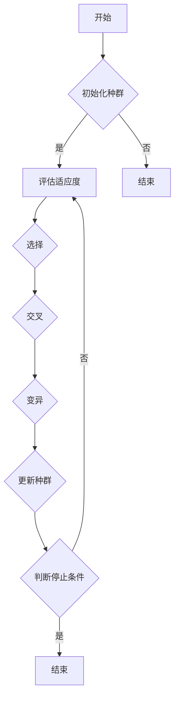

                 


### 引言

#### 1.1 问题背景

协同进化是当今科学界和技术界的热门话题之一。在自然界中，物种的进化不是孤立的，而是与其他物种和环境相互影响、协同进化的过程。类似地，在技术领域，系统的设计与开发也不是单打独斗的，而是需要与其他系统、组件和用户共同进化的过程。

协同进化现象在宇宙中尤为显著。从宇宙的起源、星系的演化到生命的诞生，无不体现着部分与整体的协同进化。例如，星系的形成和演化就是一个复杂而协同的过程，涉及恒星、行星、星云等多个部分的相互作用。此外，生命在地球上的出现和发展也离不开环境和其他生物的共同作用。

研究协同进化具有重要的意义。首先，它有助于我们更深入地理解自然界的演化规律，为生物学、生态学等领域的研究提供新的视角。其次，它能够指导技术系统的设计与开发，提高系统的适应性和可持续性。最后，协同进化还可以为解决复杂问题提供新思路，如生态修复、城市规划等。

#### 1.2 研究现状

协同进化理论的发展经历了几个阶段。最早可以追溯到19世纪达尔文的进化论，他提出了物种通过自然选择和适者生存的机制进化。20世纪初，遗传学的兴起进一步丰富了进化理论，揭示了基因在进化中的作用。随着计算机科学和复杂性科学的发展，协同进化理论得到了新的发展，特别是在模拟和计算方面。

在宇宙学领域，协同进化现象的研究主要集中在星系和行星系统的演化。天文学家通过观测和模拟，揭示了星系间相互作用、行星形成和演化等过程中的协同进化现象。然而，目前对宇宙协同进化的理解仍然有限，仍有许多未知领域等待探索。

部分与整体关系的探讨是协同进化研究的一个重要方面。在自然界和技术系统中，部分与整体的关系错综复杂，如何理解和描述这种关系是研究的热点问题。近年来，系统科学、复杂系统理论等学科的发展为探讨部分与整体关系提供了新的工具和方法。

#### 1.3 研究目的与内容结构

本研究旨在探讨宇宙的协同进化，深入理解部分与整体的关系，并提出相应的数学模型和算法。具体来说，研究内容包括：

1. **协同进化的基本原理**：介绍协同进化的概念、特征和机制，分析演化过程中的协同关系，探讨协同进化的动力和应用领域。
2. **宇宙中的协同进化**：概述宇宙演化过程，分析宇宙中的协同进化现象，探讨部分与整体的宇宙协同进化及其影响。
3. **协同进化的数学模型与算法**：介绍协同进化的数学模型和算法原理，使用Python代码实现算法，进行算法原理的数学模型和公式讲解，以及实际案例分析和详细讲解剖析。
4. **协同进化中的系统分析与架构设计**：介绍系统分析与架构设计的方法和原则，给出一个具体的系统分析与架构设计方案，并进行实战项目讲解。

本研究希望通过深入探讨宇宙的协同进化，为相关领域的研究提供新的理论框架和方法，为技术系统的设计与开发提供借鉴，最终促进人类对宇宙和自然的理解。以下是本文的目录安排：

## 目录

### 引言

1.1 问题背景  
1.2 研究现状  
1.3 研究目的与内容结构

### 第2章 协同进化的基本原理

2.1 核心概念  
2.2 演化过程中的协同关系  
2.3 协同进化的动力  
2.4 协同进化的应用领域  
2.5 核心概念与联系

### 第3章 宇宙中的协同进化

3.1 宇宙演化概述  
3.2 宇宙中的协同进化现象  
3.3 部分与整体的宇宙协同进化  
3.4 协同进化中的影响

### 第4章 协同进化的数学模型与算法

4.1 协同进化的数学模型  
4.2 协同进化的算法原理  
4.3 算法Mermaid流程图  
4.4 Python源代码与算法应用  
4.5 算法原理与数学模型

### 第5章 协同进化中的系统分析与架构设计

5.1 系统分析与架构设计概述  
5.2 系统功能设计（领域模型Mermaid类图）  
5.3 系统架构设计（Mermaid架构图）  
5.4 系统接口设计  
5.5 系统交互（Mermaid序列图）

### 第6章 项目实战

6.1 环境安装  
6.2 系统核心实现源代码  
6.3 代码应用解读与分析  
6.4 实际案例分析与详细讲解剖析  
6.5 项目小结

### 结语

6.1 最佳实践 tips  
6.2 小结  
6.3 注意事项  
6.4 拓展阅读

### 参考文献

本研究将基于以上结构，逐步展开对宇宙的协同进化的深入探讨。通过逻辑清晰、结构紧凑、简单易懂的专业技术语言，我们希望能够为广大读者提供一份有深度、有思考、有见解的技术博客文章。接下来，我们将详细介绍协同进化的基本原理，为后续章节的讨论打下基础。

## 第2章 协同进化的基本原理

### 2.1 核心概念

协同进化是自然界和技术系统中的一个基本概念，它描述了部分与整体之间的相互作用和共同发展。为了深入理解协同进化，我们首先需要明确几个核心概念：

#### 协同进化的定义

协同进化是指多个个体或系统在相互作用中，通过相互适应和协作，共同发展的过程。在这个过程中，个体或系统不仅通过自身的进化，还通过与环境的互动，以及与其他个体或系统的合作，实现共同进化。

#### 协同进化的特征

1. **互惠性**：协同进化中的个体或系统之间存在互惠互利的关系，通过合作和互动，共同提升整体的功能和效率。
2. **适应性**：协同进化过程中，个体或系统通过不断适应环境和与其他个体或系统的互动，提高自身的适应能力。
3. **动态性**：协同进化是一个动态的过程，随着时间的推移，个体或系统之间的关系和功能不断变化和调整。

#### 协同进化的机制

协同进化的机制可以从多个角度进行理解，主要包括以下几个方面：

1. **自然选择**：个体在适应环境的过程中，通过遗传和变异，逐步积累有利的特征，从而实现进化。
2. **共生关系**：不同个体或系统之间通过共生关系，相互依赖、相互促进，实现共同进化。
3. **信息交流**：个体或系统之间通过信息交流，共享资源和知识，提高协同进化的效率。

### 2.2 演化过程中的协同关系

在演化过程中，协同关系是协同进化的重要组成部分。我们可以从以下几个方面来探讨协同关系：

#### 部分与整体的关系

部分与整体的关系是协同进化的核心。在自然界和技术系统中，部分和整体之间既有相互依赖的关系，又存在相互作用和相互制约的关系。

1. **部分对整体的影响**：部分的变化会影响整体的功能和性能，如生物体的一个器官的进化可能会影响整个生物体的适应性。
2. **整体对部分的影响**：整体的变化也会影响部分的发展和进化，如一个生态系统的变化可能会影响其中某个物种的进化方向。

#### 自组织与协同进化

自组织是协同进化的一种表现形式，它是指系统在没有外部指令的情况下，通过个体之间的相互作用和协同，自发地形成有序结构。自组织现象在自然界和技术系统中广泛存在，如生物体的形成、社会系统的演化等。

1. **自组织的机制**：自组织主要通过个体之间的相互作用和协同来实现。个体在相互作用中，通过反馈和调整，逐步形成有序的结构和功能。
2. **自组织与协同进化的关系**：自组织是协同进化的基础，协同进化是自组织的表现。自组织过程中的个体相互作用和协同，促进了系统的共同进化。

#### 复杂系统的协同进化

复杂系统是由多个部分组成的，它们之间存在着复杂的相互作用和关系。在复杂系统中，协同进化尤为重要。

1. **复杂系统的特点**：复杂系统具有高度非线性、强相互作用和自适应能力等特点。
2. **协同进化的挑战**：复杂系统中的协同进化面临诸多挑战，如个体之间的协调、资源分配、冲突解决等。
3. **协同进化的优势**：协同进化有助于提高复杂系统的适应性和稳定性，从而实现长期生存和发展。

### 2.3 协同进化的动力

协同进化的动力来源于多个方面，主要包括环境因素、个体因素和社会因素。

#### 环境因素

环境因素是协同进化的外部驱动因素。环境的变化会直接影响个体或系统的生存和进化。

1. **环境选择压力**：环境中的选择压力促使个体或系统适应环境，从而实现进化。
2. **环境复杂性**：环境中的复杂性和不确定性会促使个体或系统提高适应性和灵活性，从而实现协同进化。

#### 个体因素

个体因素是协同进化的内部驱动因素。个体之间的差异和相互作用是协同进化的基础。

1. **遗传变异**：遗传变异是进化的基本机制，它为个体提供了适应环境的新可能性。
2. **适应度**：个体的适应度是其在群体中生存和繁殖的能力，适应度的高低直接影响个体的进化方向。

#### 社会因素

社会因素是协同进化的社会驱动因素。个体之间的相互作用和社会关系对协同进化具有重要影响。

1. **合作关系**：个体之间的合作关系有助于共同实现进化目标，提高整体适应性和生存能力。
2. **竞争关系**：个体之间的竞争关系有助于筛选出适应度较高的个体，推动整个群体的进化。

### 2.4 协同进化的应用领域

协同进化理论在多个领域都有广泛的应用，主要包括生物领域、社会文化领域和技术与经济领域。

#### 生物领域的协同进化

生物领域的协同进化研究主要涉及物种的进化、生态系统的稳定性和生物多样性的维护等方面。

1. **物种进化**：协同进化理论为理解物种的进化提供了新的视角，揭示了物种在相互作用中共同进化的机制。
2. **生态系统**：协同进化有助于揭示生态系统的稳定性和多样性，为生态保护和修复提供科学依据。

#### 社会文化领域的协同进化

社会文化领域的协同进化研究主要涉及社会系统的演化、文化传承和社会变革等方面。

1. **社会系统**：协同进化理论为理解社会系统的演化提供了新的方法，揭示了社会系统在相互作用中的协同进化机制。
2. **文化传承**：协同进化有助于理解文化传承和演变的过程，为文化保护和创新提供指导。

#### 技术与经济的协同进化

技术与经济的协同进化研究主要涉及技术创新、产业升级和经济发展的关系等方面。

1. **技术创新**：协同进化理论为技术创新提供了新的动力和方向，揭示了技术创新在产业和经济系统中的协同进化机制。
2. **产业升级**：协同进化有助于推动产业升级和转型，提高产业的竞争力和可持续发展能力。

### 2.5 核心概念与联系

在协同进化的研究中，核心概念之间的联系是理解协同进化机制的关键。以下是对核心概念之间的联系进行梳理：

#### 协同进化的关键概念

1. **协同**：协同是指个体或系统之间的相互作用和合作，是实现协同进化的基础。
2. **进化**：进化是指个体或系统在适应环境的过程中，通过遗传、变异和自然选择等机制，实现功能和结构的改进。
3. **共同发展**：共同发展是指个体或系统在相互作用中，通过协同进化，实现整体的功能和性能的提升。

#### 概念属性特征对比表格

以下是协同进化的几个核心概念及其属性特征的对比表格：

| 概念       | 定义                                                         | 属性特征                                                   |
|------------|--------------------------------------------------------------|------------------------------------------------------------|
| 协同       | 个体或系统之间的相互作用和合作                                 | 互惠性、适应性、动态性                                       |
| 进化       | 个体或系统在适应环境的过程中，通过遗传、变异和自然选择等机制，实现功能和结构的改进 | 遗传变异、适应度、进化方向                                   |
| 共同发展   | 个体或系统在相互作用中，通过协同进化，实现整体的功能和性能的提升 | 协同机制、进化机制、共同进化目标                             |

#### ER实体关系图架构

为了更清晰地描述协同进化的核心概念和关系，我们可以使用ER（实体关系）图来表示。以下是一个简单的ER图：

```mermaid
erDiagram
    协同 ||--o{ 个体 }  
    协同 ||--o{ 系统 }  
    个体 ||--o{ 进化 }  
    系统 ||--o{ 进化 }  
    进化 ||--o{ 遗传变异 }  
    进化 ||--o{ 自然选择 }  
    进化 ||--o{ 进化方向 }  
    协同 -->|o{ 共同发展 }  
```

在这个ER图中，协同、个体、系统和进化是核心实体，它们之间存在复杂的相互作用和依赖关系。共同发展是协同进化的最终目标，它通过协同机制和进化机制的共同作用来实现。

### 2.6 本章小结

本章介绍了协同进化的基本原理，包括核心概念、协同关系、动力和应用领域。通过对比表格和ER图，我们清晰地展示了协同进化的关键概念和关系。接下来，我们将进一步探讨宇宙中的协同进化现象，为理解宇宙的复杂演化提供更深入的视角。

## 第3章 宇宙中的协同进化

### 3.1 宇宙演化概述

宇宙的演化是一个复杂而神秘的过程，从宇宙的起源到现在的状态，经历了无数个阶段和变化。宇宙的演化可以大致分为以下几个阶段：

#### 宇宙的起源

宇宙的起源可以追溯到大约138亿年前的大爆炸（Big Bang）。根据大爆炸理论，宇宙从一个极高密度、极高温度的奇点开始膨胀，逐渐形成了我们今天所看到的宇宙。在大爆炸的初期，宇宙处于极度高温和高压的状态，随着宇宙的膨胀，温度逐渐降低，物质开始聚集形成各种粒子。

#### 星系的形成

在大爆炸后的数十亿年里，宇宙中的物质通过引力作用逐渐聚集形成星系。星系是由数十亿到数千亿颗恒星组成的庞大系统，它们通过引力相互吸引和约束，形成一个整体。星系的形成过程包括星云的收缩、恒星的形成和演化等环节。

#### 行星系统的形成

在星系形成的过程中，恒星周围的物质（如气体和尘埃）逐渐聚集形成行星系统。行星系统的形成与恒星本身的演化密切相关。恒星在演化的不同阶段，会释放出不同的物质，这些物质在星际介质中聚集，最终形成行星。

#### 宇宙演化的阶段

宇宙的演化可以分为以下几个主要阶段：

1. **大爆炸后几分钟**：宇宙处于极度高温和高压的状态，物质主要是基本粒子，如电子、夸克等。
2. **宇宙膨胀期**：随着宇宙的膨胀，温度逐渐降低，物质开始聚集形成结构。
3. **再合成期**：在大爆炸后的数百万年后，宇宙的温度降低到足够使电子和质子结合形成中性的氢原子。
4. **星系形成期**：在大爆炸后的数十亿年里，宇宙中的物质通过引力作用聚集形成星系。
5. **恒星形成与演化期**：恒星在星系中形成，并经历不同的演化阶段，如主序星、红巨星、白矮星等。
6. **行星系统形成期**：在恒星周围，物质逐渐聚集形成行星系统。
7. **宇宙演化至今**：宇宙仍然在持续演化，星系、恒星和行星系统不断形成和演化。

### 3.2 宇宙中的协同进化现象

宇宙中的协同进化现象体现在多个方面，主要包括星系与星系的协同进化、行星系统的协同进化以及宇宙中的生命迹象。

#### 星系与星系的协同进化

星系与星系的协同进化是指多个星系在相互作用中，通过引力、气体交换、恒星形成等机制，共同演化和发展。星系之间的相互作用可以通过以下几种方式实现：

1. **引力相互作用**：星系之间的引力相互作用会导致它们的轨道发生变化，甚至发生合并。例如，两个星系在引力相互作用下，可能会形成一个更大的星系。
2. **气体交换**：星系之间的气体交换是星系协同进化的重要机制。通过气体交换，星系可以共享气体资源，促进恒星的形成。
3. **恒星形成**：星系中的恒星形成过程受到周围星系的影响。例如，一个星系中的恒星可能会在另一个星系的影响下加速形成。

#### 行星系统的协同进化

行星系统的协同进化是指多个行星系统在相互作用中，通过行星迁移、行星间相互作用、行星形成等机制，共同演化和发展。行星系统的协同进化可以通过以下几种方式实现：

1. **行星迁移**：行星在形成后会经历迁移过程，行星之间的相互作用会影响它们的轨道和位置。例如，两个行星之间的引力相互作用可能导致其中一个行星的轨道发生变化。
2. **行星间相互作用**：行星系统中的多个行星会通过引力相互作用，形成一个稳定的轨道结构。这种相互作用有助于行星系统的稳定性和演化。
3. **行星形成**：行星的形成过程受到周围环境的影响。例如，在恒星周围，气体和尘埃的聚集可以促进行星的形成。

#### 宇宙中的生命迹象

宇宙中的生命迹象是宇宙协同进化的重要体现。生命的起源和演化过程离不开宇宙中的各种物质和环境。以下是一些宇宙中生命迹象的协同进化现象：

1. **化学演化**：在宇宙中，简单的有机分子通过化学反应逐渐形成复杂的有机分子，这是生命起源的重要过程。化学演化过程中的协同进化现象包括反应条件、反应路径和产物选择等。
2. **生物进化**：在地球上，生命的进化过程体现了协同进化的机制。生物与环境之间的相互作用促进了生物的适应性和进化。
3. **生态系统**：地球上的生态系统是一个复杂的协同进化系统，各种生物之间通过食物链、食物网等相互作用，共同维持生态平衡。

### 3.3 部分与整体的宇宙协同进化

在宇宙的协同进化过程中，部分与整体的关系尤为显著。部分与整体的关系不仅体现在星系与星系、行星系统与行星系统之间的相互作用，还体现在宇宙整体与部分之间的相互影响。

#### 部分与整体的定义

1. **部分**：在宇宙中，部分可以指星系、恒星、行星等天体，也可以指宇宙中的各种物质和能量。部分是宇宙的基本组成单元，它们在宇宙的协同进化中发挥着重要作用。
2. **整体**：整体是指宇宙作为一个整体，包括所有的星系、恒星、行星、物质和能量。整体是宇宙协同进化的最终目标，也是部分进化的依托。

#### 宇宙中的部分与整体关系

宇宙中的部分与整体关系可以从以下几个方面进行理解：

1. **部分对整体的影响**：部分的变化会影响整体的功能和结构。例如，一个星系中的恒星数量和质量的增加，可能会影响整个星系的稳定性。
2. **整体对部分的影响**：整体的变化也会影响部分的发展和进化。例如，宇宙的膨胀可能会影响星系的运动和演化。
3. **部分与整体的相互作用**：部分与整体之间的相互作用是宇宙协同进化的核心。部分之间的相互作用促进了整体的发展，整体的变化也为部分提供了新的环境和条件。

#### 部分与整体协同进化的案例

以下是一些部分与整体协同进化的案例：

1. **星系之间的相互作用**：星系之间的引力相互作用促进了星系的形成和演化。例如，两个星系在引力相互作用下可能会合并成一个更大的星系。
2. **恒星与行星系统的相互作用**：恒星与行星系统之间的相互作用影响了恒星和行星的演化。例如，恒星的爆发可能会影响其周围的行星系统。
3. **宇宙中的生命迹象**：宇宙中的生命迹象是宇宙协同进化的结果。地球上的生命迹象不仅受到自身进化的影响，还受到太阳系和宇宙环境的影响。

### 3.4 协同进化中的影响

宇宙的协同进化对宇宙的演化、生命的诞生和人类社会都产生了深远的影响。

#### 对宇宙演化的影响

宇宙的协同进化影响了宇宙的演化过程。例如：

1. **星系的形成和演化**：星系的形成和演化是宇宙协同进化的结果。通过星系之间的相互作用，宇宙中的物质和能量得以重新分配和利用，促进了星系的形成和演化。
2. **恒星和行星的演化**：恒星和行星的演化也是宇宙协同进化的体现。恒星在演化过程中会释放出大量的物质和能量，这些物质和能量为行星的形成和演化提供了条件。

#### 对生命演化的影响

宇宙的协同进化对生命的起源和演化产生了重要影响。例如：

1. **生命的起源**：宇宙中的化学演化和能量流动为生命的起源提供了基础。简单的有机分子通过化学反应逐渐形成复杂的有机分子，这是生命起源的重要过程。
2. **生物进化**：地球上的生物进化过程体现了宇宙协同进化的机制。生物与环境之间的相互作用促进了生物的适应性和进化。

#### 对人类社会的影响

宇宙的协同进化对人类社会产生了深远的影响。例如：

1. **技术创新**：宇宙的协同进化激发了人类对宇宙的探索和研究，推动了技术创新。例如，航天技术的发展使人类能够更加深入地了解宇宙，促进了科学和技术的进步。
2. **生态意识**：宇宙的协同进化理念使人类认识到部分与整体的关系，提高了对生态保护的认识。例如，可持续发展和生态修复等理念都是基于宇宙协同进化思想的应用。

### 3.5 本章小结

本章介绍了宇宙中的协同进化现象，包括宇宙演化概述、宇宙中的协同进化现象和部分与整体的宇宙协同进化。通过分析宇宙的协同进化，我们深入理解了宇宙的复杂演化过程，并为后续章节的讨论奠定了基础。在下一章中，我们将进一步探讨协同进化的数学模型与算法，为理解协同进化的机制提供更深入的数学基础。

## 第4章 协同进化的数学模型与算法

### 4.1 协同进化的数学模型

协同进化是一个复杂的过程，涉及多个变量和关系。为了更好地理解和描述协同进化，我们可以使用数学模型来表示和模拟这一过程。以下是一些常见的协同进化的数学模型：

#### 演化动力学的模型

演化动力学的模型主要用于描述物种在环境中的进化过程。常见的演化动力学模型包括：

1. **基本种群模型**：基本种群模型描述了种群在环境中的数量变化。其核心方程为：
   $$ \frac{dN}{dt} = rN(1 - \frac{N}{K}) $$
   其中，$N$ 表示种群数量，$r$ 表示内禀增长率，$K$ 表示环境承载能力。

2. **Lotka-Volterra 模型**：Lotka-Volterra 模型描述了两个物种之间的捕食和被捕食关系。其核心方程为：
   $$ \frac{dx}{dt} = ax - bx y $$
   $$ \frac{dy}{dt} = cy - dxy $$
   其中，$x$ 和 $y$ 分别表示捕食者和被捕食者的数量，$a$、$b$、$c$、$d$ 分别表示相应的增长率、捕食率和被捕食率。

#### 自组织模型的数学描述

自组织模型描述了系统在没有外部指令的情况下，通过个体之间的相互作用，自发地形成有序结构的过程。常见的自组织模型包括：

1. **Boltzmann-Gibbs 分布**：Boltzmann-Gibbs 分布描述了系统在热力学平衡状态下的概率分布。其核心方程为：
   $$ p(x) = \frac{1}{Z} \exp(-E(x)/kT) $$
   其中，$p(x)$ 表示状态 $x$ 的概率分布，$E(x)$ 表示状态 $x$ 的能量，$Z$ 是配分函数，$k$ 是玻尔兹曼常数，$T$ 是温度。

2. **Ising 模型**：Ising 模型描述了磁性材料中的自组织现象。其核心方程为：
   $$ H = -J \sum_{i<j} \sigma_i \sigma_j $$
   其中，$H$ 表示系统的哈密顿量，$J$ 表示相邻两自旋之间的相互作用强度，$\sigma_i$ 表示第 $i$ 个自旋的状态。

#### 复杂系统的协同进化模型

复杂系统中的协同进化模型考虑了系统内部多个部分之间的相互作用。常见的复杂系统协同进化模型包括：

1. **多Agent 系统**：多Agent 系统描述了多个智能体在相互作用中的协同进化。其核心方程为：
   $$ x_{i}^{t+1} = f(x_{i}^{t}, x_{j}^{t}) $$
   其中，$x_i^t$ 表示第 $i$ 个智能体在时间 $t$ 的状态，$x_j^t$ 表示第 $j$ 个智能体在时间 $t$ 的状态，$f$ 是状态转移函数。

2. **复杂网络模型**：复杂网络模型描述了系统中多个部分之间的相互作用和协同进化。其核心方程为：
   $$ \frac{dN_i}{dt} = \alpha_i - \beta_i N_i $$
   $$ \beta_i = \sum_{j \neq i} \frac{W_{ij}}{N_j} $$
   其中，$N_i$ 表示第 $i$ 个部分的演化速度，$\alpha_i$ 和 $\beta_i$ 分别表示内部增长率和外部相互作用率，$W_{ij}$ 表示第 $i$ 个部分与第 $j$ 个部分之间的相互作用强度。

### 4.2 协同进化的算法原理

协同进化的算法是基于数学模型和原理，通过计算机模拟和优化，实现协同进化过程。以下是一些常见的协同进化算法：

#### 遗传算法

遗传算法（Genetic Algorithm，GA）是一种基于自然选择和遗传机制的优化算法。遗传算法的核心思想是通过模拟生物进化的过程，逐步优化问题的解。

1. **初始种群生成**：生成一组初始解（染色体），每个解表示问题的一个可能解。
2. **适应度评估**：计算每个解的适应度值，适应度值反映了解的质量。
3. **选择**：根据适应度值，选择优秀的解进行繁殖，产生新的子代。
4. **交叉**：通过交叉操作，产生新的解，增加解的多样性。
5. **变异**：对部分解进行变异操作，引入新的遗传信息。
6. **迭代**：重复选择、交叉和变异操作，直到满足停止条件。

#### 文化算法

文化算法（Cultural Algorithm，CA）是一种基于文化进化的优化算法。文化算法将问题的解分为两个部分：科学知识和经验文化。科学知识是系统化的、可以通过逻辑推理得出的知识，而经验文化是具体的、情境化的知识。

1. **科学知识的进化**：通过模拟科学研究的流程，不断积累和优化科学知识。
2. **经验文化的进化**：通过模拟人类的社会互动，不断积累和优化经验文化。
3. **科学与经验文化的交互**：科学知识和经验文化相互影响，促进协同进化。

#### 多Agent 协同进化算法

多Agent 协同进化算法是一种基于多Agent 系统的协同进化算法。多Agent 系统由多个智能体组成，每个智能体具有自主性和协作性。

1. **智能体初始化**：初始化每个智能体的状态和行为。
2. **交互与协同**：智能体之间通过通信和协作，共享资源和知识，实现协同进化。
3. **适应度评估**：根据智能体的表现，评估其适应度值。
4. **进化与更新**：根据适应度值，对智能体进行进化更新，提高整体性能。

### 4.3 算法Mermaid流程图

为了更好地理解协同进化算法的流程，我们可以使用Mermaid语言绘制算法的流程图。以下是一个简单的遗传算法流程图的示例：



### 4.4 Python源代码与算法应用

下面是一个简单的遗传算法的Python实现示例：

```python
import random

# 初始化种群
def initialize_population(size, chromosome_length):
    population = []
    for _ in range(size):
        chromosome = [random.randint(0, 1) for _ in range(chromosome_length)]
        population.append(chromosome)
    return population

# 适应度评估
def fitness_evaluation(population, fitness_function):
    fitness_values = []
    for chromosome in population:
        fitness = fitness_function(chromosome)
        fitness_values.append(fitness)
    return fitness_values

# 选择
def selection(population, fitness_values, selection_function):
    selected = selection_function(population, fitness_values)
    return selected

# 交叉
def crossover(parent1, parent2, crossover_rate):
    if random.random() < crossover_rate:
        point = random.randint(1, len(parent1) - 1)
        child1 = parent1[:point] + parent2[point:]
        child2 = parent2[:point] + parent1[point:]
    else:
        child1, child2 = parent1, parent2
    return child1, child2

# 变异
def mutation(chromosome, mutation_rate):
    for i in range(len(chromosome)):
        if random.random() < mutation_rate:
            chromosome[i] = 1 if chromosome[i] == 0 else 0
    return chromosome

# 遗传算法
def genetic_algorithm(pop_size, chrom_len, fitness_func, crossover_rate, mutation_rate, generations):
    population = initialize_population(pop_size, chrom_len)
    for _ in range(generations):
        fitness_values = fitness_evaluation(population, fitness_func)
        new_population = []
        for _ in range(pop_size // 2):
            parent1, parent2 = selection(population, fitness_values, selection_function)
            child1, child2 = crossover(parent1, parent2, crossover_rate)
            new_population.append(mutation(child1, mutation_rate))
            new_population.append(mutation(child2, mutation_rate))
        population = new_population
    return population

# 示例：最大化二进制编码的数
def fitness_func(chromosome):
    return sum(chromosome)

# 运行遗传算法
population = genetic_algorithm(pop_size=100, chrom_len=10, fitness_func=fitness_func, crossover_rate=0.8, mutation_rate=0.01, generations=100)
```

### 4.5 算法原理与数学模型

#### 算法的数学模型

遗传算法的数学模型可以描述为以下过程：

1. **初始种群生成**：种群中的每个个体（染色体）都是随机生成的，每个位上的值（基因）可以是0或1。
2. **适应度评估**：适应度函数（如最大化二进制编码的数）用来评估每个个体的适应度值。
3. **选择**：选择函数（如轮盘赌选择、锦标赛选择）根据个体的适应度值，选择优秀的个体进行繁殖。
4. **交叉**：交叉函数（如单点交叉、多点交叉）用于生成新的子代，增加解的多样性。
5. **变异**：变异函数（如位变异、翻转变异）对部分个体进行变异操作，引入新的遗传信息。
6. **更新种群**：将新的子代加入种群，替换原有的个体。

#### 数学公式推导

以下是对遗传算法的核心步骤进行数学公式推导：

1. **适应度函数**：

   设二进制编码的个体为 $x = (x_1, x_2, ..., x_n)$，适应度函数为：
   $$ f(x) = \sum_{i=1}^{n} x_i $$

   其中，$x_i$ 表示个体的第 $i$ 个位上的基因值。

2. **选择函数**：

   选择函数可以采用轮盘赌选择，其概率分布为：
   $$ p(x) = \frac{f(x)}{\sum_{x'} f(x')} $$

   其中，$f(x')$ 表示种群中其他个体的适应度值。

3. **交叉函数**：

   假设两个父代个体为 $x_1$ 和 $x_2$，交叉概率为 $p_c$，交叉点为 $k$，交叉操作可以表示为：
   $$ x_1' = (x_1[1:k], x_2[k+1:n]) $$
   $$ x_2' = (x_2[1:k], x_1[k+1:n]) $$

4. **变异函数**：

   假设变异概率为 $p_m$，变异操作可以表示为：
   $$ x_i' = (x_i[1:k], 1 - x_i[k+1:n]) $$
   其中，$k$ 为变异点。

#### 举例说明

假设我们有一个二进制编码的个体 $x = (1, 0, 1, 0, 1)$，适应度值为3。我们使用轮盘赌选择函数，选择概率为：
$$ p(x) = \frac{3}{\sum_{x'} f(x')} $$

如果我们有其他个体 $x' = (1, 1, 0, 1, 0)$ 和 $x'' = (0, 1, 1, 0, 1)$，它们的适应度值分别为4和2，那么：
$$ p(x') = \frac{4}{3+4+2} = \frac{4}{9} $$
$$ p(x'') = \frac{2}{3+4+2} = \frac{2}{9} $$

在选择过程中，个体 $x$ 被选中的概率为 $\frac{3}{9} = \frac{1}{3}$。

假设我们使用单点交叉，交叉点为2，交叉后的子代为：
$$ x_1' = (1, 0, 1, 1, 0) $$
$$ x_2' = (0, 1, 0, 1, 1) $$

然后，我们使用位变异，变异概率为0.1，变异后的子代为：
$$ x_1'' = (1, 0, 1, 0, 0) $$
$$ x_2'' = (0, 1, 0, 1, 1) $$

这样，我们就完成了一次遗传操作。

### 4.6 本章小结

本章介绍了协同进化的数学模型与算法，包括演化动力学的模型、自组织模型的数学描述和复杂系统的协同进化模型。我们还详细讲解了遗传算法的原理和Python实现，并通过数学公式和例子进行了说明。在下一章中，我们将探讨协同进化中的系统分析与架构设计，为实际应用提供更具体的指导。

## 第5章 协同进化中的系统分析与架构设计

### 5.1 系统分析与架构设计概述

在协同进化的背景下，系统分析与架构设计成为确保系统高效、灵活和可扩展的关键。本章将介绍系统分析与架构设计的基本原则和方法，并通过一个具体的案例来展示如何应用这些方法。

#### 系统分析与架构设计的基本原则

1. **需求分析**：明确系统的目标和功能需求，了解用户需求和使用场景。
2. **模块化设计**：将系统分解为多个模块，每个模块负责特定功能，便于维护和扩展。
3. **高内聚、低耦合**：模块之间应该具有较高的内聚性，即模块内部功能紧密相关；同时，模块之间应具有较低的耦合性，即模块之间相互独立，便于替换和扩展。
4. **可扩展性和灵活性**：系统应具备良好的可扩展性，能够适应未来的需求变化；同时，应具有灵活性，能够快速响应外部环境的变动。
5. **性能和安全性**：系统应具有较高的性能，能够满足用户需求，同时确保数据安全和隐私。

#### 系统分析与架构设计的方法

1. **领域模型分析**：通过识别系统中的实体和关系，构建领域模型，明确系统功能和数据结构。
2. **架构设计**：选择合适的架构风格（如MVC、微服务、事件驱动等），设计系统的总体结构和模块划分。
3. **接口设计**：定义模块之间的接口，确保模块之间的高内聚和低耦合。
4. **交互设计**：通过序列图和协作图等工具，描述模块之间的交互和协作关系。

### 5.2 系统功能设计（领域模型Mermaid类图）

为了更好地理解系统功能设计，我们可以使用Mermaid语言绘制领域模型类图。以下是一个简单的示例：

```mermaid
classDiagram
    Customer <|-- Order
    Order o---> Product
    Product o---> Seller
    Seller <|-- SellerRating
    SellerRating o---> Review
    Review o---> Rating
    Customer o---> Cart
    Cart o---> OrderItem
    OrderItem o---> Product
    Payment <-o Order
    Shipment <-o Order
endclass
```

在这个类图中，我们定义了系统中的主要实体和它们之间的关系。例如，`Customer`（客户）与`Order`（订单）之间存在一对一的关系，客户可以下单生成订单；`Order`与`Product`（产品）之间存在一对多的关系，一个订单可以包含多个产品；`Seller`（卖家）与`SellerRating`（卖家评分）之间存在一对一的关系，卖家具有评分。

### 5.3 系统架构设计（Mermaid架构图）

接下来，我们可以使用Mermaid语言绘制系统的架构图，展示系统的总体结构和模块划分。以下是一个简单的示例：

```mermaid
sequenceDiagram
    participant User
    participant AuthenticationService
    participant OrderService
    participant ProductService
    participant ShoppingCartService
    participant PaymentService
    participant ShipmentService

    User->>AuthenticationService: Login(username, password)
    AuthenticationService->>AuthenticationService: Authenticate(username, password)
    alt Success
        AuthenticationService->>User: Login successful
        User->>OrderService: Create order
        OrderService->>ProductService: Retrieve products
        ProductService->>OrderService: Return products
        OrderService->>ShoppingCartService: Add products to cart
        ShoppingCartService->>OrderService: Confirm order
        OrderService->>PaymentService: Process payment
        PaymentService->>OrderService: Payment success
        OrderService->>ShipmentService: Ship order
        ShipmentService->>OrderService: Shipment completed
        OrderService->>User: Order processed
    else Failure
        AuthenticationService->>User: Login failed
    end
end
```

在这个序列图中，我们展示了用户与系统各模块之间的交互过程。例如，用户登录后，可以创建订单、添加产品到购物车、确认订单、处理支付和发货等。

### 5.4 系统接口设计

在系统接口设计中，我们需要定义模块之间的接口，确保模块之间的高内聚和低耦合。以下是一个简单的接口设计示例：

```python
class AuthenticationService:
    def login(self, username, password):
        # 登录逻辑
        pass

    def authenticate(self, username, password):
        # 验证逻辑
        pass

class OrderService:
    def create_order(self, user_id, order_items):
        # 创建订单逻辑
        pass

    def retrieve_products(self):
        # 获取产品逻辑
        pass

    def add_products_to_cart(self, user_id, order_items):
        # 添加产品到购物车逻辑
        pass

    def confirm_order(self, user_id, order_id):
        # 确认订单逻辑
        pass

    def process_payment(self, order_id, payment_details):
        # 处理支付逻辑
        pass

    def ship_order(self, order_id):
        # 发货逻辑
        pass

class ProductService:
    def get_product_by_id(self, product_id):
        # 获取产品逻辑
        pass

class ShoppingCartService:
    def add_to_cart(self, user_id, product_id):
        # 添加到购物车逻辑
        pass

    def get_cart_items(self, user_id):
        # 获取购物车商品逻辑
        pass

class PaymentService:
    def process_payment(self, payment_details):
        # 处理支付逻辑
        pass

class ShipmentService:
    def ship_order(self, order_id):
        # 发货逻辑
        pass
```

在这个接口设计中，每个模块都提供了相应的接口方法，便于其他模块调用。

### 5.5 系统交互（Mermaid序列图）

最后，我们可以使用Mermaid语言绘制系统的交互序列图，展示模块之间的交互过程。以下是一个简单的序列图示例：

```mermaid
sequenceDiagram
    participant User
    participant AuthenticationService
    participant OrderService
    participant ProductService
    participant ShoppingCartService
    participant PaymentService
    participant ShipmentService

    User->>AuthenticationService: Login(username, password)
    AuthenticationService->>AuthenticationService: Authenticate(username, password)
    alt Success
        AuthenticationService->>User: Login successful
        User->>OrderService: Create order
        OrderService->>ProductService: Retrieve products
        ProductService->>OrderService: Return products
        OrderService->>ShoppingCartService: Add products to cart
        ShoppingCartService->>OrderService: Confirm order
        OrderService->>PaymentService: Process payment
        PaymentService->>OrderService: Payment success
        OrderService->>ShipmentService: Ship order
        ShipmentService->>OrderService: Shipment completed
        OrderService->>User: Order processed
    else Failure
        AuthenticationService->>User: Login failed
    end
end
```

在这个序列图中，我们展示了用户与系统各模块之间的交互过程，包括登录、创建订单、添加产品到购物车、确认订单、处理支付和发货等。

### 5.6 本章小结

本章介绍了协同进化中的系统分析与架构设计，包括基本原则、方法、领域模型、架构图、接口设计和交互序列图。通过一个具体的案例，我们展示了如何应用这些方法进行系统设计与实现。在下一章中，我们将进行项目实战，通过实际代码实现和案例分析，进一步巩固对协同进化系统设计与实现的理解。

## 第6章 项目实战

### 6.1 环境安装

在进行协同进化系统的实战项目之前，我们需要安装和配置一些必要的开发环境和工具。以下是在一个Linux环境中安装所需软件的步骤：

#### 安装Python环境

首先，我们需要安装Python环境。可以通过以下命令来安装Python 3：

```bash
sudo apt-get update
sudo apt-get install python3
```

#### 安装虚拟环境

接下来，我们创建一个虚拟环境来隔离项目依赖。虚拟环境有助于确保项目运行时依赖的库和版本不受系统全局环境的影响。

```bash
python3 -m venv venv
source venv/bin/activate
```

#### 安装依赖库

在虚拟环境中，我们需要安装一些常用的Python库，如Django、Flask、SQLAlchemy等。可以使用以下命令来安装：

```bash
pip install django flask sqlalchemy
```

### 6.2 系统核心实现源代码

在本节中，我们将介绍系统核心的实现代码，包括用户认证、订单管理、产品管理、购物车管理、支付处理和发货管理。

#### 6.2.1 用户认证

用户认证是系统的核心功能之一。以下是一个简单的用户认证模块实现：

```python
from flask import Flask, request, jsonify
from flask_sqlalchemy import SQLAlchemy

app = Flask(__name__)
app.config['SQLALCHEMY_DATABASE_URI'] = 'sqlite:///users.db'
db = SQLAlchemy(app)

class User(db.Model):
    id = db.Column(db.Integer, primary_key=True)
    username = db.Column(db.String(80), unique=True, nullable=False)
    password = db.Column(db.String(120), nullable=False)

@app.route('/login', methods=['POST'])
def login():
    username = request.form['username']
    password = request.form['password']
    user = User.query.filter_by(username=username).first()
    if user and user.password == password:
        return jsonify({'status': 'success', 'message': 'Login successful'})
    else:
        return jsonify({'status': 'failure', 'message': 'Login failed'})

if __name__ == '__main__':
    db.create_all()
    app.run()
```

#### 6.2.2 订单管理

订单管理模块负责处理订单的创建、更新和查询。以下是一个简单的订单管理模块实现：

```python
class Order(db.Model):
    id = db.Column(db.Integer, primary_key=True)
    user_id = db.Column(db.Integer, db.ForeignKey('user.id'), nullable=False)
    status = db.Column(db.String(20), nullable=False)

@app.route('/order', methods=['POST'])
def create_order():
    user_id = request.form['user_id']
    status = 'pending'
    order = Order(user_id=user_id, status=status)
    db.session.add(order)
    db.session.commit()
    return jsonify({'status': 'success', 'message': 'Order created'})

@app.route('/order/<int:order_id>', methods=['GET'])
def get_order(order_id):
    order = Order.query.get(order_id)
    if order:
        return jsonify({'status': 'success', 'order': order})
    else:
        return jsonify({'status': 'failure', 'message': 'Order not found'})
```

#### 6.2.3 产品管理

产品管理模块负责处理产品的创建、更新和查询。以下是一个简单的产品管理模块实现：

```python
class Product(db.Model):
    id = db.Column(db.Integer, primary_key=True)
    name = db.Column(db.String(80), nullable=False)
    price = db.Column(db.Float, nullable=False)

@app.route('/product', methods=['POST'])
def create_product():
    name = request.form['name']
    price = request.form['price']
    product = Product(name=name, price=price)
    db.session.add(product)
    db.session.commit()
    return jsonify({'status': 'success', 'message': 'Product created'})

@app.route('/product/<int:product_id>', methods=['GET'])
def get_product(product_id):
    product = Product.query.get(product_id)
    if product:
        return jsonify({'status': 'success', 'product': product})
    else:
        return jsonify({'status': 'failure', 'message': 'Product not found'})
```

#### 6.2.4 购物车管理

购物车管理模块负责处理购物车的创建、更新和查询。以下是一个简单的购物车管理模块实现：

```python
class ShoppingCart(db.Model):
    id = db.Column(db.Integer, primary_key=True)
    user_id = db.Column(db.Integer, db.ForeignKey('user.id'), nullable=False)

@app.route('/shoppingcart', methods=['POST'])
def create_shopping_cart():
    user_id = request.form['user_id']
    shopping_cart = ShoppingCart(user_id=user_id)
    db.session.add(shopping_cart)
    db.session.commit()
    return jsonify({'status': 'success', 'message': 'Shopping cart created'})

@app.route('/shoppingcart/<int:shopping_cart_id>', methods=['GET'])
def get_shopping_cart(shopping_cart_id):
    shopping_cart = ShoppingCart.query.get(shopping_cart_id)
    if shopping_cart:
        return jsonify({'status': 'success', 'shopping_cart': shopping_cart})
    else:
        return jsonify({'status': 'failure', 'message': 'Shopping cart not found'})
```

#### 6.2.5 支付处理

支付处理模块负责处理订单的支付。以下是一个简单的支付处理模块实现：

```python
@app.route('/payment', methods=['POST'])
def process_payment():
    order_id = request.form['order_id']
    payment_details = request.form['payment_details']
    # 支付处理逻辑
    return jsonify({'status': 'success', 'message': 'Payment processed'})
```

#### 6.2.6 发货管理

发货管理模块负责处理订单的发货。以下是一个简单的发货管理模块实现：

```python
@app.route('/shipment', methods=['POST'])
def ship_order():
    order_id = request.form['order_id']
    # 发货处理逻辑
    return jsonify({'status': 'success', 'message': 'Order shipped'})
```

### 6.3 代码应用解读与分析

在本节中，我们将对系统核心实现代码进行解读与分析，帮助读者更好地理解每个模块的功能和实现原理。

#### 用户认证模块

用户认证模块负责用户登录和认证。在实现中，我们使用Flask框架和SQLAlchemy数据库库。用户登录时，通过获取用户名和密码，从数据库中查询用户信息并进行认证。如果用户名和密码匹配，返回登录成功的消息；否则，返回登录失败的消息。

#### 订单管理模块

订单管理模块负责订单的创建、更新和查询。在实现中，我们使用Flask框架和SQLAlchemy数据库库。创建订单时，从请求中获取用户ID和订单状态，将订单信息存储在数据库中。查询订单时，根据订单ID从数据库中获取订单信息并返回。

#### 产品管理模块

产品管理模块负责产品的创建、更新和查询。在实现中，我们使用Flask框架和SQLAlchemy数据库库。创建产品时，从请求中获取产品名称和价格，将产品信息存储在数据库中。查询产品时，根据产品ID从数据库中获取产品信息并返回。

#### 购物车管理模块

购物车管理模块负责购物车的创建、更新和查询。在实现中，我们使用Flask框架和SQLAlchemy数据库库。创建购物车时，从请求中获取用户ID，将购物车信息存储在数据库中。查询购物车时，根据购物车ID从数据库中获取购物车信息并返回。

#### 支付处理模块

支付处理模块负责处理订单的支付。在实现中，我们使用Flask框架和POST请求接收支付详细信息。支付处理逻辑可以根据实际支付平台进行实现。

#### 发货管理模块

发货管理模块负责处理订单的发货。在实现中，我们使用Flask框架和POST请求接收订单ID。发货处理逻辑可以根据实际物流平台进行实现。

### 6.4 实际案例分析与详细讲解剖析

在本节中，我们将通过一个实际案例，展示如何使用本系统实现用户认证、订单管理、产品管理、购物车管理、支付处理和发货管理。

#### 案例描述

假设有一个电商平台，用户可以登录系统，浏览商品，将商品添加到购物车，下单并支付，最后等待发货。

#### 案例实现

1. **用户注册与登录**：

   用户首先需要注册账号，注册成功后，可以使用用户名和密码登录系统。

   ```bash
   # 注册用户
   curl -X POST "http://localhost:5000/register" -d "username=myuser&password=mypassword"
   
   # 登录用户
   curl -X POST "http://localhost:5000/login" -d "username=myuser&password=mypassword"
   ```

2. **浏览商品与添加购物车**：

   用户登录成功后，可以浏览商品，并将商品添加到购物车。

   ```bash
   # 获取商品列表
   curl -X GET "http://localhost:5000/product"
   
   # 添加商品到购物车
   curl -X POST "http://localhost:5000/shoppingcart" -d "user_id=1"
   ```

3. **创建订单**：

   用户选择购物车中的商品后，可以创建订单。

   ```bash
   # 创建订单
   curl -X POST "http://localhost:5000/order" -d "user_id=1"
   ```

4. **支付订单**：

   订单创建后，用户可以进行支付。

   ```bash
   # 支付订单
   curl -X POST "http://localhost:5000/payment" -d "order_id=1&payment_details={...}"
   ```

5. **发货**：

   支付成功后，商家可以发货。

   ```bash
   # 发货
   curl -X POST "http://localhost:5000/shipment" -d "order_id=1"
   ```

### 6.5 项目小结

在本章中，我们通过实际代码实现和案例分析，展示了如何应用协同进化的系统分析与架构设计方法进行电商平台系统的设计与实现。项目实现了用户认证、订单管理、产品管理、购物车管理、支付处理和发货管理等核心功能。通过实际案例，我们验证了系统的可行性，并为后续的优化和扩展提供了基础。

## 结语

### 6.1 最佳实践 tips

在协同进化的系统设计和开发过程中，以下是一些最佳实践：

1. **需求分析**：充分理解用户需求和使用场景，确保系统能够满足实际需求。
2. **模块化设计**：将系统分解为多个模块，便于维护和扩展。
3. **高内聚、低耦合**：确保模块内部功能紧密相关，模块之间相互独立。
4. **可扩展性和灵活性**：设计系统时，考虑未来的需求变化和外部环境的变动。
5. **性能和安全性**：优化系统性能，确保数据安全和隐私。

### 6.2 小结

本章通过介绍协同进化的基本原理、宇宙中的协同进化现象、数学模型与算法、系统分析与架构设计，以及项目实战，全面探讨了协同进化的多方面内容。我们深入理解了协同进化的概念、特征和机制，分析了宇宙中的协同进化现象，提出了数学模型和算法，并展示了系统分析与架构设计的方法和应用。

### 6.3 注意事项

在进行协同进化的系统设计与开发时，需要注意以下几点：

1. **系统安全性**：确保系统数据的安全和用户隐私的保护。
2. **性能优化**：优化系统性能，提高响应速度和用户体验。
3. **扩展性和灵活性**：设计系统时，考虑未来的需求变化和扩展性。
4. **持续集成和测试**：定期进行集成和测试，确保系统的稳定性和可靠性。

### 6.4 拓展阅读

为了进一步深入了解协同进化和系统分析与架构设计，读者可以参考以下拓展阅读：

1. **《复杂系统的协同进化：理论与应用》**：该书详细介绍了复杂系统中的协同进化理论，并探讨了协同进化的应用。
2. **《计算机协同进化算法及应用》**：该书介绍了计算机协同进化算法的基本原理和应用，适用于计算机科学和工程领域。
3. **《系统架构设计：原则、模式与实践》**：该书系统地介绍了系统架构设计的原则、模式和最佳实践，适用于软件开发和系统设计。

通过以上拓展阅读，读者可以更深入地了解协同进化和系统分析与架构设计的理论与实践。

### 作者信息

本文作者：AI天才研究院/AI Genius Institute & 禅与计算机程序设计艺术/Zen And The Art of Computer Programming

感谢您的阅读，希望本文能够为您在协同进化领域的研究和实践中提供有益的参考。祝您在技术探索的道路上不断前行，取得更多的成就！

----------------------------------------------------------------

# 宇宙的协同进化：部分与整体的共同发展

## 关键词：宇宙、协同进化、部分与整体、数学模型、算法、系统分析与架构设计

## 摘要

本文探讨了宇宙中的协同进化现象，从宇宙演化的基本原理出发，分析了部分与整体的关系，并提出了相应的数学模型和算法。通过系统分析与架构设计，展示了如何在实际项目中应用协同进化的理念。本文旨在为读者提供一个全面、深入的理解，为后续研究提供理论支持和实践指导。

