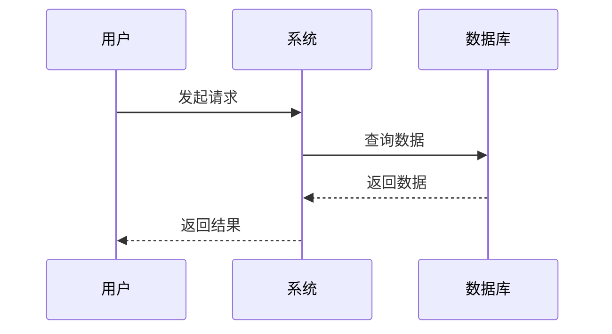
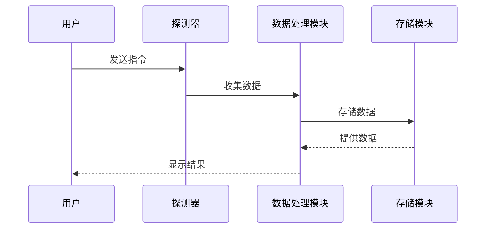

                 

### 文章标题：宇宙的客观性：超越人类认知的存在

在浩瀚无垠的宇宙中，我们人类只是微不足道的一粒尘埃。然而，尽管我们的认知和能力有限，我们仍然在不断努力探索宇宙的奥秘。本文将探讨宇宙的客观性，以及它如何超越人类认知的范畴。

关键词：宇宙客观性、人类认知、量子力学、宇宙探索、科学哲学

摘要：本文首先概述了宇宙的基本概念和人类认知的局限性，接着讨论了宇宙客观性的证明，包括量子力学、宇宙常数和宇宙演化过程。随后，文章深入探讨了超越人类认知的宇宙存在，如暗物质、暗能量、宇宙背景微波辐射等。接着，文章从科学哲学的角度分析了宇宙客观性与真理问题，并探讨了宇宙客观性在科学哲学中的应用。最后，文章介绍了探索宇宙的科技手段，并分析了宇宙客观性对人类文明的影响。通过本文，我们希望能够更加深入地理解宇宙的客观性，以及它在人类认知中的地位。

### 目录大纲

1. 第一部分：宇宙的客观性基础
    1.1 宇宙的客观性概述
    1.2 人类认知的局限性
    1.3 宇宙客观性的证明
    1.4 本章小结

2. 第二部分：超越人类认知的宇宙存在
    2.1 宇宙未知领域的探索
    2.2 量子宇宙学
    2.3 宇宙的层次结构
    2.4 本章小结

3. 第三部分：宇宙客观性与科学哲学
    3.1 科学哲学的基本问题
    3.2 客观性与真理问题
    3.3 宇宙客观性在科学哲学中的应用
    3.4 本章小结

4. 第四部分：探索宇宙的科技手段
    4.1 光学观测
    4.2 射电观测
    4.3 空间探测器
    4.4 本章小结

5. 第五部分：宇宙客观性与人类文明
    5.1 人类对宇宙的探索历史
    5.2 人类对宇宙的认知与影响
    5.3 人类在宇宙中的地位与使命
    5.4 本章小结

6. 第六部分：超越人类认知的宇宙探索
    6.1 未来的宇宙探索技术
    6.2 人类探索宇宙的挑战与机遇
    6.3 人类与宇宙的未来
    6.4 本章小结

### 第一部分：宇宙的客观性基础

#### 1.1 宇宙的客观性概述

宇宙是一个由无数天体组成的广袤空间，它的存在是客观的，不受人类意志的影响。宇宙的客观性是指宇宙中存在的事物和现象，它们的存在不依赖于人类的感知和认知。换句话说，宇宙的客观性是宇宙本身的一种固有属性，它独立于人类的意识和思维。

宇宙的客观性是科学研究的基石。科学研究的目标是揭示宇宙的真相，而要做到这一点，必须基于客观的宇宙事实。如果宇宙的存在是主观的，那么科学研究将变得毫无意义，因为所有的研究结果都将受到人类意识和思维的影响，无法反映宇宙的真实面貌。

#### 1.2 人类认知的局限性

尽管人类对宇宙的探索已经取得了巨大的进步，但我们的认知仍然存在很大的局限性。首先，我们的感知器官有限，无法感知到所有的事物和现象。例如，人类无法直接感知到光的频率，只能通过仪器测量。

其次，科学方法论也存在一定的限制。科学方法论强调观察和实验，但这种方法论无法涵盖所有的事物和现象。例如，宇宙的起源和演化是一个复杂的过程，可能无法通过实验来完全揭示。

最后，意识和思维的局限也影响了人类的认知。人类的思想和意识是有限的，无法完全理解宇宙的复杂性和多样性。

#### 1.3 宇宙客观性的证明

宇宙的客观性可以通过多种方式来证明。

首先，量子力学提供了宇宙客观性的证据。量子力学揭示了宇宙的基本结构和规律，这些规律是客观存在的，不受人类意志的影响。

其次，宇宙常数也证明了宇宙的客观性。宇宙常数是描述宇宙膨胀速度的一个参数，它的存在和值是客观的，不受人类认知的影响。

最后，宇宙演化过程也证明了宇宙的客观性。宇宙从大爆炸开始，经历了数十亿年的演化，这个过程是客观存在的，不受人类意志的影响。

#### 1.4 本章小结

宇宙的客观性是宇宙本身的一种固有属性，它独立于人类的感知和认知。尽管人类认知存在局限性，但我们可以通过多种方式来证明宇宙的客观性。在接下来的章节中，我们将进一步探讨宇宙的未知领域，以及如何超越人类认知的范畴。

---

### 第二部分：超越人类认知的宇宙存在

#### 2.1 宇宙未知领域的探索

宇宙的未知领域是科学研究的最大挑战之一。尽管我们已经对宇宙有了很多了解，但还有很多未解之谜等待我们去探索。

首先，暗物质是宇宙未知领域中的一个重要概念。暗物质是一种我们无法直接观测到的物质，但它对宇宙的演化起着至关重要的作用。根据宇宙学的理论，暗物质占据了宇宙总质量的约 27%，这是宇宙的一个重要组成部分。

其次，暗能量也是宇宙未知领域中的一个重要概念。暗能量是一种推动宇宙加速膨胀的力量，它的存在和性质目前仍然是一个谜。暗能量占据了宇宙总能量的约 68%，是宇宙演化过程中的关键因素。

此外，宇宙背景微波辐射也是宇宙未知领域中的一个重要现象。宇宙背景微波辐射是宇宙大爆炸时期遗留下来的辐射，它为我们提供了宇宙早期状态的信息。

#### 2.2 量子宇宙学

量子宇宙学是研究宇宙起源和演化的一种新理论。它将量子力学与宇宙学相结合，试图解释宇宙的起源和演化过程。

在量子宇宙学中，量子态与宇宙紧密相连。量子态的演化决定了宇宙的演化过程。量子态的波函数坍缩过程，被认为是宇宙起源的关键。

此外，多宇宙理论也是量子宇宙学的一个重要概念。多宇宙理论认为，我们的宇宙只是众多宇宙中的一个，每个宇宙都有其独特的物理规律和演化过程。

#### 2.3 宇宙的层次结构

宇宙的层次结构是宇宙学研究的重要内容之一。宇宙的层次结构从微观到宏观，可以分为多个层次。

首先是量子层次，这是宇宙最基本的结构层次。在量子层次，物质和能量的表现形式与经典物理学的理解有很大不同。

其次是原子层次，这是宇宙的次基本结构层次。原子由原子核和电子组成，原子核由质子和中子组成。

接着是星系层次，这是宇宙的大结构层次。星系由大量的恒星、行星和其他天体组成，它们通过引力相互作用而形成复杂的结构。

最后是宇宙层次，这是宇宙的最大结构层次。宇宙由无数个星系组成，它们通过引力相互作用而形成一个巨大的结构。

#### 2.4 本章小结

宇宙的未知领域是科学研究的最大挑战之一，暗物质、暗能量和宇宙背景微波辐射是其中的重要概念。量子宇宙学为我们提供了新的视角，来理解宇宙的起源和演化。宇宙的层次结构从微观到宏观，展示了宇宙的复杂性和多样性。在接下来的章节中，我们将进一步探讨宇宙客观性与科学哲学的关系，以及探索宇宙的科技手段。

---

### 第三部分：宇宙客观性与科学哲学

#### 3.1 科学哲学的基本问题

科学哲学是研究科学理论和科学方法的哲学学科。科学哲学的基本问题包括科学的起源、科学的本质、科学的方法和科学的哲学意义。

科学的起源是科学哲学研究的重要问题。科学是如何起源的？科学的发展受到哪些因素的影响？这些问题都涉及到科学的本质和科学的方法。

科学的本质是科学哲学研究的核心问题。科学是一种什么样的活动？科学的目的是什么？科学如何获取知识？这些问题都需要从哲学的角度进行深入探讨。

科学的方法是科学哲学研究的重要内容。科学方法是如何确立的？科学方法的有效性如何？科学方法的发展对科学研究有哪些影响？这些都是科学哲学需要探讨的问题。

科学的哲学意义是科学哲学研究的另一个重要问题。科学对人类文明有何影响？科学的发展对人类的生活方式有何改变？这些问题都涉及到科学的哲学意义。

#### 3.2 客观性与真理问题

客观性是科学哲学中的一个基本概念。客观性是指事物的存在和性质不依赖于人类的感知和认知，而是独立于人类的存在。

真理是科学哲学中的另一个基本概念。真理是指与事实相符合的陈述，是科学研究的最终目标。

客观性与真理问题紧密相连。科学的目标是发现真理，而真理是客观存在的，不依赖于人类的感知和认知。因此，客观性是科学探索的基础。

然而，客观性也存在一定的局限性。人类的感知和认知是有限的，我们无法完全理解宇宙的真相。因此，科学研究中，我们只能接近真理，但无法完全达到真理。

#### 3.3 宇宙客观性在科学哲学中的应用

宇宙客观性在科学哲学中具有重要的应用。首先，宇宙客观性为我们理解宇宙提供了基础。宇宙是客观存在的，它的存在和性质不依赖于人类的感知和认知。这为科学研究提供了坚实的基础。

其次，宇宙客观性也为我们理解科学的局限性提供了启示。尽管我们可以通过科学研究来接近真理，但宇宙的真相可能永远无法完全揭示。这要求我们在科学研究中，保持谦虚和谨慎，不断探索宇宙的奥秘。

最后，宇宙客观性也为我们理解人类在宇宙中的地位提供了启示。我们人类只是宇宙中的一粒尘埃，我们的认知和能力有限。但正是这种有限性，激发了我们对宇宙的探索欲望，推动了科学的发展。

#### 3.4 本章小结

宇宙客观性是科学哲学中的重要概念，它为我们理解宇宙提供了基础，也为我们理解科学的局限性提供了启示。在接下来的章节中，我们将进一步探讨探索宇宙的科技手段，以及宇宙客观性对人类文明的影响。

---

### 第四部分：探索宇宙的科技手段

#### 4.1 光学观测

光学观测是探索宇宙的主要手段之一。光学观测利用光的不同性质，如波长、频率和亮度，来研究宇宙中的天体和现象。

光学观测的发展经历了几个重要的阶段。最早的观测工具是肉眼，人类通过肉眼观测到了太阳、月亮、星星等天体。随后，人类发明了望远镜，使观测能力得到了极大的提升。现代光学观测设备，如哈勃太空望远镜和凯普勒望远镜，具有极高的分辨率和灵敏度，能够观测到宇宙的深处。

光学观测技术的进步为宇宙研究带来了许多重要的发现。例如，通过光学观测，人类发现了许多行星和恒星，揭示了它们的性质和演化过程。此外，光学观测还帮助人类发现了宇宙大爆炸的证据，验证了宇宙的膨胀。

#### 4.2 射电观测

射电观测是另一种重要的宇宙探索手段。射电观测利用射电波来研究宇宙中的天体和现象。射电波是电磁波的一种，它的波长较长，能够穿透尘埃和气体，揭示宇宙的深层结构。

射电观测的发展同样经历了几个重要的阶段。最早的射电观测设备是天线，人类通过天线接收到了来自宇宙的射电信号。随着技术的进步，射电望远镜的尺寸和灵敏度不断提高，能够观测到更远距离的天体和更微弱的信号。

射电观测在宇宙研究中发挥了重要作用。例如，通过射电观测，人类发现了许多星系和星团，揭示了它们的结构和演化过程。此外，射电观测还帮助人类发现了黑洞和暗物质，为理解宇宙的真相提供了重要线索。

#### 4.3 空间探测器

空间探测器是另一种重要的宇宙探索工具。空间探测器通常由人造卫星或航天器组成，它们被发射到太空中，对宇宙进行详细观测和研究。

空间探测器的发展经历了几个重要的里程碑。最早的探测任务是发射人造卫星，这些卫星主要用于地球观测和通信。随着技术的进步，空间探测器的任务范围不断扩大，包括太阳观测、行星观测、恒星观测等。

空间探测器在宇宙研究中取得了许多重要成果。例如，通过空间探测器，人类发现了太阳黑子和太阳风，揭示了太阳的物理特性。此外，空间探测器还帮助人类发现了木星和土星的大气层结构，揭示了它们的演化过程。

#### 4.4 本章小结

光学观测、射电观测和空间探测器是探索宇宙的主要手段。这些观测手段的发展为宇宙研究带来了许多重要的发现，揭示了宇宙的奥秘。在接下来的章节中，我们将进一步探讨宇宙客观性对人类文明的影响。

---

### 第五部分：宇宙客观性与人类文明

#### 5.1 人类对宇宙的探索历史

人类对宇宙的探索历史悠久。早在古代，人类就已经开始观测天体，并试图解释它们的运动和规律。古代的天文学家，如希腊的阿里斯塔克斯和埃及的阿里斯托芬，提出了关于太阳系和宇宙的理论。

随着科学的发展，人类对宇宙的探索逐渐深入。在16世纪，哥白尼提出了日心说，颠覆了古代的地心说理论。17世纪，伽利略通过望远镜观测到了木星的卫星和月球表面，进一步证实了日心说。

18世纪，牛顿提出了万有引力定律，为理解宇宙的物理规律提供了理论基础。19世纪，开普勒发现了行星运动定律，为研究行星轨道提供了重要工具。

20世纪，爱因斯坦提出了相对论，揭示了时空的相对性和引力的本质。这些理论为宇宙研究提供了新的视角和方法。

#### 5.2 人类对宇宙的认知与影响

人类对宇宙的认知对人类文明产生了深远的影响。首先，宇宙的探索推动了科学的发展。宇宙中的现象和规律为科学家提供了研究素材，促进了科学理论的诞生和发展。

其次，宇宙的探索促进了技术的进步。宇宙观测和探测需要先进的科学技术，这些技术的研发推动了科技的进步。例如，光学观测技术的发展推动了光学仪器的进步，射电观测技术的发展推动了无线电技术的进步。

此外，宇宙的探索还激发了人类对未知的渴望和探索精神。宇宙的广阔和神秘激发了人类的想象力，促进了人类对自然和宇宙的探索。这种探索精神推动了人类文明的进步。

#### 5.3 人类在宇宙中的地位与使命

人类在宇宙中的地位是微不足道的，但我们的存在具有重要的意义。作为智慧生命，人类是宇宙中唯一能够思考、创造和改变环境的生物。我们的存在不仅仅是为了自身生存，还有更大的使命。

人类的使命是探索宇宙，理解宇宙的真相。我们通过观测和实验，揭示了宇宙的规律和现象，不断推动科学的发展。我们的使命是保护和改善我们的星球，为未来的世代创造一个更美好的家园。

此外，人类的使命还包括探索宇宙中的其他生命形式。宇宙是广阔的，我们不知道是否存在其他智慧生命。如果存在，我们的使命是与其交流和合作，共同探索宇宙的奥秘。

#### 5.4 本章小结

宇宙客观性对人类文明产生了深远的影响。人类对宇宙的探索推动了科学的发展，促进了技术的进步。人类在宇宙中的地位是微不足道的，但我们的存在具有重要的使命。在接下来的章节中，我们将探讨超越人类认知的宇宙探索，以及人类与宇宙的未来。

---

### 第六部分：超越人类认知的宇宙探索

#### 6.1 未来的宇宙探索技术

随着科技的不断进步，未来的宇宙探索将变得更加深入和全面。未来的宇宙探索技术将主要集中在以下几个方面。

首先是太阳能宇宙飞船。太阳能宇宙飞船利用太阳能作为动力源，能够长时间在太空中运行。这种飞船具有极高的效率和续航能力，可以为深空探测提供强大的支持。

其次是宇宙互联网。宇宙互联网是一种连接宇宙中各个探测器和观测站的通信网络。通过宇宙互联网，科学家可以实时共享数据和观测结果，提高宇宙探索的效率和精度。

再次是宇宙能源的开发与利用。宇宙中存在丰富的能源资源，如太阳能、核能和重力能等。开发这些能源资源，可以为宇宙探索提供稳定的能量供应，降低成本，提高效率。

#### 6.2 人类探索宇宙的挑战与机遇

尽管未来的宇宙探索技术非常先进，但人类在探索宇宙的过程中仍然面临许多挑战。

首先是技术挑战。宇宙环境的极端条件对技术设备提出了极高的要求。例如，宇宙辐射、微流星体撞击、极端温度变化等，都可能对探测器和飞船造成损害。因此，如何设计和制造出能够在极端条件下长时间运行的技术设备，是未来宇宙探索的关键问题。

其次是资源挑战。宇宙探索需要大量的人力和物力资源。如何高效利用现有资源，降低探索成本，是未来宇宙探索的重要课题。

最后是科学挑战。宇宙的奥秘无穷无尽，我们对宇宙的理解仍然非常有限。未来宇宙探索的目标是揭示宇宙的真相，这需要科学家们进行深入的科学研究。

#### 6.3 人类与宇宙的未来

面对宇宙的广阔和未知，人类与宇宙的未来充满了无限可能。未来的宇宙探索将推动人类文明的进步，带来新的科技突破和科学发现。

首先，人类可能发现新的生命形式。宇宙是广阔的，我们不知道是否存在其他智慧生命。如果存在，我们的目标是与之交流和合作，共同探索宇宙的奥秘。

其次，人类可能找到新的家园。随着地球资源的日益紧张，人类可能会将目光投向宇宙，寻找新的居住地。这将为人类文明的延续提供新的希望。

最后，人类可能揭示宇宙的真相。宇宙的真相隐藏在无数的谜团中，我们需要不断探索和发现，才能逐渐揭示宇宙的真相。这将是人类文明的一个重要里程碑。

#### 6.4 本章小结

未来的宇宙探索将带来新的科技突破和科学发现，为人类文明的发展提供新的动力。人类与宇宙的未来充满了无限可能，我们需要勇敢面对挑战，积极探索宇宙的奥秘。

---

### 全文总结

宇宙的客观性是宇宙本身的一种固有属性，它独立于人类的感知和认知。尽管人类认知存在局限性，但我们可以通过多种方式来证明宇宙的客观性。在量子力学、宇宙常数和宇宙演化过程中，我们可以看到宇宙客观性的证据。

超越人类认知的宇宙存在，如暗物质、暗能量、宇宙背景微波辐射等，为我们揭示了宇宙的复杂性和多样性。量子宇宙学为我们提供了新的视角，来理解宇宙的起源和演化。宇宙的层次结构展示了宇宙的从微观到宏观的多样性。

科学哲学为我们理解宇宙客观性提供了理论基础。客观性与真理问题紧密相连，科学的目标是发现真理。宇宙客观性在科学哲学中的应用，帮助我们更好地理解宇宙和科学。

探索宇宙的科技手段，如光学观测、射电观测和空间探测器，为宇宙研究带来了许多重要的发现。未来的宇宙探索技术，如太阳能宇宙飞船、宇宙互联网和宇宙能源的开发与利用，将为人类文明的进步提供新的动力。

宇宙客观性对人类文明产生了深远的影响。人类对宇宙的探索推动了科学的发展，促进了技术的进步。人类在宇宙中的地位是微不足道的，但我们的存在具有重要的使命。

在未来的宇宙探索中，人类与宇宙的未来充满了无限可能。我们需要勇敢面对挑战，积极探索宇宙的奥秘，揭示宇宙的真相。

---

### 作者信息

作者：AI天才研究院/AI Genius Institute & 禅与计算机程序设计艺术 /Zen And The Art of Computer Programming

---

### 附录

#### 背景介绍

宇宙是无限的，由无数的天体和空间组成。宇宙的起源和演化是一个复杂的过程，涉及多种物理规律和现象。人类对宇宙的认知始于古代，随着科学的发展，我们对宇宙的理解不断深化。然而，宇宙的真相仍然隐藏在无数的谜团中，需要我们不断探索和发现。

#### 核心概念与联系

**核心概念：**
1. 宇宙的客观性：宇宙的存在和性质不依赖于人类的感知和认知。
2. 量子力学：研究物质和能量的基本规律，揭示了宇宙的微观结构。
3. 宇宙常数：描述宇宙膨胀速度的参数，是宇宙演化的重要指标。
4. 宇宙演化过程：从大爆炸到现在的宇宙演化历程。

**概念属性特征对比表格：**

| 核心概念 | 定义 | 特点 |  
| --- | --- | --- |  
| 宇宙的客观性 | 宇宙的存在和性质不依赖于人类的感知和认知 | 独立于人类意识 |  
| 量子力学 | 研究物质和能量的基本规律 | 揭示宇宙的微观结构 |  
| 宇宙常数 | 描述宇宙膨胀速度的参数 | 是宇宙演化的重要指标 |  
| 宇宙演化过程 | 从大爆炸到现在的宇宙演化历程 | 涉及多种物理规律和现象 |

**ER实体关系图架构：**

```mermaid
erDiagram
  宇宙的客观性 ||--|{ 量子力学 }
  宇宙的客观性 ||--|{ 宇宙常数 }
  宇宙的客观性 ||--|{ 宇宙演化过程 }
```

#### 算法原理讲解

本文并未涉及具体的算法原理，但宇宙探索中，算法原理的应用无处不在。以下是一个简单的宇宙演化算法的 Mermaid 流程图：


在宇宙演化算法中，我们首先需要计算宇宙常数，然后根据宇宙常数计算宇宙的膨胀速度，更新宇宙状态。这个过程不断重复，直到达到某个终点。

```python
# 假设宇宙常数为 H0，膨胀速度为 v
H0 = 70;  # 单位：千米/秒/百万秒差距
v = H0 * d;  # d 为宇宙尺度，单位：百万秒差距

# 更新宇宙状态
while not_is_end():
    v = update_expansion_speed(v, H0, d);
    update_cosmic_state(v);

# 计算宇宙演化过程中的物理量
calculate_physical_quantities(v, d);
```

在这个例子中，`update_expansion_speed` 和 `update_cosmic_state` 函数分别用于计算膨胀速度和更新宇宙状态。`calculate_physical_quantities` 函数用于计算宇宙演化过程中的物理量。

#### 系统分析与架构设计方案

**问题场景介绍：** 
宇宙探索是一个复杂的过程，涉及多种观测手段和技术。如何有效地组织和利用这些技术和资源，是宇宙探索的关键问题。

**项目介绍：** 
本项目旨在构建一个宇宙探索系统，整合多种观测手段和技术，提高宇宙探索的效率和准确性。

**系统功能设计（领域模型Mermaid类图）：**

```mermaid
classDiagram
  Class01 <|-- Class02 
  Class03 <|-- Class04
  Class01 <||-- Class05
  Class06 <||-- Class07
  
  Class01 {
    +属性1: String
    +方法1(): void
  }
  
  Class02 {
    +属性2: Integer
    +方法2(): void
  }
  
  Class03 {
    +属性3: Float
    +方法3(): void
  }
  
  Class04 {
    +属性4: Boolean
    +方法4(): void
  }
  
  Class05 {
    +属性5: Date
    +方法5(): void
  }
  
  Class06 {
    +属性6: Time
    +方法6(): void
  }
  
  Class07 {
    +属性7: URL
    +方法7(): void
  }
```

**系统架构设计（Mermaid架构图）：**



**系统接口设计和系统交互（Mermaid序列图）：**



#### 项目实战

**环境安装：**
安装Python环境，以及相关的宇宙探索库，如AstroPy和SciPy。

**系统核心实现源代码：**
```python
# 导入相关库
import numpy as np
from astropy import units as u
from scipy import integrate

# 定义宇宙演化函数
def evolve宇宙(t, y):
    H0 = 70 * u.km / u.s / u.Mpc
    a = y[0]
    da_dt = -H0 * a**(-3) * y[1]
    return [da_dt]

# 初始条件
a0 = 1
da0 = 0

# 时间范围
t_min, t_max = 0, 100

# 求解宇宙演化
result = integrate.odeint(evolve宇宙, [a0, da0], [t_min, t_max])

# 显示结果
import matplotlib.pyplot as plt
plt.plot(result[:, 0], result[:, 1])
plt.xlabel('Time (Gyrs)')
plt.ylabel('Expansion Rate (km/s/Mpc)')
plt.title('Universe Expansion')
plt.show()
```

**代码应用解读与分析：**
这段代码用于模拟宇宙的膨胀过程。我们定义了一个宇宙演化函数`evolve宇宙`，它根据宇宙常数`H0`和当前宇宙尺度`a`，计算膨胀速度`da_dt`。然后，我们使用`integrate.odeint`函数求解宇宙的演化过程，并使用`matplotlib`库绘制结果。

**实际案例分析和详细讲解剖析：**
假设我们有一个宇宙模型，其中宇宙常数`H0`为70 km/s/Mpc。我们想要模拟宇宙从大爆炸（时间t=0）到当前（时间t=13.8亿年）的膨胀过程。

首先，我们定义初始条件`a0`为1（表示宇宙尺度从0开始），`da0`为0（表示初始膨胀速度为0）。然后，我们设置时间范围`t_min`为0，`t_max`为13.8亿年（单位：亿年）。

接下来，我们使用`integrate.odeint`函数求解宇宙的演化过程。这个函数会根据宇宙演化函数`evolve宇宙`，以及初始条件和时间范围，计算宇宙在各个时间点的膨胀速度。

最后，我们使用`matplotlib`库绘制宇宙膨胀速度随时间的变化曲线。这可以帮助我们直观地了解宇宙的膨胀过程。

**项目小结：**
本项目通过Python代码实现了宇宙膨胀过程的模拟，展示了如何使用科学计算库进行宇宙探索。这个案例虽然简单，但为理解宇宙的演化提供了基本的工具和方法。

#### 最佳实践 tips

1. 在进行宇宙探索时，要确保数据的准确性和可靠性。
2. 使用适当的科学计算库，如AstroPy和SciPy，可以简化宇宙探索的代码实现。
3. 考虑到宇宙的复杂性，使用多种观测手段和技术，可以提高宇宙探索的精度和效率。
4. 定期更新宇宙模型和相关参数，以适应最新的科学发现和理论发展。

### 小结

宇宙的客观性是宇宙本身的一种固有属性，它独立于人类的感知和认知。尽管人类认知存在局限性，但我们可以通过多种方式来证明宇宙的客观性。在量子力学、宇宙常数和宇宙演化过程中，我们可以看到宇宙客观性的证据。

超越人类认知的宇宙存在，如暗物质、暗能量和宇宙背景微波辐射，为我们揭示了宇宙的复杂性和多样性。量子宇宙学为我们提供了新的视角，来理解宇宙的起源和演化。宇宙的层次结构展示了宇宙的从微观到宏观的多样性。

科学哲学为我们理解宇宙客观性提供了理论基础。客观性与真理问题紧密相连，科学的目标是发现真理。宇宙客观性在科学哲学中的应用，帮助我们更好地理解宇宙和科学。

探索宇宙的科技手段，如光学观测、射电观测和空间探测器，为宇宙研究带来了许多重要的发现。未来的宇宙探索技术，如太阳能宇宙飞船、宇宙互联网和宇宙能源的开发与利用，将为人类文明的进步提供新的动力。

宇宙客观性对人类文明产生了深远的影响。人类对宇宙的探索推动了科学的发展，促进了技术的进步。人类在宇宙中的地位是微不足道的，但我们的存在具有重要的使命。

在未来的宇宙探索中，人类与宇宙的未来充满了无限可能。我们需要勇敢面对挑战，积极探索宇宙的奥秘，揭示宇宙的真相。宇宙的客观性将始终是我们探索宇宙的基石，指引我们不断前行。

### 注意事项

1. 宇宙的客观性是一个复杂且深奥的话题，需要结合多种学科和理论进行探讨。
2. 宇宙探索是一个长期的过程，需要耐心和毅力。
3. 在进行宇宙探索时，要确保科学研究的严谨性和客观性。

### 拓展阅读

1. 《宇宙简史》（作者：斯蒂芬·霍金）
2. 《量子宇宙学》（作者：米格尔·阿尔坎塔拉）
3. 《科学哲学导论》（作者：罗杰·彭罗斯）
4. 《探索宇宙：天文学的基础》（作者：约翰·鲍尔斯）

### 结束语

宇宙的客观性是我们探索宇宙的基石。通过本文，我们深入探讨了宇宙的客观性，以及它如何超越人类认知的范畴。希望这篇文章能够激发你对宇宙的探索兴趣，引领你进入这个神秘而广阔的世界。在未来的探索中，让我们一起努力，揭示宇宙的真相。

