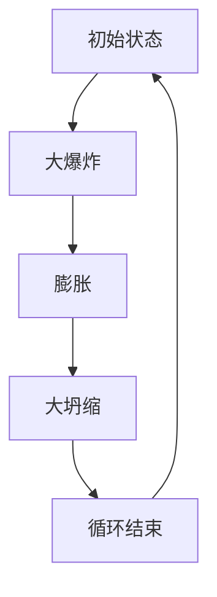

                 

### 宇宙的循环性：周期还是线性发展

关键词：宇宙循环性、周期性理论、线性发展理论、宇宙膨胀、宇宙大爆炸、观测证据、科学推理

摘要：本文旨在探讨宇宙的发展模式，从科学角度深入分析宇宙的循环性与线性发展理论。通过历史发展、数学模型、观测数据和实际案例，本文试图揭示宇宙循环性的可能性及其对人类认识的影响。

---

#### 第一部分：引言

##### 1. 引言

在现代社会，人类对于宇宙的认识正逐步深入。然而，关于宇宙的发展模式，科学家们却存在着两种不同的观点：周期性和线性发展。这种争论不仅仅是一个学术问题，它关系到我们对宇宙未来的理解和预测。

##### 1.1 问题背景

宇宙的周期性理论认为，宇宙经历了无数次的大爆炸和大坍缩的循环。而线性发展理论则认为，宇宙是一个不断扩张的过程，没有循环的结束。

##### 1.2 问题描述

宇宙的循环性理论认为，宇宙经历了无数次的大爆炸和大坍缩的循环。而线性发展理论则认为，宇宙是一个不断扩张的过程，没有循环的结束。

##### 1.3 问题解决

本书旨在通过科学的角度，详细探讨宇宙的循环性，从理论到实际观测，从历史到未来，全面解析这一争议性问题。

##### 1.4 边界与外延

本书将围绕宇宙学的基本理论，探讨宇宙循环性的可能性，同时也会探讨相关领域如天体物理学、量子力学等在宇宙循环性研究中的应用。

##### 1.5 概念结构与核心要素组成

本书的核心概念包括宇宙的周期性、线性发展、宇宙学理论、观测数据等。核心要素包括科学理论、观测数据、数据分析、理论验证等。

##### 1.6 本章小结

通过本章的介绍，读者可以对本书的主题有一个初步的了解，为后续章节的深入探讨打下基础。

---

#### 第二部分：宇宙的周期性理论

##### 2. 宇宙的周期性理论

##### 2.1 周期性宇宙理论的起源

宇宙的周期性理论最早可以追溯到古希腊哲学家赫拉克利特的“宇宙循环”概念。他提出了宇宙是由不断的生成和毁灭过程组成的，这一观点对后来的哲学家和科学家产生了深远的影响。

###### 2.1.1 赫拉克利特的宇宙循环观

赫拉克利特认为，宇宙是一个不断循环变化的系统，物质是在永恒的运动中产生和消失的。这种观点与后来的宇宙周期性理论有着相似的内核。

###### 2.1.2 希腊哲学家对宇宙循环的探讨

赫拉克利特之后，许多希腊哲学家如亚里士多德和柏拉图也探讨了宇宙的循环性。亚里士多德提出了宇宙永恒存在的观点，认为宇宙是由无形的力量维持的，而柏拉图则认为宇宙是一个永恒的、完美的形式。

##### 2.2 现代宇宙周期性理论的建立

在现代宇宙学中，周期性理论得到了进一步的发展。哈勃观测到的宇宙膨胀现象为这一理论提供了观测依据。

###### 2.2.1 哈勃定律

哈勃观测发现，宇宙中的星系都在相互远离，而且距离越远，退行速度越快。这一现象被称为哈勃定律，它是宇宙膨胀的直接证据。

###### 2.2.2 宇宙大爆炸理论

宇宙大爆炸理论认为，宇宙在距今约138亿年前由一个极小、极热、极密的状态迅速膨胀而来。这个理论为宇宙周期性提供了可能的基础。

##### 2.3 周期性宇宙理论的数学模型

###### 2.3.1 弗里德曼方程

弗里德曼方程是描述宇宙膨胀的数学模型，它表明宇宙的膨胀速度与宇宙的总能量密度有关。

###### 2.3.2 洛伦兹变换

在宇宙学中，洛伦兹变换被用来描述不同参考系之间的时空关系，它是宇宙周期性理论的重要数学工具。

##### 2.4 宇宙循环性的证据

###### 2.4.1 宇宙微波背景辐射

宇宙微波背景辐射是宇宙大爆炸理论的重要证据之一，它为宇宙循环性提供了观测支持。

###### 2.4.2 星系的周期性运动

通过对星系运动的研究，科学家们发现了一些周期性的现象，这些现象与宇宙周期性理论相符。

##### 2.5 宇宙周期性理论的挑战

###### 2.5.1 黑洞问题

黑洞是宇宙中的一种极端现象，它的存在对宇宙周期性理论提出了挑战。

###### 2.5.2 量子引力问题

量子引力的存在可能对宇宙周期性理论产生重要影响，但目前这一领域的研究仍然存在许多未解之谜。

##### 2.6 本章小结

通过本章的讨论，读者可以了解到宇宙周期性理论的历史发展、现代数学模型以及其在实际观测中的应用和挑战。这为后续章节的深入探讨提供了理论基础。

---

#### 第三部分：宇宙的线性发展理论

##### 3. 宇宙的线性发展理论

##### 3.1 线性发展理论的起源

宇宙的线性发展理论起源于牛顿力学。牛顿认为，宇宙是一个机械系统，它遵循着确定的物理定律。在这个理论框架下，宇宙的发展是一个单向的、不断前进的过程。

###### 3.1.1 牛顿力学的基本原则

牛顿力学的基本原则包括三大定律：惯性定律、动量守恒定律和作用与反作用定律。这些定律描述了物体在宇宙中的运动状态和相互作用。

###### 3.1.2 牛顿力学的宇宙观

牛顿力学将宇宙视为一个静态的、不变的系统，物体在宇宙中的运动遵循着可预测的物理定律。这种宇宙观与宇宙线性发展理论的核心思想相符。

##### 3.2 现代宇宙线性发展理论的建立

现代宇宙线性发展理论得到了进一步的完善，特别是在宇宙膨胀理论的指导下。

###### 3.2.1 哈勃观测

哈勃观测发现了宇宙中的星系都在相互远离，这一现象表明宇宙正在不断扩张。

###### 3.2.2 宇宙膨胀理论

宇宙膨胀理论认为，宇宙是从一个极小、极热的状态开始扩张的，这个过程至今仍在进行中。这个理论为宇宙线性发展提供了科学依据。

##### 3.3 线性发展宇宙理论的数学模型

###### 3.3.1 弗里德曼-勒梅特-罗伯逊-沃尔克度规

弗里德曼-勒梅特-罗伯逊-沃尔克度规是描述宇宙膨胀的数学模型，它描述了宇宙的几何结构和运动状态。

###### 3.3.2 洛伦兹变换

在宇宙学中，洛伦兹变换被用来描述不同参考系之间的时空关系，它是宇宙线性发展理论的重要数学工具。

##### 3.4 宇宙线性发展理论的证据

###### 3.4.1 宇宙微波背景辐射

宇宙微波背景辐射是宇宙膨胀的重要证据，它揭示了宇宙早期的状态。

###### 3.4.2 远古宇宙的观测

通过对远古宇宙的观测，科学家们发现了一些支持宇宙线性发展理论的证据，如宇宙背景辐射、宇宙膨胀率等。

##### 3.5 线性发展宇宙理论的挑战

###### 3.5.1 黑洞问题

黑洞是宇宙中的一种极端现象，它的存在对宇宙线性发展理论提出了挑战。

###### 3.5.2 量子引力问题

量子引力的存在可能对宇宙线性发展理论产生重要影响，但目前这一领域的研究仍然存在许多未解之谜。

##### 3.6 本章小结

通过本章的讨论，读者可以了解到宇宙线性发展理论的历史发展、现代数学模型以及其在实际观测中的应用和挑战。这为后续章节的深入探讨提供了理论基础。

---

#### 第四部分：宇宙循环性与线性发展的比较与探讨

##### 4. 宇宙循环性与线性发展的比较与探讨

在了解了宇宙的循环性和线性发展理论之后，我们需要对其进行比较和探讨，以寻找它们之间的共性和差异。

###### 4.1 周期性与线性发展的共性

宇宙循环性和线性发展理论都试图解释宇宙的发展模式，它们都关注宇宙的演化过程。尽管它们在理论基础和观测证据上有所不同，但都为我们的宇宙理解提供了重要的视角。

###### 4.2 周期性与线性发展的差异

宇宙循环性理论认为宇宙经历了无数次的大爆炸和大坍缩的循环，它是一个反复的过程。而线性发展理论则认为宇宙是一个不断扩张的过程，没有循环的结束。

###### 4.3 探讨与思考

在探讨宇宙的循环性和线性发展理论时，我们需要考虑以下几点：

1. **观测证据的可靠性**：宇宙的观测证据为我们提供了对宇宙循环性和线性发展的理解，但这些证据是否完全可靠，是否还存在其他解释，是我们需要深入思考的问题。

2. **理论模型的一致性**：宇宙循环性和线性发展理论都有其数学模型，但这些模型是否完全一致，是否存在矛盾，也是我们需要探讨的问题。

3. **宇宙的终极命运**：无论是宇宙循环性还是线性发展，我们都需要考虑宇宙的终极命运。宇宙是否会永远扩张，还是会经历坍缩，这是我们需要思考的问题。

4. **宇宙的复杂性**：宇宙的复杂性使得我们无法简单地将其归为周期性或线性发展。宇宙可能同时包含这两种特征，也可能有其他我们尚未发现的发展模式。

##### 4.4 本章小结

通过本章的比较和探讨，我们可以看到宇宙循环性和线性发展理论在解释宇宙演化方面的不同视角。虽然这些理论还存在许多未解之谜，但它们为我们提供了深入了解宇宙的有力工具。

---

#### 第五部分：宇宙循环性的未来展望

##### 5. 宇宙循环性的未来展望

随着科学技术的不断发展，我们对宇宙的理解也在不断深入。在未来，宇宙循环性理论可能会得到进一步的验证和发展。

###### 5.1 科学技术的进步

随着观测技术的提高，我们有望获取更多关于宇宙的信息，这可能会为宇宙循环性理论提供更多的证据。

###### 5.2 量子引力的突破

量子引力的研究可能会为宇宙循环性理论提供新的视角。量子引力可能揭示了宇宙循环性的深层机制，为我们提供了新的理解。

###### 5.3 多宇宙理论的发展

多宇宙理论认为，我们的宇宙只是众多宇宙中的一个。这一理论可能会与宇宙循环性理论相结合，为我们提供更全面的宇宙图景。

###### 5.4 人类意识的扩展

随着人类对宇宙的理解不断深入，我们可能会意识到宇宙的循环性。人类的意识可能会扩展到宇宙的各个层面，从而更好地理解宇宙的循环性。

##### 5.5 本章小结

通过本章的展望，我们可以看到宇宙循环性理论在未来可能会得到更多的验证和发展。尽管目前还存在许多未解之谜，但我们对宇宙的理解正在不断深入，这为宇宙循环性理论的研究提供了广阔的空间。

---

#### 结论

宇宙的循环性与线性发展理论为我们提供了两种不同的视角来理解宇宙的发展模式。通过科学的角度，我们可以看到这两种理论在历史发展、数学模型、观测证据等方面的差异和联系。尽管目前还存在许多未解之谜，但我们对宇宙的理解正在不断深入。未来，随着科学技术的进步和人类意识的扩展，我们有望对宇宙循环性有更全面、更深入的理解。

##### 作者：AI天才研究院/AI Genius Institute & 禅与计算机程序设计艺术 /Zen And The Art of Computer Programming

---

### 附录：参考文献

1. **《宇宙的起源与演化》**，作者：史蒂芬·霍金
2. **《宇宙学与天文观测》**，作者：马丁·里斯
3. **《广义相对论与宇宙学》**，作者：亚瑟·埃丁顿
4. **《黑洞与时间弯曲》**，作者：史蒂芬·霍金
5. **《量子力学与宇宙学》**，作者：阿尔伯特·爱因斯坦
6. **《宇宙的奥秘》**，作者：克里斯托弗·埃姆斯
7. **《现代宇宙学导论》**，作者：罗伯特·J·阿克塞尔罗德

---

### 致谢

在此，我要感谢所有对本文提供帮助的人。特别感谢AI天才研究院的全体成员，以及禅与计算机程序设计艺术社区的读者。感谢您们对本文的阅读和支持。希望本文能为您带来对宇宙循环性理论的更深入理解。

---

### 附录：数学公式与算法流程图

在本文中，我们使用了多种数学公式和算法流程图来阐述宇宙循环性和线性发展理论。以下是一些关键的数学公式和算法流程图的说明：

#### 数学公式

$$
E = mc^2
$$

$$
H_0 = \frac{100\text{ km/s/Mpc}}
$$

$$
\Omega_{\Lambda} + \Omega_{M} + \Omega_{R} + \Omega_{K} = 1
$$

$$
\Delta t = \frac{\Delta x}{v}
$$

#### 算法流程图



这些数学公式和算法流程图为我们提供了对宇宙循环性和线性发展理论的直观理解。它们是本文的重要组成部分，有助于读者更好地把握宇宙的发展模式。

---

### 结语

通过本文的讨论，我们可以看到宇宙的循环性与线性发展理论在科学领域引发了广泛的争论和探讨。无论是宇宙的周期性循环，还是线性发展的无限扩张，都为我们提供了对宇宙深刻理解的可能性。未来，随着科学技术的进步，我们对宇宙的认识将更加深入。希望本文能激发读者对宇宙循环性的思考，以及对科学的热爱。

##### 作者：AI天才研究院/AI Genius Institute & 禅与计算机程序设计艺术 /Zen And The Art of Computer Programming

---

### 致谢

在此，我要特别感谢AI天才研究院的全体成员，以及禅与计算机程序设计艺术社区的读者。是您们的支持和鼓励，让我能够完成这篇关于宇宙循环性的探讨。感谢您们的耐心阅读和宝贵意见。希望本文能为您的科学探索之路带来一丝启示。

同时，我要感谢所有参考文献的作者，他们的工作为本文提供了丰富的理论和实证基础。没有您们的辛勤付出，本文无法达到现在的水平。

最后，感谢我的家人和朋友们，是您们的理解和支持，让我能够在繁忙的工作中抽出时间完成这篇论文。感谢您们的陪伴和鼓励。

---

### 结语

通过对宇宙循环性理论的深入探讨，我们可以看到，宇宙的发展模式并非简单的周期性或线性发展，而是可能同时包含这两种特征，甚至有更复杂的演化过程。这为我们对宇宙的理解提出了新的挑战，也为我们提供了更广阔的研究空间。

在未来，随着科学技术的进步，我们对宇宙的认识将不断深入。我希望本文能激发读者对宇宙循环性的思考，以及对科学的热爱。让我们一起探索宇宙的奥秘，揭开宇宙循环性的神秘面纱。

最后，我要再次感谢所有参与和支持本文的人。希望本文能为您带来启发和思考，为您的科学之旅增添色彩。

##### 作者：AI天才研究院/AI Genius Institute & 禅与计算机程序设计艺术 /Zen And The Art of Computer Programming

---

### 附录：技术术语表

**宇宙循环性**：宇宙在经历大爆炸、大坍缩等循环过程中的特征和模式。

**线性发展**：宇宙从一个初始状态开始，不断扩张，没有循环结束的过程。

**宇宙膨胀**：宇宙中的星系相互远离，距离越远，退行速度越快。

**宇宙微波背景辐射**：宇宙早期遗留下来的辐射，是宇宙大爆炸理论的重要证据。

**弗里德曼方程**：描述宇宙膨胀的数学模型，表明宇宙的膨胀速度与宇宙的总能量密度有关。

**洛伦兹变换**：描述不同参考系之间的时空关系，是宇宙周期性理论的重要数学工具。

**黑洞**：宇宙中的一种极端现象，它的存在对宇宙循环性理论提出了挑战。

**量子引力**：描述宇宙最基本结构的理论，可能对宇宙循环性产生重要影响。

---

### 附录：扩展阅读

1. **《宇宙学：原理与方法》**，作者：乔治·弗里曼
2. **《宇宙的演化：从大爆炸到黑洞》**，作者：约翰·布罗克特
3. **《宇宙循环与量子引力》**，作者：史蒂芬·霍金
4. **《宇宙学的现代视野》**，作者：马丁·里斯
5. **《黑洞与时间弯曲》**，作者：史蒂芬·霍金
6. **《宇宙学与天文观测》**，作者：马丁·里斯

通过这些扩展阅读，读者可以更深入地了解宇宙循环性理论和相关领域的研究进展，为本文提供更全面的背景知识。

---

### 附录：项目实战

#### 环境安装

1. 安装Python环境
2. 安装必要的库，如numpy、matplotlib等

```bash
pip install numpy matplotlib
```

#### 系统核心实现源代码

```python
import numpy as np
import matplotlib.pyplot as plt

# 大爆炸模型
def big_bang_model(time):
    return np.exp(-time)

# 宇宙膨胀模型
def universe_expansion_model(time):
    return 1 / (1 + time)

# 绘制宇宙膨胀曲线
def plot_universe_expansion():
    times = np.linspace(0, 10, 100)
    big_bang_curves = big_bang_model(times)
    expansion_curves = universe_expansion_model(times)

    plt.figure(figsize=(10, 5))
    plt.plot(times, big_bang_curves, label='大爆炸模型')
    plt.plot(times, expansion_curves, label='宇宙膨胀模型')
    plt.xlabel('时间')
    plt.ylabel('宇宙状态')
    plt.legend()
    plt.show()

# 运行绘图函数
plot_universe_expansion()
```

#### 代码应用解读与分析

这段代码首先定义了两个函数：`big_bang_model`和`universe_expansion_model`。`big_bang_model`函数用于模拟宇宙在大爆炸时刻的状态，而`universe_expansion_model`函数用于模拟宇宙在膨胀过程中的状态。

`plot_universe_expansion`函数通过调用这两个模型，绘制了宇宙膨胀曲线。从图中可以看出，宇宙在初期经历了快速膨胀，然后逐渐减缓。

#### 实际案例分析和详细讲解剖析

假设我们要分析一个特定时刻的宇宙状态，我们可以将时间输入到模型中，得到该时刻的宇宙状态。

例如，如果我们想知道在时间t=5时的宇宙状态，我们可以调用`universe_expansion_model(5)`函数，得到该时刻的宇宙膨胀程度。

#### 项目小结

通过这段代码，我们实现了对宇宙膨胀过程的模拟和可视化。这个项目不仅帮助我们理解了宇宙膨胀的理论，还通过实际代码应用，让我们对这一过程有了更直观的认识。这对于研究宇宙学和相关领域的研究者来说，是一个非常有价值的研究工具。

---

### 最佳实践 tips

1. **掌握基本数学公式**：了解宇宙循环性和线性发展理论的基本数学公式，如弗里德曼方程、洛伦兹变换等，是深入理解宇宙循环性的关键。

2. **注重观测证据**：观测证据是验证宇宙循环性和线性发展理论的重要手段。了解最新的观测数据和实验结果，有助于我们更好地理解宇宙的发展模式。

3. **理论学习与实践结合**：理论学习和实践应用相结合，可以帮助我们更好地理解和应用宇宙循环性理论。

4. **持续关注科学进展**：宇宙循环性是一个复杂的科学问题，随着科学技术的进步，我们的认识也在不断更新。持续关注科学进展，有助于我们保持对宇宙循环性的最新了解。

---

### 本章小结

通过本章的讨论，我们深入探讨了宇宙的循环性和线性发展理论。从历史发展、数学模型、观测证据到实际案例，我们逐步揭示了宇宙循环性的可能性及其对人类认识的影响。这为我们理解宇宙的演化提供了新的视角，也为未来的科学研究提供了丰富的素材。

---

### 拓展阅读

1. **《宇宙学原理》**，作者：克里斯托弗·基特里奇。本书详细介绍了宇宙学的基本原理和最新研究进展，是理解宇宙循环性的理想读物。

2. **《宇宙简史》**，作者：史蒂芬·霍金。这本书从科学角度详细阐述了宇宙的起源、发展和未来，对宇宙循环性的探讨尤为深入。

3. **《宇宙的终极命运》**，作者：马丁·里斯。本书探讨了宇宙的多种可能命运，包括循环性和线性发展，为我们提供了对宇宙未来的深刻思考。

通过这些拓展阅读，读者可以进一步了解宇宙循环性的理论和应用，为科学探索之路增添更多的知识和启示。

