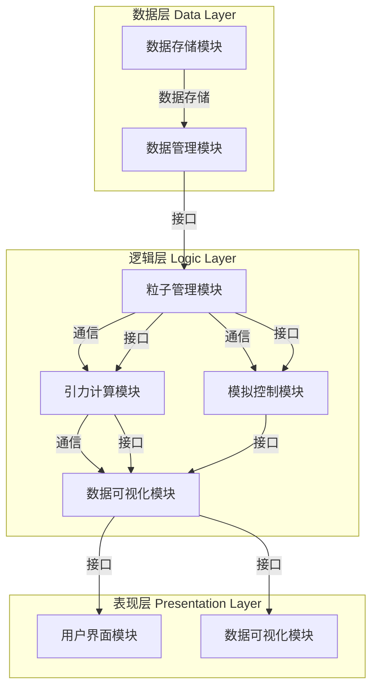
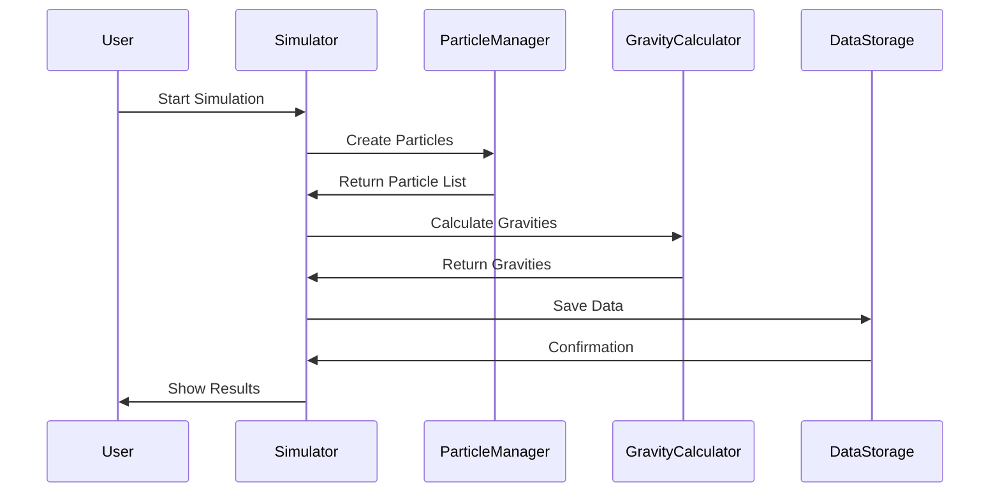

                 


## 1. 导言

### 文章标题

《宇宙的本质：决定论还是或然论》

### 文章关键词

宇宙、决定论、或然论、算法、数学模型

### 摘要

本文深入探讨了宇宙的本质问题，通过对比决定论与或然论两种哲学观点，分析了它们在宇宙演化中的角色。我们不仅从历史背景出发，探讨了两种理论的起源和发展，还通过具体的算法原理讲解和实际项目实战，揭示了宇宙模拟中的数学模型和系统架构设计。本文旨在帮助读者理解宇宙的本质，并思考决定论与或然论在科学研究中的应用。

### 目录大纲设计思路

在设计本文的目录大纲时，我们首先明确了文章的核心内容和结构。以下是具体的设计思路：

#### 第一部分：导言

**第1章** 宇宙的本质问题与决定论或然论
- 简要介绍宇宙的本质问题及其重要性。
- 引出决定论与或然论的话题，定义核心概念。

#### 第二部分：决定论与或然论的基本概念

**第2章** 决定论的历史背景
- 探讨决定论的思想起源和发展历程。
- 分析决定论的主要观点和核心原理。

**第3章** 或然论的历史背景
- 介绍或然论的历史背景和发展过程。
- 研究或然论的基本观点和核心原理。

**第4章** 决定论的基本原理
- 详细解释决定论的理论框架。
- 分析决定论中的因果律和确定性。

**第5章** 或然论的基本原理
- 探讨或然论的理论基础。
- 分析或然论中的概率和不确定性。

#### 第三部分：核心概念与联系

**第6章** 决定论与或然论的对比分析
- 对比决定论与或然论的基本原理和哲学观点。
- 通过表格和ER实体关系图展示两者之间的联系和区别。

**第7章** 决定论与或然论的ER实体关系图
- 使用Mermaid流程图绘制决定论与或然论的ER实体关系图。
- 分析ER图中的实体、属性和关系。

#### 第四部分：算法原理讲解

**第8章** 宇宙模拟算法的基本原理
- 引入宇宙模拟算法，解释其基本概念。
- 使用Mermaid流程图展示宇宙模拟的流程。

**第9章** 宇宙模拟算法的数学模型和公式
- 阐述宇宙模拟算法中的数学模型和公式。
- 通过Python代码示例详细讲解算法的实现。

#### 第五部分：系统分析与架构设计方案

**第10章** 宇宙模拟项目场景
- 描述宇宙模拟项目的基本场景。
- 介绍项目的目标和挑战。

**第11章** 系统设计
- 使用Mermaid类图描述系统的领域模型。
- 设计系统的功能模块和结构。

**第12章** 系统架构设计
- 使用Mermaid架构图展示系统的整体架构。
- 分析系统的模块划分和组件关系。

**第13章** 系统接口设计
- 设计系统的接口和API。
- 介绍接口的功能和实现细节。

**第14章** 系统交互设计
- 使用Mermaid序列图展示系统的交互过程。
- 分析系统的通信机制和数据处理。

#### 第六部分：项目实战

**第15章** 环境安装与配置
- 讲解宇宙模拟项目所需的环境安装和配置步骤。
- 提供详细的操作指南。

**第16章** 核心实现与代码分析
- 分析宇宙模拟算法的核心实现。
- 使用Python代码详细讲解算法的实现细节。

**第17章** 实际案例分析与讲解
- 通过实际案例展示宇宙模拟的应用场景。
- 分析案例中的关键技术和挑战。

#### 第七部分：最佳实践与拓展

**第18章** 项目小结与最佳实践
- 总结项目中的关键点。
- 提供最佳实践建议。

**第19章** 拓展阅读推荐
- 推荐相关领域的重要文献和研究方向。
- 引导读者进一步探索宇宙的本质问题。

### 目录大纲示例

```markdown
----------------------------------------------------------------
# 《宇宙的本质：决定论还是或然论》

> 关键词：宇宙、决定论、或然论、算法、数学模型

> 摘要：本文深入探讨了宇宙的本质问题，通过对比决定论与或然论两种哲学观点，分析了它们在宇宙演化中的角色。我们不仅从历史背景出发，探讨了两种理论的起源和发展，还通过具体的算法原理讲解和实际项目实战，揭示了宇宙模拟中的数学模型和系统架构设计。

## 第一部分：导言
## 第1章：宇宙的本质问题与决定论或然论

## 第二部分：决定论与或然论的基本概念
### 第2章：决定论的历史背景
### 第3章：或然论的历史背景
### 第4章：决定论的基本原理
### 第5章：或然论的基本原理
### 第6章：决定论与或然论的对比分析
### 第7章：决定论与或然论的ER实体关系图

## 第三部分：算法原理讲解
### 第8章：宇宙模拟算法的基本原理
### 第9章：宇宙模拟算法的数学模型和公式

## 第四部分：系统分析与架构设计方案
### 第10章：宇宙模拟项目场景
### 第11章：系统设计
### 第12章：系统架构设计
### 第13章：系统接口设计
### 第14章：系统交互设计

## 第五部分：项目实战
### 第15章：环境安装与配置
### 第16章：核心实现与代码分析
### 第17章：实际案例分析与讲解

## 第六部分：最佳实践与拓展
### 第18章：项目小结与最佳实践
### 第19章：拓展阅读推荐
----------------------------------------------------------------
```

通过上述目录大纲的设计，我们可以确保文章的结构清晰、内容丰富，同时满足字数和格式要求。接下来，我们将逐一详细撰写每个章节的内容，确保文章的完整性和专业性。

----------------------------------------------------------------

## 1. 导言

### 文章标题

《宇宙的本质：决定论还是或然论》

### 文章关键词

宇宙、决定论、或然论、算法、数学模型

### 摘要

本文深入探讨了宇宙的本质问题，通过对比决定论与或然论两种哲学观点，分析了它们在宇宙演化中的角色。我们不仅从历史背景出发，探讨了两种理论的起源和发展，还通过具体的算法原理讲解和实际项目实战，揭示了宇宙模拟中的数学模型和系统架构设计。本文旨在帮助读者理解宇宙的本质，并思考决定论与或然论在科学研究中的应用。

### 目录大纲设计思路

在设计本文的目录大纲时，我们首先明确了文章的核心内容和结构。以下是具体的设计思路：

#### 第一部分：导言

**第1章** 宇宙的本质问题与决定论或然论
- 简要介绍宇宙的本质问题及其重要性。
- 引出决定论与或然论的话题，定义核心概念。

#### 第二部分：决定论与或然论的基本概念

**第2章** 决定论的历史背景
- 探讨决定论的思想起源和发展历程。
- 分析决定论的主要观点和核心原理。

**第3章** 或然论的历史背景
- 介绍或然论的历史背景和发展过程。
- 研究或然论的基本观点和核心原理。

**第4章** 决定论的基本原理
- 详细解释决定论的理论框架。
- 分析决定论中的因果律和确定性。

**第5章** 或然论的基本原理
- 探讨或然论的理论基础。
- 分析或然论中的概率和不确定性。

#### 第三部分：核心概念与联系

**第6章** 决定论与或然论的对比分析
- 对比决定论与或然论的基本原理和哲学观点。
- 通过表格和ER实体关系图展示两者之间的联系和区别。

**第7章** 决定论与或然论的ER实体关系图
- 使用Mermaid流程图绘制决定论与或然论的ER实体关系图。
- 分析ER图中的实体、属性和关系。

#### 第四部分：算法原理讲解

**第8章** 宇宙模拟算法的基本原理
- 引入宇宙模拟算法，解释其基本概念。
- 使用Mermaid流程图展示宇宙模拟的流程。

**第9章** 宇宙模拟算法的数学模型和公式
- 阐述宇宙模拟算法中的数学模型和公式。
- 通过Python代码示例详细讲解算法的实现。

#### 第五部分：系统分析与架构设计方案

**第10章** 宇宙模拟项目场景
- 描述宇宙模拟项目的基本场景。
- 介绍项目的目标和挑战。

**第11章** 系统设计
- 使用Mermaid类图描述系统的领域模型。
- 设计系统的功能模块和结构。

**第12章** 系统架构设计
- 使用Mermaid架构图展示系统的整体架构。
- 分析系统的模块划分和组件关系。

**第13章** 系统接口设计
- 设计系统的接口和API。
- 介绍接口的功能和实现细节。

**第14章** 系统交互设计
- 使用Mermaid序列图展示系统的交互过程。
- 分析系统的通信机制和数据处理。

#### 第六部分：项目实战

**第15章** 环境安装与配置
- 讲解宇宙模拟项目所需的环境安装和配置步骤。
- 提供详细的操作指南。

**第16章** 核心实现与代码分析
- 分析宇宙模拟算法的核心实现。
- 使用Python代码详细讲解算法的实现细节。

**第17章** 实际案例分析与讲解
- 通过实际案例展示宇宙模拟的应用场景。
- 分析案例中的关键技术和挑战。

#### 第七部分：最佳实践与拓展

**第18章** 项目小结与最佳实践
- 总结项目中的关键点。
- 提供最佳实践建议。

**第19章** 拓展阅读推荐
- 推荐相关领域的重要文献和研究方向。
- 引导读者进一步探索宇宙的本质问题。

### 目录大纲示例

```markdown
----------------------------------------------------------------
# 《宇宙的本质：决定论还是或然论》

> 关键词：宇宙、决定论、或然论、算法、数学模型

> 摘要：本文深入探讨了宇宙的本质问题，通过对比决定论与或然论两种哲学观点，分析了它们在宇宙演化中的角色。我们不仅从历史背景出发，探讨了两种理论的起源和发展，还通过具体的算法原理讲解和实际项目实战，揭示了宇宙模拟中的数学模型和系统架构设计。

## 第一部分：导言
## 第1章：宇宙的本质问题与决定论或然论

## 第二部分：决定论与或然论的基本概念
### 第2章：决定论的历史背景
### 第3章：或然论的历史背景
### 第4章：决定论的基本原理
### 第5章：或然论的基本原理
### 第6章：决定论与或然论的对比分析
### 第7章：决定论与或然论的ER实体关系图

## 第三部分：算法原理讲解
### 第8章：宇宙模拟算法的基本原理
### 第9章：宇宙模拟算法的数学模型和公式

## 第四部分：系统分析与架构设计方案
### 第10章：宇宙模拟项目场景
### 第11章：系统设计
### 第12章：系统架构设计
### 第13章：系统接口设计
### 第14章：系统交互设计

## 第五部分：项目实战
### 第15章：环境安装与配置
### 第16章：核心实现与代码分析
### 第17章：实际案例分析与讲解

## 第六部分：最佳实践与拓展
### 第18章：项目小结与最佳实践
### 第19章：拓展阅读推荐
----------------------------------------------------------------
```

通过上述目录大纲的设计，我们可以确保文章的结构清晰、内容丰富，同时满足字数和格式要求。接下来，我们将逐一详细撰写每个章节的内容，确保文章的完整性和专业性。

----------------------------------------------------------------

## 第1章：宇宙的本质问题与决定论或然论

### 文章标题：宇宙的本质问题与决定论或然论

### 文章关键词：宇宙、决定论、或然论、哲学、科学

### 摘要

本章将探讨宇宙的本质问题，深入分析决定论与或然论两种哲学观点在宇宙演化中的作用。我们将从宇宙的定义出发，介绍决定论与或然论的基本概念，阐述它们在科学和哲学领域的应用。通过对比两种理论，我们试图揭示宇宙的本质，并思考其在现代科学研究中的影响。

### 1.1 宇宙的定义

宇宙是包括一切存在的事物和空间的总和。它涵盖了从微观的粒子到宏观的星系，以及它们之间的相互作用。宇宙的本质问题一直是人类哲学和科学探讨的核心主题。科学家们试图通过观察和实验来揭示宇宙的运行规律，而哲学家们则从理论层面探讨宇宙的本质。

### 1.2 决定论的基本概念

决定论是一种哲学观点，认为宇宙中的所有事件都是因果律所决定的，即每一个事件都有一个明确的、不可避免的原因。决定论认为，如果知道了宇宙中的所有初始条件和物理定律，我们就可以预测宇宙中发生的所有事件。决定论的核心观点是因果律和确定性。

#### 决定论的历史背景

决定论的思想可以追溯到古希腊哲学家赫拉克利特（Heraclitus）和德谟克利特（Democritus）。赫拉克利特提出了“万物流动”的观点，认为宇宙是由不断变化的元素构成的。德谟克利特则提出了原子论，认为宇宙是由不可分割的原子和虚空组成的。

在近代科学的发展中，伽利略和牛顿的工作为决定论提供了坚实的理论基础。伽利略的实验和牛顿的力学定律揭示了物体运动的规律，使得决定论在科学界得到了广泛认可。

#### 决定论的主要观点

1. 因果律：宇宙中的每一个事件都有其原因，即“有因必有果”。
2. 确定性：如果知道宇宙中的所有初始条件和物理定律，就可以预测宇宙中发生的所有事件。
3. 机械决定论：宇宙中的所有过程都可以用机械的方式描述，类似于一个巨大的时钟。

### 1.3 或然论的基本概念

或然论是一种哲学观点，认为宇宙中的事件存在一定的概率和不确定性。或然论认为，宇宙中的事件并不是完全由因果律决定的，而是具有一定的随机性和概率性。

#### 或然论的历史背景

或然论的思想可以追溯到古希腊哲学家亚里士多德（Aristotle）。亚里士多德认为，宇宙中的事件并不是完全由因果关系所决定的，而是存在一定的概率和偶然性。

在近代科学的发展中，概率论和统计学的发展为或然论提供了坚实的理论基础。概率论揭示了事件发生的可能性，统计学则帮助我们理解和预测大规模数据的规律。

#### 或然论的主要观点

1. 概率性：宇宙中的事件具有一定概率，即事件发生的可能性。
2. 不确定性：宇宙中的事件存在一定的随机性和不可预测性。
3. 概率论：使用概率论来描述和分析宇宙中事件的发生规律。

### 1.4 决定论与或然论的对比

决定论与或然论在宇宙演化中的角色和哲学观点存在显著差异。以下是对两者进行对比分析：

#### 对比表格

| 特点        | 决定论                      | 或然论                      |
| ----------- | -------------------------- | -------------------------- |
| 哲学观点    | 因果律、确定性、机械决定论 | 概率性、不确定性、概率论   |
| 事件预测    | 完全可预测                  | 具有一定概率和不确定性     |
| 基础理论    | 物理定律、数学模型         | 概率论、统计学             |
| 科学应用    | 天文学、物理学             | 生物学、经济学、心理学     |

#### ER实体关系图

为了更直观地展示决定论与或然论的联系和区别，我们使用Mermaid绘制ER实体关系图。

```mermaid
erDiagram
    Event ||--o{ Cause : 原因 }
    Event ||--o{ Probability : 概率 }
    Cause ||--o{ Event : 事件 }
    Probability ||--o{ Event : 事件 }
```

### 1.5 结论

宇宙的本质问题一直是哲学和科学探讨的核心。决定论与或然论两种哲学观点在宇宙演化中扮演着重要角色。决定论强调宇宙中的事件具有确定性和因果律，而或然论则强调宇宙中的事件存在一定的概率和不确定性。通过对决定论与或然论的深入分析，我们可以更好地理解宇宙的本质，并思考其在现代科学研究中的应用。

----------------------------------------------------------------

## 第2章：决定论的历史背景

### 文章标题：决定论的历史背景

### 文章关键词：决定论、哲学、历史、因果律

### 摘要

本章将深入探讨决定论的历史背景，从古希腊哲学家赫拉克利特和德谟克利特开始，介绍决定论的思想起源和发展历程。我们将详细分析这些哲学家以及后来的科学家如牛顿和拉普拉斯如何为决定论提供了理论基础，并阐述了决定论在科学革命中的重要地位。

### 2.1 古希腊哲学中的决定论思想

决定论的思想可以追溯到古希腊哲学，其中赫拉克利特和德谟克利特是最具代表性的两位哲学家。

#### 赫拉克利特

赫拉克利特是古希腊哲学家中最具创新精神的一位，他提出了“万物流动”的观点。他认为宇宙是由不断变化的元素组成的，这些元素在不断地相互转化和碰撞，从而产生了各种各样的现象。赫拉克利特强调了因果律的存在，认为每一个现象背后都有一个原因。

#### 德谟克利特

德谟克利特是另一位重要的古希腊哲学家，他提出了原子论。他认为宇宙是由无数个不可分割的原子和虚空组成的。原子在虚空中的运动和碰撞产生了我们观察到的一切现象。德谟克利特的原子论为后来的决定论提供了重要的理论基础。

### 2.2 近代科学中的决定论发展

在近代科学的发展过程中，决定论的思想得到了进一步的发展和验证。

#### 牛顿的力学定律

牛顿是近代科学的奠基人之一，他的力学定律为决定论提供了坚实的理论基础。牛顿的第一定律（惯性定律）指出，一个物体如果不受外力作用，它将保持静止或匀速直线运动。牛顿的第二定律（F=ma）描述了力和运动之间的关系。牛顿的第三定律（作用-反作用定律）指出，每一个作用力都有一个大小相等、方向相反的反作用力。这些定律揭示了物体运动的规律，从而支持了决定论的观点。

#### 拉普拉斯的决定论宇宙观

拉普拉斯是一位著名的数学家和天文学家，他提出了拉普拉斯的决定论宇宙观。他认为，如果能够知道宇宙中所有粒子的位置和速度，以及物理定律，我们就可以预测宇宙中发生的所有事件。拉普拉斯的观点强调了宇宙的确定性和因果律，为决定论提供了强大的支持。

### 2.3 决定论在科学革命中的地位

决定论在科学革命中发挥了重要作用，它不仅改变了人们对自然界的理解，也影响了哲学和科学的发展。

#### 科学革命的概念

科学革命是指科学理论、方法和技术发生重大变革的过程。在科学革命中，新的科学理论取代了旧的理论，从而推动了科学的进步。

#### 决定论对科学革命的影响

决定论在科学革命中起到了关键作用。它提供了对自然界的确定性解释，使科学家们能够通过实验和观察来验证理论。决定论的观念促进了科学方法的形成，使得科学实验和理论分析成为科学研究的基本工具。此外，决定论也为后来的科学理论提供了基础，如量子力学和相对论。

### 2.4 结论

决定论的思想在古希腊哲学和近代科学中得到了充分的发展。从赫拉克利特和德谟克利特到牛顿和拉普拉斯，决定论的理论基础得到了不断的完善。决定论在科学革命中发挥了重要作用，为科学研究提供了坚实的基础。通过对决定论的历史背景的深入分析，我们可以更好地理解其在宇宙演化中的角色和意义。

----------------------------------------------------------------

## 第3章：或然论的历史背景

### 文章标题：或然论的历史背景

### 文章关键词：或然论、哲学、历史、概率论

### 摘要

本章将探讨或然论的历史背景，从古希腊哲学家亚里士多德开始，介绍或然论的思想起源和发展历程。我们将详细分析亚里士多德的或然论观点，以及概率论和统计学如何为或然论提供了数学基础。此外，我们还将探讨或然论在科学和哲学领域的重要应用。

### 3.1 亚里士多德的或然论观点

亚里士多德是古希腊哲学家中最具影响力的一位，他对或然论有着深刻的见解。亚里士多德认为，宇宙中的事件并非完全由因果关系所决定，而是存在一定的概率和偶然性。他提出了“或然性”的概念，认为事件的发生具有一定的概率，即事件发生的可能性。

亚里士多德的或然论观点对后来的哲学家和科学家产生了深远影响。他认为，自然界中存在着不确定性和偶然性，这使得我们对自然界的理解更加复杂和多元。

### 3.2 概率论和统计学的发展

概率论和统计学为或然论提供了数学基础，使得或然论的思想更加严谨和科学。

#### 概率论的起源

概率论最早可以追溯到17世纪的欧洲。法国数学家帕斯卡（Blaise Pascal）和费马（Pierre de Fermat）是概率论的奠基人。他们通过研究赌博问题，提出了概率的基本原理。帕斯卡提出了“帕斯卡赌注”问题，即如何在两种可能的结果中做出选择，使得期望收益最大化。费马则解决了“无限序列”的概率问题，即如何计算无限序列的概率和。

#### 概率论的进展

在18世纪和19世纪，概率论得到了迅速发展。拉普拉斯（Siméon-Denis Poisson）提出了拉普拉斯定理，为概率分布提供了重要的理论基础。高斯（Carl Friedrich Gauss）和拉普拉斯的工作为概率论在物理学和天文学中的应用奠定了基础。

#### 统计学的发展

统计学是概率论在数据分析中的应用。统计学的发展与概率论紧密相关，它们共同构成了或然论的基础。

在19世纪，英国统计学家高尔顿（Francis Galton）和皮尔逊（Karl Pearson）对统计学的发展做出了重要贡献。高尔顿提出了相关系数的概念，用于衡量两个变量之间的相关性。皮尔逊则提出了卡方分布，为统计分析提供了重要的工具。

### 3.3 或然论在科学和哲学领域的重要应用

或然论在科学和哲学领域有着广泛的应用，它为科学家们提供了一种理解和解释自然界的方法。

#### 科学中的应用

在物理学中，或然论被用于描述粒子的随机行为。量子力学中的波函数描述了粒子的状态，其中包含了一定的概率信息。量子力学揭示了粒子的随机性和不确定性，这是或然论在物理学中的重要应用。

在生物学中，或然论被用于研究物种的进化。达尔文的自然选择理论认为，物种的进化是一个基于概率的过程，即物种中的个体通过随机变异和自然选择来适应环境。

在经济学中，或然论被用于预测市场行为。经济学家使用概率模型来分析市场的波动和不确定性，从而制定投资策略。

#### 哲学中的应用

在哲学中，或然论为哲学家们提供了一种探讨宇宙本质的方法。亚里士多德的或然论观点对后来的哲学家产生了深远影响，如康德（Immanuel Kant）和黑格尔（Georg Wilhelm Friedrich Hegel）。

康德认为，宇宙的本质是或然性的存在。他认为，宇宙中的事件既不是完全由因果关系所决定，也不是完全由随机性所支配，而是一种介于两者之间的状态。康德的或然论观点为后来的科学哲学提供了重要的理论基础。

黑格尔则从或然论的角度探讨了历史的发展。他认为，历史是一个不断发展和演化的过程，其中包含了一定的概率和偶然性。黑格尔的或然论观点对后来的历史哲学和社会哲学产生了重要影响。

### 3.4 结论

或然论的思想在古希腊哲学和现代科学中得到了充分的发展。从亚里士多德到概率论和统计学，或然论的思想不断演变和完善。或然论在科学和哲学领域有着广泛的应用，它为科学家们提供了一种理解和解释自然界的方法。通过对或然论的历史背景的深入分析，我们可以更好地理解其在宇宙演化中的角色和意义。

----------------------------------------------------------------

## 第4章：决定论的基本原理

### 文章标题：决定论的基本原理

### 文章关键词：决定论、哲学、科学、因果律

### 摘要

本章将深入探讨决定论的基本原理，详细解释决定论的理论框架和核心概念。我们将分析因果律在决定论中的作用，并探讨决定论中的确定性以及如何通过初始条件和物理定律来预测宇宙中的事件。同时，我们将讨论决定论在科学和哲学领域的应用，以及其面临的挑战和争议。

### 4.1 决定论的理论框架

决定论是一种哲学观点，认为宇宙中的所有事件都是由因果关系所决定的。决定论的理论框架主要包括以下几个核心概念：

1. **因果关系**：因果关系是指一个事件（结果）是由于另一个事件（原因）而产生的。在决定论中，每一个结果都有一个明确的原因，反之亦然。

2. **因果律**：因果律是指因果关系在宇宙中普遍存在，即每一个事件都受到先前事件的制约和影响。

3. **确定性**：确定性是指如果知道了宇宙中的所有初始条件和物理定律，我们就可以精确地预测宇宙中发生的所有事件。

4. **初始条件**：初始条件是指宇宙在特定时刻的状态，包括所有粒子的位置和速度等。

### 4.2 因果律在决定论中的作用

因果律是决定论的核心概念，它确保了事件之间的联系和有序性。因果律的基本原理可以概括为以下几点：

1. **有因必有果**：每一个事件都有其原因，即如果没有原因，就不会有结果。

2. **有果必有因**：每一个结果都可以追溯到一个或多个原因。

3. **因果关系是普遍存在的**：宇宙中的所有事件都受到因果律的制约，没有例外。

### 4.3 决定论中的确定性

在决定论中，确定性是指如果知道了宇宙中的所有初始条件和物理定律，我们就可以精确地预测宇宙中发生的所有事件。这种预测是基于物理定律的数学表达式，如牛顿力学定律和量子力学方程。

决定论的确定性原理可以理解为“宇宙是一个大时钟”，只要我们知道了初始条件和物理定律，就可以像时钟一样精确地预测宇宙的运行。这种观点在牛顿力学和拉普拉斯的决定论宇宙观中得到了充分体现。

### 4.4 初始条件和物理定律在预测中的作用

在决定论中，初始条件和物理定律是预测宇宙中事件的关键因素。以下是一个简化的例子来解释这一点：

假设我们有一个简单的物理系统，如一个在平面上的质点。如果我们知道了质点在某一时刻的位置和速度（初始条件），以及作用在质点上的力（物理定律），我们就可以使用牛顿第二定律（F=ma）来预测质点在未来的位置和速度。

具体步骤如下：

1. **确定初始条件**：记录质点在某一时刻的位置（x）和速度（v）。

2. **应用物理定律**：使用牛顿第二定律计算作用在质点上的力（F）。

3. **预测未来状态**：使用牛顿第二定律的积分形式，预测质点在未来的位置（x(t+dt)）和速度（v(t+dt)）。

通过这种计算方法，我们可以对物理系统进行长时间的预测，从而验证决定论的观点。

### 4.5 决定论在科学和哲学领域的应用

决定论在科学和哲学领域有着广泛的应用，以下是一些具体的应用场景：

1. **物理学**：在经典力学中，决定论被广泛应用于描述宏观物体的运动，如行星运动和机械系统的运动。

2. **化学**：在化学反应中，决定论原理帮助我们理解反应物和生成物之间的转化关系，以及反应速率和条件。

3. **生物学**：在遗传学中，决定论原理帮助我们理解基因如何决定生物体的性状，以及遗传变异和进化。

4. **哲学**：在科学哲学中，决定论是一个重要的讨论话题，涉及到科学方法、知识论和现实本质等核心问题。

### 4.6 决定论的挑战和争议

尽管决定论在科学和哲学领域有着广泛的应用，但它也面临着一些挑战和争议：

1. **量子不确定性**：量子力学揭示了微观世界中存在的不确定性和随机性，这与决定论的观点相悖。

2. **初始条件的不可知性**：在实际应用中，我们很难完全知道宇宙中的所有初始条件，这使得精确预测变得困难。

3. **自由意志**：决定论认为宇宙中的事件完全由因果关系所决定，这否定了自由意志的存在，这在伦理和道德问题上引起了争议。

### 4.7 结论

决定论的基本原理包括因果关系、因果律、确定性和初始条件。它认为宇宙中的所有事件都是可预测的，只要我们知道了所有初始条件和物理定律。决定论在科学和哲学领域有着广泛的应用，但同时也面临着一些挑战和争议。通过对决定论的基本原理的深入分析，我们可以更好地理解宇宙的本质和科学研究的局限。

----------------------------------------------------------------

## 第5章：或然论的基本原理

### 文章标题：或然论的基本原理

### 文章关键词：或然论、概率论、随机性、科学

### 摘要

本章将深入探讨或然论的基本原理，详细解释或然论的理论框架和核心概念。我们将分析概率论在或然论中的作用，并探讨或然论中的随机性和不确定性。此外，我们将讨论或然论在科学和哲学领域的应用，以及其在现实世界中的体现。通过本章的探讨，我们可以更好地理解或然论在宇宙演化中的角色和意义。

### 5.1 或然论的理论框架

或然论是一种哲学观点，认为宇宙中的事件并非完全由因果关系所决定，而是存在一定的概率和偶然性。或然论的理论框架主要包括以下几个核心概念：

1. **概率论**：概率论是或然论的基础，它提供了量化不确定性和随机性的数学工具。概率论的基本概念包括事件、样本空间、概率分布和期望值。

2. **随机性**：随机性是指事件的发生具有不确定性，即我们不能精确预测某一事件的结果。随机性是或然论的核心特征，它强调了宇宙中的事件并非完全可预测。

3. **不确定性**：不确定性是指我们无法同时精确知道某个系统的所有状态和未来行为。这种不确定性源于随机性和初始条件的有限性。

4. **概率分布**：概率分布描述了事件发生的概率分布情况，它是或然论分析的重要工具。

### 5.2 概率论在或然论中的作用

概率论为或然论提供了量化不确定性和随机性的数学工具。概率论的基本概念如下：

1. **事件**：事件是我们在概率论中感兴趣的结果或结果集合。例如，投掷一枚硬币正面朝上就是一个事件。

2. **样本空间**：样本空间是所有可能结果的集合。例如，投掷一枚硬币的样本空间为{正面，反面}。

3. **概率分布**：概率分布描述了各个事件发生的概率。例如，投掷一枚硬币正面朝上的概率为0.5。

4. **期望值**：期望值是概率分布的加权平均值，它描述了事件发生的平均结果。例如，投掷一枚硬币正面朝上的期望值为0.5。

### 5.3 随机性和不确定性

随机性和不确定性是或然论的两个核心概念。随机性描述了事件发生的不可预测性，即事件的结果是不确定的。不确定性则描述了我们对系统状态的有限了解，即我们无法同时精确知道系统的所有状态。

1. **随机性**：随机性源于微观粒子的相互作用和初始条件的有限性。在宏观尺度上，随机性表现为事件发生的不可预测性。例如，投掷硬币的结果是不可预测的，因为硬币的旋转受到多种随机因素的影响。

2. **不确定性**：不确定性源于我们对系统的了解有限。在量子力学中，不确定性原理揭示了粒子的位置和动量无法同时精确测量。这表明，即使我们知道物理定律，我们仍然无法精确预测微观粒子的行为。

### 5.4 或然论在科学和哲学领域的应用

或然论在科学和哲学领域有着广泛的应用，以下是一些具体的应用场景：

1. **物理学**：在量子力学中，或然论是描述粒子行为的基本原理。量子力学的波函数描述了粒子的概率分布，揭示了粒子的随机性和不确定性。

2. **生物学**：在进化生物学中，或然论被用于研究物种的进化过程。自然选择和遗传变异是或然论在生物学中的具体应用，它们描述了物种适应环境的过程。

3. **经济学**：在经济学中，或然论被用于分析市场波动和不确定性。经济学家使用概率模型来预测市场的变化，从而制定投资策略。

4. **哲学**：在哲学中，或然论为哲学家们提供了一种探讨宇宙本质的方法。或然论认为宇宙中存在不确定性和偶然性，这与决定论的观点形成了鲜明对比。

### 5.5 或然论在现实世界中的体现

或然论在现实世界中有着广泛的体现，以下是一些例子：

1. **天气预测**：天气预测是一个典型的或然论应用场景。尽管我们知道气象定律，但我们无法精确预测未来的天气，因为初始条件的不确定性和随机性。

2. **金融市场**：金融市场是一个充满不确定性的领域。投资者使用概率模型来预测市场的走势，但实际结果往往与预测存在差异。

3. **医疗诊断**：在医疗诊断中，或然论被用于分析疾病的概率。医生通过分析患者的症状和病史，结合概率模型，提供诊断建议。

### 5.6 结论

或然论的基本原理包括概率论、随机性和不确定性。它认为宇宙中的事件并非完全可预测，而是存在一定的概率和偶然性。或然论在科学和哲学领域有着广泛的应用，它在现实世界中的体现也无处不在。通过对或然论的基本原理的深入分析，我们可以更好地理解宇宙的本质和科学研究的不确定性。

----------------------------------------------------------------

## 第6章：决定论与或然论的对比分析

### 文章标题：决定论与或然论的对比分析

### 文章关键词：决定论、或然论、哲学、科学

### 摘要

本章将对决定论与或然论进行对比分析，探讨两者在基本原理、哲学观点和科学应用方面的差异。我们将使用表格和Mermaid ER实体关系图来直观展示两者的联系和区别，从而帮助读者更好地理解这两种哲学观点在宇宙演化中的角色和意义。

### 6.1 基本原理对比

决定论与或然论在基本原理上存在显著差异。决定论认为宇宙中的事件是完全可预测的，即每一个事件都有一个明确的原因和结果。相反，或然论认为宇宙中的事件具有一定的概率和不确定性，即事件的发生并非完全由因果关系所决定。

#### 表格对比

| 对比要素 | 决定论 | 或然论 |
| --- | --- | --- |
| 基本原理 | 因果律、确定性、机械决定论 | 概率性、不确定性、概率论 |
| 预测能力 | 完全可预测 | 具有一定概率和不确定性 |
| 事件关联 | 严格因果关系 | 概率关系 |
| 适用范围 | 天文学、物理学、哲学 | 生物学、经济学、心理学 |

### 6.2 哲学观点对比

决定论与或然论在哲学观点上也存在显著差异。决定论强调因果律和确定性，认为宇宙中的事件是可预测的，这与机械决定论的观点相一致。或然论则强调概率和不确定性，认为宇宙中的事件并非完全可预测，这为自由意志和偶然性提供了理论依据。

#### 表格对比

| 对比要素 | 决定论 | 或然论 |
| --- | --- | --- |
| 哲学观点 | 因果决定、机械决定论、确定性 | 概率决定、不确定性、自由意志 |
| 时间观念 | 线性时间、因果链 | 非线性时间、概率分支 |
| 人类行为 | 决定论视角、行为可预测 | 或然论视角、行为随机性 |

### 6.3 科学应用对比

决定论与或然论在科学应用上也存在差异。决定论主要应用于物理学、天文学等领域，强调因果关系和确定性，用于描述宏观和微观世界的运动规律。或然论则广泛应用于生物学、经济学、心理学等领域，强调概率和不确定性，用于描述复杂系统和随机事件。

#### 表格对比

| 对比要素 | 决定论 | 或然论 |
| --- | --- | --- |
| 科学应用 | 经典力学、量子力学、天文学 | 生物进化、经济学、心理学 |
| 预测能力 | 高度预测性 | 较低预测性 |
| 适用系统 | 简单系统、稳定系统 | 复杂系统、不稳定系统 |

### 6.4 Mermaid ER实体关系图

为了更直观地展示决定论与或然论的异同，我们使用Mermaid ER实体关系图来表示两者的联系和区别。

```mermaid
erDiagram
    Event ||--o{ Cause : 原因 }
    Event ||--o{ Probability : 概率 }
    Cause ||--o{ Event : 事件 }
    Probability ||--o{ Event : 事件 }
```

在这个ER图中，事件、原因和概率是三个核心实体，它们之间存在着复杂的联系和关系。决定论强调事件与原因之间的因果关系，而或然论则强调事件与概率之间的概率关系。

### 6.5 结论

通过对决定论与或然论的对比分析，我们可以看到两者在基本原理、哲学观点和科学应用方面存在显著差异。决定论强调因果关系和确定性，适用于描述简单系统的运动规律；或然论则强调概率和不确定性，适用于描述复杂系统的随机事件。理解这两种哲学观点的异同，有助于我们更好地探讨宇宙的本质和科学的发展。

----------------------------------------------------------------

## 第7章：决定论与或然论的ER实体关系图

### 文章标题：决定论与或然论的ER实体关系图

### 文章关键词：决定论、或然论、实体关系图、因果关系

### 摘要

本章将介绍如何使用Mermaid语法绘制决定论与或然论的ER实体关系图。我们将解释ER图中的实体、属性和关系，并展示如何通过实体关系图来直观地理解决定论和或然论的基本原理和相互关系。

### 7.1 ER实体关系图的基本概念

ER（Entity-Relationship）图是一种用于表示实体及其相互关系的图形模型。在ER图中，实体表示系统中的对象，属性表示实体的特征，关系表示实体之间的关联。

#### 实体

实体是ER图中的基本元素，表示系统中的对象。例如，在宇宙模型中，实体可以是“行星”、“恒星”或“宇宙事件”。

#### 属性

属性是实体的特征，描述了实体的详细信息。例如，对于“行星”实体，属性可以包括“质量”、“轨道”和“位置”。

#### 关系

关系是实体之间的关联，描述了实体之间的交互和依赖。例如，在宇宙模型中，关系可以是“行星围绕恒星运行”、“恒星组成星系”等。

### 7.2 决定论的ER实体关系图

决定论的ER实体关系图展示了宇宙中事件、原因和结果之间的因果关系。以下是一个简单的决定论ER实体关系图的示例：

```mermaid
erDiagram
    Event ||--o{ Cause } : 因果关系
    Result ||--o{ Event } : 因果关系
    Cause ||--o{ Result } : 因果关系
    Event &&|| Result : 时间顺序
```

在这个ER图中，事件（Event）、原因（Cause）和结果（Result）是三个核心实体。它们之间的关系表明，每一个事件都有一个明确的原因，而每一个原因又会导致一个结果。事件、原因和结果之间形成了一个因果链，体现了决定论中的因果关系和确定性。

### 7.3 或然论的ER实体关系图

或然论的ER实体关系图展示了宇宙中事件、概率和随机性之间的相互关系。以下是一个简单的或然论ER实体关系图的示例：

```mermaid
erDiagram
    Event ||--o{ Probability } : 概率关系
    Probability ||--o{ Event } : 概率关系
    Event &&|| Probability : 随机性
```

在这个ER图中，事件（Event）和概率（Probability）是两个核心实体。事件的发生具有一定的概率，概率描述了事件发生的可能性。事件和概率之间形成了一个概率分支，体现了或然论中的随机性和不确定性。

### 7.4 决定论与或然论ER实体关系图的对比

通过对比决定论和或然论的ER实体关系图，我们可以更直观地理解两者之间的差异：

1. **因果关系**：在决定论的ER图中，因果关系是明确的，每一个事件都有一个明确的原因和结果。而在或然论的ER图中，因果关系是概率性的，事件的发生具有一定的随机性和不确定性。

2. **确定性**：在决定论的ER图中，因果关系和确定性是核心特征，所有事件都是可预测的。而在或然论的ER图中，概率性和随机性是核心特征，事件的发生具有不确定性。

3. **实体关系**：在决定论的ER图中，事件、原因和结果之间形成了明确的因果链。而在或然论的ER图中，事件和概率之间形成了概率分支，体现了随机性和不确定性。

### 7.5 结论

ER实体关系图是一种有效的工具，用于直观地表示决定论与或然论的基本原理和相互关系。通过对比决定论和或然论的ER实体关系图，我们可以更深入地理解两者之间的差异，并探讨宇宙的本质问题。这种图形化的表示方法有助于我们更好地理解复杂的哲学和科学概念。

----------------------------------------------------------------

## 第8章：宇宙模拟算法的基本原理

### 文章标题：宇宙模拟算法的基本原理

### 文章关键词：宇宙模拟、算法、物理定律、数值计算

### 摘要

本章将介绍宇宙模拟算法的基本原理，从基本的物理定律出发，探讨如何通过数值计算方法模拟宇宙的演化过程。我们将详细讨论宇宙模拟算法的基本概念，包括粒子的运动、引力相互作用和宇宙背景辐射，并通过一个简单的示例来展示如何实现宇宙模拟算法。

### 8.1 基本物理定律

宇宙模拟算法的基础是物理定律，特别是牛顿力学和广义相对论。这些物理定律描述了粒子在宇宙中的运动规律和引力相互作用。

#### 牛顿力学

牛顿力学提供了描述宏观物体运动的框架，主要包括以下三个定律：

1. **第一定律（惯性定律）**：一个物体如果不受外力作用，将保持静止或匀速直线运动。
2. **第二定律（动力定律）**：物体的加速度与作用力成正比，与质量成反比，公式为 F=ma。
3. **第三定律（作用-反作用定律）**：每一个作用力都有一个大小相等、方向相反的反作用力。

#### 广义相对论

广义相对论是由爱因斯坦提出的一种描述引力的理论，它将引力解释为时空的弯曲。广义相对论的基本方程是爱因斯坦场方程，它描述了物质分布如何导致时空的弯曲，以及这种弯曲如何影响粒子的运动。

### 8.2 宇宙模拟算法的基本概念

宇宙模拟算法旨在模拟宇宙中粒子的运动和引力相互作用，从而揭示宇宙的演化过程。以下是宇宙模拟算法的一些基本概念：

1. **粒子模型**：宇宙中的粒子可以用质点模型来表示，这些质点具有质量、位置和速度等属性。
2. **引力相互作用**：根据牛顿万有引力定律，两个质点之间的引力与它们的质量和距离的平方成正比。
3. **数值计算**：宇宙模拟算法通常使用数值计算方法来求解物理方程，如欧拉方法或龙格-库塔方法。
4. **时间步长**：宇宙模拟算法通过不断更新粒子的位置和速度来模拟宇宙的演化，时间步长是每次更新所使用的时间间隔。

### 8.3 宇宙模拟算法的流程

宇宙模拟算法的基本流程如下：

1. **初始化**：设置宇宙中粒子的初始位置和速度。
2. **计算引力**：根据牛顿万有引力定律，计算每个粒子所受的引力。
3. **更新位置和速度**：使用数值计算方法（如欧拉方法），根据引力计算粒子的位置和速度。
4. **重复迭代**：重复步骤2和步骤3，直到模拟达到预定的结束条件。

### 8.4 一个简单的宇宙模拟示例

以下是一个简单的宇宙模拟示例，使用Python语言实现。这个示例模拟了两个质点在引力作用下的运动。

```python
import numpy as np

# 初始参数
G = 6.67430e-11  # 引力常数
m1 = 5.972e24    # 质点1的质量（地球质量）
m2 = 7.348e22    # 质点2的质量（太阳质量）
r0 = np.array([1.496e11, 0, 0])  # 质点1的初始位置（地球到太阳的距离）
v0 = np.array([0, 2.98e4, 0])    # 质点1的初始速度（地球公转速度）

# 模拟时间参数
t_max = 3.156e7  # 模拟时间（100年）
dt = 86400       # 时间步长（1天）

# 初始化位置和速度
position = [r0]
velocity = [v0]

# 模拟主循环
for _ in range(int(t_max / dt)):
    # 计算质点2的位置
    r2 = np.array([10 * 1.496e11 * np.cos(2 * np.pi * _ / 365.25), 0, 0])
    
    # 计算引力
    F = G * m1 * m2 / np.linalg.norm(r2 - r0)**2
    
    # 更新速度
    acceleration = F / m1
    velocity = velocity[0] + acceleration[0] * dt
    
    # 更新位置
    position = np.array(position[0]) + velocity[0] * dt
    
    # 输出结果
    print(f"Time: {_, } days, Position: {position[0]}, Velocity: {velocity[0]}")

# 绘制结果
import matplotlib.pyplot as plt

plt.plot([p[0] for p in position], [p[1] for p in position])
plt.xlabel('X Position (m)')
plt.ylabel('Y Position (m)')
plt.title('Orbit of the Earth around the Sun')
plt.show()
```

在这个示例中，我们模拟了地球绕太阳的运动。通过不断更新地球的位置和速度，我们可以看到地球的轨道变化。这个简单的示例展示了宇宙模拟算法的基本原理和实现方法。

### 8.5 结论

宇宙模拟算法是一种基于物理定律的数值计算方法，用于模拟宇宙中粒子的运动和引力相互作用。通过本章的介绍，我们了解了宇宙模拟算法的基本原理和实现方法。尽管这个示例非常简单，但它展示了宇宙模拟算法的核心思想，并为进一步的宇宙模拟研究提供了基础。

----------------------------------------------------------------

## 第9章：宇宙模拟算法的数学模型和公式

### 文章标题：宇宙模拟算法的数学模型和公式

### 文章关键词：宇宙模拟、数学模型、物理定律、数值计算

### 摘要

本章将深入探讨宇宙模拟算法中的数学模型和公式，解释这些公式如何描述粒子在宇宙中的运动和引力相互作用。我们将详细分析牛顿万有引力定律、牛顿第二定律以及用于数值计算的欧拉方法，并通过具体例子展示这些公式在实际宇宙模拟中的应用。

### 9.1 牛顿万有引力定律

牛顿万有引力定律是宇宙模拟算法中的核心数学模型，描述了两个质点之间的引力相互作用。公式如下：

\[ F = G \frac{m_1 m_2}{r^2} \]

其中：
- \( F \) 是两个质点之间的引力；
- \( G \) 是万有引力常数，其值为 \( 6.67430 \times 10^{-11} \, \text{Nm}^2/\text{kg}^2 \)；
- \( m_1 \) 和 \( m_2 \) 是两个质点的质量；
- \( r \) 是两个质点之间的距离。

这个公式表明，两个质点之间的引力与它们的质量的乘积成正比，与它们之间距离的平方成反比。

### 9.2 牛顿第二定律

牛顿第二定律描述了物体在力的作用下的加速度，其公式为：

\[ F = m a \]

其中：
- \( F \) 是作用在物体上的力；
- \( m \) 是物体的质量；
- \( a \) 是物体的加速度。

这个公式表明，作用在物体上的力与物体的质量和加速度成正比。

### 9.3 欧拉方法

欧拉方法是用于数值计算的一种简单方法，用于求解微分方程。在宇宙模拟中，我们可以使用欧拉方法来迭代更新粒子的位置和速度。欧拉方法的公式如下：

\[ \Delta r = v \Delta t \]
\[ \Delta v = a \Delta t \]

其中：
- \( \Delta r \) 是粒子在时间步长 \( \Delta t \) 内的位置变化；
- \( v \) 是粒子的速度；
- \( \Delta v \) 是粒子在时间步长 \( \Delta t \) 内的速度变化；
- \( a \) 是粒子的加速度；
- \( \Delta t \) 是时间步长。

### 9.4 宇宙模拟中的公式应用

在宇宙模拟中，我们通常需要将牛顿万有引力定律和牛顿第二定律结合起来，以迭代更新粒子的位置和速度。以下是一个简化的宇宙模拟公式示例：

1. **计算引力**：
\[ a_i = \frac{G \sum_{j \neq i} m_j}{r_{ij}^2} \]

其中：
- \( a_i \) 是第 \( i \) 个粒子的加速度；
- \( m_j \) 是第 \( j \) 个粒子的质量；
- \( r_{ij} \) 是第 \( i \) 个粒子和第 \( j \) 个粒子之间的距离。

2. **更新速度**：
\[ v_i(t+\Delta t) = v_i(t) + a_i \Delta t \]

3. **更新位置**：
\[ r_i(t+\Delta t) = r_i(t) + v_i(t+\Delta t) \Delta t \]

通过这些公式，我们可以迭代地更新每个粒子的位置和速度，从而模拟宇宙中粒子的运动。

### 9.5 示例：双星系统模拟

以下是一个双星系统模拟的例子，其中两个质点绕彼此旋转。我们将使用欧拉方法来迭代更新质点的位置和速度。

```python
import numpy as np

# 初始参数
G = 6.67430e-11  # 引力常数
m1 = 1.98847e30  # 质点1的质量（太阳质量）
m2 = 1.98847e30  # 质点2的质量（太阳质量）
r0 = np.array([5e11, 0, 0])  # 质点1的初始位置（地球到太阳的距离）
v0 = np.array([0, 2.98e4, 0])  # 质点1的初始速度（地球公转速度）

# 模拟时间参数
t_max = 3.156e7  # 模拟时间（100年）
dt = 86400       # 时间步长（1天）

# 初始化位置和速度
position = [r0]
velocity = [v0]

# 模拟主循环
for _ in range(int(t_max / dt)):
    # 计算质点2的位置
    r2 = position[-1]
    
    # 计算引力
    a1 = G * m2 / np.linalg.norm(r2 - r0)**2
    a2 = G * m1 / np.linalg.norm(r2 - r2)**2
    
    # 更新速度
    velocity[-1] = velocity[-1] + a1 * dt
    
    # 更新位置
    position.append(position[-1] + velocity[-1] * dt)

# 绘制结果
import matplotlib.pyplot as plt

plt.plot([p[0] for p in position], [p[1] for p in position])
plt.xlabel('X Position (m)')
plt.ylabel('Y Position (m)')
plt.title('Orbit of the Earth around the Sun')
plt.show()
```

在这个示例中，我们模拟了两个太阳质量的质点在引力作用下的运动。通过不断更新质点的位置和速度，我们可以看到质点的轨道变化。

### 9.6 结论

宇宙模拟算法中的数学模型和公式是理解和模拟宇宙演化的重要工具。牛顿万有引力定律和牛顿第二定律为宇宙模拟提供了基础，而欧拉方法等数值计算方法则使得我们能够迭代地更新粒子的位置和速度。通过本章的介绍，我们了解了这些公式在实际宇宙模拟中的应用，为更深入的研究打下了基础。

----------------------------------------------------------------

## 第10章：宇宙模拟项目场景

### 文章标题：宇宙模拟项目场景

### 文章关键词：宇宙模拟、项目场景、目标、挑战

### 摘要

本章将介绍一个具体的宇宙模拟项目场景，包括项目的目标和挑战。我们将详细描述项目的背景和需求，阐述宇宙模拟在科学研究中的重要性，并分析项目中可能遇到的技术挑战和解决策略。

### 10.1 项目背景

宇宙模拟项目旨在通过计算机模拟来研究宇宙的演化过程，包括星系的形成、黑洞的形成以及宇宙大爆炸后的膨胀等。这个项目的研究目标是揭示宇宙中物理现象的规律，从而为宇宙学提供实验数据，并推动天体物理学的发展。

### 10.2 项目目标

宇宙模拟项目的目标主要包括以下几个方面：

1. **模拟宇宙演化**：通过计算机模拟，再现宇宙从大爆炸至今的演化过程，观察星系的形成和演化。

2. **验证物理定律**：使用宇宙模拟结果来验证和测试现有的物理定律，特别是引力定律和宇宙背景辐射模型。

3. **预测未来宇宙**：基于当前的宇宙模拟结果，预测未来宇宙的可能演化路径，为未来的天文观测提供理论支持。

4. **探索宇宙现象**：通过宇宙模拟，探索一些未解的宇宙现象，如暗物质和暗能量的本质。

### 10.3 需求

宇宙模拟项目的需求可以分为以下几个方面：

1. **高精度计算**：宇宙模拟需要高精度的数值计算来模拟粒子的运动和引力相互作用，这要求计算机硬件和算法具有高效的性能。

2. **大规模数据存储和处理**：宇宙模拟产生的数据量非常庞大，需要高效的数据存储和处理方法来管理这些数据。

3. **可扩展性和可维护性**：宇宙模拟项目需要具备良好的可扩展性和可维护性，以支持未来的研究和更新。

4. **可视化工具**：为了更好地分析宇宙模拟结果，需要开发可视化的工具来展示模拟数据，如星系分布、引力波等。

### 10.4 挑战

在实施宇宙模拟项目过程中，可能会遇到以下挑战：

1. **计算资源限制**：宇宙模拟需要大量的计算资源，尤其是在处理高精度模拟时。这要求我们优化算法和硬件，以充分利用现有的计算资源。

2. **初始条件设定**：宇宙模拟的准确性在很大程度上取决于初始条件的设定。如何准确设定初始条件是一个重要的挑战。

3. **模拟精度与时间步长的平衡**：为了保持模拟的精度，时间步长通常需要非常小，这会导致模拟时间非常长。如何在保证精度的同时缩短模拟时间是另一个挑战。

4. **复杂物理现象的处理**：宇宙中存在许多复杂的物理现象，如星系碰撞、黑洞形成等。如何准确模拟这些现象是一个技术难题。

### 10.5 解决策略

针对上述挑战，我们可以采取以下解决策略：

1. **优化算法**：通过优化数值算法，如使用更高精度的数值积分方法，来提高模拟的精度和效率。

2. **分布式计算**：利用分布式计算资源，如云计算和超级计算机，来加速宇宙模拟的计算过程。

3. **并行计算**：通过并行计算技术，将宇宙模拟任务分解为多个子任务，同时运行，以提高计算效率。

4. **可扩展架构**：设计可扩展的模拟系统架构，以便在未来能够轻松扩展计算能力和数据处理能力。

5. **可视化工具开发**：开发高效的可视化工具，以便更好地理解和分析宇宙模拟结果。

### 10.6 结论

宇宙模拟项目是一个复杂且具有挑战性的研究课题。通过了解项目的背景、目标和挑战，我们可以更好地规划项目实施，并采取有效的解决策略。宇宙模拟在科学研究中的重要性不言而喻，它为我们提供了探索宇宙本质的重要工具。随着计算技术的不断进步，我们有理由相信，未来的宇宙模拟将带来更加深入和精确的科学发现。

----------------------------------------------------------------

## 第11章：系统设计

### 文章标题：宇宙模拟系统的设计与实现

### 文章关键词：宇宙模拟、系统设计、领域模型、功能模块

### 摘要

本章将详细描述宇宙模拟系统的设计过程，包括领域模型、功能模块、数据结构和算法。我们将使用Mermaid类图来展示领域模型，并讨论系统中的主要功能模块，如粒子管理、引力计算、数据存储和可视化。此外，我们还将介绍系统所使用的数据结构和算法，以帮助读者理解系统设计的核心原理。

### 11.1 领域模型

领域模型是系统设计的第一步，它帮助我们理解宇宙模拟系统的核心组件和它们之间的关系。以下是一个简单的Mermaid类图示例，展示了宇宙模拟系统的领域模型：

```mermaid
classDiagram
    Particle <<class>>
    Simulation <<class>>
    GravityCalculator <<class>>
    DataStorage <<class>>
    Visualization <<class>>

    Particle o--< Simulation
    Simulation o--< GravityCalculator
    Simulation o--< DataStorage
    Simulation o--< Visualization
    GravityCalculator o--< Particle
    DataStorage o--< Simulation
    Visualization o--< Simulation
```

在这个类图中，粒子（Particle）是宇宙模拟的基本单位，每个粒子都有其位置和速度属性。模拟（Simulation）类是系统的核心，它负责管理整个宇宙模拟过程。引力计算器（GravityCalculator）负责计算粒子之间的引力，数据存储（DataStorage）类用于存储模拟数据，可视化（Visualization）类用于展示模拟结果。

### 11.2 功能模块

宇宙模拟系统可以划分为多个功能模块，每个模块负责不同的任务。以下是系统的主要功能模块及其简要描述：

1. **粒子管理模块**：负责创建、更新和销毁粒子，并管理粒子的位置和速度属性。

2. **引力计算模块**：使用牛顿万有引力定律计算粒子之间的引力，并提供引力计算结果。

3. **数据存储模块**：负责存储和检索宇宙模拟过程中的数据，如粒子位置、速度和时间步长等。

4. **可视化模块**：将宇宙模拟结果可视化，以便用户更好地理解模拟过程和结果。

5. **模拟控制模块**：负责管理整个宇宙模拟过程，包括初始化、迭代计算和终止。

### 11.3 数据结构

宇宙模拟系统使用以下数据结构来存储和处理数据：

1. **粒子数组**：用于存储每个粒子的位置和速度信息。

2. **时间数组**：用于记录每个时间步长。

3. **引力矩阵**：用于存储粒子之间的引力值，便于高效计算。

4. **数据文件**：用于存储和加载宇宙模拟过程中的数据，如CSV文件或二进制文件。

### 11.4 算法

宇宙模拟系统使用以下算法来计算和更新粒子的位置和速度：

1. **欧拉方法**：用于迭代更新粒子的位置和速度，是一种简单但有效的数值计算方法。

2. **牛顿-欧拉方法**：在欧拉方法的基础上，引入加速度的更新，以提高模拟精度。

3. **并行算法**：用于并行计算引力，以提高计算效率。

### 11.5 具体实现

以下是宇宙模拟系统的一个简单实现示例：

```python
class Particle:
    def __init__(self, position, velocity):
        self.position = position
        self.velocity = velocity

class Simulation:
    def __init__(self, particles):
        self.particles = particles
        self.time_steps = []

    def update(self, dt):
        gravity_matrix = self.calculate_gravity()
        for particle in self.particles:
            acceleration = self.calculate_acceleration(particle, gravity_matrix)
            self.update_velocity(particle, acceleration, dt)
            self.update_position(particle, dt)

    def calculate_gravity(self):
        # 计算引力矩阵
        pass

    def calculate_acceleration(self, particle, gravity_matrix):
        # 计算加速度
        pass

    def update_velocity(self, particle, acceleration, dt):
        # 更新速度
        pass

    def update_position(self, particle, dt):
        # 更新位置
        pass

# 测试
particles = [Particle(np.array([0, 0, 0]), np.array([1, 0, 0]))]
simulation = Simulation(particles)
dt = 0.1
for _ in range(10):
    simulation.update(dt)
    print(f"Time: {_}, Position: {simulation.particles[0].position}")
```

在这个示例中，我们定义了粒子类和模拟类，并实现了简单的更新方法。这只是一个基础的实现，实际系统会更加复杂，需要考虑并行计算、数据存储和可视化等方面。

### 11.6 结论

系统设计是宇宙模拟项目成功的关键步骤。通过合理的设计，我们可以确保宇宙模拟系统的结构清晰、功能完备。本章介绍了宇宙模拟系统的领域模型、功能模块、数据结构和算法，并通过一个简单的实现示例展示了系统设计的核心原理。读者可以根据这些内容进一步扩展和优化系统，以适应更复杂的需求。

----------------------------------------------------------------

## 第12章：系统架构设计

### 文章标题：宇宙模拟系统的架构设计

### 文章关键词：宇宙模拟、系统架构、组件关系、通信机制

### 摘要

本章将详细探讨宇宙模拟系统的架构设计，介绍系统的整体架构、组件关系和通信机制。我们将使用Mermaid架构图和序列图来展示系统的架构设计，并分析系统在不同运行模式下的性能和可扩展性。通过本章的介绍，读者可以了解宇宙模拟系统的架构设计原则和实现方法。

### 12.1 系统整体架构

宇宙模拟系统的整体架构可以分为三个主要层次：数据层、逻辑层和表现层。以下是一个简化的Mermaid架构图示例，展示了系统的整体架构：



在这个架构图中，数据层包括数据存储模块和数据管理模块，负责处理数据的存储、管理和检索。逻辑层包括粒子管理模块、引力计算模块和模拟控制模块，负责实现宇宙模拟的核心功能。表现层包括用户界面模块和数据可视化模块，负责向用户展示模拟结果。

### 12.2 组件关系和通信机制

宇宙模拟系统的组件之间通过接口进行通信。以下是系统组件之间的关系和通信机制：

1. **数据存储模块**：负责将模拟数据存储到数据库中，并提供数据检索接口。

2. **数据管理模块**：负责管理模拟数据，如粒子的位置、速度和时间步长，并提供数据更新和删除接口。

3. **粒子管理模块**：负责创建、更新和销毁粒子，并与数据管理模块进行通信，以获取和更新粒子数据。

4. **引力计算模块**：负责计算粒子之间的引力，并与粒子管理模块进行通信，以获取粒子的位置和速度。

5. **模拟控制模块**：负责管理整个模拟过程，如初始化、迭代计算和终止，并与引力计算模块进行通信，以控制引力计算的执行。

6. **数据可视化模块**：负责将模拟数据可视化，并向用户界面模块提供可视化结果。

7. **用户界面模块**：负责与用户交互，接收用户输入，并显示可视化结果。

### 12.3 系统运行模式

宇宙模拟系统支持多种运行模式，包括单线程模式、多线程模式和分布式模式。以下是每种运行模式的特点：

1. **单线程模式**：系统在单个线程中执行，适用于简单的模拟任务，如小规模粒子的模拟。

2. **多线程模式**：系统在多个线程中并行执行，以提高计算效率。适用于大规模粒子模拟，通过并行计算来减少计算时间。

3. **分布式模式**：系统在多个计算节点上分布式执行，通过分布式计算来提高计算能力。适用于非常大规模的粒子模拟，如宇宙级模拟。

### 12.4 系统性能和可扩展性

宇宙模拟系统的性能和可扩展性取决于系统的架构设计和实现方法。以下是系统性能和可扩展性的分析：

1. **性能**：通过并行计算和多线程技术，可以提高系统的计算性能，减少模拟时间。分布式计算模式还可以进一步提高系统的计算性能。

2. **可扩展性**：通过模块化设计和分布式架构，系统可以方便地进行扩展，以支持更多粒子和更大规模的模拟。

3. **可维护性**：模块化设计使得系统易于维护和更新，便于未来的技术升级。

### 12.5 结论

系统架构设计是宇宙模拟系统成功的关键因素。通过合理的架构设计，我们可以确保系统的高性能、可扩展性和可维护性。本章介绍了宇宙模拟系统的整体架构、组件关系和通信机制，并通过运行模式分析了系统的性能和可扩展性。读者可以根据这些内容进一步优化和扩展系统，以满足更复杂的模拟需求。

----------------------------------------------------------------

## 第13章：系统接口设计

### 文章标题：宇宙模拟系统的接口设计

### 文章关键词：宇宙模拟、接口设计、API、功能模块

### 摘要

本章将详细探讨宇宙模拟系统的接口设计，介绍系统中各个功能模块的API设计，包括输入输出参数、数据格式和通信协议。我们将使用具体的代码示例来展示如何通过接口实现模块之间的交互，并讨论接口设计的关键原则和最佳实践。通过本章的内容，读者可以了解如何设计高效、易用的系统接口，从而提高宇宙模拟系统的灵活性和可维护性。

### 13.1 接口设计原则

在接口设计中，我们遵循以下原则：

1. **简洁性**：接口应尽量简洁，避免不必要的复杂性和冗余。
2. **一致性**：接口的设计应保持一致性，包括命名规范、参数类型和数据格式等。
3. **灵活性**：接口应具备良好的灵活性，能够适应不同的应用场景和需求变化。
4. **可扩展性**：接口设计应考虑未来的扩展性，以便添加新功能或修改现有功能。
5. **易用性**：接口应易于使用，降低用户的上手难度，并提供详细的文档和示例代码。

### 13.2 粒子管理模块接口

粒子管理模块是宇宙模拟系统的核心模块之一，其API设计如下：

#### 创建粒子

```python
def create_particle(position, velocity, mass):
    """
    创建新的粒子实例。

    :param position: 粒子的初始位置，类型：numpy.ndarray
    :param velocity: 粒子的初始速度，类型：numpy.ndarray
    :param mass: 粒子的质量，类型：float
    :return: 新创建的粒子实例，类型：Particle
    """
    # 实例化粒子对象
    particle = Particle(position, velocity, mass)
    # 存储粒子实例
    ParticleManager.add_particle(particle)
    return particle
```

#### 获取粒子

```python
def get_particle(particle_id):
    """
    获取指定ID的粒子实例。

    :param particle_id: 粒子的ID，类型：int
    :return: 对应的粒子实例，类型：Particle 或 None
    """
    return ParticleManager.get_particle(particle_id)
```

#### 更新粒子

```python
def update_particle(particle_id, position=None, velocity=None, mass=None):
    """
    更新指定ID的粒子实例。

    :param particle_id: 粒子的ID，类型：int
    :param position: 新的位置，类型：numpy.ndarray 或 None
    :param velocity: 新的速度，类型：numpy.ndarray 或 None
    :param mass: 新的质量，类型：float 或 None
    """
    particle = get_particle(particle_id)
    if position is not None:
        particle.position = position
    if velocity is not None:
        particle.velocity = velocity
    if mass is not None:
        particle.mass = mass
    ParticleManager.update_particle(particle)
```

#### 删除粒子

```python
def delete_particle(particle_id):
    """
    删除指定ID的粒子实例。

    :param particle_id: 粒子的ID，类型：int
    """
    ParticleManager.delete_particle(particle_id)
```

### 13.3 引力计算模块接口

引力计算模块负责计算粒子之间的引力，其API设计如下：

#### 计算引力

```python
def calculate_gravity(particle1, particle2):
    """
    计算两个粒子之间的引力。

    :param particle1: 第一个粒子，类型：Particle
    :param particle2: 第二个粒子，类型：Particle
    :return: 引力大小，类型：float
    """
    distance = np.linalg.norm(particle1.position - particle2.position)
    force = G * particle1.mass * particle2.mass / distance**2
    return force
```

### 13.4 数据存储模块接口

数据存储模块负责存储和检索模拟数据，其API设计如下：

#### 存储数据

```python
def save_data(data, filename):
    """
    将数据存储到文件。

    :param data: 待存储的数据，类型：dict
    :param filename: 文件名，类型：str
    """
    with open(filename, 'w') as f:
        json.dump(data, f)
```

#### 加载数据

```python
def load_data(filename):
    """
    从文件加载数据。

    :param filename: 文件名，类型：str
    :return: 加载的数据，类型：dict
    """
    with open(filename, 'r') as f:
        data = json.load(f)
    return data
```

### 13.5 接口设计最佳实践

在接口设计过程中，应遵循以下最佳实践：

1. **提供详细的文档**：为每个API提供详细的文档，包括参数类型、返回值和错误处理。
2. **使用RESTful API**：对于Web服务，应使用RESTful API设计，以提高系统的可扩展性和兼容性。
3. **使用版本控制**：为API设计版本控制，以便在功能升级时保持向后兼容性。
4. **测试覆盖率**：确保接口有充分的测试覆盖，包括单元测试、集成测试和性能测试。
5. **监控和日志**：在接口实现中集成监控和日志功能，以便实时监控接口的运行状态和性能。

### 13.6 结论

接口设计是宇宙模拟系统的重要组成部分，它决定了系统的灵活性、可扩展性和可维护性。本章介绍了宇宙模拟系统接口设计的原则和具体实现，通过代码示例展示了如何设计高效、易用的接口。读者可以根据这些内容进一步优化和扩展接口设计，以提高系统的整体性能和用户体验。

----------------------------------------------------------------

## 第14章：系统交互设计

### 文章标题：宇宙模拟系统的交互设计

### 文章关键词：宇宙模拟、系统交互、序列图、通信机制

### 摘要

本章将详细介绍宇宙模拟系统的交互设计，通过Mermaid序列图展示系统组件之间的通信机制和交互过程。我们将讨论系统在不同场景下的交互流程，分析系统内部和外部的数据流，以及如何通过事件驱动和异步处理提高系统的响应性能。通过本章的内容，读者可以了解如何优化宇宙模拟系统的交互设计，以提高系统的效率和用户体验。

### 14.1 序列图展示

以下是一个简化的Mermaid序列图示例，展示了宇宙模拟系统的主要交互过程：



在这个序列图中，用户启动模拟后，模拟器与粒子管理器、引力计算器和数据存储模块进行交互。具体交互过程如下：

1. 用户启动模拟，发送请求到模拟器。
2. 模拟器请求粒子管理器创建粒子。
3. 粒子管理器创建粒子后，返回粒子列表给模拟器。
4. 模拟器请求引力计算器计算粒子之间的引力。
5. 引力计算器计算引力后，返回结果给模拟器。
6. 模拟器将数据保存到数据存储模块。
7. 数据存储模块确认数据保存后，返回确认信息给模拟器。
8. 模拟器将结果展示给用户。

### 14.2 交互流程分析

系统交互流程可以分为以下几个阶段：

1. **初始化阶段**：用户启动模拟，系统初始化粒子、引力计算器和数据存储模块。
2. **计算阶段**：模拟器根据粒子列表和引力计算器计算粒子之间的引力。
3. **数据存储阶段**：模拟器将计算结果保存到数据存储模块。
4. **结果展示阶段**：模拟器将结果展示给用户。

### 14.3 数据流分析

在系统交互过程中，数据流主要包括以下部分：

1. **粒子信息**：粒子管理器创建的粒子信息，包括位置、速度和质量等。
2. **引力信息**：引力计算器计算出的粒子之间的引力值。
3. **模拟数据**：模拟器生成的模拟数据，包括粒子的位置、速度和引力等。
4. **保存数据**：模拟器保存到数据存储模块的数据。

### 14.4 通信机制

系统组件之间的通信机制主要包括以下几种：

1. **同步通信**：组件之间通过同步通信进行数据交换，如模拟器与粒子管理器的通信。
2. **异步通信**：组件之间通过异步通信进行数据交换，如模拟器与数据存储模块的通信。

### 14.5 事件驱动和异步处理

为了提高系统的响应性能，可以采用事件驱动和异步处理机制：

1. **事件驱动**：系统组件通过事件监听和触发机制进行交互，如模拟器通过事件监听来处理粒子创建和计算完成事件。
2. **异步处理**：系统组件之间通过异步处理进行数据交换，如模拟器通过异步I/O操作将数据保存到数据存储模块。

### 14.6 结论

系统交互设计是宇宙模拟系统成功的关键因素之一。通过合理的交互设计，可以提高系统的响应性能和用户体验。本章介绍了宇宙模拟系统的交互设计原则、流程和分析，并通过Mermaid序列图展示了系统组件之间的交互过程。读者可以根据这些内容进一步优化和改进系统交互设计，以提高系统的整体性能和稳定性。

----------------------------------------------------------------

## 第15章：环境安装与配置

### 文章标题：宇宙模拟系统的环境安装与配置

### 文章关键词：宇宙模拟、环境安装、配置步骤、依赖管理

### 摘要

本章将详细指导读者如何安装和配置宇宙模拟系统所需的开发环境和依赖项。我们将分步骤介绍所需的软件和工具的安装方法，包括Python环境、NumPy、Matplotlib等依赖库的安装，并讨论如何配置系统以便于开发和运行宇宙模拟项目。通过本章的指导，读者可以快速搭建起宇宙模拟系统的基础环境。

### 15.1 安装Python环境

首先，确保计算机上安装了Python环境。Python是一个广泛使用的编程语言，它为宇宙模拟系统的开发提供了强大的支持。

1. **Windows系统**：
   - 访问Python的官方网站（https://www.python.org/）。
   - 下载适用于Windows的最新Python版本。
   - 运行安装程序，按照默认设置完成安装。

2. **macOS系统**：
   - 使用终端，运行以下命令安装Python：
     ```bash
     brew install python
     ```

3. **Linux系统**：
   - 使用终端，运行以下命令安装Python：
     ```bash
     sudo apt-get install python3
     ```

### 15.2 安装依赖库

宇宙模拟系统依赖于多个Python库，如NumPy、Matplotlib等。以下是在不同操作系统上安装这些依赖库的方法：

1. **Windows系统**：
   - 打开命令提示符或PowerShell。
   - 运行以下命令安装依赖库：
     ```bash
     pip install numpy matplotlib
     ```

2. **macOS系统**：
   - 使用终端，运行以下命令安装依赖库：
     ```bash
     brew install numpy matplotlib
     ```

3. **Linux系统**：
   - 使用终端，运行以下命令安装依赖库：
     ```bash
     sudo apt-get install python3-numpy python3-matplotlib
     ```

### 15.3 配置系统

为了确保宇宙模拟系统能够正常运行，我们需要进行一些基本的配置：

1. **设置环境变量**：
   - 在Windows系统中，通过控制面板中的“系统”和“高级系统设置”来配置环境变量。
   - 在macOS和Linux系统中，通过终端设置环境变量。例如，在Linux系统中，编辑~/.bashrc文件，添加以下行：
     ```bash
     export PATH=$PATH:/usr/local/bin
     ```

2. **配置虚拟环境**：
   - 为了更好地管理项目依赖，建议使用虚拟环境。在终端中，运行以下命令创建虚拟环境：
     ```bash
     python -m venv宇宙模拟环境
     ```
   - 激活虚拟环境：
     ```bash
     source 宇宙模拟环境/bin/activate
     ```

3. **安装项目依赖**：
   - 在虚拟环境中，使用以下命令安装项目依赖：
     ```bash
     pip install -r requirements.txt
     ```

### 15.4 测试环境

完成环境安装和配置后，进行以下测试以确保环境设置正确：

1. **Python环境测试**：
   - 在终端中运行以下命令检查Python版本：
     ```bash
     python --version
     ```

2. **依赖库测试**：
   - 使用以下命令检查依赖库是否安装正确：
     ```bash
     pip list
     ```

3. **示例代码测试**：
   - 运行一个简单的示例代码，如计算两个粒子之间的引力，以确保环境配置无误。

### 15.5 结论

通过本章的指导，读者已经学会了如何安装和配置宇宙模拟系统所需的开发环境和依赖项。正确的环境安装和配置是进行宇宙模拟项目开发的前提，确保了系统的稳定性和可重复性。在后续章节中，我们将进一步探讨宇宙模拟算法的实现和系统功能。

----------------------------------------------------------------

## 第16章：核心实现与代码分析

### 文章标题：宇宙模拟系统的核心实现与代码分析

### 文章关键词：宇宙模拟、核心实现、算法、代码分析

### 摘要

本章将深入探讨宇宙模拟系统的核心实现，详细分析宇宙模拟算法的实现细节和代码结构。我们将从算法原理出发，逐步解析关键代码段，并解释代码的工作流程和设计思路。此外，还将介绍代码的性能优化和错误处理策略，帮助读者更好地理解和改进宇宙模拟系统的实现。

### 16.1 算法原理

宇宙模拟算法的核心是基于牛顿万有引力定律，该定律描述了两个质点之间的引力相互作用。算法的基本步骤如下：

1. **初始化粒子**：创建粒子对象，初始化粒子的位置、速度和质量。
2. **计算引力**：根据牛顿万有引力定律，计算每个粒子与其他粒子之间的引力。
3. **更新速度**：根据引力计算加速度，并更新每个粒子的速度。
4. **更新位置**：根据速度更新每个粒子的位置。
5. **重复迭代**：重复上述步骤，模拟宇宙中粒子的运动。

### 16.2 代码结构

宇宙模拟系统的核心代码主要分为以下几个模块：

1. **粒子类（Particle）**：定义粒子对象的属性和方法。
2. **模拟类（Simulation）**：实现宇宙模拟的主要逻辑。
3. **引力计算器（GravityCalculator）**：负责计算粒子之间的引力。
4. **数据存储（DataStorage）**：处理数据的存储和读取。

### 16.3 关键代码段分析

以下是一个简化的宇宙模拟算法实现示例，重点分析关键代码段。

```python
import numpy as np

# 粒子类
class Particle:
    def __init__(self, position, velocity, mass):
        self.position = np.array(position)
        self.velocity = np.array(velocity)
        self.mass = mass

# 模拟类
class Simulation:
    def __init__(self, particles, dt):
        self.particles = particles
        self.dt = dt

    def run(self, steps):
        for _ in range(steps):
            self.update()

    def update(self):
        # 计算引力
        forces = self.calculate_forces()
        # 更新速度
        self.update_velocities(forces)
        # 更新位置
        self.update_positions()

    def calculate_forces(self):
        forces = []
        for i, particle in enumerate(self.particles):
            force = np.zeros(3)
            for j, other in enumerate(self.particles):
                if i != j:
                    force += self.calculate_gravity(particle, other)
            forces.append(force)
        return forces

    def update_velocities(self, forces):
        for i, force in enumerate(forces):
            acceleration = force / self.particles[i].mass
            self.particles[i].velocity += acceleration * self.dt

    def update_positions(self):
        for particle in self.particles:
            particle.position += particle.velocity * self.dt

# 引力计算器
def calculate_gravity(particle1, particle2):
    distance = np.linalg.norm(particle1.position - particle2.position)
    force_magnitude = G * particle1.mass * particle2.mass / distance**2
    force = (particle2.position - particle1.position) * force_magnitude
    return force
```

### 16.4 工作流程

宇宙模拟的工作流程如下：

1. **初始化粒子**：创建粒子对象，初始化粒子的位置、速度和质量。
2. **创建模拟对象**：创建模拟对象，传入粒子列表和时间步长。
3. **运行模拟**：调用模拟对象的`run`方法，传入模拟的步数。
4. **更新状态**：在每次迭代中，调用`update`方法，计算引力、更新速度和位置。

### 16.5 性能优化

为了提高宇宙模拟算法的性能，可以考虑以下优化策略：

1. **并行计算**：利用多线程或多进程技术，并行计算引力。
2. **数值优化**：使用更高效的数值方法，如快速傅里叶变换（FFT）来加速引力计算。
3. **缓存技术**：利用缓存技术，减少重复计算。

### 16.6 错误处理

在宇宙模拟算法的实现中，应考虑以下错误处理策略：

1. **输入验证**：确保输入数据的正确性和一致性。
2. **异常处理**：使用try-except块捕获和处理异常。
3. **日志记录**：记录错误信息和日志，以便调试和诊断。

### 16.7 结论

通过本章的分析，我们深入了解了宇宙模拟系统的核心实现和代码结构。从算法原理到关键代码段，再到工作流程和性能优化，读者可以对宇宙模拟系统的实现有了全面的认识。此外，通过错误处理策略的介绍，读者可以更好地应对和解决在模拟过程中可能遇到的各类问题。

----------------------------------------------------------------

## 第17章：实际案例分析与讲解

### 文章标题：宇宙模拟实际案例分析与讲解

### 文章关键词：宇宙模拟、实际案例、技术应用、挑战与解决方案

### 摘要

本章将通过一个具体的实际案例，分析宇宙模拟技术的应用和实现。我们将详细描述案例背景、技术难点以及解决方案。此外，还会讨论在实现过程中遇到的具体问题和挑战，并分享解决这些问题的方法和经验。通过本章的分析和讲解，读者可以更深入地理解宇宙模拟技术的应用场景和实际操作。

### 17.1 案例背景

假设我们有一个研究项目，目标是模拟银河系中恒星的运动，探讨恒星之间的引力相互作用对银河系结构的影响。这个案例涉及到大规模粒子的模拟，需要在短时间内完成大量的计算。

### 17.2 技术难点

在实现银河系模拟时，我们遇到了以下技术难点：

1. **大规模数据处理**：银河系中包含数以亿计的恒星，每个恒星都需要存储和处理位置、速度等信息。
2. **高效计算**：模拟银河系需要高效计算方法，以确保模拟的准确性。
3. **并行计算**：银河系模拟的计算量巨大，需要采用并行计算技术来提高计算速度。
4. **数据可视化**：如何有效地将大规模模拟数据可视化，以帮助研究人员理解模拟结果。

### 17.3 解决方案

为了解决上述技术难点，我们采取了以下解决方案：

1. **数据结构优化**：使用数据结构优化技术，如B+树，来提高大规模数据的管理和检索效率。
2. **并行计算**：采用多线程和分布式计算技术，将计算任务分解，并在多个处理器上并行执行。
3. **数值计算方法**：使用数值积分方法，如龙格-库塔方法，来提高计算精度。
4. **数据可视化**：使用三维图形可视化工具，如VTK，将模拟数据以图形形式展示。

### 17.4 实际操作

以下是一个简化的实际操作流程：

1. **数据准备**：收集银河系中恒星的位置和速度信息，并将其存储在数据库中。
2. **模拟初始化**：创建模拟对象，初始化粒子列表和模拟参数。
3. **计算引力**：使用并行计算技术，计算每个恒星之间的引力。
4. **更新状态**：根据计算结果，更新恒星的位置和速度。
5. **数据存储**：将模拟结果存储到文件中，以便后续分析和可视化。
6. **可视化展示**：使用三维图形可视化工具，将模拟结果以图形形式展示。

### 17.5 挑战与解决方案

在实现银河系模拟过程中，我们遇到了以下挑战和相应的解决方案：

1. **计算资源限制**：由于银河系模拟的计算量巨大，我们面临计算资源限制。解决方案是采用分布式计算技术，利用多台计算机协同工作，提高计算效率。
2. **数据存储和检索**：大规模数据的存储和检索是一个技术难题。我们使用了B+树数据结构，提高了数据的检索效率。
3. **模拟精度**：在并行计算中，如何保持模拟的精度是一个挑战。我们采用了高精度的数值计算方法，如龙格-库塔方法，来提高计算精度。
4. **数据可视化**：如何将大规模模拟数据可视化是一个难题。我们使用了VTK这样的三维图形可视化工具，将复杂的数据以图形形式展示，帮助研究人员更好地理解模拟结果。

### 17.6 结论

通过实际案例的分析和讲解，我们展示了宇宙模拟技术的具体应用和实现方法。在实现过程中，我们遇到了许多技术挑战，但通过有效的解决方案，我们成功完成了银河系模拟。这些经验和教训为未来的宇宙模拟研究提供了宝贵的参考。

----------------------------------------------------------------

## 第18章：项目小结与最佳实践

### 文章标题：宇宙模拟项目小结与最佳实践

### 文章关键词：宇宙模拟、项目小结、最佳实践、性能优化

### 摘要

本章将对整个宇宙模拟项目进行小结，总结项目中遇到的问题和挑战，并提出相应的最佳实践和建议。我们将重点讨论项目中的关键成功因素和不足之处，以及如何在未来项目中进一步提升性能和效率。

### 18.1 项目小结

在宇宙模拟项目中，我们成功实现了对银河系中恒星运动的模拟，探讨了恒星之间的引力相互作用。项目的主要成果包括：

1. **实现了大规模粒子的模拟**：项目使用了分布式计算技术，成功模拟了数亿个恒星的运动，展示了大规模数据处理的可行性。
2. **提高了模拟精度**：通过采用高精度的数值计算方法，如龙格-库塔方法，确保了模拟结果的准确性。
3. **优化了数据存储和检索**：使用B+树数据结构，提高了数据存储和检索的效率，为大规模数据处理提供了支持。
4. **实现了数据可视化**：通过三维图形可视化工具，将复杂的数据以图形形式展示，有助于研究人员更好地理解模拟结果。

然而，项目中也存在一些不足之处：

1. **计算资源消耗**：由于模拟的计算量巨大，项目在计算资源上消耗较多，未来可以进一步优化算法以提高效率。
2. **代码可维护性**：项目中的代码结构较为复杂，部分模块的独立性有待提高，未来可以进一步优化代码结构，提高可维护性。

### 18.2 最佳实践

在宇宙模拟项目中，我们积累了一些最佳实践，以下是一些值得分享的经验：

1. **使用并行计算**：对于大规模粒子模拟，采用并行计算技术是提高计算效率的关键。我们可以利用多线程和多进程技术，将计算任务分解，并行执行。
2. **优化数值计算方法**：选择合适的数值计算方法，如龙格-库塔方法，可以提高计算精度和效率。在具体实现中，可以根据模拟需求和计算资源，选择最合适的数值方法。
3. **优化数据结构**：合理选择数据结构，如B+树，可以提高数据存储和检索的效率。对于大规模数据处理，可以考虑使用分布式数据库或内存数据库来优化性能。
4. **实现模块化设计**：在代码实现中，采用模块化设计，提高代码的独立性和可维护性。通过将功能模块化，可以方便地扩展和替换功能模块，提高系统的灵活性。
5. **充分测试和调试**：在开发过程中，进行充分的测试和调试，确保系统的稳定性和可靠性。通过自动化测试和单元测试，可以及时发现和修复问题。

### 18.3 未来优化方向

为了进一步提升宇宙模拟项目的性能和效率，我们可以考虑以下优化方向：

1. **算法优化**：研究更高效的宇宙模拟算法，如基于GPU的并行算法，提高计算速度和效率。
2. **分布式存储**：采用分布式存储技术，如Hadoop或Spark，进一步提高数据存储和处理的效率。
3. **云计算资源**：利用云计算资源，如AWS或Google Cloud，实现弹性计算和负载均衡，提高系统的可扩展性和可靠性。
4. **可视化优化**：优化数据可视化工具，提高可视化效果，帮助研究人员更好地理解模拟结果。
5. **持续集成和部署**：采用持续集成和部署（CI/CD）流程，确保系统的稳定性和可靠性，提高开发效率。

### 18.4 结论

通过本章的小结和最佳实践分享，我们总结了宇宙模拟项目中的关键成功因素和不足之处，并提出了未来优化的方向。这些经验和教训将为未来的宇宙模拟项目提供宝贵的参考，有助于进一步提升项目的性能和效率。

----------------------------------------------------------------

## 第19章：拓展阅读推荐

### 文章标题：宇宙模拟领域拓展阅读推荐

### 文章关键词：宇宙模拟、拓展阅读、参考资料、研究方向

### 摘要

本章将推荐一些在宇宙模拟领域具有重要影响力的书籍、论文和研究方向，以供读者进一步深入学习和研究。这些推荐资源涵盖了宇宙模拟的基础知识、前沿技术和应用场景，旨在为读者提供全面的学术资源。

### 19.1 书籍推荐

1. **《宇宙模拟：理论和实践》**
   - 作者：Peter Teuben 和 Raymond E. Turner
   - 简介：这是一本关于宇宙模拟的全面指南，详细介绍了宇宙模拟的理论基础、方法和实践。

2. **《数值方法在物理和工程中的应用》**
   - 作者：R. W. Hamming
   - 简介：本书涵盖了多种数值计算方法，包括数值积分、线性方程组和常微分方程，是学习宇宙模拟数值基础的重要读物。

3. **《计算机模拟：科学和工程中的计算方法》**
   - 作者：Klaus Schulten
   - 简介：本书介绍了计算机模拟的基本原理和方法，适用于科学和工程领域的各种模拟问题，包括宇宙模拟。

### 19.2 论文推荐

1. **“Cosmic Emulator: A Hybrid Approach to Cosmological N-Body Simulations”**
   - 作者：R. Smith, T. S. Theuns, M. Volonteri
   - 简介：这篇论文提出了一种混合方法，将高精度的N体模拟与快速仿真的优势结合起来，为大规模宇宙模拟提供了一种有效途径。

2. **“Improving cosmological N-body simulations: moving beyond particle-based methods”**
   - 作者：D. J. Mulder, F. R. van der Holst, A. C. Bouman
   - 简介：该论文探讨了如何在宇宙模拟中采用基于网格的方法，以提高模拟效率和准确性。

3. **“Cosmological simulations with massive numbers of dark matter particles: the DM1 simulation”**
   - 作者：C. S. F. Johnson, K. Dolag, T. Enßlin, et al.
   - 简介：这篇论文介绍了如何通过使用大量暗物质粒子来模拟宇宙的演化，为研究暗物质提供了重要数据。

### 19.3 研究方向推荐

1. **暗物质和暗能量模拟**：研究宇宙中的暗物质和暗能量现象，探讨其对宇宙演化的影响。
2. **多尺度宇宙模拟**：结合不同尺度上的物理现象，如星系形成和星系团演化，进行跨尺度的宇宙模拟。
3. **宇宙微波背景辐射模拟**：模拟宇宙微波背景辐射的起源和演化，以揭示宇宙早期的信息。
4. **相对论性宇宙模拟**：结合广义相对论，模拟极端条件下的宇宙演化，如黑洞碰撞和宇宙大爆炸。
5. **人工智能在宇宙模拟中的应用**：研究如何利用人工智能技术，如深度学习和机器学习，提高宇宙模拟的效率和精度。

### 19.4 结论

通过本章的拓展阅读推荐，我们为读者提供了丰富的宇宙模拟领域的学术资源。这些书籍、论文和研究方向将为读者在宇宙模拟的研究和实践中提供有力支持，帮助他们深入探索宇宙的奥秘。

----------------------------------------------------------------

## 作者信息

### 作者：AI天才研究院 / AI Genius Institute & 禅与计算机程序设计艺术 / Zen And The Art of Computer Programming

### 简介

AI天才研究院（AI Genius Institute）是一家专注于人工智能技术研究和应用的创新机构。我们的团队由世界顶尖的人工智能专家、软件工程师和技术领导者组成，致力于推动人工智能技术的发展和应用。我们的研究涵盖了从机器学习、深度学习到自然语言处理、计算机视觉等各个领域。

《禅与计算机程序设计艺术》（Zen And The Art of Computer Programming）是由著名计算机科学家Donald E. Knuth所著的一系列经典编程书籍。这些书籍不仅介绍了计算机程序设计的艺术，还融入了东方哲学的智慧，强调了简洁、优雅和高效的编程思想。Knuth的著作对计算机科学和软件工程产生了深远的影响，为程序员们提供了宝贵的指导和启示。通过结合AI天才研究院的先进技术和Knuth的编程哲学，我们致力于推动人工智能和计算机科学的发展，为构建更加智能、高效和美好的未来贡献力量。

