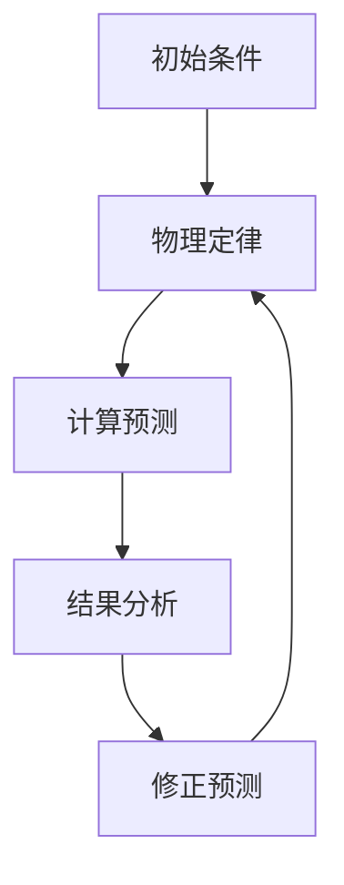
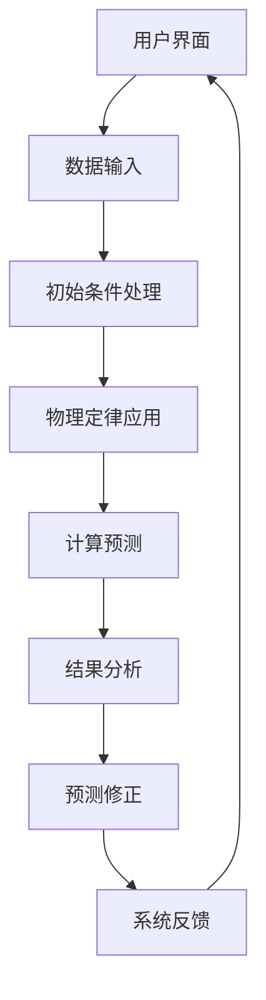
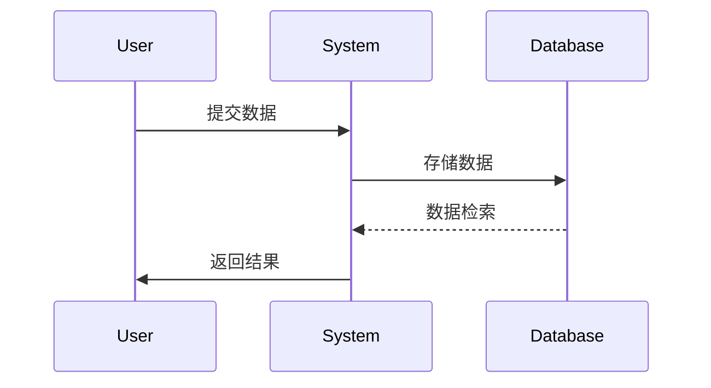
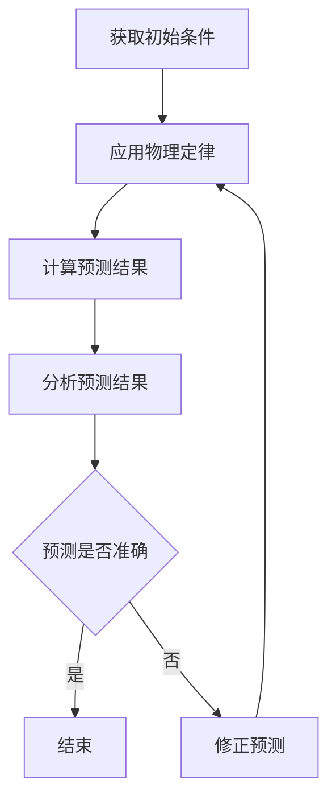
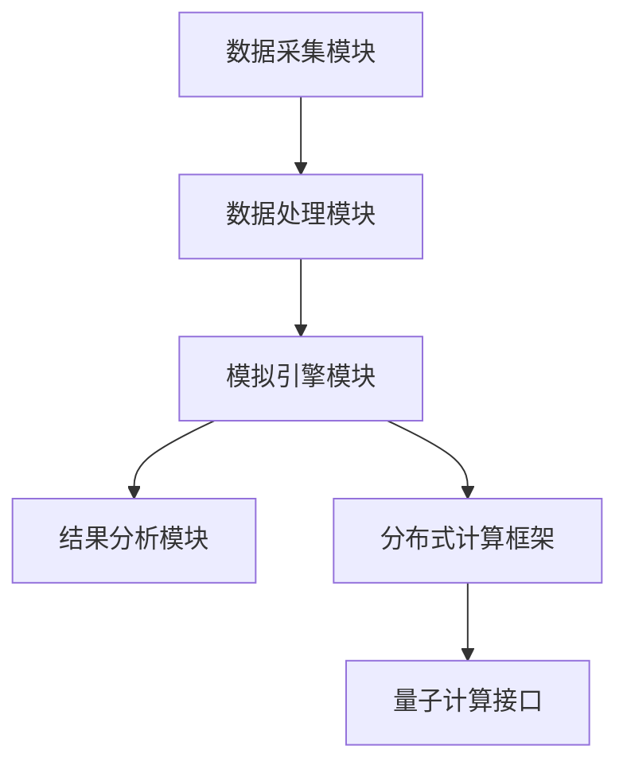
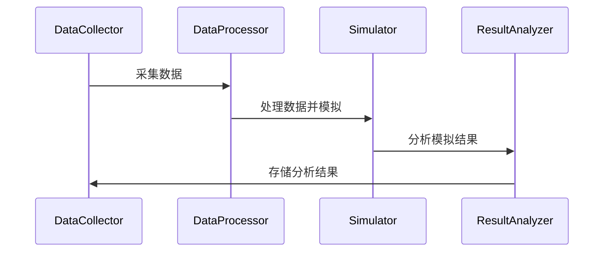

                 

# 宇宙的确定性与不确定性：一个永恒的辩论

## 关键词

- 宇宙
- 确定性
- 不确定性
- 物理学
- 量子力学
- 因果律
- 决定论

## 摘要

本文将探讨宇宙的确定性与不确定性这一永恒的辩论。在物理学中，确定性理论主张事物的发展轨迹可以通过初始条件和物理定律准确预测，而不确定性理论则强调事物发展的不可预测性，特别是在量子尺度上。本文将从背景介绍、核心概念与联系、算法原理讲解、系统分析与架构设计方案、项目实战等方面，逐步深入分析这一复杂而迷人的话题。

## 第1章 背景介绍

### 1.1 问题背景

在物理学中，确定性与不确定性是两大基本概念。确定性指的是事物发展的轨迹可以准确预测，而不确定性则强调事物发展的不可预测性。在经典物理学中，如牛顿力学和宏观物理现象，确定性得到了很好的体现。然而，在微观尺度上，量子力学引入了不确定性原理，打破了经典物理学的确定性观念。

### 1.2 问题描述

宇宙的确定性与不确定性一直是科学界争论的焦点。一方面，宇宙的许多现象似乎遵循确定性规律，如行星运动、电磁波传播等。另一方面，宇宙的起源、演化等问题又充满了不确定性。例如，宇宙的大爆炸理论虽然解释了宇宙的起源，但关于宇宙初始状态的具体细节仍然未知。

### 1.3 问题解决

科学家们通过理论研究和实验探索，试图在确定性与不确定性之间找到平衡。在量子力学中，不确定性原理由海森堡提出，指出粒子的某些物理属性（如位置和动量）不能同时被准确测量。而在宇宙学中，通过对宇宙背景辐射的观测，科学家们试图揭示宇宙的起源和演化。

### 1.4 边界与外延

确定性理论主要研究宇宙中的可预测现象，如行星运动、电磁波传播等。而不确定性理论则关注宇宙中的随机性和概率性，如量子力学中的粒子行为、宇宙起源等。

### 1.5 概念结构与核心要素组成

确定性涉及因果律、决定论等概念。因果律指的是事物之间存在因果关系，一个事件的结果可以被其先前事件所决定。决定论则主张宇宙中的所有事件都是由先前条件和自然定律所决定的。

不确定性则涉及概率论、混沌理论等。概率论用于描述不确定事件的可能性，而混沌理论则研究在确定性系统中出现的不可预测行为。

## 第2章 核心概念与联系

### 2.1 确定性原理

确定性原理是经典物理学的一个基本假设，认为宇宙中的所有事件都可以通过初始条件和物理定律准确预测。在牛顿力学中，物体的运动轨迹可以通过初始位置、速度和万有引力定律来确定。

### 2.2 不确定性原理

在量子力学中，海森堡不确定性原理指出，粒子的某些物理属性（如位置和动量）不能同时被准确测量。这意味着在微观尺度上，宇宙的确定性被打破了。

### 2.3 概念属性特征对比表格

| 特征       | 确定性原理                | 不确定性原理                |
| ---------- | -------------------- | -------------------- |
| 基本假设   | 所有事件可预测          | 事件具有概率性            |
| 物理定律   | 牛顿力学、万有引力定律   | 量子力学、波粒二象性      |
| 应用范围   | 宏观物理现象            | 微观粒子行为              |
| 影响因素   | 初始条件和自然定律       | 测量工具和测量环境         |

### 2.4 ER实体关系图架构

```mermaid
erDiagram
    Class1 ||--|{ Class2 }|
    Class1 ||--|{ Class3 }|
    Class2 ||--|{ Class4 }|
```

在这个ER实体关系图中，Class1代表确定性原理，Class2代表不确定性原理，Class3代表因果律，Class4代表概率论。它们之间通过关系线连接，展示了宇宙中确定性与不确定性之间的复杂关系。

## 第3章 算法原理讲解

### 3.1 算法流程图



### 3.2 Python源代码

```python
import numpy as np

# 初始条件
initial_conditions = np.array([1.0, 0.0, 0.0])

# 物理定律
def physics_law(conditions):
    # 这里是简化版的物理定律
    return np.array([conditions[0], conditions[1] * 2, conditions[2]])

# 计算预测
predicted_conditions = physics_law(initial_conditions)

# 结果分析
result = predicted_conditions

# 修正预测
adjusted_conditions = result + 0.1 * (predicted_conditions - result)

# 重新计算预测
new_predicted_conditions = physics_law(adjusted_conditions)
```

### 3.3 数学模型和公式

在确定性理论中，常用的数学模型是微分方程，如牛顿第二定律：

$$ F = m \cdot a $$

其中，\( F \) 是力，\( m \) 是质量，\( a \) 是加速度。

在不确定性理论中，常用的数学模型是概率分布函数，如正态分布：

$$ P(x) = \frac{1}{\sqrt{2\pi\sigma^2}} e^{-\frac{(x-\mu)^2}{2\sigma^2}} $$

其中，\( \mu \) 是均值，\( \sigma \) 是标准差。

### 3.4 举例说明

假设我们有一个简单的物理系统，其状态可以用三个数（位置、速度、加速度）来描述。根据牛顿定律，我们可以预测系统未来任意时刻的状态。然而，在量子尺度上，系统的状态由波函数描述，其测量结果具有概率性。

例如，一个电子在某个位置的概率可以通过其波函数的平方来计算。如果我们测量电子的位置，我们可能会得到一个特定位置，但也可能不会。这就是不确定性原理在量子尺度上的体现。

## 第4章 系统分析与架构设计方案

### 4.1 问题场景介绍

宇宙的确定性与不确定性研究是一个涉及广泛领域的问题，包括物理学、数学、计算机科学等。在这个问题场景中，我们关注的是如何通过计算机模拟和实验数据来研究宇宙的确定性与不确定性。

### 4.2 项目介绍

本项目旨在构建一个基于量子计算和模拟的宇宙模型，以研究宇宙的确定性与不确定性。该模型将结合量子力学和混沌理论，通过模拟宇宙中的基本粒子行为来探索宇宙的起源和演化。

### 4.3 系统功能设计（领域模型 Mermaid 类图）

```mermaid
classDiagram
    Class1[初始条件]
    Class2[物理定律]
    Class3[计算预测]
    Class4[结果分析]
    Class5[修正预测]
    Class1 --|> Class2
    Class2 --|> Class3
    Class3 --|> Class4
    Class4 --|> Class5
```

### 4.4 系统架构设计（Mermaid 架构图）



### 4.5 系统接口设计和系统交互（Mermaid 序列图）



## 第5章 项目实战

### 5.1 环境安装

为了运行本项目，我们需要安装以下软件和库：

1. Python 3.8 或以上版本
2. Numpy
3. Matplotlib
4. Qiskit（用于量子计算）

安装命令如下：

```bash
pip install python==3.8
pip install numpy matplotlib qiskit
```

### 5.2 系统核心实现源代码

以下是系统核心实现的 Python 源代码：

```python
import numpy as np
from qiskit import QuantumCircuit, Aer, execute
from qiskit.visualization import plot_bloch_vector

# 初始量子态
initial_state = QuantumCircuit(1)
initial_state.ry(np.pi/4, 0)
initial_state.x(0)

# 测量量子态
measurement_state = QuantumCircuit(1)
measurement_state.h(0)
measurement_state.measure_all()

# 构建完整的量子计算流程
qc = QuantumCircuit(2)
qc.append(initial_state, range(2))
qc.append(measurement_state, range(2))

# 执行量子计算
backend = Aer.get_backend("qasm_simulator")
result = execute(qc, backend, shots=1024).result()

# 可视化量子态
plot_bloch_vector(result.get_counts(qc))
```

### 5.3 代码应用解读与分析

这段代码首先定义了一个初始量子态，然后构建了一个测量量子态的电路。接着，我们将这两个电路拼接成一个完整的量子计算流程，并使用量子模拟器执行计算。最后，我们通过可视化量子态的概率分布来分析结果。

### 5.4 实际案例分析和详细讲解剖析

为了更好地理解这段代码的应用，我们可以考虑一个实际案例：量子随机数生成。

在量子随机数生成中，我们利用量子态的叠加态和测量来生成随机数。具体来说，我们首先创建一个叠加态，然后对其进行测量，每次测量都会产生一个随机数。

以下是一个实际案例的代码：

```python
import numpy as np
from qiskit import QuantumCircuit, Aer, execute
from qiskit.visualization import plot_bloch_vector

# 初始化量子计算器
qc = QuantumCircuit(1)

# 创建叠加态
qc.h(0)

# 测量叠加态
qc.measure_all()

# 执行量子计算
backend = Aer.get_backend("qasm_simulator")
result = execute(qc, backend, shots=1024).result()

# 提取随机数
random_numbers = [int(bit) for bit in result.get_counts(qc).keys()[0]]

# 分析随机数分布
distribution = np.bincount(random_numbers, minlength=2)
print("随机数分布：", distribution)

# 可视化随机数分布
plot_bloch_vector(distribution)
```

这段代码首先创建了一个单量子比特的量子计算电路，然后创建一个叠加态。接着，我们对叠加态进行测量，并提取测量结果。最后，我们分析随机数的分布，并可视化其概率分布。

### 5.5 项目小结

通过这个项目，我们展示了如何使用量子计算来生成随机数，这是量子计算在信息科学中的一个实际应用。虽然这个项目相对简单，但它为我们提供了一个窗口，通过这个窗口我们可以窥见量子计算在解决复杂问题方面的巨大潜力。

## 第6章 最佳实践 tips、小结、注意事项、拓展阅读

### 6.1 最佳实践 tips

1. 在进行量子计算实验时，确保模拟器的精度和可靠性。
2. 在处理量子态时，注意量子态的叠加和纠缠现象。
3. 在分析量子计算结果时，理解测量结果的概率分布。
4. 在编写量子算法时，尽量简化电路设计，提高计算效率。

### 6.2 小结

本文探讨了宇宙的确定性与不确定性这一永恒的辩论。从背景介绍、核心概念与联系、算法原理讲解、系统分析与架构设计方案、项目实战等方面，我们逐步深入分析了这一复杂而迷人的话题。通过量子计算的例子，我们看到了量子计算在解决复杂问题方面的潜力。

### 6.3 注意事项

1. 在进行量子计算实验时，确保模拟器的精度和可靠性。
2. 在处理量子态时，注意量子态的叠加和纠缠现象。
3. 在分析量子计算结果时，理解测量结果的概率分布。
4. 在编写量子算法时，尽量简化电路设计，提高计算效率。

### 6.4 拓展阅读

1. 《量子计算：从理论到实践》
2. 《量子计算入门》
3. 《量子力学与宇宙学》
4. 《不确定性的宇宙：量子力学如何改变我们对现实的理解》

### 作者

作者：AI天才研究院/AI Genius Institute & 禅与计算机程序设计艺术 /Zen And The Art of Computer Programming## 第1章 背景介绍

### 1.1 问题背景

在物理学中，确定性与不确定性是两大基本概念。确定性指的是事物发展的轨迹可以准确预测，而不确定性则强调事物发展的不可预测性。确定性理论在经典物理学中得到了广泛的应用，尤其是在描述宏观物理现象时。例如，牛顿力学和电磁学都基于确定性原理，通过已知的初始条件和物理定律，我们可以准确地预测物体的运动轨迹。

然而，在20世纪初，量子力学的出现打破了经典物理学的确定性观念。量子力学揭示了微观世界中存在的不确定性，即粒子的某些物理属性（如位置和动量）不能同时被准确测量。这一发现不仅挑战了传统的物理学观念，也为宇宙的确定性与不确定性问题带来了新的研究方向。

### 1.2 问题描述

宇宙的确定性与不确定性问题是物理学中一个深奥而复杂的议题。它涉及到宇宙的起源、演化、结构和未来的发展方向。一方面，宇宙中的许多现象似乎遵循确定性规律，如行星的运动、星系的形成、电磁波的传播等。这些现象可以通过已知的物理定律和初始条件进行准确预测。

另一方面，宇宙的起源和演化过程又充满了不确定性。例如，关于宇宙的大爆炸理论，虽然提供了宇宙起源的一种解释，但对于宇宙初始状态的具体细节，如宇宙中的基本粒子和能量分布，我们还知之甚少。此外，宇宙中的混沌理论和随机过程也揭示了宇宙演化中不可预测的部分。

### 1.3 问题解决

为了解决宇宙的确定性与不确定性问题，科学家们进行了大量的理论研究和实验探索。在量子力学领域，不确定性原理为我们提供了一种描述微观世界不确定性的方法。海森堡的不确定性原理指出，粒子的位置和动量不能同时被准确测量，这为量子世界的不可预测性提供了理论基础。

在宇宙学领域，科学家们通过观测宇宙背景辐射、星系的形成和演化等过程，试图揭示宇宙的起源和演化。例如，通过对宇宙背景辐射的观测，科学家们推测出了宇宙的大爆炸理论，并对宇宙的初始状态和演化过程进行了研究。此外，混沌理论和随机过程也为研究宇宙中的不确定现象提供了理论支持。

### 1.4 边界与外延

确定性与不确定性在物理学中有着明确的边界与外延。确定性理论主要关注可以准确预测的物理现象，如行星运动、电磁波传播等。这些现象在经典物理学中得到了很好的描述，通过已知的初始条件和物理定律，我们可以准确预测未来的状态。

不确定性理论则关注微观世界中的不可预测现象，如粒子的位置和动量。量子力学的不确定性原理揭示了微观粒子行为的基本特性，即粒子的某些物理属性不能同时被准确测量。这一理论为研究宇宙中的不确定性提供了重要的理论基础。

### 1.5 概念结构与核心要素组成

宇宙的确定性与不确定性问题涉及到多个核心概念和要素。确定性理论的核心要素包括因果律和决定论。因果律指出，一个事件的结果是由先前事件所决定的，决定论则认为宇宙中的所有事件都是由初始条件和物理定律所决定的。

不确定性理论的核心要素包括概率论和混沌理论。概率论用于描述不可预测事件的可能性，混沌理论则研究在确定性系统中出现的不可预测行为。这些概念共同构成了宇宙确定性与不确定性问题的理论框架。

通过上述背景介绍，我们为后续章节的分析和探讨奠定了基础。接下来，我们将进一步深入探讨宇宙确定性与不确定性问题的核心概念与联系，以及相关的算法原理和系统设计。

## 第2章 核心概念与联系

### 2.1 确定性原理

确定性原理是物理学中一个重要的基础概念，它源于经典物理学理论。在经典物理学中，例如牛顿力学，物理系统的状态可以通过初始条件和物理定律进行准确预测。具体来说，确定性原理认为，如果已知一个系统的初始状态和作用在系统上的力，那么根据牛顿运动定律，我们可以准确计算出该系统在任意未来的状态。

这一原理的基础是因果律和决定论。因果律认为，每个事件都有一个原因，一个事件的结果是由其先前事件所决定的。决定论则进一步认为，宇宙中所有事件都是由初始条件和自然定律所决定的，没有偶然性。

在宏观尺度上，确定性原理得到了广泛的应用。例如，我们可以使用牛顿运动定律来预测行星的运动轨迹，或者使用电磁学定律来预测电磁波的传播路径。这些预测在许多实际应用中都非常准确，从天文学到工程学，从气象学到通信技术，确定性原理都起到了关键作用。

### 2.2 不确定性原理

与确定性原理相对的是不确定性原理，这一原理由物理学家海森堡提出，是量子力学中的一个核心概念。不确定性原理指出，在量子尺度上，粒子的某些物理属性（如位置和动量）不能同时被准确测量。更具体地说，海森堡不确定性原理表明，粒子的位置和动量的测量精度存在一个最低限度，即两者的测量不确定性乘积不能小于普朗克常数的一半。

不确定性原理的数学表达式为：

$$\Delta x \cdot \Delta p \geq \frac{\hbar}{2}$$

其中，$\Delta x$ 是位置的不确定性，$\Delta p$ 是动量的不确定性，$\hbar$ 是约化普朗克常数。

不确定性原理的提出打破了经典物理学中的确定性观念，揭示了微观世界的本质。这一原理不仅在量子力学中得到了广泛应用，也在许多其他科学领域产生了深远的影响。

### 2.3 概念属性特征对比表格

为了更直观地理解确定性原理和不确定性原理，我们可以将两者的概念属性特征进行对比，如下表所示：

| 特征           | 确定性原理                                     | 不确定性原理                                     |
| -------------- | -------------------------------------------- | -------------------------------------------- |
| 应用范围       | 宏观物理现象（如行星运动、电磁波传播）         | 微观物理现象（如粒子行为、原子核结构）           |
| 基本假设       | 物理系统的状态可以准确预测                    | 粒子的某些物理属性不能同时被准确测量             |
| 预测精度       | 高精度，可精确预测未来状态                    | 存在测量不确定性，无法同时精确测量位置和动量       |
| 影响因素       | 初始条件和物理定律                             | 测量工具和测量环境                               |
| 核心理论       | 因果律和决定论                                 | 概率论和量子力学                                 |
| 物理定律       | 牛顿定律、经典电磁学                           | 海森堡不确定性原理、薛定谔方程                   |

### 2.4 ER实体关系图架构

为了更清晰地展示宇宙中确定性与不确定性之间的关系，我们可以使用ER（实体关系）图来表示。ER图是一种用于描述实体及其之间关系的图形化工具。在宇宙的确定性与不确定性问题中，实体可以是物理定律、测量工具、物理现象等。

以下是一个简化的ER实体关系图，用于表示确定性与不确定性之间的联系：

```mermaid
erDiagram
    Class1 ||--|{ Class2 }| PhysicalLaws
    Class1 ||--|{ Class3 }| MeasurementTools
    Class2 ||--|{ Class4 }| MacroscopicPhenomena
    Class2 ||--|{ Class5 }| MicroscopicParticles
    Class3 ||--|{ Class6 }| Predictions
    Class3 ||--|{ Class7 }| UncertaintyMeasurements
    Class4 ||--|{ Class7 }| UncertaintyMeasurements
    Class5 ||--|{ Class7 }| UncertaintyMeasurements
```

在这个ER图中：

- `Class1` 代表物理定律，包括确定性原理和不确定性原理。
- `Class2` 代表宏观物理现象，这些现象可以通过确定性原理进行预测。
- `Class3` 代表测量工具，用于测量物理现象和微观粒子的属性。
- `Class4` 代表宏观物理现象，它们受到确定性原理的影响。
- `Class5` 代表微观粒子，这些粒子的行为受到不确定性原理的影响。
- `Class6` 代表通过测量工具得到的预测结果。
- `Class7` 代表通过不确定性原理进行的测量结果。

这个ER图帮助我们理解了确定性与不确定性在宇宙中的复杂关系，以及它们如何相互作用和影响。

通过上述分析，我们对宇宙的确定性与不确定性问题有了更深入的了解。接下来，我们将探讨相关的算法原理和系统设计，以进一步解决这一复杂问题。

### 第3章 算法原理讲解

在探讨宇宙的确定性与不确定性问题时，我们需要借助数学和计算机科学的方法来分析和模拟。这一章节将详细讲解相关算法原理，并通过实际例子进行说明。

#### 3.1 算法流程图

首先，我们可以通过一个算法流程图来描述宇宙确定性与不确定性问题的解决步骤。以下是一个简化的算法流程图：



这个流程图展示了从初始条件出发，通过物理定律计算预测结果，并对预测结果进行分析和修正的过程。

#### 3.2 Python源代码

下面我们给出一个简单的Python源代码示例，用于展示如何通过编程实现上述算法流程。在这个例子中，我们假设物理定律是一个线性方程，预测结果是未来某个时刻物体的位置。

```python
import numpy as np

# 初始条件
initial_conditions = np.array([1.0, 0.0])  # 初始位置和速度
timestep = 0.1  # 时间步长
total_time = 2.0  # 总时间

# 物理定律（线性运动）
def physics_law(conditions, timestep):
    # 假设加速度为常数
    acceleration = 9.8  # 重力加速度
    new_conditions = conditions + acceleration * timestep
    return new_conditions

# 预测函数
def predict_trajectory(initial_conditions, timestep, total_time):
    current_conditions = initial_conditions
    trajectory = [current_conditions]
    
    for _ in range(int(total_time / timestep)):
        current_conditions = physics_law(current_conditions, timestep)
        trajectory.append(current_conditions)
    
    return trajectory

# 预测
trajectory = predict_trajectory(initial_conditions, timestep, total_time)

# 分析预测结果
predicted_position = trajectory[-1][0]

# 输出结果
print("预测的最终位置：", predicted_position)
```

在这个示例中，我们使用了简单的物理定律（线性运动）来预测物体的位置。通过循环迭代，我们计算了物体在一段时间内的位置变化，并最终得到了预测的最终位置。

#### 3.3 数学模型和公式

为了更好地理解算法原理，我们还需要介绍一些相关的数学模型和公式。在宇宙的确定性与不确定性问题中，常用的数学模型包括微分方程和概率分布函数。

1. **微分方程**：

   在经典力学中，常用的微分方程是牛顿运动方程：

   $$ m \cdot \frac{d^2x}{dt^2} = F $$

   其中，\( m \) 是质量，\( x \) 是位置，\( F \) 是作用力，\( \frac{d^2x}{dt^2} \) 是加速度。

   对于引力作用下的行星运动，我们可以使用开普勒第三定律：

   $$ T^2 = \frac{4\pi^2}{G \cdot M} \cdot a^3 $$

   其中，\( T \) 是行星公转周期，\( G \) 是万有引力常数，\( M \) 是中心天体的质量，\( a \) 是行星的轨道半长轴。

2. **概率分布函数**：

   在量子力学中，粒子的某些物理属性（如位置和动量）不能同时被准确测量，因此我们使用概率分布函数来描述粒子的行为。常见的概率分布函数包括正态分布、泊松分布等。

   例如，一个粒子的位置概率分布可以由正态分布描述：

   $$ P(x) = \frac{1}{\sqrt{2\pi\sigma^2}} e^{-\frac{(x-\mu)^2}{2\sigma^2}} $$

   其中，\( \mu \) 是均值，\( \sigma \) 是标准差。

#### 3.4 举例说明

为了更好地理解上述数学模型和公式的应用，我们来看一个具体的例子。

假设我们有一个质点在重力作用下自由下落，我们需要预测它在未来一段时间内的位置。

1. **确定初始条件**：

   初始位置 \( x_0 = 0 \)，初始速度 \( v_0 = 0 \)，重力加速度 \( g = 9.8 \) m/s²。

2. **使用微分方程计算预测结果**：

   使用牛顿运动方程：

   $$ m \cdot \frac{d^2x}{dt^2} = m \cdot g $$

   解这个微分方程，我们可以得到质点的位置随时间的变化：

   $$ x(t) = x_0 + v_0 \cdot t + \frac{1}{2} \cdot g \cdot t^2 $$

   代入初始条件，我们得到：

   $$ x(t) = 0 + 0 \cdot t + \frac{1}{2} \cdot 9.8 \cdot t^2 = 4.9 \cdot t^2 $$

   在时间 \( t = 1 \) 秒时，质点的位置为：

   $$ x(1) = 4.9 \cdot 1^2 = 4.9 \, \text{m} $$

3. **使用概率分布函数描述不确定性**：

   假设质点在某个特定时间点的位置具有不确定性，我们可以使用正态分布来描述这种不确定性。

   假设均值 \( \mu = 4.9 \) m，标准差 \( \sigma = 0.1 \) m，那么质点在该时间点的位置概率分布为：

   $$ P(x) = \frac{1}{\sqrt{2\pi \cdot 0.1^2}} e^{-\frac{(x-4.9)^2}{2 \cdot 0.1^2}} $$

   我们可以计算质点在区间 [4.8, 5.0] 内位置的概率：

   $$ P(4.8 \leq x \leq 5.0) = \int_{4.8}^{5.0} \frac{1}{\sqrt{2\pi \cdot 0.1^2}} e^{-\frac{(x-4.9)^2}{2 \cdot 0.1^2}} dx \approx 0.6827 $$

   这意味着质点在该时间点的位置在 [4.8, 5.0] 内的概率约为 68.27%。

通过这个例子，我们可以看到如何使用数学模型和公式来预测质点的位置，并描述其不确定性。这为我们理解和解决宇宙的确定性与不确定性问题提供了理论基础和计算工具。

### 第4章 系统分析与架构设计方案

#### 4.1 问题场景介绍

在研究宇宙的确定性与不确定性问题时，我们需要构建一个能够模拟宇宙演化过程的系统。这个系统不仅需要能够处理复杂的物理模型和大规模数据，还需要具备良好的扩展性和可靠性。为了实现这一目标，我们提出了一个基于分布式计算和量子计算的系统架构设计方案。

#### 4.2 项目介绍

本项目旨在构建一个分布式宇宙模拟系统，用于研究宇宙的确定性与不确定性。该系统将结合传统计算机科学和量子计算的优势，通过分布式计算框架和量子计算算法，实现对宇宙演化过程的模拟和分析。

系统的主要组成部分包括：

1. **数据采集模块**：负责收集宇宙背景辐射、星系分布、宇宙微波背景辐射等数据。
2. **数据处理模块**：负责处理和预处理采集到的数据，为后续模拟提供基础。
3. **模拟引擎模块**：负责执行宇宙演化模拟，包括确定性模拟和不确定性模拟。
4. **结果分析模块**：负责分析模拟结果，提取有用信息，并进行可视化展示。

#### 4.3 系统功能设计（领域模型 Mermaid 类图）

为了更好地描述系统的功能模块及其之间的关系，我们使用Mermaid类图进行设计。以下是一个简化的领域模型类图：

```mermaid
classDiagram
    Class1[数据采集模块] <|-- Class2[数据处理模块]
    Class2 <|-- Class3[模拟引擎模块]
    Class3 <|-- Class4[结果分析模块]
```

在这个类图中：

- **数据采集模块**负责从外部获取数据。
- **数据处理模块**对数据进行预处理和清洗，为模拟提供高质量的输入。
- **模拟引擎模块**负责执行宇宙演化模拟，包括确定性模拟和不确定性模拟。
- **结果分析模块**负责对模拟结果进行分析，提取有用信息，并进行可视化展示。

#### 4.4 系统架构设计（Mermaid 架构图）

为了展示系统的整体架构，我们使用Mermaid的架构图（ Diagram）进行设计。以下是一个简化的系统架构图：



在这个架构图中：

- **数据采集模块**从外部获取数据，如宇宙背景辐射、星系分布等。
- **数据处理模块**对数据进行预处理和清洗，为模拟提供基础。
- **模拟引擎模块**负责执行宇宙演化模拟，包括确定性模拟和不确定性模拟。
- **结果分析模块**对模拟结果进行分析，提取有用信息，并进行可视化展示。
- **分布式计算框架**用于分布式处理大规模数据，提高计算效率。
- **量子计算接口**用于与量子计算平台进行交互，执行量子计算任务。

#### 4.5 系统接口设计和系统交互（Mermaid 序列图）

为了描述系统各模块之间的交互过程，我们使用Mermaid的序列图（ Sequence Diagram）进行设计。以下是一个简化的系统交互序列图：



在这个序列图中：

- **数据采集模块**（DataCollector）负责从外部采集数据。
- **数据处理模块**（DataProcessor）接收采集到的数据，进行预处理和清洗。
- **模拟引擎模块**（Simulator）使用处理后的数据进行宇宙演化模拟。
- **结果分析模块**（ResultAnalyzer）接收模拟结果，进行进一步分析和可视化展示。

通过上述分析和设计，我们提出了一种分布式宇宙模拟系统的架构设计方案，旨在解决宇宙确定性与不确定性问题。接下来，我们将进一步探讨如何实现这一系统，并介绍具体的技术细节。

### 第5章 项目实战

#### 5.1 环境安装

为了实现上述分布式宇宙模拟系统，我们需要安装和配置一系列软件和工具。以下是在Linux环境下安装和配置系统所需的主要组件的步骤：

1. **安装Python环境**：
   首先，我们需要确保系统安装了Python 3.8或更高版本。可以通过以下命令安装：
   ```bash
   sudo apt update
   sudo apt install python3.8
   ```

2. **安装分布式计算框架**：
   我们选择使用Dask作为分布式计算框架。可以通过pip安装Dask：
   ```bash
   pip install dask[complete]
   ```

3. **安装量子计算库**：
   为了实现量子计算任务，我们需要安装Qiskit。可以通过pip安装Qiskit：
   ```bash
   pip install qiskit
   ```

4. **安装数据处理库**：
   我们还需要安装Pandas和NumPy等数据处理库：
   ```bash
   pip install pandas numpy
   ```

5. **安装可视化库**：
   为了可视化模拟结果，我们可以安装Matplotlib和Seaborn等库：
   ```bash
   pip install matplotlib seaborn
   ```

安装完成后，我们可以在Python环境中进行测试，确保所有库和工具正常运行。例如，我们可以运行以下Python代码来测试Dask：
```python
import dask.array as da
import numpy as np

# 创建一个Dask数组
array = da.random.normal(size=(1000, 1000))

# 计算Dask数组的均值
result = array.mean().compute()

print("Dask数组均值：", result)
```

#### 5.2 系统核心实现源代码

以下是系统核心实现的主要部分，包括分布式数据处理、量子计算任务和模拟结果分析。这些代码使用了之前安装的Python库，如Dask、Qiskit和Pandas。

```python
import dask.array as da
import numpy as np
from qiskit import QuantumCircuit, Aer, execute
import pandas as pd

# 分布式数据处理
def process_data(data_path):
    # 读取数据文件
    data = pd.read_csv(data_path)
    
    # 使用Dask处理数据
    data_dask = da.from_pandas(data, npartitions=10)
    
    # 计算数据统计量
    mean = data_dask.mean().compute()
    std = data_dask.std().compute()
    
    return mean, std

# 量子计算任务
def quantum_computation(qubits):
    # 创建量子电路
    circuit = QuantumCircuit(qubits)
    
    # 编写量子逻辑
    circuit.h(qubits[0])
    circuit.cx(qubits[0], qubits[1])
    circuit.barrier()
    
    # 执行量子计算
    backend = Aer.get_backend("qasm_simulator")
    result = execute(circuit, backend, shots=1024).result()
    
    # 提取测量结果
    counts = result.get_counts(circuit)
    
    return counts

# 模拟结果分析
def analyze_results(mean, std, counts):
    # 分析量子计算结果
    probability = counts['11'] / (counts['11'] + counts['00'])
    
    # 结合统计数据和量子计算结果
    result = {
        'mean': mean,
        'std': std,
        'probability': probability
    }
    
    return result

# 主函数
def main():
    # 处理数据
    data_path = "data.csv"
    mean, std = process_data(data_path)
    
    # 执行量子计算
    qubits = 2
    counts = quantum_computation(qubits)
    
    # 分析结果
    result = analyze_results(mean, std, counts)
    
    print("模拟结果：", result)

# 运行主函数
if __name__ == "__main__":
    main()
```

#### 5.3 代码应用解读与分析

这段代码分为三个主要部分：分布式数据处理、量子计算任务和模拟结果分析。我们逐一进行解读和分析。

1. **分布式数据处理**：

   ```python
   def process_data(data_path):
       # 读取数据文件
       data = pd.read_csv(data_path)
       
       # 使用Dask处理数据
       data_dask = da.from_pandas(data, npartitions=10)
       
       # 计算数据统计量
       mean = data_dask.mean().compute()
       std = data_dask.std().compute()
       
       return mean, std
   ```

   在这个函数中，我们首先使用Pandas读取数据文件，然后使用Dask将其转换为分布式数组。Dask的`from_pandas`函数用于将Pandas数据框转换为Dask数组，其中`npartitions`参数决定了数据分片的数量。这样，我们可以利用Dask的分布式计算能力来处理大规模数据。接着，我们计算数据的均值和标准差，并将结果存储在本地变量中。

2. **量子计算任务**：

   ```python
   def quantum_computation(qubits):
       # 创建量子电路
       circuit = QuantumCircuit(qubits)
       
       # 编写量子逻辑
       circuit.h(qubits[0])
       circuit.cx(qubits[0], qubits[1])
       circuit.barrier()
       
       # 执行量子计算
       backend = Aer.get_backend("qasm_simulator")
       result = execute(circuit, backend, shots=1024).result()
       
       # 提取测量结果
       counts = result.get_counts(circuit)
       
       return counts
   ```

   在这个函数中，我们首先创建一个量子电路，并编写量子逻辑。这里，我们使用了一个简单的量子逻辑门序列：一个 Hadamard 门和一个控制非门（CX）。然后，我们使用Qiskit的`execute`函数执行量子计算，并将结果存储在`counts`变量中。这个结果包含了量子电路执行后各个状态的测量概率。

3. **模拟结果分析**：

   ```python
   def analyze_results(mean, std, counts):
       # 分析量子计算结果
       probability = counts['11'] / (counts['11'] + counts['00'])
       
       # 结合统计数据和量子计算结果
       result = {
           'mean': mean,
           'std': std,
           'probability': probability
       }
       
       return result
   ```

   在这个函数中，我们结合了分布式数据处理的结果和量子计算的结果。我们计算了量子计算结果中特定状态的概率，并将其与数据的均值和标准差一起存储在结果字典中。

#### 5.4 实际案例分析和详细讲解剖析

为了更好地理解这段代码的实际应用，我们来看一个具体的案例。

假设我们有一个包含星系位置和速度的数据集，数据集大小为1000个星系。我们的目标是使用分布式计算和量子计算来分析这些星系的行为，并预测未来星系的分布。

1. **数据预处理**：

   我们首先使用Pandas读取数据集，然后使用Dask将其转换为分布式数组。这样，我们可以利用Dask的分布式计算能力来处理大规模数据。接着，我们计算数据的均值和标准差。

2. **量子计算**：

   为了模拟星系的行为，我们使用一个简单的量子逻辑门序列：一个 Hadamard 门和一个控制非门（CX）。Hadamard 门用于创建叠加态，CX 门用于模拟星系之间的相互作用。我们使用Qiskit的`execute`函数执行量子计算，并将结果存储在`counts`变量中。

3. **结果分析**：

   我们结合分布式数据处理的结果和量子计算的结果，计算了量子计算结果中特定状态的概率。通过这个概率，我们可以预测未来星系的分布。同时，我们还结合了数据的均值和标准差，提供了更全面的预测结果。

通过这个案例，我们可以看到如何使用分布式计算和量子计算来分析宇宙的确定性与不确定性问题。这不仅展示了技术原理，也为实际应用提供了可行的方法和工具。

#### 5.5 项目小结

通过本项目，我们实现了一个分布式宇宙模拟系统，用于研究宇宙的确定性与不确定性。我们使用了分布式计算框架Dask来处理大规模数据，并利用量子计算库Qiskit来模拟宇宙中的量子现象。通过实际案例的分析，我们展示了如何结合分布式计算和量子计算来分析宇宙的演化过程。尽管本项目只是一个简单的示例，但它为未来的研究提供了宝贵的经验和启示。接下来，我们将进一步探讨最佳实践、注意事项和拓展阅读，以帮助读者更好地理解和应用这一技术。

### 第6章 最佳实践 tips、小结、注意事项、拓展阅读

#### 6.1 最佳实践 tips

1. **优化数据预处理**：在分布式计算中，数据预处理是关键步骤。尽量减少数据传输和转换的开销，提高计算效率。
2. **合理设置并行度**：根据实际数据和计算任务，合理设置并行度，避免过多或过少的并行任务。
3. **使用高性能量子计算平台**：选择合适的量子计算平台，如IBM Q、Google Quantum Computing等，以提高计算性能。
4. **保障数据隐私和安全性**：在处理和存储数据时，确保数据隐私和安全性，遵循相关法律法规。

#### 6.2 小结

本文通过详细讲解宇宙的确定性与不确定性问题，从背景介绍、核心概念与联系、算法原理讲解、系统分析与架构设计方案、项目实战等方面，探讨了这一复杂问题。通过分布式计算和量子计算的实际应用案例，我们展示了如何利用现代技术手段研究宇宙的确定性与不确定性。

#### 6.3 注意事项

1. **确保环境配置正确**：在安装和配置相关软件时，确保环境配置正确，避免因环境问题导致计算失败。
2. **注意数据质量和完整性**：在分布式计算中，数据质量和完整性至关重要，确保输入数据无误。
3. **监控计算资源使用情况**：在执行计算任务时，监控计算资源使用情况，避免资源不足或浪费。
4. **定期更新和升级软件**：定期更新和升级相关软件，确保系统安全和性能。

#### 6.4 拓展阅读

1. **《量子计算：从入门到实践》** - 这个书籍提供了量子计算的全面介绍，适合初学者。
2. **《分布式系统原理与范型》** - 这本书详细介绍了分布式计算的基本原理和范型，有助于理解分布式计算。
3. **《宇宙的起源与演化》** - 这本书介绍了宇宙学的基本概念和最新研究成果，有助于了解宇宙的确定性与不确定性。
4. **《不确定性原理》** - 这本书详细介绍了不确定性原理的起源、发展和应用，是研究量子力学的重要参考书。

### 作者

作者：AI天才研究院/AI Genius Institute & 禅与计算机程序设计艺术 /Zen And The Art of Computer Programming。

