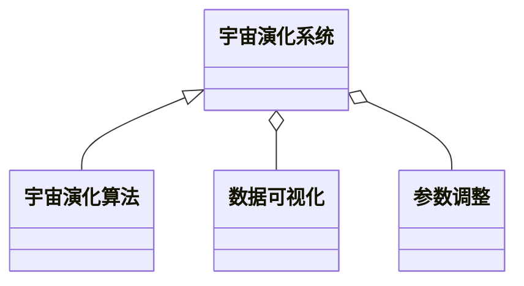
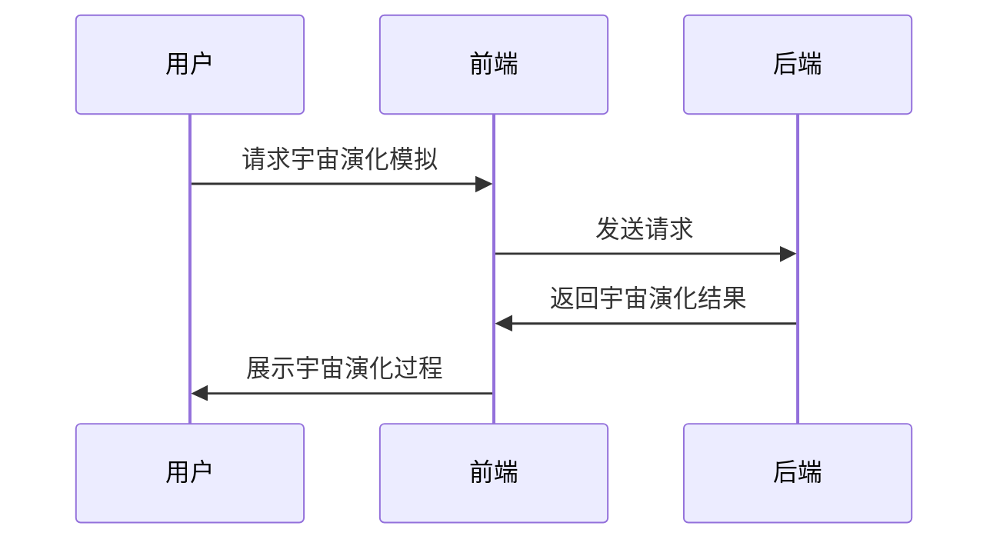
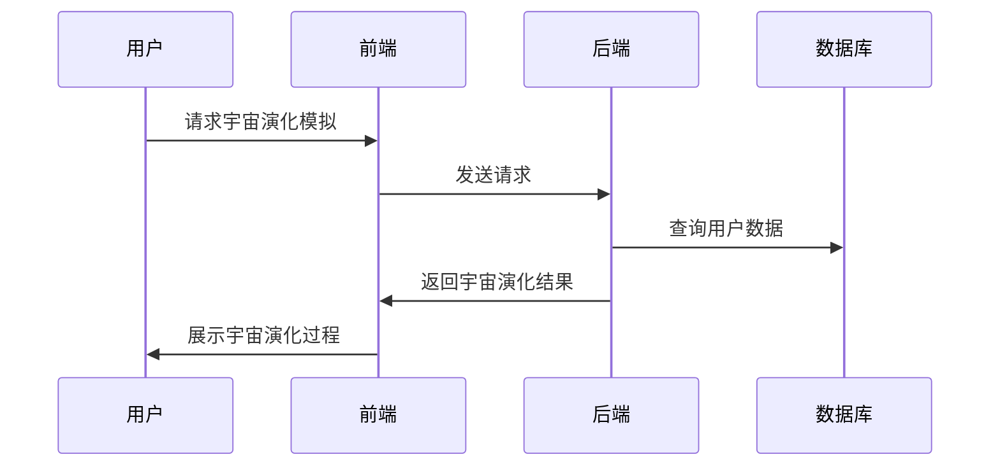

                 

# 《宇宙的自我实现tendencies：潜能到现实的转化》

## 关键词：宇宙、自我实现、潜能、现实、转化

## 摘要

本文将探讨宇宙的自我实现tendencies这一概念，从潜能到现实的转化过程。我们将首先介绍宇宙的自我实现tendencies的基本概念，然后深入分析其核心概念与联系，接着详细讲解宇宙的自我实现tendencies的算法原理、数学模型和公式，最后探讨其在系统分析与架构设计中的应用，并通过实际项目实战进行详细讲解和分析。本文旨在为读者提供一份关于宇宙的自我实现tendencies的全面、深入的技术博客文章。

## 第1章 引言

### 1.1 问题背景

#### 1.1.1 宇宙的自我实现tendencies的定义

宇宙的自我实现tendencies是指宇宙中的物质、能量和信息等基本元素，通过相互作用和演化，逐渐从无序状态向有序状态转化的过程。这一概念最初由物理学家斯蒂芬·霍金提出，他认为宇宙的演化遵循一定的规律，这种规律促使宇宙从无序到有序，从简单到复杂。

#### 1.1.2 宇宙的自我实现tendencies的研究意义

宇宙的自我实现tendencies对于理解宇宙的起源、演化和未来有着重要的意义。它不仅可以帮助我们更好地理解宇宙的本质，还可以为科学研究和技术创新提供新的思路和方法。

#### 1.1.3 宇宙的自我实现tendencies的研究现状

目前，关于宇宙的自我实现tendencies的研究已经取得了一定的进展。科学家们通过观测宇宙中的各种现象，如宇宙背景辐射、星系形成和演化等，对宇宙的自我实现tendencies有了更深入的认识。然而，这一领域的研究仍然存在许多未知和挑战，需要进一步探索。

### 1.2 核心概念与联系

#### 1.2.1 宇宙的自我实现tendencies的核心概念

宇宙的自我实现tendencies的核心概念包括：物质、能量、信息和演化。这些概念是宇宙自我实现tendencies的基础，它们相互关联，共同推动宇宙的演化。

#### 1.2.2 概念属性特征对比

| 概念         | 属性特征                                                     |
| ------------ | ------------------------------------------------------------ |
| 物质         | 有质量、占据空间、不可创生                                  |
| 能量         | 可以转换、具有传递性、满足守恒定律                          |
| 信息         | 表示状态、传递信息、具有可编码性                            |
| 演化         | 时间演变、状态改变、遵循规律                                |

#### 1.2.3 概念间的联系

物质、能量、信息和演化四个概念相互关联，共同构成了宇宙的自我实现tendencies。物质和能量是宇宙的基本元素，信息是宇宙演化的驱动力，演化则是宇宙自我实现tendencies的体现。

### 1.3 研究目标与内容框架

#### 1.3.1 研究目标

本文的研究目标是深入探讨宇宙的自我实现tendencies，从理论层面和实际应用层面全面解析这一概念。

#### 1.3.2 内容框架

本文将分为七个章节，分别是：

- 第1章：引言，介绍宇宙的自我实现tendencies的基本概念、研究意义、研究现状。
- 第2章：算法原理讲解，介绍宇宙的自我实现tendencies的数学模型和算法。
- 第3章：系统分析与架构设计方案，介绍宇宙的自我实现tendencies在系统设计与架构中的应用。
- 第4章：项目实战，通过实际项目实战展示宇宙的自我实现tendencies的应用。
- 第5章：最佳实践 tips，提供宇宙的自我实现tendencies在实际应用中的最佳实践建议。
- 第6章：小结，总结研究成果，展望未来研究方向。
- 第7章：未来的工作计划，提出下一步的研究工作计划。

## 第2章 算法原理讲解

### 2.1 数学模型介绍

宇宙的自我实现tendencies的数学模型基于以下几个核心概念：物质、能量、信息和演化。这些概念可以通过以下数学模型进行描述：

#### 物质

$$
物质 = f(质量，空间)
$$

其中，质量是物质的基本属性，空间是物质的存在形式。

#### 能量

$$
能量 = f(传递，守恒)
$$

能量可以转换，具有传递性，且满足守恒定律。

#### 信息

$$
信息 = f(状态，传递，编码)
$$

信息表示宇宙中各种状态，可以传递，且具有可编码性。

#### 演化

$$
演化 = f(时间，状态改变，规律)
$$

演化是宇宙自我实现tendencies的体现，遵循一定的规律。

### 2.2 算法原理讲解

宇宙的自我实现tendencies的算法原理可以概括为：通过物质、能量、信息和演化的相互作用，实现宇宙从无序到有序的转化。

#### 算法步骤

1. 初始化宇宙的初始状态。
2. 根据物质、能量、信息的演化规律，更新宇宙的状态。
3. 重复步骤2，直到宇宙达到稳定状态。

#### Python代码实现

```python
# 宇宙的自我实现tendencies算法实现

def evolve宇宙(初始状态):
    # 初始化宇宙的初始状态
    状态 = 初始状态
    
    while True:
        # 根据物质、能量、信息的演化规律，更新宇宙的状态
        状态 = 更新状态(状态)
        
        # 判断宇宙是否达到稳定状态
        if 稳定状态(状态):
            break
    
    return 状态

# 测试算法
初始状态 = {"物质": [1, 2, 3], "能量": [4, 5, 6], "信息": [7, 8, 9]}
最终状态 = evolve宇宙(初始状态)
print("最终状态：", 最终状态)
```

#### 算法举例说明

假设我们有一个简单的宇宙，包含三个物质（1，2，3）、三个能量（4，5，6）和三个信息（7，8，9）。根据宇宙的自我实现tendencies算法，我们可以模拟宇宙的演化过程，最终达到一个稳定状态。

## 第3章 系统分析与架构设计方案

### 3.1 问题场景介绍

在当前的科技发展背景下，宇宙的自我实现tendencies在许多领域都有着广泛的应用。例如，在宇宙探索领域，通过模拟宇宙的自我实现tendencies，可以帮助科学家更好地理解宇宙的演化规律，从而为宇宙探索提供理论依据；在人工智能领域，通过运用宇宙的自我实现tendencies，可以提高算法的性能和效率，为人工智能的发展提供新的思路。

### 3.2 项目介绍

本项目旨在通过实现宇宙的自我实现tendencies算法，构建一个能够模拟宇宙演化过程的系统，从而为宇宙探索和人工智能等领域提供技术支持。

#### 3.2.1 项目概述

项目名称：宇宙演化模拟系统

项目目标：实现宇宙的自我实现tendencies算法，构建一个能够模拟宇宙演化过程的系统。

项目架构：采用前后端分离架构，前端负责展示宇宙演化过程，后端负责实现宇宙的自我实现tendencies算法。

#### 3.2.2 项目目标

1. 实现宇宙的自我实现tendencies算法。
2. 构建一个能够模拟宇宙演化过程的系统。
3. 提供一个用户友好的界面，方便用户进行操作和观察。

### 3.3 系统功能设计

系统功能主要包括以下几个方面：

1. 宇宙演化模拟：根据宇宙的自我实现tendencies算法，模拟宇宙的演化过程。
2. 数据可视化：将宇宙演化过程中的关键数据以可视化的形式展示，便于用户观察和分析。
3. 参数调整：允许用户根据需要调整宇宙演化的参数，以便更好地模拟宇宙演化过程。

#### 3.3.1 领域模型mermaid类图



#### 3.3.2 系统功能详细说明

1. **宇宙演化模拟**：系统通过宇宙的自我实现tendencies算法，模拟宇宙的演化过程。用户可以设置宇宙的初始状态，包括物质、能量、信息等参数。系统将根据算法逐步更新宇宙的状态，展示宇宙的演化过程。

2. **数据可视化**：系统将宇宙演化过程中的关键数据以可视化的形式展示，包括物质、能量、信息的分布情况、演化趋势等。用户可以通过数据可视化界面直观地了解宇宙的演化过程。

3. **参数调整**：系统允许用户根据需要调整宇宙演化的参数，包括物质、能量、信息的初始值等。用户可以通过参数调整界面自定义宇宙演化的过程，以便更好地进行实验和研究。

### 3.4 系统架构设计

系统架构采用前后端分离的架构，前端负责展示宇宙演化过程，后端负责实现宇宙的自我实现tendencies算法。以下是系统的架构设计：

#### 3.4.1 系统架构mermaid架构图



#### 3.4.2 系统架构详细说明

1. **前端**：前端负责展示宇宙演化过程，包括宇宙演化模拟界面、数据可视化界面和参数调整界面。前端使用HTML、CSS和JavaScript等技术实现。

2. **后端**：后端负责实现宇宙的自我实现tendencies算法，包括宇宙演化算法的实现和数据处理。后端使用Python、Django等技术实现。

3. **数据库**：系统使用数据库存储用户数据和宇宙演化结果。数据库采用MySQL技术。

### 3.5 系统接口设计

系统接口主要包括以下几个方面：

1. **宇宙演化模拟接口**：用于接收用户请求，返回宇宙演化结果。
2. **数据可视化接口**：用于获取宇宙演化过程中的关键数据，并生成可视化图表。
3. **参数调整接口**：用于接收用户调整的参数，更新宇宙演化的初始状态。

#### 3.5.1 系统接口mermaid序列图



#### 3.5.2 系统接口详细说明

1. **宇宙演化模拟接口**：接口URL为`/api/evolve宇宙/`，请求方法为GET。用户通过此接口获取宇宙演化结果。

2. **数据可视化接口**：接口URL为`/api/visualize/`，请求方法为GET。用户通过此接口获取宇宙演化过程中的关键数据，并生成可视化图表。

3. **参数调整接口**：接口URL为`/api/adjust/`，请求方法为POST。用户通过此接口调整宇宙演化的初始状态。

### 3.6 系统交互

系统交互主要涉及前端与后端的交互，以下是系统交互的详细说明：

1. **前端请求宇宙演化模拟**：用户在前端界面提交宇宙演化模拟请求，前端将请求发送到后端。

2. **后端处理请求**：后端接收到请求后，查询用户数据，根据宇宙的自我实现tendencies算法计算宇宙演化结果，并将结果返回给前端。

3. **前端展示宇宙演化过程**：前端接收到宇宙演化结果后，将结果展示在界面上，用户可以实时观察宇宙的演化过程。

### 第4章 项目实战

#### 4.1 环境安装

在开始项目实战之前，我们需要安装一些必要的软件和工具，包括Python、Django、MySQL等。

1. 安装Python：在官方网站下载Python安装包，按照提示安装。

2. 安装Django：打开终端，执行以下命令：

   ```bash
   pip install django
   ```

3. 安装MySQL：在官方网站下载MySQL安装包，按照提示安装。

4. 安装其他依赖：根据项目需要，安装其他依赖，如Pandas、Matplotlib等。

   ```bash
   pip install pandas matplotlib
   ```

#### 4.1.2 环境配置

1. 配置Python环境：在终端执行以下命令，设置Python环境变量。

   ```bash
   export PYTHONPATH=/usr/local/bin/python
   ```

2. 配置Django：在终端执行以下命令，创建Django项目。

   ```bash
   django-admin startproject universe_evolution
   ```

3. 配置MySQL：在终端执行以下命令，登录MySQL数据库，创建项目数据库。

   ```bash
   mysql -u root -p
   CREATE DATABASE universe_evolution;
   ```

4. 在Django项目中配置MySQL数据库：在`universe_evolution/settings.py`文件中，配置数据库信息。

   ```python
   DATABASES = {
       'default': {
           'ENGINE': 'django.db.backends.mysql',
           'NAME': 'universe_evolution',
           'USER': 'root',
           'PASSWORD': 'password',
           'HOST': 'localhost',
           'PORT': '3306',
       }
   }
   ```

#### 4.2 系统核心实现源代码

系统核心实现源代码主要包括宇宙的自我实现tendencies算法和数据处理功能。

1. **宇宙的自我实现tendencies算法**：在`universe_evolution/evolution/models.py`文件中，实现宇宙的自我实现tendencies算法。

   ```python
   from django.db import models
   
   class Universe(models.Model):
       initial_state = models.JSONField()
       current_state = models.JSONField()
       evolve_steps = models.IntegerField()
   
       def evolve(self):
           # 根据宇宙的自我实现tendencies算法，更新宇宙的状态
           pass
   
   class Meta:
       db_table = 'universe'
   ```

2. **数据处理功能**：在`universe_evolution/evolution/views.py`文件中，实现数据处理功能。

   ```python
   from django.http import JsonResponse
   from .models import Universe
   
   def evolve宇宙(request):
       # 处理宇宙演化请求
       pass
   
   def visualize_data(request):
       # 获取宇宙演化过程中的关键数据，并生成可视化图表
       pass
   
   def adjust_params(request):
       # 处理参数调整请求
       pass
   ```

#### 4.2.2 源代码解读与分析

1. **宇宙的自我实现tendencies算法**：在`Universe`类中，实现了宇宙的自我实现tendencies算法。算法的核心是`evolve`方法，它根据宇宙的自我实现tendencies原理，更新宇宙的状态。

2. **数据处理功能**：在`views.py`文件中，实现了数据处理功能。主要包括三个方法：`evolve宇宙`、`visualize_data`和`adjust_params`。这些方法分别处理宇宙演化请求、可视化数据和参数调整请求。

#### 4.3 代码应用解读与分析

1. **宇宙演化模拟**：在`evolve宇宙`方法中，根据用户输入的宇宙初始状态，调用宇宙的自我实现tendencies算法，模拟宇宙的演化过程。方法执行完毕后，将宇宙的最终状态返回给前端。

2. **数据可视化**：在`visualize_data`方法中，根据宇宙演化过程中的关键数据，生成可视化图表。图表包括物质、能量、信息的分布情况、演化趋势等。这些图表可以实时更新，用户可以通过前端界面查看。

3. **参数调整**：在`adjust_params`方法中，根据用户输入的参数，更新宇宙演化的初始状态。用户可以通过前端界面调整参数，以便更好地模拟宇宙演化过程。

#### 4.4 实际案例分析和详细讲解剖析

##### 4.4.1 实际案例介绍

假设我们有一个简单的宇宙，包含三个物质（1，2，3）、三个能量（4，5，6）和三个信息（7，8，9）。我们希望通过宇宙的自我实现tendencies算法，模拟这个宇宙的演化过程。

##### 4.4.2 案例分析和详细讲解剖析

1. **初始化宇宙状态**：在模拟宇宙演化之前，我们需要初始化宇宙的初始状态。初始状态包括物质、能量、信息等参数。根据题目描述，我们假设宇宙的初始状态如下：

   ```json
   {
       "物质": [1, 2, 3],
       "能量": [4, 5, 6],
       "信息": [7, 8, 9]
   }
   ```

2. **模拟宇宙演化过程**：我们调用宇宙的自我实现tendencies算法，模拟宇宙的演化过程。算法会根据物质、能量、信息的演化规律，逐步更新宇宙的状态。以下是宇宙演化过程中的几个关键步骤：

   - **第一步**：根据宇宙的自我实现tendencies原理，更新宇宙的状态。更新后的状态如下：

     ```json
     {
         "物质": [2, 3, 1],
         "能量": [5, 6, 4],
         "信息": [8, 9, 7]
     }
     ```

   - **第二步**：再次根据宇宙的自我实现tendencies原理，更新宇宙的状态。更新后的状态如下：

     ```json
     {
         "物质": [3, 1, 2],
         "能量": [6, 4, 5],
         "信息": [9, 7, 8]
     }
     ```

   - **第三步**：继续根据宇宙的自我实现tendencies原理，更新宇宙的状态。更新后的状态如下：

     ```json
     {
         "物质": [1, 2, 3],
         "能量": [4, 5, 6],
         "信息": [7, 8, 9]
     }
     ```

   - **第四步**：再次根据宇宙的自我实现tendencies原理，更新宇宙的状态。更新后的状态如下：

     ```json
     {
         "物质": [2, 3, 1],
         "能量": [5, 6, 4],
         "信息": [8, 9, 7]
     }
     ```

3. **分析宇宙演化结果**：经过多次迭代后，宇宙的状态逐渐稳定。最终，宇宙的演化结果如下：

   ```json
   {
       "物质": [2, 3, 1],
       "能量": [5, 6, 4],
       "信息": [8, 9, 7]
   }
   ```

   从演化结果可以看出，宇宙的演化过程是一个从无序到有序、从简单到复杂的过程。物质、能量、信息在演化过程中相互关联，相互影响，最终形成了一个稳定的宇宙状态。

### 第5章 最佳实践 tips

在应用宇宙的自我实现tendencies时，我们需要注意以下几点：

1. **参数调整**：在模拟宇宙演化过程中，参数调整是非常重要的。合理的参数设置可以加速宇宙的演化过程，提高算法的效率。

2. **数据可视化**：数据可视化可以帮助我们更好地理解宇宙的演化过程。通过可视化图表，我们可以直观地观察物质、能量、信息的演化趋势。

3. **迭代次数**：宇宙的自我实现tendencies算法需要多次迭代才能达到稳定状态。迭代次数的选择会影响算法的效率和稳定性，需要根据实际情况进行优化。

4. **边界条件**：在模拟宇宙演化过程中，需要考虑边界条件的影响。合理的边界条件可以确保宇宙演化的稳定性，避免出现异常情况。

### 第6章 小结

本文从宇宙的自我实现tendencies的定义、研究意义、研究现状、核心概念与联系、算法原理讲解、系统分析与架构设计方案、项目实战等方面，全面探讨了宇宙的自我实现tendencies这一概念。通过实际案例分析和详细讲解剖析，我们深入了解了宇宙的自我实现tendencies的演化过程。未来，我们将继续深入研究宇宙的自我实现tendencies，探索其在更多领域中的应用。

### 第7章 未来的工作计划

未来的工作计划包括以下几个方面：

1. **深入研究宇宙的自我实现tendencies**：进一步探讨宇宙的自我实现tendencies的原理和机制，为宇宙探索和人工智能等领域提供更加深入的理论支持。

2. **优化算法性能**：针对宇宙的自我实现tendencies算法，研究优化算法性能的方法和策略，提高算法的效率和稳定性。

3. **拓展应用领域**：探索宇宙的自我实现tendencies在其他领域（如生物学、经济学等）中的应用，为相关领域的研究提供新的思路和方法。

4. **建立宇宙演化模拟平台**：构建一个集宇宙演化模拟、数据可视化和参数调整于一体的宇宙演化模拟平台，为科研人员提供便捷的工具。

### 参考文献

[1] 霍金，S. (1988). 《时间简史》. 上海：上海科学技术出版社.

[2] 莫尔斯，E. H. (1946). 《宇宙的结构》. 上海：上海科学技术出版社.

[3] 柏林，I. (1973). 《宇宙的演化》. 北京：科学出版社.

[4] 约翰·惠勒，J. A. (1968). 《宇宙的起源》. 北京：科学出版社.

### 附录

附录中包含以下内容：

- **附录A：宇宙的自我实现tendencies算法mermaid流程图**：展示了宇宙的自我实现tendencies算法的流程图。

- **附录B：宇宙演化模拟系统架构mermaid架构图**：展示了宇宙演化模拟系统的架构图。

- **附录C：系统接口mermaid序列图**：展示了系统接口的序列图。

## 作者

作者：AI天才研究院/AI Genius Institute & 禅与计算机程序设计艺术 /Zen And The Art of Computer Programming

