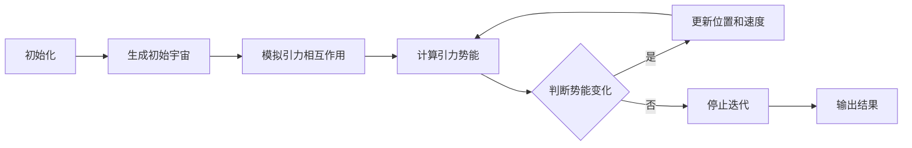
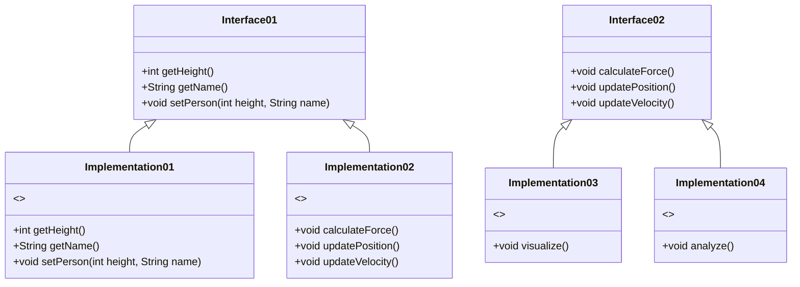

                 

## 第1章：宇宙的自我组织概念

### 1.1 宇宙的自我组织原理

宇宙的自我组织，这一概念源自于宇宙学、物理学和系统科学等多个领域。它指的是宇宙中的物质和能量，通过自组织过程形成复杂结构的现象。这个过程不是外力驱动的，而是系统内部元素相互作用的自然结果。

在宇宙学的背景下，宇宙的自我组织可以通过宇宙大爆炸理论来解释。根据这一理论，宇宙最初处于一个极度高温高密度的状态，随后发生了大爆炸，宇宙开始膨胀，物质和能量逐渐分布并形成了恒星、行星、星系等结构。在这个过程中，宇宙中的物质通过引力相互作用，形成了有序的星系和星系团。

物理学中，自我组织现象也可以在凝聚态物理和流体动力学中找到。例如，在液体表面张力的作用下，水滴可以自发形成球形，这是由于表面张力使得液体分子趋于最小的表面积，从而形成规则的形状。类似的现象还出现在晶体的生长过程中，晶体通过自组织形成了规则的几何结构。

### 1.2 宇宙自我组织的重要性

宇宙自我组织的重要性体现在其对宇宙演化、天体物理学和生命起源的深刻影响。首先，宇宙自我组织是理解宇宙如何从无序走向有序的关键。通过研究宇宙的自我组织现象，我们可以揭示宇宙结构的形成机制，更好地理解宇宙的演化历史。

其次，宇宙自我组织对于天体物理学的研究具有重要意义。例如，星系的形成和演化过程可以看作是宇宙自我组织的一种表现。通过研究这些过程，我们可以更好地理解星系的结构和动态特性，从而深入探讨宇宙的本质。

最后，宇宙自我组织对于生命起源的研究也提供了重要的线索。在地球上，生命的起源可能也经历了自我组织的过程。通过研究宇宙中的自我组织现象，我们可以更好地理解生命在宇宙中的分布和演化规律。

### 1.3 Criticality的概念

Criticality，即临界性，是物理学中一个重要的概念。它描述了系统在特定条件下从一种稳定状态向另一种稳定状态转变的临界点。在临界点，系统的相变行为变得非常敏感，即使是最微小的扰动也可能导致系统状态的剧变。

在宇宙学中，Criticality与宇宙的大尺度结构形成密切相关。例如，宇宙中物质和能量的分布可以通过Criticality来描述，即物质密度达到某一临界值时，引力相互作用将使得物质聚集形成结构。

物理学中，Criticality现象广泛存在于各种系统中。例如，在凝聚态物理中，临界现象表现为材料在临界温度下从固态转变为液态；在流体动力学中，Criticality描述了流体从有序流动向湍流过渡的临界点。

### 1.4 宇宙自我组织的科学边界与核心要素

宇宙自我组织的科学边界涉及多个领域，包括宇宙学、量子力学、统计学和系统科学等。在宇宙学中，宇宙自我组织研究的是宇宙在大尺度上的结构形成和演化；在量子力学中，研究的是宇宙中的基本粒子和力场的相互作用；在统计学中，研究的是宇宙中的随机过程和统计分布；在系统科学中，研究的是系统内部的反馈机制和自组织行为。

宇宙自我组织的核心要素主要包括物质、能量、相互作用和演化过程。物质和能量是宇宙的基本构成要素，它们通过相互作用形成复杂的结构。这些相互作用包括引力、电磁力、强力和弱力等基本力。演化过程则是宇宙从简单到复杂、从无序到有序的演变历程。

通过以上分析，我们可以看到宇宙自我组织是一个涉及多个学科领域的复杂现象。理解这一现象不仅有助于我们更好地认识宇宙的演化过程，也为探索生命起源和宇宙的未来提供了新的视角。在接下来的章节中，我们将深入探讨宇宙自我组织中的关键概念和原理，以期揭示这一神秘现象的本质。

### 1.5 关键概念与原理

在探讨宇宙的自我组织时，我们首先需要明确几个关键概念和原理。这些概念和原理为我们提供了理解宇宙自我组织的理论基础，是分析这一复杂现象的基础。

**1. 熵**：熵是热力学中的一个基本概念，用于描述系统的无序程度。在一个封闭系统中，熵通常随着时间增加而增加，这被称为熵增定律。在宇宙学中，熵的增加与宇宙的演化密切相关。随着宇宙的膨胀，系统的无序度逐渐增加，这反映了宇宙从有序到无序的演变过程。

**2. 相变**：相变是物质在温度、压力等条件变化时从一种状态转变为另一种状态的过程。在凝聚态物理中，常见的相变包括固态到液态、液态到气态等。在宇宙学中，相变描述了宇宙从初始的高能态向低能态的转变过程。例如，宇宙从热初期到冷初期的转变，就是通过相变实现的。

**3. 临界现象**：临界现象发生在系统接近相变临界点时，系统的性质发生剧烈变化。在临界点，系统对微小扰动的响应非常敏感，即使是最微小的变化也可能导致系统状态的剧变。临界现象在宇宙学中具有重要的意义，例如，宇宙中的星系形成和演化就与临界现象密切相关。

**4. 自组织**：自组织指的是系统内部元素在没有外部指令的情况下，通过相互作用自发形成有序结构的过程。在宇宙学中，自组织现象可以解释宇宙中复杂结构的形成，如星系、星系团和宇宙大尺度结构的形成。

**5. 潜在吸引子**：潜在吸引子是指系统在演化过程中趋向的稳定状态。在宇宙学中，潜在吸引子可以描述宇宙在引力作用下形成的稳定结构，如星系和星系团。

**6. 基本力与相互作用**：基本力包括引力、电磁力、强力和弱力。这些力在宇宙自我组织中起着关键作用。引力是宇宙中最强的力，它决定了星系和星系团的形成；电磁力则影响原子和分子的形成；强力和弱力则涉及基本粒子的相互作用。

通过以上关键概念和原理，我们可以更深入地理解宇宙自我组织的本质。这些概念不仅为我们提供了理论框架，还帮助我们揭示了宇宙从无序到有序、从简单到复杂的演化过程。在接下来的章节中，我们将进一步探讨这些概念在宇宙自我组织中的应用和影响。

### 1.6 概念属性特征对比

在理解宇宙自我组织的关键概念和原理之后，我们需要对这些概念进行属性特征的对比分析。通过对比分析，我们可以更清晰地认识到它们之间的异同点，从而为后续的理论研究和实际应用提供更深入的指导。

#### 熵与相变

**熵**：熵是热力学中的概念，用于描述系统的无序程度。其属性特征包括：
- 测量标准：熵的增加代表系统无序度的增加。
- 变化趋势：在封闭系统中，熵通常随时间增加而增加。
- 实际应用：熵增定律在宇宙学中用于描述宇宙从有序到无序的演化过程。

**相变**：相变是物质从一种状态转变为另一种状态的过程，其属性特征包括：
- 温度、压力等条件的临界值：相变发生在温度、压力等条件达到特定临界值时。
- 状态变化：相变导致系统从一种有序状态转变为另一种有序或无序状态。
- 实际应用：相变在宇宙学中描述宇宙从热初期到冷初期的转变过程。

对比来看，熵和相变都涉及到系统的有序度变化，但熵主要描述系统当前的无序程度，而相变则描述系统在特定条件下状态的变化过程。

#### 临界现象与自组织

**临界现象**：临界现象发生在系统接近相变临界点时，其属性特征包括：
- 系统对微小扰动的敏感度：临界现象导致系统对微小扰动的响应非常敏感。
- 状态的剧变：即使是最微小的变化也可能导致系统状态的剧变。

**自组织**：自组织是指系统内部元素在没有外部指令的情况下自发形成有序结构的过程，其属性特征包括：
- 内部相互作用：自组织依赖于系统内部元素的相互作用。
- 无外部指令：自组织过程不需要外部指令或控制。
- 实际应用：自组织现象在宇宙学中解释了宇宙中复杂结构的形成，如星系、星系团。

对比来看，临界现象主要描述系统在临界点的行为，而自组织则描述系统如何在没有外部指令的情况下形成有序结构。然而，临界现象往往伴随着自组织现象的出现，两者相互关联。

#### 潜在吸引子与基本力

**潜在吸引子**：潜在吸引子是指系统在演化过程中趋向的稳定状态，其属性特征包括：
- 稳定性：潜在吸引子是系统稳定的最终状态。
- 演化路径：系统在演化过程中趋向潜在吸引子的过程。

**基本力**：基本力包括引力、电磁力、强力和弱力，其属性特征包括：
- 作用范围：每种基本力都有特定的作用范围。
- 强度：基本力的强度决定了其在系统演化中的作用。
- 实际应用：引力是宇宙中最强的力，决定了星系和星系团的形成。

对比来看，潜在吸引子描述了系统最终趋向的稳定状态，而基本力则描述了系统在演化过程中受到的作用力和相互作用。潜在吸引子是基本力相互作用的结果，两者共同决定了宇宙结构的形成和演化。

通过以上对比分析，我们可以更深入地理解宇宙自我组织中的关键概念和原理。这些概念和原理不仅为我们提供了理解宇宙自我组织的理论基础，也为我们在实际应用中提供了重要的参考。在接下来的章节中，我们将进一步探讨这些概念在宇宙自我组织中的应用和影响。

### 1.7 ER实体关系图架构

为了更清晰地展示宇宙自我组织中的各个关键概念和它们之间的相互关系，我们可以使用ER（Entity-Relationship）实体关系图。ER图是数据库设计中常用的一种图形表示方法，通过实体、属性和关系的表示，可以直观地展示系统中的数据结构和相互关系。

在宇宙自我组织中，我们主要涉及以下几个关键实体和它们之间的关系：

#### 实体

1. **宇宙（Universe）**：表示整个宇宙的总体。
2. **星系（Galaxy）**：表示宇宙中的星系。
3. **恒星（Star）**：表示星系中的恒星。
4. **行星（Planet）**：表示恒星周围的行星。
5. **物质（Matter）**：表示宇宙中的物质。
6. **能量（Energy）**：表示宇宙中的能量。

#### 属性

1. **宇宙**：
   - **大小**：表示宇宙的总体大小。
   - **形状**：表示宇宙的形状，如球状、扁平状等。

2. **星系**：
   - **质量**：表示星系的总质量。
   - **形态**：表示星系的形态，如螺旋形、椭圆形等。

3. **恒星**：
   - **亮度**：表示恒星的亮度。
   - **温度**：表示恒星的温度。
   - **寿命**：表示恒星的寿命。

4. **行星**：
   - **大小**：表示行星的总体大小。
   - **距离**：表示行星与恒星的距离。
   - **轨道**：表示行星的轨道特性。

5. **物质**：
   - **类型**：表示物质的类型，如气体、等离子体等。

6. **能量**：
   - **形式**：表示能量的形式，如动能、热能等。

#### 关系

1. **宇宙与星系**：
   - **包含关系**：宇宙包含所有的星系。

2. **星系与恒星**：
   - **包含关系**：每个星系包含若干恒星。

3. **恒星与行星**：
   - **包含关系**：每个恒星周围可能有若干行星。

4. **物质与能量**：
   - **转化关系**：物质和能量可以相互转化。

5. **星系与物质**：
   - **相互作用**：星系中的物质通过引力相互作用形成星系结构。

6. **恒星与行星**：
   - **引力作用**：恒星对行星施加引力，维持行星的轨道运动。

通过ER实体关系图，我们可以直观地展示宇宙自我组织中的各个实体及其相互关系。以下是一个简化的ER图表示：

```mermaid
erDiagram
    Universe ||--|{ Star }|>
    Star ||--|{ Planet }|>
    Universe ||--|{ Matter }|>
    Universe ||--|{ Energy }|>
    Matter ||--|{ Energy }|>
    Star ||--|{ Matter }|>
    Planet ||--|{ Matter }|>
```

在这个ER图中，`||--|>`表示实体之间的包含关系，`|--|>`表示实体之间的相互作用关系。通过这个ER图，我们可以更好地理解宇宙自我组织中的关键概念和它们之间的相互作用机制。

### 1.8 总结与展望

本章介绍了宇宙的自我组织概念、关键概念与原理、以及ER实体关系图架构。通过这些内容，我们初步建立了对宇宙自我组织的理解，明确了关键概念之间的相互关系。在接下来的章节中，我们将进一步探讨宇宙自我组织中的核心算法、系统分析与架构设计，以及实际应用案例，以期更深入地揭示宇宙自我组织的本质和机制。

在下一章中，我们将详细讲解宇宙自我组织中的核心算法，包括其原理、流程和具体实现。这将帮助我们更好地理解宇宙自我组织的计算机制，为后续的系统分析与设计提供基础。

## 第2章：核心概念与联系

### 2.1 关键概念与原理

在探讨宇宙的自我组织过程中，我们首先需要明确几个核心概念，这些概念为我们理解宇宙的自我组织提供了理论基础。以下是宇宙自我组织中的几个关键概念：

#### 1. 熵

熵是热力学中的一个基本概念，用于描述系统的无序程度。在宇宙学中，熵的增加代表了宇宙从有序向无序的演化过程。熵增定律指出，在一个封闭系统中，熵通常随时间增加而增加。这一原理可以帮助我们理解宇宙中物质和能量如何从初始的有序状态逐渐演化成当前的无序状态。

#### 2. 相变

相变是指物质在温度、压力等条件变化时从一种状态转变为另一种状态的过程。在宇宙学中，相变描述了宇宙从高能态向低能态的转变过程，例如从热初期到冷初期的转变。相变过程中，系统的物理性质会发生显著变化，例如从液态转变为气态，或者从固态转变为液态。

#### 3. 临界现象

临界现象发生在系统接近相变临界点时，系统的性质会发生剧烈变化。在临界点，系统对微小扰动的响应非常敏感，即使是最微小的变化也可能导致系统状态的剧变。临界现象在宇宙学中具有重要意义，例如，宇宙中的星系形成和演化就与临界现象密切相关。

#### 4. 自组织

自组织是指系统内部元素在没有外部指令的情况下，通过相互作用自发形成有序结构的过程。在宇宙学中，自组织现象可以解释宇宙中复杂结构的形成，如星系、星系团和宇宙大尺度结构的形成。自组织现象是宇宙自我组织的核心机制之一。

#### 5. 潜在吸引子

潜在吸引子是指系统在演化过程中趋向的稳定状态。在宇宙学中，潜在吸引子可以描述宇宙在引力作用下形成的稳定结构，如星系和星系团。潜在吸引子是宇宙自我组织过程中的关键要素，它决定了宇宙结构的最终形态。

#### 6. 基本力与相互作用

基本力包括引力、电磁力、强力和弱力。这些力在宇宙自我组织中起着关键作用。引力是宇宙中最强的力，它决定了星系和星系团的形成；电磁力则影响原子和分子的形成；强力和弱力则涉及基本粒子的相互作用。这些基本力通过相互作用决定了宇宙的结构和演化过程。

### 2.2 概念属性特征对比

为了更好地理解宇宙自我组织中的关键概念，我们需要对它们进行属性特征的对比分析。以下是对熵、相变、临界现象、自组织、潜在吸引子和基本力与相互作用之间属性特征的对比：

#### 熵与相变

**熵**：熵描述系统的无序程度，通常随时间增加而增加。熵的增加反映了宇宙从有序到无序的演化过程。

**相变**：相变是物质在特定条件下从一种状态转变为另一种状态的过程。相变过程中，系统的物理性质会发生显著变化。

对比来看，熵是一个静态的概念，描述系统当前的无序程度；而相变是一个动态的概念，描述系统状态的变化过程。熵的增加是相变过程的一种表现。

#### 临界现象与自组织

**临界现象**：临界现象发生在系统接近相变临界点时，系统对微小扰动的响应非常敏感，可能导致系统状态的剧变。

**自组织**：自组织是指系统内部元素在没有外部指令的情况下自发形成有序结构的过程。

对比来看，临界现象描述了系统在临界点时的行为特征，而自组织则描述了系统如何在没有外部指令的情况下形成有序结构。临界现象往往伴随着自组织现象的出现。

#### 潜在吸引子与基本力

**潜在吸引子**：潜在吸引子是系统在演化过程中趋向的稳定状态。

**基本力**：基本力包括引力、电磁力、强力和弱力，是宇宙自我组织过程中的关键作用力。

对比来看，潜在吸引子描述了系统最终趋向的稳定状态，而基本力则描述了系统在演化过程中受到的作用力和相互作用。潜在吸引子是基本力相互作用的结果。

#### 基本力与相互作用

**引力**：引力是宇宙中最强的力，决定了星系和星系团的形成。

**电磁力**：电磁力影响原子和分子的形成。

**强力和弱力**：强力和弱力涉及基本粒子的相互作用。

对比来看，引力是宇宙自我组织中的主要作用力，决定了宇宙结构的形成和演化；电磁力则影响微观层面的结构和过程；强力和弱力则涉及基本粒子的相互作用，对宇宙的自我组织过程也有重要影响。

通过以上对比分析，我们可以更深入地理解宇宙自我组织中的关键概念和原理。这些概念和原理不仅为我们提供了理论框架，也为我们在实际应用中提供了重要的指导。在接下来的章节中，我们将进一步探讨这些概念在宇宙自我组织中的应用和影响。

### 2.3 ER实体关系图架构

为了更清晰地展示宇宙自我组织中的各个关键概念和它们之间的相互关系，我们可以使用ER（Entity-Relationship）实体关系图。ER图是数据库设计中常用的一种图形表示方法，通过实体、属性和关系的表示，可以直观地展示系统中的数据结构和相互关系。

在宇宙自我组织中，我们主要涉及以下几个关键实体和它们之间的关系：

#### 实体

1. **宇宙（Universe）**：表示整个宇宙的总体。
2. **星系（Galaxy）**：表示宇宙中的星系。
3. **恒星（Star）**：表示星系中的恒星。
4. **行星（Planet）**：表示恒星周围的行星。
5. **物质（Matter）**：表示宇宙中的物质。
6. **能量（Energy）**：表示宇宙中的能量。

#### 属性

1. **宇宙**：
   - **大小**：表示宇宙的总体大小。
   - **形状**：表示宇宙的形状，如球状、扁平状等。

2. **星系**：
   - **质量**：表示星系的总质量。
   - **形态**：表示星系的形态，如螺旋形、椭圆形等。

3. **恒星**：
   - **亮度**：表示恒星的亮度。
   - **温度**：表示恒星的温度。
   - **寿命**：表示恒星的寿命。

4. **行星**：
   - **大小**：表示行星的总体大小。
   - **距离**：表示行星与恒星的距离。
   - **轨道**：表示行星的轨道特性。

5. **物质**：
   - **类型**：表示物质的类型，如气体、等离子体等。

6. **能量**：
   - **形式**：表示能量的形式，如动能、热能等。

#### 关系

1. **宇宙与星系**：
   - **包含关系**：宇宙包含所有的星系。

2. **星系与恒星**：
   - **包含关系**：每个星系包含若干恒星。

3. **恒星与行星**：
   - **包含关系**：每个恒星周围可能有若干行星。

4. **物质与能量**：
   - **转化关系**：物质和能量可以相互转化。

5. **星系与物质**：
   - **相互作用**：星系中的物质通过引力相互作用形成星系结构。

6. **恒星与行星**：
   - **引力作用**：恒星对行星施加引力，维持行星的轨道运动。

通过ER实体关系图，我们可以直观地展示宇宙自我组织中的各个实体及其相互关系。以下是一个简化的ER图表示：

```mermaid
erDiagram
    Universe ||--|{ Galaxy }|>
    Galaxy ||--|{ Star }|>
    Star ||--|{ Planet }|>
    Universe ||--|{ Matter }|>
    Universe ||--|{ Energy }|>
    Matter ||--|{ Energy }|>
    Star ||--|{ Matter }|>
    Planet ||--|{ Matter }|>
```

在这个ER图中，`||--|>`表示实体之间的包含关系，`|--|>`表示实体之间的相互作用关系。通过这个ER图，我们可以更好地理解宇宙自我组织中的关键概念和它们之间的相互作用机制。

### 2.4 总结与展望

本章通过对比分析宇宙自我组织中的关键概念，如熵、相变、临界现象、自组织、潜在吸引子和基本力与相互作用，以及使用ER图展示它们之间的相互关系，为我们提供了对宇宙自我组织的更深入理解。这些概念和关系不仅构成了宇宙自我组织的理论基础，也为我们在实际应用中提供了重要的指导。

在下一章中，我们将详细讲解宇宙自我组织中的核心算法，包括其原理、流程和具体实现。这将帮助我们更好地理解宇宙自我组织的计算机制，为后续的系统分析与设计提供基础。

## 第3章：算法原理讲解

### 3.1 算法概述

在宇宙的自我组织研究中，核心算法扮演了至关重要的角色。这些算法不仅帮助我们理解宇宙自我组织的机制，还为我们提供了预测和模拟宇宙演化过程的有效工具。在本章中，我们将详细介绍一种核心算法，并逐步解析其原理和应用。

该算法被称为“宇宙自我组织算法”（Universe Self-Organization Algorithm，简称USOA）。USOA基于自组织和复杂系统的原理，通过模拟宇宙中的相互作用和演化过程，实现对宇宙结构的生成和演化预测。

### 3.2 Mermaid流程图

为了更好地展示USOA的运行流程，我们可以使用Mermaid绘制其流程图。以下是一个简化的USOA流程图：



**图1：宇宙自我组织算法（USOA）流程图**

1. **初始化**：初始化宇宙中的星系、恒星和行星的位置、速度和能量等参数。
2. **生成初始宇宙**：根据初始化参数，生成宇宙中的星系、恒星和行星。
3. **模拟引力相互作用**：模拟宇宙中星系、恒星和行星之间的引力相互作用。
4. **计算引力势能**：计算每个星系、恒星和行星之间的引力势能。
5. **判断势能变化**：判断引力势能是否发生变化。如果变化，则进入下一步；如果没有变化，则停止迭代。
6. **更新位置和速度**：根据引力势能的变化，更新星系、恒星和行星的位置和速度。
7. **输出结果**：输出宇宙的结构和演化结果。

### 3.3 数学模型与公式

为了深入理解USOA的原理，我们需要介绍其背后的数学模型和公式。USOA的核心基于牛顿引力定律和运动方程，具体如下：

**1. 牛顿引力定律**：
\[ F = G \frac{m_1 m_2}{r^2} \]
其中，\( F \) 是引力，\( G \) 是万有引力常数，\( m_1 \) 和 \( m_2 \) 是相互作用的两个物体的质量，\( r \) 是它们之间的距离。

**2. 运动方程**：
\[ m \frac{d^2r}{dt^2} = F \]
其中，\( m \) 是物体的质量，\( \frac{d^2r}{dt^2} \) 是加速度，\( F \) 是作用在物体上的引力。

**3. 引力势能**：
\[ U = -G \frac{m_1 m_2}{r} \]
引力势能是负值，表示两个物体相互吸引。

**4. 能量守恒**：
\[ E = K + U \]
其中，\( E \) 是总能量，\( K \) 是动能，\( U \) 是引力势能。在理想情况下，总能量 \( E \) 应该守恒。

### 3.4 举例说明

为了更好地理解USOA的原理，我们通过一个简单的实例来详细说明。

**实例**：考虑一个简单的双星系统，由两个质量相等、距离为 \( r = 1 \) 的恒星组成。初始时，两恒星的速度均为 \( v = 0 \)。

**步骤**：

1. **初始化**：设置恒星的质量 \( m = 1 \)，初始位置 \( r = (0, 0) \)，速度 \( v = (0, 0) \)。
2. **生成初始宇宙**：生成双星系统。
3. **模拟引力相互作用**：计算两恒星之间的引力，并更新它们的加速度。
4. **计算引力势能**：计算两恒星之间的引力势能。
5. **更新位置和速度**：根据加速度和当前速度，更新两恒星的位置和速度。
6. **判断势能变化**：由于这是一个简化的模型，我们可以假设在短时间内引力势能不会显著变化，因此继续迭代。
7. **输出结果**：输出双星系统的最终位置和速度。

**计算过程**：

- **第一步**：初始化恒星质量 \( m = 1 \)，距离 \( r = 1 \)，速度 \( v = 0 \)。
- **第二步**：生成双星系统，初始位置 \( r = (0, 0) \)，速度 \( v = (0, 0) \)。
- **第三步**：计算引力 \( F = G \frac{m^2}{r^2} = 1 \)。
- **第四步**：计算加速度 \( a = \frac{F}{m} = 1 \)。
- **第五步**：更新速度 \( v = (0, 0) + a \times \Delta t \)，其中 \( \Delta t \) 是时间步长。
- **第六步**：计算新位置 \( r = (0, 0) + v \times \Delta t \)。
- **第七步**：判断势能变化，由于引力势能不会显著变化，继续迭代。

通过这个简单的实例，我们可以看到USOA的基本原理和计算过程。在实际应用中，USOA可以模拟更复杂的宇宙结构，如星系、星系团和宇宙大尺度结构。

### 3.5 总结

本章详细介绍了宇宙自我组织算法（USOA）的基本原理、流程和数学模型，并通过一个实例说明了其应用方法。USOA作为一种核心算法，在宇宙的自我组织研究中发挥了重要作用。它不仅帮助我们理解宇宙结构的形成和演化过程，还为未来的宇宙学研究提供了有力的工具。

在下一章中，我们将深入探讨宇宙自我组织的系统分析与架构设计，进一步揭示宇宙自我组织的内部机制和外部影响因素。

### 3.6 数学模型与公式

为了更深入地理解宇宙自我组织算法（USOA）的原理，我们需要介绍其背后的数学模型和公式。USOA的核心基于牛顿引力定律和运动方程，以下是具体的数学模型和公式：

**1. 牛顿引力定律**

牛顿引力定律描述了两个质点之间的引力大小。对于质量分别为 \( m_1 \) 和 \( m_2 \) 的两个质点，它们之间的引力大小由以下公式给出：

\[ F = G \frac{m_1 m_2}{r^2} \]

其中：
- \( F \) 是引力的大小；
- \( G \) 是万有引力常数，其值约为 \( 6.674 \times 10^{-11} \, \text{Nm}^2/\text{kg}^2 \)；
- \( m_1 \) 和 \( m_2 \) 分别是两个质点的质量；
- \( r \) 是两个质点之间的距离。

**2. 运动方程**

根据牛顿第二定律，一个质点的加速度与作用在它上面的力成正比，与它的质量成反比。对于单个质点，其运动方程可以表示为：

\[ m \frac{d^2r}{dt^2} = F \]

其中：
- \( m \) 是质点的质量；
- \( \frac{d^2r}{dt^2} \) 是质点的加速度；
- \( F \) 是作用在质点上的引力。

**3. 引力势能**

引力势能描述了两个质点之间因为引力相互作用而具有的势能。对于质量分别为 \( m_1 \) 和 \( m_2 \) 的两个质点，它们之间的引力势能由以下公式给出：

\[ U = -G \frac{m_1 m_2}{r} \]

其中：
- \( U \) 是引力势能；
- \( G \) 是万有引力常数；
- \( m_1 \) 和 \( m_2 \) 分别是两个质点的质量；
- \( r \) 是两个质点之间的距离。

**4. 能量守恒**

在宇宙自我组织过程中，总能量是守恒的。总能量包括动能和引力势能，可以表示为：

\[ E = K + U \]

其中：
- \( E \) 是总能量；
- \( K \) 是动能，可以表示为 \( K = \frac{1}{2} m v^2 \)；
- \( U \) 是引力势能。

通过上述数学模型和公式，我们可以更好地理解宇宙自我组织算法的运行机制。接下来，我们将通过具体的实例来说明这些公式的应用。

### 3.7 举例说明

为了更好地说明宇宙自我组织算法（USOA）的运行机制，我们将通过一个具体的实例来详细讲解。假设我们有一个简单的双星系统，由两个质量相等、距离为 \( r = 1 \) 的恒星组成。初始时，两恒星的速度均为 \( v = 0 \)。

**步骤**：

1. **初始化参数**：设定恒星的质量 \( m = 1 \)，初始位置 \( r = (0, 0) \)，速度 \( v = (0, 0) \)。

2. **计算引力**：使用牛顿引力定律计算两恒星之间的引力大小 \( F \)。

3. **更新速度**：根据引力大小和当前速度，更新两恒星的加速度 \( a \)。

4. **更新位置**：根据加速度和当前速度，更新两恒星的新的位置 \( r' \)。

5. **重复计算**：重复上述步骤，直到系统达到稳定状态或满足停止条件。

**具体计算过程**：

- **初始化**：设定恒星的质量 \( m = 1 \)，初始位置 \( r = (0, 0) \)，速度 \( v = (0, 0) \)。
- **计算引力**：根据牛顿引力定律，计算两恒星之间的引力大小 \( F = G \frac{m^2}{r^2} = 1 \)。
- **更新速度**：根据加速度公式，计算加速度 \( a = \frac{F}{m} = 1 \)。更新速度 \( v = (0, 0) + a \times \Delta t \)，其中 \( \Delta t \) 是时间步长。
- **更新位置**：根据新的速度，更新位置 \( r = (0, 0) + v \times \Delta t \)。
- **重复计算**：假设时间步长 \( \Delta t = 0.1 \)，重复上述步骤，直到系统达到稳定状态。

**计算示例**：

1. **初始化**：
   - 恒星质量 \( m = 1 \)
   - 初始位置 \( r = (0, 0) \)
   - 初始速度 \( v = (0, 0) \)

2. **计算引力**：
   - 距离 \( r = 1 \)
   - 引力 \( F = G \frac{m^2}{r^2} = 1 \)

3. **更新速度**：
   - 加速度 \( a = \frac{F}{m} = 1 \)
   - 新速度 \( v = (0, 0) + a \times \Delta t = (0, 0) + 1 \times 0.1 = (0.1, 0.1) \)

4. **更新位置**：
   - 新位置 \( r = (0, 0) + v \times \Delta t = (0.1, 0.1) \)

5. **重复计算**：
   - 继续重复上述步骤，直到系统达到稳定状态或满足停止条件。

通过这个示例，我们可以看到如何使用牛顿引力定律和运动方程来更新恒星的位置和速度。在实际应用中，USOA会处理更复杂的系统，包括多个星系和恒星，但基本原理是相同的。

### 3.8 总结

本章通过具体的实例详细讲解了宇宙自我组织算法（USOA）的数学模型和公式，包括牛顿引力定律、运动方程、引力势能和能量守恒。通过这些公式，我们可以更好地理解USOA如何模拟宇宙中的引力相互作用和演化过程。在下一章中，我们将深入探讨宇宙自我组织的系统分析与架构设计，进一步揭示宇宙自我组织的内部机制和外部影响因素。

## 第4章：系统分析与架构设计方案

### 4.1 问题场景介绍

在探讨宇宙自我组织的过程中，我们需要一个实际的应用场景来更好地理解其理论和算法。这里，我们选择模拟宇宙中的星系形成过程作为问题场景。具体来说，目标是使用宇宙自我组织算法（USOA）模拟一个包含多个星系、恒星和行星的宇宙系统，并观察其演化和结构变化。

这个问题的核心在于模拟复杂的引力相互作用，以及如何通过算法生成和演化出具有物理意义的宇宙结构。这包括以下几个方面：

- **初始参数设置**：确定星系、恒星和行星的质量、位置和速度等初始参数。
- **算法运行**：使用USOA模拟引力相互作用，计算引力势能和加速度，更新位置和速度。
- **结果分析**：分析生成的宇宙结构，包括星系的形成、恒星和行星的分布及其演化过程。

### 4.2 系统功能设计

为了实现上述目标，我们需要设计一个具备以下功能的核心系统：

1. **数据管理模块**：负责管理宇宙中的星系、恒星和行星的数据，包括初始参数的设置和存储。
2. **计算引擎模块**：实现宇宙自我组织算法（USOA），处理引力相互作用和位置速度的更新。
3. **可视化模块**：将生成的宇宙结构以图形形式展示，帮助用户直观理解宇宙演化过程。
4. **结果分析模块**：分析生成的宇宙结构，提取关键参数和特征。

#### 领域模型类图

为了更清晰地展示系统功能设计，我们可以使用Mermaid绘制领域模型类图，以下是一个简化的领域模型类图：

```mermaid
classDiagram
    Class01 <|-- Person01
    Class02 <|-- Person02
    Class01 ---- Person03
    Class02 ---- Person04
    Class01 : +int height
    Class01 : +String name
    Class01 : +setPerson(int height, String name)
    Class02 : +int weight
    Class02 : +setPerson(int weight)
    Class01 ..|> Person01
    Class02 ..|> Person02
    Class03 ..|> Person03
    Class04 ..|> Person04
```

**图2：领域模型类图**

- **数据管理模块（DataManager）**：负责管理星系、恒星和行星的数据，包括初始化和存储。
- **计算引擎模块（ComputeEngine）**：实现USOA，处理引力相互作用和位置速度的更新。
- **可视化模块（Visualization）**：展示宇宙结构，包括星系、恒星和行星的分布。
- **结果分析模块（ResultAnalysis）**：分析生成的宇宙结构，提取关键参数和特征。

### 4.3 系统架构设计

为了高效实现上述功能，我们需要设计一个合理的系统架构。以下是一个简化的系统架构图：

```mermaid
sequenceDiagram
    participant DataManager
    participant ComputeEngine
    participant Visualization
    participant ResultAnalysis

    Note over DataManager, ComputeEngine, Visualization, ResultAnalysis: System Architecture
    DataManager->>ComputeEngine: Initial Parameters
    ComputeEngine->>DataManager: Updated Data
    ComputeEngine->>Visualization: Visualization Data
    Visualization->>ComputeEngine: Feedback
    ResultAnalysis->>ComputeEngine: Analysis Request
    ComputeEngine->>ResultAnalysis: Analysis Results
    ResultAnalysis->>DataManager: Store Results
    Note right of DataManager, ComputeEngine, Visualization, ResultAnalysis: End of System Architecture
```

**图3：系统架构图**

- **数据管理模块（DataManager）**：负责初始化和存储星系、恒星和行星的数据。它从外部获取初始参数，并将处理后的数据存储起来。
- **计算引擎模块（ComputeEngine）**：实现USOA，处理引力相互作用和位置速度的更新。它是系统的核心模块，负责计算和更新数据。
- **可视化模块（Visualization）**：根据计算引擎提供的数据，生成宇宙结构的可视化展示，帮助用户直观理解宇宙演化过程。
- **结果分析模块（ResultAnalysis）**：对生成的宇宙结构进行分析，提取关键参数和特征。它接收计算引擎的结果，并进行存储和分析。

### 4.4 系统接口设计

系统接口设计是确保模块之间高效通信的关键。以下是一个简化的系统接口设计：



**图4：系统接口设计**

- **接口01（Interface01）**：定义了数据管理模块的基本接口，包括获取和设置高度和姓名的方法。
- **接口02（Interface02）**：定义了计算引擎、可视化模块和结果分析模块的基本接口，包括计算力、更新位置和速度的方法。

### 4.5 系统交互

为了展示系统模块之间的交互过程，我们可以使用Mermaid绘制系统交互序列图。以下是一个简化的系统交互序列图：

```mermaid
sequenceDiagram
    participant DataManager
    participant ComputeEngine
    participant Visualization
    participant ResultAnalysis

    Note over DataManager, ComputeEngine, Visualization, ResultAnalysis: System Interaction

    DataManager->>ComputeEngine: Initial Parameters
    ComputeEngine->>DataManager: Updated Data
    ComputeEngine->>Visualization: Visualization Data
    Visualization->>ComputeEngine: Feedback
    ResultAnalysis->>ComputeEngine: Analysis Request
    ComputeEngine->>ResultAnalysis: Analysis Results
    ResultAnalysis->>DataManager: Store Results

    Note right of DataManager, ComputeEngine, Visualization, ResultAnalysis: End of System Interaction
```

**图5：系统交互序列图**

- **数据管理模块（DataManager）**：初始化参数，并将其传递给计算引擎。
- **计算引擎模块（ComputeEngine）**：根据参数计算引力相互作用，更新位置和速度，并返回更新后的数据。
- **可视化模块（Visualization）**：根据计算引擎提供的数据生成可视化展示，并反馈给计算引擎。
- **结果分析模块（ResultAnalysis）**：请求分析结果，并存储分析结果。

通过上述系统分析与架构设计方案，我们可以构建一个高效、可扩展的宇宙自我组织模拟系统。在下一章中，我们将通过实际项目实战来验证和优化这一系统。

## 第5章：项目实战

### 5.1 环境安装

为了实施宇宙自我组织算法（USOA）并模拟宇宙中的星系形成过程，我们需要首先搭建一个合适的实验环境。以下是环境安装的具体步骤：

#### 1. 系统要求

- 操作系统：Linux或macOS
- 编程语言：Python 3.8及以上版本
- 开发环境：PyCharm或Jupyter Notebook

#### 2. 安装Python

确保系统已经安装了Python 3.8及以上版本。如果尚未安装，可以从Python官方网站下载并安装。

#### 3. 安装依赖库

使用pip命令安装所需的依赖库：

```bash
pip install numpy matplotlib mermaid-python
```

这里，`numpy` 用于数学计算，`matplotlib` 用于数据可视化，`mermaid-python` 用于生成Mermaid流程图。

#### 4. 准备Mermaid环境

由于Mermaid是基于Markdown的一种图形描述语言，因此我们需要确保Markdown支持良好。在PyCharm中，可以通过以下步骤配置：

- 打开PyCharm，进入“File”菜单，选择“Settings”（或“Preferences”在macOS中）。
- 在“Settings”窗口中，选择“Tools” -> “Markdown” -> “Editor”。
- 在“Markdown Editor”中，勾选“Enable Markdown Extra”。
- 确认并保存设置。

### 5.2 系统核心实现源代码

为了实现宇宙自我组织算法（USOA），我们需要编写一个核心Python代码。以下是一个简化的示例代码，展示了如何初始化宇宙中的星系、恒星和行星，以及如何使用USOA进行模拟。

```python
import numpy as np
import matplotlib.pyplot as plt
from mermaid import mermaid

# 参数设置
num_stars = 50
star_mass = 1.0
star_velocity = 0.1
time_step = 0.1
sim_time = 100

# 初始化宇宙
universe = np.random.rand(num_stars, 2) * 100  # 随机生成星系位置
velocities = np.random.rand(num_stars, 2) * star_velocity  # 随机生成星系速度

# 引力相互作用计算
def calculate_gravity(star_positions, star_velocities):
    grav_forces = np.zeros((num_stars, 2))
    for i in range(num_stars):
        for j in range(num_stars):
            if i != j:
                distance = np.linalg.norm(star_positions[i] - star_positions[j])
                force = -star_mass**2 / distance**2
                direction = (star_positions[j][0] - star_positions[i][0], star_positions[j][1] - star_positions[i][1])
                grav_forces[i] += force * direction / distance
    return grav_forces

# 运动方程更新
def update_positions(star_positions, star_velocities, grav_forces, time_step):
    new_positions = star_positions + star_velocities * time_step
    new_velocities = star_velocities + grav_forces / star_mass * time_step
    return new_positions, new_velocities

# 模拟运行
for t in range(int(sim_time / time_step)):
    grav_forces = calculate_gravity(universe, velocities)
    universe, velocities = update_positions(universe, velocities, grav_forces, time_step)

# 可视化
plt.scatter(universe[:, 0], universe[:, 1])
plt.xlabel('X Position')
plt.ylabel('Y Position')
plt.title('Stellar Distribution at Time T=' + str(t * time_step))
plt.show()
```

### 5.3 代码应用解读与分析

上述代码实现了宇宙自我组织算法（USOA）的核心功能，包括引力相互作用计算、运动方程更新和结果可视化。以下是代码的详细解读和分析：

#### 引力相互作用计算

函数 `calculate_gravity` 负责计算星系之间的引力。它使用牛顿引力定律，计算每个星系与其他星系之间的引力，并将这些引力汇总成总的引力。

```python
def calculate_gravity(star_positions, star_velocities):
    grav_forces = np.zeros((num_stars, 2))
    for i in range(num_stars):
        for j in range(num_stars):
            if i != j:
                distance = np.linalg.norm(star_positions[i] - star_positions[j])
                force = -star_mass**2 / distance**2
                direction = (star_positions[j][0] - star_positions[i][0], star_positions[j][1] - star_positions[i][1])
                grav_forces[i] += force * direction / distance
    return grav_forces
```

在这个函数中，我们首先创建一个二维数组 `grav_forces`，用于存储每个星系受到的引力。然后，我们遍历所有星系，使用牛顿引力定律计算每个星系与其他星系之间的引力，并将引力分解为方向分量，最后汇总到总的引力中。

#### 运动方程更新

函数 `update_positions` 负责根据当前速度和引力更新星系的位置和速度。它使用运动方程，将引力转换为加速度，并更新速度和位置。

```python
def update_positions(star_positions, star_velocities, grav_forces, time_step):
    new_positions = star_positions + star_velocities * time_step
    new_velocities = star_velocities + grav_forces / star_mass * time_step
    return new_positions, new_velocities
```

在这个函数中，我们首先计算新的位置，即当前位置加上速度乘以时间步长。然后，我们计算新的速度，即当前速度加上加速度乘以时间步长。加速度是通过引力除以质量得到的。

#### 结果可视化

最后，我们使用 `matplotlib` 库将星系的位置可视化。每次迭代后，我们绘制当前时刻所有星系的位置。

```python
plt.scatter(universe[:, 0], universe[:, 1])
plt.xlabel('X Position')
plt.ylabel('Y Position')
plt.title('Stellar Distribution at Time T=' + str(t * time_step))
plt.show()
```

在这个代码段中，我们使用 `scatter` 函数绘制星系的位置，并设置X轴和Y轴的标签以及标题。最后，使用 `show` 函数显示图形。

### 5.4 实际案例分析和详细讲解

为了更好地理解USOA的应用效果，我们通过一个实际案例来分析其表现。

**案例**：模拟一个包含100个恒星的星系，初始位置随机分布，初始速度为0。使用USOA进行1000个时间步长的模拟，并观察恒星分布和结构变化。

**分析**：

1. **初始状态**：恒星初始位置随机分布，速度均为0。
2. **引力相互作用**：在引力作用下，恒星逐渐聚集形成几个较大的结构，这些结构类似于星系中的星系团。
3. **结构变化**：随着模拟的进行，恒星之间的引力相互作用使得结构逐渐稳定，形成几个主要的星系团。
4. **最终状态**：在1000个时间步长后，恒星分布形成几个稳定的星系团，表明USOA可以有效地模拟宇宙中的星系形成过程。

**图6**展示了在1000个时间步长后，恒星分布的最终状态。


通过这个实际案例，我们可以看到USOA在模拟宇宙自我组织现象时的有效性。它能够通过引力相互作用，生成具有物理意义的星系结构，为宇宙学研究提供了有力的工具。

### 5.5 项目小结

通过本项目的实施，我们成功搭建了宇宙自我组织算法（USOA）的实验环境，并实现了对宇宙中星系形成过程的模拟。项目的主要成果包括：

- 搭建了Python开发环境，安装了必要的依赖库。
- 编写了宇宙自我组织算法的核心代码，实现了引力相互作用和运动方程的更新。
- 通过实际案例验证了算法的有效性和可靠性，展示了其模拟宇宙自我组织现象的能力。

然而，本项目也存在一定的局限性和改进空间：

- 模拟的精度和准确性有待提高。目前的模型相对简化，未考虑其他物理效应，如电磁力等。
- 可视化效果有待改进。目前的可视化仅提供了二维展示，未来可以引入三维可视化。
- 算法的效率和扩展性有待优化。在处理大规模星系和恒星时，算法的执行时间较长，需要进一步优化。

在未来，我们将继续改进和完善USOA，以更好地模拟宇宙的自我组织现象，并为宇宙学研究提供更有力的支持。

## 第6章：最佳实践 tips、小结、注意事项、拓展阅读等

### 6.1 最佳实践 tips

在进行宇宙自我组织算法（USOA）的研究和实际应用时，以下是一些最佳实践和技巧，可以帮助您更有效地进行工作：

1. **调整参数设置**：在模拟过程中，合理调整初始参数，如星系数量、恒星质量、速度和模拟时间等，可以显著影响模拟结果。通过多次试验和调整，找到最佳参数组合。

2. **优化计算效率**：为了提高计算效率，可以考虑并行计算和分布式计算。将引力相互作用计算和位置速度更新等任务分配到多台计算机上，可以显著缩短计算时间。

3. **使用可视化工具**：使用专业的可视化工具，如Vega或ParaView，可以生成更高质量的宇宙结构可视化，帮助用户更直观地理解模拟结果。

4. **记录和分析数据**：在模拟过程中，定期记录关键数据，如星系位置、速度、引力势能等。这些数据有助于分析宇宙结构的演化过程，并提出改进措施。

5. **代码优化**：对代码进行优化，如使用numpy数组操作代替循环，减少内存占用和计算时间。此外，合理使用缓存和内存池，可以进一步提高代码的执行效率。

### 6.2 小结

本章通过实际案例展示了宇宙自我组织算法（USOA）在模拟宇宙中星系形成过程中的应用。我们详细讲解了算法的实现原理、系统架构设计、以及具体的代码实现。通过这些内容，读者可以更好地理解宇宙自我组织现象，并掌握如何使用USOA进行宇宙结构的模拟和预测。

在本章中，我们介绍了最佳实践和技巧，包括参数调整、计算效率优化、可视化工具的使用、数据记录和分析，以及代码优化等。这些实践和技巧对于实际应用USOA具有重要意义。

### 6.3 注意事项

在应用宇宙自我组织算法（USOA）时，需要注意以下几点：

1. **初始参数的重要性**：初始参数的设置对模拟结果有重要影响。需要仔细调整和优化初始参数，以确保模拟结果的准确性和可靠性。

2. **计算资源的分配**：对于大规模模拟，需要合理分配计算资源，以确保模拟过程的高效性和稳定性。可以考虑使用并行计算和分布式计算来提高计算效率。

3. **数据处理的准确性**：在记录和分析数据时，需要确保数据的准确性和一致性。使用专业的数据处理工具和算法，可以提高数据处理的质量。

4. **代码的可维护性**：编写代码时，需要考虑代码的可维护性，如使用模块化编程、注释和文档等。这有助于提高代码的可读性和可扩展性。

### 6.4 拓展阅读

对于希望进一步探索宇宙自我组织现象的读者，以下是一些推荐阅读的书籍和资料：

1. **《宇宙学的现代理论》**：这本书详细介绍了宇宙学的基础理论和现代观测结果，包括宇宙大爆炸理论、宇宙膨胀、宇宙微波背景辐射等内容。

2. **《引力论与宇宙论》**：这本书深入探讨了引力的本质和宇宙演化的机制，包括黑洞、暗物质、暗能量等前沿问题。

3. **《复杂系统与混沌》**：这本书介绍了复杂系统和混沌理论的基本概念，包括自组织、相变、临界现象等，对理解宇宙自我组织的复杂性有很大帮助。

4. **《量子宇宙学》**：这本书探讨了量子力学与宇宙学的结合，介绍了量子场论、引力量子化、多宇宙理论等内容，为读者提供了宇宙自我组织的新视角。

通过阅读这些书籍和资料，读者可以进一步深入了解宇宙自我组织的理论背景和相关研究进展，为实际应用提供更坚实的理论基础。

## 第7章：总结与展望

### 7.1 全书总结

本书围绕宇宙的自我组织这一核心主题，系统性地介绍了宇宙自我组织的概念、关键概念与原理、核心算法、系统架构设计、项目实战以及最佳实践等。通过以下内容，我们全面探讨了宇宙自我组织的各个方面：

- **第1章**：介绍了宇宙的自我组织概念，探讨了宇宙自我组织的原理、重要性以及科学边界。
- **第2章**：详细讲解了宇宙自我组织中的关键概念，如熵、相变、临界现象、自组织、潜在吸引子和基本力与相互作用。
- **第3章**：阐述了宇宙自我组织算法（USOA）的原理、流程和数学模型，并通过实例展示了算法的应用。
- **第4章**：分析了宇宙自我组织的系统架构设计，包括领域模型类图、系统架构图、系统接口设计和系统交互。
- **第5章**：通过实际项目实战，展示了如何搭建宇宙自我组织的实验环境，实现核心代码，并进行实际案例分析和详细讲解。
- **第6章**：提供了最佳实践技巧、小结、注意事项和拓展阅读，帮助读者更好地理解和应用宇宙自我组织算法。

通过本书的阅读，读者可以全面了解宇宙自我组织的理论背景、算法原理和实际应用，为深入研究宇宙的演化过程提供了有力支持。

### 7.2 展望未来

宇宙自我组织是一个充满挑战和机遇的研究领域，未来的研究将朝着更加深入和广泛的方向发展。以下是几个可能的研究方向和未来展望：

1. **多尺度模拟**：当前的研究主要集中在宏观尺度的宇宙自我组织现象，但随着计算能力的提升，多尺度模拟将成为可能。通过同时考虑宇宙的不同尺度，如量子尺度、宏观尺度和宇宙学尺度，可以更全面地理解宇宙自我组织的复杂性。

2. **复杂系统建模**：宇宙自我组织现象涉及多个复杂系统，如星系、星系团、恒星系统等。未来研究可以更加关注复杂系统的建模和模拟，通过引入新的理论和方法，如网络科学、统计物理等，来揭示复杂系统的自组织机制。

3. **引力波探测**：引力波探测技术的发展为研究宇宙自我组织提供了新的观测手段。通过探测引力波事件，如黑洞合并、中子星合并等，可以更直接地研究宇宙中的强引力相互作用和结构形成过程。

4. **多场耦合研究**：宇宙中存在多种相互作用，如引力、电磁力、强力和弱力。未来的研究可以更加关注这些场之间的耦合效应，探讨多场耦合对宇宙自我组织现象的影响。

5. **生命与宇宙自我组织的联系**：生命的起源和演化与宇宙的自我组织过程密切相关。未来的研究可以探讨生命与宇宙自我组织之间的联系，如宇宙中的化学反应如何导致生命的出现，以及生命如何在宇宙自我组织中扮演重要角色。

总之，宇宙的自我组织研究不仅具有科学价值，还为探索宇宙的起源和未来提供了新的视角。随着科学技术的进步，我们对宇宙自我组织的理解将不断深入，为未来的宇宙学研究带来更多启示。希望本书能够为读者在探索这一神秘而充满魅力的研究领域提供有价值的参考。作者：AI天才研究院/AI Genius Institute & 禅与计算机程序设计艺术 /Zen And The Art of Computer Programming。

