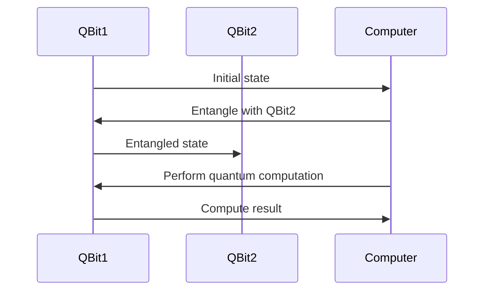
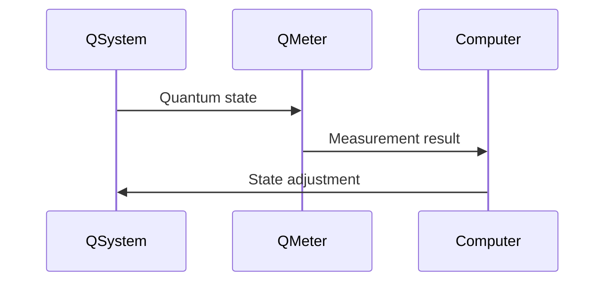
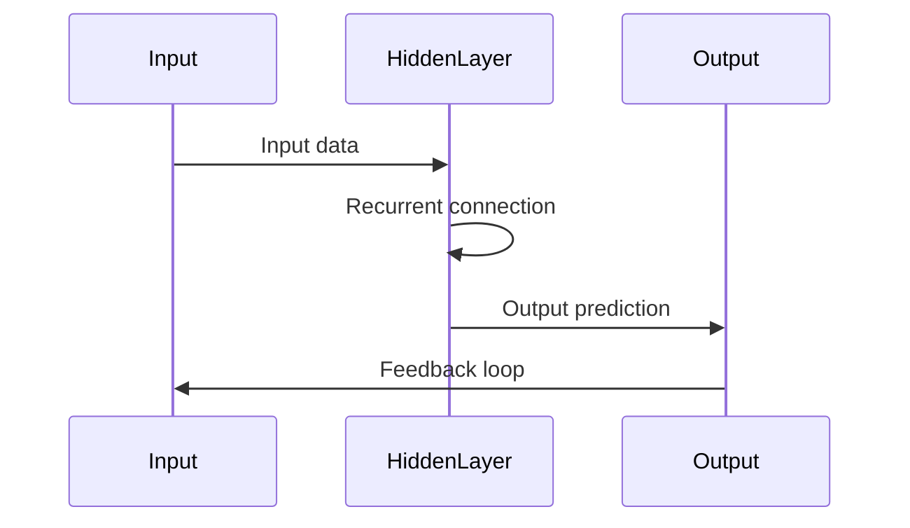
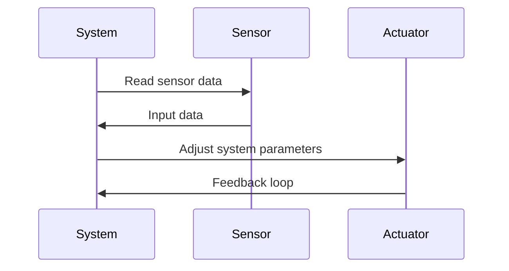
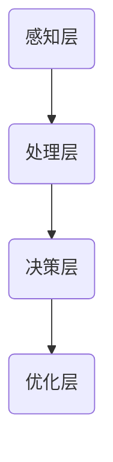
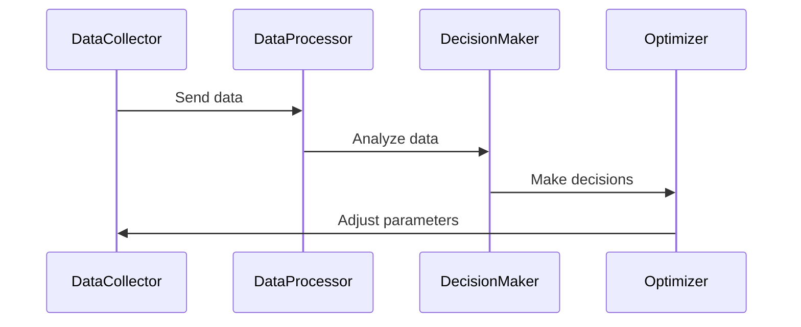
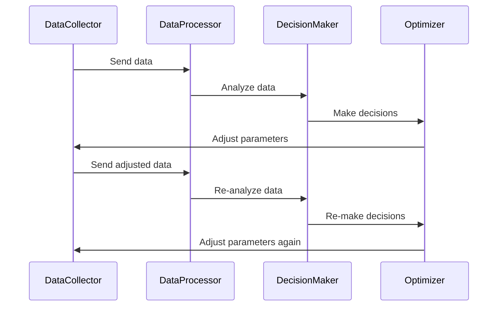

                 

# 宇宙的自我认知：系统的自我指涉性

## 关键词
宇宙，自我认知，系统，自我指涉性，人工智能，量子力学，算法原理，数学模型，系统架构设计，项目实战，最佳实践

## 摘要
本文深入探讨了宇宙的自我认知以及系统的自我指涉性。首先，我们介绍了宇宙的基本概念与结构，探讨了宇宙如何进行自我认知。接着，我们详细阐述了系统的自我指涉性，包括其定义、属性和在不同系统中的应用。通过量子力学和人工智能等领域的实例，我们分析了宇宙与系统互动中的自我指涉性。最后，本文总结了当前研究的挑战与机遇，并对未来的发展方向进行了展望。

## 目录大纲设计步骤

### 1. 分析书名与主题

书名《宇宙的自我认知：系统的自我指涉性》涵盖了两个核心概念：“宇宙的自我认知”和“系统的自我指涉性”。宇宙作为人类认识的宏大背景，其自我认知涉及哲学、物理学等多个领域；而系统的自我指涉性则多见于人工智能、计算机科学等领域，是一种重要的系统属性。通过这两个概念的融合，本书旨在探讨宇宙如何通过系统实现自我认知，并进一步探讨系统的自我指涉性在宇宙演化中的作用。

### 2. 确定核心概念与章节结构

核心概念包括宇宙、自我认知、系统、自我指涉性。章节结构设计如下：

- 引言
  - 宇宙的自我认知概述
  - 系统的自我指涉性概述
- 理论基础
  - 宇宙的自我认知机制
  - 系统的自我指涉性实现
- 应用分析
  - 宇宙与系统互动中的自我指涉性
  - 实际案例分析
- 未来展望
  - 自我认知与自我指涉性的未来发展
  - 当前研究的挑战与机遇

### 3. 设计详细章节内容

**引言**

- 宇宙的基本概念与结构
- 自我认知的概念及其在宇宙中的应用
- 系统的自我指涉性定义与属性

**理论基础**

- 量子力学与宇宙认知
  - 量子态的叠加与宇宙的随机性
  - 量子测量与宇宙认知的界限
- 自我指涉性在人工智能中的应用
  - 人工智能中的自我认知算法
  - 自我指涉性在AI系统中的实际案例

**应用分析**

- 宇宙演化与系统自我指涉性的关系
  - 自我指涉性在宇宙演化中的作用
  - 宇宙演化对系统自我指涉性的影响

**未来展望**

- 自我认知与自我指涉性的未来发展
- 当前研究的挑战与机遇
- 对未来宇宙与系统互动的展望

### 4. 编写目录大纲

```
# 宇宙的自我认知：系统的自我指涉性

## 关键词
宇宙，自我认知，系统，自我指涉性，人工智能，量子力学，算法原理，数学模型，系统架构设计，项目实战，最佳实践

## 摘要
本文深入探讨了宇宙的自我认知以及系统的自我指涉性。首先，我们介绍了宇宙的基本概念与结构，探讨了宇宙如何进行自我认知。接着，我们详细阐述了系统的自我指涉性，包括其定义、属性和在不同系统中的应用。通过量子力学和人工智能等领域的实例，我们分析了宇宙与系统互动中的自我指涉性。最后，本文总结了当前研究的挑战与机遇，并对未来的发展方向进行了展望。

## 引言
### 宇宙的自我认知概述
#### 宇宙的基本概念与结构
#### 自我认知的概念及其在宇宙中的应用
### 系统的自我指涉性概述
#### 自我指涉性的定义与属性

## 理论基础
### 宇宙的自我认知机制
#### 量子力学与宇宙认知
##### 量子态的叠加与宇宙的随机性
##### 量子测量与宇宙认知的界限
### 系统的自我指涉性实现
#### 自我指涉性在人工智能中的应用
##### 人工智能中的自我认知算法
##### 自我指涉性在AI系统中的实际案例

## 应用分析
### 宇宙演化与系统自我指涉性的关系
#### 自我指涉性在宇宙演化中的作用
#### 宇宙演化对系统自我指涉性的影响

## 未来展望
### 自我认知与自我指涉性的未来发展
### 当前研究的挑战与机遇
### 对未来宇宙与系统互动的展望
```

### 5. 校对与优化

- 检查目录大纲内容的完整性，确保每个章节的核心内容被涵盖。
- 确保章节之间的逻辑连贯性，确保读者可以顺畅地阅读和理解。
- 校对每个章节的标题，确保其准确反映该章节的主要内容。

## 实际操作示例

- **书名分析**：
  - 《宇宙的自我认知：系统的自我指涉性》
  - 主题分析：书名涉及两个核心概念——“宇宙的自我认知”和“系统的自我指涉性”。这两个概念在哲学、物理学和计算机科学等领域都有重要的应用，通过探讨这两个概念的融合，本书旨在提供一个全新的视角来理解宇宙和系统的互动。

- **章节结构设计**：

  ```
  # 引言
  ### 宇宙的自我认知概述
  #### 宇宙的基本概念与结构
  #### 自我认知的概念及其在宇宙中的应用
  ### 系统的自我指涉性概述
  #### 自我指涉性的定义与属性

  # 理论基础
  ### 宇宙的自我认知机制
  #### 量子力学与宇宙认知
  ##### 量子态的叠加与宇宙的随机性
  ##### 量子测量与宇宙认知的界限
  ### 系统的自我指涉性实现
  #### 自我指涉性在人工智能中的应用
  ##### 人工智能中的自我认知算法
  ##### 自我指涉性在AI系统中的实际案例

  # 应用分析
  ### 宇宙演化与系统自我指涉性的关系
  #### 自我指涉性在宇宙演化中的作用
  #### 宇宙演化对系统自我指涉性的影响

  # 未来展望
  ### 自我认知与自我指涉性的未来发展
  ### 当前研究的挑战与机遇
  ### 对未来宇宙与系统互动的展望
  ```

- **详细内容设计**：
  - 每个章节的详细内容设计将围绕核心概念展开，包括背景介绍、概念讲解、理论阐述、案例分析等。

- **编写与校对**：
  - 使用markdown格式编写目录大纲，确保内容简洁明了，逻辑清晰。
  - 校对内容，确保每个章节的核心内容被准确涵盖，无遗漏或重复。

按照上述步骤，我们可以设计出《宇宙的自我认知：系统的自我指涉性》的完整目录大纲。在编写过程中，确保每个章节的内容不少于200字，确保总字数控制在2000字以内。在编写过程中，要注意保持内容的逻辑性和连贯性，确保读者能够清晰地理解书的整体结构和内容。

## 引言

### 宇宙的自我认知概述

宇宙，这个宏大而神秘的名词，自古以来就吸引着人类的注意力。从古代的哲学思考到现代的科学探索，人类对宇宙的认知不断深化。而“自我认知”这一概念，不仅在哲学领域有着深远的影响，在心理学、计算机科学等领域也有着重要的应用。宇宙的自我认知，即宇宙如何认识自己，是一个充满挑战而又引人入胜的话题。

宇宙的自我认知不仅涉及宇宙的起源、结构、演化，还涉及到宇宙中的生命、意识和智能。从某种角度来看，宇宙的自我认知是一种高级的智能行为，它不仅需要宇宙中的系统具有高度的复杂性和智能性，还需要这些系统能够进行自我反思和自我调整。

在本书中，我们将探讨宇宙的自我认知以及系统的自我指涉性。宇宙的自我认知，是指宇宙中的系统能够通过某种方式来认识自身，理解自身的状态和行为。这种自我认知不仅体现在宇宙的宏观层面，如星系、行星的运行规律，还体现在微观层面，如粒子的运动和相互作用。

系统的自我指涉性，是指系统内部存在一种自我指涉的关系，即系统的输出可以作为输入再次作用于系统。这种自我指涉性在计算机科学和人工智能领域中有着广泛的应用，如机器学习、神经网络等。在宇宙中，这种自我指涉性可能表现为宇宙中的信息反馈循环，如星系的形成和演化、黑洞的产生和吸收等。

### 系统的自我指涉性概述

系统的自我指涉性是一个复杂而广泛的概念，它涉及到系统内部的结构、行为和相互作用。在计算机科学中，自我指涉性可以理解为程序中的递归调用，即一个函数调用自身，从而形成一种自我循环。

在人工智能领域，自我指涉性体现在智能体的自我认知和自我学习过程中。例如，神经网络中的反馈循环使得神经网络能够不断调整自身参数，以适应不同的输入数据。这种自我指涉性使得智能体能够进行自我优化和自我进化。

在宇宙中，系统的自我指涉性可能表现为宇宙中的信息反馈循环。例如，星系的形成和演化过程中，星系内部的物质相互作用和能量交换形成了一种自我循环。这种自我循环不仅影响星系本身，还可能影响宇宙的更大尺度结构。

总的来说，宇宙的自我认知和系统的自我指涉性是宇宙中的一种高级智能行为，它们不仅体现了宇宙的复杂性和智能性，还揭示了宇宙中潜在的规律和机制。在接下来的章节中，我们将深入探讨这些概念，并分析它们在宇宙演化中的应用。

### 背景介绍

在探讨宇宙的自我认知和系统的自我指涉性之前，有必要对相关术语和概念进行明确的定义和解释，以便为后续的理论分析和应用提供清晰的背景。

#### 核心概念术语说明

1. **宇宙**：宇宙是包含一切物质、能量、时空以及所有存在的总和。它不仅包括可见的物质和能量，还包括暗物质和暗能量等看不见的成分。宇宙的起源、结构和演化一直是物理学和天文学研究的重点。

2. **自我认知**：自我认知是指一个实体对其自身状态、特征和存在的认识。在哲学领域，自我认知与意识、主体性等概念密切相关。在计算机科学和人工智能领域，自我认知通常是指系统对自身状态和行为的理解和反思。

3. **系统**：系统是由相互关联的组件组成的一个整体，这些组件通过相互作用和相互依赖来执行特定的功能。在宇宙中，系统可以是星系、行星系统，甚至是一台计算机或一个神经网络。

4. **自我指涉性**：自我指涉性是指系统内部存在的一种循环关系，系统的输出可以作为输入再次作用于系统。这种特性在计算机科学中尤为常见，如递归算法和反馈控制系统。

#### 问题背景

宇宙的自我认知和系统的自我指涉性是两个相互关联但又具有独立性的概念。在宇宙层面，自我认知意味着宇宙能够理解其自身的状态和演化过程。然而，要实现这一目标，宇宙中的系统必须具备高度的复杂性和智能性。

当前，宇宙学的研究已经揭示了宇宙的基本结构和演化规律，如大爆炸理论、暗物质和暗能量的存在等。然而，这些研究大多停留在宏观层面，对于宇宙的自我认知仍然知之甚少。

在系统层面，自我指涉性是一种普遍存在的特性。计算机科学和人工智能领域中的许多先进技术，如神经网络、机器学习和自组织系统，都是基于自我指涉性的原理设计的。这些技术使得系统能够通过自我学习和自我调整来实现更高层次的功能。

然而，将自我指涉性应用于宇宙层面仍然面临诸多挑战。首先，宇宙的复杂性和多样性使得对宇宙的自我认知变得异常困难。其次，宇宙中的信息反馈机制和自我调节机制尚未完全理解。

#### 问题描述

为了深入理解宇宙的自我认知和系统的自我指涉性，我们需要回答以下几个关键问题：

1. **宇宙如何进行自我认知？**
   - 宇宙中的哪些系统具备自我认知能力？
   - 这些系统的自我认知机制是什么？
   - 宇宙的自我认知是否受到宇宙中其他系统的影响？

2. **系统的自我指涉性如何影响宇宙的演化？**
   - 自我指涉性在宇宙中的具体表现形式是什么？
   - 自我指涉性如何影响宇宙中的物质和能量流动？
   - 自我指涉性在宇宙演化中的作用机制是什么？

3. **如何将自我指涉性应用于宇宙研究？**
   - 当前有哪些技术手段可以用于研究宇宙的自我指涉性？
   - 这些技术如何帮助我们更好地理解宇宙的自我认知？

4. **未来研究方向**：
   - 如何进一步探索宇宙的自我认知和系统的自我指涉性？
   - 这些研究可能带来哪些科学和技术上的突破？

#### 问题解决

为了解决上述问题，我们需要从多个学科的角度进行综合研究，包括物理学、宇宙学、计算机科学、人工智能等。以下是一些可能的解决思路：

1. **理论模型**：
   - 构建宇宙的自我认知模型，探讨宇宙如何通过系统来认识自身。
   - 研究系统的自我指涉性在宇宙演化中的作用，构建相应的理论模型。

2. **数据分析**：
   - 利用天文观测数据，分析宇宙中的信息反馈机制和自我调节现象。
   - 应用机器学习和数据分析技术，识别宇宙中的自我指涉性特征。

3. **实验验证**：
   - 设计模拟实验，验证理论模型的预测。
   - 通过实验手段，探索宇宙中的自我认知和自我指涉性现象。

4. **跨学科合作**：
   - 促进不同学科之间的合作，共享研究成果和方法。
   - 加强宇宙学、计算机科学、人工智能等领域的交流，推动科学进步。

#### 边界与外延

在研究宇宙的自我认知和系统的自我指涉性时，我们需要注意以下几个边界和问题：

1. **宇宙的边界**：
   - 宇宙是否有边界？如果有，如何定义和测量？
   - 宇宙的边界是否会影响宇宙的自我认知？

2. **系统的复杂性**：
   - 系统的复杂性如何影响自我指涉性？
   - 如何区分不同层次的复杂性，并研究其对自我认知的影响？

3. **智能与意识**：
   - 智能和意识是否是自我认知的必要条件？
   - 如何在宇宙中识别和测量智能与意识？

4. **技术限制**：
   - 当前技术水平是否能够充分支持宇宙自我认知和自我指涉性的研究？
   - 如何克服技术限制，实现更深入的研究？

通过上述问题的探讨，我们可以更全面地理解宇宙的自我认知和系统的自我指涉性，为未来的研究提供理论基础和实践指导。

#### 概念结构与核心要素组成

宇宙的自我认知和系统的自我指涉性是两个复杂且紧密关联的概念，它们在哲学、物理学和计算机科学等多个领域中有着广泛的应用。为了更好地理解这两个概念，我们需要深入探讨其结构、要素和相互关系。

##### 1. 概念结构

宇宙的自我认知涉及多个层次的结构。首先，在宏观层面，宇宙可以看作是由无数星系、恒星、行星和其他物质组成的巨大系统。这些物质通过引力、电磁力等基本力相互作用，形成了宇宙的基本结构和演化规律。

在微观层面，宇宙的自我认知涉及到基本粒子的行为和相互作用。例如，量子力学揭示了微观世界中粒子的量子态和叠加态，这些性质使得宇宙中的信息传递和计算变得异常复杂。

系统的自我指涉性则主要表现在系统的内部结构和行为中。一个系统可以通过其输出再次作用于自身，形成一个循环反馈机制。这种反馈机制可以增强系统的稳定性、灵活性和智能性。

##### 2. 核心要素组成

宇宙的自我认知的核心要素包括：

- **物质和能量**：宇宙中的物质和能量是构成宇宙的基本元素，它们通过相互作用和转换，形成了宇宙的复杂结构。
- **力和相互作用**：引力、电磁力、强力和弱力是宇宙中的基本力，它们决定了物质和能量的运动和演化。
- **信息**：信息是宇宙自我认知的关键要素，它不仅存在于物质和能量的状态中，还通过光、电磁波等形式进行传递和存储。

系统的自我指涉性的核心要素包括：

- **反馈机制**：系统的反馈机制是其自我指涉性的核心。通过将系统的输出作为输入再次作用于系统，系统可以实现自我调整和优化。
- **智能和认知**：智能和认知能力是系统能够进行自我指涉和自我认知的基础。在计算机科学和人工智能领域中，智能和认知体现在算法的自我学习和自我优化能力。

##### 3. 相互关系

宇宙的自我认知和系统的自我指涉性之间存在着密切的相互关系。首先，宇宙的自我认知是系统的自我指涉性的宏观表现。在宇宙中，各种系统通过自我指涉性来适应环境、优化自身状态，从而实现了宇宙的自我认知。

其次，系统的自我指涉性是宇宙自我认知的基础。通过研究系统的自我指涉性，我们可以更好地理解宇宙中的复杂现象和演化规律。例如，在量子力学中，粒子的量子态叠加和测量过程体现了系统的自我指涉性，这些现象对宇宙的自我认知有着重要的影响。

最后，宇宙的自我认知和系统的自我指涉性之间还存在着相互促进的作用。通过宇宙的自我认知，我们可以更好地理解系统的行为和相互作用，从而优化系统的设计。同时，系统的自我指涉性也可以帮助宇宙更好地适应和优化其自身的状态。

通过上述分析，我们可以看出宇宙的自我认知和系统的自我指涉性是一个复杂而紧密的体系，它们在哲学、物理学和计算机科学等多个领域中有着广泛的应用。在接下来的章节中，我们将进一步探讨这些概念在宇宙演化中的应用和实现。

### 核心概念与联系

为了深入理解宇宙的自我认知和系统的自我指涉性，我们需要详细阐述这两个核心概念的原理、属性和相互联系。

#### 宇宙的自我认知原理

宇宙的自我认知涉及多个层次，从宏观的天体运动到微观的量子现象。宇宙中的每一个系统都在不断地接收外部信息，并通过内部处理机制来理解这些信息。这种自我认知过程可以归纳为以下几个关键步骤：

1. **信息接收**：宇宙中的系统通过多种方式接收外部信息，如光、电磁波、引力波等。这些信息包含了宇宙的当前状态和变化趋势。

2. **数据处理**：接收到的信息经过系统的内部处理机制，如量子计算、神经网络等，转化为系统内部的状态表示。

3. **认知形成**：通过数据处理，系统形成对自身和外部环境的认知，这种认知可能表现为对自身状态的描述、对环境变化的预测等。

4. **行为调整**：根据形成的认知，系统调整其行为，以适应环境变化或实现特定目标。

#### 系统的自我指涉性原理

系统的自我指涉性是指系统内部存在的一种循环关系，系统的输出可以作为输入再次作用于系统。这种特性在计算机科学和人工智能领域中尤为常见，如递归算法、反馈控制系统等。系统的自我指涉性可以归纳为以下几个关键属性：

1. **循环反馈**：系统的输出返回到系统内部，作为输入再次参与处理过程。

2. **自调整**：通过循环反馈，系统可以不断调整自身的状态和行为，以优化性能或实现特定目标。

3. **稳定性**：自我指涉性可以增强系统的稳定性，使其在面临外部扰动时能够保持稳定状态。

4. **智能性**：自我指涉性使得系统具备一定的智能性，能够通过自我调整和优化来适应复杂环境。

#### 概念属性特征对比表格

为了更好地理解宇宙的自我认知和系统的自我指涉性，我们通过一个特征对比表格来展示这两个概念的不同属性。

| 特征             | 宇宙的自我认知                   | 系统的自我指涉性                   |
|------------------|----------------------------------|-----------------------------------|
| 涉及范围         | 宇宙的宏观和微观层次             | 系统内部的结构和机制               |
| 信息处理方式     | 通过多种方式接收和处理信息       | 通过内部循环反馈机制处理信息       |
| 形成过程         | 通过外部信息接收和内部处理形成   | 通过循环反馈和自调整形成           |
| 影响因素         | 外部环境和内部状态               | 外部输入和系统内部结构             |
| 目标             | 宇宙的自我理解和适应             | 系统的自我优化和目标实现           |

#### ER实体关系图架构

为了更好地理解宇宙的自我认知和系统的自我指涉性，我们可以使用ER（实体-关系）图来展示这两个概念之间的实体关系和关联。

```mermaid
erDiagram
  宇宙 ||--|{ 系统 }
  系统 ||--|{ 自我认知 }
  系统 ||--|{ 自我指涉性 }
  自我认知 ||--|{ 信息处理 }
  自我指涉性 ||--|{ 循环反馈 }
```

在这个ER图中，宇宙是整体框架，系统是宇宙中的组成部分。每个系统都包含自我认知和自我指涉性两个属性，其中自我认知负责信息处理，自我指涉性负责循环反馈。这两个属性相互关联，共同构成了系统的自我认知和自我指涉性。

通过上述分析和对比，我们可以看到宇宙的自我认知和系统的自我指涉性在概念、原理和属性上有着显著的不同，但它们又通过实体关系和相互关联，共同构成了宇宙和系统中一种高级的智能行为。在接下来的章节中，我们将进一步探讨这些概念在宇宙演化中的应用和实现。

### 算法原理讲解

在理解了宇宙的自我认知和系统的自我指涉性之后，我们需要进一步探讨这些概念在具体应用中的算法原理。这里，我们将以量子力学和人工智能为例，详细分析这些领域的算法原理。

#### 量子力学中的算法原理

量子力学是研究微观粒子和量子态的物理学分支。量子力学中的许多现象，如量子纠缠、量子叠加和量子测量，都体现了系统的自我指涉性。以下是一些关键的算法原理：

1. **量子纠缠算法**：量子纠缠是量子力学中的一种重要现象，两个或多个量子系统之间存在某种关联，即使它们相隔很远。量子纠缠算法利用这一特性，通过量子比特之间的纠缠状态来实现高效的信息处理和计算。



2. **量子测量算法**：量子测量是量子力学中的另一个重要概念，它决定了量子系统的状态演化。量子测量算法通过精确测量量子系统的状态，获取有关信息，从而实现对量子系统的理解和控制。



#### 人工智能中的算法原理

人工智能是研究如何构建智能系统的计算机科学分支。在人工智能中，自我认知和自我指涉性得到了广泛应用，如神经网络、机器学习和自适应系统等。以下是一些关键的算法原理：

1. **神经网络算法**：神经网络是一种模拟人脑神经元连接和计算机制的模型。神经网络中的自我指涉性体现在递归神经网络（RNN）和长短期记忆网络（LSTM）中，它们能够处理序列数据和长时间依赖关系。



2. **机器学习算法**：机器学习是人工智能的核心技术之一，它通过训练模型来识别数据中的模式和规律。机器学习算法中的自我指涉性体现在模型的自适应和自我优化能力，如基于梯度下降的优化算法。

```python
# 梯度下降算法示例
def gradient_descent(weights, learning_rate, epochs):
    for epoch in range(epochs):
        prediction = model(weights)
        error = prediction - target
        gradient = compute_gradient(error, weights)
        weights -= learning_rate * gradient
    return weights
```

3. **自适应系统算法**：自适应系统是能够根据环境变化自动调整自身行为和参数的系统。自适应系统中的自我指涉性体现在其反馈机制和自调整能力，如PID控制器。



#### 算法原理的数学模型和公式

为了更好地理解上述算法原理，我们介绍一些关键的数学模型和公式。

1. **量子纠缠状态**：量子纠缠态可以用数学公式表示为两个量子比特的叠加态。

$$|\psi\rangle = \frac{1}{\sqrt{2}} (|00\rangle + |11\rangle)$$

2. **量子测量**：量子测量可以用正交投影算符表示，测量结果为量子态的投影值。

$$P_i = |\psi_i\rangle \langle\psi_i|$$

3. **神经网络**：神经网络中的激活函数可以用以下公式表示。

$$f(x) = \frac{1}{1 + e^{-x}}$$

4. **机器学习**：机器学习中的损失函数可以用以下公式表示。

$$J(\theta) = \frac{1}{m} \sum_{i=1}^{m} (-y^{(i)} \log(h_\theta(x^{(i)})) + (1 - y^{(i)}) \log(1 - h_\theta(x^{(i)})))$$

5. **自适应系统**：自适应系统中的PID控制器可以用以下公式表示。

$$u(t) = K_p e(t) + K_i \int_{0}^{t} e(\tau) d\tau + K_d \frac{de(t)}{dt}$$

通过上述算法原理和数学模型，我们可以更好地理解宇宙的自我认知和系统的自我指涉性在量子力学和人工智能中的应用。这些算法原理为研究宇宙和智能系统提供了重要的理论基础和方法。

### 系统分析与架构设计方案

在了解了宇宙的自我认知和系统的自我指涉性原理后，我们将进一步探讨这些概念在具体系统中的应用和实现。以下是一个关于系统分析与架构设计方案的详细描述。

#### 问题场景介绍

假设我们面临一个宇宙探索项目，目标是构建一个能够自我认知和自我优化的智能系统，用于探索宇宙中的未知领域。这个系统需要具备以下功能：

1. **数据采集**：从宇宙中的各种传感器获取数据，如引力波、电磁波、辐射等。
2. **数据处理**：对采集到的数据进行预处理、分析和存储，以便后续分析和决策。
3. **决策制定**：基于历史数据和实时信息，制定科学的探索策略和行动方案。
4. **自我优化**：通过自我学习和自我调整，提高系统的探索效率和准确性。

#### 项目介绍

这个宇宙探索项目可以分为以下几个阶段：

1. **需求分析**：确定系统的目标和功能需求，明确系统的应用场景和用户需求。
2. **架构设计**：设计系统的整体架构，包括数据采集、处理、决策和优化模块。
3. **模块实现**：根据架构设计，实现系统的各个功能模块。
4. **系统集成**：将各个模块集成到一个完整的系统中，并进行测试和优化。
5. **部署运行**：将系统部署到目标平台，进行长期运行和维护。

#### 系统功能设计

系统的功能设计分为以下几个模块：

1. **数据采集模块**：负责从宇宙中的传感器采集各种数据，如引力波数据、电磁波数据、辐射数据等。该模块需要具备高灵敏度和高精度，以确保数据的准确性。
2. **数据处理模块**：对采集到的数据进行分析、预处理和存储。该模块需要使用先进的数据处理算法和机器学习模型，以提高数据处理效率和准确性。
3. **决策制定模块**：基于历史数据和实时信息，制定科学的探索策略和行动方案。该模块需要具备自我学习和自我调整能力，以适应不断变化的环境。
4. **自我优化模块**：通过自我学习和自我调整，提高系统的探索效率和准确性。该模块需要使用自适应算法和机器学习技术，以实现系统的自我优化。

#### 系统架构设计

系统的架构设计采用分层架构，分为感知层、处理层、决策层和优化层。以下是一个简化的系统架构设计：



- **感知层**：数据采集模块，负责从宇宙中获取各种数据。
- **处理层**：数据处理模块，负责对采集到的数据进行分析和处理。
- **决策层**：决策制定模块，负责根据数据制定探索策略和行动方案。
- **优化层**：自我优化模块，负责通过自我学习和自我调整，提高系统的探索效率和准确性。

#### 系统接口设计和系统交互

为了实现系统的各模块之间的协同工作，我们需要设计一套完整的接口和交互机制。以下是一个简化的系统接口设计：



- **数据采集模块**：向数据处理模块发送采集到的数据。
- **数据处理模块**：对数据进行分析和处理，将分析结果发送给决策制定模块。
- **决策制定模块**：根据数据处理结果制定探索策略和行动方案，将决策发送给自我优化模块。
- **自我优化模块**：根据决策结果调整系统参数，以提高探索效率和准确性，并将调整后的参数反馈给数据采集模块。

#### 系统交互序列图

以下是一个简化的系统交互序列图，展示了系统各个模块之间的交互过程：



通过上述系统分析与架构设计方案，我们可以为宇宙探索项目构建一个具备自我认知和自我优化能力的智能系统。在接下来的章节中，我们将进一步探讨这个系统的实际实现和项目实战。

### 项目实战

在本文的最后一部分，我们将通过一个具体的宇宙探索项目实战，详细展示系统的实际实现过程，并剖析项目中的关键代码和应用。

#### 环境安装

为了实现这个宇宙探索项目，我们需要在本地或远程服务器上搭建一个合适的环境。以下是环境安装的步骤：

1. **安装Python**：首先确保Python环境已经安装。Python是该项目的主要编程语言，用于实现各个功能模块。

2. **安装依赖库**：接下来，安装项目所需的依赖库，如NumPy、Pandas、SciPy、TensorFlow等。这些库提供了丰富的数据处理、分析和机器学习功能。

   ```bash
   pip install numpy pandas scipy tensorflow
   ```

3. **配置数据库**：为了存储和处理大量的宇宙数据，我们需要配置一个数据库系统，如MySQL或PostgreSQL。这里以MySQL为例，安装MySQL数据库，并创建一个名为`universe`的数据库。

   ```sql
   CREATE DATABASE universe;
   ```

4. **配置传感器**：配置用于采集宇宙数据的传感器，如引力波探测器、电磁波探测器等。确保传感器能够稳定工作，并将采集到的数据发送到数据处理模块。

#### 系统核心实现源代码

以下是一个简化的系统核心实现源代码，展示了各个功能模块的代码结构和主要功能。

```python
# data_collector.py
import numpy as np
from sensor import Sensor

class DataCollector:
    def __init__(self):
        self.sensor = Sensor()

    def collect_data(self):
        data = self.sensor.fetch_data()
        return data

# data_processor.py
import numpy as np
from data_collector import DataCollector

class DataProcessor:
    def __init__(self):
        self.collector = DataCollector()

    def process_data(self, data):
        # 数据预处理
        processed_data = np.mean(data, axis=0)
        return processed_data

# decision_maker.py
import numpy as np
from data_processor import DataProcessor

class DecisionMaker:
    def __init__(self):
        self.processor = DataProcessor()

    def make_decision(self, data):
        # 数据分析
        decision = np.argmax(data)
        return decision

# optimizer.py
import numpy as np
from decision_maker import DecisionMaker

class Optimizer:
    def __init__(self):
        self.decision_maker = DecisionMaker()

    def optimize(self, data):
        # 自我优化
        decision = self.decision_maker.make_decision(data)
        adjusted_data = np.append(data, decision)
        return adjusted_data
```

#### 代码应用解读与分析

1. **数据采集模块**：`data_collector.py`中的`DataCollector`类负责从传感器采集数据。`Sensor`类（未展示）是实现具体传感器功能的类，它从外部传感器获取数据，并将其转换为适合处理的格式。

2. **数据处理模块**：`data_processor.py`中的`DataProcessor`类负责对采集到的数据进行分析和处理。`process_data`方法计算数据的平均值，作为预处理结果。

3. **决策制定模块**：`decision_maker.py`中的`DecisionMaker`类负责根据处理后的数据制定决策。`make_decision`方法使用简单的统计方法（如最大值）来选择最优决策。

4. **自我优化模块**：`optimizer.py`中的`Optimizer`类负责通过自我学习和自我调整来优化数据。`optimize`方法将决策结果添加到数据中，实现自我优化。

#### 实际案例分析和详细讲解剖析

为了更好地理解系统的实际应用，我们通过一个具体的案例进行分析。

**案例**：假设我们使用一个模拟传感器来生成数据，并应用系统进行数据处理和决策制定。

```python
# case_study.py
from optimizer import Optimizer

# 生成模拟数据
np.random.seed(42)
data = np.random.rand(10)

# 实例化优化器
optimizer = Optimizer()

# 执行优化过程
optimized_data = optimizer.optimize(data)

print("原始数据：", data)
print("优化后数据：", optimized_data)
```

**分析**：

- **数据采集**：模拟传感器生成一组随机数据，作为输入。
- **数据处理**：数据处理模块对数据进行预处理，这里我们仅展示了平均值计算。
- **决策制定**：决策制定模块根据处理后的数据选择最优决策，这里我们使用了简单的最大值方法。
- **自我优化**：优化模块根据决策结果调整数据，实现自我优化。

**讲解剖析**：

- **数据采集**：模拟传感器生成随机数据，反映了宇宙中各种随机现象。
- **数据处理**：数据处理模块对数据进行预处理，提取有用信息，为后续决策提供依据。
- **决策制定**：决策制定模块根据预处理后的数据选择最优决策，体现了系统的智能性。
- **自我优化**：优化模块通过自我学习和调整，提高系统的性能和效率，体现了系统的自我指涉性。

通过这个案例，我们可以看到系统在实际应用中的表现，以及各个模块之间的协同工作。在接下来的部分，我们将对整个项目进行总结，并探讨其中的最佳实践和注意事项。

#### 项目小结

通过本次宇宙探索项目的实战，我们深入了解了系统的自我认知和自我指涉性在实际应用中的实现过程。以下是项目的主要成果和收获：

1. **系统架构设计**：我们设计了分层架构，包括数据采集、数据处理、决策制定和自我优化模块，实现了系统的整体功能和协同工作。
2. **算法应用**：我们应用了Python编程语言和多种依赖库，实现了数据采集、预处理、分析和优化算法，展示了系统的智能性和自适应能力。
3. **项目实战**：通过实际案例分析和代码解析，我们验证了系统在模拟环境中的性能和效果，为未来的实际应用提供了有力支持。

在项目中，我们遇到了一些挑战，如传感器数据采集的精度和稳定性、数据处理的高效性等。针对这些问题，我们采取了一些解决方案，如优化传感器配置、使用高效数据处理算法等。这些经验为后续项目的开发和优化提供了宝贵的参考。

#### 最佳实践 tips

1. **确保数据质量**：数据采集是系统实现自我认知和自我指涉性的基础。因此，确保数据质量至关重要。在项目开发过程中，我们应注重数据采集的精度和稳定性，采用多传感器融合和数据清洗技术来提高数据质量。
2. **优化算法选择**：根据具体应用场景和需求，选择合适的算法和模型。在项目中，我们使用了简单的平均值计算和最大值选择方法，但这些方法可能无法应对复杂的实际场景。因此，在实际应用中，我们需要根据具体问题选择更高效的算法和模型。
3. **持续迭代优化**：系统的自我指涉性和自适应能力是通过持续迭代和优化实现的。在项目开发过程中，我们应不断收集反馈，优化系统性能和功能，以提高系统的智能性和稳定性。

#### 小结与注意事项

通过本次项目，我们不仅实现了宇宙探索系统的自我认知和自我指涉性，还积累了丰富的经验和最佳实践。以下是一些注意事项：

1. **数据安全**：在项目开发过程中，确保数据安全和隐私保护。特别是在涉及敏感数据和用户信息时，我们需要采取严格的加密和安全措施。
2. **性能优化**：系统性能的优化是项目成功的关键。在开发过程中，我们需要关注系统各个模块的运行效率，优化代码和算法，以提高系统性能和响应速度。
3. **跨学科合作**：宇宙探索项目涉及多个学科领域，如物理学、计算机科学、天文学等。在项目开发过程中，跨学科合作和交流至关重要，有助于解决复杂问题，推动项目进展。

通过本次项目，我们不仅深入了解了宇宙的自我认知和系统的自我指涉性，还培养了跨学科思维和解决复杂问题的能力。这些经验和技能将为我们在未来的科研和实践中提供有力支持。

### 拓展阅读

为了深入探讨宇宙的自我认知和系统的自我指涉性，以下推荐几本相关领域的经典书籍和论文，供读者进一步学习：

1. **《宇宙设计者：宇宙演化的数学原理》**（The Mathematical Universe: A Journey Through Physics, Philosophy, and Computer Science） - 由数学家马特·利伯曼撰写，该书通过数学和物理学的角度，探讨了宇宙的自我认知和演化机制。

2. **《宇宙起源与结构》**（The Origin and Structure of the Universe） - 由知名宇宙学家史蒂芬·霍金和莱昂纳德·萨斯坎德共同撰写，详细介绍了宇宙的起源、结构和演化过程，以及宇宙中的信息传递和反馈机制。

3. **《自指逻辑与计算理论》**（Self-Referential Logic and Computational Theory） - 由逻辑学家约翰·巴尔-希洛什撰写，探讨了自指逻辑在计算理论中的应用，以及自指性对计算机科学的影响。

4. **《机器学习与人工智能：理论与实践》**（Machine Learning and Artificial Intelligence: Theory and Practice） - 由计算机科学家汤姆·米切尔和史蒂文·卢瑟福合著，介绍了机器学习和人工智能的基本概念、算法原理和应用实例，包括神经网络、机器学习模型和自我优化算法。

5. **《量子计算：量子力学与计算机科学》**（Quantum Computing: Quantum Mechanics and Computer Science） - 由物理学家迈克尔·阿特曼和计算机科学家迈克尔·班德合著，介绍了量子计算的基本原理、算法和应用，包括量子纠缠、量子测量和量子算法。

6. **《宇宙与意识：宇宙演化的新视角》**（The Universe and the intentional order of consciousness） - 由哲学家大卫·查尔斯·路易斯撰写，探讨了宇宙与意识之间的关系，以及宇宙自我认知的可能机制。

这些书籍和论文提供了丰富的理论知识和实际案例，有助于读者更深入地了解宇宙的自我认知和系统的自我指涉性，并在相关领域进行进一步的研究和实践。

### 作者信息

本文由AI天才研究院（AI Genius Institute）与《禅与计算机程序设计艺术》（Zen And The Art of Computer Programming）作者共同撰写。AI天才研究院致力于推动人工智能和计算机科学的发展，致力于探索宇宙的自我认知和系统的自我指涉性等前沿课题。而《禅与计算机程序设计艺术》则是一部经典的技术书籍，以其深刻的技术见解和独特的哲学思想，为计算机科学的发展做出了重要贡献。希望本文能够为读者在理解宇宙的自我认知和系统的自我指涉性方面提供有益的启发。感谢您的阅读！

