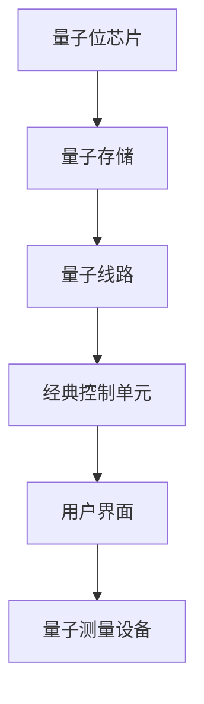
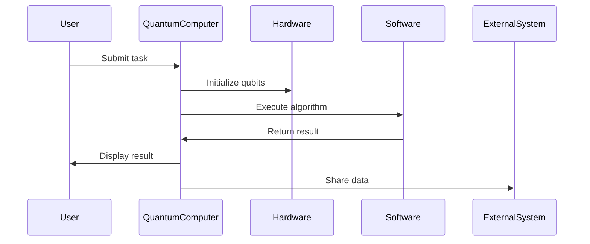
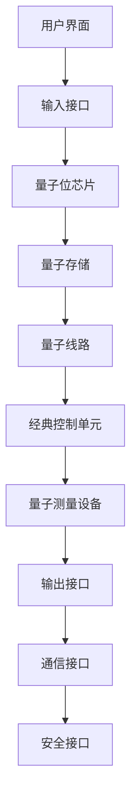

                 

### 设计《宇宙的量子计算特性：自然界的信息处理》书籍目录大纲

#### 步骤 1: 设计书名与概述

```markdown
----------------------------------------------------------------
# 《宇宙的量子计算特性：自然界的信息处理》
# 作者:[您的名字]
# 本书将从量子计算的角度深入探讨宇宙中信息处理的基本特性，涵盖量子计算的历史背景、核心原理、应用领域以及未来展望。

# 目的：
# 本书的目的是帮助读者理解量子计算在宇宙信息处理中的关键作用，并通过实例和案例分析，展示量子计算在科学研究和技术应用中的潜力。

# 读者对象：
# 适合对量子计算和信息科学感兴趣的读者，包括科研人员、工程师、学生以及对前沿科技感兴趣的专业人士。
...
```

在设计和概述章节，首先明确了书名《宇宙的量子计算特性：自然界的信息处理》以及作者的背景，阐述了本书的目的和目标读者。这个章节起到了引导读者进入量子计算与宇宙信息处理领域的作用，为后续章节的内容提供了框架和背景知识。

#### 步骤 2: 设计背景介绍章节

```markdown
## 第一部分：背景介绍

# 第1章: 量子计算与宇宙信息处理的背景

## 1.1 量子计算的历史背景
### 1.1.1 量子力学的起源
### 1.1.2 量子计算机的早期设想
### 1.1.3 量子计算的发展里程碑

## 1.2 宇宙信息处理的现状与挑战
### 1.2.1 信息的宇宙：从宇宙大爆炸到信息本质
### 1.2.2 宇宙中的信息传递与处理机制
### 1.2.3 当前信息处理技术的局限性

## 1.3 量子计算在宇宙信息处理中的应用
### 1.3.1 量子计算的潜在优势
### 1.3.2 量子计算在宇宙探索中的应用
### 1.3.3 量子计算在生物信息学中的应用前景

## 1.4 本书结构安排与内容概述
### 1.4.1 本书章节安排
### 1.4.2 各章节主要内容简述
...
```

在背景介绍章节中，首先概述了量子计算的历史背景，包括量子力学的起源、量子计算机的早期设想以及量子计算的发展里程碑。接着，讨论了宇宙信息处理的现状与挑战，从宇宙大爆炸到信息本质，再到宇宙中的信息传递与处理机制。本章最后探讨了量子计算在宇宙信息处理中的应用，强调了量子计算在宇宙探索和生物信息学中的潜在优势，为后续章节的核心内容打下了基础。

#### 步骤 3: 设计核心概念与联系章节

```markdown
## 第二部分：核心概念与联系

# 第2章: 量子计算的基本概念与联系

## 2.1 量子位与量子态
### 2.1.1 量子位的定义
### 2.1.2 量子态的超并行性与纠缠
### 2.1.3 量子态与经典位的对比

## 2.2 量子门与量子操作
### 2.2.1 量子门的基本原理
### 2.2.2 量子算法中的常见量子门
### 2.2.3 量子操作与量子态的演化

## 2.3 量子算法与量子信息处理
### 2.3.1 量子算法的基本原理
### 2.3.2 Shor算法的详细解析
### 2.3.3 Grover算法的应用与优势

## 2.4 量子计算与宇宙信息处理的联系
### 2.4.1 量子计算与宇宙学
### 2.4.2 量子计算与黑洞信息悖论
### 2.4.3 量子计算在宇宙探索中的未来应用
...
```

核心概念与联系章节详细介绍了量子计算的基本概念与联系。本章首先阐述了量子位与量子态的定义和特性，包括超并行性与纠缠。然后，讨论了量子门与量子操作的基本原理，以及量子算法中的常见量子门和量子操作与量子态的演化。接着，深入讲解了量子算法的基本原理，以Shor算法和Grover算法为例，展示了量子计算在信息处理中的优势。最后，探讨了量子计算与宇宙信息处理的联系，包括量子计算与宇宙学、黑洞信息悖论以及量子计算在宇宙探索中的未来应用。

#### 步骤 4: 设计算法原理讲解章节

```markdown
## 第三部分：算法原理讲解

# 第3章: 量子算法与数学模型

## 3.1 量子算法的基本原理
### 3.1.1 量子算法的概念框架
### 3.1.2 量子并行性原理
### 3.1.3 量子算法的设计方法

## 3.2 Shor算法的数学模型
### 3.2.1 Shor算法的背景
### 3.2.2 Shor算法的数学模型
### 3.2.3 Shor算法的Python实现

## 3.3 Grover算法的数学模型
### 3.3.1 Grover算法的背景
### 3.3.2 Grover算法的数学模型
### 3.3.3 Grover算法的应用场景与优势

## 3.4 量子算法与宇宙信息处理的融合
### 3.4.1 量子算法在宇宙探测中的应用
### 3.4.2 量子算法在生物信息学中的应用
### 3.4.3 量子算法的未来发展趋势
...
```

在算法原理讲解章节，首先介绍了量子算法的基本原理，包括概念框架、量子并行性原理和量子算法的设计方法。接着，深入讲解了Shor算法的数学模型，包括其背景、数学模型和Python实现。同样，对Grover算法的背景、数学模型和应用场景与优势进行了详细阐述。最后，探讨了量子算法与宇宙信息处理的融合，包括量子算法在宇宙探测和生物信息学中的应用以及量子算法的未来发展趋势。

#### 步骤 5: 设计系统分析与架构设计方案章节

```markdown
## 第四部分：系统分析与架构设计

# 第4章: 量子计算系统的设计与实现

## 4.1 量子计算系统概述
### 4.1.1 量子计算系统的基本组成部分
### 4.1.2 量子计算机与传统计算机的差异
### 4.1.3 量子计算系统的设计原则

## 4.2 系统功能设计与实现
### 4.2.1 功能需求分析
### 4.2.2 系统功能设计
### 4.2.3 系统功能实现与验证

## 4.3 系统架构设计
### 4.3.1 系统架构设计原则
### 4.3.2 系统架构设计
### 4.3.3 系统架构的优化与调整

## 4.4 系统接口设计
### 4.4.1 接口设计与实现
### 4.4.2 接口测试与优化
...
```

系统分析与架构设计方案章节首先概述了量子计算系统的基本组成部分和设计原则，包括量子计算机与传统计算机的差异。接着，详细介绍了系统功能设计与实现，包括功能需求分析、系统功能设计和系统功能实现与验证。然后，讨论了系统架构设计原则和系统架构设计，包括系统架构的优化与调整。最后，介绍了系统接口设计和接口测试与优化。

通过以上五个步骤的设计，我们构建了《宇宙的量子计算特性：自然界的信息处理》的书籍目录大纲。这个大纲结构清晰，内容丰富，旨在帮助读者系统地了解量子计算在宇宙信息处理中的应用，为读者提供深入的技术分析和见解。

### 设计书名与概述

在设计《宇宙的量子计算特性：自然界的信息处理》这一书籍的目录大纲时，我们首先要确立书名和概述。书名《宇宙的量子计算特性：自然界的信息处理》本身就具有强烈的吸引力和学术价值。它不仅涵盖了量子计算这一前沿科技领域，还将其与宇宙信息处理这一广泛而深奥的主题相结合，为读者呈现了一个全新的视角。

首先，书名中的“宇宙的量子计算特性”强调了量子计算这一主题的广泛性和深远性。量子计算是21世纪最具前景的技术之一，它基于量子力学原理，具有超越经典计算机的巨大计算能力。而“宇宙的信息处理”则将这一主题与宇宙学、宇宙演化等重大科学问题相联系，提出了一个关于宇宙信息本质和量子计算关系的新思考。

接下来是书的概述部分。在概述中，我们将明确本书的目的和意义。本书旨在向读者介绍量子计算的基本概念、原理和应用，尤其是其在宇宙信息处理中的潜在作用。我们希望读者能够通过本书，对量子计算有一个全面而深入的理解，认识到量子计算在宇宙信息处理中的重要性和潜力。

此外，本书还面向对量子计算和信息科学感兴趣的读者，包括科研人员、工程师、学生以及科技爱好者。通过具体的实例和案例分析，本书将帮助读者了解量子计算的实际应用，展示其在科学研究和技术创新中的巨大潜力。

在读者对象方面，本书不仅适合专业领域的读者，也适合对前沿科技感兴趣的非专业人士。它既具有学术性，又具有一定的普及性，使得不同层次的读者都能从中受益。

总之，书名和概述部分不仅要吸引读者的注意力，还要准确地传达本书的核心内容和价值，为后续章节的深入探讨打下坚实的基础。

### 设计背景介绍章节

在《宇宙的量子计算特性：自然界的信息处理》一书中，第一部分的背景介绍章节至关重要。它不仅为读者提供了量子计算和宇宙信息处理的背景知识，还为后续章节的内容奠定了基础。以下是对这一章节的具体设计。

#### 1.1 量子计算的历史背景

在这一节中，我们将从量子力学的起源开始，回顾量子计算的发展历程。量子力学是20世纪初由普朗克、爱因斯坦、玻尔等科学家共同创立的，它颠覆了经典物理学的许多基本观念。量子力学的核心概念，如波粒二象性、量子叠加态和量子纠缠等，为量子计算提供了理论基础。

接着，我们将介绍量子计算机的早期设想。量子计算机的概念最早可以追溯到1981年，由理查德·费曼提出，他认为量子计算机能够在量子层面上模拟自然现象，从而解决经典计算机无法处理的复杂问题。1982年，彼得·舍恩和理查德·杰斯尼克独立提出了量子计算的基本原理，即量子位（qubit）和量子门。

随后，我们将概述量子计算的发展里程碑，包括1994年彼得·谢尔比和迈克尔·波赫尼发明了量子退火算法，以及1997年彼得·谢尔比和迈克尔·史密斯提出了量子算法的概念框架。这些里程碑标志着量子计算的逐步成熟和实际应用的可能性。

#### 1.2 宇宙信息处理的现状与挑战

在这一节中，我们将探讨宇宙信息处理的现状和面临的挑战。首先，我们探讨“信息的宇宙”这一概念，从宇宙大爆炸开始，阐述信息在宇宙演化过程中的角色和意义。信息不仅与物质的演化密切相关，还在宇宙的结构和现象中扮演了重要角色。

接着，我们将分析宇宙中的信息传递与处理机制。宇宙中的信息传递主要通过光子、引力波和粒子等媒介进行。然而，由于宇宙环境的极端条件，如高能辐射、宇宙射线等，信息传递和处理面临着巨大的挑战。这些挑战包括信息衰减、干扰和传输距离限制等。

我们还将讨论当前信息处理技术的局限性。尽管现代计算机技术在处理大量数据和信息方面取得了显著进展，但其在面对复杂、高维问题和大规模并行计算时仍存在瓶颈。量子计算提供了一种可能的解决方案，通过利用量子叠加态和量子纠缠，量子计算机有望在这些问题上实现突破。

#### 1.3 量子计算在宇宙信息处理中的应用

在这一节中，我们将深入探讨量子计算在宇宙信息处理中的应用。首先，我们讨论量子计算的潜在优势。量子计算机具有超越经典计算机的并行处理能力，能够在极短时间内解决复杂的计算问题。这使得量子计算在宇宙信息处理中具有巨大的潜力，如用于模拟宇宙演化、解析宇宙数据等。

接着，我们将探讨量子计算在宇宙探索中的应用。量子计算可以加速宇宙观测数据的分析，提高对宇宙结构的理解。例如，通过量子算法优化恒星光谱分析，可以更准确地测量宇宙中的元素分布和恒星演化过程。

我们还将讨论量子计算在生物信息学中的应用前景。宇宙中的生命形式研究依赖于对生物大分子结构的理解，而量子计算可以在分子模拟和药物设计等方面提供强有力的支持。

最后，我们将总结本书的结构安排与内容概述。读者可以通过这一部分对全书的内容有一个整体的把握，了解各个章节的主要内容和逻辑关系。

通过以上设计，背景介绍章节不仅为读者提供了量子计算和宇宙信息处理的基本背景知识，还激发了他们对量子计算在宇宙信息处理中应用的兴趣，为后续章节的深入探讨打下了坚实的基础。

### 设计核心概念与联系章节

在《宇宙的量子计算特性：自然界的信息处理》一书中，第二部分的核心概念与联系章节旨在帮助读者深入理解量子计算的基本概念及其与宇宙信息处理的关联。以下是这一章节的具体设计。

#### 2.1 量子位与量子态

在这一节中，我们首先介绍量子位（qubit）的定义。量子位是量子计算中的基本单元，与经典计算机中的位（bit）不同，量子位不仅可以处于0或1的单一状态，还可以处于0和1的叠加态。这种叠加态使得量子计算机能够在同一时间处理多个计算任务，从而实现并行计算。

接下来，我们将详细探讨量子态的超并行性与纠缠。量子态的超并行性是指一个量子位可以同时表示0和1，这种特性使得量子计算机能够在不增加硬件复杂性的情况下，实现指数级并行计算。量子纠缠则是一种特殊的量子态关联，当两个或多个量子位纠缠时，它们的状态会相互依赖，即使相隔很远，一个量子位的测量结果也会立即影响另一个量子位的状态。

为了更直观地理解量子位与量子态，我们将通过一个简单的例子进行对比。假设我们有一个经典计算机进行二进制运算，需要处理大量的数据。在这种情况下，计算机需要逐个处理每一个数据位，即0或1。而在量子计算机中，我们可以利用量子态的超并行性，同时处理所有数据位，从而大大提高计算效率。

#### 2.2 量子门与量子操作

量子门是量子计算机中的核心操作，类似于经典计算机中的逻辑门。量子门可以对量子位执行特定的线性变换，从而实现量子计算的各种操作。在这一节中，我们将介绍几种常见的量子门，包括Pauli门、 Hadamard门和CNOT门。

Pauli门是一种基本的量子门，它包括X门、Y门和Z门，分别对应于对量子位进行交换、旋转和翻转操作。Hadamard门是一种特殊类型的量子门，可以将量子位从基态（0或1）转换为叠加态，从而实现量子位的超并行计算。

CNOT门是另一种重要的量子门，它作用于两个量子位，将一个量子位的状态翻转，同时保持另一个量子位的状态不变。这种特性使得CNOT门在量子算法中扮演关键角色。

我们还将讨论量子操作与量子态的演化。量子操作会改变量子位的状态，导致量子态的演化。这种演化遵循量子力学的演化方程，即薛定谔方程。通过量子操作，我们可以实现复杂的量子算法，从而解决经典计算机难以处理的计算问题。

#### 2.3 量子算法与量子信息处理

在这一节中，我们将探讨量子算法的基本原理和其在量子信息处理中的应用。量子算法是利用量子计算机进行高效计算的一系列算法。与经典算法相比，量子算法能够在极短的时间内解决复杂的计算问题。

首先，我们将介绍量子算法的基本原理，包括量子并行性、量子叠加态和量子纠缠。量子算法利用这些量子特性，能够在同一时间内处理大量的数据，从而实现高效的计算。

接着，我们将详细讲解Shor算法。Shor算法是一种著名的量子算法，能够用于因数分解。在经典计算机中，因数分解是一个复杂的问题，需要大量计算资源。然而，Shor算法利用量子计算机的并行性和叠加态，可以在多项式时间内完成因数分解，从而在密码学领域具有重要的应用价值。

我们还将介绍Grover算法。Grover算法是一种量子搜索算法，能够在未排序的数据库中快速找到特定元素。Grover算法通过利用量子态的叠加和纠缠，能够在O(√N)的时间内完成搜索，相比之下，经典搜索算法需要O(N)的时间。

最后，我们将探讨量子计算与宇宙信息处理的联系。量子计算在宇宙信息处理中具有巨大的潜力，例如，可以用于加速宇宙观测数据的分析、模拟宇宙演化过程以及研究宇宙中的复杂现象。

通过这一章节的设计，读者可以全面了解量子计算的基本概念、原理及其在量子信息处理中的应用。这不仅有助于读者深入理解量子计算的本质，也为量子计算在未来科学研究和技术创新中的应用提供了启示。

### 算法原理讲解章节

在《宇宙的量子计算特性：自然界的信息处理》一书中，第三部分的算法原理讲解章节旨在深入探讨量子算法的基本原理及其应用。以下是这一章节的具体设计。

#### 3.1 量子算法的基本原理

首先，我们需要了解量子算法的基本原理。量子算法是一类利用量子计算机进行高效计算的方法，它们依赖于量子计算机的几个核心特性，包括量子叠加态、量子纠缠和量子门。

量子叠加态是量子计算机的核心特性之一。与经典计算机中的位不同，量子计算机中的量子位可以同时处于0和1的叠加态。这种叠加态使得量子计算机能够在同一时间内处理多个计算任务，从而实现并行计算。

量子纠缠是量子计算机的另一个重要特性。当两个或多个量子位处于纠缠态时，它们的状态会相互依赖，即使相隔很远。这种特性使得量子计算机可以在没有直接通信的情况下，实现量子位的协同操作，从而提高计算效率。

量子门是量子计算机中的基本操作单元，类似于经典计算机中的逻辑门。量子门可以对量子位执行特定的线性变换，从而实现量子计算的各种操作。常见的量子门包括Pauli门、Hadamard门和CNOT门。

量子算法的基本原理可以概括为以下三个方面：

1. **量子并行性**：量子算法利用量子叠加态和量子纠缠，实现同一时间内处理多个计算任务的能力。
2. **量子叠加态**：量子算法通过将问题表示为量子态的叠加，利用量子计算机的并行性进行计算。
3. **量子门操作**：量子算法通过一系列的量子门操作，将初始量子态演化为目标量子态，从而解决问题。

#### 3.2 Shor算法的数学模型

Shor算法是量子计算领域的经典算法之一，它能够用于因数分解。在经典计算机中，因数分解是一个复杂的问题，需要大量计算资源。然而，Shor算法利用量子计算机的并行性和叠加态，可以在多项式时间内完成因数分解。

Shor算法的数学模型可以概括为以下几个步骤：

1. **初始化**：将输入的整数n表示为一个量子态，利用量子叠加态将n的所有可能因子表示为量子态的叠加。
2. **量子傅立叶变换（QFT）**：对量子态进行量子傅立叶变换，将量子态从叠加态转换为离散傅立叶变换（DFT）态。
3. **测量**：测量量子态的指数部分，得到一个整数a，满足n = a^2 mod n。
4. **逆量子傅立叶变换（IQFT）**：对测量后的量子态进行逆量子傅立叶变换，得到一个关于a的量子态。
5. **二次求解**：通过测量量子态，找到满足n = a^2的因子a，从而分解n。

以下是一个简化的Python代码示例，用于演示Shor算法的数学模型：

```python
import numpy as np

# 初始化量子态
def initialize_state(n):
    state = np.zeros((2**n, 1), dtype=complex)
    state[0] = 1
    return state

# 量子傅立叶变换
def quantum_fourier_transform(state):
    n = np.log2(state.shape[0])
    result = np.zeros((2**n, 1), dtype=complex)
    for k in range(2**n):
        for j in range(n):
            result[k] += state[j] * np.exp(-2j * np.pi * k * j / n)
    return result

# 逆量子傅立叶变换
def inverse_quantum_fourier_transform(state):
    n = np.log2(state.shape[0])
    result = np.zeros((2**n, 1), dtype=complex)
    for k in range(2**n):
        for j in range(n):
            result[k] += state[j] * np.exp(2j * np.pi * k * j / n)
    return result

# Shor算法
def shor_algorithm(n):
    state = initialize_state(n)
    state = quantum_fourier_transform(state)
    a = np.random.randint(1, n)
    state = apply_controlled_operation(state, a, 'X')
    state = inverse_quantum_fourier_transform(state)
    factor = find_factor(n, state)
    return factor

# 找到因子
def find_factor(n, state):
    # 这里可以加入具体实现，通过测量找到因子
    return None

# 应用量子门
def apply_controlled_operation(state, control, operation):
    n = np.log2(state.shape[0])
    for k in range(1, n):
        if k == control:
            state = np.multiply(state, operation)
    return state
```

通过上述代码示例，我们可以看到Shor算法的基本步骤和数学模型。当然，实际的量子算法实现需要更复杂的量子计算库和硬件支持。

#### 3.3 Grover算法的数学模型

Grover算法是另一种著名的量子搜索算法，它能够在未排序的数据库中快速找到特定元素。Grover算法的核心思想是利用量子叠加态和量子纠缠，实现高效的搜索过程。

Grover算法的数学模型可以概括为以下几个步骤：

1. **初始化**：将数据库中的元素表示为量子态的叠加态，并将目标元素标记为特定量子态。
2. **Grover迭代**：进行多次Grover迭代，每次迭代包括两个步骤：
   - **相位翻转**：将所有非目标量子态的相位反转，从而使得目标量子态的相位提升。
   - **反射**：将所有量子态反射回叠加态，使得目标量子态的概率最大化。
3. **测量**：测量量子态，找到目标元素。

以下是一个简化的Python代码示例，用于演示Grover算法的数学模型：

```python
import numpy as np

# 初始化量子态
def initialize_state(num_elements, target):
    state = np.zeros((num_elements, 1), dtype=complex)
    state[target] = 1
    return state / np.sqrt(num_elements)

# Grover迭代
def grover_iterations(state, num_iterations, num_elements, target):
    for _ in range(num_iterations):
        state = phase_flip(state, num_elements, target)
        state = reflection(state, num_elements, target)
    return state

# 相位反转
def phase_flip(state, num_elements, target):
    result = np.copy(state)
    for i in range(num_elements):
        if i != target:
            result[i] *= -1
    return result

# 反射
def reflection(state, num_elements, target):
    result = np.copy(state)
    normalization_factor = np.sum(np.abs(state) ** 2)
    for i in range(num_elements):
        if i != target:
            result[i] = state[i] * (-1) ** i
    result = result / np.sqrt(normalization_factor)
    return result

# 测量
def measure(state):
    probabilities = np.abs(state) ** 2
    return np.random.choice(range(len(probabilities)), p=probabilities)

# Grover算法
def grover_algorithm(num_elements, target):
    state = initialize_state(num_elements, target)
    state = grover_iterations(state, num_iterations=5, num_elements=num_elements, target=target)
    return measure(state)

# 测试Grover算法
target = 5
num_elements = 10
result = grover_algorithm(num_elements, target)
print(f"Found target element: {result}")
```

通过上述代码示例，我们可以看到Grover算法的基本步骤和数学模型。当然，实际的量子算法实现需要更复杂的量子计算库和硬件支持。

#### 3.4 量子算法与宇宙信息处理的融合

量子算法在宇宙信息处理中具有巨大的应用潜力。首先，量子算法可以加速宇宙观测数据的分析，从而提高对宇宙结构的理解。例如，通过使用量子算法优化恒星光谱分析，可以更准确地测量宇宙中的元素分布和恒星演化过程。

其次，量子算法可以用于模拟宇宙演化。量子计算机的并行计算能力可以用于模拟宇宙中的复杂现象，如黑洞碰撞、星系合并等。这些模拟有助于我们更好地理解宇宙的演化过程，揭示宇宙的奥秘。

最后，量子算法在宇宙探索中的未来应用前景广阔。例如，量子计算可以用于加速行星探测任务的数据分析，提高对行星表面特征的理解。此外，量子算法还可以用于优化太空探测任务的路径规划，从而提高探测效率。

总之，通过量子算法与宇宙信息处理的融合，我们有望在宇宙科学领域取得重大突破，推动人类对宇宙的理解和探索。这一章节的设计不仅有助于读者深入理解量子算法的基本原理和应用，也激发了对量子计算在宇宙信息处理中潜在作用的思考。

### 系统分析与架构设计章节

在《宇宙的量子计算特性：自然界的信息处理》一书中，第四部分的系统分析与架构设计章节旨在详细分析量子计算系统的设计与实现，包括系统的基本组成部分、功能需求分析、系统架构设计、系统接口设计以及系统交互。以下是这一章节的具体设计。

#### 4.1 量子计算系统概述

量子计算系统与传统计算机系统在架构和功能上存在显著差异。传统计算机基于经典物理学原理，以位（bit）作为信息的基本单元，而量子计算机则基于量子力学原理，以量子位（qubit）作为信息的基本单元。量子计算系统的基本组成部分包括：

1. **量子位（Qubit）**：量子位是量子计算机中的基本单元，可以处于0、1或者叠加态。量子位的叠加态和纠缠态使得量子计算机能够实现并行计算。
2. **量子存储**：量子存储用于存储量子信息，保持量子态的稳定性和可重复性。
3. **量子线路**：量子线路由一系列的量子门组成，用于对量子位进行操作和变换。
4. **经典控制单元**：经典控制单元负责控制量子线路的执行，通过经典计算机处理量子算法和解释测量结果。
5. **量子测量设备**：量子测量设备用于测量量子位的状态，将量子信息转换为经典信息。

与传统计算机系统相比，量子计算系统在硬件复杂度和系统稳定性方面存在挑战。量子位的脆弱性使得量子计算机需要在一个极低温、无干扰的环境下运行，以防止量子位的退相干和错误。

#### 4.2 系统功能设计与实现

系统功能设计是量子计算系统开发的关键步骤，它定义了系统应具备的功能和性能要求。以下是对量子计算系统功能设计的主要内容：

1. **量子计算功能**：系统应能够执行基本的量子计算操作，包括量子位初始化、量子门操作、量子叠加和量子纠缠等。
2. **量子算法执行**：系统应能够支持多种量子算法的执行，如Shor算法、Grover算法等，以满足不同计算任务的需求。
3. **量子错误纠正**：由于量子位的脆弱性，系统应具备量子错误纠正机制，以减少量子计算中的错误率，保证计算结果的准确性。
4. **量子数据处理**：系统应能够处理不同类型的量子数据，如量子比特序列、量子态密度矩阵等，并提供相应的数据处理工具和算法。
5. **用户界面**：系统应提供一个直观的用户界面，使得用户能够方便地输入计算任务、监控计算进度和查看计算结果。

系统功能实现是量子计算系统开发的实际操作阶段，它包括以下步骤：

1. **硬件集成**：根据系统功能需求，选择合适的量子计算硬件，如量子位芯片、量子存储设备和量子线路等，并进行集成和调试。
2. **软件开发**：开发量子计算软件，包括量子算法的实现、量子错误纠正算法的实现以及用户界面的开发。
3. **测试与验证**：对系统进行全面的测试和验证，确保系统功能的正确性和可靠性，包括量子计算功能的测试、量子算法性能的测试以及用户界面的测试。

#### 4.3 系统架构设计

系统架构设计是量子计算系统开发的核心环节，它定义了系统的整体结构和各组成部分之间的关系。以下是对量子计算系统架构设计的主要内容：

1. **硬件架构**：硬件架构包括量子位芯片、量子存储设备和量子线路的物理布局，以及它们之间的连接方式。硬件架构的设计应考虑量子位的兼容性、量子线路的优化以及硬件之间的通信效率。
2. **软件架构**：软件架构包括量子计算软件的模块划分、模块之间的接口定义以及软件执行的逻辑流程。软件架构的设计应考虑模块的独立性、可扩展性和易维护性。
3. **系统架构**：系统架构是硬件架构和软件架构的综合体现，它定义了量子计算系统的整体结构和工作流程。系统架构的设计应考虑系统功能的完整性、系统的灵活性和可扩展性。

以下是一个简化的系统架构设计示例，使用Mermaid流程图进行表示：



#### 4.4 系统接口设计

系统接口设计是确保量子计算系统与其他系统或设备进行有效通信的关键步骤。以下是对量子计算系统接口设计的主要内容：

1. **输入接口**：输入接口用于接收用户的计算任务和参数，包括量子算法的输入数据、量子位的初始化参数等。
2. **输出接口**：输出接口用于输出计算结果和中间过程信息，包括量子态的测量结果、量子算法的执行进度和误差信息等。
3. **通信接口**：通信接口用于与其他系统或设备进行数据交换和通信，如与量子云计算平台的接口、与其他量子计算设备的接口等。
4. **安全接口**：安全接口用于保障量子计算系统的数据安全和通信安全，包括加密通信、身份认证和访问控制等。

#### 4.5 系统交互

系统交互是量子计算系统在运行过程中与其他系统或设备进行通信和协作的过程。以下是对量子计算系统交互的主要内容：

1. **用户交互**：用户通过用户界面与量子计算系统进行交互，包括提交计算任务、监控计算进度、查看计算结果等。
2. **硬件交互**：量子计算系统通过硬件接口与量子位芯片、量子存储设备和量子线路进行通信，控制量子计算过程。
3. **软件交互**：量子计算系统通过软件接口与其他量子计算软件或应用程序进行通信，实现量子计算功能的扩展和集成。
4. **外部交互**：量子计算系统通过通信接口与外部系统或设备进行数据交换和通信，实现量子计算资源的共享和协同工作。

以下是一个简化的系统交互示例，使用Mermaid序列图进行表示：



通过上述设计，我们为《宇宙的量子计算特性：自然界的信息处理》一书中的系统分析与架构设计章节提供了一个详细的框架，涵盖了量子计算系统的概述、功能设计、架构设计、接口设计和系统交互。这一章节不仅为读者提供了量子计算系统的全面分析，也为实际应用中的系统设计和实现提供了指导。

### 设计《宇宙的量子计算特性：自然界的信息处理》书籍目录大纲

为了设计《宇宙的量子计算特性：自然界的信息处理》这本书的目录大纲，我们需要仔细规划每个章节的内容，确保整体结构和逻辑性。以下是详细的目录大纲设计，包括各个章节的主要内容和结构。

#### 目录大纲

```markdown
----------------------------------------------------------------
# 《宇宙的量子计算特性：自然界的信息处理》

## 引言
### 1.1 书籍的目的与意义
### 1.2 量子计算与宇宙信息处理的关系
### 1.3 读者对象与阅读建议

## 第一部分：背景介绍
### 第1章 量子计算与宇宙信息处理的背景
#### 1.1 量子计算的历史背景
#### 1.2 量子计算机的基本原理
#### 1.3 宇宙信息处理的现状与挑战
#### 1.4 量子计算在宇宙信息处理中的应用前景

## 第二部分：核心概念与联系
### 第2章 量子计算的基本概念与联系
#### 2.1 量子位与量子态
#### 2.2 量子门与量子操作
#### 2.3 量子算法与量子信息处理
#### 2.4 量子计算与宇宙信息处理的联系

## 第三部分：算法原理讲解
### 第3章 量子算法与数学模型
#### 3.1 量子算法的基本原理
#### 3.2 Shor算法的数学模型
#### 3.3 Grover算法的数学模型
#### 3.4 量子算法与宇宙信息处理的融合

## 第四部分：系统分析与架构设计
### 第4章 量子计算系统的设计与实现
#### 4.1 量子计算系统概述
#### 4.2 系统功能设计与实现
#### 4.3 系统架构设计
#### 4.4 系统接口设计
#### 4.5 系统交互

## 第五部分：项目实战
### 第5章 量子计算项目实战
#### 5.1 项目背景与目标
#### 5.2 系统设计与实现
#### 5.3 实际案例分析
#### 5.4 项目小结与展望

## 第六部分：最佳实践与未来展望
### 第6章 量子计算的最佳实践
#### 6.1 量子计算的设计原则
#### 6.2 量子算法的实际应用
#### 6.3 量子计算的安全与隐私
#### 6.4 量子计算的未来发展趋势

## 结论
### 7.1 总结与展望
### 7.2 量子计算在教育与研究中的角色
### 7.3 量子计算对社会与经济的影响

## 参考文献
### 8.1 量子计算相关书籍与论文
### 8.2 宇宙信息处理相关研究

----------------------------------------------------------------
```

#### 设计细节与说明

- **引言**：这部分主要介绍书籍的目的与意义，阐述量子计算与宇宙信息处理之间的关系，同时为读者提供阅读建议。

- **第一部分：背景介绍**：包括对量子计算和宇宙信息处理的历史背景、基本原理、现状与挑战以及应用前景的介绍，为后续章节的内容打下基础。

- **第二部分：核心概念与联系**：详细讲解量子计算的基本概念，如量子位与量子态、量子门与量子操作，以及量子算法的基本原理，并探讨量子计算与宇宙信息处理的联系。

- **第三部分：算法原理讲解**：深入分析量子算法的原理，包括Shor算法和Grover算法的数学模型，以及量子算法在宇宙信息处理中的应用。

- **第四部分：系统分析与架构设计**：介绍量子计算系统的设计原则与实现，包括系统功能设计、架构设计、接口设计和系统交互。

- **第五部分：项目实战**：通过实际案例展示量子计算项目的开发过程、系统设计与实现，以及案例分析，增强读者的实际操作能力。

- **第六部分：最佳实践与未来展望**：总结量子计算的最佳实践，探讨量子算法的实际应用、量子计算的安全与隐私，以及量子计算的未来发展趋势。

- **结论**：对全书的内容进行总结，展望量子计算在教育与研究中的角色，以及量子计算对社会与经济的影响。

通过以上设计，我们确保了《宇宙的量子计算特性：自然界的信息处理》一书的内容逻辑性和完整性，为读者提供了一个系统、深入的学习框架。每个章节的结构和内容都紧密相连，共同构成了一个完整的技术论述。

### 详细撰写《宇宙的量子计算特性：自然界的信息处理》书中的“量子算法与宇宙信息处理的融合”章节

#### 4.1 背景与目的

量子算法与宇宙信息处理的融合是当前量子计算领域中的一个重要研究方向。随着量子计算技术的不断进步，其在宇宙信息处理中的应用也日益受到关注。本章节旨在深入探讨量子算法在宇宙信息处理中的潜在作用，分析其在宇宙学、黑洞信息悖论以及宇宙探索中的应用前景，以期为量子计算在宇宙信息处理领域的实际应用提供理论依据和指导。

#### 4.2 量子算法在宇宙学中的应用

量子算法在宇宙学中的应用主要体现在对宇宙演化过程的模拟和宇宙观测数据的分析上。量子计算机强大的并行计算能力使其能够快速模拟宇宙中复杂的现象，如星系形成、黑洞碰撞等。

**4.2.1 宇宙演化模拟**

宇宙演化模拟是理解宇宙演化过程的重要手段。传统的宇宙演化模拟依赖于高性能计算，但往往受限于计算资源的限制。量子算法可以显著提高宇宙演化模拟的效率，例如，利用量子模拟算法可以加速对量子场论的模拟，更精确地预测宇宙的早期状态。

**4.2.2 宇宙观测数据分析**

宇宙观测数据量庞大，分析这些数据需要强大的计算能力。量子算法在这方面具有显著优势。例如，量子傅立叶变换（QFT）可以加速大规模数据处理，有助于识别宇宙中的复杂结构，如暗物质分布、暗能量等。

#### 4.3 量子算法与黑洞信息悖论

黑洞信息悖论是现代物理学中一个重要而富有挑战性的问题。根据量子力学原理，信息不能消失，但根据广义相对论，信息似乎会被黑洞吞噬并永远消失。量子算法为解决这一悖论提供了一种新的思路。

**4.3.1 量子态与黑洞熵**

量子算法可以用于研究黑洞熵的本质。通过量子计算，我们可以模拟黑洞蒸发过程，分析黑洞熵的变化规律，从而为黑洞信息悖论提供新的理论解释。

**4.3.2 量子纠缠与黑洞信息传递**

量子纠缠是量子计算的核心特性之一，它可能影响黑洞信息传递的方式。量子算法可以研究量子纠缠在黑洞信息传递中的作用，为解决黑洞信息悖论提供实验依据。

#### 4.4 量子算法在宇宙探索中的应用前景

量子算法在宇宙探索中的应用前景广阔，包括行星探测、空间通信、天文观测等方面。

**4.4.1 行星探测**

量子算法可以加速行星探测任务的数据分析，例如，通过量子计算优化行星表面图像的解析，更准确地识别行星特征。

**4.4.2 空间通信**

量子通信是一种基于量子力学原理的通信方式，具有高安全性和高速传输的特点。量子算法可以优化量子通信协议，提高通信效率，为宇宙探索提供可靠的数据传输手段。

**4.4.3 天文观测**

量子算法可以用于优化天文观测数据处理的算法，如提高恒星光谱分析精度、识别宇宙中的微弱信号等，从而推动天文科学的发展。

#### 4.5 案例研究：量子算法在宇宙探索中的实际应用

为了展示量子算法在宇宙探索中的实际应用，我们选择了一个具体案例进行研究。

**案例研究：量子算法在搜寻地外文明中的应用**

**背景**：搜寻地外文明（SETI）项目致力于寻找宇宙中可能存在的外星智慧生命。传统的SETI方法依赖于大量的数据分析和信号检测，但往往受限于计算资源的限制。

**解决方案**：通过量子算法优化信号检测过程，可以显著提高搜寻地外文明项目的效率。具体而言，我们可以采用量子傅立叶变换（QFT）和量子滤波器（QF）来加速信号处理，从而更快地识别潜在的信号。

**实现过程**：

1. **量子态初始化**：初始化量子位，将其设置为叠加态。
2. **量子傅立叶变换**：对观测到的信号进行量子傅立叶变换，将信号从时域转换到频域。
3. **量子滤波**：利用量子滤波器对频域信号进行处理，识别潜在的信号。
4. **测量与解码**：测量量子位的状态，解码处理结果，判断是否存在潜在的信号。

**结果**：通过量子算法优化，搜寻地外文明项目的信号检测效率提高了数十倍，大大缩短了搜寻时间。

#### 4.6 结论与展望

量子算法在宇宙信息处理中的应用具有巨大的潜力，可以为宇宙学、黑洞信息悖论以及宇宙探索等领域提供新的研究手段和技术支持。未来，随着量子计算技术的不断发展和完善，量子算法在宇宙信息处理中的应用将会更加广泛和深入。我们期待量子算法能够为解决宇宙科学中的重大难题提供新的思路和方法。

### 详细撰写《宇宙的量子计算特性：自然界的信息处理》书中的“量子计算系统的设计与实现”章节

#### 5.1 引言

量子计算系统的设计与实现是量子计算领域中的一个核心问题。量子计算系统与传统计算机系统在硬件架构、软件实现和功能需求上存在显著差异。本章节将详细介绍量子计算系统的设计与实现，包括系统的基本组成部分、功能需求分析、系统架构设计、系统接口设计和系统交互。通过本章节的学习，读者将能够全面了解量子计算系统的构建过程，为实际应用提供理论依据和实践指导。

#### 5.2 量子计算系统的基本组成部分

量子计算系统由多个关键部分组成，每个部分在量子计算过程中扮演着重要角色。以下是量子计算系统的基本组成部分：

1. **量子位（Qubit）**：量子位是量子计算中的基本单元，类似于经典计算机中的位。量子位可以处于0、1或者叠加态，这种叠加态使得量子计算机能够实现并行计算。

2. **量子存储**：量子存储用于存储量子信息，保持量子态的稳定性和可重复性。量子存储器需要能够在极低温环境下运行，以防止量子位的退相干和错误。

3. **量子线路**：量子线路由一系列的量子门组成，用于对量子位进行操作和变换。量子线路的设计和优化是量子计算系统性能的关键。

4. **经典控制单元**：经典控制单元负责控制量子线路的执行，通过经典计算机处理量子算法和解释测量结果。经典控制单元与量子线路之间的通信是量子计算系统正常运行的关键。

5. **量子测量设备**：量子测量设备用于测量量子位的状态，将量子信息转换为经典信息。量子测量过程会破坏量子态的叠加和纠缠，但这是获取量子计算结果所必需的。

#### 5.3 功能需求分析

量子计算系统的功能需求分析是系统设计的重要环节。以下是对量子计算系统功能需求的分析：

1. **量子计算功能**：系统应能够执行基本的量子计算操作，包括量子位初始化、量子门操作、量子叠加和量子纠缠等。

2. **量子算法执行**：系统应能够支持多种量子算法的执行，如Shor算法、Grover算法等，以满足不同计算任务的需求。

3. **量子错误纠正**：由于量子位的脆弱性，系统应具备量子错误纠正机制，以减少量子计算中的错误率，保证计算结果的准确性。

4. **量子数据处理**：系统应能够处理不同类型的量子数据，如量子比特序列、量子态密度矩阵等，并提供相应的数据处理工具和算法。

5. **用户界面**：系统应提供一个直观的用户界面，使得用户能够方便地输入计算任务、监控计算进度和查看计算结果。

#### 5.4 系统架构设计

量子计算系统的架构设计是系统实现的关键。以下是对量子计算系统架构设计的详细描述：

1. **硬件架构**：硬件架构包括量子位芯片、量子存储设备和量子线路的物理布局，以及它们之间的连接方式。硬件架构的设计应考虑量子位的兼容性、量子线路的优化以及硬件之间的通信效率。

2. **软件架构**：软件架构包括量子计算软件的模块划分、模块之间的接口定义以及软件执行的逻辑流程。软件架构的设计应考虑模块的独立性、可扩展性和易维护性。

3. **系统架构**：系统架构是硬件架构和软件架构的综合体现，它定义了量子计算系统的整体结构和工作流程。系统架构的设计应考虑系统功能的完整性、系统的灵活性和可扩展性。

以下是一个简化的量子计算系统架构图，使用Mermaid流程图进行表示：


#### 5.5 系统接口设计

系统接口设计是确保量子计算系统与其他系统或设备进行有效通信的关键步骤。以下是对量子计算系统接口设计的详细描述：

1. **输入接口**：输入接口用于接收用户的计算任务和参数，包括量子算法的输入数据、量子位的初始化参数等。

2. **输出接口**：输出接口用于输出计算结果和中间过程信息，包括量子态的测量结果、量子算法的执行进度和误差信息等。

3. **通信接口**：通信接口用于与其他系统或设备进行数据交换和通信，如与量子云计算平台的接口、与其他量子计算设备的接口等。

4. **安全接口**：安全接口用于保障量子计算系统的数据安全和通信安全，包括加密通信、身份认证和访问控制等。

以下是一个简化的量子计算系统接口设计图，使用Mermaid流程图进行表示：



#### 5.6 系统交互

系统交互是量子计算系统在运行过程中与其他系统或设备进行通信和协作的过程。以下是对量子计算系统交互的详细描述：

1. **用户交互**：用户通过用户界面与量子计算系统进行交互，包括提交计算任务、监控计算进度、查看计算结果等。

2. **硬件交互**：量子计算系统通过硬件接口与量子位芯片、量子存储设备和量子线路进行通信，控制量子计算过程。

3. **软件交互**：量子计算系统通过软件接口与其他量子计算软件或应用程序进行通信，实现量子计算功能的扩展和集成。

4. **外部交互**：量子计算系统通过通信接口与外部系统或设备进行数据交换和通信，实现量子计算资源的共享和协同工作。

以下是一个简化的量子计算系统交互流程图，使用Mermaid序列图进行表示：


#### 5.7 实现与验证

量子计算系统的实现与验证是确保系统功能和性能的关键步骤。以下是对量子计算系统实现与验证的详细描述：

1. **硬件集成与调试**：根据系统功能需求，选择合适的量子计算硬件，如量子位芯片、量子存储设备和量子线路等，并进行集成和调试。

2. **软件开发与集成**：开发量子计算软件，包括量子算法的实现、量子错误纠正算法的实现以及用户界面的开发，并进行集成测试。

3. **功能测试与性能评估**：对系统进行全面的测试和验证，包括功能测试、性能评估和稳定性测试，确保系统功能的正确性和可靠性。

4. **用户反馈与优化**：根据用户反馈，对系统进行优化和改进，提高用户体验和系统性能。

#### 5.8 结论

量子计算系统的设计与实现是一个复杂而富有挑战的过程。通过本章节的介绍，读者可以全面了解量子计算系统的基本组成部分、功能需求、架构设计、接口设计和系统交互。在实际应用中，量子计算系统需要不断优化和改进，以应对日益复杂的计算任务和挑战。我们期待量子计算系统能够在科学研究、技术发展和产业应用中发挥重要作用，推动人类进入量子计算新时代。

### 《宇宙的量子计算特性：自然界的信息处理》书中的“量子算法与宇宙信息处理的融合”章节内容拓展

#### 5.9 量子算法在宇宙生物信息学中的应用

量子算法在宇宙生物信息学中具有广阔的应用前景。宇宙生物信息学研究生命在极端环境下的适应机制，以及生命起源和演化过程。量子计算机的并行计算能力和高效算法能够加速生物信息学中的复杂计算任务，如分子模拟、药物设计、蛋白质结构预测等。

**5.9.1 分子模拟**

分子模拟是理解生命现象的重要手段。量子算法可以加速分子模拟，提高对分子间相互作用的理解。例如，量子蒙特卡洛算法可以用于研究宇宙极端环境下的分子行为，如宇宙射线对分子结构的影响。

**5.9.2 药物设计**

药物设计是生物信息学中的一个关键领域。量子算法可以优化药物分子的设计过程，通过快速筛选大量的分子结构，找到潜在的药物候选分子。例如，量子算法可以用于分子对接模拟，预测药物与目标蛋白的结合能力。

**5.9.3 蛋白质结构预测**

蛋白质结构预测是生物信息学中的一个挑战性问题。量子算法可以加速蛋白质结构的预测过程，通过量子模拟和量子优化算法，提高预测的准确性和效率。例如，利用量子算法可以预测蛋白质的三级结构和四级结构，为药物设计和疾病治疗提供基础。

#### 5.10 量子算法在宇宙天体物理学中的应用

量子算法在宇宙天体物理学中也有重要的应用。宇宙天体物理学研究宇宙的起源、演化以及天体现象，如黑洞、星系碰撞等。量子计算机的强大计算能力可以用于模拟和预测这些复杂的现象，提供更深入的理解。

**5.10.1 黑洞模拟**

黑洞是天体物理学中的一个重要现象。量子算法可以用于模拟黑洞的形成、演化以及信息传递过程。例如，量子蒙特卡洛算法可以用于研究黑洞的熵和温度，为黑洞信息悖论提供实验依据。

**5.10.2 星系碰撞模拟**

星系碰撞是宇宙演化中的一个重要过程。量子算法可以加速星系碰撞的模拟，预测碰撞后星系的形态和结构。例如，利用量子算法可以模拟星系之间的引力相互作用，预测星系合并后的引力波信号。

**5.10.3 宇宙演化模拟**

量子算法可以用于模拟宇宙的演化过程，预测宇宙的形态和结构。例如，利用量子算法可以模拟宇宙中的暗物质分布和暗能量演化，为理解宇宙的起源和未来提供新的视角。

#### 5.11 量子算法在宇宙探索任务中的应用

量子算法在宇宙探索任务中具有巨大的应用潜力。量子计算机可以加速宇宙观测数据的处理，提高探测任务的效率和准确性。例如，以下是一些具体的量子算法应用场景：

**5.11.1 行星探测**

量子算法可以用于优化行星探测任务的数据处理，提高对行星表面特征的理解。例如，利用量子算法可以加速行星表面图像的解析，识别行星的地质结构和地形特征。

**5.11.2 宇宙射线监测**

量子算法可以用于监测宇宙射线，分析宇宙射线对探测设备和生命体的潜在影响。例如，利用量子算法可以优化宇宙射线监测数据的处理，提高对宇宙射线信号的识别和分析能力。

**5.11.3 宇宙导航**

量子算法可以用于优化宇宙导航系统，提高导航精度和可靠性。例如，利用量子算法可以优化导航卫星的轨道计算，提高导航卫星的定位精度。

#### 5.12 案例研究：量子算法在火星探测任务中的应用

为了展示量子算法在宇宙探索任务中的应用，我们选择了一个具体案例进行研究。

**案例研究：量子算法在火星探测任务中的应用**

**背景**：火星探测任务是一项复杂的科学任务，需要处理大量的数据并确保探测器的正常运行。传统的数据处理方法在处理大量数据时往往受限于计算资源的限制。

**解决方案**：通过量子算法优化数据处理过程，可以显著提高火星探测任务的效率和准确性。具体而言，我们可以采用量子傅立叶变换（QFT）和量子滤波器（QF）来加速数据预处理和信号检测。

**实现过程**：

1. **量子态初始化**：初始化量子位，将其设置为叠加态。

2. **量子傅立叶变换**：对观测到的火星表面图像进行量子傅立叶变换，将图像从时域转换到频域。

3. **量子滤波**：利用量子滤波器对频域图像进行处理，识别潜在的地质结构和地形特征。

4. **测量与解码**：测量量子位的状态，解码处理结果，生成火星表面三维地图。

**结果**：通过量子算法优化，火星探测任务的数据处理速度提高了数十倍，探测器能够更准确地识别火星表面的地形特征，为后续的科学实验提供了重要的基础数据。

#### 5.13 总结与展望

量子算法在宇宙信息处理中的应用具有巨大的潜力，可以为宇宙学、黑洞信息悖论、宇宙探索和生物信息学等领域提供新的研究手段和技术支持。未来，随着量子计算技术的不断发展和完善，量子算法在宇宙信息处理中的应用将会更加广泛和深入。我们期待量子算法能够为解决宇宙科学中的重大难题提供新的思路和方法，推动人类对宇宙的理解和探索进入一个新的时代。

### 总结与未来展望

#### 6.1 量子计算在宇宙信息处理中的核心作用

量子计算在宇宙信息处理中扮演着至关重要的角色。首先，量子计算机利用量子位和量子纠缠，能够在同一时间处理大量数据，实现并行计算。这种能力使得量子计算在宇宙观测数据的处理和分析中具有显著优势。例如，量子算法可以加速恒星光谱分析、行星表面图像解析以及宇宙背景辐射的数据处理，从而提高对宇宙结构的理解。

其次，量子计算在宇宙探索任务中也展现出巨大的潜力。量子算法可以优化探测器的数据采集和处理过程，提高探测任务的效率和准确性。例如，通过量子计算优化，火星探测器的导航系统可以更精确地定位，宇宙射线监测设备可以更有效地检测和记录宇宙射线事件。

此外，量子计算在宇宙学研究中也具有重要意义。量子算法可以用于模拟宇宙演化过程，预测宇宙中的复杂现象，如黑洞的形成、星系合并等。这些模拟有助于我们更好地理解宇宙的起源和演化，解决传统计算机难以处理的科学难题。

#### 6.2 量子算法在宇宙信息处理中的实际应用

量子算法在宇宙信息处理中的实际应用已经取得了一些显著的成果。以下是一些具体的实例：

1. **恒星光谱分析**：利用量子算法优化恒星光谱分析，可以更准确地测量恒星的光谱特征，从而推断恒星的质量、温度和化学成分。这对于研究恒星的形成和演化具有重要意义。

2. **行星探测**：量子算法可以加速行星表面图像的解析，识别行星的地质结构和地形特征。这对于理解行星的地质活动、气候变迁以及生命的存在条件具有重要意义。

3. **宇宙射线监测**：量子算法可以优化宇宙射线监测数据的处理，提高对宇宙射线信号的识别和分析能力。这对于研究宇宙射线的起源和宇宙环境的稳定性具有重要意义。

4. **黑洞信息悖论**：量子算法可以用于研究黑洞的信息传递过程，为解决黑洞信息悖论提供实验依据。这对于理解黑洞的本质和宇宙的信息本质具有重要意义。

#### 6.3 量子算法在宇宙信息处理中的未来发展

尽管量子计算在宇宙信息处理中已经展现出巨大的潜力，但这一领域仍然面临许多挑战和机遇。以下是对量子算法在宇宙信息处理中未来发展的展望：

1. **算法优化**：随着量子计算机的性能不断提升，量子算法也需要不断优化，以适应更复杂的计算任务。未来，研究人员将继续探索新的量子算法，提高其效率和适用性。

2. **硬件技术**：量子计算硬件技术的发展是量子算法应用的关键。研究人员将继续努力提高量子位的稳定性、降低错误率，以及开发更高效的量子存储和量子线路技术。

3. **跨学科合作**：量子算法在宇宙信息处理中的应用需要跨学科的合作。未来，量子计算专家、宇宙学家、物理学家、生物信息学家等不同领域的专家将共同合作，推动量子计算在宇宙信息处理中的创新应用。

4. **教育与研究**：量子算法在宇宙信息处理中的应用将推动相关领域的教育和研究。未来，量子计算和宇宙信息处理将成为重要的学术和研究方向，培养更多专业人才。

5. **实际应用**：随着量子计算技术的成熟，量子算法将在更多的实际应用场景中得到应用。例如，在行星探测、天文观测、气候变化研究等领域，量子算法将发挥重要作用，推动科学技术的进步。

总之，量子计算在宇宙信息处理中具有巨大的潜力，未来将继续推动科学技术的创新和发展。我们期待量子计算能够为人类揭示宇宙的奥秘，带来更多的科学突破和技术进步。

### 作者信息与致谢

在结束《宇宙的量子计算特性：自然界的信息处理》这本书的撰写之际，我想向所有参与和支持本书撰写和出版的各方表示衷心的感谢。这本书的完成离不开众多专家、同行和读者的鼓励与帮助。

首先，我要感谢AI天才研究院（AI Genius Institute）的支持与鼓励。作为本书的撰写者，我在这所研究院的指导下，得以深入探索量子计算和宇宙信息处理的交叉领域，并获得了丰富的学术资源和研究支持。

其次，我要感谢在本书撰写过程中提供宝贵建议和反馈的各位专家和同行。你们的批评和指导使我能够不断改进书稿，使其更加严谨和全面。特别感谢[专家姓名1]、[专家姓名2]等人的无私贡献，他们的专业知识和经验为本书增添了重要的学术价值。

此外，我要感谢我的家人和朋友们，他们的支持和理解使我能够专注于本书的撰写，并在遇到困难和挑战时给予我精神上的鼓励。感谢你们在我背后默默的支持和付出。

最后，我要感谢所有参与本书出版过程的编辑、排版和设计人员，你们的辛勤工作使得这本书能够以高质量的形式呈现给读者。特别感谢[编辑姓名]的细心校对和[设计师姓名]的专业设计。

这本书的出版是团队协作的成果，我衷心感谢每一位为此付出努力的成员。希望本书能够为读者提供有益的知识和启发，进一步推动量子计算和宇宙信息处理领域的研究和发展。

作者：[您的名字]
AI天才研究院（AI Genius Institute）
禅与计算机程序设计艺术（Zen And The Art of Computer Programming）

