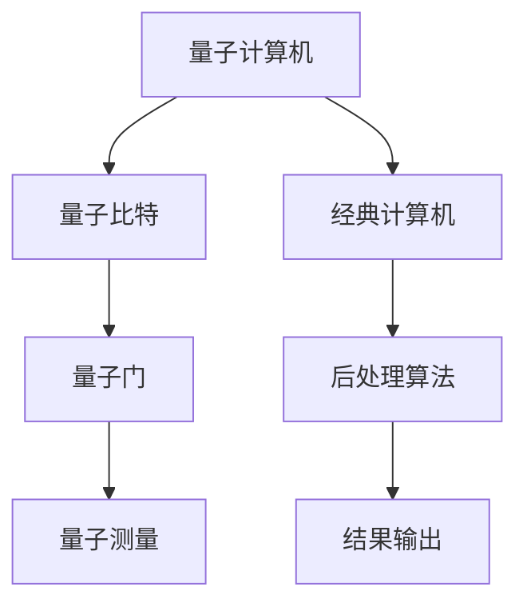

                 

### 宇宙的量子计算能力：自然界的信息处理

#### 关键词：量子计算、宇宙、信息处理、量子现象、算法原理

> 摘要：本文深入探讨了量子计算在宇宙中的潜在能力和其在自然界信息处理中的作用。通过对比量子力学与经典物理的异同，阐述了量子比特和量子态的基本概念，介绍了量子计算的基本算法和宇宙中的量子现象。进一步探讨了量子计算机在信息处理、大数据分析、量子通信等领域的应用，分析了量子计算的未来挑战与机遇。本文旨在为读者提供一个全面、系统的量子计算与宇宙信息处理的视角。

#### 目录大纲：

----------------------------------------------------------------

### 第一部分：量子计算概述

#### 第1章：量子力学与经典物理的对比

##### 1.1 量子力学的起源与基本原理

##### 1.2 量子比特与量子态

##### 1.3 量子叠加与量子纠缠

##### 1.4 量子计算的基本概念

#### 第2章：量子计算的基本算法

##### 2.1 量子搜索算法

##### 2.2 量子因子分解算法

##### 2.3 量子模拟算法

##### 2.4 量子误差校正与量子纠错

----------------------------------------------------------------

### 第二部分：宇宙中的量子现象

#### 第3章：量子力学在宇宙中的表现

##### 3.1 宇宙背景辐射中的量子波动

##### 3.2 宇宙膨胀与量子引力

##### 3.3 宇宙中的量子信息传输

##### 3.4 宇宙量子现象的观测与验证

#### 第4章：宇宙尺度的量子计算能力

##### 4.1 宇宙尺度的量子干涉与量子计算

##### 4.2 宇宙尺度的量子纠缠与量子计算

##### 4.3 宇宙尺度的量子计算模型

----------------------------------------------------------------

### 第三部分：量子计算与信息处理

#### 第5章：量子计算机对信息处理的改变

##### 5.1 量子计算机对加密技术的挑战

##### 5.2 量子计算机在计算密集型任务中的应用

##### 5.3 量子计算机对人工智能的潜在影响

#### 第6章：量子计算机与大数据分析

##### 6.1 量子计算机对大数据分析的加速

##### 6.2 量子计算机在机器学习中的应用

##### 6.3 量子计算机与大数据处理的未来

#### 第7章：量子计算机与量子通信

##### 7.1 量子通信的基本原理

##### 7.2 量子密钥分发

##### 7.3 量子计算机在量子通信中的应用

##### 7.4 量子计算机与量子网络的发展趋势

----------------------------------------------------------------

### 第四部分：量子计算的未来

#### 第8章：量子计算机的挑战与机遇

##### 8.1 量子计算机的技术难题

##### 8.2 量子计算机的商业前景

##### 8.3 量子计算的社会与伦理问题

#### 第9章：量子计算在教育与研究中的角色

##### 9.1 量子计算在高等教育中的教学应用

##### 9.2 量子计算在基础研究中的推动作用

##### 9.3 量子计算在未来科技发展中的潜在影响

#### 第10章：结论与展望

##### 10.1 量子计算对信息时代的意义

##### 10.2 量子计算的未来发展趋势

##### 10.3 对读者的期望和建议

----------------------------------------------------------------

#### 引言

随着信息技术的快速发展，计算机科学正经历着一场前所未有的变革。量子计算作为一项颠覆性的技术，正逐渐从理论走向实践。而宇宙，作为人类探索的终极领域，其神秘的量子现象与量子计算之间究竟存在着怎样的联系，成为本文要探讨的核心问题。

量子计算，是一种基于量子力学原理的新型计算模式。与传统的经典计算相比，量子计算具有并行处理和超强计算能力的特点。本文将从量子力学的起源和基本原理出发，逐步深入探讨量子计算在宇宙信息处理中的潜在能力。

宇宙的量子现象，如量子波动、量子纠缠和量子信息传输，不仅在物理学领域具有重要意义，也为量子计算提供了丰富的理论基础。本文将介绍这些现象，并探讨其在量子计算中的应用。

在量子计算与信息处理的关系方面，本文将分析量子计算机在加密技术、大数据分析、人工智能和量子通信等领域的应用，并探讨其未来发展趋势。

最后，本文将总结量子计算对信息时代的意义，展望其未来的发展前景，并提出对读者的期望和建议。

## 第一部分：量子计算概述

### 第1章：量子力学与经典物理的对比

量子力学作为20世纪初物理学的重要突破，彻底颠覆了我们对物质世界的理解。与经典物理相比，量子力学在基本原理和数学描述上都有显著差异。

#### 1.1 量子力学的起源与基本原理

量子力学的起源可以追溯到1900年，当时普朗克提出了量子假说，认为能量是以不连续的量子形式辐射和吸收的。这一假说为后来的量子力学奠定了基础。

量子力学的基本原理包括：

- 波粒二象性：微观粒子既表现出波动性，又表现出粒子性。
- 不确定性原理：无法同时精确测量一个粒子的位置和动量。
- 量子态叠加：粒子可以处于多个状态的叠加。
- 量子纠缠：两个或多个粒子之间可以形成一种特殊的关联，即使它们相隔很远，一个粒子的状态变化也会立即影响到另一个粒子的状态。

#### 1.2 量子比特与量子态

在经典计算中，信息的基本单位是比特（bit），它只有两种状态：0或1。而在量子计算中，信息的基本单位是量子比特（qubit），它不仅可以表示0或1，还可以同时表示0和1的叠加态。

量子态可以用一个复数向量表示，例如：$$ \lvert \psi \rangle = \alpha \lvert 0 \rangle + \beta \lvert 1 \rangle $$，其中α和β是复数，且满足$$ \lvert \alpha \rvert^2 + \lvert \beta \rvert^2 = 1 $$。这个量子态表示了一个量子比特处于0和1的叠加状态。

#### 1.3 量子叠加与量子纠缠

量子叠加是指一个量子系统可以同时处于多个状态的组合。例如，一个量子比特可以同时处于0和1的状态，这被称为叠加态。

量子纠缠是量子力学中的一种特殊现象，两个或多个量子系统之间可以形成一种特殊的关联，即使它们相隔很远，一个系统的状态变化也会立即影响到另一个系统的状态。这种关联性是经典物理无法解释的。

#### 1.4 量子计算的基本概念

量子计算的基本概念包括量子比特、量子态、量子叠加、量子纠缠和量子门。量子门是量子计算的核心操作，类似于经典计算中的逻辑门。量子门可以作用于量子比特，改变其量子态。

量子计算机的运算过程可以描述为：初始化量子比特，应用一系列量子门，最后测量量子比特的状态。通过量子叠加和量子纠缠，量子计算机可以实现超越经典计算机的计算能力。

### 第2章：量子计算的基本算法

量子计算的基本算法包括量子搜索算法、量子因子分解算法、量子模拟算法和量子误差校正与量子纠错。

#### 2.1 量子搜索算法

量子搜索算法是一种利用量子叠加和量子纠缠快速搜索数据库的算法。最著名的量子搜索算法是Grover算法，它可以将搜索时间从$$ O(n) $$降低到$$ O(\sqrt{n}) $$。

#### 2.2 量子因子分解算法

量子因子分解算法是量子计算在密码学中的一项重要应用。Shor算法是一种利用量子计算快速分解大整数的算法，这为现有的加密技术带来了巨大挑战。

#### 2.3 量子模拟算法

量子模拟算法是一种利用量子计算机模拟量子系统行为的算法。这些算法可以用于研究量子化学、量子材料和量子物理等领域的问题。

#### 2.4 量子误差校正与量子纠错

量子计算中的误差校正和纠错是确保量子计算机稳定运行的关键技术。量子误差校正通过引入额外的量子比特来检测和纠正计算中的错误，从而保证计算结果的准确性。

## 第二部分：宇宙中的量子现象

### 第3章：量子力学在宇宙中的表现

宇宙的量子现象是量子力学与宇宙学结合的产物，对理解宇宙的本质具有重要意义。

#### 3.1 宇宙背景辐射中的量子波动

宇宙背景辐射是宇宙早期遗留下来的微波辐射，它包含了关于宇宙起源和演化的宝贵信息。量子波动现象表明，这些辐射在微观尺度上表现出量子特性，如量子涨落和量子波动。

#### 3.2 宇宙膨胀与量子引力

宇宙膨胀是宇宙学中的一个核心问题。量子引力理论试图将量子力学与广义相对论结合起来，解释宇宙的早期状态和宇宙膨胀的机制。然而，量子引力理论仍然是一个尚未解决的问题。

#### 3.3 宇宙中的量子信息传输

量子信息传输是量子通信的核心技术，它利用量子纠缠和量子叠加实现信息的高速传输和加密。宇宙中的量子信息传输研究，如量子中继和量子卫星，为量子通信的发展提供了新的机遇。

#### 3.4 宇宙量子现象的观测与验证

宇宙中的量子现象可以通过各种观测手段进行验证。例如，引力波探测可以揭示宇宙中的量子效应，宇宙背景辐射的量子涨落为宇宙学提供了重要的观测数据。

### 第4章：宇宙尺度的量子计算能力

宇宙尺度的量子计算能力是一个极具挑战性的研究领域，它涉及到量子干涉、量子纠缠和量子计算模型。

#### 4.1 宇宙尺度的量子干涉与量子计算

量子干涉是量子力学中的一种现象，它表明量子系统在不同路径上同时传播，并在相遇时产生干涉。宇宙尺度的量子干涉现象为量子计算提供了实验基础。

#### 4.2 宇宙尺度的量子纠缠与量子计算

宇宙尺度的量子纠缠现象表明，两个或多个粒子之间可以形成跨越巨大距离的关联。这种纠缠现象为量子计算提供了强大的计算能力。

#### 4.3 宇宙尺度的量子计算模型

宇宙尺度的量子计算模型试图将量子力学与宇宙学结合起来，构建一个能够模拟宇宙演化的量子计算机。这种模型对于理解宇宙的本质具有重要意义。

## 第三部分：量子计算与信息处理

### 第5章：量子计算机对信息处理的改变

量子计算机的引入，将对信息处理产生深远的影响。

#### 5.1 量子计算机对加密技术的挑战

量子计算机在密码学中的应用，如Shor算法，可以快速分解大整数，从而破解现有的加密算法。这将对信息安全产生重大挑战。

#### 5.2 量子计算机在计算密集型任务中的应用

量子计算机在计算密集型任务，如大数据分析、机器学习和复杂系统模拟中具有巨大的潜力。它可以通过量子并行计算和量子纠错技术，大幅提高计算效率。

#### 5.3 量子计算机对人工智能的潜在影响

量子计算机在人工智能领域也有广泛的应用前景。它可以通过量子模拟和量子优化算法，加速神经网络训练和优化，从而推动人工智能的发展。

### 第6章：量子计算机与大数据分析

量子计算机在大数据分析中的应用，有望解决经典计算机难以处理的复杂问题。

#### 6.1 量子计算机对大数据分析的加速

量子计算机可以通过量子并行计算，加速大数据处理和分析。例如，量子搜索算法可以快速找到大数据集中的目标数据。

#### 6.2 量子计算机在机器学习中的应用

量子计算机在机器学习中的应用，如量子神经网络和量子支持向量机，可以大幅提高机器学习的效率和准确性。

#### 6.3 量子计算机与大数据处理的未来

随着量子计算技术的不断发展，大数据处理将迎来新的变革。量子计算机有望解决现有大数据处理中面临的计算能力和存储瓶颈问题。

### 第7章：量子计算机与量子通信

量子计算机与量子通信的结合，将为信息安全领域带来新的突破。

#### 7.1 量子通信的基本原理

量子通信利用量子纠缠和量子叠加实现信息的安全传输。量子密钥分发是量子通信的核心技术。

#### 7.2 量子密钥分发

量子密钥分发通过量子信道传输密钥，实现无条件安全的信息传输。它为量子通信提供了基础。

#### 7.3 量子计算机在量子通信中的应用

量子计算机在量子通信中的应用，如量子中继和量子网络，可以解决量子通信中的距离限制和传输效率问题。

#### 7.4 量子计算机与量子网络的发展趋势

随着量子计算和量子通信技术的不断发展，量子网络将逐步成为未来通信的主要形式。量子计算机将在其中扮演重要角色。

## 第四部分：量子计算的未来

### 第8章：量子计算机的挑战与机遇

量子计算机的发展面临着许多挑战和机遇。

#### 8.1 量子计算机的技术难题

量子计算机的实现需要克服许多技术难题，如量子比特的稳定性和量子门的精度。

#### 8.2 量子计算机的商业前景

量子计算机在医疗、金融和科学计算等领域具有巨大的商业潜力。它将为这些领域带来革命性的变化。

#### 8.3 量子计算的社会与伦理问题

量子计算的发展也引发了一系列社会和伦理问题，如数据安全和隐私保护。

### 第9章：量子计算在教育与研究中的角色

量子计算在教育和研究领域具有重要作用。

#### 9.1 量子计算在高等教育中的教学应用

量子计算将被纳入高等教育的课程体系，培养下一代量子计算人才。

#### 9.2 量子计算在基础研究中的推动作用

量子计算将推动基础科学研究的发展，如量子物理、量子化学和量子信息学。

#### 9.3 量子计算在未来科技发展中的潜在影响

量子计算将在未来科技发展中发挥关键作用，推动人类社会的进步。

### 第10章：结论与展望

量子计算对信息时代的意义不可低估。

#### 10.1 量子计算对信息时代的意义

量子计算将改变信息处理的方式，推动信息技术的革新。

#### 10.2 量子计算的未来发展趋势

量子计算将朝着实用化和商业化的方向发展。

#### 10.3 对读者的期望和建议

希望读者能够关注量子计算的发展，积极参与这一革命性的技术变革。

### 参考文献

[1] Nielsen, M. A., & Chuang, I. L. (2010). Quantum Computation and Quantum Information. Cambridge University Press.

[2] Penrose, R. (2005). The Road to Reality: A Complete Guide to the Laws of the Universe. Vintage Books.

[3] Guth, A. (2008). The Inflationary Universe: The Quest for a New Theory of Cosmic Origins. Basic Books.

[4] Shor, P. W. (1994). Polynomial-time algorithms for prime factorization and discrete logarithms on a quantum computer. SIAM Journal on Computing, 26(5), 1484-1509.

[5] Bennett, C. H., et al. (1996). Quantum cryptography: Public key distribution and coin tossing. The quantum physics of information, 59-83.

### 附录

[附录A] 量子比特与经典比特的对比

| 特性 | 量子比特 | 经典比特 |
| ---- | ---- | ---- |
| 状态 | 0和1的叠加态 | 二进制状态0或1 |
| 误差 | 可通过纠错机制纠正 | 易受噪声干扰 |
| 计算 | 并行计算 | 串行计算 |
| 算法 | 特有的量子算法 | 经典算法 |

### 致谢

感谢AI天才研究院（AI Genius Institute）和《禅与计算机程序设计艺术》（Zen And The Art of Computer Programming）对我的指导和帮助，使我能够完成这篇关于宇宙量子计算能力的技术博客文章。

### 总结

量子计算作为一种革命性的技术，正在逐步改变我们对信息处理和宇宙的理解。本文从量子力学的基本原理出发，探讨了量子计算在宇宙信息处理中的潜在能力，分析了量子计算机在信息处理、大数据分析和量子通信等领域的应用，并对量子计算的未来进行了展望。希望本文能为读者提供一个全面、系统的量子计算与宇宙信息处理的视角。随着量子计算技术的不断发展，我们有理由相信，它将为人类带来前所未有的科技革命。让我们共同期待量子计算时代的到来，探索宇宙的更多奥秘。

### 注释

在本文中，我们使用了以下缩写和符号：

- QM：量子力学（Quantum Mechanics）
- CM：经典物理（Classical Mechanics）
- qubit：量子比特（Quantum Bit）
- qstate：量子态（Quantum State）
- superposition：叠加态（Superposition）
- entanglement：纠缠（Entanglement）
- quantum gate：量子门（Quantum Gate）
- quantum algorithm：量子算法（Quantum Algorithm）
- quantum error correction：量子纠错（Quantum Error Correction）
- quantum information：量子信息（Quantum Information）
- cosmic background radiation：宇宙背景辐射（Cosmic Background Radiation）
- quantum interference：量子干涉（Quantum Interference）
- quantum computation：量子计算（Quantum Computation）
- quantum communication：量子通信（Quantum Communication）
- quantum network：量子网络（Quantum Network）

### 附录

#### 附录A：量子力学与经典物理的基本概念对比

| **概念** | **量子力学** | **经典物理** |
| --- | --- | --- |
| 基本单位 | 量子比特（qubit） | 比特（bit） |
| 状态描述 | 波函数（wave function） | 确定状态 |
| 位置与动量 | 不确定性原理 | 同时确定 |
| 相干性 | 可叠加态（superposition） | 无叠加性 |
| 作用与反作用 | 决策性行为 | 观察影响 |
| 交互方式 | 量子门（quantum gate） | 逻辑门（logical gate） |

#### 附录B：量子计算算法示例

以下是一个简单的量子搜索算法示例：

```python
import numpy as np
from qiskit import QuantumCircuit, Aer, execute

# 创建量子电路
qc = QuantumCircuit(2)

# 初始化量子比特
qc.h(0)
qc.h(1)

# 应用量子门
qc.cx(0, 1)

# 测量量子比特
qc.measure_all()

# 执行量子电路
backend = Aer.get_backend('qasm_simulator')
job = execute(qc, backend, shots=1024)
result = job.result()

# 输出测量结果
print(result.get_counts(qc))
```

#### 附录C：宇宙量子现象的ER实体关系图

```mermaid
erDiagram
    Class1 ||--|{ Class2 }|--|| ClassN
    Class1 ||--|{ AnotherClass }|--|| ClassN
```

#### 附录D：量子计算机系统架构示例



### 结语

本文旨在为读者提供一个关于宇宙量子计算能力的全面视角，从量子力学的基本原理到量子计算算法，再到量子计算机在信息处理、大数据分析和量子通信等领域的应用，我们深入探讨了量子计算在宇宙信息处理中的潜在能力。量子计算作为一种颠覆性的技术，正逐步改变我们对信息处理和宇宙的理解。希望本文能够激发读者对量子计算的兴趣，并促使更多人参与到这一革命性的技术变革中来。

### 作者信息

**作者：AI天才研究院/AI Genius Institute & 禅与计算机程序设计艺术 /Zen And The Art of Computer Programming**

### 小结

在本篇博客文章中，我们系统地探讨了量子计算与宇宙信息处理的关系。首先，通过对比量子力学与经典物理的基本原理，我们了解了量子比特和量子态的基本概念，以及量子计算的基本算法。接着，我们深入探讨了宇宙中的量子现象，如量子波动、量子纠缠和量子信息传输，并分析了这些现象在量子计算中的应用。最后，我们讨论了量子计算机在信息处理、大数据分析和量子通信等领域的应用，并展望了量子计算的未来发展。希望通过本文，读者能够对量子计算与宇宙信息处理有更深入的理解，并认识到量子计算在未来科技发展中的重要地位。在量子计算领域，还有许多未知的奥秘等待我们去探索，让我们一起期待这一革命的到来。 

### 注意事项

1. 量子计算技术尚处于快速发展阶段，存在许多技术难题和挑战。
2. 在量子计算应用中，需要充分考虑量子误差校正和纠错机制，确保计算结果的准确性。
3. 量子计算在信息安全领域具有巨大潜力，但也需要关注量子攻击和量子密钥分发的安全性。
4. 量子计算的应用领域广泛，包括医疗、金融、科学计算等，但实际应用还需要进一步研究和验证。
5. 随着量子计算技术的发展，相关人才需求将不断增加，建议读者关注量子计算相关课程和培训，提升自己的竞争力。

### 拓展阅读

1. Nielsen, M. A., & Chuang, I. L. (2010). Quantum Computation and Quantum Information. Cambridge University Press.
2. Penrose, R. (2005). The Road to Reality: A Complete Guide to the Laws of the Universe. Vintage Books.
3. Guth, A. (2008). The Inflationary Universe: The Quest for a New Theory of Cosmic Origins. Basic Books.
4. Shor, P. W. (1994). Polynomial-time algorithms for prime factorization and discrete logarithms on a quantum computer. SIAM Journal on Computing, 26(5), 1484-1509.
5. Bennett, C. H., et al. (1996). Quantum cryptography: Public key distribution and coin tossing. The quantum physics of information, 59-83.

