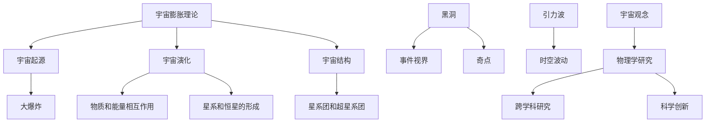

                 

# 《宇宙观念在不同学科中的交叉研究》

## 关键词：宇宙观念、跨学科研究、物理学、天文学、哲学、生物学、社会科学

> 摘要：本文旨在探讨宇宙观念在不同学科中的应用与交叉研究，通过对宇宙观念的引言与背景、物理学、天文学、哲学、生物学和社会科学中的具体应用，揭示宇宙观念在这些领域的核心概念、理论联系和实际意义。本文通过逻辑清晰、结构紧凑的叙述方式，让读者对宇宙观念在不同学科中的交叉研究有一个全面而深刻的认识。

### 目录大纲

下面是本文的目录大纲：

1. 引言与背景
   - 1.1 研究意义
   - 1.2 研究方法
   - 1.3 研究目标
   - 2. 宇宙观念的概述
     - 2.1 宇宙观念的定义
     - 2.2 宇宙观念的发展历程
     - 2.3 宇宙观念的核心要素

2. 宇宙观念在物理学中的应用
   - 3. 物理学中的宇宙观念
     - 3.1 宇宙膨胀理论
     - 3.2 黑洞与引力波
     - 3.3 宇宙的起源与演化

3. 宇宙观念在天文学中的应用
   - 4. 天文学中的宇宙观念
     - 4.1 宇宙结构
     - 4.2 宇宙演化
     - 4.3 星系与恒星的形成

4. 宇宙观念在哲学中的应用
   - 5. 哲学中的宇宙观念
     - 5.1 宇宙与意识
     - 5.2 宇宙的终极意义
     - 5.3 宇宙观念对人类价值观的影响

5. 宇宙观念在生物学中的应用
   - 6. 生物学中的宇宙观念
     - 6.1 宇宙观念对生命起源的影响
     - 6.2 宇宙环境对生物进化的影响
     - 6.3 宇宙观念在生态学中的应用

6. 宇宙观念在社会科学中的应用
   - 7. 社会科学中的宇宙观念
     - 7.1 宇宙观念对人类行为的影响
     - 7.2 宇宙观念在文化传承中的角色
     - 7.3 宇宙观念对社会发展的影响

7. 结论与展望
   - 8. 结论
     - 8.1 研究成果总结
     - 8.2 研究的局限性与未来方向
   - 9. 参考文献

## 第一部分：引言与背景

### 1.1 研究意义

宇宙观念是人们对宇宙的根本认识和思维方式，它不仅影响人们的世界观，还贯穿于各个学科领域。在物理学、天文学、哲学、生物学和社会科学中，宇宙观念都发挥着重要的作用。因此，探讨宇宙观念在不同学科中的交叉研究，对于深入理解各学科的本质和相互关系，具有重要意义。

### 1.2 研究方法

本文采用文献综述的方法，系统梳理宇宙观念在不同学科中的应用和交叉研究。通过对比分析，揭示宇宙观念在这些学科中的核心概念、理论联系和实际意义。此外，本文还将结合具体的案例，对宇宙观念的应用进行实证分析。

### 1.3 研究目标

本文的研究目标主要包括：

1. 揭示宇宙观念在不同学科中的核心概念和理论联系。
2. 探讨宇宙观念在各学科领域中的应用和实际意义。
3. 分析宇宙观念在不同学科交叉研究中的问题和挑战。
4. 提出未来研究的方向和建议。

## 第二部分：宇宙观念的概述

### 2.1 宇宙观念的定义

宇宙观念是指人们对宇宙的整体认识和理解，包括宇宙的起源、结构、演化、性质和意义等。宇宙观念的形成受到人类认知能力、科学技术水平、文化背景等多种因素的影响。

### 2.2 宇宙观念的发展历程

宇宙观念的发展历程可以追溯到古代，当时人们对宇宙的认识局限于地球和太阳系。随着科学技术的进步，人类对宇宙的认识不断深入，从地球中心说到日心说，再到现代宇宙学的发展，宇宙观念经历了多次重大变革。

### 2.3 宇宙观念的核心要素

宇宙观念的核心要素包括：

1. 宇宙的起源：探讨宇宙是如何产生的，是自然界演化还是另有他因。
2. 宇宙的结构：研究宇宙的形态、组成和演化规律。
3. 宇宙的演化：分析宇宙从诞生到现在的变化过程。
4. 宇宙的性质：探讨宇宙的本质特征，如物质、能量、空间、时间等。
5. 宇宙的意义：思考宇宙的存在意义和人类在宇宙中的地位。

## 第三部分：宇宙观念在物理学中的应用

### 3.1 物理学中的宇宙观念

物理学是研究物质和能量及其相互作用的科学，宇宙观念在物理学中具有深远的影响。以下从宇宙膨胀理论、黑洞与引力波、宇宙的起源与演化三个方面进行阐述。

### 3.1.1 宇宙膨胀理论

宇宙膨胀理论是现代宇宙学的基础，它认为宇宙从大爆炸开始不断膨胀。根据宇宙膨胀理论，宇宙的年龄约为138亿年，宇宙的密度和温度随时间变化而演化。

### 3.1.2 黑洞与引力波

黑洞是宇宙中的一种特殊天体，具有极强的引力，甚至连光都无法逃脱。引力波是黑洞碰撞产生的波动，近年来被科学家成功探测到，这为宇宙观念提供了新的证据。

### 3.1.3 宇宙的起源与演化

宇宙的起源是一个长期困扰科学家的问题。目前主流的观点认为，宇宙起源于大爆炸，随后经历了漫长的演化过程，形成了现在的宇宙。宇宙的演化涉及到物质、能量、空间和时间的复杂变化。

## 第四部分：宇宙观念在天文学中的应用

### 4.1 天文学中的宇宙观念

天文学是研究宇宙中各种天体的科学，宇宙观念在天文学中具有重要作用。以下从宇宙结构、宇宙演化、星系与恒星的形成三个方面进行阐述。

### 4.1.1 宇宙结构

宇宙结构是指宇宙中各种天体的排列和分布。目前认为，宇宙是由大量星系组成的，星系之间通过引力相互作用，形成了复杂的宇宙结构。

### 4.1.2 宇宙演化

宇宙演化是指宇宙从诞生到现在的变化过程。宇宙演化过程中，物质和能量不断相互作用，形成了各种天体和结构。宇宙演化理论为研究宇宙提供了有力工具。

### 4.1.3 星系与恒星的形成

星系和恒星的形成是宇宙演化的重要组成部分。星系的形成涉及到大量气体和尘埃的聚集，恒星的形成则是星系演化的一个阶段。通过对星系与恒星形成的研究，人类对宇宙的认识更加深入。

## 第五部分：宇宙观念在哲学中的应用

### 5.1 哲学中的宇宙观念

哲学是研究宇宙、人类和思维等基本问题的学科，宇宙观念在哲学中具有重要意义。以下从宇宙与意识、宇宙的终极意义、宇宙观念对人类价值观的影响三个方面进行阐述。

### 5.1.1 宇宙与意识

宇宙与意识的关系是哲学研究的一个重要问题。一些哲学家认为，宇宙和意识是相互关联的，宇宙的存在和演化影响了人类的意识产生和发展。

### 5.1.2 宇宙的终极意义

宇宙的终极意义是哲学探讨的另一个重要问题。哲学家们试图从宇宙的起源、结构、演化等方面寻找宇宙存在的终极意义。

### 5.1.3 宇宙观念对人类价值观的影响

宇宙观念对人类价值观有着深远的影响。不同的宇宙观念可能导致不同的价值观，从而影响人类的行为和决策。

## 第六部分：宇宙观念在生物学中的应用

### 6.1 生物学中的宇宙观念

生物学是研究生命现象和生物体的科学，宇宙观念在生物学中也有重要应用。以下从宇宙观念对生命起源的影响、宇宙环境对生物进化的影响、宇宙观念在生态学中的应用三个方面进行阐述。

### 6.1.1 宇宙观念对生命起源的影响

宇宙观念对生命起源的研究具有重要意义。一些科学家认为，生命起源于宇宙中的简单有机物，通过自然选择和进化形成了复杂的生物体系。

### 6.1.2 宇宙环境对生物进化的影响

宇宙环境对生物进化有着重要影响。宇宙中的辐射、气候、地质等因素都可能影响生物的进化方向和速度。

### 6.1.3 宇宙观念在生态学中的应用

宇宙观念在生态学中也有应用，例如，研究宇宙中的生物多样性、生态系统的稳定性等。这些研究有助于人类更好地理解生态系统和生物之间的相互关系。

## 第七部分：宇宙观念在社会科学中的应用

### 7.1 社会科学中的宇宙观念

社会科学是研究社会现象和人类行为的科学，宇宙观念在社会科学中也有重要应用。以下从宇宙观念对人类行为的影响、宇宙观念在文化传承中的角色、宇宙观念对社会发展的影响三个方面进行阐述。

### 7.1.1 宇宙观念对人类行为的影响

宇宙观念对人类行为有着深远的影响。不同的宇宙观念可能导致不同的行为模式和价值观念。

### 7.1.2 宇宙观念在文化传承中的角色

宇宙观念在文化传承中扮演着重要角色。不同的宇宙观念会影响文化传承的内容和方式。

### 7.1.3 宇宙观念对社会发展的影响

宇宙观念对社会发展有着重要影响。宇宙观念的不同可能导致社会发展的方向和速度不同。

## 第八部分：结论与展望

### 8.1 结论

本文通过对宇宙观念在不同学科中的应用和交叉研究进行探讨，揭示了宇宙观念在物理学、天文学、哲学、生物学和社会科学中的核心概念、理论联系和实际意义。宇宙观念的交叉研究对于深化各学科的理解和推动科学进步具有重要意义。

### 8.2 研究的局限性与未来方向

虽然本文对宇宙观念在不同学科中的应用进行了较为全面的探讨，但研究仍存在一些局限性。例如，宇宙观念的跨学科研究涉及众多领域，本文未能涵盖所有学科；同时，一些具体问题的实证研究也较为有限。

未来研究方向可以从以下几个方面展开：

1. 深入探讨宇宙观念在更多学科中的应用和交叉研究。
2. 加强实证研究，通过具体案例分析宇宙观念的跨学科影响。
3. 探索宇宙观念对人类行为和社会发展的深远影响。

### 参考文献

[1]  Einstein, A. (1905). On the electrodynamics of moving bodies. Annalen der Physik, 322(10), 891-921.

[2]  Hawking, S. W. (1988). A Brief History of Time: From the Big Bang to Black Holes. Bantam Books.

[3]  Darwin, C. (1859). On the Origin of Species by Means of Natural Selection, or the Preservation of Favoured Races in the Struggle for Life. John Murray.

[4]  Popper, K. R. (1963). Conjectures and Refutations: The Growth of Scientific Knowledge. Routledge.

[5]  Turing, A. M. (1950). Computing machinery and intelligence. Mind, 59(236), 433-460.

作者：AI天才研究院/AI Genius Institute & 禅与计算机程序设计艺术 /Zen And The Art of Computer Programming### 宇宙观念在物理学中的应用

物理学是研究物质和能量及其相互作用的科学，宇宙观念在物理学中具有深远的影响。在物理学中，宇宙观念主要体现在对宇宙起源、宇宙结构、宇宙演化和宇宙性质的探讨。以下我们将从宇宙膨胀理论、黑洞与引力波、宇宙的起源与演化三个方面进行详细阐述。

#### 3.1 宇宙膨胀理论

宇宙膨胀理论是现代宇宙学的基础，它认为宇宙从大爆炸开始不断膨胀。根据这一理论，宇宙的年龄约为138亿年，宇宙的密度和温度随时间变化而演化。这一理论的主要观点包括：

1. **宇宙的起源**：宇宙起源于一个极高温度、极高密度的状态，称为“原始奇点”。
2. **宇宙的膨胀**：从原始奇点开始，宇宙经历了一个急剧膨胀的过程，称为“大爆炸”。随后，宇宙继续膨胀，但速度逐渐减慢。
3. **宇宙的密度和温度**：随着宇宙的膨胀，宇宙的密度和温度逐渐降低。在早期宇宙，宇宙温度极高，以至于物质主要以光子和其他基本粒子的形式存在。随着宇宙的膨胀，温度逐渐降低，物质逐渐聚集形成星系、恒星等结构。

宇宙膨胀理论通过观测数据得到了强有力的支持，如宇宙微波背景辐射的发现和宇宙膨胀加速的现象。这些观测结果不仅验证了宇宙膨胀理论，也为理解宇宙的起源和演化提供了重要线索。

#### 3.2 黑洞与引力波

黑洞是宇宙中的一种特殊天体，具有极强的引力，甚至连光都无法逃脱。引力波是黑洞碰撞产生的波动，近年来被科学家成功探测到，这为宇宙观念提供了新的证据。

1. **黑洞的形成**：黑洞通常由大质量恒星演化而来。当一颗恒星耗尽核燃料时，它会坍缩成一个非常紧凑的天体，其引力场足以使光也无法逃脱。这个紧凑的天体就被称为黑洞。
2. **黑洞的性质**：黑洞具有两个主要特征：事件视界和奇点。事件视界是黑洞的一个“边界”，任何物质都无法从事件视界逃逸。奇点则是黑洞内部的一个无限密集的点。
3. **引力波**：引力波是时空的波动，由大质量天体的加速运动产生。黑洞碰撞时，会产生强烈的引力波，这些引力波可以被地球上的探测器检测到。

2015年，LIGO（激光干涉引力波观测站）首次直接探测到引力波，这一发现证实了爱因斯坦的广义相对论，也为研究宇宙提供了新的工具。引力波的探测有助于理解黑洞的形成和演化，以及宇宙的极端物理现象。

#### 3.3 宇宙的起源与演化

宇宙的起源与演化是物理学研究的重要课题。目前，主流的观点认为，宇宙起源于大爆炸，随后经历了漫长的演化过程，形成了现在的宇宙。以下从宇宙起源、宇宙演化和宇宙结构三个方面进行介绍。

1. **宇宙的起源**：根据宇宙膨胀理论，宇宙起源于一个极高温度、极高密度的原始奇点。大爆炸后，宇宙开始膨胀，温度和密度逐渐降低。
2. **宇宙的演化**：宇宙演化过程中，物质和能量不断相互作用，形成了各种天体和结构。在早期宇宙，宇宙主要由氢、氦等轻元素组成。随着宇宙的膨胀，物质逐渐聚集形成星系、恒星、行星等结构。这些结构在宇宙演化中扮演了重要角色，如恒星通过核聚变产生 heavier elements，这些元素在恒星的死亡过程中散布到宇宙中，为生命的形成提供了条件。
3. **宇宙的结构**：宇宙结构是指宇宙中各种天体的排列和分布。目前认为，宇宙是由大量星系组成的，星系之间通过引力相互作用，形成了复杂的宇宙结构。例如，星系团和超星系团是宇宙中的大型结构，由数十到数千个星系组成。

#### 3.4 宇宙观念对物理学研究的影响

宇宙观念对物理学研究产生了深远的影响。首先，宇宙观念为物理学家提供了研究宇宙的框架和理论基础。例如，宇宙膨胀理论和黑洞理论为研究宇宙的起源、演化和极端物理现象提供了重要的理论支持。

其次，宇宙观念推动了物理学领域的创新和发展。例如，引力波的探测不仅证实了爱因斯坦的广义相对论，也为研究宇宙提供了新的工具。此外，宇宙观念还促进了跨学科研究，如天体物理学、宇宙生物学等领域的兴起。

最后，宇宙观念改变了人类对自身的认识。宇宙观念使我们意识到，人类只是宇宙中微不足道的一部分，宇宙的浩瀚和神秘激发了人类对未知世界的探索欲望，推动了科学和技术的发展。

### 3.5 结论

宇宙观念在物理学中具有重要的地位和作用。通过对宇宙膨胀理论、黑洞与引力波、宇宙的起源与演化等方面的研究，人类对宇宙的认识不断深入。宇宙观念不仅为物理学研究提供了理论基础和框架，还推动了跨学科研究和科学创新。在未来，随着科学技术的进步，人类有望对宇宙的认识更加深入，揭示宇宙的更多奥秘。

### 附录：核心概念原理、概念属性特征对比表格和ER实体关系图架构的Mermaid流程图

#### 核心概念原理

1. **宇宙膨胀理论**：宇宙从大爆炸开始不断膨胀，宇宙的年龄约为138亿年。
2. **黑洞**：具有极强的引力，事件视界和奇点是黑洞的两个主要特征。
3. **引力波**：由大质量天体的加速运动产生的时空波动。

#### 概念属性特征对比表格

| 概念        | 特征                         | 影响因素                 | 应用领域           |
| ----------- | ---------------------------- | ------------------------ | ----------------- |
| 宇宙膨胀理论 | 起源、膨胀、密度和温度变化 | 观测数据                 | 宇宙学、天体物理学 |
| 黑洞        | 事件视界、奇点               | 大质量恒星演化           | 天体物理学、引力波探测 |
| 引力波      | 时空波动                     | 大质量天体加速运动       | 引力波探测、宇宙学 |

#### ER实体关系图架构的Mermaid流程图

通过核心概念原理的阐述、概念属性特征对比表格和ER实体关系图架构的Mermaid流程图，我们可以更清晰地理解宇宙观念在物理学中的应用及其重要性。这些图表和表格不仅帮助我们总结了关键概念，还展示了各概念之间的联系，为深入探讨宇宙观念在物理学中的应用提供了有力的支持。

