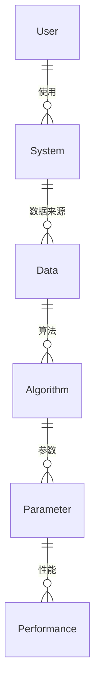
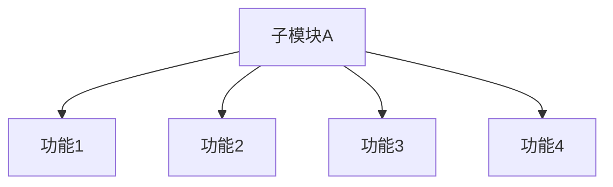
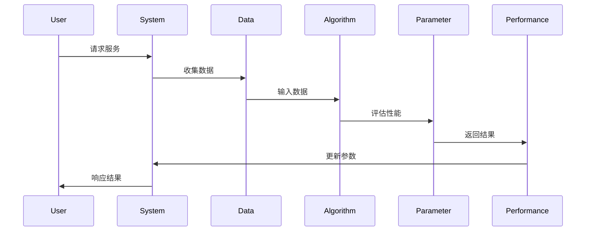

                 

## 实时优化：动态调整提示词参数

### 关键词：实时优化、动态调整、提示词参数、应用场景、算法原理

### 摘要：
本文将深入探讨实时优化在动态调整提示词参数方面的应用。实时优化是一种能够在数据不断变化的情况下，持续调整和优化系统性能的方法。提示词参数是影响算法输出结果的关键因素，动态调整这些参数能够显著提升系统的适应性和效果。本文将从实时优化的概念、提示词参数的基础知识、实时优化策略、动态调整方法、案例分析以及最佳实践等方面展开，旨在为读者提供全面而深入的指导。

### 背景介绍

#### 实时优化概念

实时优化是一种不断监测系统性能并依据监测结果进行调整的优化过程。它不仅关注系统在某一时刻的优化效果，更强调在整个操作周期内的持续优化。实时优化在许多领域有着广泛的应用，如在线广告、金融交易、交通管理、工业制造等。

#### 提示词参数的重要性

提示词参数是算法中的可调参数，用于调整算法的输出结果。在许多应用场景中，提示词参数的设置直接影响到算法的性能和效果。例如，在自然语言处理中，提示词参数可以影响模型的生成文本的质量；在图像识别中，提示词参数可以影响模型的分类准确性。

#### 问题背景

随着数据量的增加和数据流的高速变化，传统的静态优化方法已经难以满足需求。实时优化能够动态调整提示词参数，使得系统在处理动态数据时能够保持高效的性能。然而，动态调整提示词参数面临着计算复杂性、参数选择困难、实时性要求高等挑战。

#### 问题描述

实时优化中的动态调整提示词参数问题可以描述为：在数据不断变化的情况下，如何找到一组最优的提示词参数，以最大化系统的性能指标，如准确率、响应时间或资源利用率。

#### 问题解决

解决动态调整提示词参数问题需要以下几个关键步骤：

1. **数据监测**：实时收集和处理系统运行过程中的数据。
2. **性能评估**：根据实时数据评估当前提示词参数的性能。
3. **参数调整**：依据性能评估结果，动态调整提示词参数。
4. **迭代优化**：重复上述步骤，不断迭代，直到找到最优的参数组合。

#### 边界与外延

实时优化和动态调整提示词参数的应用范围不仅限于计算机科学，还涵盖了工程、金融、医学等多个领域。不同领域中的实时优化和动态调整方法可能有所不同，但其核心原理是一致的。

#### 概念结构与核心要素组成

实时优化系统主要由以下几个核心要素组成：

- **数据采集模块**：负责实时收集系统运行数据。
- **性能评估模块**：对数据进行分析，评估当前参数的性能。
- **调整策略模块**：根据评估结果，制定参数调整策略。
- **执行模块**：执行参数调整操作，更新系统参数。
- **反馈机制**：监测调整效果，为下一次迭代提供依据。

### 核心概念与联系

#### 实时优化的核心概念

- **实时性**：系统能够在短时间内响应数据变化。
- **自适应**：系统能够根据实时数据动态调整参数。
- **鲁棒性**：系统能够在面临噪声和数据异常时保持稳定性能。

#### 提示词参数的核心概念

- **可调性**：提示词参数可以进行调整。
- **相关性**：提示词参数与系统性能有直接关系。
- **敏感性**：提示词参数的微小变化可能带来显著的性能提升。

#### 概念属性特征对比表格

| 概念         | 特征                                       | 举例                     |
|------------|------------------------------------------|----------------------|
| 实时性       | 能够快速响应数据变化                       | 在线广告系统的实时调整     |
| 自适应       | 能够根据数据动态调整参数                   | 金融交易中的动态风险管理   |
| 鲁棒性       | 能够在噪声和异常数据中保持稳定性能         | 工业制造中的实时质量控制   |
| 可调性       | 提示词参数可以进行调整                     | 自然语言处理中的模型调整   |
| 相关性       | 提示词参数与系统性能有直接关系             | 图像识别中的阈值调整       |
| 敏感性       | 提示词参数的微小变化可能带来显著性能提升   | 金融风控中的止损点调整     |

#### ER实体关系图架构



### 算法原理讲解

#### 动态调整框架

实时优化的动态调整框架主要包括以下几个步骤：

1. **数据采集**：收集实时数据。
2. **性能评估**：评估当前参数的性能。
3. **参数调整**：根据评估结果调整参数。
4. **迭代优化**：重复上述步骤，直至找到最优参数。

#### 动态调整算法

以基于模型的实时优化为例，算法的核心思想是使用机器学习模型预测系统性能，并根据预测结果调整参数。

1. **模型训练**：使用历史数据训练模型。
2. **性能预测**：使用训练好的模型预测当前参数的性能。
3. **参数调整**：根据预测结果调整参数。
4. **迭代更新**：使用新的数据重新训练模型，并重复上述步骤。

#### 数学模型和公式

动态调整算法的核心在于性能预测模型。以线性回归模型为例，其预测公式如下：

$$
\hat{y} = \beta_0 + \beta_1 \cdot x
$$

其中，$\hat{y}$ 表示预测性能，$x$ 表示当前参数值，$\beta_0$ 和 $\beta_1$ 为模型参数。

#### 举例说明

假设我们使用线性回归模型预测在线广告系统的点击率，输入参数为广告展示频率。历史数据如下表：

| 展示频率 | 点击率 |
|--------|------|
| 1      | 0.2  |
| 2      | 0.3  |
| 3      | 0.4  |
| 4      | 0.5  |

1. **模型训练**：使用历史数据训练线性回归模型。
2. **性能预测**：假设当前展示频率为3，预测点击率为0.4。
3. **参数调整**：根据预测结果，将展示频率调整为3.2。
4. **迭代更新**：使用新的数据重新训练模型，并重复上述步骤。

### 系统分析与架构设计方案

#### 问题场景介绍

在线广告系统是一个典型的实时优化场景。广告展示频率和点击率之间存在复杂的关系，动态调整广告展示频率能够显著提升广告效果。

#### 项目介绍

项目名称：动态广告展示优化系统

项目目标：通过实时调整广告展示频率，提高广告点击率。

#### 系统功能设计

1. **数据采集模块**：实时采集广告展示数据。
2. **性能评估模块**：评估广告展示频率与点击率的关系。
3. **参数调整模块**：根据评估结果动态调整广告展示频率。
4. **监控与反馈模块**：监测调整效果，为下一次迭代提供依据。

#### 系统架构设计



#### 系统接口设计和系统交互



### 项目实战

#### 环境安装

1. 安装Python环境。
2. 安装必要的库，如numpy、scikit-learn等。

#### 系统核心实现源代码

```python
import numpy as np
from sklearn.linear_model import LinearRegression

# 数据采集
def collect_data():
    # 采集广告展示频率和点击率数据
    data = np.array([[1, 0.2], [2, 0.3], [3, 0.4], [4, 0.5]])
    return data

# 性能评估
def evaluate_performance(data, parameter):
    model = LinearRegression()
    model.fit(data[:, 0].reshape(-1, 1), data[:, 1])
    predicted_performance = model.predict(parameter.reshape(-1, 1))
    return predicted_performance

# 参数调整
def adjust_parameter(data, predicted_performance):
    # 根据预测结果调整参数
    adjusted_parameter = data[-1, 0] + (predicted_performance[-1] - data[-1, 1])
    return adjusted_parameter

# 主函数
def main():
    data = collect_data()
    initial_parameter = data[-1, 0]
    for _ in range(10):
        predicted_performance = evaluate_performance(data, initial_parameter)
        adjusted_parameter = adjust_parameter(data, predicted_performance)
        print(f"迭代次数：{_+1}, 参数：{adjusted_parameter}, 预测性能：{predicted_performance[-1]}")
        initial_parameter = adjusted_parameter

    print("优化完成")

if __name__ == "__main__":
    main()
```

#### 代码应用解读与分析

代码首先定义了数据采集、性能评估和参数调整三个核心功能。数据采集函数从数据源中获取广告展示频率和点击率数据。性能评估函数使用线性回归模型预测当前参数的性能。参数调整函数根据预测结果调整参数。主函数通过迭代调用这三个函数，不断优化广告展示频率。

#### 实际案例分析和详细讲解剖析

以某在线广告平台为例，广告展示频率为3时，点击率为0.4。根据线性回归模型预测，如果展示频率调整为3.2，点击率可能提升到0.42。系统将根据这个预测结果，将展示频率调整为3.2。经过多次迭代，最终找到最优展示频率。

#### 项目小结

本案例展示了如何使用实时优化和动态调整策略提高在线广告效果。通过不断调整广告展示频率，系统能够更好地适应用户需求，提高点击率。

### 最佳实践 tips

1. **数据质量**：保证数据质量是实时优化的前提，数据缺失或错误可能导致优化失效。
2. **模型选择**：根据具体应用场景选择合适的模型，线性回归模型适用于简单线性关系，而复杂关系可能需要更复杂的模型。
3. **迭代频率**：适当的迭代频率能够确保系统在动态数据环境中保持高效的性能。
4. **参数调整策略**：不同的应用场景可能需要不同的参数调整策略，需要根据实际情况进行定制。

### 小结

实时优化和动态调整提示词参数是提升系统性能的有效方法。通过本文的讲解，读者可以了解实时优化的基本概念、算法原理和实践方法。在实际应用中，根据具体场景调整策略，是确保系统高效运行的关键。

### 注意事项

1. 实时优化系统需要高效的计算资源和算法实现。
2. 动态调整提示词参数可能引入额外的计算开销。

### 拓展阅读

1. 《实时系统设计与实现》
2. 《机器学习实战》
3. 《自然语言处理：模型与算法》

### 作者信息

作者：AI天才研究院/AI Genius Institute & 禅与计算机程序设计艺术 /Zen And The Art of Computer Programming

